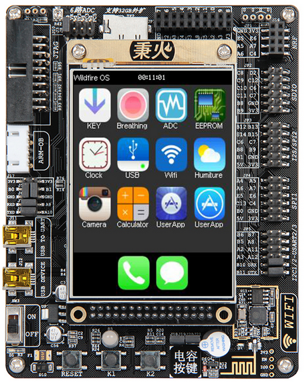

.. vim: syntax=rst

* *野火其它的STM32固件库、RTOS和GUI的书籍* *

如何使用本书
------------

本书的学习顺序
~~~~~~~~~~~~~~

本书分为基础入门篇和提高篇，入门篇需要按照顺序学习，讲究循序渐进，步步为营。学习完基础篇之后，应该算基本入门M3。提高篇属于高级例程，学习的时候并不一定要按照书中的章节排序，可根据需要跳跃式的学习。

本书的参考资料
~~~~~~~~~~~~~~

本书参考资料为：《STM32F10X-中文参考手册》和《Cortex-M3权威指南》，这两本是ST官方的手册，属于精华版，面面俱到，无所不包。限于篇幅问题，本书不可能面面具到，着重框图分析和代码讲解，有关寄存器的详细描述则略过，在学习本书的时候，涉及到寄存器描述部分还请参考这两本手册，这样学习效果会更佳。

本书的编写风格
~~~~~~~~~~~~~~~~~~~~~~~~~~~~

本书着重讲解F103的外设以及外设的应用，力争全面分析每个外设的功能框图和外设的使用方法，让读者可以零死角的玩转STM32—F103系列。基本每个章节对应一个外设，每章的主要内容大概分为三个部分，第一部分为简介，第二部分为外设功能框图分析，第三部分为代码讲解。

外设简介则是用自己的话把外设概括性的介绍一遍，力图语句简短，通俗易懂，并不会完全照抄数据手册的介绍。

外设功能框图分析则是章节的重点，该部分会详细讲解功能框图的每个部分的作用，这是学习F103的精髓所在，掌握了整个外设的框图则可以熟练的使用该外设，熟练的编程，日后学习其他型号的单片机，也将会得心应手。因为即使单片机的型号不同，外设的框图还是基本一样的。这一步的学习比较枯燥，但是必须死磕，方能达成所愿。

代码分析则是讲解使用该外设的实验讲解，主要分析代码流程，和一些编程的注意事项。在掌握了框图之后，代码部分则是手到擒来而已。

本书的配套硬件
~~~~~~~~~~~~~~

本书配套的硬件平台为：野火STM32-F103VE-指南者，型号简称“指南者  ”，学习的时候如果配套该硬件平台做实验，学习必会达到事半功倍的效果，可以省去中间移植时遇到的各种问题。

图 1-1 野火STM32F103—指南者

本书的技术论坛
~~~~~~~~~~~~~~

如果在学习过程中遇到问题，可以到论坛：\ `www.firebbs.cn  <http://www.firebbs.cn>`_ 发帖交流
，开源共享，共同进步。

鉴于水平有限，本书难免有纰漏，热心的读者也可把勘误发到论坛好让我们改进做得更好，祝您学习愉快，M3的世界，野火与您同行。

