.. vim: syntax=rst

使用STM32CubeMX新建工程
-----------------------

STM32Cube是一项意法半导体的原创活动, 通过减少开发工作、时间和成本,
使开发者的开发工作更轻松。STM32Cube
是一个全面的软件平台，包括了ST产品的每个系列。(如，STM32CubeF1是针对STM32F1系列)。平台包括了STM32Cube
硬件抽象层和一套的中间件组件(RTOS，USB，FS，TCP/IP，Graphics，等等)。

软件安装
~~~~~~~~~~~~~~~~~

必备软件：Java（V1.7及以上版本）和STM32CubeMX（版本5.3.0）

Java下载地址：\ `www.java.com/zh_CN/ <https://www.java.com/zh_CN/>`__

STM32CubeMX下载地址：ST官网搜索STM32CubeMX

安装Java软件

双击安装包“JavaSetup8u151.exe”，具体操作步骤如下：

.. image:: media/image1.png
   :align: center
   :alt: 图 10‑1 Java安装步骤1
   :name: 图10_1

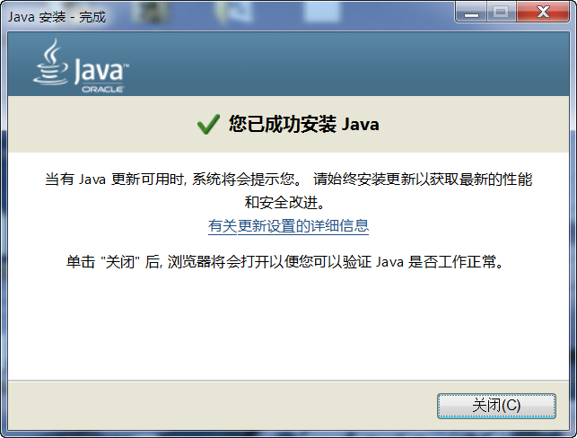

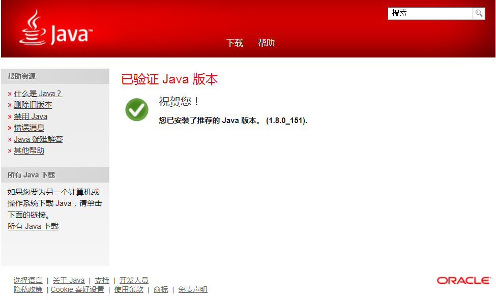

在本地新建好文件夹后，把准备好的库文件添加到相应的文件夹下：

安装STM32CubeMX软件
**********************

双击安装包“SetupSTM32CubeMX-5.3.0.exe”，具体操作步骤如下：

.. image:: media/image4.png
   :align: center
   :alt: 图 10‑4 STM32CubeMX启动安装
   :name: 图10_4

.. image:: media/image5.png
   :align: center
   :alt: 图 10‑5 STM32CubeMX接受本许可协议的条款
   :name: 图10_5

.. image:: media/image6.png
   :align: center
   :alt: 图 10‑6 STM32CubeMX指定安装路径
   :name: 图10_6

.. image:: media/image7.png
   :align: center
   :alt: 图 10‑7 STM32CubeMX创建快捷方式
   :name: 图10_7

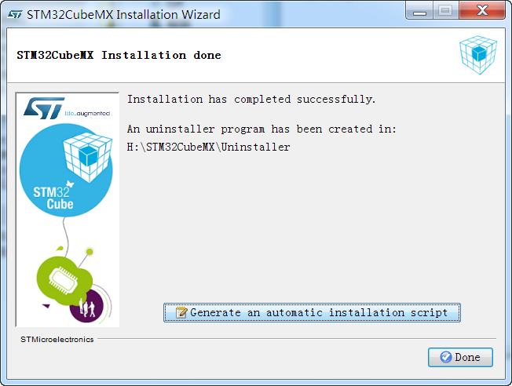

新建工程
~~~~~~~~~~~~~~~~~~~~~

新建工程
*********************

打开STM32CubeMX，软件会更新一些组件，等待安装完成即可。

.. image:: media/image9.png
   :align: center
   :alt: 图 10‑9 CubeMX安装组件
   :name: 图10_9

选择CPU型号
......................

这个根据你开发板使用的CPU具体的型号来选择，
M3指南者选STM32F103VET型号。我们直接在搜索框输入型号STM32F103VE最终确认STM32F103VETx为我们实际使用型号。

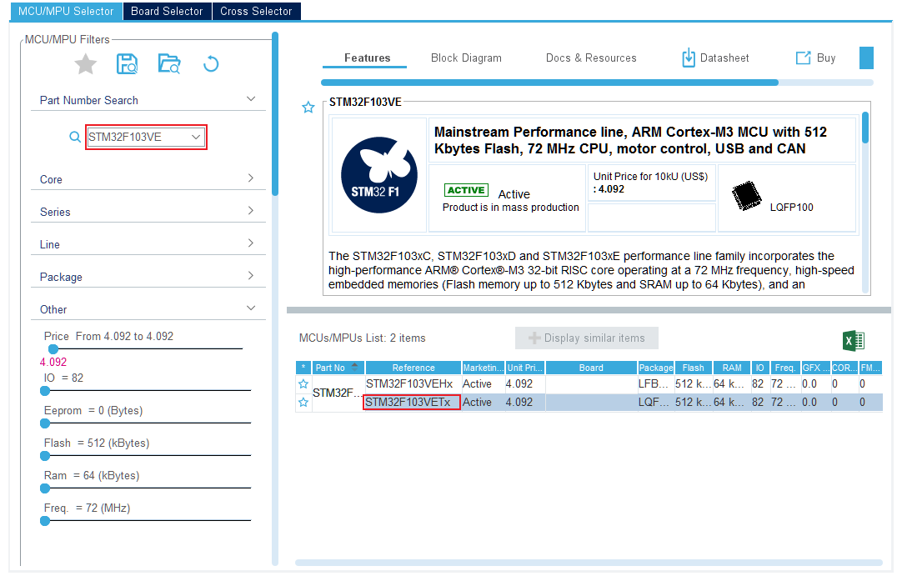

确认时钟源
......................

进入工程后打开RCC选项，选择Crystal/Ceramic
Resonator，即使用外部晶振作为HSE的时钟源。

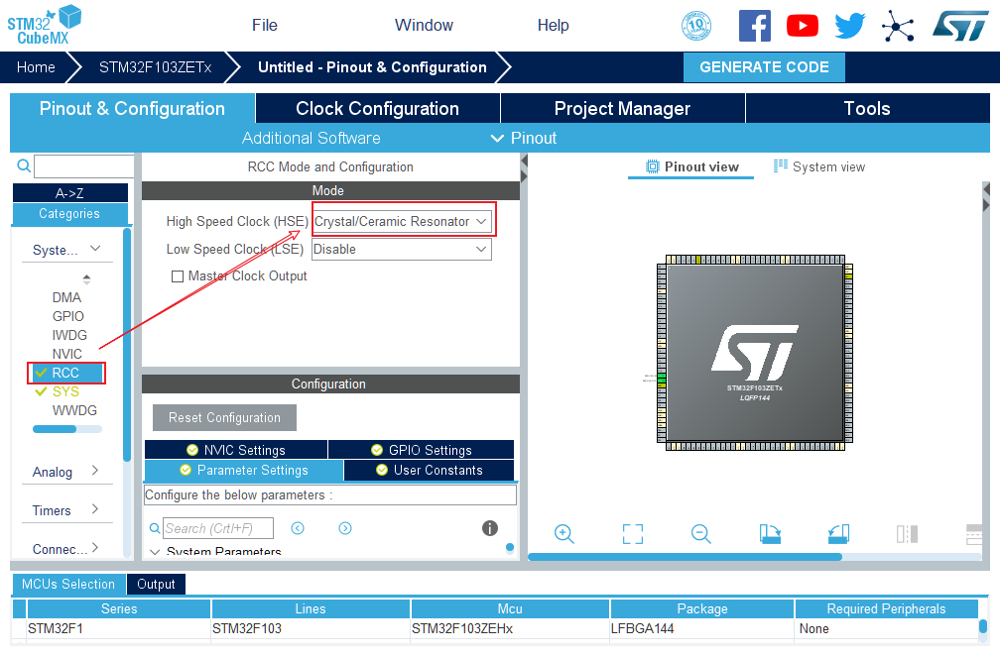

配置IO口
......................

这个工程简单控制一个LED周期闪烁，我们只需要配置一个IO即可，这里选定控制红色LED的引脚PB5，通过搜索框搜索可以定位IO口的引脚位置，图中会闪烁显示，配置PB5的属性为GPIO_Output。

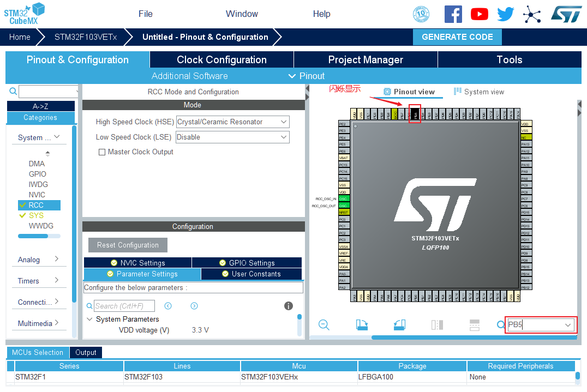

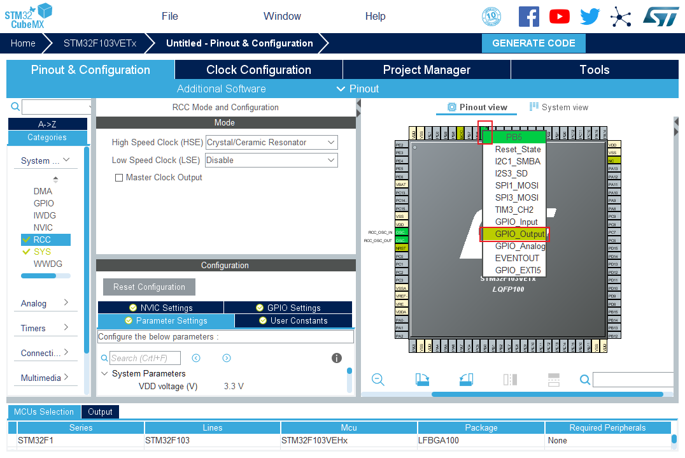

配置系统时钟
......................

开发板的外部晶振为8MHz，我们填入8；通道选择LSE；PLLM选择为/1；倍频系数N选择为x9；系统时钟选择PLLCLK；系统时钟设定为72Mz；APB1分频系数选择为/2即PCLK1位36MHz；APB2分频系数选择为/1即PCLK2位72MHz。

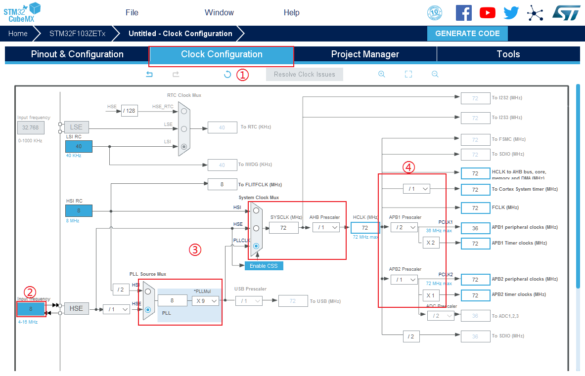

进一步配置IO的具体属性
............................................

点击Configuration，进入系统详细配置，选着GPIO，配置PB5的默认电平，开漏输出，无上下拉，低速模式。引脚标签为LED_R。

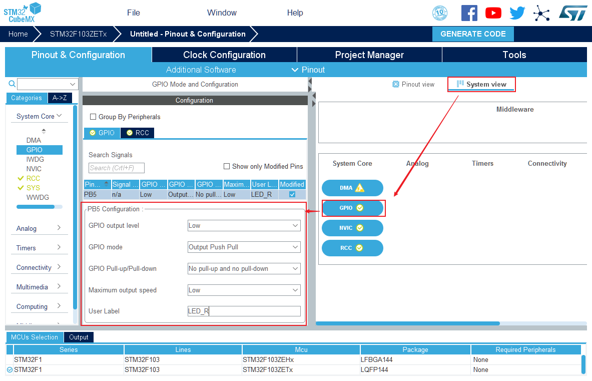

配置工程属性
......................

为了防止出现，烧录以后仿真器无法连接的情况，我们在Pinout里将SYS里面的Debug设置成Serial
Wire,这样问题得到解决。

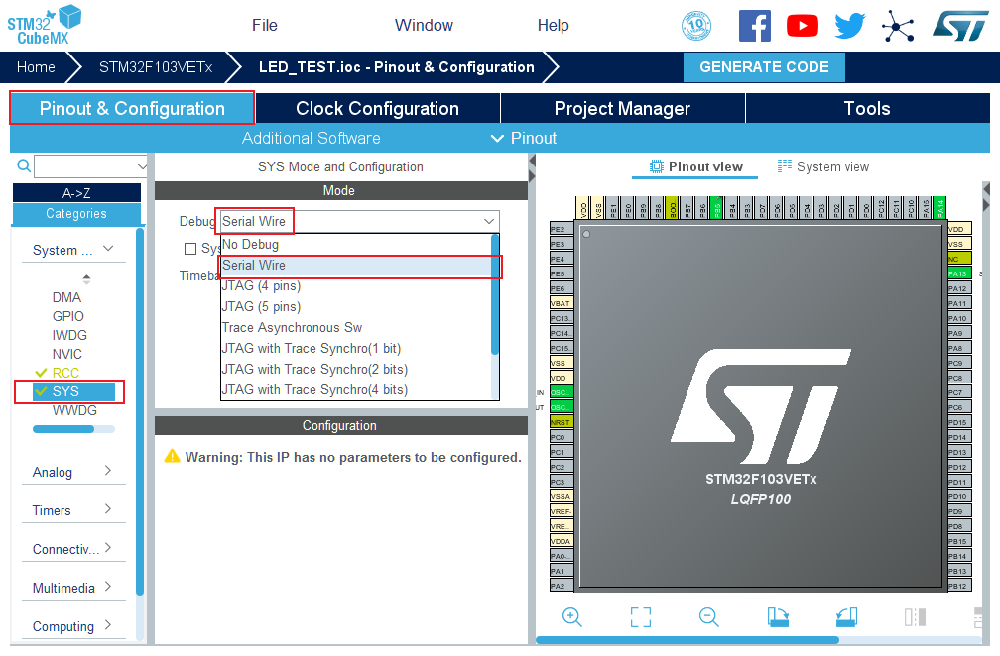

接着选择Project
Manager选项，配置工程的名称，路径，使用的IDE工具，堆栈大小。注意不要使用中文路径和工程名称。

.. image:: media/image17.png
   :align: center
   :alt: 图 10‑16 配置工程属性
   :name: 图10_16

生成代码
......................

点击GENERATE CODE,在设定的路径成功生成代码，选着打开工程。

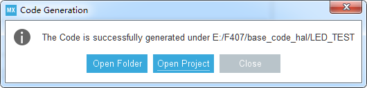

添加用户测试代码
......................

打开工程后在main函数中的主循环插入用户代码，目的是让红色LED周期闪烁。

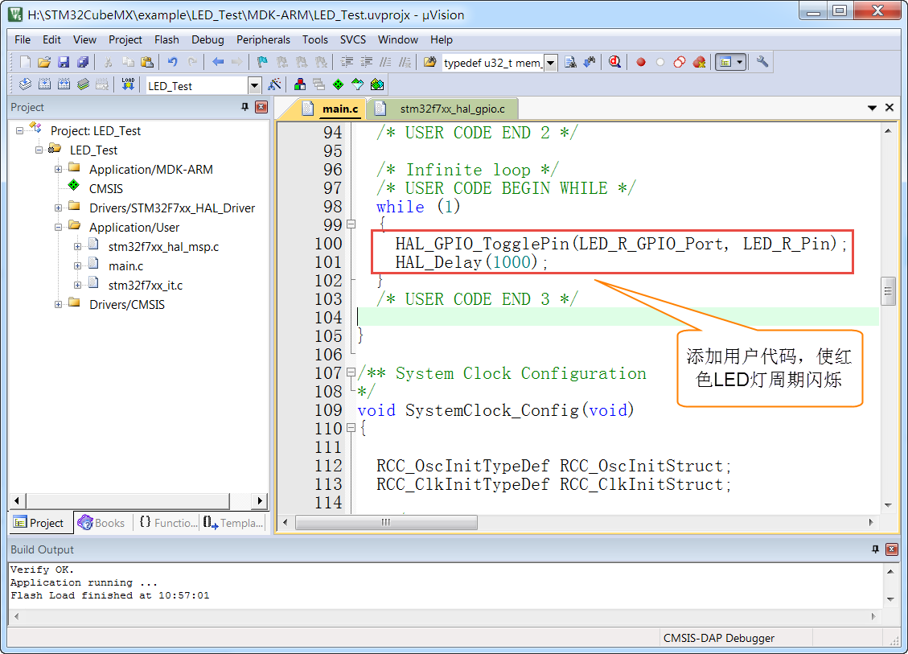

配置下载调试工具
......................

配置下载工具为CMSIS-DAP，程序下载完后复位并运行。

.. image:: media/image20.png
   :align: center
   :alt: 图 10‑19配置下载调试工具
   :name: 图10_19

下载验证
*******************

把编译好的程序下载到开发板并复位，可看到板子上的红色灯会周期闪烁。
