.. vim: syntax=rst

新建工程—库函数版
-----------------

了解STM32的HAL库文件之后，我们就可以使用它来建立工程了，因为用库新建工程的步骤较多，我们一般是使用库建立一个空的工程，作为工程模板。以后直接复制一份工程模板，在它之上进行开发。

本章的“工程模板”范例可在配套资料中找到，自己新建工程模版时可参考该工程。

新建工程
~~~~~~~~

本章内容所涉及的软件只供教学使用，不得用于商业用途。个人或公司因商业用途导致的法律责任，后果自负。

版本说明：MDK5.15 (MDK即KEIL软件)

版本号可从MDK软件的“Help-->About uVision”选项中查询到。

新建本地工程文件夹
^^^^^^^^^^^^^^^^^^

为了工程目录更加清晰，我们在本地电脑上新建一个“工程模板”文件夹，在它之下再新建6个文件夹，具体如下：

表 11‑1 工程目录文件夹清单

========= ===================================================
名称      作用
Doc       用来存放程序说明的文件，由写程序的人添加
Libraries 存放的是库文件
Listing   存放编译器编译时候产生的C/汇编/链接的列表清单
Output    存放编译产生的调试信息、hex文件、预览信息、封装库等
Project   用来存放工程
User      用户编写的驱动文件
========= ===================================================

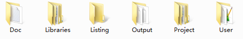

在本地新建好文件夹后，把准备好的库文件添加到相应的文件夹下：

表 11‑2 工程目录文件夹内容清单

========= =============================================================
名称      作用
Doc       工程说明.txt
Libraries CMSIS：里面放着跟CM3内核有关的库文件
\         STM32F1xx_HAL_Driver：STM32 外设库文件
Listing   暂时为空
Output    暂时为空
Project   暂时为空
User      stm32f1xx_hal_conf.h：用来配置库的头文件
\            | stm32f1xx_it.h
             | stm32f1xx_it.c：中断相关的函数都在这个文件编写，暂时为空
\         main.c：main函数文件
========= =============================================================

新建工程
^^^^^^^^

打开KEIL5，新建一个工程，工程名根据喜好命名，我这里取Template（中文是模版的意思），保存在Project\RVMDK（uv5）文件夹下。

选择CPU型号
'''''''''''

这个根据你开发板使用的CPU具体的型号来选择，
M3指南者选STM32F103VE型号。如果这里没有出现你想要的CPU型号，或者一个型号都没有，那么肯定是你的KEIL5没有添加device库，KEIL5不像KEIL4那样自带了很多MCU的型号，KEIL5需要自己添加，关于如何添加请参考《如何安装KEIL5》这一章。

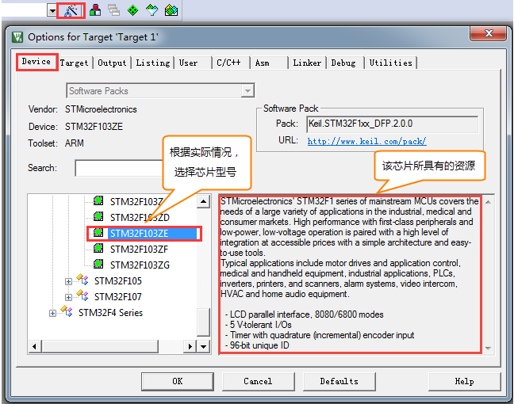

在线添加库文件
''''''''''''''

等下我们手动本地添加库文件，这里我们点击关掉在线添加，因为keil的服务器在国外，在线添加会非常慢。

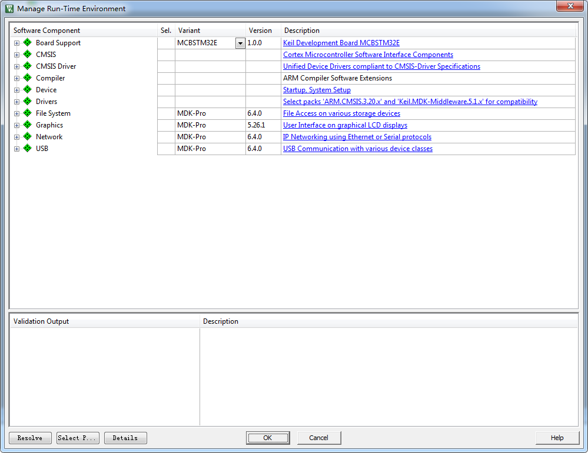

添加组文件夹
''''''''''''

在新建的工程中添加5个组文件夹，用来存放各种不同的文件，文件从本地建好的工程文件夹下获取，双击组文件夹就会出现添加文件的路径，然后选择文件即可。

表 11‑3 工程内组文件夹内容清单

==================== ==========================================================
名称                 作用
STARTUP              存放汇编的启动文件：startup_STM32F103xe.s
STM32F1xx_HAL_Driver 与STM32外设相关的库文件
\                     stm32f1xx_hal.c
\                     stm32f1xx_hal_ppp.c（ppp代表外设名称）
USER                 用户编写的文件：
\                     main.c：main函数文件，暂时为空
\                     stm32f1xx_it.c：跟中断有关的函数都放这个文件，暂时为空
DOC                  工程说明.txt：程序说明文件，用于说明程序的功能和注意事项等
==================== ==========================================================

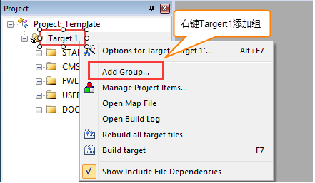

添加文件
''''''''

先把上面提到的文件从STM32HAL库中复制到工程模版对应文件夹的目录下，然后在新建的工程中添加这些文件，双击组文件夹就会出现添加文件的路径，然后选择文件即可。

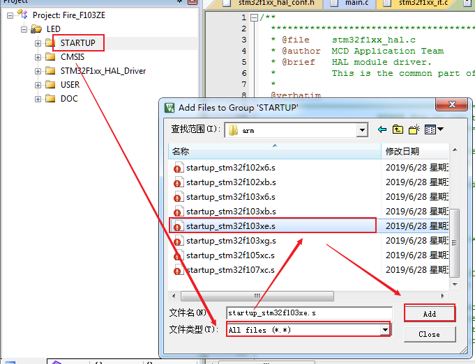

配置魔术棒选项卡
''''''''''''''''

这一步的配置工作很重要，很多人串口用不了printf函数，编译有问题，下载有问题，都是这个步骤的配置出了错。

(1) Target中选中微库“ Use
    MicroLib”，为的是在日后编写串口驱动的时候可以使用printf函数。

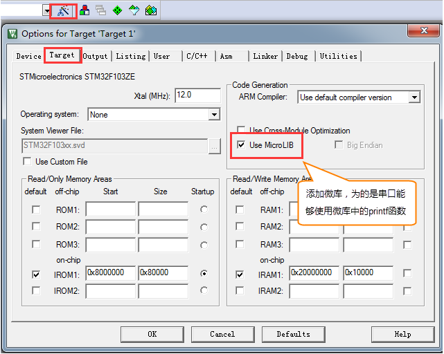

(2) 在Output选项卡中把输出文件夹定位到我们工程目录下的“output”文件夹，如果想在编译的过程中生成hex文件，那么那Create
    HEX File选项勾上。

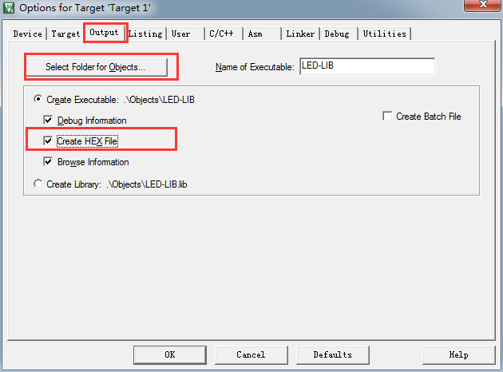

(3) 在Listing选项卡中把输出文件夹定位到我们工程目录下的“Listing”文件夹。

.. image:: media/image9.png
   :align: center
   :alt: 图 11‑9 配置 Listing 选项卡
   :name: 图11_9

(4) 在C/C++选项卡中添加处理宏及编译器编译的时候查找的头文件路径。如果头文件路径添加有误，则编译的时候会报错找不到头文件。

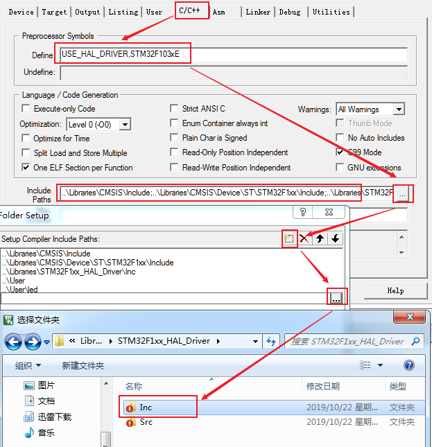

在这个选项中添加宏，就相当于我们在文件中使用“#define”语句定义宏一样。在编译器中添加宏的好处就是，只要用了这个模版，就不用源文件中修改代码。

-  STM32F103xE宏：为了告诉STM32HAL库，我们使用的芯片类型是STM32型号是大容量的，使STM32HAL库根据我们选定的芯片型号来配置。

-  USE_HAL_DRIVER宏：为了让stm32f1xx.h包含stm32f1xx_hal_conf.h这个头文件。

“Include Paths
”这里添加的是头文件的路径，如果编译的时候提示说找不到头文件，一般就是这里配置出了问题。你把头文件放到了哪个文件夹，就把该文件夹添加到这里即可。(请使用图中的方法用文件浏览器去添加路径，不要直接手打路径，容易出错)

仿真器配置
''''''''''

本书使用的仿真器是Fire-Debugger，可下载和仿真程序。Fire-Debugger支持XP/WIN7/WIN8/WIN10这几个操作系统，无需安装驱动，免驱，使用非常方便，具体配置见如下图。

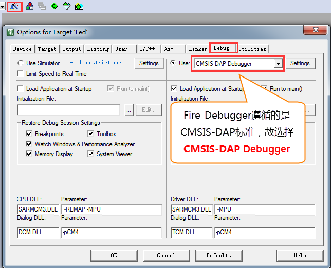

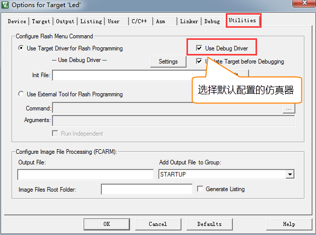

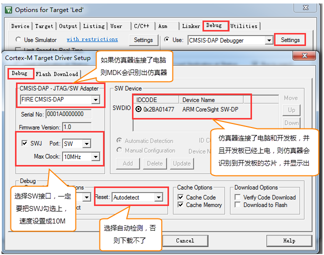

选择CPU型号
'''''''''''

这一步的配置也不是配置一次之后完事，常常会因为各种原因需要重新选择，当你下载的时候，提示说找不到Device的时候，请确保该配置是否正确。
有时候下载程序之后，不会自动运行，要手动复位的时候，也回来看看这里的“Reset and Run”配置是否失效。
指南者开发析用的STM32的FLASH大小是512kByte，所以这里选择512k的容量，如果使用的是其他型号的，要根据实际情况选择。

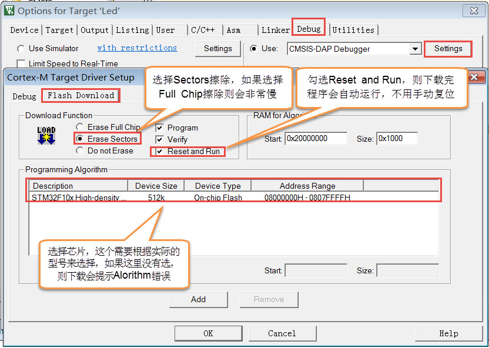

一个新的工程模版新建完毕。
