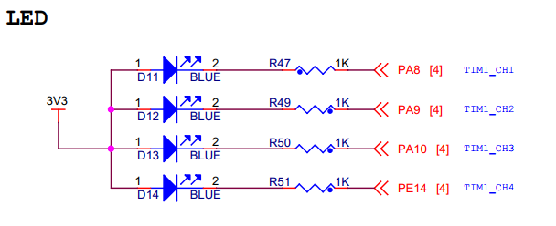

.. vim: syntax=rst

GPIO输出—使用固件库点亮LED
--------------------------

利用固件库建立好的工程模板，就可以方便地使用STM32HAL库编写应用程序了，可以说从这一章我们才开始迈入STM32F1开发的大门。LED灯的控制使用到GPIO外设的基本输出功能，本章中不再赘述GPIO外设的概念和功能框图的讲解，而是重点讲解如何使用STM32HAL库编程。

硬件设计
~~~~~~~~

在本教程中STM32芯片与LED灯的连接见 图12_1_，这是一个RGB灯，里面由四个小灯构成，
使用PWM控制时可以混合成256*256*256种不同的颜色。

这些LED灯的阴极都是连接到STM32的GPIO引脚，只要我们控制GPIO引脚的电平输出状态，即可控制LED灯的亮灭。若您使用的实验板LED灯的连接方式或引脚不一样，只需根据我们的工程修改引脚即可，程序的控制原理相同。

软件设计
~~~~~~~~

这里只讲解核心部分的代码，有些变量的设置，头文件的包含等可能不会涉及到，完整的代码请参考本章配套的工程。

为了使工程更加有条理，我们把LED灯控制相关的代码独立分开存储，方便以后移植。在“工程模板”之上新建“bsp_led.c”及“bsp_led.h”文件，其中的“bsp”即Board
Support
Packet的缩写(板级支持包)，这些文件也可根据您的喜好命名，这些文件不属于STM32HAL库的内容，是由我们自己根据应用需要编写的。

编程要点
^^^^^^^^

1. 使能GPIO端口时钟；

2. 初始化GPIO目标引脚为推挽输出模式；

3. 编写简单测试程序，控制GPIO引脚输出高、低电平。

代码分析
^^^^^^^^

LED灯引脚宏定义
'''''''''''''''

在编写应用程序的过程中，要考虑更改硬件环境的情况，例如LED灯的控制引脚与当前的不一样，
我们希望程序只需要做最小的修改即可在新的环境正常运行。
这个时候一般把硬件相关的部分使用宏来封装，若更改了硬件环境，只修改这些硬件相关的宏即可，这些定义一般存储在头文件，
即本例子中的“bsp_led.h”文件中，见 代码清单12_1_。

.. code-block:: c
   :caption: 代码清单 12‑1 LED控制引脚相关的宏
   :name: 代码清单12_1

    //引脚定义
    /*******************************************************/
    //LED1
    #define LED1_PIN                  GPIO_PIN_8               
    #define LED1_GPIO_PORT            GPIOA                
    #define LED1_GPIO_CLK_ENABLE()   __HAL_RCC_GPIOA_CLK_ENABLE()

    //LED2
    #define LED2_PIN                  GPIO_PIN_9               
    #define LED2_GPIO_PORT            GPIOA                 
    #define LED2_GPIO_CLK_ENABLE()   __HAL_RCC_GPIOA_CLK_ENABLE()

    //LED3
    #define LED3_PIN                  GPIO_PIN_10              
    #define LED3_GPIO_PORT            GPIOA                       
    #define LED3_GPIO_CLK_ENABLE()    __HAL_RCC_GPIOA_CLK_ENABLE()

    //LED4
    #define LED4_PIN                  GPIO_PIN_14              
    #define LED4_GPIO_PORT            GPIOE                 
    #define LED4_GPIO_CLK_ENABLE()    __HAL_RCC_GPIOE_CLK_ENABLE()

以上代码分别把控制四盏LED灯的GPIO端口、GPIO引脚号以及GPIO端口时钟封装起来了。在实际控制的时候我们就直接用这些宏，以达到应用代码跟硬件无关的效果。

其中的GPIO时钟宏“__GPIOA_CLK_ENABLE()”是STM32HAL库定义的GPIO端口时钟相关的宏，它的作用与“GPIO_PIN_x”这类宏类似，是用于指示寄存器位的，方便库函数使用。它们指示GPIOF时钟，下面初始化GPIO时钟的时候可以看到它的用法。

控制LED灯亮灭状态的宏定义
'''''''''''''''''''''''''

为了方便控制LED灯，我们把LED灯常用的亮、灭及状态反转的控制也直接定义成宏，见 代码清单12_2_。

.. code-block:: c
   :caption: 代码清单 12‑2 控制LED亮灭的宏
   :name: 代码清单12_2

    /** 控制LED灯亮灭的宏，
    * LED低电平亮，设置ON=0，OFF=1
    * 若LED高电平亮，把宏设置成ON=1 ，OFF=0 即可
    */
    #define ON  GPIO_PIN_RESET
    #define OFF GPIO_PIN_SET

    /* 带参宏，可以像内联函数一样使用 */
    #define LED1(a)	HAL_GPIO_WritePin(LED1_GPIO_PORT,LED1_PIN,a)

    #define LED2(a)	HAL_GPIO_WritePin(LED2_GPIO_PORT,LED2_PIN,a)

    #define LED3(a)	HAL_GPIO_WritePin(LED3_GPIO_PORT,LED3_PIN,a)

    #define LED4(a)	HAL_GPIO_WritePin(LED4_GPIO_PORT,LED4_PIN,a)

    /* 直接操作寄存器的方法控制IO */
    #define	digitalHi(p,i)			{p->BSRR=i;}			  //设置为高电平		
    #define digitalLo(p,i)			{p->BSRR=(uint32_t)i << 16;}				//输出低电平
    #define digitalToggle(p,i)		{p->ODR ^=i;}			//输出反转状态

    /* 定义控制IO的宏 */
    #define LED1_TOGGLE		digitalToggle(LED1_GPIO_PORT,LED1_PIN)
    #define LED1_OFF		digitalHi(LED1_GPIO_PORT,LED1_PIN)
    #define LED1_ON			digitalLo(LED1_GPIO_PORT,LED1_PIN)

    #define LED2_TOGGLE		digitalToggle(LED2_GPIO_PORT,LED2_PIN)
    #define LED2_OFF		digitalHi(LED2_GPIO_PORT,LED2_PIN)
    #define LED2_ON			digitalLo(LED2_GPIO_PORT,LED2_PIN)

    #define LED3_TOGGLE		digitalToggle(LED3_GPIO_PORT,LED3_PIN)
    #define LED3_OFF		digitalHi(LED3_GPIO_PORT,LED3_PIN)
    #define LED3_ON			digitalLo(LED3_GPIO_PORT,LED3_PIN)

    #define LED4_TOGGLE		digitalToggle(LED4_GPIO_PORT,LED4_PIN)
    #define LED4_OFF		digitalHi(LED4_GPIO_PORT,LED4_PIN)
    #define LED4_ON			digitalLo(LED4_GPIO_PORT,LED4_PIN)

这部分宏控制LED亮灭的操作是直接向BSRR寄存器写入控制指令来实现的，对BSRR低16位写1输出高电平，对BSRR高16位写1输出低电平，对ODR寄存器某位进行异或操作可反转位的状态。

RGB彩灯可以实现混色，如最后一段代码我们控制红灯和绿灯亮而蓝灯灭，可混出黄色效果。

代码中的“\”是C语言中的续行符语法，表示续行符的下一行与续行符所在的代码是同一行。代码中因为宏定义关键字“#define”只是对当前行有效，所以我们使用续行符来连接起来，以下的代码是等效的：

.. code-block:: c

    #define LED_ON LED1_ON; LED2_ON; LED3_OFF

应用续行符的时候要注意，在“\”后面不能有任何字符(包括注释、空格)，只能直接回车。

LED GPIO初始化函数
''''''''''''''''''

利用上面的宏，编写LED灯的初始化函数，见 代码清单12_3_。

.. code-block:: c
   :caption: 代码清单 12‑3 LED GPIO初始化函数
   :name: 代码清单12_3

    void LED_GPIO_Config(void)
    {		
            
        /*定义一个GPIO_InitTypeDef类型的结构体*/
        GPIO_InitTypeDef  GPIO_InitStruct;

        /*开启LED相关的GPIO外设时钟*/
        LED1_GPIO_CLK_ENABLE();
        LED2_GPIO_CLK_ENABLE();
        LED3_GPIO_CLK_ENABLE();
        LED4_GPIO_CLK_ENABLE();
        
        /*选择要控制的GPIO引脚*/															   
        GPIO_InitStruct.Pin = LED1_PIN;	

        /*设置引脚的输出类型为推挽输出*/
        GPIO_InitStruct.Mode  = GPIO_MODE_OUTPUT_PP;  

        /*设置引脚为上拉模式*/
        GPIO_InitStruct.Pull  = GPIO_PULLUP;

        /*设置引脚速率为高速 */   
        GPIO_InitStruct.Speed = GPIO_SPEED_FREQ_HIGH;

        /*调用库函数，使用上面配置的GPIO_InitStructure初始化GPIO*/
        HAL_GPIO_Init(LED1_GPIO_PORT, &GPIO_InitStruct);	

        /*选择要控制的GPIO引脚*/															   
        GPIO_InitStruct.Pin = LED2_PIN;	
        HAL_GPIO_Init(LED2_GPIO_PORT, &GPIO_InitStruct);	

        /*选择要控制的GPIO引脚*/															   
        GPIO_InitStruct.Pin = LED3_PIN;	
        HAL_GPIO_Init(LED3_GPIO_PORT, &GPIO_InitStruct);	
            
            /*选择要控制的GPIO引脚*/															   
        GPIO_InitStruct.Pin = LED4_PIN;	
        HAL_GPIO_Init(LED4_GPIO_PORT, &GPIO_InitStruct);	

        /*关闭RGB灯*/
        LED_RGBOFF;
    }

整个函数与“构建库函数雏形”章节中的类似，主要区别是硬件相关的部分使用宏来代替，初始化GPIO端口时钟时也采用了STM32库函数，函数执行流程如下：

(1) 使用GPIO_InitTypeDef定义GPIO初始化结构体变量，以便下面用于存储GPIO配置。

(2) 调用宏定义函数LED1_GPIO_CLK_ENABLE()来使能LED灯的GPIO端口时钟，在前面的章节中我们是直接向RCC寄存器赋值来使能时钟的，
不如这样直观。该函数在HAL库里边将操作寄存器部分封装起来，直接调用宏即可。

(3) 向GPIO初始化结构体赋值，把引脚初始化成推挽输出模式，其中的GPIO_PIN使用宏“LEDx_PIN”来赋值，使函数的实现方便移植。

(4) 使用以上初始化结构体的配置，调用HAL_GPIO_Init函数向寄存器写入参数，完成GPIO的初始化，
这里的GPIO端口使用“LEDx_GPIO_PORT”宏来赋值，也是为了程序移植方便。

(5) 使用同样的初始化结构体，只修改控制的引脚和端口，初始化其它LED灯使用的GPIO引脚。

(6) 使用宏控制RGB灯默认关闭。

主函数
''''''

编写完LED灯的控制函数后，就可以在main函数中测试了，见 代码清单12_4_。

.. code-block:: c
   :caption: 代码清单 12‑4 控制LED灯 ，main文件
   :name: 代码清单12_4

    int main(void)
    {
        /* 系统时钟初始化成72 MHz */
        SystemClock_Config();

        /* LED 端口初始化 */
        LED_GPIO_Config();

        /* 控制LED灯 */
        while (1) {
            LED1( ON );      // 亮
            HAL_Delay(1000);
            LED1( OFF );      // 灭
            HAL_Delay(1000);

            LED2( ON );     // 亮
            HAL_Delay(1000);
            LED2( OFF );      // 灭

            LED3( ON );      // 亮
            HAL_Delay(1000);
            LED3( OFF );      // 灭

            /*轮流显示 红绿蓝黄紫青白 颜色*/
            LED_RED;
            HAL_Delay(1000);

            LED_GREEN;
            HAL_Delay(1000);

            LED_BLUE;
            HAL_Delay(1000);

            LED_YELLOW;
            HAL_Delay(1000);

            LED_PURPLE;
            HAL_Delay(1000);

            LED_CYAN;
            HAL_Delay(1000);

            LED_WHITE;
            HAL_Delay(1000);

            LED_RGBOFF;
            HAL_Delay(1000);
        }
    }

在main函数中，调用SystemClock_Config函数初始化系统的时钟为72MHz，所有程序都必须设置好系统的时钟再进行其他操作，具体设置将在RCC时钟章节详细讲解，接着调用我们前面定义的LED_GPIO_Config初始化好LED的控制引脚，然后直接调用各种控制LED灯亮灭的宏来实现LED灯的控制，延时采用库自带基于滴答时钟延时HAL_Delay单位为ms，直接调用即可，这里HAL_Delay(1000)表示延时1s。

以上，就是一个使用STM32 HAL软件库开发应用的流程。

下载验证
^^^^^^^^

把编译好的程序下载到开发板并复位，可看到RGB彩灯轮流显示不同的颜色。

STM32 HAL库补充知识
~~~~~~~~~~~~~~~~~~~

SystemInit函数去哪了？
^^^^^^^^^^^^^^^^^^^^^^^^^^^^^^^^

在前几章我们自己建工程的时候需要定义一个SystemInit空函数，但是在这个用STM32
HAL库的工程却没有这样做，SystemInit函数去哪了呢？

这个函数在STM32
HAL库的“system_stm32f1xx.c”文件中定义了，而我们的工程已经包含该文件。

断言
^^^^^^^^^^^^^^^^^^^^^^^^^^^^^^^^

细心对比过前几章我们自己定义的GPIO_Init函数与STM32
HAL库中同名函数的读者，会发现HAL库中的函数内容多了一些乱七八糟的东西，
见 代码清单12_5_。

.. code-block:: c
   :caption: 代码清单 12‑5 HAL_GPIO_Init函数的断言部分
   :name: 代码清单12_5

    void HAL_GPIO_Init(GPIO_TypeDef  *GPIOx, GPIO_InitTypeDef *GPIO_Init)
    {
        uint32_t position = 0x00;
        uint32_t ioposition = 0x00;
        uint32_t iocurrent = 0x00;
        uint32_t temp = 0x00;

        /* Check the parameters */
        assert_param(IS_GPIO_ALL_INSTANCE(GPIOx));
        assert_param(IS_GPIO_PIN(GPIO_Init->Pin));
        assert_param(IS_GPIO_MODE(GPIO_Init->Mode));
        assert_param(IS_GPIO_PULL(GPIO_Init->Pull));
        /* ------- 以下内容省略，跟前面我们定义的函数内容相同----- */
    }

基本上每个库函数的开头都会有这样类似的内容，这里的“assert_param”实际是一个宏，
在库函数中它用于检查输入参数是否符合要求，若不符合要求则执行某个函数输出警告，
“assert_param”的定义见 代码清单12_6_。

.. code-block:: c
   :caption: 代码清单 12‑6 stm32f1xx_hal_conf.h文件中关于断言的定义
   :name: 代码清单12_6

    #ifdef  USE_FULL_ASSERT
    /**
    * @brief  assert_param 宏用于函数的输入参数检查
    * @param  expr:若expr值为假，则调用assert_failed函数
    *             报告文件名及错误行号
    *              若expr值为真，则不执行操作
    */
    #define assert_param(expr) \
            ((expr) ? (void)0 : assert_failed((uint8_t *)__FILE__, __LINE__))
    /* 错误输出函数 ------------------------------------------------------- */
    void assert_failed(uint8_t* file, uint32_t line);
    #else
    #define assert_param(expr) ((void)0)
    #endif

这段代码的意思是，假如我们不定义“USE_FULL_ASSERT”宏，那么“assert_param”就是一个空的宏(#else与#endif之间的语句生效)，没有任何操作。从而所有库函数中的assert_param实际上都无意义，我们就当看不见好了。

假如我们定义了“USE_FULL_ASSERT”宏，那么“assert_param”就是一个有操作的语句(#if与#else之间的语句生效)，该宏对参数expr使用C语言中的问号表达式进行判断，若expr值为真，则无操作(void
0)，若表达式的值为假，则调用“assert_failed”函数，且该函数的输入参数为“__FILE__”及“__LINE__”，这两个参数分别代表
“assert_param”宏被调用时所在的“文件名”及“行号”。

但库文件只对“assert_failed”写了函数声明，没有写函数定义，实际用时需要用户来定义，我们一般会用printf函数来输出这些信息，
见 代码清单12_7_。

.. code-block:: guess
   :caption: 代码清单 12‑7 assert_failed 输出错误信息
   :name: 代码清单12_7

    void assert_failed(uint8_t * file, uint32_t line)
    {
        printf(“/r/n 输入参数错误，错误文件名=%s,行号=%s”,file,line);
    }

注意在我们的这个LED工程中，还不支持printf函数(在USART外设章节会讲解)，想测试assert_failed输出的读者，
可以在这个函数中做点亮红色LED灯的操作，作为警告输出测试。

那么为什么函数输入参数不对的时候，assert_param宏中的expr参数值会是假呢？
这要回到HAL_GPIO_Init函数，看它对assert_param宏的调用，它被调用时分别以“IS_GPIO_ALL_INSTANCE(GPIOx)”、
“IS_GPIO_PIN(GPIO_Init->Pin)”等作为输入参数，也就是说被调用时，expr实际上是一条针对输入参数的判断表达式。例如“IS_GPIO_PIN”的宏定义：

.. code-block:: c

     #define IS_GPIO_PIN(__PIN__) ((((__PIN__)&GPIO_PIN_MASK)!= (uint32_t)0x00))

若它的输入参数 PIN值为0，则表达式的值为假，PIN非0时表达式的值为真。
我们知道用于选择GPIO引脚号的宏“GPIO_PIN_x”的值至少有一个数据位为1，这样的输入参数才有意义，若GPIO_InitStruct->
Pin的值为0，输入参数就无效了。配合IS_GPIO_PIN”这句表达式，“assert_param”就实现了检查输入参数的功能。
对assert_param宏的其它调用方式类似，大家可以自己看库源码来研究一下。

Doxygen注释规范
^^^^^^^^^^^^^^^^^^^^^^^^^^^^^^^^

在STM32 HAL库以及我们自己编写的“bsp_led.c”文件中，可以看到一些比较特别的注释，
类似 代码清单12_8_。

.. code-block:: c
   :caption: 代码清单 12‑8 Doxygen注释规范
   :name: 代码清单12_8

    /**
    * @brief  初始化控制LED的IO
    * @param  无
    * @retval 无
    */

这是一种名为“Doxygen”的注释规范，如果在工程文件中按照这种规范去注释，可以使用Doxygen软件自动根据注释生成帮助文档。我们所说非常重要的库帮助文档《STM32F103xx_User_Manual.chm》，就是由该软件根据库文件的注释生成的。关于Doxygen注释规范本教程不作讲解，感兴趣的读者可自行搜索网络上的资料学习。

防止头文件重复包含
^^^^^^^^^^^^^^^^^^^^^^^^^^^^^^^^

在STM32 HAL库的所有头文件以及我们自己编写的“bsp_led.h”头文件中，可看到类似
代码清单12_9_ 的宏定义。它的功能是防止头文件被重复包含，避免引起编译错误。

.. code-block:: c
   :caption: 代码清单 12‑9 防止头文件重复包含的宏
   :name: 代码清单12_9

    #ifndef __LED_H
    #define __LED_H

    /*此处省略头文件的具体内容*/

    #endif /* end of __LED_H */

在头文件的开头，使用“#ifndef”关键字，判断标号“__LED_H”是否被定义，若没有被定义，则从“#ifndef”至“#endif”关键字之间的内容都有效，也就是说，这个头文件若被其它文件“#include”，它就会被包含到其该文件中了，且头文件中紧接着使用“#define”关键字定义上面判断的标号“__LED_H”。当这个头文件被同一个文件第二次“#include”包含的时候，由于有了第一次包含中的“#define
\__LED_H”定义，这时再判断“#ifndef
\__LED_H”，判断的结果就是假了，从“#ifndef”至“#endif”之间的内容都无效，从而防止了同一个头文件被包含多次，编译时就不会出现“redefine（重复定义）”的错误了。

一般来说，我们不会直接在C的源文件写两个“#include”来包含同一个头文件，但可能因为头文件内部的包含导致重复，这种代码主要是避免这样的问题。如“bsp_led.h”文件中使用了“#include
“stm32F103xx.h”
”语句，按习惯，可能我们写主程序的时候会在main文件写“#include “bsp_led.h”
及#include
“stm32F103xx.h””，这个时候“stm32F103xx.h”文件就被包含两次了，如果没有这种机制，就会出错。

至于为什么要用两个下划线来定义“__LED_H”标号，其实这只是防止它与其它普通宏定义重复了，如我们用“GPIO_PIN_0”来代替这个判断标号，就会因为stm32F103xx.h已经定义了GPIO_PIN_0，结果导致“bsp_led.h”文件无效了，“bsp_led.h”文件一次都没被包含。
 