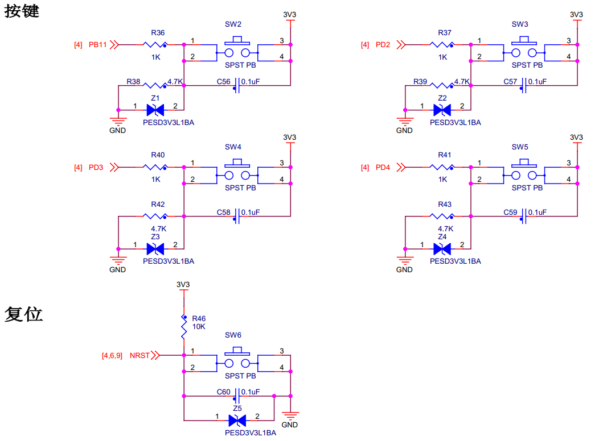

.. vim: syntax=rst

GPIO输入—按键检测
-----------------

按键检测使用到GPIO外设的基本输入功能，本章中不再赘述GPIO外设的概念，如您忘记了，可重读前面“GPIO框图剖析”小节，STM32
HAL库中GPIO初始化结构体GPIO_TypeDef的定义与“定义引脚模式的枚举类型”小节中讲解的相同。

硬件设计
~~~~~~~~

按键机械触点断开、闭合时，由于触点的弹性作用，按键开关不会马上稳定接通或一下子断开，使用按键时会产生
图13_1_ 中的带波纹信号，需要用软件消抖处理滤波，不方便输入检测。本实验板连接的按键带硬件消抖功能，见
图13_2_，它利用电容充放电的延时，消除了波纹，从而简化软件的处理，软件只需要直接检测引脚的电平即可。

.. image:: media/image1.jpeg
   :align: center
   :alt: 图 13‑1 按键抖动说明图
   :name: 图13_1

从按键的原理图可知，这些按键在没有被按下的时候，GPIO引脚的输入状态为低电平(按键所在的电路不通，引脚接地)，当按键按下时，GPIO引脚的输入状态为高电平(按键所在的电路导通，引脚接到电源)。只要我们检测引脚的输入电平，即可判断按键是否被按下。

若您使用的实验板按键的连接方式或引脚不一样，只需根据我们的工程修改引脚即可，程序的控制原理相同。

软件设计
~~~~~~~~

同LED的工程，为了使工程更加有条理，我们把按键相关的代码独立分开存储，方便以后移植。在“工程模板”之上新建“bsp_key.c”及“bsp_key.h”文件，这些文件也可根据您的喜好命名，这些文件不属于STM32HAL库的内容，是由我们自己根据应用需要编写的。

编程要点
^^^^^^^^

1. 使能GPIO端口时钟；

2. 初始化GPIO目标引脚为输入模式(浮空输入)；

3. 编写简单测试程序，检测按键的状态，实现按键控制LED灯。

代码分析
^^^^^^^^

按键引脚宏定义
''''''''''''''

同样，在编写按键驱动时，也要考虑更改硬件环境的情况。我们把按键检测引脚相关的宏定义到
“bsp_key.h”文件中，见 代码清单13_1_。

.. code-block:: c
   :caption: 代码清单 13‑1 按键检测引脚相关的宏
   :name: 代码清单13_1

    //引脚定义
    /*******************************************************/
    #define KEY1_PIN                  GPIO_PIN_11                
    #define KEY1_GPIO_PORT            GPIOB                      
    #define KEY1_GPIO_CLK_ENABLE()    __HAL_RCC_GPIOB_CLK_ENABLE()

    #define KEY2_PIN                  GPIO_PIN_2                 
    #define KEY2_GPIO_PORT            GPIOD                 
    #define KEY2_GPIO_CLK_ENABLE()    __HAL_RCC_GPIOD_CLK_ENABLE()

    #define KEY3_PIN                  GPIO_PIN_3            
    #define KEY3_GPIO_PORT            GPIOD                      
    #define KEY3_GPIO_CLK_ENABLE()    __HAL_RCC_GPIOD_CLK_ENABLE()

    #define KEY4_PIN                  GPIO_PIN_4             
    #define KEY4_GPIO_PORT            GPIOD                      
    #define KEY4_GPIO_CLK_ENABLE()    __HAL_RCC_GPIOD_CLK_ENABLE()
    /*******************************************************/

    /** 按键按下标置宏
    * 按键按下为高电平，设置 KEY_ON=1， KEY_OFF=0
    * 若按键按下为低电平，把宏设置成KEY_ON=0 ，KEY_OFF=1 即可
    */
    #define KEY_ON  1
    #define KEY_OFF 0

以上代码根据按键的硬件连接，把检测按键输入的GPIO端口、GPIO引脚号以及GPIO端口时钟封装起来了。

按键 GPIO初始化函数
'''''''''''''''''''

利用上面的宏，编写按键的初始化函数，见 代码清单13_2_。

.. code-block:: c
   :caption: 代码清单 13‑2 按键GPIO初始化函数
   :name: 代码清单13_2

    void Key_GPIO_Config(void)
    {
        GPIO_InitTypeDef GPIO_InitStructure;
        /*开启按键GPIO口的时钟*/
        KEY1_GPIO_CLK_ENABLE();
        KEY2_GPIO_CLK_ENABLE();
        KEY3_GPIO_CLK_ENABLE();
        KEY4_GPIO_CLK_ENABLE();
        /*选择按键的引脚*/	
        GPIO_InitStructure.Pin = KEY1_PIN; 
        /*设置引脚为输入模式*/
        GPIO_InitStructure.Mode = GPIO_MODE_INPUT; 
        /*设置引脚不上拉也不下拉*/
        GPIO_InitStructure.Pull = GPIO_NOPULL;
        /*使用上面的结构体初始化按键*/
        HAL_GPIO_Init(KEY1_GPIO_PORT, &GPIO_InitStructure);
        /*选择按键的引脚*/
        GPIO_InitStructure.Pin = KEY2_PIN; 
        /*使用上面的结构体初始化按键*/
        HAL_GPIO_Init(KEY2_GPIO_PORT, &GPIO_InitStructure);
                /*选择按键的引脚*/
        GPIO_InitStructure.Pin = KEY3_PIN; 
            /*使用上面的结构体初始化按键*/
        HAL_GPIO_Init(KEY3_GPIO_PORT, &GPIO_InitStructure);
                /*选择按键的引脚*/
        GPIO_InitStructure.Pin = KEY4_PIN; 
        /*使用上面的结构体初始化按键*/
        HAL_GPIO_Init(KEY4_GPIO_PORT, &GPIO_InitStructure);
    }

同为GPIO的初始化函数，初始化的流程与“LED
GPIO初始化函数”章节中的类似，主要区别是引脚的模式。函数执行流程如下：

(1) 使用GPIO_InitTypeDef定义GPIO初始化结构体变量，以便下面用于存储GPIO配置。

(2) 用宏定义函数KEY1_GPIO_CLK_ENABLE()，KEY2_GPIO_CLK_ENABLE()来使能按键的GPIO端口时钟。

(3) 向GPIO初始化结构体赋值，把引脚初始化成浮空输入模式，其中的Pin使用宏“KEYx_PIN”来赋值，
    使函数的实现方便移植。由于引脚的默认电平受按键电路影响，所以设置成“浮空/上拉/下拉”模式均没有区别。

(4) 使用以上初始化结构体的配置，调用HAL_GPIO_Init函数向寄存器写入参数，完成GPIO的初始化，
    这里的GPIO端口使用“KEYx_GPIO_PORT”宏来赋值，也是为了程序移植方便。

(5) 使用同样的初始化结构体，只修改控制的引脚和端口，初始化其它按键检测时使用的GPIO引脚。

检测按键的状态
''''''''''''''

初始化按键后，就可以通过检测对应引脚的电平来判断按键状态了，见 代码清单13_3_。

.. code-block:: c
   :caption: 代码清单 13‑3 检测按键的状态
   :name: 代码清单13_3

    uint8_t Key_Scan(GPIO_TypeDef* GPIOx,uint16_t GPIO_Pin)
    {
        /*检测是否有按键按下 */
        if (HAL_GPIO_ReadPin(GPIOx,GPIO_Pin) == KEY_ON ) {
            /*等待按键释放 */
            while (HAL_GPIO_ReadPin(GPIOx,GPIO_Pin) == KEY_ON);
            return  KEY_ON;
        } else
            return KEY_OFF;
    }

在这里我们定义了一个Key_Scan函数用于扫描按键状态。GPIO引脚的输入电平可通过读取IDR寄存器对应的数据位来感知，而STM32
HAL库提供了库函数HAL_GPIO_ReadPin来获取位状态，该函数输入GPIO端口及引脚号，函数返回该引脚的电平状态，高电平返回1，
低电平返回0。Key_Scan函数中以HAL_GPIO_ReadPin的返回值与自定义的宏“KEY_ON”对比，若检测到按键按下，则使用while循环持续检测按键状态，直到按键释放，按键释放后Key_Scan函数返回一个“KEY_ON”值；若没有检测到按键按下，则函数直接返回“KEY_OFF”。若按键的硬件没有做消抖处理，需要在这个Key_Scan函数中做软件滤波，防止波纹抖动引起误触发。

主函数
''''''

接下来我们使用主函数编写按键检测流程，见 代码清单13_4_。

.. code-block:: c
   :caption: 代码清单 13‑4 按键检测主函数
   :name: 代码清单13_4

    int main(void)
    {
        /* 系统时钟初始化成72 MHz */
        SystemClock_Config();
            /* LED 端口初始化 */
            LED_GPIO_Config();	 
        
            /*初始化按键*/
            Key_GPIO_Config();
            
        
            /* 轮询按键状态，若按键按下则反转LED */ 
            while(1)                            
            {	   
                if( Key_Scan(KEY1_GPIO_PORT,KEY1_PIN) == KEY_ON  )
                {
                    /*LED1反转*/
                    LED1_TOGGLE;
                }   
            
            if( Key_Scan(KEY2_GPIO_PORT,KEY2_PIN) == KEY_ON  )
                {
                    /*LED2反转*/
                    LED2_TOGGLE;
                }   
                
                if( Key_Scan(KEY3_GPIO_PORT,KEY3_PIN) == KEY_ON  )
                {
                    /*LED3反转*/
                    LED3_TOGGLE;
                }   
            
            if( Key_Scan(KEY4_GPIO_PORT,KEY4_PIN) == KEY_ON  )
                {
                    /*LED4反转*/
                    LED4_TOGGLE;
                }   
            }
    }

代码中初始化LED灯及按键后，在while函数里不断调用Key_Scan函数，并判断其返回值，若返回值表示按键按下，则反转LED灯的状态。

下载验证
^^^^^^^^

把编译好的程序下载到开发板并复位，按下按键可以控制LED灯亮、灭状态。
