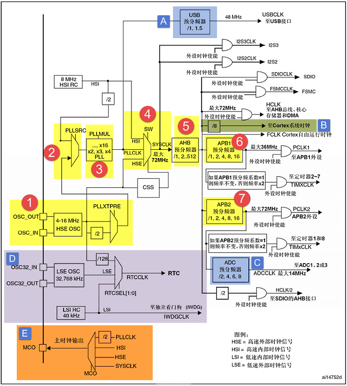
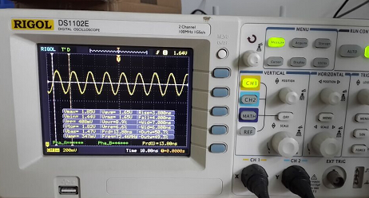
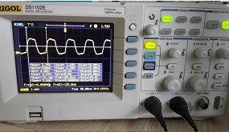

RCC—使用HSE/HSI配置时钟
-----------------------

本章参考资料：《STM32F10X-中文参考手册》RCC章节。

学习本章时，配合《STM32F10X-中文参考手册》RCC章节一起阅读，效果会更佳，特别是涉及到寄存器说明的部分。

RCC ：reset clock
control  复位和时钟控制器。本章我们主要讲解时钟部分，特别是要着重理解时钟树，理解了时钟树，STM32的一切时钟的来龙去脉都会了如指掌。

RCC主要作用—时钟部分
~~~~~~~~~~~~~~~~~~~~

设置系统时钟SYSCLK、设置AHB分频因子（决定HCLK等于多少）、设置APB2分频因子（决定PCLK2等于多少）、设置APB1分频因子（决定PCLK1等于多少）、设置各个外设的分频因子；控制AHB、APB2和APB1这三条总线时钟的开启、控制每个外设的时钟的开启。对于SYSCLK、HCLK、PCLK2、PCLK1这四个时钟的配置一般是：PCLK2
= HCLK = SYSCLK=PLLCLK = 72M，PCLK1=HCLK/2 =
36M。这个时钟配置也是库函数的标准配置，我们用的最多的就是这个。

RCC框图剖析—时钟部分
~~~~~~~~~~~~~~~~~~~~

时钟树单纯讲理论的话会比较枯燥，如果选取一条主线，并辅以代码，先主后次讲解的话会很容易，而且记忆还更深刻。我们这里选取库函数时钟系统时钟函数：
SetSysClockTo72(); 以这个函数的编写流程来讲解时钟树，这个函数也是我们用库的时候默认的系统时钟设置函数。该函数的功能是利用HSE把时钟设置为：
PCLK2 = HCLK = SYSCLK = 72M，PCLK1=HCLK/2 = 36M。
下面我们就以这个代码的流程为主线，来分析时钟树，对应的是图中的黄色部分，代码流程在时钟树中以数字的大小顺序标识。

系统时钟
^^^^^^^^

①HSE高速外部时钟信号
''''''''''''''''''''

HSE是高速的外部时钟信号，可以由有源晶振或者无源晶振提供，频率从4-16MHZ不等。当使用有源晶振时，时钟从OSC_IN引脚进入，OSC_OUT引脚悬空，当选用无源晶振时，时钟从OSC_IN和OSC_OUT进入，并且要配谐振电容。

HSE最常使用的就是8M的无源晶振。当确定PLL时钟来源的时候，HSE可以不分频或者2分频，这个由时钟配置寄存器CFGR的位17：PLLXTPRE设置，我们设置为HSE不分频。

②PLL时钟源
''''''''''

PLL时钟来源可以有两个，一个来自HSE，另外一个是HSI/2，具体用哪个由时钟配置寄存器CFGR的位16：PLLSRC设置。HSI是内部高速的时钟信号，频率为8M，根据温度和环境的情况频率会有漂移，一般不作为PLL的时钟来源。这里我们选HSE作为PLL的时钟来源。

③PLL时钟PLLCLK
''''''''''''''

通过设置PLL的倍频因子，可以对PLL的时钟来源进行倍频，倍频因子可以是:[2,3,4,5,6,7,8,9,10,11,12,13,14,15,16]，具体设置成多少，由时钟配置寄存器CFGR的位21-18：PLLMUL[3:0]设置。我们这里设置为9倍频，因为上一步我们设置PLL的时钟来源为HSE=8M，所以经过PLL倍频之后的PLL时钟：PLLCLK
= 8M \*9 = 72M。72M是ST官方推荐的稳定运行时钟，如果你想超频的话，增大倍频因子即可，最高为128M。
我们这里设置PLL时钟：PLLCLK = 8M \*9 = 72M。

④系统时钟SYSCLK
'''''''''''''''

系统时钟来源可以是：HSI、PLLCLK、HSE，具体的时钟配置寄存器CFGR的位1-0：SW[1:0]设置。我们这里设置系统时钟：SYSCLK
= PLLCLK = 72M。

⑤AHB总线时钟HCLK
''''''''''''''''

系统时钟SYSCLK经过AHB预分频器分频之后得到时钟叫APB总线时钟，即HCLK，分频因子可以是:[1,2,4，8，16，64，128，256，512]，具体的由时钟配置寄存器CFGR的位7-4  ：HPRE[3:0]设置。片上大部分外设的时钟都是经过HCLK分频得到，至于AHB总线上的外设的时钟设置为多少，得等到我们使用该外设的时候才设置，我们这里只需粗线条的设置好APB的时钟即可。我们这里设置为1分频，即HCLK=SYSCLK=72M。

⑥APB2总线时钟HCLK2
''''''''''''''''''

APB2总线时钟PCLK2由HCLK经过高速APB2预分频器得到，分频因子可以是:[1,2,4，8，16]，具体由时钟配置寄存器CFGR的位13-11：PPRE2[2:0]决定。HCLK2属于高速的总线时钟，片上高速的外设就挂载到这条总线上，比如全部的GPIO、USART1、SPI1等。至于APB2总线上的外设的时钟设置为多少，得等到我们使用该外设的时候才设置，我们这里只需粗线条的设置好APB2的时钟即可。我们这里设置为1分频，即PCLK2
= HCLK = 72M。

⑦APB1总线时钟HCLK1
''''''''''''''''''

APB1总线时钟PCLK1由HCLK经过低速APB预分频器得到，分频因子可以是:[1,2,4，8，16]，具体的由时钟配置寄存器CFGR的位10-8：PRRE1[2:0]决定。
HCLK1属于低速的总线时钟，最高为36M，片上低速的外设就挂载到这条总线上，比如USART2/3/4/5、SPI2/3，I2C1/2等。至于APB1总线上的外设的时钟设置为多少，得等到我们使用该外设的时候才设置，我们这里只需粗线条的设置好APB1的时钟即可。
我们这里设置为2分频，即PCLK1 = HCLK/2 = 36M。

设置系统时钟库函数
''''''''''''''''''

上面的7个步骤对应的设置系统时钟库函数如下，该函数截取自固件库文件system_stm32f103xe.c。为了方便阅读，我已把互联型相关的代码删掉，把英文注释翻译成了中文，并把代码标上了序号，总共七个步骤。该函数是直接操作寄存器的，有关寄存器部分请参考数据手册的RCC的寄存器描述部分。

.. code-block:: c
   :caption: 代码 15‑1 设置系统时钟库函数
   :name: 代码清单15_1

    void HSE_SetSysClock(void)
    {
        RCC_ClkInitTypeDef clkinitstruct = {0};
        RCC_OscInitTypeDef oscinitstruct = {0};

        /* Enable HSE Oscillator and activate PLL with HSE as source */
        oscinitstruct.OscillatorType  = RCC_OSCILLATORTYPE_HSE;
        oscinitstruct.HSEState        = RCC_HSE_ON;
        oscinitstruct.HSEPredivValue  = RCC_HSE_PREDIV_DIV1;
        oscinitstruct.PLL.PLLState    = RCC_PLL_ON;
        oscinitstruct.PLL.PLLSource   = RCC_PLLSOURCE_HSE;
        oscinitstruct.PLL.PLLMUL      = RCC_PLL_MUL9;
        if (HAL_RCC_OscConfig(&oscinitstruct)!= HAL_OK) {
            /* Initialization Error */
            while (1);
        }

        /* Select PLL as system clock source and configure the HCLK, PCLK1
        and PCLK2 clocks dividers */
        clkinitstruct.ClockType = (RCC_CLOCKTYPE_SYSCLK |
                                RCC_CLOCKTYPE_HCLK | RCC_CLOCKTYPE_PCLK1
                                | RCC_CLOCKTYPE_PCLK2);
        clkinitstruct.SYSCLKSource = RCC_SYSCLKSOURCE_PLLCLK;
        clkinitstruct.AHBCLKDivider = RCC_SYSCLK_DIV1;
        clkinitstruct.APB2CLKDivider = RCC_HCLK_DIV1;
        clkinitstruct.APB1CLKDivider = RCC_HCLK_DIV2;
        if (HAL_RCC_ClockConfig(&clkinitstruct, FLASH_LATENCY_2)!= HAL_OK)
            {
            /* Initialization Error */
            while (1);
        }
    }

    void HSI_SetSysClock(void)
    {
        RCC_ClkInitTypeDef clkinitstruct = {0};
        RCC_OscInitTypeDef oscinitstruct = {0};

        /* Enable HSE Oscillator and activate PLL with HSE as source */
        oscinitstruct.OscillatorType  = RCC_OSCILLATORTYPE_HSI;
        oscinitstruct.HSEState        = RCC_HSE_ON;
        oscinitstruct.HSEPredivValue  = RCC_HSE_PREDIV_DIV1;
        oscinitstruct.PLL.PLLState    = RCC_PLL_ON;
        oscinitstruct.PLL.PLLSource   = RCC_PLLSOURCE_HSE;
        oscinitstruct.PLL.PLLMUL      = RCC_PLL_MUL9;
        if (HAL_RCC_OscConfig(&oscinitstruct)!= HAL_OK) {
            /* Initialization Error */
            while (1);
        }

        /* Select PLL as system clock source and configure the HCLK, PCLK1
        and PCLK2 clocks dividers */
        clkinitstruct.ClockType = (RCC_CLOCKTYPE_SYSCLK |
                                RCC_CLOCKTYPE_HCLK | RCC_CLOCKTYPE_PCLK1
                                | RCC_CLOCKTYPE_PCLK2);
        clkinitstruct.SYSCLKSource = RCC_SYSCLKSOURCE_PLLCLK;
        clkinitstruct.AHBCLKDivider = RCC_SYSCLK_DIV1;
        clkinitstruct.APB2CLKDivider = RCC_HCLK_DIV1;
        clkinitstruct.APB1CLKDivider = RCC_HCLK_DIV2;
        if (HAL_RCC_ClockConfig(&clkinitstruct, FLASH_LATENCY_2)!= HAL_OK)
            {
            /* Initialization Error */
            while (1);
        }
    }

其他时钟
^^^^^^^^

通过对系统时钟设置的讲解，整个时钟树我们已经把握的有六七成，剩下的时钟部分我们讲解几个重要的。

A、USB时钟
''''''''''

USB时钟是由PLLCLK经过USB预分频器得到，分频因子可以是：[1,1.5]，具体的由时钟配置寄存器CFGR的位22：USBPRE配置。USB的时钟最高是48M，根据分频因子反推过来算，PLLCLK只能是48M或者是72M。一般我们设置PLLCLK=72M，USBCLK=48M。USB对时钟要求比较高，所以PLLCLK只能是由HSE倍频得到，不能使用HSI倍频。

B、Cortex系统时钟
'''''''''''''''''

Cortex系统时钟由HCLK
8分频得到，等于9M，Cortex系统时钟用来驱动内核的系统定时器SysTick，SysTick一般用于操作系统的时钟节拍，也可以用做普通的定时。

C、ADC时钟
''''''''''

ADC时钟由PCLK2经过ADC预分频器得到，分频因子可以是[2,4,6,8]，具体的由时钟配置寄存器CFGR的位15-14：ADCPRE[1:0]决定。很奇怪的是怎么没有1分频。ADC时钟最高只能是14M，如果采样周期设置成最短的1.5个周期的话，ADC的转换时间可以达到最短的1us。如果真要达到最短的转换时间1us的话，那ADC的时钟就得是14M，反推PCLK2的时钟只能是：28M、56M、84M、112M，鉴于PCLK2最高是72M，所以只能取28M和56M。

D、RTC时钟、独立看门狗时钟
''''''''''''''''''''''''''

RTC时钟可由HSE/128分频得到，也可由低速外部时钟信号LSE提供，频率为32.768KHZ，也可由低速内部时钟信号HSI提供，具体选用哪个时钟由备份域控制寄存器BDCR的位9-8：RTCSEL[1:0]配置。独立看门狗的时钟由LSI提供，且只能是由LSI提供，LSI是低速的内部时钟信号，频率为30~60KHZ直接不等，一般取40KHZ。

E、MCO时钟输出
''''''''''''''

MCO是microcontroller clock output的缩写，是微控制器时钟输出引脚，在STM32
F1系列中 由
PA8复用所得，主要作用是可以对外提供时钟，相当于一个有源晶振。MCO的时钟来源可以是：PLLCLK/2、HSI、HSE、SYSCLK，具体选哪个由时钟配置寄存器CFGR的位26-24：MCO[2:0]决定。除了对外提供时钟这个作用之外，我们还可以通过示波器监控MCO引脚的时钟输出来验证我们的系统时钟配置是否正确。

配置系统时钟实验
~~~~~~~~~~~~~~~~

使用HSE
^^^^^^^

一般情况下，我们都是使用HSE，然后HSE经过PLL倍频之后作为系统时钟。通常的配置是：HSE=8M，PLL的倍频因子为：9，系统时钟就设置成:SYSCLK
= 8M * 9 =
72M。使用HSE，系统时钟最高为72M，这个是官方推荐的最高的稳定时钟，如果你想铤而走险，也可以超频，超频最高能到128M。当程序来到main函数之前，启动文件：statup_stm32f103.s已经调用SystemInit()函数把系统时钟初始化成72MHZ，SystemInit()在库文件：system_stm32f103xe.c中定义。如果我们想把系统时钟设置低一点或者超频的话，可以修改底层的库文件，但是为了维持库的完整性，我们可以根据时钟树的流程自行写一个。

使用HSI
^^^^^^^

当HSE故障的时候，如果PLL的时钟来源是HSE，那么当HSE故障的时候，不仅HSE不能使用，连PLL也会被关闭，这个时候系统会自动切换HSI作为系统时钟，此时SYSCLK=HSI=8M，如果没有开启CSS和CSS中断的话，那么整个系统就只能在低速率运行，这是系统跟瘫痪没什么两样。如果开启了CSS功能的话，那么可以当HSE故障时，在CSS中断里面采取补救措施，使用HSI，并把系统时钟设置为更高的频率，最高是64M，64M的频率足够一般的外设使用，如：ADC
、SPI、I2C等。但是这里就又有一个问题了，原来SYSCLK=72M，现在因为故障改成64M，那么那些外设的时钟肯定被改变了，那么外设工作就会被打乱，那我们是不是在设置HSI时钟的时候，也重新调整外设总线的分频因子，即AHB，APB2和APB1的分频因子，使外设的时钟达到跟HSE没有故障之前一样。
但是这个也不是最保障的办法，毕竟不能一直使用HSI，所以当HSE故障时还是要采取报警措施。

还有一种情况是，有些用户不想用HSE，想用HSI，但是又不知道怎么用HSI来设置系统时钟，因为调用库函数都是使用HSE，下面我们给出个使用HSI配置系统时钟例子，起个抛砖引玉的作用。

硬件设计
^^^^^^^^

1. RCC

2. LED一个

RCC是单片机内部资源，不需要外部电路。通过LED闪烁的频率来直观的判断不同系统时钟频率对软件延时的效果。

软件设计
^^^^^^^^

我们编写两个RCC驱动文件，bsp_clkconfig.h和bsp_clkconfig.c，用来存放RCC系统时钟配置函数。

编程要点
''''''''

编程要点对应着时钟树图中的序号。

1、开启HSE/HSI ，并等待 HSE/HSI 稳定

2、设置 AHB、APB2、APB1的预分频因子

3、设置PLL的时钟来源，和PLL的倍频因子，设置各种频率主要就是在这里设置

4、开启PLL，并等待PLL稳定

5、把PLLCK切换为系统时钟SYSCLK

6、读取时钟切换状态位，确保PLLCLK被选为系统时钟

代码分析
''''''''

这里只讲解核心的部分代码，有些变量的设置，头文件的包含等并没有涉及到，完整的代码请参考本章配套的工程。

使用HSE配置系统时钟
======================

.. code-block:: c
   :caption: 代码 15‑2 HSE作为系统时钟来源
   :name: 代码清单15_2

    void  HSE_SetSysClock(void)
    {
        RCC_ClkInitTypeDef clkinitstruct = {0};
        RCC_OscInitTypeDef oscinitstruct = {0};

        /* 使能HSE，并以HSE作为PLL时钟源 */
        oscinitstruct.OscillatorType  = RCC_OSCILLATORTYPE_HSE;
        oscinitstruct.HSEState        = RCC_HSE_ON;
        oscinitstruct.HSEPredivValue  = RCC_HSE_PREDIV_DIV1;
        oscinitstruct.PLL.PLLState    = RCC_PLL_ON;
        oscinitstruct.PLL.PLLSource   = RCC_PLLSOURCE_HSE;
        oscinitstruct.PLL.PLLMUL      = RCC_PLL_MUL9;
        if (HAL_RCC_OscConfig(&oscinitstruct)!= HAL_OK) {
            /* 初始化错误 */
            while (1);
        }

        /* 选择PLL作为系统时钟源并配置HCLK,
        PCLK1和PCLK2分频系数*/
        clkinitstruct.ClockType = (RCC_CLOCKTYPE_SYSCLK |
                                RCC_CLOCKTYPE_HCLK | RCC_CLOCKTYPE_PCLK1
                                | RCC_CLOCKTYPE_PCLK2);
        clkinitstruct.SYSCLKSource = RCC_SYSCLKSOURCE_PLLCLK;
        clkinitstruct.AHBCLKDivider = RCC_SYSCLK_DIV1;
        clkinitstruct.APB2CLKDivider = RCC_HCLK_DIV1;
        clkinitstruct.APB1CLKDivider = RCC_HCLK_DIV2;
        if (HAL_RCC_ClockConfig(&clkinitstruct, FLASH_LATENCY_2)!= HAL_OK)
            {
            /* 初始化错误 */
            while (1);
        }
    }

这个函数采用库函数编写，这些宏来源于库函数的定义，宏展开是一些32位的十六进制数，具体功能是配置了时钟配置寄存器CFGR的位21-18
PLLMUL[3:0]，预先定义好倍频因子，方便调用。

使用HSI配置系统时钟
====================

.. code-block:: c

    void HSI_SetSysClock(void)
    {
        RCC_OscInitTypeDef RCC_OscInitStruct = {0};
        RCC_ClkInitTypeDef RCC_ClkInitStruct = {0};

        /*使能HSI,并以HSI作为PLL时钟源*/
        RCC_OscInitStruct.OscillatorType = RCC_OSCILLATORTYPE_HSI;
        RCC_OscInitStruct.HSIState = RCC_HSI_ON;
        RCC_OscInitStruct.HSICalibrationValue = RCC_HSICALIBRATION_DEFAULT;
        RCC_OscInitStruct.PLL.PLLState = RCC_PLL_ON;
        RCC_OscInitStruct.PLL.PLLSource = RCC_PLLSOURCE_HSI_DIV2;
        RCC_OscInitStruct.PLL.PLLMUL = RCC_PLL_MUL16;
        if (HAL_RCC_OscConfig(&RCC_OscInitStruct) != HAL_OK) {
            while (1);
        }
        /*选择PLL作为系统时钟源并配置HCLK,
        PCLK1和PCLK2分频系数*/
        RCC_ClkInitStruct.ClockType = RCC_CLOCKTYPE_HCLK| RCC_CLOCKTYPE_SYSCLK| RCC_CLOCKTYPE_PCLK1 |RCC_CLOCKTYPE_PCLK2;
        RCC_ClkInitStruct.SYSCLKSource = RCC_SYSCLKSOURCE_PLLCLK;
        RCC_ClkInitStruct.AHBCLKDivider = RCC_SYSCLK_DIV1;
        RCC_ClkInitStruct.APB1CLKDivider = RCC_HCLK_DIV2;
        RCC_ClkInitStruct.APB2CLKDivider = RCC_HCLK_DIV1;

        if (HAL_RCC_ClockConfig(&RCC_ClkInitStruct, FLASH_LATENCY_2) !=
            HAL_OK) {
            while (1);
        }
    }

HSI设置系统时钟函数跟HSE设置系统时钟函数在原理上是一样的，有一个区别的地方就是，HSI必须2分频之后才能作为PLL的时钟来源，所以使用HSI时，最大的系统时钟SYSCLK只能是HSI/2*16=4*16=64MHZ。

软件延时
====================

.. code-block:: c

    void Delay(__IO uint32_t nCount)
    {
        for (; nCount != 0; nCount--);
    }

软件延时函数，使用不同的系统时钟，延时时间不一样，可以通过LED闪烁的频率来判断。

MCO输出
====================

在STM32F103系列中，PA8可以复用为MCO引脚，对外提供时钟输出，在HAL库stm32f1xx_hal_rcc.c中已经定义了相关函数，我们可以直接调用，用示波器监控该引脚的输出来判断我们的系统时钟是否设置正确。

.. code-block:: c
   :caption: 代码 15‑3 MCO GPIO初始化
   :name: 代码清单15_3

    1 /*
    2  * 初始化MCO引脚PA8
    3  * 在F103系列中MCO引脚只有一个，即PA8，在F4系列中，MCO引脚有两个
    4  */
    void HAL_RCC_MCOConfig(uint32_t RCC_MCOx, uint32_t RCC_MCOSource,
                        uint32_t RCC_MCODiv)
    {
        GPIO_InitTypeDef gpio = {0U};

        /* Check the parameters */
        assert_param(IS_RCC_MCO(RCC_MCOx));
        assert_param(IS_RCC_MCODIV(RCC_MCODiv));
        assert_param(IS_RCC_MCO1SOURCE(RCC_MCOSource));

        /* Prevent unused argument(s) compilation warning */
        UNUSED(RCC_MCOx);
        UNUSED(RCC_MCODiv);

        /* Configure the MCO1 pin in alternate function mode */
        gpio.Mode      = GPIO_MODE_AF_PP;
        gpio.Speed     = GPIO_SPEED_FREQ_HIGH;
        gpio.Pull      = GPIO_NOPULL;
        gpio.Pin       = MCO1_PIN;

        /* MCO1 Clock Enable */
        MCO1_CLK_ENABLE();

        HAL_GPIO_Init(MCO1_GPIO_PORT, &gpio);

        /* Configure the MCO clock source */
        __HAL_RCC_MCO1_CONFIG(RCC_MCOSource, RCC_MCODiv);
    }

我们初始化MCO引脚之后，可以直接调用库函数HAL_RCC_MCOConf()来选择MCO时钟来源。

主函数
====================

.. code-block:: c

    int main(void)
    {
        // 使用HSI，配置系统时钟为72M
        HSE_SetSysClock();

        // LED 端口初始化
        LED_GPIO_Config();

        // MCO1 输出PLLCLK
        HAL_RCC_MCOConfig(RCC_MCO,RCC_MCO1SOURCE_PLLCLK, RCC_MCODIV_1);

    while (1) {
        LED2( ON );      // 亮
        Delay(0x0FFFFF);
        LED2( OFF );     // 灭
        Delay(0x0FFFFF);
            }
    }

在主函数中，可以调用HSE_SetSysClock()或者HSI_SetSysClock()这两个函数把系统时钟设置成各种常用的时钟，然后通过MCO引脚监控，或者通过LED闪烁的快慢体验不同的系统时钟对同一个软件延时函数的影响。

下载验证
^^^^^^^^

把编译好的程序下载到开发板，可以看到设置不同的系统时钟时，LED闪烁的快慢不一样。更精确的数据我们可以用示波器监控MCO引脚看到。

图 15‑2 MCO=SYSCLK=72M

图 15‑3 MCO=HSI=8M
