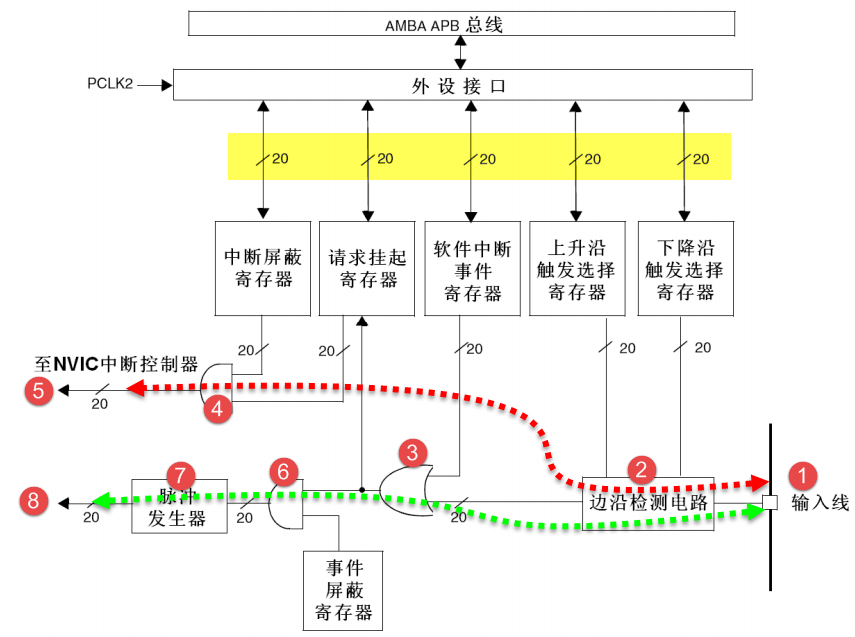
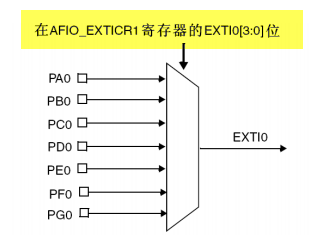
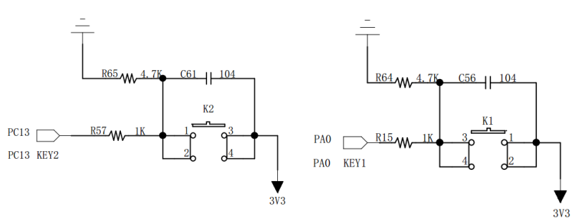

EXTI—外部中断/事件控制器
------------------------

本章参考资料：《STM32F10X-中文参考手册》中断和事件章节和8.4章节AFIO寄存器描述。

上一章节我们已经详细介绍了NVIC，对STM32F10x系列中断管理系统有个全局的了解，我们这章的内容是NVIC的实例应用，也是STM32F10x控制器非常重要的一个资源。学习本章时，配合《STM32F10X-中文参考手册》中断和事件章节一起阅读，效果会更佳，特别是涉及到寄存器说明的部分。

特别说明，本书内容是以STM32F10X系列控制器资源讲解。

EXTI简介
~~~~~~~~

EXTI（External interrupt/event
controller）—外部中断/事件控制器，管理了控制器的20个中断/事件线。每个中断/事件线都对应有一个边沿检测器，可以实现输入信号的上升沿检测和下降沿的检测。EXTI可以实现对每个中断/事件线进行单独配置，可以单独配置为中断或者事件，以及触发事件的属性。

EXTI功能框图
~~~~~~~~~~~~

EXTI的功能框图包含了EXTI最核心内容，掌握了功能框图，对EXTI就有一个整体的把握，在编程时思路就非常清晰。EXTI功能框图见 图17_1_。

在 图17_1_ 可以看到很多在信号线上打一个斜杠并标注“20”字样，这个表示在控制器内部类似的信号线路有20个，
这与EXTI总共有20个中断/事件线是吻合的。所以我们只要明白其中一个的原理，那其他19个线路原理也就知道了。

EXTI可分为两大部分功能，一个是产生中断，另一个是产生事件，这两个功能从硬件上就有所不同。

首先我们来看 图17_1_ 中红色虚线指示的电路流程。它是一个产生中断的线路，最终信号流入到NVIC控制器内。

编号1是输入线，EXTI控制器有19个中断/事件输入线，这些输入线可以通过寄存器设置为任意一个GPIO，也可以是一些外设的事件，这部分内容我们将在后面专门讲解。输入线一般是存在电平变化的信号。

编号2是一个边沿检测电路，它会根据上升沿触发选择寄存器(EXTI_RTSR)和下降沿触发选择寄存器(EXTI_FTSR)对应位的设置来控制信号触发。边沿检测电路以输入线作为信号输入端，如果检测到有边沿跳变就输出有效信号1给编号3电路，否则输出无效信号0。而EXTI_RTSR和EXTI_FTSR两个寄存器可以控制器需要检测哪些类型的电平跳变过程，可以是只有上升沿触发、只有下降沿触发或者上升沿和下降沿都触发。

编号3电路实际就是一个或门电路，它一个输入来自编号2电路，另外一个输入来自软件中断事件寄存器(EXTI_SWIER)。EXTI_SWIER允许我们通过程序控制就可以启动中断/事件线，这在某些地方非常有用。我们知道或门的作用就是有1就为1，所以这两个输入随便一个有有效信号1就可以输出1给编号4和编号6电路。

编号4电路是一个与门电路，它一个输入是编号3电路，另外一个输入来自中断屏蔽寄存器(EXTI_IMR)。与门电路要求输入都为1才输出1，导致的结果是如果EXTI_IMR设置为0时，那不管编号3电路的输出信号是1还是0，最终编号4电路输出的信号都为0；如果EXTI_IMR设置为1时，最终编号4电路输出的信号才由编号3电路的输出信号决定，这样我们可以简单的控制EXTI_IMR来实现是否产生中断的目的。编号4电路输出的信号会被保存到挂起寄存器(EXTI_PR)内，如果确定编号4电路输出为1就会把EXTI_PR对应位置1。

编号5是将EXTI_PR寄存器内容输出到NVIC内，从而实现系统中断事件控制。

接下来我们来看看绿色虚线指示的电路流程。它是一个产生事件的线路，最终输出一个脉冲信号。

产生事件线路是在编号3电路之后与中断线路有所不同，之前电路都是共用的。编号6电路是一个与门，它一个输入来自编号3电路，另外一个输入来自事件屏蔽寄存器(EXTI_EMR)。如果EXTI_EMR设置为0时，那不管编号3电路的输出信号是1还是0，最终编号6电路输出的信号都为0；如果EXTI_EMR设置为1时，最终编号6电路输出的信号才由编号3电路的输出信号决定，这样我们可以简单的控制EXTI_EMR来实现是否产生事件的目的。

编号7是一个脉冲发生器电路，当它的输入端，即编号6电路的输出端，是一个有效信号1时就会产生一个脉冲；如果输入端是无效信号就不会输出脉冲。

编号8是一个脉冲信号，就是产生事件的线路最终的产物，这个脉冲信号可以给其他外设电路使用，比如定时器TIM、模拟数字转换器ADC等等，这样的脉冲信号一般用来触发TIM或者ADC开始转换。

产生中断线路目的是把输入信号输入到NVIC，进一步会运行中断服务函数，实现功能，这样是软件级的。而产生事件线路目的就是传输一个脉冲信号给其他外设使用，并且是电路级别的信号传输，属于硬件级的。

另外，EXTI是在APB2总线上的，在编程时候需要注意到这点。

中断/事件线
~~~~~~~~~~~

EXTI有20个中断/事件线，每个GPIO都可以被设置为输入线，占用EXTI0至EXTI15，还有另外七根用于特定的外设事件，见 表17_1_ 。

4根特定外设中断/事件线由外设触发，具体用法参考《STM32F10X-中文参考手册》中对外设的具体说明。

.. _表17_1:

表 17‑1 EXTI中断/事件线

=============== ====================================
中断/事件线     输入源
  EXTI0         P\X\ 0(X可为A,B,C,D,E,F,G,H,I)
  EXTI1         P\X\ 1(X可为A,B,C,D,E,F,G,H,I)
  EXTI2         P\X\ 2(X可为A,B,C,D,E,F,G,H,I)
  EXTI3         P\X\ 3(X可为A,B,C,D,E,F,G,H,I)
  EXTI4         P\X\ 4(X可为A,B,C,D,E,F,G,H,I)
  EXTI5         P\X\ 5(X可为A,B,C,D,E,F,G,H,I)
  EXTI6         P\X\ 6(X可为A,B,C,D,E,F,G,H,I)
  EXTI7         P\X\ 7(X可为A,B,C,D,E,F,G,H,I)
  EXTI8         P\X\ 8(X可为A,B,C,D,E,F,G,H,I)
  EXTI9         P\X\ 9(X可为A,B,C,D,E,F,G,H,I)
  EXTI10        P\X\ 10(X可为A,B,C,D,E,F,G,H,I)
  EXTI11        P\X\ 11(X可为A,B,C,D,E,F,G,H,I)
  EXTI12        P\X\ 12(X可为A,B,C,D,E,F,G,H,I)
  EXTI13        P\X\ 13(X可为A,B,C,D,E,F,G,H,I)
  EXTI14        P\X\ 14(X可为A,B,C,D,E,F,G,H,I)
  EXTI15        P\X\ 15(X可为A,B,C,D,E,F,G,H,I)
  EXTI16        PVD输出
  EXTI17        RTC闹钟事件
  EXTI18        USB唤醒事件
  EXTI19        以太网唤醒事件（只适用互联型）
=============== ====================================

EXTI0至EXTI15用于GPIO，通过编程控制可以实现任意一个GPIO作为EXTI的输入源。由 表17_1_ 可知，
EXTI0可以通过AFIO的外部中断配置寄存器1(AFIO_EXTICR1)的EXTI0[3:0]位选择配置为PA0、PB0、PC0、PD0、PE0、PF0、PG0、PH0或者PI0，
见 图17_2_。其他EXTI线(EXTI中断/事件线)使用配置都是类似的。

图 17‑2 EXTI0输入源选择

EXTI初始化详解
~~~~~~~~~~~~~~

HAL库函数的EXIT初始化非常简单，只需配置好IO口的模式，然后配置中断源、中断优先级、使能中断。

1) HAL_NVIC_SetPriority：该函数负责EXTI中断/事件线选择，可选EXTI0至EXTI25，可参考 表17_1_ 选择，配置优先级。

2) HAL_NVIC_EnableIRQ：该函数负责控制使能中断。

外部中断控制实验
~~~~~~~~~~~~~~~~

中断在嵌入式应用中占有非常重要的地位，几乎每个控制器都有中断功能。中断对保证紧急事件得到第一时间处理是非常重要的。

我们设计使用外接的按键来作为触发源，使得控制器产生中断，并在中断服务函数中实现控制RGB彩灯的任务。

硬件设计
^^^^^^^^

轻触按键在按下时会使得引脚接通，通过电路设计可以使得按下时产生电平变化，见 图17_3_。

图 17‑3 按键电路设计

软件设计
^^^^^^^^

这里只讲解核心的部分代码，有些变量的设置，头文件的包含等并没有涉及到，完整的代码请参考本章配套的工程。我们创建了两个文件：bsp_exti.c和bsp_exti.h文件用来存放EXTI驱动程序及相关宏定义，中断服务函数放在stm32f1xx_it.h文件中。

编程要点
''''''''

1) 初始化用来产生中断的GPIO；

2) 初始化EXTI；

3) 配置NVIC；

4) 编写中断服务函数；

软件分析
''''''''

按键和EXTI宏定义
=================

.. code-block:: c
   :caption: 代码清单 17‑1 按键和EXTI 宏定义
   :name: 代码清单17_1

    //引脚定义
    /*******************************************************/
    #define KEY1_INT_GPIO_PORT                GPIOA
    #define KEY1_INT_GPIO_CLK_ENABLE()        __HAL_RCC_GPIOA_CLK_ENABLE();
    #define KEY1_INT_GPIO_PIN                 GPIO_PIN_15
    #define KEY1_INT_EXTI_IRQ                 EXTI15_10_IRQn
    #define KEY1_IRQHandler                   EXTI15_10_IRQHandler

    #define KEY2_INT_GPIO_PORT                GPIOD
    #define KEY2_INT_GPIO_CLK_ENABLE()        __HAL_RCC_GPIOD_CLK_ENABLE();
    #define KEY2_INT_GPIO_PIN                 GPIO_PIN_2
    #define KEY2_INT_EXTI_IRQ                 EXTI2_IRQn
    #define KEY2_IRQHandler                   EXTI2_IRQHandler

    #define KEY3_INT_GPIO_PORT                GPIOD
    #define KEY3_INT_GPIO_CLK_ENABLE()        __HAL_RCC_GPIOD_CLK_ENABLE();
    #define KEY3_INT_GPIO_PIN                 GPIO_PIN_3
    #define KEY3_INT_EXTI_IRQ                 EXTI3_IRQn
    #define KEY3_IRQHandler                   EXTI3_IRQHandler

    #define KEY4_INT_GPIO_PORT                GPIOD
    #define KEY4_INT_GPIO_CLK_ENABLE()        __HAL_RCC_GPIOD_CLK_ENABLE();
    #define KEY4_INT_GPIO_PIN                 GPIO_PIN_4
    #define KEY4_INT_EXTI_IRQ                 EXTI4_IRQn
    #define KEY4_IRQHandler                   EXTI4_IRQHandler
    /*******************************************************/

使用宏定义方法指定与电路设计相关配置，这对于程序移植或升级非常有用的。

EXTI中断配置
=================

.. code-block:: c
   :caption: 代码清单 17‑2 EXTI中断配置（bsp_exit.c文件）
   :name: 代码清单17_2

    void EXTI_Key_Config(void)
    {
    GPIO_InitTypeDef GPIO_InitStructure; 

        /*开启按键GPIO口的时钟*/
        KEY1_INT_GPIO_CLK_ENABLE();
        KEY2_INT_GPIO_CLK_ENABLE();
        KEY3_INT_GPIO_CLK_ENABLE();
        KEY4_INT_GPIO_CLK_ENABLE();
        
        /* 选择按键1的引脚 */ 
        GPIO_InitStructure.Pin = KEY1_INT_GPIO_PIN;
        /* 设置引脚为输入模式 */ 
        GPIO_InitStructure.Mode = GPIO_MODE_IT_RISING;	    		
        /* 设置引脚不上拉也不下拉 */
        GPIO_InitStructure.Pull = GPIO_NOPULL;
        /* 使用上面的结构体初始化按键 */
        HAL_GPIO_Init(KEY1_INT_GPIO_PORT, &GPIO_InitStructure); 
        /* 配置 EXTI 中断源 到key1 引脚、配置中断优先级*/
        HAL_NVIC_SetPriority(KEY1_INT_EXTI_IRQ, 0, 0);
        /* 使能中断 */
        HAL_NVIC_EnableIRQ(KEY1_INT_EXTI_IRQ);

        /* 选择按键2的引脚 */ 
        GPIO_InitStructure.Pin = KEY2_INT_GPIO_PIN;  
        /* 其他配置与上面相同 */
        HAL_GPIO_Init(KEY2_INT_GPIO_PORT, &GPIO_InitStructure);      
        /* 配置 EXTI 中断源 到key1 引脚、配置中断优先级*/
        HAL_NVIC_SetPriority(KEY2_INT_EXTI_IRQ, 0, 0);
        /* 使能中断 */
        HAL_NVIC_EnableIRQ(KEY2_INT_EXTI_IRQ);
            
            /* 选择按键3的引脚 */ 
        GPIO_InitStructure.Pin = KEY3_INT_GPIO_PIN;  
        /* 其他配置与上面相同 */
        HAL_GPIO_Init(KEY3_INT_GPIO_PORT, &GPIO_InitStructure);      
        /* 配置 EXTI 中断源 到key1 引脚、配置中断优先级*/
        HAL_NVIC_SetPriority(KEY3_INT_EXTI_IRQ, 0, 0);
        /* 使能中断 */
        HAL_NVIC_EnableIRQ(KEY3_INT_EXTI_IRQ);
            
                /* 选择按键2的引脚 */ 
        GPIO_InitStructure.Pin = KEY4_INT_GPIO_PIN;  
        /* 其他配置与上面相同 */
        HAL_GPIO_Init(KEY4_INT_GPIO_PORT, &GPIO_InitStructure);      
        /* 配置 EXTI 中断源 到key1 引脚、配置中断优先级*/
        HAL_NVIC_SetPriority(KEY4_INT_EXTI_IRQ, 0, 0);
        /* 使能中断 */
        HAL_NVIC_EnableIRQ(KEY4_INT_EXTI_IRQ);
    }

首先，使用GPIO_InitTypeDef结构体定义用于GPIO初始化配置的变量，关于这个结构体前面都已经做了详细的讲解。

使用GPIO之前必须开启GPIO端口的时钟；

调用HAL_NVIC_SetPriority和HAL_NVIC_EnableIRQ函数完成对按键1、按键2优先级配置并使能中断通道。

作为中断/时间输入线把GPIO配置为中断上升沿触发模式，这里不使用上拉或下拉，有外部电路完全决定引脚的状态。

我们的目的是产生中断，执行中断服务函数，EXTI选择中断模式，按键1使用下降沿触发方式，并使能EXTI线。

按键2基本上采用与按键1相关参数配置，只是改为上升沿触发方式。

EXTI中断服务函数
====================

.. code-block:: c
   :caption: 代码清单 17‑3 EXTI中断服务函数
   :name: 代码清单17_3

    void KEY1_IRQHandler(void)
    {
    //确保是否产生了EXTI Line中断
        if(__HAL_GPIO_EXTI_GET_IT(KEY1_INT_GPIO_PIN) != RESET) 
        {
            // LED1 取反		
            LED1_TOGGLE;
        //清除中断标志位
            __HAL_GPIO_EXTI_CLEAR_IT(KEY1_INT_GPIO_PIN);     
        }  
    }

    void KEY2_IRQHandler(void)
    {
    //确保是否产生了EXTI Line中断
        if(__HAL_GPIO_EXTI_GET_IT(KEY2_INT_GPIO_PIN) != RESET) 
        {
            // LED2 取反		
            LED2_TOGGLE;
        //清除中断标志位
            __HAL_GPIO_EXTI_CLEAR_IT(KEY2_INT_GPIO_PIN);     
        }  
    }

    void KEY3_IRQHandler(void)
    {
    //确保是否产生了EXTI Line中断
        if(__HAL_GPIO_EXTI_GET_IT(KEY3_INT_GPIO_PIN) != RESET) 
        {
            // LED2 取反		
            LED3_TOGGLE;
        //清除中断标志位
            __HAL_GPIO_EXTI_CLEAR_IT(KEY3_INT_GPIO_PIN);     
        }  
    }

    void KEY4_IRQHandler(void)
    {
    //确保是否产生了EXTI Line中断
        if(__HAL_GPIO_EXTI_GET_IT(KEY4_INT_GPIO_PIN) != RESET) 
        {
            // LED2 取反		
            LED4_TOGGLE;
        //清除中断标志位
            __HAL_GPIO_EXTI_CLEAR_IT(KEY4_INT_GPIO_PIN);     
        }  
    }

当中断发生时，对应的中断服务函数就会被执行，我们可以在中断服务函数实现一些控制。

一般为确保中断确实发生，我们会在中断服务函数调用中断标志位状态读取函数读取外设中断标志位并判断标志位状态。

__HAL_GPIO_EXTI_GET_IT函数用来获取EXTI的中断标志位状态，如果EXTI线有中断发生函数返回“SET”否则返回“RESET”。实际上，__HAL_GPIO_EXTI_GET_IT函数是通过读取EXTI_PR寄存器值来判断EXTI线状态的。

按键1的中断服务函数我们让LED1翻转其状态，按键2的中断服务函数我们让LED2翻转其状态。执行任务后需要调用__HAL_GPIO_EXTI_CLEAR_IT函数清除EXTI线的中断标志位。

主函数
========

.. code-block:: c
   :caption: 代码清单 17‑4 主函数
   :name: 代码清单17_4

    int main(void)
    {
        /* 系统时钟初始化成72MHz */
        SystemClock_Config();
        /* LED 端口初始化 */
        LED_GPIO_Config();

        /* 初始化EXTI中断，按下按键会触发中断，
        *  触发中断会进入stm32f7xx_it.c文件中的函数
        *
        KEY1_IRQHandler和KEY2_IRQHandler，处理中断，反转LED灯。
        */
        EXTI_Key_Config();

        /* 等待中断，由于使用中断方式，CPU不用轮询按键
        */
        while (1) {
        }
    }

主函数非常简单，只有三个任务函数。SystemClock_Config
初始化系统时钟，LED_GPIO_Config函数定义在bsp_led.c文件内，完成RGB彩灯的GPIO初始化配置。EXTI_Key_Config函数完成两个按键的GPIO和EXTI配置。

下载验证
^^^^^^^^

保证开发板相关硬件连接正确，把编译好的程序下载到开发板。此时RGB彩色灯是暗的，如果我们按下开发板上的按键1，RGB彩灯变亮，再按下按键1，RGB彩灯又变暗；如果我们按下开发板上的按键2并弹开，RGB彩灯变亮，再按下开发板上的KEY2并弹开，RGB彩灯又变暗。按键按下表示上升沿，按键弹开表示下降沿，这跟我们软件设置是一样的。
