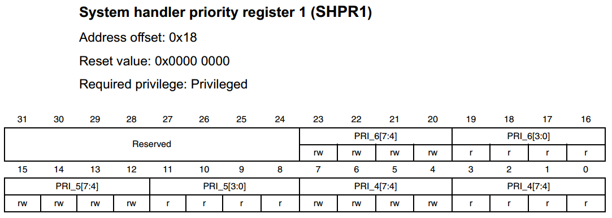
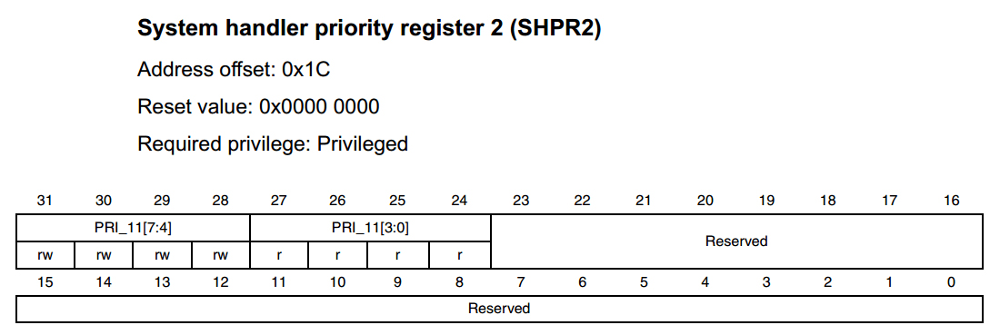
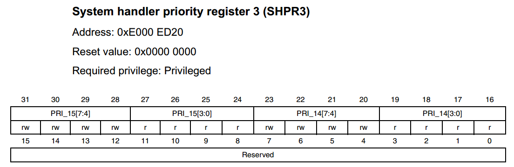

SysTick—系统定时器
------------------

本章参考资料《Cortex-M3内核编程手册》-4.5 章节SysTick
Timer(STK)，和4.48章节SHPRx，其中STK这个章节有SysTick的简介和寄存器的详细描述。因为SysTick是属于CM3内核的外设，有关寄存器的定义和部分库函数都在core_CM3.h这个头文件中实现。所以学习SysTick的时候可以参考这两个资料，一个是文档，一个是源码。

SysTick简介
~~~~~~~~~~~

SysTick—系统定时器是属于CM3内核中的一个外设，内嵌在NVIC中。系统定时器是一个24bit的向下递减的计数器，计数器每计数一次的时间为1/SYSCLK，一般我们设置系统时钟SYSCLK等于72M。当重装载数值寄存器的值递减到0的时候，系统定时器就产生一次中断，以此循环往复。

因为SysTick是属于CM3内核的外设，所以所有基于CM3内核的单片机都具有这个系统定时器，使得软件在CM3单片机中可以很容易的移植。系统定时器一般用于操作系统，用于产生时基，维持操作系统的心跳。

SysTick寄存器介绍
~~~~~~~~~~~~~~~~~

SysTick—系统定时器有4个寄存器，简要介绍如下。在使用SysTick产生定时的时候，只需要配置前三个寄存器，最后一个校准寄存器不需要使用。

表 18‑1 SysTick寄存器汇总

========== =======================
寄存器名称 寄存器描述
CTRL       SysTick控制及状态寄存器
LOAD       SysTick重装载数值寄存器
VAL        SysTick当前数值寄存器
CALIB      SysTick校准数值寄存器
========== =======================

表 18‑2 SysTick控制及状态寄存器

==== ========= ==== ====== ===========================================================================
位段 名称      类型 复位值 描述
16   COUNTFLAG R/W  0      如果在上次读取本寄存器后， SysTick 已经计到
                           了 0，则该位为 1。
2    CLKSOURCE R/W  0      时钟源选择位，0=AHB/8，1=处理器时钟AHB
1    TICKINT   R/W  0      1=SysTick倒数计数到 0时产生 SysTick异常请
                           求，0=数到 0 时无动作。也可以通过读取COUNTFLAG标志位来确定计数器是否递减到0
0    ENABLE    R/W  0      SysTick 定时器的使能位
==== ========= ==== ====== ===========================================================================

表 18‑3 SysTick 重装载数值寄存器

==== ====== ==== ====== ================================
位段 名称   类型 复位值 描述
23:0 RELOAD R/W  0      当倒数计数至零时，将被重装载的值
==== ====== ==== ====== ================================

表 18‑4 SysTick当前数值寄存器

==== ======= ==== ====== =================================================================================================
位段 名称    类型 复位值 描述
23:0 CURRENT R/W  0      读取时返回当前倒计数的值，写它则使之清零，同时还会清除在SysTick控制及状态寄存器中的COUNTFLAG 标志
==== ======= ==== ====== =================================================================================================

表 18‑5 SysTick校准数值寄存器

==== ===== ==== ====== ======================================================================================================================================================================================================================================================
位段 名称  类型 复位值 描述
31   NOREF R    0      NOREF flag. Reads as zero. Indicates that a separate reference clock is provided.
                       The frequency of this clock is HCLK/8
30   SKEW  R    1      Reads as one. Calibration value for the 1 ms inexact timing is not known because TENMS is
                       not known. This can affect the suitability of SysTick as a software real time clock
23:0 TENMS R    0      Indicates the calibration value when the SysTick counter runs on HCLK max/8 as external clock. The value is product dependent, please refer to the Product Reference Manual, SysTick
                       Calibration Value section. When HCLK is programmed at the maximum frequency, the SysTick period is 1ms. If calibration information is not known, calculate the calibration value required from the frequency of the processor clock or external clock.
==== ===== ==== ====== ======================================================================================================================================================================================================================================================

系统定时器的校准数值寄存器在定时实验中不需要用到。有关各个位的描述这里引用手册里面的英文版本，比较晦涩难懂，暂时不知道这个寄存器用来干什么。有研究过的朋友可以交流，起个抛砖引玉的作用。

SysTick定时实验
~~~~~~~~~~~~~~~

利用SysTick产生1s的时基，LED以1s的频率闪烁。

硬件设计
^^^^^^^^

SysTick属于单片机内部的外设，不需要额外的硬件电路，剩下的只需一个LED灯即可。

软件设计
^^^^^^^^

这里只讲解核心的部分代码，有些变量的设置，头文件的包含等并没有涉及到，完整的代码请参考本章配套的工程。我们创建了两个文件：bsp_SysTick.c和bsp\_
SysTick.h文件用来存放SysTick驱动程序及相关宏定义，中断服务函数放在stm32f1xx_it.h文件中。

编程要点
''''''''

1、设置重装载寄存器的值

2、清除当前数值寄存器的值

3、配置控制与状态寄存器

代码分析
''''''''

SysTick
属于内核的外设，有关的寄存器定义和库函数都在内核相关的库文件core_cm3.h中。

SysTick配置库函数
====================

.. code-block:: c
   :caption: 代码 18‑1SysTick配置库函数
   :name: 代码清单18_1

    __STATIC_INLINE uint32_t SysTick_Config(uint32_t ticks)
    {
        // 不可能的重装载值，超出范围
        if ((ticks - 1UL) > SysTick_LOAD_RELOAD_Msk) {
            return (1UL);
        }

        // 设置重装载寄存器
        SysTick->LOAD  = (uint32_t)(ticks - 1UL);

        // 设置中断优先级
        NVIC_SetPriority (SysTick_IRQn, (1UL << __NVIC_PRIO_BITS) - 1UL);

        // 设置当前数值寄存器
        SysTick->VAL   = 0UL;

        // 设置系统定时器的时钟源为AHBCLK=72M
        // 使能系统定时器中断
        // 使能定时器
        SysTick->CTRL  = SysTick_CTRL_CLKSOURCE_Msk |
                        SysTick_CTRL_TICKINT_Msk   |
                        SysTick_CTRL_ENABLE_Msk;
        return (0UL);
    }

用固件库编程的时候我们只需要调用库函数SysTick_Config()即可，形参ticks用来设置重装载寄存器的值，
最大不能超过重装载寄存器的值2\ :sup:`24`\ ，当重装载寄存器的值递减到0的时候产生中断，
然后重装载寄存器的值又重新装载往下递减计数，以此循环往复。紧随其后设置好中断优先级，
最后配置系统定时器的时钟等于AHBCLK=72M，使能定时器和定时器中断，这样系统定时器就配置好了，一个库函数搞定。

SysTick_Config()库函数主要配置了SysTick中的三个寄存器：LOAD、VAL和CTRL，有关具体的部分看代码注释即可。

配置SysTick中断优先级
=======================

SysTick_Config()库函数主要配置了SysTick中的三个寄存器：LOAD、VAL和CTRL，有关具体的部分看代码注释即可。
其中还调用了函数库函数NVIC_SetPriority()来配置系统定时器的中断优先级，该库函数也在core_m4.h中定义，原型如下：

.. code-block:: c

    __STATIC_INLINE void NVIC_SetPriority(IRQn_Type IRQn, uint32_t priority)
    {
    if ((int32_t)IRQn < 0) {
    SCB->SHP[(((uint32_t)(int32_t)IRQn) & 0xFUL)-4UL] =
    (uint8_t)((priority << (8 - __NVIC_PRIO_BITS)) & (uint32_t)0xFFUL);
    } else {
    NVIC->IP[((uint32_t)(int32_t)IRQn)] =
    (uint8_t)((priority << (8 - __NVIC_PRIO_BITS)) & (uint32_t)0xFFUL);
    }
    }

因为SysTick属于内核外设，跟普通外设的中断优先级有些区别，并没有抢占优先级和子优先级的说法。在STM32F103中，内核外设的中断优先级由内核SCB这个外设的寄存器：SHPRx（x=1.2.3）来配置。有关SHPRx寄存器的详细描述可参考《Cortex-M4内核编程手册》4.4.8章节。下面我们简单介绍下这个寄存器。

SPRH1-SPRH3是一个32位的寄存器，但是只能通过字节访问，每8个字段控制着一个内核外设的中断优先级的配置。在STM32F103中，只有位7:3这高四位有效，低四位没有用到，所以内核外设的中断优先级可编程为：0~15，只有16个可编程优先级，数值越小，优先级越高。如果软件优先级配置相同，那就根据他们在中断向量表里面的位置编号来决定优先级大小，编号越小，优先级越高。

表 18‑6 系统异常优先级字段

======================= ====== ==========
异常                    字段   寄存器描述
Memory management fault PRI_4  SHPR1
Bus fault               PRI_5
Usage fault             PRI_6
SVCall                  PRI_11 SHPR2
PendSV                  PRI_14 SHPR3
SysTick                 PRI_15
======================= ====== ==========

如果要修改内核外设的优先级，只需要修改下面三个寄存器对应的某个字段即可。

图 18‑1 SHPR1寄存器

图 18‑2 SHPR2寄存器

图 18‑3 SHPR3寄存器

在系统定时器中，配置优先级为(1UL << __NVIC_PRIO_BITS) -1UL)，其中宏__NVIC_PRIO_BITS为4，那计算结果就等于15，
可以看出系统定时器此时设置的优先级在内核外设中是最低的，如果要修改优先级则修改这个值即可，范围为：0~15。

.. code-block:: c

    // 设置系统定时器中断优先级
    NVIC_SetPriority (SysTick_IRQn, (1UL << __NVIC_PRIO_BITS) - 1UL);

SysTick初始化函数
=====================

.. code-block:: c
   :caption: 代码 18‑2 SysTick初始化函数
   :name: 代码清单18_2

    /**
    * @brief  启动系统滴答定时器 SysTick
    * @param  无
    * @retval 无
    */
    void SysTick_Init(void)
    {
        /* SystemFrequency / 1000    1ms中断一次
        * SystemFrequency / 100000  10us中断一次
        * SystemFrequency / 1000000 1us中断一次
        */
        if (HAL_SYSTICK_Config(SystemCoreClock / 100000)) {
            /* Capture error */
            while (1);
        }
    }

SysTick初始化函数由用户编写，里面调用了SysTick_Config()这个固件库函数，通过设置该固件库函数的形参，就决定了系统定时器经过多少时间就产生一次中断。

SysTick中断时间的计算
========================

SysTick定时器的计数器是向下递减计数的，计数一次的时间T\ :sub:`DEC`\ =1/CLK\ :sub:`AHB`\ ，
当重装载寄存器中的值VALUE\ :sub:`LOAD`\ 减到0的时候，产生中断，可知中断一次的时间T
\ :sub:`INT`\ =VALUE\ :sub:`LOAD \*` T\ :sub:`DEC`\ = VALUE
\ :sub:`LOAD`/CLK:sub:`AHB`\ ，其中CLK\ :sub:`AHB`
=72MHZ。如果设置VALUE\ :sub:`LOAD`\ 为72，那中断一次的时间
T\ :sub:`INT`\ =72/72M=1us。不过1us的中断没啥意义，整个程序的重心都花在进出中断上了，根本没有时间处理其他的任务。

.. code-block:: c

    SysTick_Config(SystemCoreClock / 100000))

SysTick_Config（）的形我们配置为SystemCoreClock / 100000=72M/100000=720，
从刚刚分析我们知道这个形参的值最终是写到重装载寄存器LOAD中的，
从而可知我们现在把SysTick定时器中断一次的时间T\ :sub:`INT`\ =720/72M=10us。

SysTick定时时间的计算
==========================

当设置好中断时间T\ :sub:`INT`\ 后，我们可以设置一个变量t，
用来记录进入中断的次数，那么变量t乘以中断的时间T\ :sub:`INT`\ 就可以计算出需要定时的时间。

SysTick定时函数
=================

现在我们定义一个微秒级别的延时函数，形参为nTime，当用这个形参乘以中断时间
T\ :sub:`INT`\ 就得出我们需要的延时时间，其中T\ :sub:`INT`\ 我们已经设置好为10us。关于这个函数的具体调用看注释即可。

.. code-block:: c

    /**
    * @brief   us延时程序,10us为一个单位
    * @param
    *   @arg nTime: Delay_us( 1 ) 则实现的延时为 1 * 10us = 10us
    * @retval  无
    */
    void Delay_us(__IO u32 nTime)
    {
        TimingDelay = nTime;

        while (TimingDelay != 0);
    }

函数Delay_us()中我们等待TimingDelay为0，当TimingDelay为0的时候表示延时时间到。变量TimingDelay在中断函数中递减，即SysTick每进一次中断即10us的时间TimingDelay递减一次。

SysTick中断服务函数
=====================

.. code-block:: c

    void SysTick_Handler(void)
    {
        TimingDelay_Decrement();
    }

中断复位函数调用了另外一个函数TimingDelay_Decrement()，原型如下：

.. code-block:: c

    /**
    * @brief  获取节拍程序
    * @param  无
    * @retval 无
    * @attention  在 SysTick 中断函数 SysTick_Handler()调用
    */
    void TimingDelay_Decrement(void)
    {
        if (TimingDelay != 0x00) {
            TimingDelay--;
        }
    }

TimingDelay的值等于延时函数中传进去的nTime的值，比如nTime=100000，则延时的时间等于100000*10us=1s。

主函数
=========

.. code-block:: c

    int main(void)
    {
        /* 系统时钟初始化成72MHz */
        SystemClock_Config();
        /* LED 端口初始化 */
        LED_GPIO_Config();
        /* 配置SysTick 为10us中断一次,
        时间到后触发定时中断，
        *进入stm32f7xx_it.
        c文件的SysTick_Handler处理，通过数中断次数计时
        */
        SysTick_Init();
        while (1) {
            LED_RED;
            Delay_us(100000);     // 10000 * 10us = 1000ms
            LED_GREEN;
            Delay_us(100000);   // 10000 * 10us = 1000ms
            LED_BLUE;
            Delay_us(100000);   // 10000 * 10us = 1000ms
        }
    }

主函数中初始化了LED和SysTick，然后在一个while循环中以1s的频率让LED闪烁。
