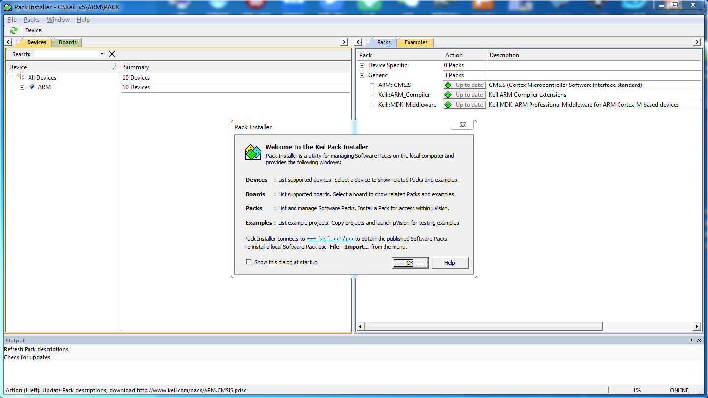

.. vim: syntax=rst

如何安装KEIL5
------------------------

本章内容所涉及的软件只供教学使用，不得用于商业用途。个人或公司因商业用途导致的法律责任，后果自负。

温馨提示
~~~~~~~~~~~~~~

1. 安装路径不能带中文，必须是英文路径

2. 安装目录不能跟51的KEIL或者KEIL4冲突，三者目录必须分开

3. KEIL5的安装比起KEIL4多了一个步骤，必须添加MCU库，不然没法使用。

4. 如果使用的时候出现莫名其妙的错误，先百度查找解决方法，莫乱阵脚。

获取KEIL5安装包
~~~~~~~~~~~~~~~

要想获得KEIL5的安装包，在百度里面搜索“KEIL5下载”即可找到很多网友提供的下载文件，或者到KEIL的官网下载：\ https://www.keil.com/download/product/\ ，一大堆注册非常麻烦。我们这里面KEIL5的版本是MDK5.15，以后有新版本大家可使用更高版本。

开始安装KEIL5
~~~~~~~~~~~~~~

双击KEIL5安装包，开始安装，next。

Agree，Nest

选择安装 路径，路径不能带中文，next

填写用户信息，全部填空格（键盘的space键）即可，next

Finish，安装完毕

安装STM32芯片包
~~~~~~~~~~~~~~~

KEIL5不像KEIL4那样自带了很多厂商的MCU型号，KEIL5需要自己安装。

把下面弹出的界面关掉，我们直接去keil的官网下载：\ http://www.keil.com/dd2/pack/\ ，或者直接用我们下载好的包。

在官网中找到STM32F1、STM32F4、STM32F7这3个系列的包下载到本地电脑，具体下载哪个系列的根据你使用的型号下载即可，这里我只下载我自己需要使用的F1/4/7这三个系列的包，F1代表M3，F4代表M4，F7代表M7。

把下载好的包双击安装即可，安装路径选择跟KEIL5一样的安装路径，安装成功之后，在KEIL5
的 Pack Installer
中就可以看到我们安装的包，以后我们新建工程的时候，就有单片机的型号可选。

