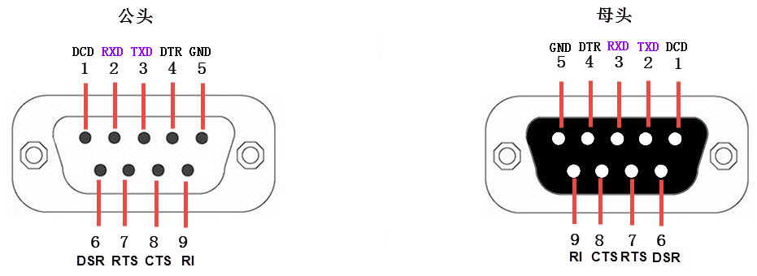
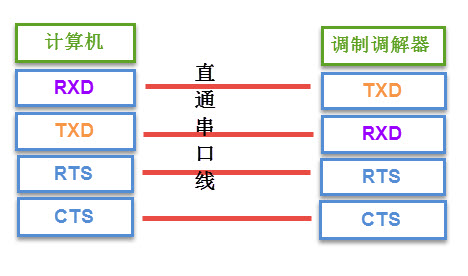
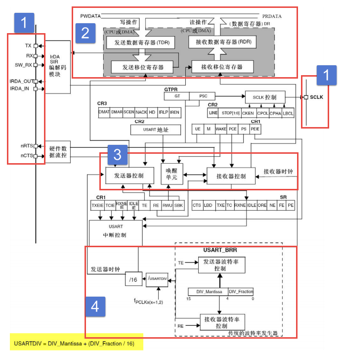
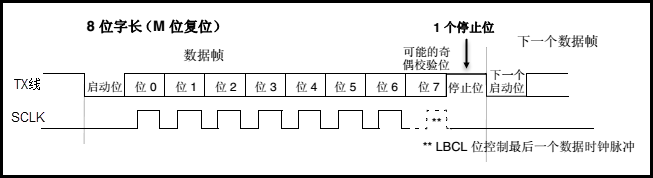
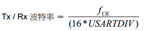
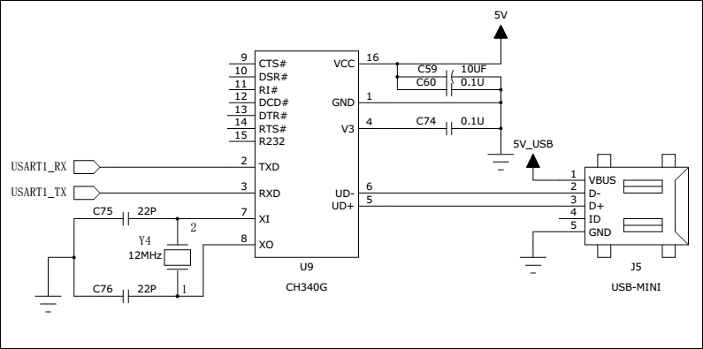

USART—串口通讯
--------------

本章参考资料：《STM32F10X-中文参考手册》USART章节。学习本章时，配合《STM32F10X-中文参考手册》USART章节一起阅读，效果会更佳，特别是涉及到寄存器说明的部分。特别说明，本书内容是以STM32F103系列控制器资源讲解。

串口通讯协议简介
~~~~~~~~~~~~~~~~

串口通讯(Serial
Communication)是一种设备间非常常用的串行通讯方式，因为它简单便捷，因此大部分电子设备都支持该通讯方式，电子工程师在调试设备时也经常使用该通讯方式输出调试信息。

在计算机科学里，大部分复杂的问题都可以通过分层来简化。如芯片被分为内核层和片上外设；STM32HAL库则是在寄存器与用户代码之间的软件层。对于通讯协议，我们也以分层的方式来理解，最基本的是把它分为物理层和协议层。物理层规定通讯系统中具有机械、电子功能部分的特性，确保原始数据在物理媒体的传输。协议层主要规定通讯逻辑，统一收发双方的数据打包、解包标准。简单来说物理层规定我们用嘴巴还是用肢体来交流，协议层则规定我们用中文还是英文来交流。

下面我们分别对串口通讯协议的物理层及协议层进行讲解。

物理层
^^^^^^

串口通讯的物理层有很多标准及变种，我们主要讲解RS-232标准
，RS-232标准主要规定了信号的用途、通讯接口以及信号的电平标准。

使用RS-232标准的串口设备间常见的通讯结构见 图20_1_。

.. image:: media/image2.jpeg
   :align: center
   :alt: 图 20‑1 串口通讯结构图
   :name: 图20_1

图 20‑1 串口通讯结构图

在上面的通讯方式中，两个通讯设备的“DB9接口”之间通过串口信号线建立起连接，串口信号线中使用“RS-232标准”传输数据信号。由于RS-232电平标准的信号不能直接被控制器直接识别，所以这些信号会经过一个“电平转换芯片”转换成控制器能识别的“TTL标准”的电平信号，才能实现通讯。

电平标准
'''''''''

根据通讯使用的电平标准不同，串口通讯可分为TTL标准及RS-232标准，见表20‑1。

表 20‑1 TTL电平标准与RS232电平标准

======== ================
通讯标准 电平标准(发送端)
5V TTL   逻辑1：2.4V-5V
    \     逻辑0：0~0.5V
RS-232   逻辑1：-15V~-3V
    \     逻辑0：+3V~+15V
======== ================

我们知道常见的电子电路中常使用TTL的电平标准，理想状态下，使用5V表示二进制逻辑1，使用0V表示逻辑0；而为了增加串口通讯的远距离传输及抗干扰能力，
它使用-15V表示逻辑1，+15V表示逻辑0。使用RS232与TTL电平校准表示同一个信号时的对比见 图20_2_。

.. image:: media/image3.jpeg
   :align: center
   :alt: 图 20‑2 RS-232与TTL电平标准下表示同一个信号
   :name: 图20_2

图 20‑2 RS-232与TTL电平标准下表示同一个信号

因为控制器一般使用TTL电平标准，所以常常会使用MA3232芯片对TTL及RS-232电平的信号进行互相转换。

RS-232信号线
''''''''''''

在最初的应用中，RS-232串口标准常用于计算机、路由与调制调解器(MODEN，俗称“猫”)之间的通讯
，在这种通讯系统中，设备被分为数据终端设备DTE(计算机、路由)和数据通讯设备DCE(调制调解器)。我们以这种通讯模型讲解它们的信号线连接方式及各个信号线的作用。

在旧式的台式计算机中一般会有RS-232标准的COM口(也称DB9接口)，见 图20_3_。

.. image:: media/image4.jpeg
   :align: center
   :alt: 图 20‑3 电脑主板上的COM口及串口线
   :name: 图20_3

图 20‑3 电脑主板上的COM口及串口线

其中接线口以针式引出信号线的称为公头，以孔式引出信号线的称为母头。在计算机中一般引出公头接口，而在调制调解器设备中引出的一般为母头，使用上图中的串口线即可把它与计算机连接起来。通讯时，串口线中传输的信号就是使用前面讲解的RS-232标准调制的。

在这种应用场合下，DB9接口中的公头及母头的各个引脚的标准信号线接法见 图20_4_ 及 表20_2_。

图 20‑4 DB9标准的公头及母头接法

.. _表20_2:

表 20‑2
DB9信号线说明(公头，为方便理解，可把DTE理解为计算机，DCE理解为调制调解器)

==== =================== ==== ======== ======================================================================================================================
序号 名称                符号 数据方向 说明
1    载波检测            DCD  DTEDCE   Data Carrier Detect，数据载波检测，用于DTE告知对方，本机是否收到对方的载波信号
2    接收数据            RXD  DTEDCE   Receive Data，数据接收信号，即输入 。
3    发送数据            TXD  DTEDCE   Transmit Data，数据发送信号，即输出。两个设备之间的TXD与RXD应交叉相连
4    数据终端 (DTE) 就绪 DTR  DTEDCE   Data Terminal Ready，数据终端就绪，用于DTE向对方告知本机是否已准备好
5    信号地              GND  -        地线，两个通讯设备之间的地电位可能不一样，这会影响收发双方的电平信号，所以两个串口设备之间必须要使用地线连接，即共地。
6    数据设备(DCE)就绪   DSR  DTEDCE   Data Set Ready，数据发送就绪，用于DCE告知对方本机是否处于待命状态
7    请求发送            RTS  DTEDCE   Request To Send，请求发送， DTE 请求 DCE 本设备向DCE端发送数据
8    允许发送            CTS  DTEDCE   Clear To Send，允许发送，DCE回应对方的RTS发送请求，告知对方是否可以发送数据
9    响铃指示            RI   DTEDCE   Ring Indicator，响铃指示，表示DCE端与线路已接通
==== =================== ==== ======== ======================================================================================================================

上表中的是计算机端的DB9公头标准接法，由于两个通讯设备之间的收发信号(RXD与TXD)应交叉相连，
所以调制调解器端的DB9母头的收发信号接法一般与公头的相反，两个设备之间连接时，
只要使用“直通型”的串口线连接起来即可，见 图20_5_。

图 20‑5 计算机与调制调解器的信号线连接

串口线中的RTS、CTS、DSR、DTR及DCD信号，使用逻辑
1表示信号有效，逻辑0表示信号无效。例如，当计算机端控制DTR信号线表示为逻辑1时，它是为了告知远端的调制调解器，本机已准备好接收数据，0则表示还没准备就绪。

在目前的其它工业控制使用的串口通讯中，一般只使用RXD、TXD以及GND三条信号线，直接传输数据信号，而RTS、CTS、DSR、DTR及DCD信号都被裁剪掉了。

协议层
^^^^^^

串口通讯的数据包由发送设备通过自身的TXD接口传输到接收设备的RXD接口。在串口通讯的协议层中，规定了数据包的内容，
它由启始位、主体数据、校验位以及停止位组成，通讯双方的数据包格式要约定一致才能正常收发数据，其组成见 图20_6_。

.. image:: media/image7.jpeg
   :align: center
   :alt: 图 20‑6 串口数据包的基本组成
   :name: 图20_6

图 20‑6 串口数据包的基本组成

波特率
''''''

本章中主要讲解的是串口异步通讯，异步通讯中由于没有时钟信号(如前面讲解的DB9接口中是没有时钟信号的)，
所以两个通讯设备之间需要约定好波特率，即每个码元的长度，以便对信号进行解码，
图20_6_ 中用虚线分开的每一格就是代表一个码元。常见的波特率为4800、9600、115200等。

通讯的起始和停止信号
''''''''''''''''''''

串口通讯的一个数据包从起始信号开始，直到停止信号结束。数据包的起始信号由一个逻辑0的数据位表示，而数据包的停止信号可由0.5、1、1.5或2个逻辑1的数据位表示，只要双方约定一致即可。

有效数据
''''''''

在数据包的起始位之后紧接着的就是要传输的主体数据内容，也称为有效数据，有效数据的长度常被约定为5、6、7或8位长。

数据校验
''''''''

在有效数据之后，有一个可选的数据校验位。由于数据通信相对更容易受到外部干扰导致传输数据出现偏差，可以在传输过程加上校验位来解决这个问题。校验方法有奇校验(odd)、偶校验(even)、0校验(space)、1校验(mark)以及无校验(noparity)。

奇校验要求有效数据和校验位中“1”的个数为奇数，比如一个8位长的有效数据为：01101001，此时总共有4个“1”，为达到奇校验效果，校验位为“1”，最后传输的数据将是8位的有效数据加上1位的校验位总共9位。

偶校验与奇校验要求刚好相反，要求帧数据和校验位中“1”的个数为偶数，比如数据帧：11001010，此时数据帧“1”的个数为4个，所以偶校验位为“0”。

0校验是不管有效数据中的内容是什么，校验位总为“0”，1校验是校验位总为“1”。

STM32的USART简介
~~~~~~~~~~~~~~~~

通用同步异步收发器(Universal Synchronous Asynchronous Receiver and
Transmitter)是一个串行通信设备，可以灵活地与外部设备进行全双工数据交换。有别于USART还有一个UART(Universal
Asynchronous Receiver and
Transmitter)，它是在USART基础上裁剪掉了同步通信功能，只有异步通信。简单区分同步和异步就是看通信时需不需要对外提供时钟输出，我们平时用的串口通信基本都是UART。

串行通信一般是以帧格式传输数据，即是一帧一帧的传输，每帧包含有起始信号、数据信息、停止信息，可能还有校验信息。USART就是对这些传输参数有具体规定，当然也不是只有唯一一个参数值，很多参数值都可以自定义设置，只是增强它的兼容性。

USART满足外部设备对工业标准NRZ异步串行数据格式的要求，并且使用了小数波特率发生器，可以提供多种波特率，使得它的应用更加广泛。USART支持同步单向通信和半双工单线通信；还支持局域互连网络LIN、智能卡(SmartCard)协议与lrDA(红外线数据协会)
SIR ENDEC规范。

USART支持使用DMA，可实现高速数据通信，有关DMA具体应用将在DMA章节作具体讲解。

USART在STM32应用最多莫过于“打印”程序信息，一般在硬件设计时都会预留一个USART通信接口连接电脑，用于在调试程序是可以把一些调试信息“打印”在电脑端的串口调试助手工具上，从而了解程序运行是否正确、如果出错哪具体哪里出错等等。

USART功能框图
~~~~~~~~~~~~~

USART的功能框图包含了USART最核心内容，掌握了功能框图，对USART就有一个整体的把握，
在编程时就思路就非常清晰。USART功能框图见 图20_7_。

图 20‑7 USART功能框图

①功能引脚
^^^^^^^^^^^

TX：发送数据输出引脚。

RX：接收数据输入引脚。

SW_RX：数据接收引脚，只用于单线和智能卡模式，属于内部引脚，没有具体外部引脚。

nRTS：请求以发送(Request To
Send)，n表示低电平有效。如果使能RTS流控制，当USART接收器准备好接收新数据时就会将nRTS变成低电平；当接收寄存器已满时，nRTS将被设置为高电平。该引脚只适用于硬件流控制。

nCTS：清除以发送(Clear To
Send)，n表示低电平有效。如果使能CTS流控制，发送器在发送下一帧数据之前会检测nCTS引脚，如果为低电平，表示可以发送数据，如果为高电平则在发送完当前数据帧之后停止发送。该引脚只适用于硬件流控制。

SCLK：发送器时钟输出引脚。这个引脚仅适用于同步模式。

USART引脚在STM32F103VET6芯片具体分布见 表20_3_。

.. _表20_3:

表 20‑3 STM32F103VET6芯片的USART引脚

==== ======== ======== ====== ===== =====
引脚 APB2总线 APB1总线
\    USART1   USART2   USART3 UART4 UART5
TX   PA9      PA2      PB10   PC10  PC12
RX   PA10     PA3      PB11   PC11  PD2
SCLK PA8      PA4      PB12
nCTS PA11     PA0      PB13
nRTS PA12     PA1      PB14
==== ======== ======== ====== ===== =====

STM32F103VET6系统控制器有三个USART和两个UART，其中USART1和时钟来源于APB2总线时钟，其最大频率为72MHz，其他四个的时钟来源于APB1总线时钟，其最大频率为36MHz。UART只是异步传输功能，所以没有SCLK、nCTS和nRTS功能引脚。

②数据寄存器
^^^^^^^^^^^^^^

USART数据寄存器(USART_DR)只有低9位有效，并且第9位数据是否有效要取决于USART控制寄存器1(USART_CR1)的M位设置，当M位为0时表示8位数据字长，当M位为1表示9位数据字长，我们一般使用8位数据字长。

USART_DR包含了已发送的数据或者接收到的数据。USART_DR实际是包含了两个寄存器，一个专门用于发送的可写TDR，一个专门用于接收的可读RDR。当进行发送操作时，往USART_DR写入数据会自动存储在TDR内；当进行读取操作时，向USART_DR读取数据会自动提取RDR数据。

TDR和RDR都是介于系统总线和移位寄存器之间。串行通信是一个位一个位传输的，发送时把TDR内容转移到发送移位寄存器，然后把移位寄存器数据每一位发送出去，接收时把接收到的每一位顺序保存在接收移位寄存器内然后才转移到RDR。

USART支持DMA传输，可以实现高速数据传输，具体DMA使用将在DMA章节讲解。

③控制器
^^^^^^^^^^^^^^

USART有专门控制发送的发送器、控制接收的接收器，还有唤醒单元、中断控制等等。使用USART之前需要向USART_CR1寄存器的UE位置1使能USART，UE位用来开启供给给串口的时钟。发送或者接收数据字长可选8位或9位，由USART_CR1的M位控制。

**发送器**

当USART_CR1寄存器的发送使能位TE置1时，启动数据发送，发送移位寄存器的数据会在TX引脚输出，低位在前，高位在后。如果是同步模式SCLK也输出时钟信号。

一个字符帧发送需要三个部分：起始位+数据帧+停止位。起始位是一个位周期的低电平，位周期就是每一位占用的时间；数据帧就是我们要发送的8位或9位数据，数据是从最低位开始传输的；停止位是一定时间周期的高电平。

停止位时间长短是可以通过USART控制寄存器2(USART_CR2)的STOP[1:0]位控制，可选0.5个、1个、1.5个和2个停止位。默认使用1个停止位。2个停止位适用于正常USART模式、单线模式和调制解调器模式。0.5个和1.5个停止位用于智能卡模式。

当选择8位字长，使用1个停止位时，具体发送字符时序图见 图20_8_。

图 20‑8 字符发送时序图

当发送使能位TE置1之后，发送器开始会先发送一个空闲帧(一个数据帧长度的高电平)，接下来就可以往USART_DR寄存器写入要发送的数据。在写入最后一个数据后，需要等待USART状态寄存器(USART_SR)的TC位为1，表示数据传输完成，如果USART_CR1寄存器的TCIE位置1，将产生中断。

在发送数据时，编程的时候有几个比较重要的标志位我们来总结下。

==== ======================================
名称 描述
TE   发送使能
TXE  发送寄存器为空，发送单个字节的时候使用
TC   发送完成，发送多个字节数据的时候使用
TXIE 发送完成中断使能
==== ======================================

**接收器**

如果将USART_CR1寄存器的RE位置1，使能USART接收，使得接收器在RX线开始搜索起始位。在确定到起始位后就根据RX线电平状态把数据存放在接收移位寄存器内。接收完成后就把接收移位寄存器数据移到RDR内，并把USART_SR寄存器的RXNE位置1，同时如果USART_CR2寄存器的RXNEIE置1的话可以产生中断。

在接收数据时，编程的时候有几个比较重要的标志位我们来总结下。

====== ================
名称   描述
RE     接收使能
RXNE   读数据寄存器非空
RXNEIE 发送完成中断使能
====== ================

④小数波特率生成
^^^^^^^^^^^^^^^^

波特率指数据信号对载波的调制速率，它用单位时间内载波调制状态改变次数来表示，单位为波特。比特率指单位时间内传输的比特数，单位bit/s(bps)。对于USART波特率与比特率相等，以后不区分这两个概念。波特率越大，传输速率越快。

USART的发送器和接收器使用相同的波特率。计算公式如下：

公式 20‑1 波特率计算

其中，f\ :sub:`PLCK`\ 为USART时钟，
USARTDIV是一个存放在波特率寄存器(USART_BRR)的一个无符号定点数。其中DIV_Mantissa[11:0]位定义USARTDIV的整数部分，DIV_Fraction[3:0]位定义USARTDIV的小数部分。

例如：DIV_Mantissa=24(0x18)，DIV_Fraction=10(0x0A)，此时USART_BRR值为0x18A；那么USARTDIV的小数位10/16=0.625；整数位24，最终USARTDIV的值为24.625。

如果知道USARTDIV值为27.68，那么DIV_Fraction=16*0.68=10.88，最接近的正整数为11，所以DIV_Fraction[3:0]为0xB；DIV_Mantissa=整数(27.68)=27，即为0x1B。

波特率的常用值有2400、9600、19200、115200。下面以实例讲解如何设定寄存器值得到波特率的值。

我们知道USART1使用APB2总线时钟，最高可达72MHz，其他USART的最高频率为36MHz。
我们选取USART1作为实例讲解，即f\ :sub:`PLCK`\ =72MHz。为得到115200bps的波特率，此时：

.. math:: 115200 = \frac{72000000}{16*\text{USARTDIV}}

解得USARTDIV=39.0625，可算得DIV_Fraction=0.0625*16=1=0x01，DIV_Mantissa=39=0x17，即应该设置USART_BRR的值为0x171。

校验控制
^^^^^^^^^^^^^^^^

STM32F103系列控制器USART支持奇偶校验。当使用校验位时，串口传输的长度将是8位的数据帧加上1位的校验位总共9位，此时USART_CR1寄存器的M位需要设置为1，即9数据位。将USART_CR1寄存器的PCE位置1就可以启动奇偶校验控制，奇偶校验由硬件自动完成。启动了奇偶校验控制之后，在发送数据帧时会自动添加校验位，接收数据时自动验证校验位。接收数据时如果出现奇偶校验位验证失败，会见USART_SR寄存器的PE位置1，并可以产生奇偶校验中断。

使能了奇偶校验控制后，每个字符帧的格式将变成：起始位+数据帧+校验位+停止位。

中断控制
^^^^^^^^^^^^^^^^

USART有多个中断请求事件，具体见表 20‑4。

表 20‑4 USART中断请求

========================================  ============  ==============
**中断事件**                              **事件标志**  **使能控制位**
发送数据寄存器为空                        TXE           TXEIE
CTS标志                                   CTS           CTSIE
发送完成                                  TC            TCIE
准备好读取接收到的数据                    RXNE          RXNEIE
检测到上溢错误                            ORE           RXNEIE
检测到空闲线路                            IDLE          IDLEIE
奇偶校验错误                              PE            PEIE
断路标志                                  LBD           LBDIE
多缓冲通信中的噪声标志、上溢错误和帧错误  NF/ORE/FE     EIE
========================================  ============  ==============

USART初始化结构体详解
~~~~~~~~~~~~~~~~~~~~~

HAL库函数对每个外设都建立了一个初始化结构体，比如USART_InitTypeDef，结构体成员用于设置外设工作参数，并由外设初始化配置函数，比如USART_Init()调用，这些设定参数将会设置外设相应的寄存器，达到配置外设工作环境的目的。

初始化结构体和初始化库函数配合使用是HAL库精髓所在，理解了初始化结构体每个成员意义基本上就可以对该外设运用自如了。初始化结构体定义在stm32f1xx_hal_usart.h文件中，初始化库函数定义在stm32f1xx_hal_usart.c文件中，编程时我们可以结合这两个文件内注释使用。

USART初始化结构体
^^^^^^^^^^^^^^^^^^^^^

.. code-block:: c

    typedef struct {
        uint32_t BaudRate;            //波特率
        uint32_t WordLength;          //字长
        uint32_t StopBits;		//停止位
        uint32_t Parity;      	//校验位
        uint32_t Mode;                //UART模式
        uint32_t HwFlowCtl;           //硬件流控制
        uint32_t OverSampling;        // 过采样模式
        uint32_t CLKLastBit;          // 最尾位时钟脉冲
    } USART_InitTypeDef;

1) BaudRate：波特率设置。一般设置为2400、9600、19200、115200。HAL库函数会根据设定值计算得到UARTDIV值，见公式
   20‑1，并设置UART_BRR寄存器值。

2) WordLength：数据帧字长，可选8位或9位。它设定UART_CR1寄存器的M位的值。
如果没有使能奇偶校验控制，一般使用8数据位；如果使能了奇偶校验则一般设置为9数据位。

3) StopBits：停止位设置，可选0.5个、1个、1.5个和2个停止位，
它设定USART_CR2寄存器的STOP[1:0]位的值，一般我们选择1个停止位。

4) Parity：奇偶校验控制选择，可选USART_PARITY_NONE
   (无校验)、USART_PARITY_EVEN (偶校验)以及USART_PARITY_ODD
   (奇校验)，它设定UART_CR1寄存器的PCE位和PS位的值。

5) Mode：UART模式选择，有USART_MODE_RX和USART_MODE_TX，
允许使用逻辑或运算选择两个，它设定USART_CR1寄存器的RE位和TE位。

USART1接发通信实验
~~~~~~~~~~~~~~~~~~~~~

USART只需两根信号线即可完成双向通信，对硬件要求低，使得很多模块都预留USART接口来实现与其他模块或者控制器进行数据传输，比如GSM模块，WIFI模块、蓝牙模块等等。在硬件设计时，注意还需要一根“共地线”。

我们经常使用USART来实现控制器与电脑之间的数据传输。这使得我们调试程序非常方便，比如我们可以把一些变量的值、函数的返回值、寄存器标志位等等通过USART发送到串口调试助手，这样我们可以非常清楚程序的运行状态，当我们正式发布程序时再把这些调试信息去除即可。

我们不仅仅可以将数据发送到串口调试助手，我们还可以在串口调试助手发送数据给控制器，控制器程序根据接收到的数据进行下一步工作。

首先，我们来编写一个程序实现开发板与电脑通信，在开发板上电时通过USART发送一串字符串给电脑，然后开发板进入中断接收等待状态，如果电脑有发送数据过来，开发板就会产生中断，我们在中断服务函数接收数据，并马上把数据返回发送给电脑。

硬件设计
^^^^^^^^

为利用USART实现开发板与电脑通信，需要用到一个USB转USART的IC，我们选择CH340G芯片来实现这个功能，CH340G是一个USB总线的转接芯片，
实现USB转USART、USB转lrDA红外或者USB转打印机接口，我们使用其USB转USART功能。具体电路设计见 图20_9_。

我们将CH340G的TXD引脚与USART1的RX引脚连接，CH340G的RXD引脚与USART1的TX引脚连接。CH340G芯片集成在开发板上，其地线(GND)已与控制器的GND连通。

图 20‑9 USB转串口硬件设计

软件设计
^^^^^^^^

这里只讲解核心的部分代码，有些变量的设置，头文件的包含等并没有涉及到，完整的代码请参考本章配套的工程。
我们创建了两个文件：bsp_usart.c和bsp_usart.h文件用来存放USART驱动程序及相关宏定义。

编程要点
''''''''

1) 使能RX和TX引脚GPIO时钟和USART时钟；

2) 初始化GPIO，并将GPIO复用到USART上；

3) 配置USART参数；

4) 配置中断控制器并使能USART接收中断；

5) 使能USART；

6) 在USART接收中断服务函数实现数据接收和发送。

代码分析
''''''''

GPIO和USART宏定义
===================

.. code-block:: c
   :caption: 代码清单 20‑1 GPIO和USART宏定义
   :name: 代码清单20_1

    //串口波特率
    #define DEBUG_USART_BAUDRATE                    115200

    //引脚定义
    /*******************************************************/
    #define DEBUG_USART                             USART1
    #define DEBUG_USART_CLK_ENABLE()                __HAL_RCC_USART1_CLK_ENABLE();

    #define DEBUG_USART_RX_GPIO_PORT                GPIOB
    #define DEBUG_USART_RX_GPIO_CLK_ENABLE()        __HAL_RCC_GPIOB_CLK_ENABLE()
    #define DEBUG_USART_RX_PIN                      GPIO_PIN_7

    #define DEBUG_USART_TX_GPIO_PORT                GPIOB
    #define DEBUG_USART_TX_GPIO_CLK_ENABLE()       __HAL_RCC_GPIOB_CLK_ENABLE()
    #define DEBUG_USART_TX_PIN                      GPIO_PIN_6

    #define DEBUG_USART_IRQHandler                  USART1_IRQHandler
    #define DEBUG_USART_IRQ                 		    USART1_IRQn
    /************************************************************/

使用宏定义方便程序移植和升级
。开发板中的CH340G的收发引脚默认通过跳帽连接到USART1，如果想使用其他串口，可以把CH340G跟USART1直接的连接跳帽拔掉，然后再把其他串口的IO用杜邦线接到CH340G的收发引脚即可。

这里我们使用USART1，设定波特率为115200，选定USART的GPIO为PA9和PA10。

USART初始化配置
===================

.. code-block:: c
   :caption: 代码清单 20‑2 USART初始化配置
   :name: 代码清单20_2

    /**
    * @brief  DEBUG_USART GPIO 配置,工作模式配置。115200 8-N-1
    * @param  无
    * @retval 无
    */
    void DEBUG_USART_Config(void)
    {

        UartHandle.Instance          = DEBUG_USART;
        
        UartHandle.Init.BaudRate     = DEBUG_USART_BAUDRATE;
        UartHandle.Init.WordLength   = UART_WORDLENGTH_8B;
        UartHandle.Init.StopBits     = UART_STOPBITS_1;
        UartHandle.Init.Parity       = UART_PARITY_NONE;
        UartHandle.Init.HwFlowCtl    = UART_HWCONTROL_NONE;
        UartHandle.Init.Mode         = UART_MODE_TX_RX;
        
        HAL_UART_Init(&UartHandle);
        
        /*使能串口接收断 */
        __HAL_UART_ENABLE_IT(&UartHandle,UART_IT_RXNE);  
    }

函数体中UartHandle是定义为UART_HandleTypeDef结构体类型的全局变量，它管理着串口的所有配置。
该例程中DEBUG_USART_Config函数初始化USART与MCU硬件无关的东西：例如串口协议，其中包括波特率，奇偶校验，停止位等等，
这些设置和使用什么样的MCU没有任何关系，可以使用F1的MCU，也可以是F2...F4，甚至是PC上的串口。所以就把串口抽像成为一个“串口”。
至于对具体mcu底层硬件相关的配置如引脚、时钟、DMA、中断等是在
HAL_UART_MspInit(UART_HandleTypeDef \*huart)函数中完成的，
该函数被HAL_UART_Init函数所调用。

需要特别指出的是在HAL_UART_Init调用HAL_UART_MspInit库函数的函数原型是：

.. code-block:: c
   :caption: 代码清单 20‑3 HAL_UART_MspInit库函数定义
   :name: 代码清单20_3

    __weak void HAL_UART_MspDeInit(UART_HandleTypeDef *huart)
    {
        /*防止未使用的参数编译警告*/
        UNUSED(huart);
    }

__weak表示弱定义，表示如果你自己定义了同名的函数就不用他，如果你没定义就使用这个弱函数。
其中UNUSED函数只是为了防止未使用的参数编译警告，其实质是什么也不做。下面列举的是HAL_UART_MspInit强函数的定义，它是实际被HAL_UART_Init函数所调用的函数。

.. code-block:: c
   :caption: 代码清单 20‑4 HAL_UART_MspInit用户强函数定义
   :name: 代码清单20_4

    /**
    * @brief UART MSP 初始化
    * @param huart: UART handle
    * @retval 无
    */
    void HAL_UART_MspInit(UART_HandleTypeDef *huart)
    {
        GPIO_InitTypeDef  GPIO_InitStruct;
        
        DEBUG_USART_CLK_ENABLE();
            
            DEBUG_USART_RX_GPIO_CLK_ENABLE();
        DEBUG_USART_TX_GPIO_CLK_ENABLE();
            
        __HAL_AFIO_REMAP_USART1_ENABLE();
        /**USART1 GPIO Configuration    
        PA9     ------> USART1_TX
        PA10    ------> USART1_RX 
        */
        /* 配置Tx引脚为复用功能  */
        GPIO_InitStruct.Pin = DEBUG_USART_TX_PIN;
        GPIO_InitStruct.Mode = GPIO_MODE_AF_PP;
        GPIO_InitStruct.Pull = GPIO_PULLUP;
        GPIO_InitStruct.Speed =  GPIO_SPEED_FREQ_HIGH;
        HAL_GPIO_Init(DEBUG_USART_TX_GPIO_PORT, &GPIO_InitStruct);
        
        /* 配置Rx引脚为复用功能 */
        GPIO_InitStruct.Pin = DEBUG_USART_RX_PIN;
        GPIO_InitStruct.Mode=GPIO_MODE_AF_INPUT;	//模式要设置为复用输入模式！	
        HAL_GPIO_Init(DEBUG_USART_RX_GPIO_PORT, &GPIO_InitStruct); 
        
        HAL_NVIC_SetPriority(DEBUG_USART_IRQ ,0,1);	//抢占优先级0，子优先级1
        HAL_NVIC_EnableIRQ(DEBUG_USART_IRQ );		    //使能USART1中断通道  
    }

在 HAL 库中 IO 口初始化参数设置和复用映射配置是在函数HAL_GPIO_Init
中一次性完成的。需要注意，我们要复用 PA9 和 PA10
为串口发送接收相关引脚，我们需要配置 IO 口为复用，同时复用映射到串口
1。对于中断优先级配置，方法就非常简单只需要调用函数HAL_NVIC_SetPriority中断优先级配置和函数HAL_NVIC_EnableIRQ中断使能即可。

字符发送
===================

.. code-block:: c
   :caption: 代码清单 20‑5 字符发送函数
   :name: 代码清单20_5

    /*****************  发送字符串 **********************/
    void Usart_SendString(uint8_t *str)
    {
        unsigned int k=0;
        do {
            HAL_UART_Transmit( &UartHandle,(uint8_t *)(str + k) ,1,1000);
            k++;
        } while (*(str + k)!='\0');
    }

Usart_SendString函数用来发送一个字符串，它实际是调用HAL_UART_Transmit函数（这是一个阻塞的发送函数，无需重复判断串口是否发送完成）发送每个字符，直到遇到空字符才停止发送。最后使用循环检测发送完成的事件标志来实现保证数据发送完成后才退出函数。

USART中断服务函数
===================

.. code-block:: c
   :caption: 代码清单 20‑6 USART中断服务函数
   :name: 代码清单20_6

    void  DEBUG_USART_IRQHandler(void)
    {
        uint8_t ch=a;

        if (__HAL_UART_GET_FLAG( &UartHandle, UART_FLAG_RXNE ) != RESET) {
            ch=( uint16_t)READ_REG(UartHandle.Instance->DR);
            WRITE_REG ( UartHandle.Instance->DR,ch);
        }
    }

这段代码是存放在stm32f4xx_it.c文件中的，该文件用来集中存放外设中断服务函数。当我们使能了中断并且中断发生时就会执行中断服务函数。

我们在 代码清单20_2_ 使能了USART接收中断，当USART有接收到数据就会执行DEBUG_USART_IRQHandler函数。
__HAL_UART_GET_FLAG函数用来获取中断事件标志。使用if语句来判断是否是真的产生USART数据接收这个中断事件，如果是真的就使用USART数据读取函数READ_REG读取数据赋值给ch,读取过程会软件清除UART_FLAG_RXNE标志位。最后再调用USART写函数WRITE_REG把数据又发送给源设备。

主函数
===================

.. code-block:: c
   :caption: 代码清单 20‑7 主函数
   :name: 代码清单20_7

    int main(void)
    {
        HAL_Init();
        /* 配置系统时钟为72MHz */
        SystemClock_Config();

        /*初始化USART 配置模式为 115200 8-N-1，中断接收*/
        DEBUG_USART_Config();

        /*调用printf函数，因为重定向了fputc，printf的内容会
        输出到串口*/
        printf("欢迎使用野火开发板\n");

        /*自定义函数方式*/
        Usart_SendString( (uint8_t *)"自定义函数输出：这是一个串口中断接收回显实验\n" );

        while (1) {
        }
    }

首先我们需要调用SystemClock_Config函数配置系统时钟，调用Debug_USART_Config函数完成USART初始化配置，包括GPIO配置，USART配置，接收中断使用等等信息。数据的回传在中断函数实现。

下载验证
^^^^^^^^

保证开发板相关硬件连接正确，用USB线连接开发板的USB转串口跟电脑，在电脑端打开串口调试助手并配置好相关参数：115200
8-N-1，把编译好的程序下载到开发板，此时串口调试助手即可收到开发板发过来的数据。我们在串口调试助手发送区域输入任意字符，点击发送按钮，马上在串口调试助手接收区即可看到相同的字符。

.. image:: media/image12.png
   :align: center
   :alt: 图 20‑10 实验现象
   :name: 图20_10

图 20‑10 实验现象

USART1指令控制LED灯实验
~~~~~~~~~~~~~~~~~~~~~~~~~

在学习C语言时我们经常使用C语言标准函数库输入输出函数，比如printf、scanf、getchar等等。为让开发板也支持这些函数需要把USART发送和接收函数添加到这些函数的内部函数内。

正如之前所讲，可以在串口调试助手输入指令，让开发板根据这些指令执行一些任务，现在我们编写程序让开发板接收USART数据，然后根据数据内容控制LED灯的开关。

硬件设计
^^^^^^^^

硬件设计同第一个实验。

软件设计
^^^^^^^^

这里只讲解核心的部分代码，有些变量的设置，头文件的包含等并没有涉及到，完整的代码请参考本章配套的工程。我们创建了两个文件：bsp
_usart.c和bsp _usart.h文件用来存放USART驱动程序及相关宏定义。

编程要点
''''''''

1) 初始化配置RGB彩色灯GPIO；

2) 使能RX和TX引脚GPIO时钟和USART时钟；

3) 初始化GPIO，并将GPIO复用到USART上；

4) 配置USART参数；

5) 使能USART；

6) 获取指令输入，根据指令控制RGB彩色灯。

与上一个实验不同的是我们这里不使用接收中断，而是靠查询标志位的方式来实现接收。

代码分析
''''''''

GPIO和USART宏定义
===================

.. code-block:: c
   :caption: 代码清单 20‑8 GPIO和USART宏定义
   :name: 代码清单20_8

    //串口波特率
    #define DEBUG_USART_BAUDRATE                    115200

    //引脚定义
    /*******************************************************/
    #define DEBUG_USART                             USART1
    #define DEBUG_USART_CLK_ENABLE()                __HAL_RCC_USART1_CLK_ENABLE();

    #define DEBUG_USART_RX_GPIO_PORT                GPIOB
    #define DEBUG_USART_RX_GPIO_CLK_ENABLE()        __HAL_RCC_GPIOB_CLK_ENABLE()
    #define DEBUG_USART_RX_PIN                      GPIO_PIN_7

    #define DEBUG_USART_TX_GPIO_PORT                GPIOB
    #define DEBUG_USART_TX_GPIO_CLK_ENABLE()       __HAL_RCC_GPIOB_CLK_ENABLE()
    #define DEBUG_USART_TX_PIN                      GPIO_PIN_6

    #define DEBUG_USART_IRQHandler                  USART1_IRQHandler
    #define DEBUG_USART_IRQ                 		    USART1_IRQn
    /************************************************************/

使用宏定义方便程序移植和升级，这里我们可以USART1，设定波特率为115200。

USART初始化配置
=================

.. code-block:: c
   :caption: 代码清单 20‑9 USART初始化配置
   :name: 代码清单20_9

    void UARTx_Config(void)
    {
        UartHandle.Instance          = DEBUG_USART;
        
        UartHandle.Init.BaudRate     = DEBUG_USART_BAUDRATE;
        UartHandle.Init.WordLength   = UART_WORDLENGTH_8B;
        UartHandle.Init.StopBits     = UART_STOPBITS_1;
        UartHandle.Init.Parity       = UART_PARITY_NONE;
        UartHandle.Init.HwFlowCtl    = UART_HWCONTROL_NONE;
        UartHandle.Init.Mode         = UART_MODE_TX_RX;
        
        HAL_UART_Init(&UartHandle);
        
        /*使能串口接收断 */
        __HAL_UART_ENABLE_IT(&UartHandle,UART_IT_RXNE);  

    }

在这个函数中我们并没有使用HAL_UART_MspInit函数，为了直观与简洁，而恶是直接在UARTx_Config函数中进行引脚、时钟等配置，在以后的部分例程我们也会大量使用这种方式。

使用GPIO_InitTypeDef和USART_InitTypeDef结构体定义一个GPIO初始化变量以及一个USART初始化变量，这两个结构体内容我们之前已经有详细讲解。

调用UARTx_RX_GPIO_CLK_ENABLE和UARTx_TX_GPIO_CLK_ENABLE函数开启GPIO端口时钟，使用GPIO之前必须开启对应端口的时钟。

初始化配置RX线和TX线引脚为复用功能，并将指定的GPIO连接至USART1，然后配置串口的工作参数为115200-8-N-1。最后调用HAL_UART_Init函数初始化USART。

重定向prinft和scanf函数
==========================

.. code-block:: c
   :caption: 代码清单 20‑10 重定向输入输出函数
   :name: 代码清单20_10

    //重定向c库函数printf到串口USARTx，重定向后可使用printf函数
    int fputc(int ch, FILE *f)
    {
        /* 发送一个字节数据到串口USARTx */
        HAL_UART_Transmit(&UartHandle, (uint8_t *)&ch, 1, 0xFFFF);
        return (ch);
    }

    //重定向c库函数scanf到串口USARTx，重写向后可使用scanf、getchar等函数
    int fgetc(FILE *f)
    {
        int ch;
        /* 等待串口输入数据 */
        while (__HAL_UART_GET_FLAG(&UartHandle, UART_FLAG_RXNE) == RESET);
        HAL_UART_Receive(&UartHandle, (uint8_t *)&ch, 1, 0xFFFF);
        return (ch);
    }

在C语言HAL库中，fputc函数是printf函数内部的一个函数，功能是将字符ch写入到文件指针f所指向文件的当前写指针位置，简单理解就是把字符写入到特定文件中。我们使用USART函数重新修改fputc函数内容，达到类似“写入”的功能。

fgetc函数与fputc函数非常相似，实现字符读取功能。在使用scanf函数时需要注意字符输入格式。

还有一点需要注意的，使用fput和fgetc函数达到重定向C语言HAL库输入输出函数必须在MDK的工程选项把“Use
MicroLIB”勾选上，MicoroLIB是缺省C库的备选库，它对标准C库进行了高度优化使代码更少，占用更少资源。

为使用printf、scanf函数需要在文件中包含stdio.h头文件。

输出提示信息
===============

.. code-block:: c
   :caption: 代码清单 20‑11 输出提示信息
   :name: 代码清单20_11

    static void Show_Message(void)
    {
        printf("\r\n   这是一个通过串口通信指令控制RGB彩灯实验 \n");
        printf("使用  USART  参数为：%d 8-N-1 \n",USART_BAUDRATE);
        printf("开发板接到指令后控制RGB彩灯颜色，指令对应如下：\n");
        printf("   指令   ------ 彩灯颜色 \n");
        printf("     1    ------    红 \n");
        printf("     2    ------    绿 \n");
        printf("     3    ------    蓝 \n");
        printf("     4    ------    黄 \n");
        printf("     5    ------    紫 \n");
        printf("     6    ------    青 \n");
        printf("     7    ------    白 \n");
        printf("     8    ------    灭 \n");
    }

Show_Message函数全部是调用printf函数，“打印”实验操作信息到串口调试助手。

主函数
===========

.. code-block:: c
   :caption: 代码清单 20‑12 主函数
   :name: 代码清单20_12

    int main(void)
    {
        char ch;
        HAL_Init();
        /* 配置系统时钟为72MHz */
        SystemClock_Config();
        /* 初始化RGB彩灯 */
        LED_GPIO_Config();
        /*初始化USART 配置模式为 115200 8-N-1，中断接收*/
        DEBUG_USART_Config();

        /* 打印指令输入提示信息 */
        Show_Message();

        while (1) {
            /* 获取字符指令 */
            ch=getchar();
            printf("接收到字符：%c\n",ch);

            /* 根据字符指令控制RGB彩灯颜色 */
            switch (ch) {
            case '1':
                LED_RED;
                break;
            case '2':
                LED_GREEN;
                break;
            case '3':
                LED_BLUE;
                break;
            case '4':
                LED_YELLOW;
                break;
            case '5':
                LED_PURPLE;
                break;
            case '6':
                LED_CYAN;
                break;
            case '7':
                LED_WHITE;
                break;
            case '8':
                LED_RGBOFF;
                break;
            default:
                /* 如果不是指定指令字符，打印提示信息 */
                Show_Message();
                break;
            }
        }
    }

首先我们定义一个字符变量来存放接收到的字符。

接下来调用SystemClock_Config
函数初始化系统时钟，调用LED_GPIO_Config函数完成RGB彩色GPIO初始化配置，该函数定义在bsp_led.c文件内。

调用USARTx_Config函完成USART初始化配置。

Show_Message函数使用printf函数打印实验指令说明信息。

getchar函数用于等待获取一个字符，并返回字符。我们使用ch变量保持返回的字符，接下来判断ch内容执行对应的程序了。

我们使用switch语句判断ch变量内容，并执行对应的功能程序。

下载验证
^^^^^^^^

保证开发板相关硬件连接正确，用USB线连接开发板“USB TO UART”接口跟电脑，
在电脑端打开串口调试助手，把编译好的程序下载到开发板，此时串口调试助手即可收到开发板发过来的数据。
我们在串口调试助手发送区域输入一个特定字符，点击发送按钮，RGB彩色灯状态随之改变。
