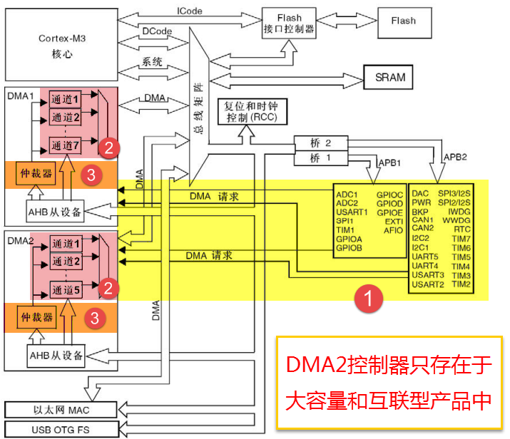
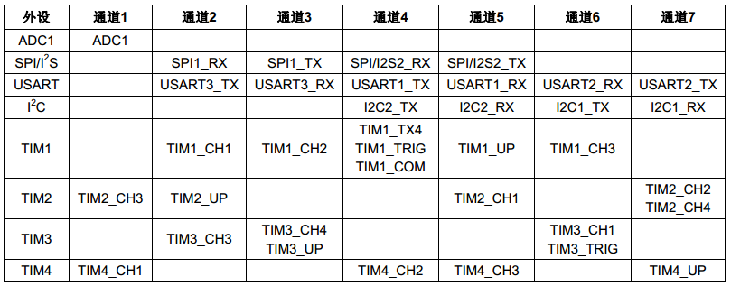
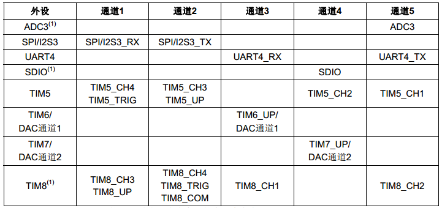

DMA—直接存储区访问
------------------

本章参考资料：《STM32F10X-中文参考手册》DMA控制器章节。

学习本章时，配合《STM32F10X-中文参考手册》DMA控制器章节一起阅读，效果会更佳，特别是涉及到寄存器说明的部分。

DMA简介
~~~~~~~

DMA(Direct Memory Access)—直接存储器存取，是单片机的一个外设，它的主要功能是用来搬数据，
但是不需要占用CPU，即在传输数据的时候，CPU可以干其他的事情，好像是多线程一样。
数据传输支持从外设到存储器或者存储器到存储器，这里的存储器可以是SRAM或者是FLASH。
DMA控制器包含了DMA1和DMA2，其中DMA1有7个通道，DMA2有5个通道，这里的通道可以理解为传输数据的一种管道。要注意的是DMA2只存在于大容量的单片机中。

DMA功能框图
~~~~~~~~~~~

DMA控制器独立于内核，属于一个单独的外设，结构比较简单，从编程的角度来看，我们只需掌握功能框图中的三部分内容即可，
具体见 图21_1_：DMA控制器的框图。

①DMA请求
''''''''

如果外设要想通过DMA来传输数据，必须先给DMA控制器发送DMA请求，DMA收到请求信号之后，控制器会给外设一个应答信号，当外设应答后且DMA控制器收到应答信号之后，就会启动DMA的传输，直到传输完毕。

DMA有DMA1和DMA2两个控制器，DMA1有7个通道，DMA2有5个通道，不同的DMA控制器的通道对应着不同的外设请求，这决定了我们在软件编程上该怎么设置，具体见DMA请求映像表。

图 21‑2 DMA1各个通道的请求映像

图 21‑3 DMA2各个通道的请求映像

其中ADC3、SDIO和TIM8的DMA请求只在大容量产品中存在，这个在具体项目时要注意。

①通道
'''''

DMA具有12个独立可编程的通道，其中DMA1有7个通道，DMA2有5个通道，每个通道对应不同的外设的DMA请求。虽然每个通道可以接收多个外设的请求，但是同一时间只能接收一个，不能同时接收多个。

②仲裁器
'''''''

当发生多个DMA通道请求时，就意味着有先后响应处理的顺序问题，这个就由仲裁器也管理。仲裁器管理DMA通道请求分为两个阶段。第一阶段属于软件阶段，可以在DMA_CCRx寄存器中设置，有4个等级：非常高、高、中和低四个优先级。第二阶段属于硬件阶段，如果两个或以上的DMA通道请求设置的优先级一样，则他们优先级取决于通道编号，编号越低优先权越高，比如通道0高于通道1。在大容量产品和互联型产品中，
DMA1控制器拥有高于DMA2控制器的优先级。

DMA数据配置
~~~~~~~~~~~

使用DMA，最核心就是配置要传输的数据，包括数据从哪里来，要到哪里去，传输的数据的单位是什么，要传多少数据，是一次传输还是循环传输等等。

从哪里来到哪里去
''''''''''''''''

我们知道DMA传输数据的方向有三个：从外设到存储器，从存储器到外设，从存储器到存储器。具体的方向DMA_CCR位4
DIR配置：0表示从外设到存储器，1表示从存储器到外设。这里面涉及到的外设地址由DMA_CPAR配置，存储器地址由DMA_CMAR配置。

外设到存储器
===============

当我们使用从外设到存储器传输时，以ADC采集为例。DMA外设寄存器的地址对应的就是ADC数据寄存器的地址，DMA存储器的地址就是我们自定义的变量（用来接收存储AD采集的数据）的地址。方向我们设置外设为源地址。

存储器到外设
===============

当我们使用从存储器到外设传输时，以串口向电脑端发送数据为例。DMA外设寄存器的地址对应的就是串口数据寄存器的地址，DMA存储器的地址就是我们自定义的变量（相当于一个缓冲区，用来存储通过串口发送到电脑的数据）的地址。方向我们设置外设为目标地址。

存储器到存储器
===============

当我们使用从存储器到存储器传输时，以内部FLASH向内部SRAM复制数据为例。DMA外设寄存器的地址对应的就是内部FLASH（我们这里把内部FALSH当作一个外设来看）的地址，DMA存储器的地址就是我们自定义的变量（相当于一个缓冲区，用来存储来自内部FLASH的数据）的地址。方向我们设置外设（即内部FLASH）为源地址。跟上面两个不一样的是，这里需要把DMA_CCR位14：MEM2MEM：存储器到存储器模式配置为1，启动M2M模式。

要传多少，单位是什么
''''''''''''''''''''

当我们配置好数据要从哪里来到哪里去之后，我们还需要知道我们要传输的数据是多少，数据的单位是什么。

以串口向电脑发送数据为例，我们可以一次性给电脑发送很多数据，具体多少由DMA_CNDTR配置，这是一个32位的寄存器，一次最多只能传输65535个数据。

要想数据传输正确，源和目标地址存储的数据宽度还必须一致，串口数据寄存器是8位的，所以我们定义的要发送的数据也必须是8位。外设的数据宽度由DMA_CCR的PSIZE[1:0]配置，可以是8/16/32位，存储器的数据宽度由DMA_CCR的MSIZE[1:0]配置，可以是8/16/32位。

在DMA控制器的控制下，数据要想有条不紊的从一个地方搬到另外一个地方，还必须正确设置两边数据指针的增量模式。外设的地址指针由DMA_CCRx的PINC配置，存储器的地址指针由MINC配置。以串口向电脑发送数据为例，要发送的数据很多，每发送完一个，那么存储器的地址指针就应该加1，而串口数据寄存器只有一个，那么外设的地址指针就固定不变。具体的数据指针的增量模式由实际情况决定。

什么时候传输完成
''''''''''''''''

数据什么时候传输完成，我们可以通过查询标志位或者通过中断的方式来鉴别。每个DMA通道在DMA传输过半、传输完成和传输错误时都会有相应的标志位，如果使能了该类型的中断后，则会产生中断。有关各个标志位的详细描述请参考DMA中断状态寄存器DMA_ISR的详细描述。

传输完成还分两种模式，是一次传输还是循环传输，一次传输很好理解，即是传输一次之后就停止，要想再传输的话，必须关断DMA使能后再重新配置后才能继续传输。循环传输则是一次传输完成之后又恢复第一次传输时的配置循环传输，不断的重复。具体的由DMA_CCR寄存器的CIRC
循环模式位控制。

DMA初始化结构体详解
~~~~~~~~~~~~~~~~~~~

HAL库函数对每个外设都建立了一个初始化结构体xxx_InitTypeDef(xxx为外设名称)，结构体成员用于设置外设工作参数，并由HAL库函数xxx_Init()调用这些设定参数进入设置外设相应的寄存器，达到配置外设工作环境的目的。

结构体xxx_InitTypeDef和库函数xxx_Init配合使用是HAL库精髓所在，理解了结构体xxx_InitTypeDef每个成员意义基本上就可以对该外设运用自如。结构体xxx_InitTypeDef定义在stm32f1xx_hal_xxx.h(后面xxx为外设名称)文件中，库函数xxx_Init定义在stm32f1xx_xxx.c文件中，编程时我们可以结合这两个文件内注释使用。

DMA_InitTypeDef初始化结构体
''''''''''''''''''''''''''''''''

.. code-block:: c

    typedef struct {

        uint32_t Direction;            //传输方向
        uint32_t PeriphInc;            //外设递增
        uint32_t MemInc;               //存储器递增
        uint32_t PeriphDataAlignment;  //外设数据宽度
        uint32_t MemDataAlignment;     //存储器数据宽度
        uint32_t Mode;                 //模式选择
        uint32_t Priority;             //优先级

    } DMA_InitTypeDef;

1) Direction：传输方向选择，可选外设到存储器、存储器到外设以及存储器到存储器。
它设定DMA_SxCR寄存器的DIR[1:0]位的值。ADC采集显然使用外设到存储器模式。

2) PeripheralInc：如果配置为DMA_PINC_ENABLE，使能外设地址自动递增功能，
它设定DMA_CCR寄存器的PINC位的值；一般外设都是只有一个数据寄存器，所以一般不会使能该位。

3) MemoryInc：如果配置为DMA_MINC_ENABLE，使能存储器地址自动递增功能，它设定DMA_CCR寄存器的MINC位的值；
我们自定义的存储区一般都是存放多个数据的，所以要使能存储器地址自动递增功能。

4) PeriphDataAlignment：外设数据宽度，可选字节(8位)、半字(16位)和字(32位)，
它设定DMA_SxCR寄存器的PSIZE[1:0]位的值。
ADC数据寄存器只有低16位数据有效，使用半字数据宽度。

5) Mode：DMA传输模式选择，可选一次传输或者循环传输，它设定DMA_SxCR寄存器的CIRC位的值。
我们希望ADC采集是持续循环进行的，所以使用循环传输模式。

6) 软件设置数据流的优先级，有4个可选优先级分别为非常高、高、中和低，它设定DMA_SxCR寄存器的PL[1:0]位的值。
DMA优先级只有在多个DMA数据流同时使用时才有意义，这里我们设置为非常高优先级就可以了。

DMA存储器到存储器模式实验
~~~~~~~~~~~~~~~~~~~~~~~~~~~~

本章只讲解存储器到存储器和存储器到外设这两种模式，其他功能模式在其他章节使用到的时候再讲。存储器到存储器模式可以实现数据在两个内存的快速拷贝。我们先定义一个静态的源数据，存放在内部FLASH，然后使用DMA传输把源数据拷贝到目标地址上（内部SRAM），最后对比源数据和目标地址的数据，看看是否传输准确。

硬件设计
''''''''''''''''''''''''''''''''

DMA存储器到存储器实验不需要其他硬件要求，只用到RGB彩色灯用于指示程序状态。

软件设计
''''''''''''''''''''''''''''''''

这里只讲解核心的部分代码，有些变量的设置，头文件的包含等并没有涉及到，完整的代码请参考本章配套的工程。这个实验代码比较简单，主要程序代码都在main.c文件中。

编程要点
=============

1) 使能DMA时钟；

2) 配置DMA数据参数；

3) 使能DMA，进行传输；

4) 等待传输完成，并对源数据和目标地址数据进行比较。

代码分析
========================

DMA宏定义及相关变量定义
+++++++++++++++++++++++++++++

.. code-block:: c
   :caption: 代码清单 21‑1 DMA数据流和相关变量定义
   :name: 代码清单21_1

    /* 相关宏定义，使用存储器到存储器传输必须使用DMA2 */
    DMA_HandleTypeDef DMA_Handle;

    #define DMA_STREAM               DMA2_Stream0
    #define DMA_CHANNEL              DMA_CHANNEL_0
    #define DMA_STREAM_CLOCK()       __DMA2_CLK_ENABLE()

    #define BUFFER_SIZE              32

    /* 定义aSRC_Const_Buffer数组作为DMA传输数据源
    const关键字将aSRC_Const_Buffer数组变量定义为常量类型 */
    const uint32_t aSRC_Const_Buffer[BUFFER_SIZE]= {
        0x01020304,0x05060708,0x090A0B0C,0x0D0E0F10,
        0x11121314,0x15161718,0x191A1B1C,0x1D1E1F20,
        0x21222324,0x25262728,0x292A2B2C,0x2D2E2F30,
        0x31323334,0x35363738,0x393A3B3C,0x3D3E3F40,
        0x41424344,0x44564748,0x494A4B4C,0x4D4E4F50,
        0x51525345,0x55565758,0x595A5B5C,0x5D5E5F60,
        0x61626364,0x65666768,0x696A6B6C,0x6D6E6F70,
        0x71727374,0x75767778,0x797A7B7C,0x7D7E7F80
    };
    /* 定义DMA传输目标存储器 */
    uint32_t aDST_Buffer[BUFFER_SIZE];

使用宏定义设置外设配置方便程序修改和升级。

存储器到存储器传输通道没有硬性规定，可以随意选择。

aSRC_Const_Buffer[BUFFER_SIZE]定义用来存放源数据，并且使用了const关键字修饰，即常量类型，使得变量是存储在内部flash空间上。

DMA数据配置
+++++++++++++++++++++++++++++

.. code-block:: c
   :caption: 代码清单 21‑2 DMA传输参数配置
   :name: 代码清单21_2

    static void DMA_Config(void)
    {
        HAL_StatusTypeDef DMA_status = HAL_ERROR;

        DMA_STREAM_CLOCK();
        //数据流选择
        DMA_Handle.Instance=DMA_STREAM;
        //存储器到外设HAL_DMA_Init(&DMA_Handle);
        DMA_Handle.Init.Direction=DMA_MEMORY_TO_MEMORY;
        //外设非增量模式/* Associate the DMA handle */
        DMA_Handle.Init.PeriphInc=DMA_PINC_ENABLE;
        //存储器增量模式__HAL_LINKDMA(&UartHandle, hdmatx,DMA_Handle);
        DMA_Handle.Init.MemInc=DMA_MINC_ENABLE;
        //外设数据长度:8位
        DMA_Handle.Init.PeriphDataAlignment=DMA_PDATAALIGN_WORD;
        //存储器数据长度:8位
        DMA_Handle.Init.MemDataAlignment=DMA_MDATAALIGN_WORD;
        //外设普通模式
        DMA_Handle.Init.Mode=DMA_NORMAL;
        //中等优先级
        DMA_Handle.Init.Priority=DMA_PRIORITY_MEDIUM;

        /* 完成DMA数据流参数配置 */
        HAL_DMA_Init(&DMA_Handle);
        DMA_status = HAL_DMA_Start(&DMA_Handle,(uint32_t)aSRC_Const_Buffer,
                    (uint32_t)aDST_Buffer,BUFFER_SIZE);
        /* 判断DMA状态 */
        if (DMA_status != HAL_OK) {
            /* DMA出错就让程序运行下面循环：RGB彩色灯闪烁 */
            while (1) {
                LED_RED;
                Delay(0xFFFFFF);
                LED_RGBOFF;
                Delay(0xFFFFFF);
            }
        }
    }

使用DMA_DMA_HandleTypeDef结构体定义一个DMA数据流初始化变量，这个结构体内容我们之前已经有详细讲解。

调用DMA_STREAM_CLOCK函数开启DMA数据流时钟，使用DMA控制器之前必须开启对应的时钟。

存储器到存储器模式通道选择没有具体规定，只能使用一次传输模式不能循环传输，最后我调用HAL_DMA_Init函数完成DMA数据流的初始化配置。

HAL_DMA_Start函数用于启动DMA数据流传输，源地址和目标地址使用之前定义的数组首地址，返回DMA传输状态。

如果DMA传输没有就绪就会闪烁RGB彩灯提示。

存储器数据对比
+++++++++++++++++++++++++++++

.. code-block:: c
   :caption: 代码清单 21‑3 源数据与目标地址数据对比
   :name: 代码清单21_3

    uint8_t Buffercmp(const uint32_t* pBuffer,
                    uint32_t* pBuffer1, uint16_t BufferLength)
    {
        /* 数据长度递减 */
        while (BufferLength--) {
            /* 判断两个数据源是否对应相等 */
            if (*pBuffer != *pBuffer1) {
                /* 对应数据源不相等马上退出函数，并返回0 */
                return 0;
            }
            /* 递增两个数据源的地址指针 */
            pBuffer++;
            pBuffer1++;
        }
        /* 完成判断并且对应数据相对 */
        return 1;
    }

判断指定长度的两个数据源是否完全相等，如果完全相等返回1；只要其中一对数据不相等返回0。它需要三个形参，前两个是两个数据源的地址，第三个是要比较数据长度。

主函数
+++++++++++++++++++++++++++++

.. code-block:: c
   :caption: 代码清单 21‑4 存储器到存储器模式主函数
   :name: 代码清单21_4

    int main(void)
    {
        /* 定义存放比较结果变量 */
        uint8_t TransferStatus;
        /* 系统时钟初始化成72 MHz */
        SystemClock_Config();
        /* LED 端口初始化 */
        LED_GPIO_Config(); 

        /* DMA传输配置 */
        DMA_Config(); 
    
        /* 等待DMA传输完成 */
        while(__HAL_DMA_GET_FLAG(&DMA_Handle,DMA_FLAG_TC6)==RESET)
        {

        }   

        /* 比较源数据与传输后数据 */
        TransferStatus=Buffercmp(aSRC_Const_Buffer, aDST_Buffer, BUFFER_SIZE);

        /* 判断源数据与传输后数据比较结果*/
        if(TransferStatus==0)  
        {
            /* 源数据与传输后数据不相等时LED1亮 */
            LED1_ON;
        }
        else
        { 
            /* 源数据与传输后数据相等时LED2亮 */
            LED2_ON;
        }

        while (1)
        {		
        }
    }

首先定义一个变量用来保存存储器数据比较结果。

SystemClock_Config函数初始化系统时钟。

RGB彩色灯用来指示程序进程，使用之前需要初始化它，LED_GPIO_Config定义在bsp_led.c文件中。开始设置RGB彩色灯为紫色，LED_PURPLE是定义在bsp_led.h文件的一个宏定义。

Delay函数只是一个简单的延时函数。

调用DMA_Config函数完成DMA数据流配置并启动DMA数据传输。

__HAL_DMA_GET_FLAG函数获取DMA数据流事件标志位的当前状态，这里获取DMA数据传输完成这个标志位，使用循环持续等待直到该标志位被置位，即DMA传输完成这个事件发生，然后退出循环，运行之后程序。

确定DMA传输完成之后就可以调用Buffercmp函数比较源数据与DMA传输后目标地址的数据是否一一对应。TransferStatus保存比较结果，如果为1表示两个数据源一一对应相等说明DMA传输成功；相反，如果为0表示两个数据源数据存在不等情况，说明DMA传输出错。

如果DMA传输成功设置RGB彩色灯为蓝色，如果DMA传输出错设置RGB彩色灯为红色。

下载验证
============

确保开发板供电正常，编译程序并下载。观察RGB彩色灯变化情况。正常情况下RGB彩色灯先为紫色，然后变成蓝色。如果DMA传输出错才会为红色。

DMA存储器到外设模式实验
~~~~~~~~~~~~~~~~~~~~~~~

上个实验我们讲了DMA存储器到存储器模式，接下来我们再讲一个存储器到外设的实验。我们先定义一个数据变量，存于SRAM中，然后通过DMA的方式传输到串口的数据寄存器，然后通过串口把这些数据发送到电脑的上位机显示出来。

硬件设计
''''''''''''''

存储器到外设模式使用到USART1功能，具体电路设置参考USART章节，无需其他硬件设计。

软件设计
'''''''''''''

这里只讲解核心的部分代码，有些变量的设置，头文件的包含等并没有涉及到，完整的代码请参考本章配套的工程。我们编写两个串口驱动文件bsp_usart_dma.c和bsp_usart_dma.h，有关串口和DMA的宏定义以及驱动函数都在里边。

.. _编程要点-1:

编程要点
===============

1) 配置USART通信功能；

2) 设置串口DMA工作参数；

3) 使能DMA；

4) DMA传输同时CPU可以运行其他任务。

代码分析
===============

USART和DMA宏定义
+++++++++++++++++++++

.. code-block:: c
   :caption: 代码清单 21‑5 USART和DMA相关宏定义
   :name: 代码清单21_5

    //串口波特率
    #define DEBUG_USART_BAUDRATE                    115200
    //引脚定义
    /*******************************************************/
    #define DEBUG_USART                             USART1
    #define DEBUG_USART_CLK_ENABLE()                 __HAL_RCC_USART1_CLK_ENABLE();
    #define DEBUG_USART_RX_GPIO_PORT                GPIOB
    #define DEBUG_USART_RX_GPIO_CLK_ENABLE()           __HAL_RCC_GPIOB_CLK_ENABLE()
    #define DEBUG_USART_RX_PIN                      GPIO_PIN_7

    #define DEBUG_USART_TX_GPIO_PORT                GPIOB
    #define DEBUG_USART_TX_GPIO_CLK_ENABLE()           __HAL_RCC_GPIOB_CLK_ENABLE()
    #define DEBUG_USART_TX_PIN                      GPIO_PIN_6

    #define DEBUG_USART_IRQHandler                  USART1_IRQHandler
    #define DEBUG_USART_IRQ                 		USART1_IRQn
    /************************************************************/
    //DMA
    #define SENDBUFF_SIZE                     		1000//发送的数据量
    #define DEBUG_USART_DMA_CLK_ENABLE()      		__HAL_RCC_DMA1_CLK_ENABLE();	
    #define DEBUG_USART_DMA_STREAM            		DMA1_Channel4

使用宏定义设置外设配置方便程序修改和升级。

USART部分设置与USART章节内容相同，可以参考USART章节内容理解。

查阅 图21_3_ 可知USART1对应DMA2的数据流7通道4。

串口DMA传输配置
+++++++++++++++++++++

.. code-block:: c
   :caption: 代码清单 21‑6 USART1 发送请求DMA设置
   :name: 代码清单21_6

    void USART_DMA_Config(void)
    {
        DEBUG_USART_DMA_CLK_ENABLE();  
            
        DMA_Handle.Instance=DEBUG_USART_DMA_STREAM;                            //数据流选择
                                    
        DMA_Handle.Init.Direction=DMA_MEMORY_TO_PERIPH;             //存储器到外设HAL_DMA_Init(&DMA_Handle);
        DMA_Handle.Init.PeriphInc=DMA_PINC_DISABLE;                 //外设非增量模式/* Associate the DMA handle */
        DMA_Handle.Init.MemInc=DMA_MINC_ENABLE;                     //存储器增量模式__HAL_LINKDMA(&UartHandle, hdmatx, DMA_Handle); 
        DMA_Handle.Init.PeriphDataAlignment=DMA_PDATAALIGN_BYTE;    //外设数据长度:8位
        DMA_Handle.Init.MemDataAlignment=DMA_MDATAALIGN_BYTE;       //存储器数据长度:8位
        DMA_Handle.Init.Mode=DMA_NORMAL;                            //外设普通模式
        DMA_Handle.Init.Priority=DMA_PRIORITY_MEDIUM;               //中等优先级
        
        HAL_DMA_Init(&DMA_Handle);
        /* Associate the DMA handle */
        __HAL_LINKDMA(&UartHandle, hdmatx, DMA_Handle); 
    
    }

首先定义一个DMA初始化变量，用来填充DMA的参数，然后使能DMA时钟。

因为数据是从存储器到串口，所以设置存储器为源地址，串口的数据寄存器为目标地址，要发送的数据有很多且都先存储在存储器中，则存储器地址指针递增，串口数据寄存器只有一个，则外设地址地址不变，两边数据单位设置成一致，传输模式可选一次或者循环传输，只有一个DMA请求，优先级随便设，最后调用HAL_DMA_Init函数把这些参数写到DMA的寄存器中，然后使能DMA开始传输。

__HAL_LINKDMA函数用于链接DMA数据流及通道到串口外设通道上。

主函数
+++++++++++++++++++++

.. code-block:: c
   :caption: 代码清单 21‑7 存储器到外设模式主函数
   :name: 代码清单21_7

    int main(void)
    {
        uint16_t i;
        
        SystemClock_Config();
            /* 开启复用寄存器时钟 */
            __HAL_RCC_SYSCFG_CLK_ENABLE();
        /* 初始化USART */
        Debug_USART_Config(); 

        /* 配置使用DMA模式 */
        USART_DMA_Config();
        
        /* 配置RGB彩色灯 */
        LED_GPIO_Config();

        printf("\r\n USART1 DMA TX 测试 \r\n");
        
        /*填充将要发送的数据*/
        for(i=0;i<SENDBUFF_SIZE;i++)
        {
            SendBuff[i]	 = 'A';
            
        }

        /*为演示DMA持续运行而CPU还能处理其它事情，持续使用DMA发送数据，量非常大，
        *长时间运行可能会导致电脑端串口调试助手会卡死，鼠标乱飞的情况，
        *或把DMA配置中的循环模式改为单次模式*/		
        
        /* USART1 向 DMA发出TX请求 */
        HAL_UART_Transmit_DMA(&UartHandle, (uint8_t *)SendBuff ,SENDBUFF_SIZE);

        /* 此时CPU是空闲的，可以干其他的事情 */  
        //例如同时控制LED
        while(1)
        {
            LED1_TOGGLE
            Delay(0xFFFFF);
        }
    }

SystemClock_Config函数初始化系统时钟。

Debug_USART_Config函数定义在bsp_usart_dma.c中，它完成USART初始化配置，包括GPIO初始化，USART通信参数设置等等，具体可参考USART章节讲解。

USART_DMA_Config函数也是定义在bsp_usart_dma.c中，之前我们已经详细分析了。

LED_GPIO_Config函数定义在bsp_led.c中，它完成RGB彩色灯初始化配置，具体可参考GPIO章节讲解。

使用for循环填充源数据，SendBuff[SENDBUFF_SIZE]是一个全局无符号8位整数数组，是DMA传输的源数据。

HAL_UART_Transmit_DMA函数用于启动USART的DMA传输。只需要指定源数据地址及长度，运行该函数后USART的DMA发送传输就开始了，根据配置它会通过USART循环发送数据。

DMA传输过程是不占用CPU资源的，可以一边传输一次运行其他任务。

下载验证
===========

保证开发板相关硬件连接正确，用USB线连接开发板的USB转串口和电脑，在电脑端打开串口调试助手，把编译好的程序下载到开发板。程序运行后在串口调试助手可接收到大量的数据，同时开发板上RGB彩色灯不断闪烁。

这里要注意为演示DMA持续运行并且CPU还能处理其它事情，持续使用DMA发送数据，量非常大，长时间运行可能会导致电脑端串口调试助手会卡死，鼠标乱飞的情况，所以在测试时最好把串口调试助手的自动清除接收区数据功能勾选上或把DMA配置中的循环模式改为单次模式。
