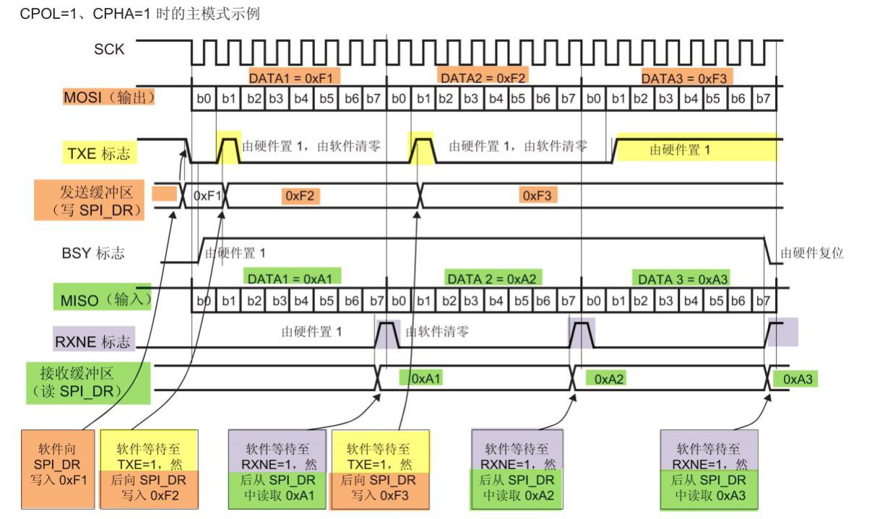

SPI—读写串行FLASH
-----------------

本章参考资料：《STM32F10X-中文参考手册》SPI章节及《SPI总线协议介绍》。

若对SPI通讯协议不了解，可先阅读《SPI总线协议介绍》文档的内容学习。

关于FLASH存储器，请参考“常用存储器介绍”章节，实验中FLASH芯片的具体参数，请参考其规格书《W25Q64》来了解。

SPI协议简介
~~~~~~~~~~~

SPI协议是由摩托罗拉公司提出的通讯协议(Serial Peripheral
Interface)，即串行外围设备接口，是一种高速全双工的通信总线。它被广泛地使用在ADC、LCD等设备与MCU间，要求通讯速率较高的场合。

学习本章时，可与I2C章节对比阅读，体会两种通讯总线的差异以及EEPROM存储器与FLASH存储器的区别。下面我们分别对SPI协议的物理层及协议层进行讲解。

SPI物理层
^^^^^^^^^^^^^

SPI通讯设备之间的常用连接方式见 图24_1_。

.. image:: media/image2.png
   :align: center
   :alt: 图 24‑1 常见的SPI通讯系统
   :name: 图24_1

图 24‑1 常见的SPI通讯系统

SPI通讯使用3条总线及片选线，3条总线分别为SCK、MOSI、MISO，片选线为
，它们的作用介绍如下：

(1) *(* *Slave
    Select)*\ ：从设备选择信号线，常称为\ *片选信号线，也称为NSS、CS，以下用
    NSS表示。*\ 当有多个SPI从设备与SPI主机相连时，设备的其它信号线SCK、MOSI及MIS
    O同时并联到相同的SPI总线上，即无论有多少个从设备，都共同只使用这3条总线；而每个从设
    备都有独立的这一条NSS信号线，本信号线独占主机的一个引脚，即有多少个从设备，就有多少
    条片选信号线。I2C协议中通过设备地址来寻址、选中总线上的某个设备并与其进行通讯；而SPI协
    议中没有设备地址，它使用NSS信号线来寻址，当主机要选择从设备时，把该从设备的NSS信号线设
    置为低电平，该从设备即被选中，即片选有效，接着主机开始与被选中的从设备进行SPI通讯。所以SPI通
    讯以NSS线置低电平为开始信号，以NSS线被拉高作为结束信号。

(2) *SCK (Serial
    Clock)*\ ：\ *时钟信号线*\ ，用于通讯数据同步。它由通讯主机产生，决定了
    通讯的速率，不同的设备支持的最高时钟频率不一样，如STM32的SPI时钟
    频率最大为f\ :sub:`pclk`/2，两个设备之间通讯时，通讯速率受限于低速设备。

(3) *MOSI (Master Output， Slave
    Input)*\ ：主设备输出/从设备输入引脚。主机的数据从这条
    信号线输出，从机由这条信号线读入主机发送的数据，即这条线上数据的方向为\ *主机到从机*\ 。

(4) *MISO(Master Input,，Slave
    Output)*\ ：主设备输入/从设备输出引脚。主机从这条信
    线读入数据，从机的数据由这条信号线输出到主机，即在这条线上数据的方向为\ *从机到主机*\ 。

协议层
^^^^^^

与I2C的类似，SPI协议定义了通讯的\ *起始和停止信号、数据有效性、时钟同步等环节*\ 。

SPI基本通讯过程
'''''''''''''''

先看看SPI通讯的通讯时序，见 图24_2_。

图 24‑2 SPI通讯时序

这是一个主机的通讯时序。NSS、SCK、MOSI信号都由主机控制产生，而MISO的信号由从机产生，主机通过该信号线读取从机的数据。MOSI与MISO的信号只在NSS为低电平的时候才有效，在SCK的每个时钟周期MOSI和MISO传输一位数据。

以上通讯流程中包含的各个信号分解如下：

通讯的起始和停止信号
''''''''''''''''''''

在 图24_2_ 中的标号处，NSS信号线由高变低，是SPI通讯的起始信号。
NSS是每个从机各自独占的信号线，当从机在自己的NSS线检测到起始信号后，就知道自己被主机选中了，开始准备与主机通讯。在图中的标号处，NSS信号由低变高，是SPI通讯的停止信号，表示本次通讯结束，从机的选中状态被取消。

数据有效性
''''''''''

SPI使用MOSI及MISO信号线来传输数据，使用SCK信号线进行数据同步。MOSI及MISO数据线在SCK的每个时钟周期传输一位数据，且数据输入输出是同时进行的。数据传输时，MSB先行或LSB先行并没有作硬性规定，但要保证两个SPI通讯设备之间使用同样的协定，一般都会采用图
24‑2中的MSB先行模式。

观察图中的标号处，MOSI及MISO的数据在SCK的上升沿期间变化输出，在SCK的下降沿时被采样。即在SCK的下降沿时刻，MOSI及MISO的数据有效，高电平时表示数据“1”，为低电平时表示数据“0”。在其它时刻，数据无效，MOSI及MISO为下一次表示数据做准备。

SPI每次数据传输可以8位或16位为单位，每次传输的单位数不受限制。

CPOL/CPHA及通讯模式
'''''''''''''''''''

.. _通讯模式:

上面讲述的图
24‑2中的时序只是SPI中的其中一种通讯模式，SPI一共有四种通讯模式，它们的主要区别是总线空闲时SCK的时钟状态以及数据采样时刻。为方便说明，在此引入“时钟极性CPOL”和“时钟相位CPHA”的概念。

时钟极性CPOL是指SPI通讯设备处于空闲状态时，SCK信号线的电平信号(即SPI通讯开始前、
NSS线为高电平时SCK的状态)。CPOL=0时，
SCK在空闲状态时为低电平，CPOL=1时，则相反。

时钟相位CPHA是指数据的采样的时刻，当CPHA=0时，MOSI或
MISO数据线上的信号将会在SCK时钟线的“奇数边沿”被采样。
当CPHA=1时，数据线在SCK的“偶数边沿”采样。见 图24_3_ 及 图24_4_。

图 24‑3 CPHA=0时的SPI通讯模式

我们来分析这个CPHA=0的时序图。首先，根据SCK在空闲状态时的电平，分为两种情况。SCK信号线在空闲状态为低电平时，CPOL=0；空闲状态为高电平时，CPOL=1。

无论CPOL=0还是=1，因为我们配置的时钟相位CPHA=0，在图中可以看到，采样时刻都是在SCK的奇数边沿。注意当CPOL=0的时候，时钟的奇数边沿是上升沿，而CPOL=1的时候，时钟的奇数边沿是下降沿。所以SPI的采样时刻不是由上升/下降沿决定的。MOSI和MISO数据线的有效信号在SCK的奇数边沿保持不变，数据信号将在SCK奇数边沿时被采样，在非采样时刻，MOSI和MISO的有效信号才发生切换。

类似地，当CPHA=1时，不受CPOL的影响，数据信号在SCK的偶数边沿被采样，见 图24_4_。

图 24‑4 CPHA=1时的SPI通讯模式

由CPOL及CPHA的不同状态，SPI分成了四种模式，见表
24‑1，主机与从机需要工作在相同的模式下才可以正常通讯，实际中采用较多的是“模式0”与“模式3”。

表 24‑1 SPI的四种模式

======= ==== ==== ============= ========
SPI模式 CPOL CPHA 空闲时SCK时钟 采样时刻
0       0    0    低电平        奇数边沿
1       0    1    低电平        偶数边沿
2       1    0    高电平        奇数边沿
3       1    1    高电平        偶数边沿
======= ==== ==== ============= ========

STM32的SPI特性及架构
~~~~~~~~~~~~~~~~~~~~

与I2C外设一样，STM32芯片也集成了专门用于SPI协议通讯的外设。

STM32的SPI外设简介
^^^^^^^^^^^^^^^^^^

STM32的SPI外设可用作通讯的主机及从机，支持最高的SCK时钟频率为f\ :sub:`pclk`/2
(STM32F103型号的芯片默认f:sub:`pclk1`\ 为72MHz，f\ :sub:`pclk2`\ 为36MHz)，完全支
持SPI协议的4种模式，数据帧长度可设置为8位或16位，可设置数据MSB先行或LSB先行。它还支持
双线全双工(前面小节说明的都是这种模式)、双线单向以及单线模式。其中双线单向模式可以同时
使用MOSI及MISO数据线向一个方向传输数据，可以加快一倍的传输速度。而单线模式则可以减少硬
件接线，当然这样速率会受到影响。我们只讲解双线全双工模式。

STM32的SPI架构剖析
^^^^^^^^^^^^^^^^^^

图 24‑5 SPI架构图

通讯引脚
''''''''

SPI的所有硬件架构都从图
24‑5中左侧MOSI、MISO、SCK及NSS线展开的。STM32芯片有多个SPI外设，它们的SPI通讯信号引出到不同的GPIO引脚上，使用时必须配置到这些指定的引脚，见表
24‑2。关于GPIO引脚的复用功能，可查阅《STM32F10x规格书》，以它为准。

表 24‑2 STM32F10x的SPI引脚(整理自《STM32F10x规格书》)

==== ======= ==== ================
引脚 SPI编号
\    SPI1    SPI2 SPI3
NSS  PA4     PB12 PA15下载口的TDI
CLK  PA5     PB13 PB3下载口的TDO
MISO PA6     PB14 PB4下载口的NTRST
MOSI PA7     PB15 PB5
==== ======= ==== ================

其中SPI1是APB2上的设备，最高通信速率达36Mbtis/s，SPI2、SPI3是APB1上的设备，最高通信速率为18Mbits/s。除了通讯速率，在其它功能上没有差异。其中SPI3用到了下载接口的引脚，这几个引脚默认功能是下载，第二功能才是IO口，如果想使用SPI3接口，则程序上必须先禁用掉这几个IO口的下载功能。一般在资源不是十分紧张的情况下，这几个IO口是专门用于下载和调试程序，不会复用为SPI3。

时钟控制逻辑
''''''''''''

SCK线的时钟信号，由波特率发生器根据“\ *控制寄存器CR1”中的BR[0:2]位*\ 控制，该
位是对f\ :sub:`pclk`\ 时钟的分频因子，对f\ :sub:`pclk`\ 的分频结果就是SCK引脚的输出时钟频率，计算方法见表
24‑3。

表 24‑3 BR位对fpclk的分频

=======  =================  ==============  =================  ===  ===============
BR[0:2]  分频结果(SCK频率)  BR[0:2]         分频结果(SCK频率)
000      f\                 :sub:`pclk`/2   100                f\   :sub:`pclk`/32
001      f\                 :sub:`pclk`/4   101                f\   :sub:`pclk`/64
010      f\                 :sub:`pclk`/8   110                f\   :sub:`pclk`/128
011      f\                 :sub:`pclk`/16  111                f\   :sub:`pclk`/256
=======  =================  ==============  =================  ===  ===============

其中的f\ :sub:`pclk`\ 频率是指SPI所在的APB总线
频率，APB1为f\ :sub:`pclk1`\ ，APB2为f\ :sub:`pckl2`\ 。

通过配置“控制寄存器CR”的“CPOL位”及“CPHA”位可以把SPI设置成前面分析的\ `4种SPI模式 <\l>`__\ 。

数据控制逻辑
''''''''''''

SPI的MOSI及MISO都连接到数据移位寄存器上，数据移位寄存器的数据来源及目标接收、发送缓冲区以及MISO、MOSI线。当向外发送数据的时候，数据移位寄存器以“发送缓冲区”为数据源，把数据一位一位地通过数据线发送出去；当从外部接收数据的时候，数据移位寄存器把数据线采样到的数据一位一位地存储到“接收缓冲区”中。通过写SPI的“数据寄存器DR”把数据填充到发送F缓冲区中，通讯读“数据寄存器DR”，可以获取接收缓冲区中的内容。其中数据帧长度可以通过“控制寄存器CR1”的“DFF位”配置成8位及16位模式；配置“LSBFIRST位”可选择MSB先行还是LSB先行。

整体控制逻辑
''''''''''''

整体控制逻辑负责协调整个SPI外设，控制逻辑的工作模式根据我们配置的“控制寄存器(CR1/CR2)”的参数而改变，基本的控制参数包括前面提到的SPI模式、波特率、LSB先行、主从模式、单双向模式等等。在外设工作时，控制逻辑会根据外设的工作状态修改“状态寄存器(SR)”，我们只要读取状态寄存器相关的寄存器位，就可以了解SPI的工作状态了。除此之外，控制逻辑还根据要求，负责控制产生SPI中断信号、DMA请求及控制NSS信号线。

实际应用中，我们一般不使用STM32
SPI外设的标准NSS信号线，而是更简单地使用普通的GPIO，软件控制它的电平输出，从而产生通讯起始和停止信号。

通讯过程
^^^^^^^^

.. _SPI通讯过程:

STM32使用SPI外设通讯时，在通讯的不同阶段它会对“状态寄存器SR”的不同数据位写入参数，我们通过读取这些寄存器标志来了解通讯状态。

图24_6_ 中的是“主模式”流程，即STM32作为SPI通讯的主机端时的数据收发过程。

图 24‑6 主发送器通讯过程

主模式收发流程及事件说明如下：

(1) 控制NSS信号线，产生起始信号(图中没有画出)；

(2) 把要发送的数据写入到“数据寄存器DR”中，该数据会被存储到发送缓冲区；

(3) 通讯开始，SCK时钟开始运行。MOSI把发送缓冲区中的数据一位一位地传输出去；MISO则把数据一位一位地存储进接收缓冲区中；

(4) 当发送完一帧数据的时候，“状态寄存器SR”中的“TXE标志位”会被置1，表
示传输完一帧，发送缓冲区已空；类似地，当接收完一帧数据
的时候，“RXNE标志位”会被置1，表示传输完一帧，接收缓冲区非空；

(5) 等待到“TXE标志位”为1时，若还要继续发送数据，则再次
往“数据寄存器DR”写入数据即可；等待到“RXNE标志位”为1时，通过读
取“数据寄存器DR”可以获取接收缓冲区中的内容。

假如我们使能了TXE或RXNE中断，TXE或RXNE置1时会产生SPI中断信号，进入同一个中断服务函数，到SPI中断服务程序后，可通过检查寄存器位来了解是哪一个事件，再分别进行处理。也可以使用DMA方式来收发“数据寄存器DR”中的数据。

SPI初始化结构体详解
~~~~~~~~~~~~~~~~~~~

跟其它外设一样，STM32HAL库提供了SPI初始化结构体及初始化函数来配置SPI外设。
初始化结构体及函数定义在库文件“stm32f4xx_hal_spi.h”及“stm32f4xx_hal_spi.c”中，
编程时我们可以结合这两个文件内的注释使用或参考库帮助文档。
了解初始化结构体后我们就能对SPI外设运用自如了，见 代码清单24_1_。

.. code-block:: c
   :caption: 代码清单 24‑1 SPI初始化结构体
   :name: 代码清单24_1

    typedef struct {
        uint32_t Mode;      /*设置SPI的主/从机端模式 */
        uint32_t Direction; /*设置SPI的单双向模式 */
        uint32_t DataSize;  /*设置SPI的数据帧长度，可选8/16位 */
        uint32_t CLKPolarity;/*设置时钟极性CPOL，可选高/低电平*/
        uint32_t CLKPhase; /*设置时钟相位，可选奇/偶数边沿采样 */
        uint32_t NSS;       /*设置NSS引脚由SPI硬件控制还是软件控制*/
        uint32_t BaudRatePrescaler; /*设置时钟分频因子，fpclk/分频数=fSCK */
        uint32_t FirstBit; /*设置MSB/LSB先行 */
        uint32_t TIMode;   /*指定是否启用TI模式 */
        uint32_t CRCCalculation; /*指定是否启用CRC计算*/
        uint32_t CRCPolynomial;  /*设置CRC校验的表达式*/
    } SPI_InitTypeDef;

这些结构体成员说明如下，其中括号内的文字是对应参数在STM32标准库中定义的宏：

(1) *Mode：*\ 本成员设置SPI工作在\ *主机模式(SPI_MODE_MASTER)*\ 或\ *从机模式(SPI_MODE
    \_SLAVE
    )*\ ，这两个模式的最大区别为SPI的SCK信号线的时序，\ *SCK的时序是由通讯中的主机产生的*\ 。
    若被配置为从机模式，STM32的SPI外设将接受外来的SCK信号。

(2) *Direction：本成员设置SPI的通讯方向，可设置为双线全双工(SPI_DIRECTION_2LINES)，
    双线只接收(SPI_DIRECTION_2LINES_RXONLY)，单线SPI_DIRECTION_1LINE。*

(3) *DataSize：*\ 本成员可以选择SPI通讯的数据帧大小是为
    8位(SPI_DATASIZE_8BIT)还是16位(SPI_DATASIZE_16BIT)。

(4) CLKPolarity和CLKPhase：这两个成员配置SPI的时钟极性CLKPolarity
    和时钟相位CLKPhase ，这两个配置影响到SPI的通讯
    模式，关于CLKPolarity 和CLKPhase 的说明参考前面“通讯模式_”小节。
    时钟极性CLKPolarity成员，可设置为高电平(SPI_POLARITY_HIGH)或低电平(SPI_POLARITY_LOW)。时钟
    相位CPHA 则可以设置为SPI_PHASE_1EDGE(在SCK的奇数边沿采集数据) 或SPI_P
    HASE_2EDGE(在SCK的偶数边沿采集数据) 。

(5) *NSS：*\ 本成员配置NSS引脚的使用模式，可以选择为\ *硬件模式(SPI_NSS_HARD )*\ 与\ *软
    件模式( SPI_NSS_SOFT )*\ ，在硬件模式中的SPI片选信号由SPI硬件自动产生，而软件模式则需要我们亲
    自把相应的GPIO端口拉高或置低产生非片选和片选信号。实际中软件模式应用比较多。

(6)  *BaudRatePrescaler：*\ 本成员设置波特率分频因子，分频后的时钟即为SPI的SCK信号
     线的时钟频率。这个成员参数可设置为fpclk的2、4、6、8、16、32、64、128、256分频。

(7)  *FirstBit：*\ 所有串行的通讯协议都会有\ *MSB先行(高位数据在前)*\ 还是\ *LSB先行(低位数据在前)*\ 的问题，
     而STM32的SPI模块可以通过这个结构体成员，对这个特性编程控制。

(8)  TIMode ：指定是否启用TI模式。可选择为使能\ *( SPI_TIMO
     DE_ENABLE )*\ 与不是能\ *( SPI_TIMODE_DISABLE )。*

(9)  CRCCalculation ：指定是否启用CRC计算

(10) *SPI_CRCPolynomial：*\ 这是SPI的\ *CRC校验中的多项式*\ ，若我们使
     用CRC校验时，就使用这个成员的参数(多项式)，来计算CRC的值。

配置完这些结构体成员后，我们要调用\ *HAL_SPI_Init*\ 函数把这些参数写入到寄存器中，实现
SPI的初始化，然后调用\ *\__HAL_SPI_ENABLE*\ 来使能SPI外设。

SPI—读写串行FLASH实验
~~~~~~~~~~~~~~~~~~~~~

FLSAH存储器又称闪存，它与EEPROM都是掉电后数据不丢失的存储器，但FLASH存储器容量普遍大于EEPROM，现在基本取代了它的地位。我们生活中常用的U盘、SD卡、SSD固态硬盘以及我们STM32芯片内部用于存储程序的设备，都是FLASH类型的存储器。在存储控制上，最主要的区别是FLASH芯片只能一大片一大片地擦写，而在“I2C章节”中我们了解到EEPROM可以单个字节擦写。

本小节以一种使用SPI通讯的串行FLASH存储芯片的读写实验为大家讲解STM32的SPI使用方法。实验中STM32的SPI外设采用主模式，通过查询事件的方式来确保正常通讯。

硬件设计
^^^^^^^^

图 24‑7 SPI串行FLASH硬件连接图

本实验板中的FLASH芯片(型号：W25Q64)是一种使用SPI通讯协议的NOR
FLASH存储器，它的CS/CLK/DIO/DO引脚分别连接到了STM32对应的SPI引脚NSS/SCK/MOSI/MISO上，其中STM32的NSS引脚虽然是其片上SPI外设的硬件引脚，但实际上后面的程序只是把它当成一个普通的GPIO，使用软件的方式控制NSS信号，所以在SPI的硬件设计中，NSS可以随便选择普通的GPIO，不必纠结于选择硬件NSS信号。

FLASH芯片中还有WP和HOLD引脚。WP引脚可控制写保护功能，当该引脚为低电平时，禁止写入数据。我们直接接电源，不使用写保护功能。HOLD引脚可用于暂停通讯，该引脚为低电平时，通讯暂停，数据输出引脚输出高阻抗状态，时钟和数据输入引脚无效。我们直接接电源，不使用通讯暂停功能。

关于FLASH芯片的更多信息，可参考其数据手册《W25Q64》来了解。若您使用的实验板FLASH的型号或控制引脚不一样，只需根据我们的工程修改即可，程序的控制原理相同。

软件设计
^^^^^^^^

为了使工程更加有条理，我们把读写FLASH相关的代码独立分开存储，方便以后移植。在“工程模板”之上新建“bsp_spi_flash.c”及“bsp_spi_flash.h”文件，这些文件也可根据您的喜好命名，它们不属于STM32HAL库的内容，是由我们自己根据应用需要编写的。

编程要点
''''''''

(1) 初始化通讯使用的目标引脚及端口时钟；

(2) 使能SPI外设的时钟；

(3) 配置SPI外设的模式、地址、速率等参数并使能SPI外设；

(4) 编写基本SPI按字节收发的函数；

(5) 编写对FLASH擦除及读写操作的的函数；

(6) 编写测试程序，对读写数据进行校验。

代码分析
''''''''

SPI硬件相关宏定义
====================

我们把SPI硬件相关的配置都以宏的形式定义到 “bsp_spi_flash.h”文件中，见 代码清单24_2_。

.. code-block:: c
   :caption: 代码清单 24‑2 SPI硬件配置相关的宏
   :name: 代码清单24_2

    #define SPIx                             SPI2
    #define SPIx_CLK_ENABLE()                __HAL_RCC_SPI2_CLK_ENABLE()
    #define SPIx_SCK_GPIO_CLK_ENABLE()       __HAL_RCC_GPIOB_CLK_ENABLE()
    #define SPIx_MISO_GPIO_CLK_ENABLE()      __HAL_RCC_GPIOB_CLK_ENABLE() 
    #define SPIx_MOSI_GPIO_CLK_ENABLE()      __HAL_RCC_GPIOB_CLK_ENABLE() 
    #define SPIx_CS_GPIO_CLK_ENABLE()        __HAL_RCC_GPIOB_CLK_ENABLE() 

    #define SPIx_FORCE_RESET()               __HAL_RCC_SPI2_FORCE_RESET()
    #define SPIx_RELEASE_RESET()             __HAL_RCC_SPI2_RELEASE_RESET()

    /* Definition for SPIx Pins */
    #define SPIx_SCK_PIN                     GPIO_PIN_13
    #define SPIx_SCK_GPIO_PORT               GPIOB

    #define SPIx_MISO_PIN                    GPIO_PIN_14
    #define SPIx_MISO_GPIO_PORT              GPIOB

    #define SPIx_MOSI_PIN                    GPIO_PIN_15
    #define SPIx_MOSI_GPIO_PORT              GPIOB

    #define FLASH_CS_PIN                     GPIO_PIN_12            
    #define FLASH_CS_GPIO_PORT               GPIOB                 

    #define	digitalHi(p,i)			    {p->BSRR=i;}			  //设置为高电平		
    #define digitalLo(p,i)			    {p->BSRR=(uint32_t)i << 16;}				//输出低电平
    #define SPI_FLASH_CS_LOW()      digitalLo(FLASH_CS_GPIO_PORT,FLASH_CS_PIN )
    #define SPI_FLASH_CS_HIGH()     digitalHi(FLASH_CS_GPIO_PORT,FLASH_CS_PIN )

以上代码根据硬件连接，把与FLASH通讯使用的SPI号、GPIO等都以宏封装起来，
并且定义了控制CS(NSS)引脚输出电平的宏，以便配置产生起始和停止信号时使用。

初始化SPI的 GPIO 
=======================

利用上面的宏，编写SPI的初始化函数，见 代码清单24_3_。

.. code-block:: c
   :caption: 代码清单 24‑3 SPI的初始化函数(GPIO初始化部分)
   :name: 代码清单24_3

    void HAL_SPI_MspInit(SPI_HandleTypeDef *hspi)
    {
        GPIO_InitTypeDef  GPIO_InitStruct;

        /*##-1- Enable peripherals and GPIO Clocks
        #################################*/
        /* Enable GPIO TX/RX clock */
        SPIx_SCK_GPIO_CLK_ENABLE();
        SPIx_MISO_GPIO_CLK_ENABLE();
        SPIx_MOSI_GPIO_CLK_ENABLE();
        SPIx_CS_GPIO_CLK_ENABLE();
        /* Enable SPI clock */
        SPIx_CLK_ENABLE();

        /*##-2- Configure peripheral GPIO
        ##########################################*/
        /* SPI SCK GPIO pin configuration  */
        GPIO_InitStruct.Pin       = SPIx_SCK_PIN;
        GPIO_InitStruct.Mode      = GPIO_MODE_AF_PP;
        GPIO_InitStruct.Pull      = GPIO_PULLUP;
        GPIO_InitStruct.Speed     = GPIO_SPEED_FREQ_HIGH;

        HAL_GPIO_Init(SPIx_SCK_GPIO_PORT, &GPIO_InitStruct);

        /* SPI MISO GPIO pin configuration  */
        GPIO_InitStruct.Pin = SPIx_MISO_PIN;
        HAL_GPIO_Init(SPIx_MISO_GPIO_PORT, &GPIO_InitStruct);

        /* SPI MOSI GPIO pin configuration  */
        GPIO_InitStruct.Pin = SPIx_MOSI_PIN;
        HAL_GPIO_Init(SPIx_MOSI_GPIO_PORT, &GPIO_InitStruct);

        GPIO_InitStruct.Pin = FLASH_CS_PIN ;
        GPIO_InitStruct.Mode = GPIO_MODE_OUTPUT_PP;
        HAL_GPIO_Init(FLASH_CS_GPIO_PORT, &GPIO_InitStruct);
    }

与所有使用到GPIO的外设一样，都要先把使用到的GPIO引脚模式初始化，配置好复用功能。GPIO初始化流程如下：

(1) 使用GPIO_InitTypeDef定义GPIO初始化结构体变量，以便下面用于存储GPIO配置；

(2) 调用库函数SPIx_SCK_GPIO_CLK_ENABLE()，SPIx_MISO_GPIO_CLK_ENA
    BLE()等完成SPI相关引脚的时钟使能。调用库函数SPIx_CLK_ENABLE()完成SPI外设的使能。

(3) 向GPIO初始化结构体赋值，把SCK/MOSI/MISO引脚初始化成复用
    推挽模式。而CS(NSS)引脚由于使用软件控制，我们把它配置为普通的推挽输出模式。

(4) 使用以上初始化结构体的配置，调用HAL_GPIO_Init函数向分别寄存器写入参数，完成GPIO的初始化。

配置SPI的模式
======================

以上只是配置了SPI使用的引脚，对SPI外设模式的配置。在配置STM32的SPI模式前，我们要先了解从机端的SPI模式。
本例子中可通过查阅FLASH数据手册《W25Q64》获取。根据FLASH芯片的说明，它支持SPI模式0及模式3，
支持双线全双工，使用MSB先行模式，支持最高通讯时钟为104MHz，数据帧长度为8位。我们要把STM32的SPI外设中的这些参数配置一致。
见 代码清单24_4_。

.. code-block:: c
   :caption: 代码清单 24‑4 配置SPI模式
   :name: 代码清单24_4

    void SPI_FLASH_Init(void)
    {
        SpiHandle.Instance               = SPIx;
        SpiHandle.Init.BaudRatePrescaler = SPI_BAUDRATEPRESCALER_4;
        SpiHandle.Init.Direction         = SPI_DIRECTION_2LINES;
        SpiHandle.Init.CLKPhase          = SPI_PHASE_2EDGE;
        SpiHandle.Init.CLKPolarity       = SPI_POLARITY_HIGH;
        SpiHandle.Init.CRCCalculation    = SPI_CRCCALCULATION_DISABLE;
        SpiHandle.Init.CRCPolynomial     = 7;
        SpiHandle.Init.DataSize          = SPI_DATASIZE_8BIT;
        SpiHandle.Init.FirstBit          = SPI_FIRSTBIT_MSB;
        SpiHandle.Init.NSS               = SPI_NSS_SOFT;
        SpiHandle.Init.TIMode            = SPI_TIMODE_DISABLE;

        SpiHandle.Init.Mode = SPI_MODE_MASTER;

        HAL_SPI_Init(&SpiHandle);

        __HAL_SPI_ENABLE(&SpiHandle);
    }

这段代码中，把STM32的SPI外设配置为主机端，双线全双工模式，数据帧长度为8位，使用SPI模式3(CLKPolarity
=1，CLKPhase
=1)，NSS引脚由软件控制以及MSB先行模式。代码中把SPI的时钟频率配置成了4分频，实际上可以配置成2分频以提高通讯速率，读者可亲自尝试一下。最后一个成员为CRC计算式，由于我们与FLASH芯片通讯不需要CRC校验，并没有使能SPI的CRC功能，这时CRC计算式的成员值是无效的。

赋值结束后调用库函数HAL_SPI_Init把这些配置写入寄存器，并调用__HAL_SPI_ENABLE函数使能外设。

使用SPI发送和接收一个字节的数据
=================================

初始化好SPI外设后，就可以使用SPI通讯了，复杂的数据通讯都是由单个字节数据收发组成的，我们看看它的代码实现，
见 代码清单24_5_。

.. code-block:: c
   :caption: 代码清单 24‑5 使用SPI发送和接收一个字节的数据
   :name: 代码清单24_5

    #define Dummy_Byte 0xFF
    /**
    * @brief  使用SPI发送一个字节的数据
    * @param  byte：要发送的数据
    * @retval 返回接收到的数据
    */
    u8 SPI_FLASH_SendByte(u8 byte)
    {
        SPITimeout = SPIT_FLAG_TIMEOUT;

        /* 等待发送缓冲区为空，TXE事件 */
        while (__HAL_SPI_GET_FLAG( &SpiHandle, SPI_FLAG_TXE ) == RESET)
        {
            if ((SPITimeout--) == 0) return SPI_TIMEOUT_UserCallback(0);
        }

        /* 写入数据寄存器，把要写入的数据写入发送缓冲区 */
        SPI_I2S_SendData(FLASH_SPI, byte);

        SPITimeout = SPIT_FLAG_TIMEOUT;

        /* 等待接收缓冲区非空，RXNE事件 */
        while (__HAL_SPI_GET_FLAG( &SpiHandle, SPI_FLAG_RXNE ) == RESET)
        {
            if ((SPITimeout--) == 0) return SPI_TIMEOUT_UserCallback(1);
        }

        /* 读取数据寄存器，获取接收缓冲区数据 */
        return READ_REG(SpiHandle.Instance->DR);
    }

    /**
    * @brief  使用SPI读取一个字节的数据
    * @param  无
    * @retval 返回接收到的数据
    */
    u8 SPI_FLASH_ReadByte(void)
    {
        return (SPI_FLASH_SendByte(Dummy_Byte));
    }

SPI_FLASH_SendByte发送单字节函数中包含了等待事件的超时处理，这部分原理跟I2C中的一样，在此不再赘述。

SPI_FLASH_SendByte函数实现了前面讲的“SPI通讯过程_”：

(1) 本函数中不包含SPI起始和停止信号，只是收发的主要过程，所以在调用本函数前后要做好起始和停止信号的操作；

(2) 对SPITimeout变量赋值为宏SPIT_FLAG_TIMEOUT。这个SPITimeout变量在下面的while循
    中每次循环减1，该循环通过调用库函数SPI_I2S_GetFlagStatus检测事件，若检测
    到事件，则进入通讯的下一阶段，若未检测到事件则停留在此处一直检测，当检测SPIT_FLAG_TIMEOUT次都还没
    等待到事件则认为通讯失败，调用的SPI_TIMEOUT_UserCallback输出调试信息，并退出通讯；

(3) 通过检测TXE标志，获取发送缓冲区的状态，若发送缓冲区为空，则表示可能存在的上一个数据已经发送完毕；

(4) 等待至发送缓冲区为空后，调用库函数SPI_I2S_SendData把要发送
    的数据“byte”写入到SPI的数据寄存器DR，写入SPI数据寄存器的数据会存储
    到发送缓冲区，由SPI外设发送出去；

(5) 写入完毕后等待RXNE事件，即接收缓冲区非空事件。由于SPI双线全双
    工模式下MOSI与MISO数据传输是同步的(请对比“SPI通讯过程_ ”阅读)，当接收缓冲区
    非空时，表示上面的数据发送完毕，且接收缓冲区也收到新的数据；

(6) 等待至接收缓冲区非空时，通过调用库函数SPI_I2S_ReceiveData读取SPI的数据寄
    存器DR，就可以获取接收缓冲区中的新数据了。代码中使用关键字“return”把接收到的
    这个数据作为SPI_FLASH_SendByte函数的返回值，所以我们可以看到在下面
    定义的SPI接收数据函数SPI_FLASH_ReadByte，它只是简单地调用了SPI_FLASH_SendByte函数发
    送数据“Dummy_Byte”，然后获取其返回值(因为不关注发送的数据，所以此时的输入参数“Dummy_Byte”可以为任意值)。可
    以这样做的原因是SPI的接收过程和发送过程实质是一样的，收发同步进行，关键在于我们的上层应用中，关注的是发送还是接收的数据。

控制FLASH的指令
===============

搞定SPI的基本收发单元后，还需要了解如何对FLASH芯片进行读写。FLASH芯片自定义了很多指令，我们通过控制STM32利用SPI总线向FLASH芯片发送指令，FLASH芯片收到后就会执行相应的操作。

而这些指令，对主机端(STM32)来说，只是它遵守最基本的SPI通讯协议发送出的数据，但在设备端(FLASH芯片)把这些数据解释成不同的意义，所以才成为指令。查看FLASH芯片的数据手册《W25Q64》，可了解各种它定义的各种指令的功能及指令格式，见表
24‑4。

表 24‑4 FLASH常用芯片指令表(摘自规格书《W25Q64》)

=============================== ================== ======== ========== ============== ========= ===================================== ===================================
指令                            第一字节(指令编码) 第二字节 第三字节   第四字节       第五字节  第六字节                              第七-N字节
Write Enable                    06h                　       　         　             　        　                                    　
Write Disable                   04h                　       　         　             　        　                                    　
Read Status Register            05h                (S7–S0)  　         　             　        　                                   
Write Status Register           01h                (S7–S0)  　         　             　        　                                    　
Read Data                       03h                A23–A16  A15–A8     A7–A0          (D7–D0)   (Next byte)                           continuous
Fast Read                       0Bh                A23–A16  A15–A8     A7–A0          dummy     (D7–D0)                               (Next Byte) continuous
Fast Read Dual Output           3Bh                A23–A16  A15–A8     A7–A0          dummy     I/O = (D6,D4,D2,D0) O = (D7,D5,D3,D1) (one byte per 4 clocks, continuous)
Page Program                    02h                A23–A16  A15–A8     A7–A0          D7–D0     Next byte                             Up to 256 bytes
Block Erase(64KB)               D8h                A23–A16  A15–A8     A7–A0          　        　                                    　
Sector Erase(4KB)               20h                A23–A16  A15–A8     A7–A0          　        　                                    　
Chip Erase                      C7h                　       　         　             　        　                                    　
Power-down                      B9h                　       　         　             　        　                                    　
Release Power- down / Device ID ABh                dummy    dummy      dummy          (ID7-ID0) 　                                    　
Manufacturer/ Device ID         90h                dummy    dummy      00h            (M7-M0)   (ID7-ID0)                             　
JEDEC ID                        9Fh                (M7-M0)  (ID15-ID8) (ID7-ID0) 容量 　        　                                    　
                                                                                                                                     
                                                   生产厂商 存储器类型                                                               
=============================== ================== ======== ========== ============== ========= ===================================== ===================================

该表中的第一列为指令名，第二列为指令编码，第三至第N列的具体内容根据指令的不同
而有不同的含义。其中带括号的字节参数，方向为FLASH向主机传输，即命令
响应，不带括号的则为主机向FLASH传输。表中“ *A0~A23”* 指FLASH芯片
内部存储器组织的地址；“ *M0~M7”* 为厂商号（MANUFACTURER
ID）；“ID0-ID15”为FLASH芯片的ID；“dummy”指该处可为任意数据；“ *D0~D7”* 为FLASH内部存储矩阵的内容。

在FLSAH芯片内部，存储有固定的厂商编号(M7-M0)和不同类型FLASH芯片独有的编号(ID15-ID0)，见表
24‑5。

表 24‑5 FLASH数据手册的设备ID说明

========= ============= ===================
FLASH型号 厂商号(M7-M0) FLASH型号(ID15-ID0)
W25Q64    EF h          4017 h
W25Q128   EF h          4018 h
========= ============= ===================

通过指令表中的读ID指令“JEDEC
ID”可以获取这两个编号，\ *该指令*\ 编码为“9F h”，其中“9F
h”是指16进制数“9F”
(相当于C语言中的0x9F)。紧跟指令编码的三个字节分别为FLASH芯片输出的“(M7-M0)”、“(ID15-ID8)”及“(ID7-ID0)”
。

此处我们以该指令为例，配合其指令时序图进行讲解，见 图24_8_。

.. image:: media/image13.png
   :align: center
   :alt: 图 24‑8 FLASH读ID指令“JEDEC ID”的时序(摘自规格书《W25Q64》)
   :name: 图24_8

图 24‑8 FLASH读ID指令“JEDEC ID”的时序(摘自规格书《W25Q64》)

主机首先通过\ *MOSI线向FLASH芯片*\ 发送第一个字节数据为\ *“9Fh”*\ ，当FLASH芯片收到该数
据后，它会解读成主机向它发送了“JEDEC指令”，然后它就作出该命令的响应：通过\ *MISO线*\ 把它的
厂商ID(M7-M0)及芯片类型(ID15-0)发送给主机，主机接收到指令响应后可进行校验。常见的
应用是主机端通过读取设备ID来测试硬件是否连接正常，或用于识别设备。

对于FLASH芯片的其它指令，都是类似的，只是有的指令包含多个字节，或者响应包含更多的数据。

实际上，编写设备驱动都是有一定的规律可循的。首先我们要确定设备使用的是什么
通讯协议。如上一章的EEPROM使用的是I\ :sup:`2`\ C，本章的FLASH使用的是SPI。那么我们
就先根据它的通讯协议，选择好STM32的硬件模块，并进行相应的I\ :sup:`2`\ C或SPI模
块初始化。接着，我们要了解目标设备的相关指令，因为不同的设备，都会有相应的不同的
指令。如EEPROM中会把第一个数据解释为内部存储矩阵的地址(实质就是指令)。而FLASH则定
义了更多的指令，有写指令，读指令，读ID指令等等。最后，我们根据这些指令的格式要求，使用
通讯协议向设备发送指令，达到控制设备的目标。

定义FLASH指令编码表
=======================

为了方便使用，我们把FLASH芯片的常用指令编码使用宏来封装起来，
后面需要发送指令编码的时候我们直接使用这些宏即可，
见 代码清单24_6_。

.. code-block:: c
   :caption: 代码清单 24‑6 FLASH指令编码表
   :name: 代码清单24_6

     /*FLASH常用命令*/
    #define W25X_WriteEnable 0x06
    #define W25X_WriteDisable 0x04
    #define W25X_ReadStatusReg 0x05
    #define W25X_WriteStatusReg 0x01
    #define W25X_ReadData 0x03
    #define W25X_FastReadData 0x0B
    #define W25X_FastReadDual 0x3B
    #define W25X_PageProgram 0x02
    #define W25X_BlockErase 0xD8
    #define W25X_SectorErase 0x20
    #define W25X_ChipErase 0xC7
    #define W25X_PowerDown 0xB9
    #define W25X_ReleasePowerDown 0xAB
    #define W25X_DeviceID 0xAB
    #define W25X_ManufactDeviceID 0x90
    #define W25X_JedecDeviceID 0x9F
    /*其它*/
    #define sFLASH_ID 0XEF4017
    #define Dummy_Byte 0xFF

读取FLASH芯片ID
=====================

根据“JEDEC”指令的时序，我们把读取FLASH
ID的过程编写成一个函数，见 代码清单24_7_。

.. code-block:: c
   :caption: 代码清单 24‑7 读取FLASH芯片ID
   :name: 代码清单24_7

    /**
    * @brief  读取FLASH ID
    * @param  无
    * @retval FLASH ID
    */
    u32 SPI_FLASH_ReadID(void)
    {
        u32 Temp = 0, Temp0 = 0, Temp1 = 0, Temp2 = 0;

        /* 开始通讯：CS低电平 */
        SPI_FLASH_CS_LOW();

        /* 发送JEDEC指令，读取ID */
        SPI_FLASH_SendByte(W25X_JedecDeviceID);

        /* 读取一个字节数据 */
        Temp0 = SPI_FLASH_SendByte(Dummy_Byte);

        /* 读取一个字节数据 */
        Temp1 = SPI_FLASH_SendByte(Dummy_Byte);

        /* 读取一个字节数据 */
        Temp2 = SPI_FLASH_SendByte(Dummy_Byte);

        /* 停止通讯：CS高电平 */
        SPI_FLASH_CS_HIGH();

        /*把数据组合起来，作为函数的返回值*/
        Temp = (Temp0 << 16) | (Temp1 << 8) | Temp2;

        return Temp;
    }

这段代码利用控制CS引脚电平的宏“SPI_FLASH_CS_LOW/HIGH”以及前面编写的单字节收发函数SPI_FLASH_SendByte，很清晰地实现了“JEDEC
ID”指令的时序：发送一个字节的指令编码“W25X_JedecDeviceID”，然后读取3个字节，获取FLASH芯片对该指令的响应，最后把读取到的这3个数据合并到一个变量Temp中，然后作为函数返回值，把该返回值与我们定义的宏“sFLASH_ID”对比，即可知道FLASH芯片是否正常。

FLASH写使能以及读取当前状态
=============================

在向FLASH芯片存储矩阵写入数据前，首先要使能写操作，通过“Write
Enable”命令即可写使能，见 代码清单24_8_。

.. code-block:: c
   :caption: 代码清单 24‑8 写使能命令
   :name: 代码清单24_8

    /**
    * @brief  向FLASH发送 写使能 命令
    * @param  none
    * @retval none
    */
    void SPI_FLASH_WriteEnable(void)
    {
        /* 通讯开始：CS低 */
        SPI_FLASH_CS_LOW();

        /* 发送写使能命令*/
        SPI_FLASH_SendByte(W25X_WriteEnable);

        /*通讯结束：CS高 */
        SPI_FLASH_CS_HIGH();
    }

与EEPROM一样，由于FLASH芯片向内部存储矩阵写入数据需要消耗一定的时间，并不是在总线通讯结束的一瞬间完成的，
所以在写操作后需要确认FLASH芯片“空闲”时才能进行再次写入。为了表示自己的工作状态，
FLASH芯片定义了一个状态寄存器，见 图24_9_。

图 24‑9 FLASH芯片的状态寄存器

我们只关注这个状态寄存器的第0位“BUSY”，当这个位为“1”时，表明FLASH芯片处于忙碌状态，它可能正在对内部的存储矩阵进行“擦除”或“数据写入”的操作。

利用指令表中的“Read Status
Register”指令可以获取FLASH芯片状态寄存器的内容，其时序见 图24_10_。

.. image:: media/image11.jpeg
   :align: center
   :alt: 图 24‑10 读取状态寄存器的时序
   :name: 图24_10

图 24‑10 读取状态寄存器的时序

只要向FLASH芯片发送了读状态寄存器的指令，FLASH芯片就会持续向主机返回最新的状态寄存器内容，
直到收到SPI通讯的停止信号。据此我们编写了具有等待FLASH芯片写入结束功能的函数，见
代码清单24_9_。

.. code-block:: c
   :caption: 代码清单 24‑9 通过读状态寄存器等待FLASH芯片空闲
   :name: 代码清单24_9

    /* WIP(busy)标志，FLASH内部正在写入 */
    #define WIP_Flag                  0x01

    /**
    * @brief  等待WIP(BUSY)标志被置0，即等待到FLASH内部数据写入完毕
    * @param  none
    * @retval none
    */
    void SPI_FLASH_WaitForWriteEnd(void)
    {
        u8 FLASH_Status = 0;

        /* 选择 FLASH: CS 低 */
        SPI_FLASH_CS_LOW();

        /* 发送 读状态寄存器 命令 */
        SPI_FLASH_SendByte(W25X_ReadStatusReg);

        /* 若FLASH忙碌，则等待 */
        do
        {
            /* 读取FLASH芯片的状态寄存器 */
            FLASH_Status = SPI_FLASH_SendByte(Dummy_Byte);
        }
        while ((FLASH_Status & WIP_Flag) == SET);  /* 正在写入标志 */

        /* 停止信号  FLASH: CS 高 */
        SPI_FLASH_CS_HIGH();
    }

这段代码发送读状态寄存器的指令编码“W25X_ReadStatusReg”后，在while循环里持续获取寄存器的内容并检验它的“WIP_Flag标志”(即BUSY位)，一直等待到该标志表示写入结束时才退出本函数，以便继续后面与FLASH芯片的数据通讯。

FLASH扇区擦除
================

由于FLASH存储器的特性决定了它只能把原来为“1”的数据位改写成“0”，而原来为“0”的数据位不能直接改写为“1”。所以这里涉及到数据“擦除”的概念，在写入前，必须要对目标存储矩阵进行擦除操作，把矩阵中的数据位擦除为“1”，在数据写入的时候，如果要存储数据“1”，那就不修改存储矩阵
，在要存储数据“0”时，才更改该位。

通常，对存储矩阵擦除的基本操作单位都是多个字节进行，如本例子中的FLASH芯片支持“扇区擦除”、“块擦除”以及“整片擦除”，见表
24‑6。

表 24‑6 本实验FLASH芯片的擦除单位

==================== ================
擦除单位             大小
扇区擦除Sector Erase 4KB
块擦除Block Erase    64KB
整片擦除Chip Erase   整个芯片完全擦除
==================== ================

FLASH芯片的最小擦除单位为扇区(Sector)，而一个块(Block)包含16个扇区，其内部存储矩阵分布见
图24_11_。

图 24‑11 FLASH芯片的存储矩阵

使用扇区擦除指令“Sector Erase”可控制FLASH芯片开始擦写，其指令时序见 图24_12_。

.. image:: media/image13.png
   :align: center
   :alt: 图 24‑12 扇区擦除时序
   :name: 图24_12

图 24‑12 扇区擦除时序

扇区擦除指令的第一个字节为指令编码，紧接着发送的3个字节用于表示要擦除的存储矩阵地址。
要注意的是在扇区擦除指令前，还需要先发送“写使能”指令，发送扇区擦除指令后，
通过读取寄存器状态等待扇区擦除操作完毕，代码实现见 代码清单24_10_。

.. code-block:: c
   :caption: 代码清单 24‑10 擦除扇区
   :name: 代码清单24_10

    /**
    * @brief  擦除FLASH扇区
    * @param  SectorAddr：要擦除的扇区地址
    * @retval 无
    */
    void SPI_FLASH_SectorErase(u32 SectorAddr)
    {
        /* 发送FLASH写使能命令 */
        SPI_FLASH_WriteEnable();
        SPI_FLASH_WaitForWriteEnd();
        /* 擦除扇区 */
        /* 选择FLASH: CS低电平 */
        SPI_FLASH_CS_LOW();
        /* 发送扇区擦除指令*/
        SPI_FLASH_SendByte(W25X_SectorErase);
        /*发送擦除扇区地址的高位*/
        SPI_FLASH_SendByte((SectorAddr & 0xFF0000) >> 16);
        /* 发送擦除扇区地址的中位 */
        SPI_FLASH_SendByte((SectorAddr & 0xFF00) >> 8);
        /* 发送擦除扇区地址的低位 */
        SPI_FLASH_SendByte(SectorAddr & 0xFF);
        /* 停止信号 FLASH: CS 高电平 */
        SPI_FLASH_CS_HIGH();
        /* 等待擦除完毕*/
        SPI_FLASH_WaitForWriteEnd();
    }

这段代码调用的函数在前面都已讲解，只要注意发送擦除地址时高位在前即可。调用扇区擦除指令时注意输入的地址要对齐到4KB。

FLASH的页写入
====================

目标扇区被擦除完毕后，就可以向它写入数据了。与EEPROM类似，FLASH芯片也有页写入命令，
使用页写入命令最多可以一次向FLASH传输256个字节的数据，我们把这个单位为页大小。
FLASH页写入的时序见 图24_13_。

图 24‑13 FLASH芯片页写入

从时序图可知，第1个字节为“页写入指令”编码，2-4字节为要写入的“地址A”，接着的是要写入的内容，最多个可以发送256字节数据，这些数据将会从“地址A”开始，按顺序写入到FLASH的存储矩阵。若发送的数据超出256个，则会覆盖前面发送的数据。

与擦除指令不一样，页写入指令的地址并不要求按256字节对齐，只要确认目标存储单元是擦除状态即可(即被擦除后没有被写入过)。所以，若对“地址x”执行页写入指令后，发送了200个字节数据后终止通讯，下一次再执行页写入指令，从“地址(x+200)”开始写入200个字节也是没有问题的(小于256均可)。
只是在实际应用中由于基本擦除单元是4KB，一般都以扇区为单位进行读写，想深入了解，可学习我们的“FLASH文件系统”相关的例子。

把页写入时序封装成函数，其实现见 代码清单24_11_。

.. code-block:: c
   :caption: 代码清单 24‑11 FLASH的页写入
   :name: 代码清单24_11

    /**
    * @brief  对FLASH按页写入数据，调用本函数写入数据前需要先擦除扇区
    * @param  pBuffer，要写入数据的指针
    * @param WriteAddr，写入地址
    * @param  NumByteToWrite，写入数据长度，必须小于等于页大小
    * @retval 无
    */
    void SPI_FLASH_PageWrite(u8* pBuffer, u32 WriteAddr, u16 NumByteToWrite)
    {
        /* 发送FLASH写使能命令 */
        SPI_FLASH_WriteEnable();

        /* 选择FLASH: CS低电平 */
        SPI_FLASH_CS_LOW();
        /* 写送写指令*/
        SPI_FLASH_SendByte(W25X_PageProgram);
        /*发送写地址的高位*/
        SPI_FLASH_SendByte((WriteAddr & 0xFF0000) >> 16);
        /*发送写地址的中位*/
        SPI_FLASH_SendByte((WriteAddr & 0xFF00) >> 8);
        /*发送写地址的低位*/
        SPI_FLASH_SendByte(WriteAddr & 0xFF);

        if (NumByteToWrite > SPI_FLASH_PerWritePageSize)
        {
            NumByteToWrite = SPI_FLASH_PerWritePageSize;
            FLASH_ERROR("SPI_FLASH_PageWrite too large!");
        }

        /* 写入数据*/
        while (NumByteToWrite--)
        {
            /* 发送当前要写入的字节数据 */
            SPI_FLASH_SendByte(*pBuffer);
            /* 指向下一字节数据 */
            pBuffer++;
        }

        /* 停止信号 FLASH: CS 高电平 */
        SPI_FLASH_CS_HIGH();

        /* 等待写入完毕*/
        SPI_FLASH_WaitForWriteEnd();
    }

这段代码的内容为：先发送“写使能”命令，接着才开始页写入时序，然后发送指令编码、地址，再把要写入的数据一个接一个地发送出去，发送完后结束通讯，检查FLASH状态寄存器，等待FLASH内部写入结束。

不定量数据写入
=================

应用的时候我们常常要写入不定量的数据，直接调用“页写入”函数并不是特别方便，所以我们在它的基础上编写了“不定量数据写入”的函数，
基实现见 代码清单24_12_。

.. code-block:: c
   :caption: 代码清单 24‑12不定量数据写入
   :name: 代码清单24_12

    /**
    * @brief  对FLASH写入数据，调用本函数写入数据前需要先擦除扇区
    * @param   pBuffer，要写入数据的指针
    * @param  WriteAddr，写入地址
    * @param  NumByteToWrite，写入数据长度
    * @retval 无
    */
    void SPI_FLASH_BufferWrite(u8* pBuffer, u32 WriteAddr, u16 NumByteToWrite)
    {
        u8 NumOfPage = 0, NumOfSingle = 0, Addr = 0, count = 0, temp = 0;

        /*mod运算求余，若writeAddr是SPI_FLASH_PageSize整数倍，
        运算结果Addr值为0*/
        Addr = WriteAddr % SPI_FLASH_PageSize;

        /*差count个数据值，刚好可以对齐到页地址*/
        count = SPI_FLASH_PageSize - Addr;
        /*计算出要写多少整数页*/
        NumOfPage =  NumByteToWrite / SPI_FLASH_PageSize;
        /*mod运算求余，计算出剩余不满一页的字节数*/
        NumOfSingle = NumByteToWrite % SPI_FLASH_PageSize;

        /* Addr=0,则WriteAddr 刚好按页对齐 aligned  */
        if (Addr == 0)
        {
            /* NumByteToWrite < SPI_FLASH_PageSize */
            if (NumOfPage == 0)
            {
                SPI_FLASH_PageWrite(pBuffer, WriteAddr,
                                    NumByteToWrite);
            }
            else /* NumByteToWrite > SPI_FLASH_PageSize */
            {
                /*先把整数页都写了*/
                while (NumOfPage--)
                {
                    SPI_FLASH_PageWrite(pBuffer, WriteAddr,
                                        SPI_FLASH_PageSize);
                    WriteAddr +=  SPI_FLASH_PageSize;
                    pBuffer += SPI_FLASH_PageSize;
                }
                /*若有多余的不满一页的数据，把它写完*/
                SPI_FLASH_PageWrite(pBuffer, WriteAddr,
                                    NumOfSingle);
            }
        }
        /* 若地址与 SPI_FLASH_PageSize 不对齐  */
        else
        {
            /* NumByteToWrite < SPI_FLASH_PageSize */
            if (NumOfPage == 0)
            {
                /*当前页剩余的count个位置比NumOfSingle小，一页写不完*/
                if (NumOfSingle > count)
                {
                    temp = NumOfSingle - count;
                    /*先写满当前页*/
                    SPI_FLASH_PageWrite(pBuffer, WriteAddr, count);

                    WriteAddr +=  count;
                    pBuffer += count;
                    /*再写剩余的数据*/
                    SPI_FLASH_PageWrite(pBuffer, WriteAddr, temp);
                }
                else /*当前页剩余的count个位置能写完NumOfSingle个数据*/
                {
                    SPI_FLASH_PageWrite(pBuffer, WriteAddr,
                                        NumByteToWrite);
                }
            }
            else /* NumByteToWrite > SPI_FLASH_PageSize */
            {
                /*地址不对齐多出的count分开处理，不加入这个运算*/
                NumByteToWrite -= count;
                NumOfPage =  NumByteToWrite / SPI_FLASH_PageSize;
                NumOfSingle = NumByteToWrite % SPI_FLASH_PageSize;

                /* 先写完count个数据，为的是让下一次要写的地址对齐 */
                SPI_FLASH_PageWrite(pBuffer, WriteAddr, count);

                /* 接下来就重复地址对齐的情况 */
                WriteAddr +=  count;
                pBuffer += count;
                /*把整数页都写了*/
                while (NumOfPage--)
                {
                    SPI_FLASH_PageWrite(pBuffer, WriteAddr,
                                        SPI_FLASH_PageSize);
                    WriteAddr +=  SPI_FLASH_PageSize;
                    pBuffer += SPI_FLASH_PageSize;
                }
                /*若有多余的不满一页的数据，把它写完*/
                if (NumOfSingle != 0)
                {
                    SPI_FLASH_PageWrite(pBuffer, WriteAddr,
                                        NumOfSingle);
                }
            }
        }
    }

这段代码与EEPROM章节中的“快速写入多字节”函数原理是一样的，运算过程在此不再赘述。区别是页的大小以及实际数据写入的时候，使用的是针对FLASH芯片的页写入函数，且在实际调用这个“不定量数据写入”函数时，还要注意确保目标扇区处于擦除状态。

从FLASH读取数据
===================

相对于写入，FLASH芯片的数据读取要简单得多，使用读取指令“Read
Data”即可，其指令时序见 图24_14_。

图 24‑14 SPI FLASH读取数据时序

发送了指令编码及要读的起始地址后，FLASH芯片就会按地址递增的方式返回存储矩阵的内容，读取的数据量没有限制，
只要没有停止通讯，FLASH芯片就会一直返回数据。代码实现见 代码清单24_13_。

.. code-block:: c
   :caption: 代码清单 24‑13 从FLASH读取数据
   :name: 代码清单24_13

    /**
    * @brief  读取FLASH数据
    * @param  pBuffer，存储读出数据的指针
    * @param   ReadAddr，读取地址
    * @param   NumByteToRead，读取数据长度
    * @retval 无
    */
    void SPI_FLASH_BufferRead(u8* pBuffer, u32 ReadAddr, u16 NumByteToRead)
    {
        /* 选择FLASH: CS低电平 */
        SPI_FLASH_CS_LOW();
        /* 发送 读 指令 */
        SPI_FLASH_SendByte(W25X_ReadData);
        /* 发送 读 地址高位 */
        SPI_FLASH_SendByte((ReadAddr & 0xFF0000) >> 16);
        /* 发送 读 地址中位 */
        SPI_FLASH_SendByte((ReadAddr& 0xFF00) >> 8);
        /* 发送 读 地址低位 */
        SPI_FLASH_SendByte(ReadAddr & 0xFF);

        /* 读取数据 */
        while (NumByteToRead--)
        {
            /* 读取一个字节*/
            *pBuffer = SPI_FLASH_SendByte(Dummy_Byte);
            /* 指向下一个字节缓冲区 */
            pBuffer++;
        }

        /* 停止信号 FLASH: CS 高电平 */
        SPI_FLASH_CS_HIGH();
    }

由于读取的数据量没有限制，所以发送读命令后一直接收NumByteToRead个数据到结束即可。

main函数
''''''''

最后我们来编写main函数，进行FLASH芯片读写校验，见 代码清单24_14_。

.. code-block:: c
   :caption: 代码清单 24‑14 main函数
   :name: 代码清单24_14

    int main(void)
    {
        /* 设定系统时钟为72MHz */
        SystemClock_Config();

        LED_GPIO_Config();
        LED_BLUE;

        /* 配置串口1为：115200 8-N-1 */
        DEBUG_USART_Config();

        printf("\r\n这是一个8M串行flash(W25Q64)实验(SPI驱动) \r\n");

        /* 16M串行flash W25Q64初始化 */
        SPI_FLASH_Init();
        /* 获取 Flash Device ID */
        DeviceID = SPI_FLASH_ReadDeviceID();

        Delay( 200 );

        /* 获取 SPI Flash ID */
        FlashID = SPI_FLASH_ReadID();

        printf("\r\nFlashID is 0x%X,  Manufacturer Device ID is 0x%X\r\n", FlashID, DeviceID);

        /* 检验 SPI Flash ID */
        if (FlashID == sFLASH_ID) {
            printf("\r\n检测到SPI FLASH W25Q128 !\r\n");

            /* 擦除将要写入的 SPI FLASH  扇区，FLASH写入前要先擦除 */
            SPI_FLASH_SectorErase(FLASH_SectorToErase);

            /* 将发送缓冲区的数据写到flash中 */
            SPI_FLASH_BufferWrite(Tx_Buffer, FLASH_WriteAddress, BufferSize);
            printf("\r\n写入的数据为：\r\n%s", Tx_Buffer);

            /* 将刚刚写入的数据读出来放到接收缓冲区中  */
            SPI_FLASH_BufferRead(Rx_Buffer, FLASH_ReadAddress, BufferSize);
            printf("\r\n读出的数据为：\r\n%s", Rx_Buffer);

            /* 检查写入的数据与读出的数据是否相等 */
            TransferStatus1 = Buffercmp(Tx_Buffer, Rx_Buffer, BufferSize);

            if ( PASSED == TransferStatus1 ) {
                LED_GREEN;
                printf("\r\n8M串行flash(W25Q64)测试成功!\n\r");
            } else {
                LED_RED;
                printf("\r\n8M串行flash(W25Q64)测试失败!\n\r");
            }
        }// if (FlashID == sFLASH_ID)
        else {
            LED_RED;
            printf("\r\n获取不到 W25Q64 ID!\n\r");
        }

        SPI_Flash_PowerDown();
        while (1);
    }

函数中初始化了LED、串口、SPI外设，然后读取FLASH芯片的ID进行校验，若ID校验通过则向FLASH的特定地址写入测试数据，然后再从该地址读取数据，测试读写是否正常。

注意：

由于实验板上的FLASH芯片默认已经存储了特定用途的数据，如擦除了这些数据会影响到某些程序的运行。所以我们预留了FLASH芯片的“第0扇区(0-4096地址)”专用于本实验，如非必要，请勿擦除其它地址的内容。如已擦除，可在配套资料里找到“刷外部FLASH内容”程序，根据其说明给FLASH重新写入出厂内容。

下载验证
^^^^^^^^

用USB线连接开发板“USB TO
UART”接口跟电脑，在电脑端打开串口调试助手，把编译好的程序下载到开发板。在串口调试助手可看到FLASH测试的调试信息。

.. |image0| image:: E:\FIRE\F103_指南者\/media/image2.png
   :width: 4.81736in
   :height: 3.48333in
.. |image1| image:: E:\FIRE\F103_指南者\/media/image3.jpeg
   :width: 5.53889in
   :height: 2.12847in
.. |image2| image:: E:\FIRE\F103_指南者\/media/image4.jpeg
   :width: 5.75833in
   :height: 3.05417in
.. |image3| image:: E:\FIRE\F103_指南者\/media/image5.jpeg
   :width: 5.82778in
   :height: 3.06458in
.. |image4| image:: E:\FIRE\F103_指南者\/media/image6.png
   :width: 5.76806in
   :height: 4.30069in
.. |image5| image:: E:\FIRE\F103_指南者\/media/image7.jpeg
   :width: 5.22639in
   :height: 3.19931in
.. |image6| image:: E:\FIRE\F103_指南者\/media/image8.png
   :width: 5.76806in
   :height: 3.31806in
.. |image7| image:: E:\FIRE\F103_指南者\/media/image9.jpeg
   :width: 5.54306in
   :height: 4.66944in
.. |image8| image:: E:\FIRE\F103_指南者\/media/image10.jpeg
   :width: 5.76806in
   :height: 3.08819in
.. |image9| image:: E:\FIRE\F103_指南者\/media/image11.jpeg
   :width: 5.76806in
   :height: 1.76528in
.. |image10| image:: E:\FIRE\F103_指南者\/media/image12.png
   :width: 4.64028in
   :height: 5.18542in
.. |image11| image:: E:\FIRE\F103_指南者\/media/image13.png
   :width: 5.76806in
   :height: 2.39306in
.. |image12| image:: E:\FIRE\F103_指南者\/media/image14.jpeg
   :width: 5.76806in
   :height: 3.26806in
.. |image13| image:: E:\FIRE\F103_指南者\/media/image15.jpeg
   :width: 5.70417in
   :height: 1.66944in
