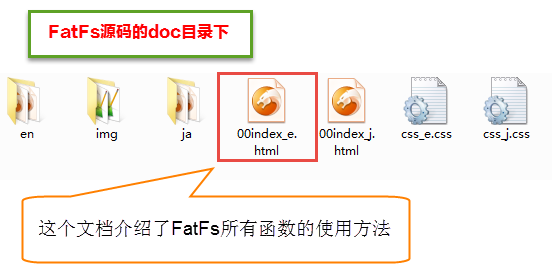
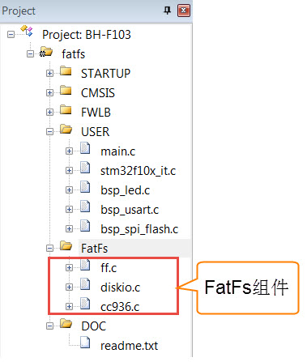

串行FLASH文件系统FatFs
----------------------

本章参考资料：《00index_e.html》，这是FatFs官方的编译好的HTML文档，里面有FatFs所有函数的介绍和函数的应用示例，学习FatFs看这个官方的文档即可。

图 25‑1 FatFs参考资料

文件系统
~~~~~~~~

即使读者可能不了解文件系统，读者也一定对“文件”这个概念十分熟悉。数据在PC上是以文件的形式储存在磁盘中的，这些数据的形式一般为ASCII码或二进制形式。在上一章我们已经写好了SPI
Flash芯片的驱动函数，我们可以非常方便的在SPI
Flash芯片上读写数据。如需要记录本书的书名“零死角玩转STM32-F103系列”，可以把这些文字转化成ASCII码，存储在数组中，然后调用SPI_FLASH_BufferWrite函数，把数组内容写入到SPI
Flash芯片的指定地址上，在需要的时候从该地址把数据读取出来，再对读出来的数据以ASCII码的格式进行解读。

但是，这样直接存储数据会带来极大的不便，如难以记录有效数据的位置，难以确定存储介质的剩余空间，以及应以何种格式来解读数据。就如同一个巨大的图书馆无人管理，杂乱无章地存放着各种书籍，难以查找所需的文档。想象一下图书馆的采购人员购书后，把书籍往馆内一扔，拍拍屁股走人，当有人来借阅某本书的时候，就不得不一本本地查找。这样直接存储数据的方式对于小容量的存储介质如EEPROM还可以接受，但对于SPI
Flash芯片或者SD卡之类的大容量设备，我们需要一种高效的方式来管理它的存储内容。

这些管理方式即为文件系统，它是\ *为了存储和管理数据，而在存储介质建立的一种组
织结构，这些结构包括操作系统引导区、目录和文件。*\ 常见的windows下的文件系统
格式包括FAT32、NTFS、exFAT。\ *在使用文件系统前，要先对存储介质进行格式化*\ 。格式化先
擦除原来内容，在存储介质上新建一个\ *文件分配表和目录*\ 。这样，文件系统就可以记录数据存放的物理地址，剩余空间。

使用文件系统时，
数据都以文件的形式存储。写入新文件时，先在目录中创建一个文件索引，它指示了文件存放的物理地址，再把数据存储到该地址中。当需要读取数据时，可以从目录中找到该文件的索引，进而在相应的地址中读取出数据。具体还涉及到逻辑地址、簇大小、不连续存储等一系列辅助结构或处理过程。

文件系统的存在使我们在存取数据时，不再是简单地向某物理地址直接读写，而是要遵循它的读写格式。如经过逻辑转换，一个完整的文件可能被分开成多段存储到不连续的物理地址，使用目录或链表的方式来获知下一段的位置。

上一章的SPI
Flash芯片驱动只完成了向物理地址写入数据的工作，而根据文件系统格式的逻辑转换部分则需要额外的代码来完成。实质上，这个逻辑转换部分可以理解为当我们需要写入一段数据时，由它来求解向什么物理地址写入数据、以什么格式写入及写入一些原始数据以外的信息(如目录)。这个逻辑转换部分代码我们也习惯称之为文件系统。

FatFs文件系统简介
~~~~~~~~~~~~~~~~~

上面提到的逻辑转换部分代码(文件系统)即为本章的要点，文件系统庞大而复杂，它需要根据应用的文件系统格式而编写，而且一般与驱动层分离开来，很方便移植，所以工程应用中一般是移植现成的文件系统源码。

FatFs是面向小型嵌入式系统的一种通用的FAT文件系统。它完全是由ANSI
C语言编写并且完全独立于底层的I/O介质。因此它可以很容易地不加修改地移植到其他的处理器当中，如8051、PIC、AVR、SH、Z80、H8、ARM等。FatFs支持FAT12、FAT16、FAT32等格式，所以我们利用前面写好的SPI
Flash芯片驱动，把FatFs文件系统代码移植到工程之中，就可以利用文件系统的各种函数，对SPI
Flash芯片以“文件”格式进行读写操作了。

FatFs文件系统的源码可以从fatfs官网下载:

http://elm-chan.org/fsw/ff/00index_e.html

FatFs的目录结构
^^^^^^^^^^^^^^^

在移植FatFs文件系统到开发板之前，我们先要到FatFs的官网获取源码，官网有对FatFs做详细的介绍，有兴趣可以了解。解压之后可看到里面有
doc 和 src 这两个文件夹，见 图25_2_。doc 文件夹里面是一些使用帮助文档；
src 才是FatFs文件系统的源码。

图 25‑2 FatFs文件目录

FatFs帮助文档
^^^^^^^^^^^^^

打开 doc 文件夹，可看到如 图25_3_ 的文件目录：

图 25‑3 doc文件夹的文件目录

其中 en 和 ja
这两个文件夹里面是编译好的html文档，讲的是FATFS里面各个函数的使用方法，这些函数都是封装得非常好的函数，利用这些函数我们就可以操作SPI
Flash芯片。有关具体的函数我们在用到的时候再讲解。这两个文件夹的唯一区别就是
en 文件夹下的文档是英文的，ja
文件夹下的是日文的。img文件夹包含en和ja文件夹下文件需要用到的图片，还有四个名为app.c文件，内容都是FatFs具体应用例程。00index_e.html和00index_j.html是一些关于FATFS的简介，至于另外两个文件可以不看。

FATFS源码
^^^^^^^^^

打开 src 文件夹，可看到如 图25_4_ 的文件目录：

图 25‑4 src文件夹的文件目录

option
文件夹下是一些可选的外部c文件，包含了多语言支持需要用到的文件和转换函数。

diskio.c文件是FatFs移植最关键的文件，它为文件系统提供了最底层的访问SPI
Flash芯片的方法，FatFs有且仅有它需要用到与SPI
Flash芯片相关的函数。diskio.h定义了FatFs用到的宏，以及diskio.c文件内与底层硬件接口相关的函数声明。

00history.txt介绍了FatFs的版本更新情况。

00readme.txt说明了当前目录下 diskio.c
、diskio.h、ff.c、ff.h、integer.h的功能。

src文件夹下的源码文件功能简介如下：

-  integer.h：\ *文件中包含了一些数值类型定义。*

-  diskio.c：\ *包含底层存储介质的操作函数，这些函数需要用户自己实现，主要添加底层驱动函数。*

-  ff.c：
   *FatFs核心文件，文件管理的实现方法。该文件独立于底层介质操作文件的函数，利用这些函数实现文件的读写。*

-  cc936.c：\ *本文件在option目录下，是简体中文支持所需要添加的文件，包含了简体中文的GBK和Unicode相互转换功能函数。*

-  ffconf.h:\ *这个头文件包含了对FatFs功能配置的宏定义，通过修改这些宏定
   义就可以裁剪FatFs的功能。如需要支持简体中文，需要把*\ ffconf.h\ *中的_CODE_PAGE
   的宏改成936并把上面的cc936.c文件加入到工程之中。*

建议阅读这些源码的顺序为： integer.h --> diskio.c --> ff.c 。

阅读文件系统源码ff.c文件需要一定的功底，建议读者先阅读FAT32的文件格式，再去分析ff.c文件。若仅为使用文件系统，则只需要理解integer.h及diskio.c文件并会调用ff.c文件中的函数就可以了。本章主要讲解如何把FATFS文件系统移植到开发板上，并编写一个简单读写操作范例。

FatFs文件系统移植实验
~~~~~~~~~~~~~~~~~~~~~

FatFs程序结构图
^^^^^^^^^^^^^^^

移植FatFs之前我们先通过FatFs的程序结构图了解FatFs在程序中的关系网络，见 图25_5_。

图 25‑5 FatFs程序结构图

用户应用程序需要由用户编写，想实现什么功能就编写什么的程序，一般我们只用到f_mount()、f_open()、f_write()、f_read()就可以实现文件的读写操作。

FatFs组件是FatFs的主体，文件都在源码src文件夹中，其中ff.c、ff.h、integer.h以及diskio.h四个文件我们不需要改动，只需要修改ffconf.h和diskio.c两个文件。

底层设备输入输出要求实现存储设备的读写操作函数、存储设备信息获取函数等等。我们使用SPI
Flash芯片作为物理设备，在上一章节已经编写好了SPI
Flash芯片的驱动程序，这里我们就直接使用。

硬件设计
^^^^^^^^

FatFs属于软件组件，不需要附带其他硬件电路。我们使用SPI
Flash芯片作为物理存储设备，其硬件电路在上一章已经做了分析，这里就直接使用。

FatFs移植步骤
^^^^^^^^^^^^^

上一章我们已经实现了SPI
Flash芯片驱动程序，并实现了读写测试，为移植FatFs方便，我们直接拷贝一份工程，我们在工程基础上添加FatFs组件，并修改main函数的用户程序即可。

1) 先拷贝一份SPI
   Flash芯片测试的工程文件(整个文件夹)，并修改文件夹名为“SPI—FatFs文件系统”。将FatFs源码中的src文件夹整个文件夹拷贝一份至“SPI—FatFs文件系统\USER\”文件夹下并修改名为“FATFS”，
   见 图25_6_。

图 25‑6 拷贝FatFs源码到工程

2) 使用KEIL软件打开工程文件(..\SPI—FatFs文件系统\Project\RVMDK(uv5)\\
   BH-F103.uvprojx)，并将FatFs组件文件添加到工程中，需要添加有ff.c、diskio.c和cc936.c三个文件，见
   图25_7_。

图 25‑7 添加FatFS文件到工程

3) 添加FATFS文件夹到工程的include选项中。打开工程选项对话框，选择“C/C++”选项下的“Include
   Paths”项目，在弹出路径设置对话框中选择添加“FATFS”文件夹，见 图25_8_。

图 25‑8 添加FATFS路径到工程选项

4) 如果现在编译工程，可以发现有两个错误，一个是来自diskio.c文件，提示有一些头文件没找
   到，diskio.c文件内容是与底层设备输入输出接口函数文件，不同硬件设计驱动就不同，需要的文件也不同；另外一个错误来自cc936.c文件，提示该文件不是工程所必需的，这是因为FatFs默认使用日语，我们想要支持简体中文需要修改FatFs的配置，即修改ffconf.h文件。至此，将FatFs添加到工程的框架已经操作完成，接下来要做的就是修改diskio.c文件和ffconf.h文件。

FatFs底层设备驱动函数
^^^^^^^^^^^^^^^^^^^^^

FatFs文件系统与底层介质的驱动分离开来，对底层介质的操作都要交给用户去实现，它仅仅是提供了一个函数接口而已。表25_1_ 
为FatFs移植时用户必须支持的函数。通过 表25_1_ 我们可以清晰知道很多函数是在一定条件下才需要
添加的，只有前三个函数是必须添加的。我们完全可以根据实际需求选择实现用到的函数。

前三个函数是实现读文件最基本需求。接下来三个函数是实现创建文件、修改文件需要的。为实现格式化功能，需要在disk_ioctl添加两个获取物理设备信息选项。我们一般只要实现前面六个函数就可以了，已经足够满足大部分功能。

为支持简体中文长文件名称需要添加ff_convert和ff_wtoupper函数，实际这两个已经在cc936.c文件中实现，我们只要直接把cc936.c文件添加到工程中就可以。

后面六个函数一般都不用。如真有需要可以参考syscall.c文件(src\option文件夹内)。

.. _表25_1:

表 25‑1 FatFs移植需要用户支持函数

底层设备驱动函数是存放在diskio.c文件，我们的目的就是把diskio.c中的函数接口与SPI
Flash芯片驱动连接起来。总共有五个函数，分别为设备状态获取(disk_status)、设备初始化(disk_initialize)、扇区读取(disk_read)、扇区写入(disk_write)、其他控制(disk_ioctl)。

接下来，我们对每个函数结合SPI Flash芯片驱动做详细讲解。

宏定义
=========

.. code-block:: c
   :caption: 代码清单 25‑1 物理编号宏定义
   :name: 代码清单25_1

    /* 为每个设备定义一个物理编号 */
    #define ATA         0     // 预留SD卡使用
    #define SPI_FLASH   1     // 外部SPI Flash

这两个宏定义在FatFs中非常重要，FatFs是支持多物理设备的，必须为每个物理设备定义一个不同的编号。

SD卡是预留接口，在讲解SDIO接口相关章节后会用到，可以实现使用读写SD卡内文件。

设备状态获取
=============

.. code-block:: c
   :caption: 代码清单 25‑2设备状态获取
   :name: 代码清单25_2

    DSTATUS disk_status (
        BYTE pdrv   /* 物理编号 */
    )
    {

        DSTATUS status = STA_NOINIT;

        switch (pdrv) {
        case ATA: /* SD CARD */
            break;

        case SPI_FLASH:
            /* SPI Flash状态检测：读取SPI Flash 设备ID */
            if (sFLASH_ID == SPI_FLASH_ReadID()) {
                /* 设备ID读取结果正确 */
                status &= ~STA_NOINIT;
            } else {
                /* 设备ID读取结果错误 */
                status = STA_NOINIT;;
            }
            break;

        default:
            status = STA_NOINIT;
        }
        return status;
    }

disk_status函数只有一个参数pdrv，表示物理编号。一般我们都是使用switch函数实现对pdrv的分支判断。对于SD卡只是预留接口，留空即可。对于SPI
Flash芯片，我们直接调用在SPI_FLASH_ReadID()获取设备ID，然后判断是否正确，如果正确，函数返回正常标准；如果错误，函数返回异常标志。SPI_FLASH_ReadID()是定义在bsp_spi_flash.c文件中，上一章节已做了分析。

设备初始化
============

.. code-block:: c
   :caption: 代码清单 25‑3 设备初始化
   :name: 代码清单25_3

    DSTATUS disk_initialize (
        BYTE pdrv       /* 物理编号 */
    )
    {
        uint16_t i;
        DSTATUS status = STA_NOINIT;
        switch (pdrv) {
        case ATA:          /* SD CARD */
            break;

        case SPI_FLASH:    /* SPI Flash */
            /* 初始化SPI Flash */
            SPI_FLASH_Init();
            /* 延时一小段时间 */
            i=500;
            while (--i);
            /* 唤醒SPI Flash */
            SPI_Flash_WAKEUP();
            /* 获取SPI Flash芯片状态 */
            status=disk_status(SPI_FLASH);
            break;

        default:
            status = STA_NOINIT;
        }
        return status;
    }

disk_initialize函数也是有一个参数pdrv，用来指定设备物理编号。对于SPI
Flash芯片我们调用SPI_FLASH_Init()函数实现对SPI
Flash芯片引脚GPIO初始化配置以及SPI通信参数配置。SPI_Flash_WAKEUP()函数唤醒SPI
Flash芯片，当SPI Flash芯片处于睡眠模式时需要唤醒芯片才可以进行读写操作。

最后调用disk_status函数获取SPI Flash芯片状态，并返回状态值。

读取扇区
============

.. code-block:: c
   :caption: 代码清单 25‑4 扇区读取
   :name: 代码清单25_4

    DRESULT disk_read (
        BYTE pdrv,    /* 设备物理编号(0..) */
        BYTE *buff,   /* 数据缓存区 */
        DWORD sector, /* 扇区首地址 */
        UINT count    /* 扇区个数(1..128) */
    )
    {
        DRESULT status = RES_PARERR;
        switch (pdrv) {
        case ATA: /* SD CARD */
            break;

        case SPI_FLASH:
            /* 扇区偏移2MB，外部Flash文件系统空间放在SPI Flash后面6MB空间 */
            sector+=512;
            SPI_FLASH_BufferRead(buff, sector <<12, count<<12);
            status = RES_OK;
            break;

        default:
            status = RES_PARERR;
        }
        return status;
    }

disk_read函数有四个形参。pdrv为设备物理编号。buff是一个BYTE类型指针变量，buff指向用来存放读取到数据的存储区首地址。sector是一个DWORD类型变量，指定要读取数据的扇区首地址。count是一个UINT类型变量，指定扇区数量。

BYTE类型实际是unsigned char类型，DWORD类型实际是unsigned
long类型，UINT类型实际是 unsigned int类型，类型定义在integer.h文件中。

开发板使用的SPI
Flash芯片型号为W25Q64FV，每个扇区大小为4096个字节(4KB)，总共有8M字节空间，为兼容后面实验程序，我们只将后部分6MB空间分配给FatFs使用，前部分2MB空间用于其他实验需要，即FatFs是从2MB空间开始，为实现这个效果需要将所有的读写地址都偏移512个扇区空间。

对于SPI
Flash芯片，主要是使用SPI_FLASH_BufferRead()实现在指定地址读取指定长度的数据，它接收三个参数，第一个参数为指定数据存放地址指针。第二个参数为指定数据读取地址，这里使用左移运算符，左移12位实际是乘以4096，这与每个扇区大小是息息相关的。第三个参数为读取数据个数，也是需要使用左移运算符。

扇区写入
==========

.. code-block:: c
   :caption: 代码清单 25‑5 扇区写入
   :name: 代码清单25_5

    DRESULT disk_write (
        BYTE pdrv,        /* 设备物理编号(0..) */
        const BYTE *buff, /* 欲写入数据的缓存区 */
        DWORD sector,     /* 扇区首地址 */
        UINT count        /* 扇区个数(1..128) */
    )
    {
        uint32_t write_addr;
        DRESULT status = RES_PARERR;
        if (!count) {
            return RES_PARERR;    /* Check parameter */
        }

        switch (pdrv) {
        case ATA: /* SD CARD */
            break;

        case SPI_FLASH:
            /* 扇区偏移2MB，外部Flash文件系统空间放在SPI Flash后面6MB空间 */
            sector+=512;
            write_addr = sector<<12;
            SPI_FLASH_SectorErase(write_addr);
            SPI_FLASH_BufferWrite((u8 *)buff,write_addr,count<<12);
            status = RES_OK;
            break;

        default:
            status = RES_PARERR;
        }
        return status;
    }

disk_write函数有四个形参，pdrv为设备物理编号。buff指向待写入扇区数据的首地址。sector，指定要写入数据的扇区首地址。count指定扇区数量。对于SPI
Flash芯片，在写入数据之前需要先擦除，所以用到扇区擦除函数(SPI_FLASH_SectorErase)。然后就是在调用数据写入函数(SPI_FLASH_BufferWrite)把数据写入到指定位置内。

其他控制
============

.. code-block:: c
   :caption: 代码清单 25‑6 其他控制
   :name: 代码清单25_6

    DRESULT disk_ioctl (
        BYTE pdrv,    /* 物理编号 */
        BYTE cmd,     /* 控制指令 */
        void *buff    /* 写入或者读取数据地址指针 */
    )
    {
        DRESULT status = RES_PARERR;
        switch (pdrv) {
        case ATA: /* SD CARD */
            break;

        case SPI_FLASH:
            switch (cmd) {
            /* 扇区数量：1536*4096/1024/1024=6(MB) */
            case GET_SECTOR_COUNT:
                *(DWORD * )buff = 1536;
                break;
            /* 扇区大小  */
            case GET_SECTOR_SIZE :
                *(WORD * )buff = 4096;
                break;
            /* 同时擦除扇区个数 */
            case GET_BLOCK_SIZE :
                *(DWORD * )buff = 1;
                break;
            }
            status = RES_OK;
            break;

        default:
            status = RES_PARERR;
        }
        return status;
    }

disk_ioctl函数有三个形参，pdrv为设备物理编号，cmd为控制指令，包括发出同步信号、获取扇区数目、获取扇区大小、获取擦除块数量等等指令，buff为指令对应的数据指针。

对于SPI
Flash芯片，为支持FatFs格式化功能，需要用到获取扇区数量(GET_SECTOR_COUNT)指令和获取擦除块数量(GET_BLOCK_SIZE)。另外，SD卡扇区大小为512字节，SPI
Flash芯片一般设置扇区大小为4096字节，所以需要用到获取扇区大小(GET_SECTOR_SIZE)指令。

时间戳获取
==============

.. code-block:: c
   :caption: 代码清单 25‑7 时间戳获取
   :name: 代码清单25_7

    __weak DWORD get_fattime(void)
    {
        /* 返回当前时间戳 */
        return    ((DWORD)(2015 - 1980) << 25)  /* Year 2015 */
                | ((DWORD)1 << 21)        /* Month 1 */
                | ((DWORD)1 << 16)        /* Mday 1 */
                | ((DWORD)0 << 11)        /* Hour 0 */
                | ((DWORD)0 << 5)         /* Min 0 */
                | ((DWORD)0 >> 1);        /* Sec 0 */
    }

get_fattime函数用于获取当前时间戳，在ff.c文件中被调用。FatFs在文件创建、被修改时会记录时间，这里我们直接使用赋值方法设定时间戳。为更好的记录时间，可以使用控制器RTC功能，具体要求返回值格式为：

-  bit31:25 ——从1980至今是多少年，范围是 (0..127) ；

-  bit24:21 ——月份，范围为 (1..12) ；

-  bit20:16 ——该月份中的第几日，范围为(1..31) ；

-  bit15:11——时，范围为 (0..23)；

-  bit10:5 ——分，范围为 (0..59)；

-  bit4:0 ——秒/ 2，范围为 (0..29) 。

FatFs功能配置
^^^^^^^^^^^^^

ffconf.h文件是FatFs功能配置文件，我们可以对文件内容进行修改，使得FatFs更符合我们的要求。ffconf.h对每个配置选项都做了详细的使用情况说明。下面只列出修改的配置，其他配置采用默认即可。

.. code-block:: c
   :caption: 代码清单 25‑8 FatFs功能配置选项
   :name: 代码清单25_8

   #define _USE_MKFS 1
   #define _CODE_PAGE 936
   #define _USE_LFN 2
   #define _VOLUMES 2
   #define _MIN_SS 512
   #define _MAX_SS 4096

1) _USE_MKFS：格式化功能选择，为使用FatFs格式化功能，需要把它设置为1。

2) _CODE_PAGE：语言功能选择，并要求把相关语言文件添加到工程宏。为支持简体中文文件名需要使用“936”，正如在图
   25‑7的操作，我们已经把cc936.c文件添加到工程中。

3) _USE_LFN：长文件名支持，默认不支持长文件名，这里配置为2，支持长文件名，并指定使用栈空间为缓冲区。

4) _VOLUMES：指定物理设备数量，这里设置为2，包括预留SD卡和SPI
   Flash芯片。

5) _MIN_SS
   、_MAX_SS：指定扇区大小的最小值和最大值。SD卡扇区大小一般都为512字节，SPI
   Flash芯片扇区大小一般设置为4096字节，所以需要把_MAX_SS改为4096。

FatFs功能测试
^^^^^^^^^^^^^

移植操作到此，就已经把FatFs全部添加到我们的工程了，这时我们编译功能，顺利编译通过，没有错误。接下来，我们就可以使用编写
图25_5_ 中用户应用程序了。

主要的测试包括格式化测试、文件写入测试和文件读取测试三个部分，主要程序都在main.c文件中实现。

变量定义
============

.. code-block:: c
   :caption: 代码清单 25‑9 变量定义
   :name: 代码清单25_9

    FATFS fs;                         /* FatFs文件系统对象 */
    FIL fnew;                         /* 文件对象 */
    FRESULT res_flash;                /* 文件操作结果 */
    UINT fnum;                        /* 文件成功读写数量 */
    BYTE buffer[1024]= {0};           /* 读缓冲区 */
    BYTE textFileBuffer[] =           /* 写缓冲区*/
        "欢迎使用野火STM32开发板 今天是个好日子，新建文件系统测试文件\r\n";

FATFS是在ff.h文件定义的一个结构体类型，针对的对象是物理设备，包含了物理设备的物理编号、扇区大小等等信息，一般我们都需要为每个物理设备定义一个FATFS变量。

FIL也是在ff.h文件定义的一个结构体类型，针对的对象是文件系统内具体的文件，包含了文件很多基本属性，比如文件大小、路径、当前读写地址等等。如果需要在同一时间打开多个文件进行读写，才需要定义多个FIL变量，不然一般定义一个FIL变量即可。

FRESULT是也在ff.h文件定义的一个枚举类型，作为FatFs函数的返回值类型，主要管理FatFs运行中出现的错误。总共有19种错误类型，包括物理设备读写错误、找不到文件、没有挂载工作空间等等错误。这在实际编程中非常重要，当有错误出现时我们要停止文件读写，通过返回值我们可以快速定位到错误发生的可能地点。如果运行没有错误才返回FR_OK。

fnum是个32位无符号整形变量，用来记录实际读取或者写入数据的数组。

buffer和textFileBuffer分别对应读取和写入数据缓存区，都是8位无符号整形数组。

主函数
===========

.. code-block:: c
   :caption: 代码清单 25‑10 主函数
   :name: 代码清单25_10

    int main(void)
    {
        SystemClock_Config();
        /* 初始化LED */
        LED_GPIO_Config();
        LED_BLUE;

        /* 初始化调试串口，一般为串口1 */
        DEBUG_USART_Config();
        printf("****** 这是一个SPI FLASH 文件系统实验 ******\r\n");

        //在外部SPI Flash挂载文件系统，文件系统挂载时会对SPI设备初化

        res_flash = f_mount(&fs,"1:",1);

        /*----------------------- 格式化测试 ---------------------------*/
        /* 如果没有文件系统就格式化创建创建文件系统 */
        if (res_flash == FR_NO_FILESYSTEM) {
            printf("》FLASH还没有文件系统，即将进行格式化...\r\n");
            /* 格式化 */
            res_flash=f_mkfs("1:",0,0);

            if (res_flash == FR_OK) {
                printf("》FLASH已成功格式化文件系统。\r\n");
                /* 格式化后，先取消挂载 */
                res_flash = f_mount(NULL,"1:",1);
                /* 重新挂载 */
                res_flash = f_mount(&fs,"1:",1);
            } else {
                LED_RED;
                printf("《《格式化失败。》》\r\n");
                while (1);
            }
        } else if (res_flash!=FR_OK) {
            printf("！！外部Flash挂载文件系统失败。(%d)\r\n", res_flash);
            printf("！！可能原因：SPI Flash初始化不成功。\r\n");
            while (1);
        } else {
            printf("》文件系统挂载成功，可以进行读写测试\r\n");
        }

        /*----------------------- 文件系统测试：写测试 -----------------------------*/
        /* 打开文件，如果文件不存在则创建它 */
        printf("\r\n****** 即将进行文件写入测试... ******\r\n");
        res_flash = f_open(&fnew, "1:FatFs读写测试文件.txt",FA_CREATE_ALWAYS | FA_WRITE );
        if ( res_flash == FR_OK ) {
            printf("》打开/创建FatFs读写测试文件.txt文件成功，向文件写入数据。\r\n");
            /* 将指定存储区内容写入到文件内 */
            res_flash=f_write(&fnew,WriteBuffer,sizeof(WriteBuffer),&fnum);
            if (res_flash==FR_OK) {
                printf("》文件写入成功，写入字节数据：%d\n", fnum);
                printf("》向文件写入的数据为：\r\n%s\r\n", WriteBuffer);
            } else {
                printf("！！文件写入失败：(%d)\n",res_flash);
            }
            /* 不再读写，关闭文件 */
            f_close(&fnew);
        } else {
            LED_RED;
            printf("！！打开/创建文件失败。\r\n");
        }

        /*------------------- 文件系统测试：读测试 ------------------------------------*/
        printf("****** 即将进行文件读取测试... ******\r\n");
        res_flash = f_open(&fnew, "1:FatFs读写测试文件.txt",  FA_OPEN_EXISTING | FA_READ);
        if (res_flash == FR_OK) {
            LED_GREEN;
            printf("》打开文件成功。\r\n");
            res_flash = f_read(&fnew, ReadBuffer, sizeof(ReadBuffer), &fnum);
            if (res_flash==FR_OK) {
                printf("》文件读取成功,读到字节数据：%d\r\n",
                    fnum);
                printf("》读取得的文件数据为：\r\n%s \r\n",  ReadBuffer);
            } else {
                printf("！！文件读取失败：(%d)\n",res_flash);
            }
        } else {
            LED_RED;
            printf("！！打开文件失败。\r\n");
        }
        /* 不再读写，关闭文件 */
        f_close(&fnew);

        /* 不再使用文件系统，取消挂载文件系统 */
        f_mount(NULL,"1:",1);

        /* 操作完成，停机 */
        while (1) {
        }
    }

首先，初始化RGB彩灯和调试串口，用来指示程序进程。

FatFs的第一步工作就是使用f_mount函数挂载工作区。f_mount函数有三个形参，第一个参数是指向FATFS变量指针，如果赋值为NULL可以取消物
理设备挂载。第二个参数为逻辑设备编号，使用设备根路径表示，与物理设备编号挂钩，在 代码清单25_1_ 中我们定义SPI
Flash芯片物理编号为1，所以这里使用“1：”。第三个参数可选0或1，1表示立即挂载，0表示不立即挂载，延迟挂载。
f_mount函数会返回一个FRESULT类型值，指示运行情况。

如果f_mount函数返回值为FR_NO_FILESYSTEM，说明没有FAT文件系统，比如新出厂的SPI
Flash芯片就没有FAT文件系统。我们就必须对物理设备进行格式化处理。使用f_mkfs函数可以实现格式化操作。f_mkfs函数有三
个形参，第一个参数为逻辑设备编号；第二参数可选0或者1，0表示设备为一般硬盘，1表示设备为软盘。第三个参数
指定扇区大小，如果为0，表示通过 代码清单25_6_ 中disk_ioctl函数获取。格式化成功后需要先取消挂载原来设备，再重新挂载设备。

在设备正常挂载后，就可以进行文件读写操作了。使用文件之前，必须使用f_open函数打开文件，不再使用文件必须使用f_close函数关闭文件，这个跟电脑端操作文件步骤类似。f_open函数有三个形参，第一个参数为文件对象指针。第二参数为目标文件，包含绝对路径的文件名称和后缀名。第三个参数为访问文件模式选择，可以是打开已经存在的文件模式、读模式、写模式、新建模式、总是新建模式等的或运行结果。比如对于写测试，使用FA_CREATE_ALWAYS和FA_WRITE组合模式，就是总是新建文件并进行写模式。

f_close函数用于不再对文件进行读写操作关闭文件，f_close函数只要一个形参，为文件对象指针。f_close函数运行可以确保缓冲区完全写入到文件内。

成功打开文件之后就可以使用f_write函数和f_read函数对文件进行写操作和读操作。这两个函数用到的参数是一致的，只不过一个是数据写入，一个是数据读取。f_write函数第一个形参为文件对象指针，使用与f_open函数一致即可。第二个参数为待写入数据的首地址，对于f_read函数就是用来存放读出数据的首地址。第三个参数为写入数据的字节数，对于f_read函数就是欲读取数据的字节数。第四个参数为32位无符号整形指针，这里使用fnum变量地址赋值给它，在运行读写操作函数后，fnum变量指示成功读取或者写入的字节个数。

最后，不再使用文件系统时，使用f_mount函数取消挂载。

下载验证
^^^^^^^^

保证开发板相关硬件连接正确，用USB线连接开发板“USB TO
UART”接口跟电脑，在电脑端打开串口调试助手，把编译好的程序下载到开发板。程序开始运行后，RGB彩灯为蓝色，在串口调试助手可看到格式化测试、写文件检测和读文件检测三个过程；最后如果所有读写操作都正常，RGB彩灯会指示为绿色，如果在运行中FatFs出现错误RGB彩灯指示为红色。

虽然我们通过RGB彩灯指示和串口调试助手信息打印方法来说明FatFs移植成功，并顺利通过测试，但心底总是很踏实，所谓眼见为实，虽然我们创建了“FatFs读写测试文件.txt”这个文件，却完全看不到实体。这个确实是个问题，因为我们这里使用SPI
Flash芯片作为物理设备，并不像SD卡那么方便直接用读卡器就可以在电脑端打开验证。另外一个问题，就目前来说，在SPI
Flash芯片上挂载FatFs好像没有实际意义，无法发挥文件系统功能。

实际上，这里归根到底就是我们目前没办法在电脑端查看SPI
Flash芯片内FatFs的内容，没办法非常方便拷贝、删除文件。我们当然不会做无用功，STM32控制器还有一个硬件资源可以解决上面的问题，就是USB！我们可以通过编程把整个开发板变成一个U盘，而U盘存储空间就是SPI
Flash芯片的空间。这样非常方便实现文件读写。至于USB内容将在USB相关章节讲解。

FatFs功能使用实验
~~~~~~~~~~~~~~~~~

上个实验我们实现了FatFs的格式化、读文件和写文件功能，这个已经满足很多部分的运用需要。有时，我们需要更多的文件操作功能，FatFs还是提供了不少的功能的，比如设备存储空间信息获取、读写文件指针定位、创建目录、文件移动和重命名、文件或目录信息获取等等功能。我们接下来这个实验内容就是展示FatFs众多功能，提供一个很好了范例，以后有用到相关内容，参考使用非常方便。

硬件设计
^^^^^^^^

本实验主要使用FatFs软件功能，不需要其他硬件模块，使用与FatFs移植实验相同硬件配置即可。

软件设计
^^^^^^^^

上个实验我们已经移植好了FatFs，这个例程主要是应用，所以简单起见，直接拷贝上个实验的工程文件，保持FatFs底层驱动程序，我们只改main.c文件内容，实现应用程序。

FatFs多项功能测试
=====================

.. code-block:: c
   :caption: 代码清单 25‑11 FatFs多项功能测试
   :name: 代码清单25_11

    /* FatFs多项功能测试 */
    static FRESULT miscellaneous(void)
    {
        DIR dir;
        FATFS *pfs;
        DWORD fre_clust, fre_sect, tot_sect;

        printf("\n*************** 设备信息获取 ***************\r\n");
        /* 获取设备信息和空簇大小 */
        res_flash = f_getfree("1:", &fre_clust, &pfs);

        /* 计算得到总的扇区个数和空扇区个数 */
        tot_sect = (pfs->n_fatent - 2) * pfs->csize;
        fre_sect = fre_clust * pfs->csize;

        /* 打印信息(4096 字节/扇区) */
        printf("》设备总空间：%10lu KB。\n》可用空间：  %10lu KB。\n", tot_sect *4, fre_sect *4);

        printf("\n******** 文件定位和格式化写入功能测试 ********\r\n");
        res_flash = f_open(&fnew, "1:FatFs功能测试文件.txt",
                        FA_CREATE_ALWAYS| FA_WRITE|FA_READ );
        res_flash=f_write(&fnew,"欢迎使用野火STM32开发板",50,&fnum);
        if ( res_flash == FR_OK )
        {
            /*  文件定位，定位到文件的末尾 */
            res_flash = f_lseek(&fnew,f_size(&fnew)-1);
            if (res_flash == FR_OK)
            {
                /* 格式化写入，参数格式类似printf函数 */
                f_printf(&fnew,"\n在原来文件新添加一行内容\n");
                f_printf(&fnew,"》设备总空间：%10lu KB。\n》可用空间;%10lu KB。\n",
                        tot_sect *4, fre_sect *4);
                /*  文件定位到文件起始位置 */
                res_flash = f_lseek(&fnew,0);
                /* 读取文件所有内容到缓存区 */
                res_flash = f_read(&fnew,readbuffer,f_size(&fnew),&fnum);
                if (res_flash == FR_OK)
                {
                    printf("》文件内容：\n%s\n",readbuffer);
                }
            }
            f_close(&fnew);

            printf("\n********** 目录创建和重命名功能测试 **********\r\n");
            /* 尝试打开目录 */
            res_flash=f_opendir(&dir,"1:TestDir");
            if (res_flash!=FR_OK)
            {
                /* 打开目录失败，就创建目录 */
                res_flash=f_mkdir("1:TestDir");
            }
            else
            {
                /* 如果目录已经存在，关闭它 */
                res_flash=f_closedir(&dir);
                /* 删除文件 */
                f_unlink("1:TestDir/testdir.txt");
            }
            if (res_flash==FR_OK)
            {
                /* 重命名并移动文件 */
                res_flash=f_rename("1:FatFs功能测试文件.txt","1:TestDir/testdir.txt");
                if (res_flash==FR_OK)
                {
                    printf("》重命名并移动文件操作成功\n");
                }
                else
                {
                    printf("》重命名并移动文件操作失败：%d\n",res_flash);
                }
            }
        }
        else
        {
            printf("!! 打开文件失败：%d\n",res_flash);
            printf("!! 或许需要再次运行“FatFs移植与读写测试”工程\n");
        }
        return res_flash;
    }

首先是设备存储信息获取，目的是获取设备总容量和剩余可用空间。f_getfree函数是设备空闲簇信息获取函数，有三个形参，第一个参数为逻辑设备编号；第二个参数为返回空闲簇数量，这里1簇等于1个扇区；第三个参数为返回指向文件系统对象的指针。通过计算可得到设备总的扇区个数以及空闲扇区个数，对于SPI
Flash芯片我们设置每个扇区为4096字节大小，即4KB。这样很容易就算出设备存储信息。

接下来是文件读写指针定位和格式化输入功能测试。文件定位在一些场合非常有用，比如我们需要记录多项数据，但每项数据长度不确定，但有个最长长度，我们就可以使用文件定位lseek函数功能把数据存放在规定好的地址空间上。当我们需要读取文件内容时就使用文件定位函数定位到对应地址读取。

使用文件读写操作之前都必须使用f_open函数打开文件，开始的时候读写指针是在文件起始位置的，马上写入数据的话会覆盖原来文件内容。这里，我们使用f_lseek函数定位到文件末尾位置，再写入内容。f_lseek函数有两个形参，第一个参数为文件对象指针，第二个参数为需要定位的字节数，这个字节数是相对文件起始位置的，比如设置为0，则将文件读写指针定位到文件起始位置。

f_printf函数是格式化写入函数，需要把ffconf.h文件中的_USE_STRFUNC配置为1才支持。f_printf函数用法类似C库函数printf函数，只是它将数据直接写入到文件中。

最后是目录创建和文件移动和重命名功能。使用f_opendir函数可以打开路径(这里不区分目录和路径概念，下同)，如果路径不存在则创建，如果存在则使用f_closedir函数关闭已经打开的路径，并把以前创建的文件删除。新版的FatFs支持相对路径功能，使路径操作更加灵活。f_opendir函数有两个形参，第一个参数为指向路径对象的指针，第二个参数为路径。f_closedir函数只需要指向路径对象的指针一个形参。

f_mkdir函数用于创建路径，如果指定的路径不存在就创建它，创建的路径存在形式就是文件夹。f_mkdir函数只要一个形参，就是指定路径。

f_rename函数是带有移动功能的重命名函数，它有两个形参，第一个参数为源文件名称，第二个参数为目标名称。目标名称可附带路径，如果路径与源文件路径不同则移动文件到目标路径下。

文件信息获取
=============

.. code-block:: c
   :caption: 代码清单 25‑12 文件信息获取
   :name: 代码清单25_12

    static FRESULT file_check(void)
    {
        static FILINFO fno;

        /* 获取文件信息，必须确保文件存在*/
        res_flash=f_stat("1:TestDir/testdir.txt",&fno);
        if (res_flash==FR_OK) {
            printf("“testdir.txt”文件信息：\n");
            printf("》文件大小: %ld(字节)\n", fno.fsize);
            printf("》时间戳: %u/%02u/%02u, %02u:%02u\n",
                (fno.fdate >> 9) + 1980, fno.fdate >> 5 & 15, fno.fdate & 31,
                fno.ftime >> 11, fno.ftime >> 5 & 63);
            printf("》属性: %c%c%c%c%c\n\n",
                (fno.fattrib & AM_DIR) ? 'D' : '-',      // 是一个目录
                (fno.fattrib & AM_RDO) ? 'R' : '-',      // 只读文件
                (fno.fattrib & AM_HID) ? 'H' : '-',      // 隐藏文件
                (fno.fattrib & AM_SYS) ? 'S' : '-',      // 系统文件
                (fno.fattrib & AM_ARC) ? 'A' : '-');     // 档案文件
        }
        return res_flash;
    }

f_stat函数用于获取文件的属性，有两个形参，第一个参数为文件路径，第二个参数为返回指向文件信息结构体变量的指针。文件信息结构体变量包含文件的大小、最后修改时间和日期、文件属性、短文件名以及长文件名等信息。

路径扫描
=============

.. code-block:: c
   :caption: 代码清单 25‑13 路径扫描
   :name: 代码清单25_13

    static FRESULT scan_files (char* path)
    {
        FRESULT res;    //部分在递归过程被修改的变量，不用全局变量
        FILINFO fno;
        DIR dir;
        int i;
        char *fn;        // 文件名

    #if _USE_LFN
        /* 长文件名支持 */
        /* 简体中文需要2个字节保存一个“字”*/
        static char lfn[_MAX_LFN*2 + 1];
        fno.lfname = lfn;
        fno.lfsize = sizeof(lfn);
    #endif
        //打开目录
        res = f_opendir(&dir, path);
        if (res == FR_OK) {
            i = strlen(path);
            for (;;) {
                //读取目录下的内容，再读会自动读下一个文件
                res = f_readdir(&dir, &fno);
                //为空时表示所有项目读取完毕，跳出
                if (res != FR_OK || fno.fname[0] == 0) break;
    #if _USE_LFN
                fn = *fno.lfname ? fno.lfname : fno.fname;
    #else
                fn = fno.fname;
    #endif
                //点表示当前目录，跳过
                if (*fn == '.') continue;
                //目录，递归读取
                if (fno.fattrib & AM_DIR) {
                    //合成完整目录名
                    sprintf(&path[i], "/%s", fn);
                    //递归遍历
                    res = scan_files(path);
                    path[i] = 0;
                    //打开失败，跳出循环
                    if (res != FR_OK)
                        break;
                } else {
                    printf("%s/%s\r\n", path, fn);              //输出文件名
                    /* 可以在这里提取特定格式的文件路径 */
                }//else
            } //for
        }
        return res;
    }

scan_files函数用来扫描指定路径下的文件。比如我们设计一个mp3播放器，我们需要提取mp3格式文件，诸如*.txt、*.c文件我们统统不可要的，这时我们就必须扫描路径下所有文件并把*.mp3或*.MP3格式文件提取出来。这里我们不提取特定格式文件，而是把所有文件名称都通过串口打印出来。

我们在ffconf.h文件中定义了长文件名称支持(_USE_LFN=2)，一般有用到简体中文文件名称的都要长文件名支持。短文件名称是8.3格式，即名称是8个字节，后缀名是3个字节，对于使用英文名称还可以，使用中文名称就很容易长度不够了。使能了长文件名支持后，使用之前需要指定文件名的存储区还有存储区的大小。

接下来就是使用f_opendir函数打开指定的路径。如果路径存在就使用f_readdir函数读取路径下内容，f_readdir函数可以读取路径下的文件或者文件夹，并保存信息到文件信息对象变量内。f_readdir函数有两个形参，第一个参数为指向路径对象变量的指针，第二个参数为指向文件信息对象的指针。f_readdir函数另外一个特性是自动读取下一个文件对象，即循序运行该函数可以读取该路径下的所有文件。所以，在程序中，我们使用for循环让f_readdir函数读取所有文件，并在读取所有文件之后退出循环。

在f_readdir函数成功读取到一个对象时，我们还不清楚它是一个文件还是一个文件夹，此时我们就可以使用文件信息对象变量的文件属性来判断了，如果判断得出是个文件那我们就直接通过串口打印出来就好了。如果是个文件夹，我们就要进入该文件夹扫描，这时就重新调用扫描函数scan_files就可以了，形成一个递归调用结构，只是我们这次用的参数与最开始时候是不同的，现在是使用子文件夹名称。

主函数
===========

.. code-block:: c
   :caption: 代码清单 25‑14 主函数
   :name: 代码清单25_14

    int main(void)
    {
        SystemClock_Config();
        /* 初始化调试串口，一般为串口1 */
        DEBUG_USART_Config();
        printf("******** 这是一个SPI FLASH 文件系统实验 *******\r\n");

        //在外部SPI Flash挂载文件系统，文件系统挂载时会对SPI设备初始化

        res_flash = f_mount(&fs,"1:",1);
        if (res_flash!=FR_OK) {
            printf("！！外部Flash挂载文件系统失败。(%d)\r\n",
                    res_flash);
            printf("！！可能原因：SPI Flash初始化不成功。\r\n");
            while (1);
        } else {
            printf("》文件系统挂载成功，可以进行测试\r\n");
        }
        /* FatFs多项功能测试 */
        res_flash = miscellaneous();
        printf("\n*************** 文件信息获取测试 **************\r\n");
        res_flash = file_check();
        printf("***************** 文件扫描测试 ****************\r\n")
                ;
        strcpy(fpath,"1:");
        scan_files(fpath);
        /* 不再使用文件系统，取消挂载文件系统 */
        f_mount(NULL,"1:",1);

        /* 操作完成，停机 */
        while (1) {
        }
    }

串口在程序调试中经常使用，可以把变量值直观打印到串口调试助手，这个信息非常重要，同样在使用之前需要调用Debug_USART_Config函数完成调试串口初始化。

使用FatFs进行文件操作之前都使用f_mount函数挂载物理设备，这里我们使用SPI
Flash芯片上的FAT文件系统。

接下来我们直接调用miscellaneous函数进行FatFs设备信息获取、文件定位和格式化写入功能以及目录创建和重命名功能测试。调用file_check函数进行文件信息获取测试。

scan_files函数用来扫描路径下的所有文件，fpath是我们定义的一个包含100个元素的字符型数组，并将其赋值为SPI
Flash芯片物理编号对于的根目录。这样允许scan_files函数见打印SPI
Flash芯片内FatFs所有文件到串口调试助手。注意，这里的定义fpaht数组是必不可少的，因为scan_files函数本身是个递归函数，要求实际参数有较大空间的缓存区。

下载验证
^^^^^^^^

保证开发板相关硬件连接正确，用USB线连接开发板“USB TO
UART”接口跟电脑，在电脑端打开串口调试助手，把编译好的程序下载到开发板。程序开始运行，在串口调试助手可看到每个阶段测试相关信息情况。
