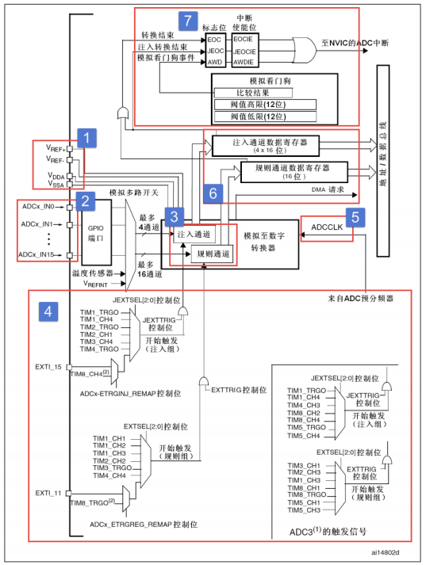
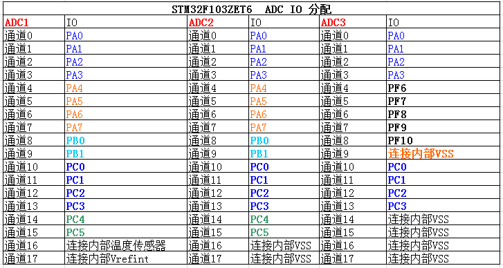
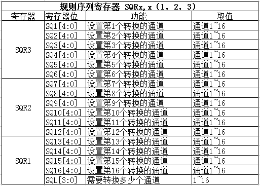
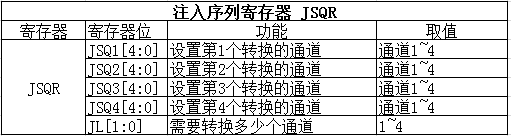
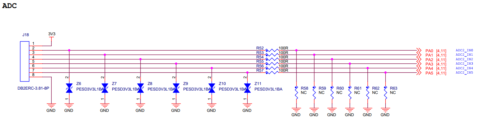
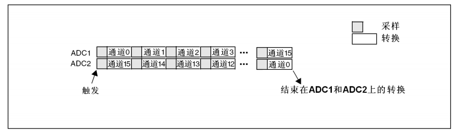

ADC—电压采集
------------

本章参考资料：《STM32F10X-中文参考手册》ADC章节。

学习本章时，配合《STM32F10X-中文参考手册》ADC章节一起阅读，效果会更佳，特别是涉及到寄存器说明的部分。

ADC简介
~~~~~~~

STM32f103
系列有3个ADC，精度为12位，每个ADC最多有16个外部通道。其中ADC1和ADC2都有16个外部通道，ADC3根据CPU引脚的不同通道数也不同，一般都有8个外部通道。ADC的模式非常多，功能非常强大，具体的我们在功能框图中分析每个部分的功能。

ADC功能框图剖析
~~~~~~~~~~~~~~~

图 29‑1 单个ADC功能框图

掌握了ADC的功能框图，就可以对ADC有一个整体的把握，在编程的时候可以做到了然如胸，不会一知半解。框图讲解采用从左到右的方式，跟ADC采集数据，转换数据，传输数据的方向大概一致。

①电压输入范围
'''''''''''''

ADC输入范围为：V\ :sub:`REF-` ≤ V\ :sub:`IN` ≤
V\ :sub:`REF+`\ 。由V\ :sub:`REF-`\ 、V\ :sub:`REF+` 、V\ :sub:`DDA`
、V\ :sub:`SSA`\ 、这四个外部引脚决定。

我们在设计原理图的时候一般把V\ :sub:`SSA`\ 和V\ :sub:`REF-`\ 接地，
把V\ :sub:`REF+`\ 和V\ :sub:`DDA`
接3V3，得到ADC的输入电压范围为：0~3.3V。

如果我们想让输入的电压范围变宽，去到可以测试负电压或者更高的正电压，我们可以在外部加一个电压调理电路，把需要转换的电压抬升或者降压到0~3.3V，这样ADC就可以测量了。

②输入通道
'''''''''

| 我们确定好ADC输入电压之后，那么电压怎么输入到ADC？这里我们引入通道的概念，STM32的ADC多达18个通道，其中外部的16个通道就是框图中的ADCx_IN0、ADCx_IN1...ADCx_IN5。这16个通道对应着不同的IO口，具体是哪一个IO口可以从手册查询到。其中ADC1/2/3还有内部通道：ADC1的通道16连接到了芯片内部的温度传感器，Vrefint
  连接到了通道17。ADC2的模拟通道16和17连接到了内部的VSS。
| ADC3的模拟通道9、14、15、16和17连接到了内部的VSS。

图 29‑2 STM32F103VET6 ADC 通道

外部的16个通道在转换的时候又分为规则通道和注入通道，其中规则通道最多有16路，注入通道最多有4路。那这两个通道有什么区别？在什么时候使用？

规则通道
=============

规则通道：顾名思意，规则通道就是很规矩的意思，我们平时一般使用的就是这个通道，或者应该说我们用到的都是这个通道，没有什么特别要注意的可讲。

注入通道
===========

注入，可以理解为插入，插队的意思，是一种不安分的通道。它是一种在规则通道转换的时候强行插入要转换的一种。如果在规则通道转换过程中，有注入通道插队，那么就要先转换完注入通道，等注入通道转换完成后，再回到规则通道的转换流程。这点跟中断程序很像，都是不安分的主。所以，注入通道只有在规则通道存在时才会出现。

③转换顺序
'''''''''

规则序列
===========

规则序列寄存器有3个，分别为SQR3、SQR2、SQR1。SQR3控制着规则序列中的第一个到第六个转换，对应的位为：SQ1[4:0]~SQ6[4:0]，第一次转换的是位4:0
SQ1[4:0]，如果通道16想第一次转换，那么在SQ1[4:0]写16即可。SQR2控制着规则序列中的第7到第12个转换，对应的位为：SQ7[4:0]~SQ12[4:0]，如果通道1想第8个转换，则SQ8[4:0]写1即可。SQR1控制着规则序列中的第13到第16个转换，对应位为：SQ13[4:0]~SQ16[4:0]，如果通道6想第10个转换，则SQ10[4:0]写6即可。具体使用多少个通道，由SQR1的位L[3:0]决定，最多16个通道。

图 29‑3 规则序列寄存器

注入序列
===========

注入序列寄存器JSQR只有一个，最多支持4个通道，具体多少个由JSQR的JL[2:0]决定。如果JL的
值小于4的话，则JSQR跟SQR决定转换顺序的设置不一样，第一次转换的不是JSQR1[4:0]，而是JCQRx[4:0]
，x =
（4-JL），跟SQR刚好相反。如果JL=00（1个转换），那么转换的顺序是从JSQR4[4:0]开始，而不是从JSQR1[4:0]开始，这个要注意，编程的时候不要搞错。当JL等于4时，跟SQR一样。

图 29‑4 注入序列寄存器

④触发源
'''''''

通道选好了，转换的顺序也设置好了，那接下来就该开始转换了。ADC转换可以由ADC控制寄存器2:
ADC_CR2的ADON这个位来控制，写1的时候开始转换，写0的时候停止转换，这个是最简单也是最好理解的开启ADC转换的控制方式，理解起来没啥技术含量。

除了这种庶民式的控制方法，ADC还支持触发转换，这个触发包括内部定时器触发和外部IO触发。触发源有很多，具体选择哪一种触发源，由ADC控制寄存器2:ADC_CR2的EXTSEL[2:0]和JEXTSEL[2:0]位来控制。EXTSEL[2:0]用于选择规则通道的触发源，JEXTSEL[2:0]用于选择注入通道的触发源。选定好触发源之后，触发源是否要激活，则由ADC控制寄存器2:ADC_CR2的EXTTRIG和JEXTTRIG这两位来激活。其中ADC3的规则转换和注入转换的触发源与ADC1/2的有所不同，在框图上已经表示出来。

⑤转换时间
'''''''''

ADC时钟
=========

ADC输入时钟ADC_CLK由PCLK2经过分频产生，最大是14M，分频因子由RCC时钟配置寄存器RCC_CFGR的位15:14
ADCPRE[1:0]设置，可以是2/4/6/8分频，注意这里没有1分频。一般我们设置PCLK2=HCLK=72M。

采样时间
==========

ADC使用若干个ADC_CLK周期对输入的电压进行采样，采样的周期数可通过ADC
采样时间寄存器ADC_SMPR1和ADC_SMPR2中的SMP[2:0]位设置，ADC_SMPR2控制的是通道0~9，ADC_SMPR1控制的是通道10~17。每个通道可以分别用不同的时间采样。其中采样周期最小是1.5个，即如果我们要达到最快的采样，那么应该设置采样周期为1.5个周期，这里说的周期就是1/ADC_CLK。

ADC的转换时间跟ADC的输入时钟和采样时间有关，公式为：Tconv = 采样时间 +
12.5个周期。当ADCLK = 14MHZ
（最高），采样时间设置为1.5周期（最快），那么总的转换时间（最短）Tconv =
1.5周期 + 12.5周期 = 14周期 = 1us。

一般我们设置PCLK2=72M，经过ADC预分频器能分频到最大的时钟只能是12M，采样周期设置为1.5个周期，算出最短的转换时间为1.17us，这个才是最常用的。

⑥数据寄存器
'''''''''''

一切准备就绪后，ADC转换后的数据根据转换组的不同，规则组的数据放在ADC_DR寄存器，注入组的数据放在JDRx。

规则数据寄存器
===================

ADC规则组数据寄存器ADC_DR只有一个，是一个32位的寄存器，低16位在单ADC时使用，高16位是在ADC1中双模式下保存ADC2转换的规则数据，双模式就是ADC1和ADC2同时使用。在单模式下，ADC1/2/3都不使用高16位。因为ADC的精度是12位，无论ADC_DR的高16或者低16位都放不满，只能左对齐或者右对齐，具体是以哪一种方式存放，由ADC_CR2的11位ALIGN设置。

规则通道可以有16个这么多，可规则数据寄存器只有一个，如果使用多通道转换，那转换的数据就全部都挤在了DR里面，前一个时间点转换的通道数据，就会被下一个时间点的另外一个通道转换的数据覆盖掉，所以当通道转换完成后就应该把数据取走，或者开启DMA模式，把数据传输到内存里面，不然就会造成数据的覆盖。最常用的做法就是开启DMA传输。

注入数据寄存器
===================

ADC注入组最多有4个通道，刚好注入数据寄存器也有4个，每个通道对应着自己的寄存器，不会跟规则寄存器那样产生数据覆盖的问题。ADC_JDRx是32位的，低16位有效，高16位保留，数据同样分为左对齐和右对齐，具体是以哪一种方式存放，由ADC_CR2的11位ALIGN设置。

⑦中断
'''''

转换结束中断
===================

数据转换结束后，可以产生中断，中断分为三种：规则通道转换结束中断，注入转换通道转换结束中断，模拟看门狗中断。其中转换结束中断很好理解，跟我们平时接触的中断一样，有相应的中断标志位和中断使能位，我们还可以根据中断类型写相应配套的中断服务程序。

模拟看门狗中断
===================

当被ADC转换的模拟电压低于低阈值或者高于高阈值时，就会产生中断，前提是我们开启了模拟看门狗中断，其中低阈值和高阈值由ADC_LTR和ADC_HTR设置。例如我们设置高阈值是2.5V，那么模拟电压超过2.5V的时候，就会产生模拟看门狗中断，反之低阈值也一样。

DMA请求
===================

规则和注入通道转换结束后，除了产生中断外，还可以产生DMA请求，把转换好的数据直接存储在内存里面。要注意的是只有ADC1和ADC3可以产生DMA请求。有关DMA请求需要配合《STM32F10X-中文参考手册》DMA控制器这一章节来学习。一般我们在使用ADC的时候都会开启DMA传输。

⑧电压转换
'''''''''

模拟电压经过ADC转换后，是一个12位的数字值，如果通过串口以16进制打印出来的话，可读性比较差，那么有时候我们就需要把数字电压转换成模拟电压，也可以跟实际的模拟电压（用万用表测）对比，看看转换是否准确。

我们一般在设计原理图的时候会把ADC的输入电压范围设定在：0~3.3v，因为ADC是12位的，那么12位满量程对应的就是3.3V，12位满量程对应的数字值是：2^12。数值0对应的就是0V。如果转换后的数值为  X
，X对应的模拟电压为Y，那么会有这么一个等式成立：  2^12 / 3.3 = X / Y，=>
Y = (3.3 \* X ) / 2^12。

ADC初始化结构体详解
~~~~~~~~~~~~~~~~~~~

HAL库函数对每个外设都建立了一个初始化结构体xxx_InitTypeDef(xxx为外设名称)，结构体成员用于设置外设工作参数，并由HAL库函数xxx_Init()调用这些设定参数进入设置外设相应的寄存器，达到配置外设工作环境的目的。

结构体xxx_InitTypeDef和库函数xxx_Init配合使用是HAL库精髓所在，理解了结构体xxx_InitTypeDef每个成员意义基本上就可以对该外设运用自如了。结构体xxx_InitTypeDef定义在stm32f1xx_hal_xxx.h文件中，库函数xxx_Init定义在stm32f1xx_hal_xxx.c文件中，编程时我们可以结合这两个文件内注释使用。

ADC_InitTypeDef结构体
''''''''''''''''''''''''

ADC_InitTypeDef结构体定义在stm32f1xx_hal_adc.h文件内，具体定义如下：

.. code-block:: c

    typedef struct
    {
        uint32_t Mode;                      // ADC 工作模式选择
        FunctionalState ScanConvMode;       /* ADC 扫描（多通道）
                                                    或者单次（单通道）模式选择 */
        FunctionalState ContinuousConvMode; // ADC 单次转换或者连续转换选择
        uint32_t ExternalTrigConv;          // ADC 转换触发信号选择
        uint32_t DataAlign;                 // ADC 数据寄存器对齐格式
        uint8_t NbrOfChannel;               // ADC 采集通道数
    } ADC_InitTypeDef;

Mode：配置ADC的模式，当使用一个ADC时是独立模式，使用两个ADC时是双模式，在双模式下还有很多细分模式可选，具体配置ADC_CR1:DUALMOD位。

ScanConvMode：可选参数为ENABLE和DISABLE，配置是否使用扫描。如果是单通道AD转换使用DISABLE，如果是多通道AD转换使用ENABLE，具体配置ADC_CR1:SCAN位。

ContinuousConvMode：可选参数为ENABLE和DISABLE，配置是启动自动连续转换还是单次转换。使用ENABLE配置为使能自动连续转换；使用DISABLE配置为单次转换，转换一次后停止需要手动控制才重新启动转换，具体配置ADC_CR2:CON位。

ExternalTrigConv：外部触发选择，图
29‑1中列举了很多外部触发条件，可根据项目需求配置触发来源。实际上，我们一般使用软件自动触发。

DataAlign：转换结果数据对齐模式，可选右对齐ADC_DataAlign_Right或者左对齐ADC_DataAlign_Left。一般我们选择右对齐模式。

NbrOfChannel：AD转换通道数目，根据实际设置即可。具体的通道数和通道的转换顺序是配置规则序列或注入序列寄存器。

独立模式单通道采集实验
~~~~~~~~~~~~~~~~~~~~~~

STM32的ADC功能繁多，我们设计三个实验尽量完整的展示ADC的功能。首先是比较基础实用的单通道采集，实现开发板上电位器电压的采集，并通过串口打印至PC端串口调试助手。单通道采集适用AD转换完成中断，在中断服务函数中读取数据，不使用DMA传输，在多通道采集时才使用DMA传输。

硬件设计
'''''''''''''''

开发板ADC电路设计见 图29_5_。

图 29‑5 开发板电位器部分原理图

开发板默认的ADC电压采集范围为0~3.3V。

软件设计
'''''''''''''

这里只讲解核心的部分代码，有些变量的设置，头文件的包含等并没有涉及到，完整的代码请参考本章配套的工程。

我们编写两个ADC驱动文件，bsp_adc.h 和
bsp_adc.c，用来存放ADC所用IO引脚的初始化函数以及ADC配置相关函数。

编程要点
===============

1) 初始ADC用到的GPIO；

2) 设置ADC的工作参数并初始化；

3) 设置ADC工作时钟；

4) 设置ADC转换通道顺序及采样时间；

5) 配置使能ADC转换完成中断，在中断内读取转换完数据；

6) 使能ADC；

7) 使能软件触发ADC转换。

ADC转换结果数据使用中断方式读取，这里没有使用DMA进行数据传输。

代码分析
===========

ADC宏定义
....................

代码清单 29‑1 ADC宏定义

.. code-block:: c

    // ADC GPIO 宏定义
    #define RHEOSTAT_ADC_GPIO_PORT              GPIOA
    #define RHEOSTAT_ADC_GPIO_PIN               GPIO_PIN_0
    #define RHEOSTAT_ADC_GPIO_CLK_ENABLE()      __HAL_RCC_GPIOA_CLK_ENABLE()
        
    // ADC 序号宏定义
    #define RHEOSTAT_ADC                        ADC1
    #define RHEOSTAT_ADC_CLK_ENABLE()           __HAL_RCC_ADC1_CLK_ENABLE(); 
    #define RHEOSTAT_ADC_CHANNEL                ADC_CHANNEL_0

    // ADC DMA 通道宏定义，这里我们使用DMA传输
    #define RHEOSTAT_ADC_DMA_CLK_ENABLE()       __HAL_RCC_DMA1_CLK_ENABLE();
    #define RHEOSTAT_ADC_DMA_STREAM             DMA1_Channel1

使用宏定义引脚信息方便硬件电路改动时程序移植。

ADC GPIO初始化函数
.....................

.. code-block:: c
   :caption: 代码清单 29‑2 ADC GPIO初始化
   :name: 代码清单29_2

    static void Rheostat_ADC_GPIO_Config(void)
    {
        GPIO_InitTypeDef GPIO_InitStructure;

        RHEOSTAT_ADC_CLK_ENABLE(); 
        // 使能 GPIO 时钟
        RHEOSTAT_ADC_GPIO_CLK_ENABLE();
                
        // 配置 IO
        GPIO_InitStructure.Pin = RHEOSTAT_ADC_GPIO_PIN;
        GPIO_InitStructure.Mode = GPIO_MODE_ANALOG;	    
        //  GPIO_InitStructure.Pull = GPIO_NOPULL ; //不上拉不下拉
        HAL_GPIO_Init(RHEOSTAT_ADC_GPIO_PORT, &GPIO_InitStructure);		
    }

使用到GPIO时候都必须开启对应的GPIO时钟，GPIO用于AD转换功能必须配置为模拟输入模式。

配置ADC工作模式
.................

.. code-block:: c
   :caption: 代码清单 29‑3 ADC工作模式配置
   :name: 代码清单29_3

    static void Rheostat_ADC_Mode_Config(void)
    {

        // ------------------DMA Init 结构体参数 初始化--------------------------
        // 开启DMA时钟
        RHEOSTAT_ADC_DMA_CLK_ENABLE();
        // 数据传输通道
        hdma_adcx.Instance = RHEOSTAT_ADC_DMA_STREAM;
    
        hdma_adcx.Init.Direction=DMA_PERIPH_TO_MEMORY;;            //存储器到外设
        hdma_adcx.Init.PeriphInc=DMA_PINC_DISABLE;                 //外设非增量模式
        hdma_adcx.Init.MemInc=DMA_MINC_DISABLE;                     //存储器增量模式 
        hdma_adcx.Init.PeriphDataAlignment=DMA_PDATAALIGN_HALFWORD;//外设数据长度:16位
        hdma_adcx.Init.MemDataAlignment=DMA_MDATAALIGN_HALFWORD;   //存储器数据长度:16位
        hdma_adcx.Init.Mode= DMA_CIRCULAR;                         //外设普通模式
        hdma_adcx.Init.Priority=DMA_PRIORITY_MEDIUM;               //中等优先级

        //初始化DMA流，流相当于一个大的管道，管道里面有很多通道
        HAL_DMA_Init(&hdma_adcx); 

        __HAL_LINKDMA( &ADC_Handle,DMA_Handle,hdma_adcx);
    
    //---------------------------------------------------------------------------
        RCC_PeriphCLKInitTypeDef ADC_CLKInit;
        // 开启ADC时钟
        ADC_CLKInit.PeriphClockSelection=RCC_PERIPHCLK_ADC;			//ADC外设时钟
        ADC_CLKInit.AdcClockSelection=RCC_ADCPCLK2_DIV8;			  //分频因子6时钟为72M/8=9MHz
        HAL_RCCEx_PeriphCLKConfig(&ADC_CLKInit);					      //设置ADC时钟
    
        ADC_Handle.Instance=RHEOSTAT_ADC;
        ADC_Handle.Init.DataAlign=ADC_DATAALIGN_RIGHT;             //右对齐
        ADC_Handle.Init.ScanConvMode=DISABLE;                      //非扫描模式
        ADC_Handle.Init.ContinuousConvMode=ENABLE;                 //连续转换
        ADC_Handle.Init.NbrOfConversion=1;                         //1个转换在规则序列中 也就是只转换规则序列1 
        ADC_Handle.Init.DiscontinuousConvMode=DISABLE;             //禁止不连续采样模式
        ADC_Handle.Init.NbrOfDiscConversion=0;                     //不连续采样通道数为0
        ADC_Handle.Init.ExternalTrigConv=ADC_SOFTWARE_START;       //软件触发
        HAL_ADC_Init(&ADC_Handle);                                 //初始化 
    
    //---------------------------------------------------------------------------
        ADC_Config.Channel      = RHEOSTAT_ADC_CHANNEL;
        ADC_Config.Rank         = 1;
        // 采样时间间隔	
        ADC_Config.SamplingTime = ADC_SAMPLETIME_55CYCLES_5 ;
        // 配置 ADC 通道转换顺序为1，第一个转换，采样时间为3个时钟周期
        HAL_ADC_ConfigChannel(&ADC_Handle, &ADC_Config);

        HAL_ADC_Start_DMA(&ADC_Handle, (uint32_t*)&ADC_ConvertedValue, 1);
    }

首先，使用ADC_HandleTypeDef和ADC_ChannelConfTypeDef结构体分别定义一个ADC初始化和ADC通道配置变量，这两个结构体我们之前已经有详细讲解。

我们调用RHEOSTAT_ADC_CLK_ENABLE()开启ADC时钟。

接下来我们使用ADC_HandleTypeDef结构体变量ADC_Handle来配置ADC的寄存器基地址指针、分频系数为4、ADC1为12位分辨率、单通道采集不需要扫描、启动连续转换、使用内部软件触发无需外部触发事件、使用右对齐数据格式、转换通道为1，并调用HAL_ADC_Init函数完成ADC1工作环境配置。

使用ADC_ChannelConfTypeDef结构体变量ADC_Config来配置ADC的通道、转换顺序，可选为1到16；采样周期选择，采样周期越短，ADC转换数据输出周期就越短但数据精度也越低，采样周期越长，ADC转换数据输出周期就越长同时数据精度越高。PC3对应ADC通道ADC_Channel_13，这里我们选择ADC_SampleTime_56Cycles即56周期的采样时间，调用HAL_ADC_ConfigChannel函数完成ADC1的配置。

利用ADC转换完成中断可以非常方便的保证我们读取到的数据是转换完成后的数据而不用担心该数据可能是ADC正在转换时“不稳定”的数据。我们使用HAL_ADC_Start_IT函数使能ADC转换完成中断，并在中断服务函数中读取转换结果数据。

ADC中断配置
.................

.. code-block:: c
   :caption: 代码清单 29‑4 ADC中断配置
   :name: 代码清单29_4

    // 配置中断优先级
    static void Rheostat_ADC_NVIC_Config(void)
    {
        HAL_NVIC_SetPriority(Rheostat_ADC_IRQ, 0, 0);
        HAL_NVIC_EnableIRQ(Rheostat_ADC_IRQ);
    }

我们使能了ADC转换完成中断，需要配置中断源和中断优先级。

ADC中断服务函数
.................

.. code-block:: c
   :caption: 代码清单 29‑5 ADC中断服务函数
   :name: 代码清单29_5

    void ADC_IRQHandler(void)
    {
        HAL_ADC_IRQHandler(&ADC_Handle);
    }
    /**
    * @brief  转换完成中断回调函数（非阻塞模式）
    * @param  AdcHandle : ADC句柄
    * @retval 无
    */
    void HAL_ADC_ConvCpltCallback(ADC_HandleTypeDef* AdcHandle)
    {
        /* 获取结果 */
        ADC_ConvertedValue = HAL_ADC_GetValue(AdcHandle); }
    }

中断服务函数一般定义在stm32f1xx_it.c文件内，HAL_ADC_IRQHandler是HAL中自带的一个中断服务函数，他处理过程中会指向一个回调函数给我们去添加用户代码，这里我们使用HAL_ADC_ConvCpltCallback转换完成中断，在ADC转换完成后就会进入中断服务函数，在进入回调函数，我们在回调函数内直接读取ADC转换结果保存在变量ADC_ConvertedValue(在main.c中定义)中。

ADC_GetConversionValue函数是获取ADC转换结果值的库函数，只有一个形参为ADC句柄，该函数还返回一个16位的ADC转换结果值

主函数
..........

.. code-block:: c
   :caption: 代码清单 29‑6 主函数
   :name: 代码清单29_6

    /**
    * @brief  主函数
    * @param  无
    * @retval 无
    */
    int main(void)
    {
        /* 配置系统时钟为72 MHz */
        SystemClock_Config();
        /* 初始化USART1 配置模式为 115200 8-N-1 */
        UARTx_Config();
        Rheostat_Init();
        while (1) {
        ADC_Vol =(float)ADC_ConvertedValue/4096*(float)3.3;//读取转换的AD值
            printf("\r\n The current AD value = 0x%04X \r\n", ADC_ConvertedValue);
        printf("\r\n The current AD value = %f V \r\n",ADC_Vol);
            Delay(0x8fffff);
        }
    }

主函数先调用USARTx_Config函数配置调试串口相关参数，函数定义在bsp_debug_usart.c文件中。

接下来调用Rheostat _Init函数进行ADC初始化配置并启动ADC。Rheostat
_Init函数是定义在bsp_adc.c文件中，它只是简单的分别调用Rheostat_ADC_GPIO_Config
()、Rheostat_ADC_Mode_Config ()和Rheostat_ADC_NVIC_Config()。

Delay函数只是一个简单的延时函数。

在ADC中断服务函数中我们把AD转换结果保存在变量ADC_ConvertedValue中，根据我们之前的分析可以非常清楚的计算出对应的电位器动触点的电压值。

最后就是把相关数据打印至串口调试助手.

下载验证
=============

用USB线连接开发板的“USB转串口”接口跟电脑，在电脑端打开串口调试助手，把编译好的程序下载到开发板。在串口调试助手可看到不断有数据从开发板传输过来，此时我们旋转电位器改变其电阻值，那么对应的数据也会有变化。

独立模式多通道采集实验
~~~~~~~~~~~~~~~~~~~~~~

硬件设计
'''''''''''

开发板已通过排针接口把实验用的ADC引脚都留出来了
在做实验的时候可以用杜邦线连接到开发板中的GND或者3V3来获取模拟信号。要注意的是，用来做ADC输入的IO不能被复用，否则会导致采集到的信号不准确。

软件设计
'''''''''''

这里只讲解核心的部分代码，有些变量的设置，头文件的包含等并没有涉及到，完整的代码请参考本章配套的工程。

跟单通道例程一样，我们编写两个ADC驱动文件，bsp_adc.h 和
bsp_adc.c，用来存放ADC所用IO引脚的初始化函数以及ADC配置相关函数，实际上这两个文件跟单通道实验的文件是非常相似的。

编程要点
============

1) 初始化ADC GPIO；

2) 初始化ADC工作参数；

3) 配置DMA工作参数；

4) 读取ADC采集的数据；

ADC转换结果数据使用DMA方式传输至指定的存储区，这样取代单通道实验使用中断服务的读取方法。实际上，多通道ADC采集一般使用DMA数据传输方式更加高效方便。

代码分析
=============

.. _adc宏定义-1:

ADC宏定义
...............

.. code-block:: c
   :caption: 代码清单 29‑7 多通道ADC相关宏定义
   :name: 代码清单29_7

    #define    NOFCHANEL										 6

    #define    ADC_PIN1                     GPIO_PIN_0
    #define    ADC_CHANNEL1                 ADC_CHANNEL_0

    #define    ADC_PIN2                      GPIO_PIN_1
    #define    ADC_CHANNEL2                 ADC_CHANNEL_1

    #define    ADC_PIN3                      GPIO_PIN_2
    #define    ADC_CHANNEL3                 ADC_CHANNEL_2

    #define    ADC_PIN4                      GPIO_PIN_3
    #define    ADC_CHANNEL4                 ADC_CHANNEL_3

    #define    ADC_PIN5                      GPIO_PIN_4
    #define    ADC_CHANNEL5                  ADC_CHANNEL_4

    #define    ADC_PIN6                      GPIO_PIN_5
    #define    ADC_CHANNEL6                  ADC_CHANNEL_5

    // ADC GPIO 宏定义
    #define RHEOSTAT_ADC_GPIO_PORT              GPIOA
    #define RHEOSTAT_ADC_GPIO_CLK_ENABLE()      __HAL_RCC_GPIOA_CLK_ENABLE()
        
    // ADC 序号宏定义
    #define RHEOSTAT_ADC                        ADC1
    #define RHEOSTAT_ADC_CLK_ENABLE()           __HAL_RCC_ADC1_CLK_ENABLE(); 

    // ADC DMA 通道宏定义，这里我们使用DMA传输
    #define RHEOSTAT_ADC_DMA_CLK_ENABLE()       __HAL_RCC_DMA1_CLK_ENABLE();
    #define RHEOSTAT_ADC_DMA_STREAM             DMA1_Channel1

定义NOFCHANEL个通道进行多通道ADC实验，并且定义DMA相关配置。

ADC GPIO初始化函数
..............................

.. code-block:: c
   :caption: 代码清单 29‑8 ADC GPIO初始化
   :name: 代码清单29_8

    static void Rheostat_ADC_GPIO_Config(void)
    {
        GPIO_InitTypeDef GPIO_InitStructure;

        RHEOSTAT_ADC_CLK_ENABLE(); 
        // 使能 GPIO 时钟
        RHEOSTAT_ADC_GPIO_CLK_ENABLE();
            
        // 配置 IO
        GPIO_InitStructure.Pin =ADC_PIN1|
                                ADC_PIN2|
                                ADC_PIN3|
                                ADC_PIN4|
                                ADC_PIN5|
                                ADC_PIN6;
        GPIO_InitStructure.Mode = GPIO_MODE_ANALOG;	    
        GPIO_InitStructure.Pull = GPIO_NOPULL ; //不上拉不下拉
        HAL_GPIO_Init(RHEOSTAT_ADC_GPIO_PORT, &GPIO_InitStructure);	
    }

使用到GPIO时候都必须开启对应的GPIO时钟，GPIO用于AD转换功能必须配置为模拟输入模式。

配置ADC工作模式
.................

.. code-block:: c
   :caption: 代码清单 29‑9 ADC工作模式配置
   :name: 代码清单29_9

    static void Rheostat_ADC_Mode_Config(void)
    {
        // ------------------DMA Init 结构体参数 初始化--------------------------
        // 开启DMA时钟
        RHEOSTAT_ADC_DMA_CLK_ENABLE();
        // 数据传输通道
        hdma_adcx.Instance = RHEOSTAT_ADC_DMA_STREAM;
        hdma_adcx.Init.Direction=DMA_PERIPH_TO_MEMORY;
        //存储器到外设
        hdma_adcx.Init.PeriphInc=DMA_PINC_DISABLE;
        //外设非增量模式
        hdma_adcx.Init.MemInc=DMA_MINC_ENABLE;
        //存储器增量模式
        hdma_adcx.Init.PeriphDataAlignment=DMA_PDATAALIGN_HALFWORD;
        //外设数据长度:16位
        hdma_adcx.Init.MemDataAlignment=DMA_PDATAALIGN_HALFWORD;
        //存储器数据长度:16位
        hdma_adcx.Init.Mode= DMA_CIRCULAR;
        //外设普通模式
        hdma_adcx.Init.Priority=DMA_PRIORITY_MEDIUM;
        //中等优先级

        HAL_DMA_Init(&hdma_adcx);

        __HAL_LINKDMA( &ADC_Handle,DMA_Handle,hdma_adcx);

        //---------------------------------------------------------------------------
        RCC_PeriphCLKInitTypeDef ADC_CLKInit;
        // 开启ADC时钟
        ADC_CLKInit.PeriphClockSelection=RCC_PERIPHCLK_ADC;
        //ADC外设时钟
        ADC_CLKInit.AdcClockSelection=RCC_ADCPCLK2_DIV6;
        //分频因子6时钟为72M/6=12MHz
        HAL_RCCEx_PeriphCLKConfig(&ADC_CLKInit);
        //设置ADC时钟

        ADC_Handle.Instance=RHEOSTAT_ADC;
        ADC_Handle.Init.DataAlign=ADC_DATAALIGN_RIGHT;
        //右对齐
        ADC_Handle.Init.ScanConvMode=ENABLE;
        //非扫描模式
        ADC_Handle.Init.ContinuousConvMode=ENABLE;
        //连续转换
        ADC_Handle.Init.NbrOfConversion=NOFCHANEL ;
        //1个转换在规则序列中 也就是只转换规则序列1
        ADC_Handle.Init.DiscontinuousConvMode=DISABLE;
        //禁止不连续采样模式
        ADC_Handle.Init.NbrOfDiscConversion=0;
        //不连续采样通道数为0
        ADC_Handle.Init.ExternalTrigConv=ADC_SOFTWARE_START;
        //软件触发
        HAL_ADC_Init(&ADC_Handle);
        //初始化
        //---------------------------------------------------------------------------
        ADC_Config.Channel      = ADC_CHANNEL1;
        ADC_Config.Rank         = 1;
        // 采样时间间隔
        ADC_Config.SamplingTime = ADC_SAMPLETIME_55CYCLES_5 ;
        // 配置 ADC 通道转换顺序为1，第一个转换，采样时间为3个时时钟周期
        HAL_ADC_ConfigChannel(&ADC_Handle, &ADC_Config);
        //---------------------------------------------------------------------------
        ADC_Config.Channel      = ADC_CHANNEL2;
        ADC_Config.Rank         = 2;
        // 配置 ADC 通道转换顺序为1，第一个转换，采样时间为3个时时钟周期
        HAL_ADC_ConfigChannel(&ADC_Handle, &ADC_Config);
        //---------------------------------------------------------------------------
        ADC_Config.Channel      = ADC_CHANNEL3;
        ADC_Config.Rank         = 3;
        // 配置 ADC 通道转换顺序为1，第一个转换，采样时间为3个时时钟周期
        HAL_ADC_ConfigChannel(&ADC_Handle, &ADC_Config);
        //---------------------------------------------------------------------------
        ADC_Config.Channel      = ADC_CHANNEL4;
        ADC_Config.Rank         = 4;
        // 配置 ADC 通道转换顺序为1，第一个转换，采样时间为3个时时钟周期
        HAL_ADC_ConfigChannel(&ADC_Handle, &ADC_Config);
        //---------------------------------------------------------------------------
        ADC_Config.Channel      = ADC_CHANNEL5;
        ADC_Config.Rank         = 5;
        // 配置 ADC 通道转换顺序为1，第一个转换，采样时间为3个时时钟周期
        HAL_ADC_ConfigChannel(&ADC_Handle, &ADC_Config);
        //---------------------------------------------------------------------------
        ADC_Config.Channel      = ADC_CHANNEL6;
        ADC_Config.Rank         = 6;
        // 配置 ADC 通道转换顺序为1，第一个转换，采样时间为3个时时钟周期
        HAL_ADC_ConfigChannel(&ADC_Handle, &ADC_Config);
        HAL_ADC_Start_DMA(&ADC_Handle, (uint32_t*)&ADC_ConvertedValue, 1);
    }

ADCx_Mode_Config函数主要做了两个工作，一个是配置ADC的工作参数，另外一个是配置DMA的工作参数。

ADC的工作参数具体如下：打开ADC外设时钟；因为只是使用一个ADC，所有模式配置为独立模式；多通道采集，开启扫描模式；需要不断的采集外部的模拟数据，所有使能连续转换模式；不使用外部触发转换信号；转换结果右对齐；设置需要转换的通道的个数，最后调用ADC_Init()函数把这些参数写入ADC的寄存器完成配置。因为是多通道采集，所以调用ADC_RegularChannelConfig()函数设置每个通道的转换顺序和采样实际。

DMA的工作参数具体如下：我们是把ADC采集到的数据通过DMA传输到存储器上，则外设地址为ADC的数据寄存器；存储器的地址是我们定义的用来存放ADC数据的数组的地址；传输方向为外设到存储器；缓冲区大小等于等于我们定义的存储ADC数据的数组大小；所有通道转换的数据都放在一个数据寄存器中，则外设地址不变；采集存储的数据有多个，则存储器地址递增；外设和存储器单位均为两个字节；开启循环传输模式；只有一个DMA通道工作，优先级随便设置；禁用存储器到存储器模式，最后最后调用DMA_Init()函数把这些参数写入DMA的寄存器完成配置。

完成配置之后则使能ADC和DMA，开启软件触发，让ADC开始采集数据。

主函数
............

.. code-block:: c
   :caption: 代码清单 29‑10 主函数
   :name: 代码清单29_10

    int main(void)
    {
        SystemClock_Config();
        USART_Config();

        // ADC 初始化
        ADCx_Init();

        printf("\r\n ----这是一个ADC多通道采集DMA读取实验----\r\n");

        while (1)
        {

            ADC_ConvertedValueLocal[0] =(float)
                                        ADC_ConvertedValue[0]/4096*3.3;
            ADC_ConvertedValueLocal[1] =(float)
                                        ADC_ConvertedValue[1]/4096*3.3;
            ADC_ConvertedValueLocal[2] =(float)
                                        ADC_ConvertedValue[2]/4096*3.3;
            ADC_ConvertedValueLocal[3] =(float)
                                        ADC_ConvertedValue[3]/4096*3.3;
            ADC_ConvertedValueLocal[4] =(float)
                                        ADC_ConvertedValue[4]/4096*3.3;

            printf("\r\n CH1 value = %f V \r\n",ADC_ConvertedValueLocal[0]);
            printf("\r\n CH2 value = %f V \r\n",ADC_ConvertedValueLocal[1]);
            printf("\r\n CH3 value = %f V \r\n",ADC_ConvertedValueLocal[2]);
            printf("\r\n CH2 value = %f V \r\n",ADC_ConvertedValueLocal[3]);
            printf("\r\n CH3 value = %f V \r\n",ADC_ConvertedValueLocal[4]);

            printf("\r\n\r\n");
            Delay(0xffffee);
        }
    }

主函数中我们配置好串口，初始化好ADC之后，把采集到的电压经过转换之后通过串口打印到电脑的调试助手显示，要注意的是在做实验时需要给每个ADC通道提供模拟电源，可以用杜邦线从开发板的GND或者3V3取信号来做实验。

下载验证
============

将待测电压通过杜邦线接在对应引脚上，用USB线连接开发板的“USB转串口”接口跟电脑，在电脑端打开串口调试助手，把编译好的程序下载到开发板。在串口调试助手可看到不断有数据从开发板传输过来，此时我们改变输入电压值，那么对应的数据也会有变化。

双重ADC同步规则模式采集实验
~~~~~~~~~~~~~~~~~~~~~~~~~~~

AD转换包括采样阶段和转换阶段，在采样阶段才对通道数据进行采集；而在转换阶段只是将采集到的数据进行转换为数字量输出，此刻通道数据变化不会改变转换结果。

独立模式的ADC采集需要在一个通道采集并且转换完成后才会进行下一个通道的采集。而双重ADC的机制就是使用两个ADC同时采样一个或者多个通道。双重ADC模式较独立模式一个最大的优势就是提高了采样率，弥补了单个ADC采样不够快的缺点。

启用双ADC模式的时候，通过配置ADC_CR1寄存器的DUALMOD[3:0]位，可以有几种不同的模式，具体见表格
29‑1：

表格 29‑1 双ADC模式的各种模式汇总

===========================  ==================================================================================================================================
模式                         简要说明
同步注入模式                 ADC1和ADC2同时转换一个注入通道组，其中ADC1为主，ADC2为从。转换的数据存储在每个ADC接口的ADC_JDRx寄存器中。
同步规则模式                 ADC1和ADC2同时转换一个规则通道组，其中ADC1为主，ADC2为从。ADC1转换的结果放在ADC1_DR的低16位，ADC2转换的结果放在ADC1_DR的高十六位。
快速交叉模式                 ADC1和ADC2交替采集一个规则通道组（通常为一个通道）。当ADC2触发之后，ADC1需要等待7个ADCCLK之后才能触发。
慢速交叉模式                 ADC1和ADC2交替采集一个规则通道组（只能为一个通道）。当ADC2触发之后，ADC1需要等待14个ADCCLK之后才能触发。
交替触发模式                 ADC1和ADC2轮流采集注入通道组，当ADC1所有通道采集完毕之后再采集ADC2的通道，如此循环。跟交叉采集不一样。
混合的规则/注入同步模式      规则组同步转换被中断，以启动注入组的同步转换。分开两个模式来理解就可以了，区别就是注入组可以中断规则组的转换。
混合的同步规则+交替触发模式  规则组同步转换被中断，以启动注入组交替触发转换。分开两个模式来理解就可以了，区别就是注入组可以中断规则组的转换。
混合同步注入+交叉模式        交叉转换可以被同步注入模式中断。这种情况下，交叉转换被中断，注入转换被启动。
===========================  ==================================================================================================================================

这里只对这些模式做了简要的说明，更具体的信息请参考数据手册ADC章节的双ADC模式小节。

这里我们选取同步规则模式来作为实验讲解。同步规则模式是ADC1和ADC2同时转换一个规则通道组，ADC1是主，ADC2是从，ADC1转换的结果放在ADC1_DR的低16位，ADC2转换的结果放在ADC1_DR的高十六位。并且必须开启DMA功能。

外部触发来自ADC1的规则组多路开关(由ADC1_CR2寄存器的EXTSEL[2:0]选择)，
它同时给ADC2提供同步触发。为了简单起见，ADC1我们选择软件触发，ADC2必须选择外部触发，这个外部触发来自于ADC1的规则组多路开关。

为了实验的简单起见，实验中我们选取ADC1和ADC2各采集一个通道 。

图 29‑6 双重ADC同步规则模式

硬件设计
'''''''''''''

开发板用引出了6路ADC，实验中选取其中的两路（根据软件配置来选择）接开发板中的电位器/GND/3V3来获取模拟信号即可做实验。

软件设计
'''''''''''''

这里只讲解核心的部分代码，有些变量的设置，头文件的包含等并没有涉及到，完整的代码请参考本章配套的工程。

跟单通道例程一样，我们编写两个ADC驱动文件，bsp_adc.h 和
bsp_adc.c，用来存放ADC所用IO引脚的初始化函数以及ADC配置相关函数，实际上这两个文件跟单通道实验的文件非常相似。

编程要点
=============

1) 初始化ADC GPIO；

2) 初始化DMA配置；

3) 初始化ADC参数；

4) 读取ADC采集的数据，并打印出来校正；

代码分析
=============

ADC宏定义
=============

.. code-block:: c
   :caption: 代码清单 29‑11 多通道ADC相关宏定义
   :name: 代码清单29_11

    #define ADCx1_RCC_CLK_ENABLE()            __HAL_RCC_ADC1_CLK_ENABLE()
    #define ADCx1_RCC_CLK_DISABLE()           __HAL_RCC_ADC1_CLK_DISABLE()
    #define DMAx1_RCC_CLK_ENABLE()            __HAL_RCC_DMA1_CLK_ENABLE()
    #define ADCx1                             ADC1
    #define ADC_DMAx_CHANNELn                 DMA1_Channel1
    #define ADC_DMAx_CHANNELn_IRQn            DMA1_Channel1_IRQn
    #define ADC_DMAx_CHANNELn_IRQHANDLER      DMA1_Channel1_IRQHandler

    #define ADCx2_RCC_CLK_ENABLE()            __HAL_RCC_ADC2_CLK_ENABLE()
    #define ADCx2_RCC_CLK_DISABLE()           __HAL_RCC_ADC2_CLK_DISABLE()
    #define ADCx2                             ADC2

    #define ADC_GPIO_ClK_ENABLE()             __HAL_RCC_GPIOA_CLK_ENABLE()
    #define ADC_GPIO                          GPIOA
    #define ADC_GPIO_PIN                      GPIO_PIN_0  
    #define ADC_CHANNEL                       ADC_CHANNEL_0

ADC1和ADC2的通道由宏来定义，当硬件环境改变时，方便修改。

ADC GPIO初始化函数
=====================

.. code-block:: c
   :caption: 代码清单 29‑12 ADC GPIO初始化
   :name: 代码清单29_12

    void HAL_ADC_MspInit(ADC_HandleTypeDef* hadc)
    {
        GPIO_InitTypeDef GPIO_InitStruct;
        if(hadc->Instance==ADCx1)
        {
            /* 外设时钟使能 */
            ADCx1_RCC_CLK_ENABLE();
            
            /* AD转换通道引脚时钟使能 */
            ADC_GPIO_ClK_ENABLE();
            
            /* DMA时钟使能 */
            DMAx1_RCC_CLK_ENABLE();
            
            /* AD转换通道引脚初始化 */
            GPIO_InitStruct.Pin = ADC_GPIO_PIN;
            GPIO_InitStruct.Mode = GPIO_MODE_ANALOG;
            HAL_GPIO_Init(ADC_GPIO, &GPIO_InitStruct);

            /* DMA外设初始化配置 */  
            hdma_adcx.Instance = ADC_DMAx_CHANNELn;
            hdma_adcx.Init.Direction = DMA_PERIPH_TO_MEMORY;
            hdma_adcx.Init.PeriphInc = DMA_PINC_DISABLE;
            hdma_adcx.Init.MemInc = DMA_MINC_DISABLE;
            hdma_adcx.Init.PeriphDataAlignment = DMA_PDATAALIGN_WORD;
            hdma_adcx.Init.MemDataAlignment = DMA_MDATAALIGN_WORD;
            hdma_adcx.Init.Mode = DMA_CIRCULAR;
            hdma_adcx.Init.Priority = DMA_PRIORITY_HIGH;
            HAL_DMA_Init(&hdma_adcx);
            /* 连接DMA */
            __HAL_LINKDMA(hadc,DMA_Handle,hdma_adcx);
            
            /* 外设中断优先级配置和使能中断 */
            HAL_NVIC_SetPriority(ADC_DMAx_CHANNELn_IRQn, 0, 0);
            HAL_NVIC_EnableIRQ(ADC_DMAx_CHANNELn_IRQn);
        }
        else if(hadc->Instance==ADCx2)
        {
            /* 外设时钟使能 */
            ADCx2_RCC_CLK_ENABLE();
            
            /* AD转换通道引脚时钟使能 */
            ADC_GPIO_ClK_ENABLE();
            
            /* AD转换通道引脚初始化 */
            GPIO_InitStruct.Pin = ADC_GPIO_PIN;
            GPIO_InitStruct.Mode = GPIO_MODE_ANALOG;
            HAL_GPIO_Init(ADC_GPIO, &GPIO_InitStruct);
        }
    }

使用到GPIO时候都必须开启对应的GPIO时钟，GPIO用于AD转换功能必须配置为模拟输入模式。

配置双重ADC规则同步模式
========================

.. code-block:: c
   :caption: 代码清单 29‑13 规则同步模式配置
   :name: 代码清单29_13

    void ADCx_Init(void)
    {
        ADC_MultiModeTypeDef multimode;
        ADC_ChannelConfTypeDef sConfig;

        // ADC功能配置
        hadcx1.Instance = ADCx1;
        hadcx1.Init.ScanConvMode = ADC_SCAN_DISABLE;
        hadcx1.Init.ContinuousConvMode = ENABLE;
        hadcx1.Init.DiscontinuousConvMode = DISABLE;
        hadcx1.Init.ExternalTrigConv = ADC_SOFTWARE_START;
        hadcx1.Init.DataAlign = ADC_DATAALIGN_RIGHT;
        hadcx1.Init.NbrOfConversion = 1;
        HAL_ADC_Init(&hadcx1);

        /**Configure the ADC multi-mode */
        multimode.Mode = ADC_DUALMODE_INTERLSLOW;
        HAL_ADCEx_MultiModeConfigChannel(&hadcx1, &multimode);

        // 配置采样通道
        sConfig.Channel = ADC_CHANNEL;
        sConfig.Rank = 1;
        sConfig.SamplingTime = ADC_SAMPLETIME_55CYCLES_5;
        HAL_ADC_ConfigChannel(&hadcx1, &sConfig);

        // ADC功能配置
        hadcx2.Instance = ADCx2;
        hadcx2.Init.ScanConvMode = ADC_SCAN_DISABLE;
        hadcx2.Init.ContinuousConvMode = ENABLE;
        hadcx2.Init.DiscontinuousConvMode = DISABLE;
        hadcx2.Init.ExternalTrigConv = ADC_SOFTWARE_START;
        hadcx2.Init.DataAlign = ADC_DATAALIGN_RIGHT;
        hadcx2.Init.NbrOfConversion = 1;
        HAL_ADC_Init(&hadcx2);

        /**Configure the ADC multi-mode */
        multimode.Mode = ADC_DUALMODE_INTERLSLOW;
        HAL_ADCEx_MultiModeConfigChannel(&hadcx2, &multimode);

        // 配置采样通道
        sConfig.Channel = ADC_CHANNEL;
        sConfig.Rank = 1;
        sConfig.SamplingTime = ADC_SAMPLETIME_55CYCLES_5;
        HAL_ADC_ConfigChannel(&hadcx2, &sConfig);
    }

ADCx_Init ()与独立模式多通道配置基本一样，只是有几点需要注意：

ADC工作模式要设置为同步规则模式；两个ADC的通道的采样时间需要一致；ADC1设置为软件触发；ADC2设置为外部触发。其他的基本一样，看代码注释理解即可。

主函数
=============

.. code-block:: c
   :caption: 代码清单 29‑14 主函数
   :name: 代码清单29_14

    int main(void)
    {
        /* 配置系统时钟为72MHz */
        SystemClock_Config();

        /* 初始化USART1 配置模式为 115200 8-N-1 */
        DEBUG_USART_Config();

        ADCx_Init();
        HAL_ADCEx_Calibration_Start(&hadcx1);
        HAL_ADCEx_Calibration_Start(&hadcx2);

        /* 启动AD转换并使能DMA传输和中断 */
        HAL_ADC_Start(&hadcx2);
        HAL_ADCEx_MultiModeStart_DMA(&hadcx1,&ADC_ConvertedValue,sizeof(
                                    ADC_ConvertedValue));

        /* 无限循环 */
        while (1) {
            HAL_Delay(1000);
            /* 3.
            3为AD转换的参考电压值，stm32的AD转换为12bit，2^1
            2=4096，
                即当输入为3.3V时，AD转换结果为4096 */
            ADC_ConvertedValueLocal[0] =(float)(ADC_ConvertedValue&0xFFF)
                                        *3.3/4096;
            ADC_ConvertedValueLocal[1] =(float)((ADC_ConvertedValue>>16)
                                        &0xFFF)*3.3/4096;

            printf("ADC1转换原始值 = 0x%04X --> 电压值 = %f V \n",
                    ADC_ConvertedValue&0xFFFF,ADC_ConvertedValueLocal[0]);
            printf("ADC2转换原始值 = 0x%04X --> 电压值 = %f V \n",
                    (ADC_ConvertedValue>>16)&0xFFFF,ADC_ConvertedValueLocal[
                    1]);
            printf("\r\n");
            DMA_Transfer_Complete_Count=0;
        }
    }

配置好串口，初始化好ADC，然后把ADC1和ADC2采集的数据分离出来，最后调用printf函数打印到电脑的串口调试助手。

下载验证
=============

保证开发板相关硬件连接正确，用USB线连接开发板“USB
转串口”接口跟电脑，在电脑端打开串口调试助手，把编译好的程序下载到开发板。在串口调试助手可看到不断有数据从开发板传输过来，此时我们旋转电位器改变其电阻值，那么对应的数据也会有变化。
