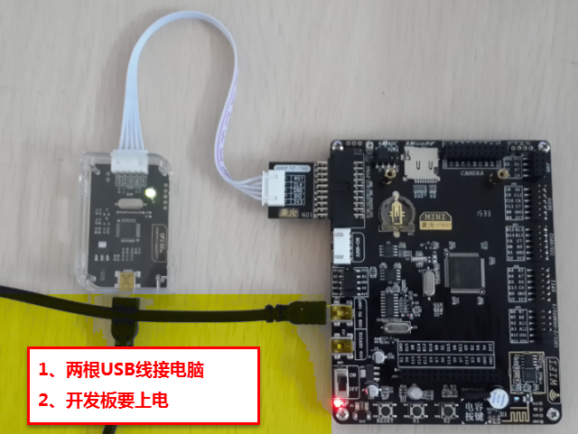
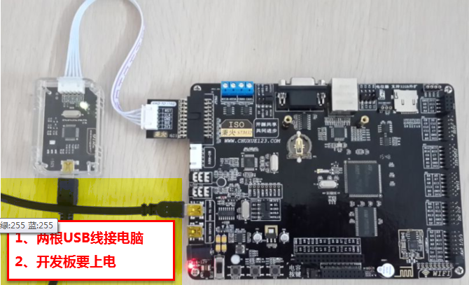
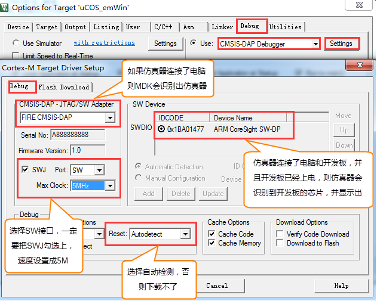
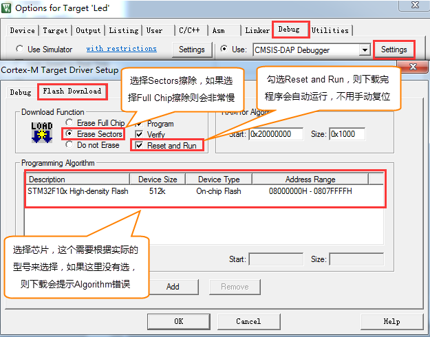
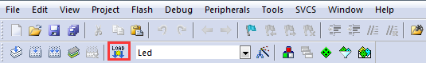
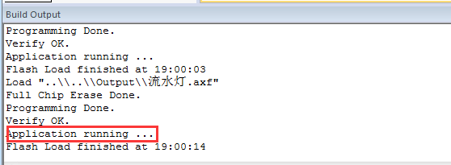

.. vim: syntax=rst

如何用DAP仿真器下载程序
-----------------------

仿真器简介
~~~~~~~~~~

本书配套的仿真器为Fire-Debugger，遵循ARM公司的CMSIS-DAP标准，支持所有基于Cortex-M内核的单片机，常见的M3、M4和M7都可以完美支持。

Fire-Debugger支持下载和在线仿真程序，支持XP/WIN7/WIN8/WIN10这四个操作系统，免驱，不需要安装驱动即可使用，支持KEIL和IAR直接下载，非常方便。

硬件连接
~~~~~~~~~~~~~~~~

把仿真器用USB线连接电脑，如果仿真器的灯亮则表示正常，可以使用。然后把仿真器的另外一端连接到开发板，给开发板上电，然后就可以通过软件KEIL或者IAR给开发板下载程序。

图 3‑1 仿真器与电脑和开发板连接方式

图 3‑2 仿真器与指南者连接图

图 3‑3 仿真器与指南者连接图

仿真器配置
~~~~~~~~~~

在仿真器连接好电脑和开发板且开发板供电正常的情况下，打开编译软件KEIL，在魔术棒选项卡里面选择仿真器的型号，具体过程看图示：

Debug选项配置
'''''''''''''
.. image:: media/image4.png
   :align: center
   :alt: image4

图 3‑4 Debug选择CMSIS-DAP Debugger

Utilities选项配置
'''''''''''''''''
.. image:: media/image5.png
   :align: center
   :alt: image5

图 3‑5 Utilities选择 Use Debug Driver

Debug Settings 选项配置
'''''''''''''''''''''''

图 3‑6 Debug Settings 选项配置

选择目标板
~~~~~~~~~~

选择目标板，具体选择多大的FLASH要根据板子上的芯片型号决定。野火STM32开发板的配置是：F1选512K，F4选1M。这里面有个小技巧就是把Reset
and
Run也勾选上，这样程序下载完之后就会自动运行，否则需要手动复位。擦除的FLASH大小选择Sectors即可，不要选择Full
Chip，不然下载会比较慢。

图 3‑7 选择目标板

下载程序
~~~~~~~~

如果前面步骤都成功了，接下来就可以把编译好的程序下载到开发板上运行。下载程序不需要其他额外的软件，直接点击KEIL中的LOAD按钮即可。

程序下载后，Build Output选项卡如果打印出 Application
running…则表示程序下载成功。如果没有出现实验现象，按复位键试试。

