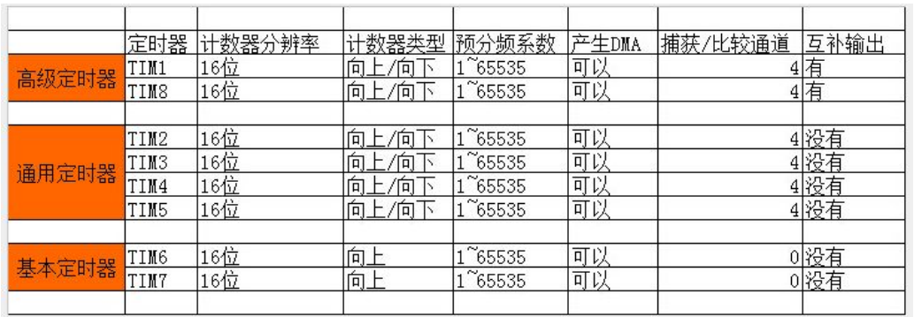

TIM—基本定时器
--------------

本章参考资料：《STM32F10X-中文参考手册》
基本定时器章节。学习本章时，配合参考资料一起阅读，效果会更佳，特别是涉及到寄存器说明的部分。

定时器分类
~~~~~~~~~~

| STM32F1 系列中，除了互联型的产品，共有 8
  个定时器，分为基本定时器，通用定时
| 器和高级定时器。基本定时器 TIM6 和 TIM7 是一个 16
  位的只能向上计数的定时器，只能定时，没有外部 IO。通用定时器 TIM2/3/4/5
  是一个 16
  位的可以向上/下计数的定时器，可以定时，可以输出比较，可以输入捕捉，每个定时器有四个外部
  IO。高级定时器 TIM1/8是一个 16
  位的可以向上/下计数的定时器，可以定时，可以输出比较，可以输入捕捉，还可以有三相电机互补输出信号，每个定时器有
  8 个外部 IO。更加具体的分类详情见 图30_1_。

图 30‑1 定时器分类

基本定时器功能框图讲解
~~~~~~~~~~~~~~~~~~~~~~

基本定时器的核心是时基，不仅基本定时器有，通用定时器和高级定时器也有。学习定时器时，我们先从简单的基本定时器学起，到了后面
的通用和高级定时器的学习中，我们直接跳过时基部分的讲解即可。基本定时器的功能框图见 图30_2_。

图 30‑2 基本定时器功能框图

①时钟源
'''''''

| 定时器时钟 TIMxCLK，即内部时钟 CK_INT，经 APB1
  预分频器后分频提供，如果
| APB1 预分频系数等于 1，则频率不变，否则频率乘以 2，库函数中 APB1
  预分频的系数是2，即 PCLK1=36M，所以定时器时钟 TIMxCLK=36*2=72M。

②计数器时钟
'''''''''''

| 定时器时钟经过 PSC 预分频器之后，即 CK_CNT，用来驱动计数器计数。PSC
  是一个
| 16 位的预分频器，可以对定时器时钟 TIMxCLK 进行 1~65536
  之间的任何一个数进行分频。具体计算方式为：CK_CNT=TIMxCLK/(PSC+1)。

③计数器
'''''''

| 计数器 CNT 是一个 16 位的计数器，只能往上计数，最大计数值为
  65535。当计数达
| 到自动重装载寄存器的时候产生更新事件，并清零从头开始计数。

④自动重装载寄存器
'''''''''''''''''

| 自动重装载寄存器 ARR 是一个 16
  位的寄存器，这里面装着计数器能计数的最大数
| 值。当计数到这个值的时候，如果使能了中断的话，定时器就产生溢出中断。

定时时间的计算
''''''''''''''

| 定时器的定时时间等于计数器的中断周期乘以中断的次数。计数器在 CK_CNT
  的驱动
| 下，计一个数的时间则是 CK_CLK
  的倒数，等于：1/（TIMxCLK/(PSC+1)），产生一次中断的时间则等于：1/（CK_CLK
  \* ARR）。如果在中断服务程序里面设置一个变量
  time，用来记录中断的次数，那么就可以计算出我们需要的定时时间等于：1/CK_CLK
  \* (ARR+1)*time。

定时器初始化结构体详解
~~~~~~~~~~~~~~~~~~~~~~

在HAL库函数头文件stm32f1xx_hal_tim.h中对定时器外设建立了四个初始化结构体，基本定时器只用到其中一个即TIM_TimeBaseInitTypeDef，具体的见
代码清单30_1_ ，其他三个我们在高级定时器章节讲解。

.. code-block:: c
   :caption: 代码清单 30‑1 定时器基本初始化结构体
   :name: 代码清单30_1

    typedef struct {
        uint32_t Prescaler;          // 预分频器
        uint32_t CounterMode;        // 计数模式
        uint32_t Period;             // 定时器周期
        uint32_t ClockDivision;      // 时钟分频
        uint32_t RepetitionCounter;   // 重复计算器
    } TIM_TimeBaseInitTypeDef;

(1) Prescaler：定时器预分频器设置，时钟源经该预分频器才是定时器时钟，它设定
    TIMx_PSC寄存器的值。可设置范围为0至65535，实现1至65536分频。

(2) CounterMode：定时器计数方式，可是在为向上计数、向下计数以及三种中心对齐模
    式。基本定时器只能是向上计数，即TIMx_CNT只能从0开始递增，并且无需初始化。

(3) Period：定时器周期，实际就是设定自动重载寄存器的值，在事件生成时更新到影子寄存器。可设置范围为0至65535。

(4) ClockDivision：时钟分频，设置定时器时钟CK_INT频率与数字滤波器采样时钟频率分频比，基本定时器没有此功能，不用设置。

(5) RepetitionCounter：重复计数器，属于高级控制寄存器专用寄存器位，利用它可以非常容易控制输出PWM的个数。这里不用设置。

虽然定时器基本初始化结构体有5个成员，但对于基本定时器只需设置其中两个就可以，想想使用基本定时器就是简单。

基本定时器定时实验
~~~~~~~~~~~~~~~~~~

硬件设计
'''''''''''''

本实验利用基本定时器 TIM6/7 定时 1s，1s 时间到 LED
翻转一次。基本定时器是单片机内部的资源，没有外部
IO，不需要接外部电路，现只需要一个 LED 即可。

软件设计
'''''''''''''

这里只讲解核心的部分代码，有些变量的设置，头文件的包含等并没有涉及到，完整的代码请参考本章配套的工程。我们编写两个定时器驱动文件，bsp_TiMbase.h
和 bsp_TiMbase.h，用来配置定时器中断优先级和和初始化定时器。

编程要点
............

(1) 开定时器时钟 TIMx_CLK, x[6,7]；

(2) 初始化时基初始化结构体；

(3) 使能 TIMx, x[6,7] update 中断；

(4) 打开定时器；

(5) 编写中断服务程序

| 通用定时器和高级定时器的定时编程要点跟基本定时器差不多，只是还要再选择下计
| 数器的计数模式，是向上还是向下。因为基本定时器只能向上计数，且没有配置计数模式
| 的寄存器，默认是向上。

软件分析
............

基本定时器宏定义
===================

.. code-block:: c
   :caption: 代码清单 30‑2 宏定义
   :name: 代码清单30_2

    #define BASIC_TIM TIM6
    #define BASIC_TIM_CLK_ENABLE() __TIM6_CLK_ENABLE()

    #define BASIC_TIM_IRQn TIM6_DAC_IRQn
    #define BASIC_TIM_IRQHandler TIM6_DAC_IRQHandler

使用宏定义非常方便程序升级、移植。

基本定时器配置
===================

.. code-block:: c
   :caption: 代码清单 30‑3 基本定时器模式配置
   :name: 代码清单30_3

    void BASIC_TIMx_Init(void)
    {
        TIM_MasterConfigTypeDef sMasterConfig;

        htimx.Instance = BASIC_TIMx;
        htimx.Init.Prescaler = BASIC_TIMx_PRESCALER;
        htimx.Init.CounterMode = TIM_COUNTERMODE_UP;
        htimx.Init.Period = BASIC_TIMx_PERIOD;
        HAL_TIM_Base_Init(&htimx);

        sMasterConfig.MasterOutputTrigger = TIM_TRGO_RESET;
        sMasterConfig.MasterSlaveMode = TIM_MASTERSLAVEMODE_DISABLE;
        HAL_TIMEx_MasterConfigSynchronization(&htimx, &sMasterConfig);
    }

定时器中断优先级配置
======================

.. code-block:: c

    // 中断优先级配置
    void BASIC_TIM_NVIC_Config(void)
    {
        NVIC_InitTypeDef NVIC_InitStructure;
        // 设置中断组为0
        NVIC_PriorityGroupConfig(NVIC_PriorityGroup_0);
        // 设置中断来源
        NVIC_InitStructure.NVIC_IRQChannel = BASIC_TIM_IRQ ;
        // 设置主优先级为 0
        NVIC_InitStructure.NVIC_IRQChannelPreemptionPriority = 0;
        // 设置抢占优先级为3
        NVIC_InitStructure.NVIC_IRQChannelSubPriority = 3;
        NVIC_InitStructure.NVIC_IRQChannelCmd = ENABLE;
        NVIC_Init(&NVIC_InitStructure);
    }

我们设置中断分组为 0，主优先级为 0，抢占优先级为 3。

定时器中断服务程序
=====================

.. code-block:: c

    void  BASIC_TIM_IRQHandler (void)
    {
        if ( TIM_GetITStatus( BASIC_TIM, TIM_IT_Update) != RESET ) {
            time++;
            TIM_ClearITPendingBit(BASIC_TIM , TIM_FLAG_Update);
        }
    }

定时器中断一次的时间是 1ms，我们定义一个全局变量
time，每当进一次中断的时候，让time
来记录进入中断的次数。如果我们想实现一个 1s 的定时，我们只需要判断 time
是否等于 1000 即可，1000 个 1ms 就是 1s。然后把 time 清
0，重新计数，以此循环往复。在中断服务程序的最后，要把相应的中断标志位清除掉，切记。

主函数
===============

.. code-block:: c

    void  BASIC_TIM_IRQHandler (void)
    {
        HAL_TIM_IRQHandler(&TIM_TimeBaseStructure);
    }
    void HAL_TIM_PeriodElapsedCallback(TIM_HandleTypeDef *htim)
    {
        if (htim==(&TIM_TimeBaseStructure)) {
            LED1_TOGGLE;  //红灯周期闪烁
        }
    }

我们在TIM_Mode_Config函数启动了定时器更新中断，在发生中断时，中断服务函数就得到运行。在服务函数内直接调用库函数HAL_TIM_IRQHandler函数，它会产生一个中断回调函数HAL_TIM_PeriodElapsedCallback，用来添加用户代码，确定是TIM6产生中断后才运行RGB彩灯翻转动作。

下载验证
'''''''''''''

把编写好的程序下载到开发板，可以看到 LED1 以 1s 的频率闪烁一次。

