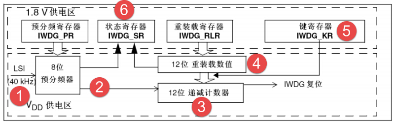

IWDG—独立看门狗
---------------

本章参考资料：《STM32F10X-中文参考手册》IWDG章节。

学习本章时，配合《STM32F10X-中文参考手册》IWDG章节一起阅读，效果会更佳，特别是涉及到寄存器说明的部分。

IWDG简介
~~~~~~~~

STM32有两个看门狗，一个是独立看门狗另外一个是窗口看门狗，独立看门狗号称宠物狗，窗口看门狗号称警犬，本章我们主要分析独立看门狗的功能框图和它的应用。独立看门狗用通俗一点的话来解释就是一个12位的递减计数器，当计数器的值从某个值一直减到0的时候，系统就会产生一个复位信号，即IWDG_RESET。如果在计数没减到0之前，刷新了计数器的值的话，那么就不会产生复位信号，这个动作就是我们经常说的喂狗。看门狗功能由
VDD 电压域供电，在停止模式和待机模式下仍能工作。

IWDG功能框图剖析
~~~~~~~~~~~~~~~~

图 33‑1 IWDG功能框图

①独立看门狗时钟
'''''''''''''''

| 独立看门狗的时钟由独立的RC振荡器LSI提供，即使主时钟发生故障它仍然有效，非常独立。LSI的频率一般在30~60KHZ之
  间，根据温度和工作场合会有一定的漂移，我们一般取40KHZ，所以独立看门狗的定时时间并一定非常精确，只适用于对时间精度
| 要求比较低的场合。

②计数器时钟
'''''''''''

递减计数器的时钟由LSI经过一个8位的预分频器得到，我们可以操作预分频器寄存器IWDG_PR来设置分频因子，分频因子可以是：[4,8,16,32,64,128,256,256]，计数器时钟CK_CNT=
40/ 4*2^PRV，一个计数器时钟计数器就减一。

③计数器
'''''''

独立看门狗的计数器是一个12位的递减计数器，最大值为0XFFF，当计数器减到0时，会产生一个复位信号:IWDG_RESET，让程序重新启动运行，如果在计数器减到0之前刷新了计数器的值的话，就不会产生复位信号，重新刷新计数器值的这个动作我们俗称喂狗。

④重装载寄存器
'''''''''''''

重装载寄存器是一个12位的寄存器，里面装着要刷新到计数器的值，这个值的大小决定着独立看门狗的溢出时间。超时时间Tout
= (4*2^prv) / 40 * rlv (s)
，prv是预分频器寄存器的值，rlv是重装载寄存器的值。

⑤键寄存器
'''''''''

键寄存器IWDG_KR可以说是独立看门狗的一个控制寄存器，主要有三种控制方式，往这个寄存器写入下面三个不同的值有不同的效果。

表格 33‑1 键寄存器取值枚举

====== =======================
键值   键值作用
0XAAAA 把RLR的值重装载到CNT
0X5555 PR和RLR这两个寄存器可写
0XCCCC 启动IWDG
====== =======================

通过写往键寄存器写0XCCC来启动看门狗是属于软件启动的方式，一旦独立看门狗启动，它就关不掉，只有复位才能关掉。

⑥状态寄存器
'''''''''''

状态寄存器SR只有位0：PVU和位1：RVU有效，这两位只能由硬件操作，软件操作不了。RVU：看门狗计数器重装载值更新，硬件置1表示重装载值的更新正在进行中，更新完毕之后由硬件清0。PVU:
看门狗预分频值更新，硬件置’1’指示预分频值的更新正在进行中，当更新完成后，由硬件清0。所以只有当RVU/PVU等于0的时候才可以更新重装载寄存器/预分频寄存器。

怎么用IWDG
~~~~~~~~~~

独立看门狗一般用来检测和解决由程序引起的故障，比如一个程序正常运行的时间是50ms，在运行完这个段程序之后紧接着进行喂狗，我们设置独立看门狗的定时溢出时间为60ms，比我们需要监控的程序50ms多一点，如果超过60ms还没有喂狗，那就说明我们监控的程序出故障了，跑飞了，那么就会产生系统复位，让程序重新运行。

IWDG超时实验
~~~~~~~~~~~~

硬件设计
''''''''''''

1. IWDG一个

2. 按键一个

3. LED一个

IWDG属于单片机内部资源，不需要外部电路，需要一个外部的按键和LED，通过按键来喂狗，喂狗成功LED亮，喂狗失败，程序重启，LED灭一次。

软件设计
''''''''''''

我们编写两个 IWDG驱动文件，bsp_iwdg.h 和
bsp_iwdg.c，用来存放IWDG的初始化配置函数。

代码分析
............

这里只讲解核心的部分代码，有些变量的设置，头文件的包含等并没有涉及到，完整的代码请参考本章配套的工程。

IWDG配置函数
==============

.. code-block:: c
   :caption: 代码 33‑1 IWDG配置函数
   :name: 代码清单33_1

    void IWDG_Config(uint8_t prv ,uint16_t rlv)
    {
        // 使能 预分频寄存器PR和重装载寄存器RLR可写
        IWDG_Handle.Instance = IWDG;

        // 设置预分频器值
        IWDG_SetPrescaler = prv;

        // 设置重装载寄存器值
        IWDG_SetReload = rlv;

        // 初始化 IWDG
        HAL_IWDG_Init(&IWDG_Handle);

        // 启动 IWDG
        __HAL_IWDG_START(&IWDG_Handle);
    }

IWDG配置函数有两个形参，prv用来设置预分频的值，取值可以是：

.. code-block:: c
   :caption: 代码 33‑2 形参 prv 取值
   :name: 代码清单33_2

    /*
    *     @arg IWDG_Prescaler_4:    IWDG prescaler set to 4
    *     @arg IWDG_Prescaler_8:    IWDG prescaler set to 8
    *     @arg IWDG_Prescaler_16:   IWDG prescaler set to 16
    *     @arg IWDG_Prescaler_32:   IWDG prescaler set to 32
    *     @arg IWDG_Prescaler_64:   IWDG prescaler set to 64
    *     @arg IWDG_Prescaler_128:  IWDG prescaler set to 128
    *     @arg IWDG_Prescaler_256:  IWDG prescaler set to 256
    */

这些宏在stm32f4xx_hal_iwdg.h中定义，宏展开是8位的16进制数，具体作用是配置配置预分频寄存器IWDG_PR，获得各种分频系数。形参rlv用来设置重装载寄存器IWDG_RLR的值，取值范围为0~0XFFF。溢出时间Tout
= prv/40 * rlv
(s)，prv可以是[4,8,16,32,64,128,256]。如果我们需要设置1s的超时溢出，prv可以取IWDG\_
PRESCALER _64，rlv取625，即调用:IWDG_Config(IWDG_Prescaler_64
,625)。Tout=64/40*625=1s。

喂狗函数
==============

.. code-block:: c
   :caption: 代码 33‑3 喂狗函数
   :name: 代码清单33_3

    void IWDG_Feed(void)
    {
        // 把重装载寄存器的值放到计数器中，喂狗，防止IWDG复位
        // 当计数器的值减到0的时候会产生系统复位
        HAL_IWDG_Refresh(&IWDG_Handle);
    }

主函数
==============

.. code-block:: c
   :caption: 代码清单 33‑4
   :name: 代码清单33_4

    int main(void)
    {
        /* 系统时钟初始化成72 MHz */
        SystemClock_Config();
        /* LED 端口初始化 */
        LED_GPIO_Config();

        HAL_Delay(1000);
        /* 检查是否为独立看门狗复位 */
        if (__HAL_RCC_GET_FLAG(RCC_FLAG_IWDGRST) != RESET) {
            /* 独立看门狗复位 */
            /*  亮红灯 */
            LED_RED;

            /* 清除标志 */
            __HAL_RCC_CLEAR_RESET_FLAGS();

            /*如果一直不喂狗，会一直复位，加上前面的延时，会看到红灯闪烁
            在1s 时间内喂狗的话，则会持续亮绿灯*/
        } else {
            /*不是独立看门狗复位(可能为上电复位或者手动按键复位之类的) */
            /* 亮蓝灯 */
            LED_BLUE;
        }

        /*初始化按键*/
        Key_GPIO_Config();

        // IWDG 1s 超时溢出
        IWDG_Config(IWDG_PRESCALER_64 ,625);

        //while部分是我们在项目中具体需要写的代码，这部分的程序可以用独立看门狗来监控
        //如果我们知道这部分代码的执行时间，比如是500ms，那么我们可以设置独立看门狗的
        //溢出时间是600ms，比500ms多一点，如果要被监控的程序没有跑飞正常执行的话，那么
        //执行完毕之后就会执行喂狗的程序，如果程序跑飞了那程序就会超时，到达不了喂狗的
        //程序，此时就会产生系统复位。但是也不排除程序跑飞了又跑回来了，刚好喂狗了，
        //歪打正着。所以要想更精确的监控程序，可以使用窗口看门狗，窗口看门狗规定必须
        //在规定的窗口时间内喂狗。
        while (1) {
            if ( Key_Scan(KEY1_GPIO_PORT,KEY1_PIN) == KEY_ON  ) {
                // 喂狗，如果不喂狗，系统则会复位，复位后亮红灯，如果在1s
                // 时间内准时喂狗的话，则会亮绿灯
                IWDG_Feed();
                //喂狗后亮绿灯
                LED_GREEN;
            }

        }
    }

主函数中我们初始化好系统时钟、LED和按键相关的配置，设置IWDG 1s
超时溢出之后，进入while死循环，通过按键来喂狗，如果喂狗成功，则亮绿灯，如果喂狗失败的话，系统重启，程序重新执行，当执行到__HAL_RCC_GET_FLAG函数的时候，则会检测到是IWDG复位，然后让红灯亮。如果喂狗一直失败的话，则会一直产生系统复位，加上前面延时的效果，则会看到红灯一直闪烁。

我们这里是通过按键来模拟一个喂狗程序，真正的项目中则不是这样使用。while部分是我们在项目中具体需要写的代码，这部分的程序可以用独立看门狗来监控，如果我们知道这部分代码的执行时间，比如是500ms，那么我们可以设置独立看门狗的溢出时间是510ms，比500ms多一点，如果要被监控的程序没有跑飞正常执行的话，那么执行完毕之后就会执行喂狗的程序，如果程序跑飞了那程序就会超时，到达不了喂狗的程序，此时就会产生系统复位，但是也不排除程序跑飞了又跑回来了，刚好喂狗了，歪打正着。所以要想更精确的监控程序，可以使用窗口看门狗，窗口看门狗规定必须在规定的窗口时间内喂狗，早了不行，晚了也不行。

下载验证
''''''''''''

把编译好的程序下载到开发板，在1s的时间内通过按键来不断的喂狗，如果喂狗失败，红灯闪烁。如果一直喂狗成功，则绿灯常亮。

