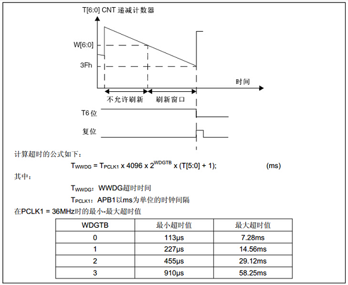

WWDG—窗口看门狗
---------------

本章参考资料：《STM32F10X-中文参考手册》WWDG章节。

学习本章时，配合《STM32F10X-中文参考手册》WWDG章节一起阅读，效果会更佳，特别是涉及到寄存器说明的部分。

WWDG简介
~~~~~~~~

STM32有两个看门狗，一个是独立看门狗，一个是窗口看门狗。我们知道独立看门狗的工作原理就是一个递减计数器不断的往下递减计数，当减到0之前如果没有喂狗的话，产生复位。窗口看门狗跟独立看门狗一样，也是一个递减计数器不断的往下递减计数，当减到一个固定值0X40时还不喂狗的话，产生复位，这个值叫窗口的下限，是固定的值，不能改变。这个是跟独立看门狗类似的地方，不同的地方是窗口看门狗的计数器的值在减到某一个数之前喂狗的话也会产生复位，这个值叫窗口的上限，上限值由用户独立设置。窗口看门狗计数器的值必须在上窗口和下窗口之间才可以喂狗，这就是窗口看门狗中窗口两个字的含义

图 34‑1 IWDG与WWDG区别

RLR是重装载寄存器，用来设置独立看门狗的计数器的值。TR是窗口看门狗的计数器的值，由用户独立设置，WR是窗口看门狗的上窗口值，由用户独立设置。

WWDG功能框图剖析
~~~~~~~~~~~~~~~~

图 34‑2 窗口看门狗功能框图

①窗口看门狗时钟
'''''''''''''''

窗口看门狗时钟来自PCLK1，PCLK1最大是36M，由RCC时钟控制器开启。

②计数器时钟
'''''''''''

| 计数器时钟由CK计时器时钟经过预分频器分频得到，分频系数由配置寄存器CFR的位8:7  WDGTB[1:0]配置，可以是[0,1,2,3]，其中CK计
  时器时钟=PCLK1/4096，除以4096是手册规定的，没有为什么。所以计数器的时钟CNT_CK=PCLK1/4096/(2^WDGTB)，
| 这就可以算出计数器减一个数的时间T= 1/CNT_CK = Tpclk1 * 4096 *
  (2^WDGTB)。

③计数器
'''''''

| 窗口看门狗的计数器是一个递减计数器，共有7位，其值存在控制寄存器CR的位6:0，即T[6:0]，当7个位全部为1时是0X7F，这个是最大值，当递减到T6位变成0时，即从0X40变为0X3F时候，会产生看门狗复位。这个值0X40是看门狗能够递减到的最小值，所以计数器的值只能是：0X40~0X7F之间，实际上真正用来计数的是T[5:0]。当递减计数器递减到0X40的时候，还不会马上产生复位，如果使能了提前唤醒中断：CFR位9
  EWI
  置1，则产生提前唤醒中断，如果真进入了这个中断的话，就说明程序肯定是出问题了，
| 那么在中断服务程序里面我们就需要做最重要的工作，比如保存重要数据，或者报警等，这个中断我们也叫它死前中断。

④窗口值
'''''''

我们知道窗口看门狗必须在计数器的值在一个范围内才可以喂狗，其中下窗口的值是固定的0X40，上窗口的值可以改变，具体的由配置寄存器CFR的位6:0
W[6:0]设置。其值必须大于0X40，如果小于或者等于0X40就是失去了窗口的价值，而且也不能大于计数器的值，所以必须得小于0X7F。那窗口值具体要设置成多大？这个得根据我们需要监控的程序的运行时间来决定。如果我们要监控的程序段A运行的时间为Ta，当执行完这段程序之后就要进行喂狗，如果在窗口时间内没有喂狗的话，那程序就肯定是出问题了。一般计数器的值TR设置成最大0X7F，窗口值为WR，计数器减一个数的时间为T，那么时间：(TR-WR)*T应该稍微大于Ta即可，这样就能做到刚执行完程序段A之后喂狗，起到监控的作用，这样也就可以算出WR的值是多少。

⑤计算看门狗超时时间
'''''''''''''''''''

图 34‑3 窗口看门狗时序图

这个图来自数据手册，从图我们知道看门狗超时时间：Twwdg = Tpclk1 x 4096 x
2^wdgtb x (T[5:0] + 1) ms，当PCLK1 =
36MHZ时，WDGTB取不同的值时有最小和最大的超时时间，那这个最小和最大的超时时间该怎么理解，又是怎么算出来的？
讲起来有点绕，这里我稍微讲解下WDGTB=0时是怎么算的。递减计数器有7位T[6:0]
，当位6变为0的时候就会产生复位，实际上有效的计数位是T[5:0]，而且T6必须先设置为1。如果T[5:0]=0时，递减计数器再减一次，就产生复位了，那这减一的时间就等于计数器的周期=1/CNT_CK
= Tpclk1 * 4096 * (2^WDGTB) = 1/36 * 4096 \*2^0 =
113.7us，这个就是最短的超时时间。如果T[5:0]全部装满为1，即63，当他减到0X40变成0X3F时，所需的时间就是最大的超时时间=113.7*2^5=113.7*64=7.2768ms。同理，当WDGTB等于1/2/3时，代入公式即可。

怎么用WWDG
~~~~~~~~~~

WWDG一般被用来监测，由外部干扰或不可预见的逻辑条件造成的应用程序背离正常的运行序列而产生的软件故障。比如一个程序段正常运行的时间是50ms，在运行完这个段程序之后紧接着进行喂狗，如果在规定的时间窗口内还没有喂狗，那就说明我们监控的程序出故障了，跑飞了，那么就会产生系统复位，让程序重新运行。

WWDG喂狗实验
~~~~~~~~~~~~

硬件设计
''''''''''''''

1. WWDG一个

2. LED两个

WWDG属于单片机内部资源，不需要外部电路，需要两个LED来指示程序的运行状态。

软件设计
''''''''''''''

我们编写两个 WWDG驱动文件，bsp_wwdg.h 和
bsp_wwdg.c，用来存放WWDG的初始化配置函数。

代码分析
============

这里只讲解核心的部分代码，有些变量的设置，头文件的包含等并没有涉及到，完整的代码请参考本章配套的工程。

WWDG配置函数
============

.. code-block:: c
   :caption: 代码 34‑1 WWDG配置函数
   :name: 代码清单34_1

    void WWDG_Config(uint8_t tr, uint8_t wr, uint32_t prv)
    {
        // 开启 WWDG 时钟
        __HAL_RCC_WWDG_CLK_ENABLE();
        // 配置WWDG中断优先级
        WWDG_NVIC_Config();
        // 配置WWDG句柄即寄存器基地址
        WWDG_Handle.Instance = WWDG;
        // 设置预分频器值
        WWDG_Handle.Init.Prescaler = prv;
        // 设置上窗口值
        WWDG_Handle.Init.Window = wr;
        // 设置计数器的值
        WWDG_Handle.Init.Counter = tr;
        // 使能提前唤醒中断
        WWDG_Handle.Init.EWIMode = WWDG_EWI_ENABLE;
        // 初始化WWDG
        HAL_WWDG_Init(&WWDG_Handle);
    }

WWDG配置函数有三个形参，tr是计数器的值，一般我们设置成最大0X7F，wr是上窗口的值，这个我们要根据监控的程序的运行时间来设置，但是值必须在0X40和计数器的值之间，prv用来设置预分频的值，取值可以是：

.. code-block:: c
   :caption: 代码 34‑2 形参 prv 取值
   :name: 代码清单34_2

    /*
    *     @arg WWDG_Prescaler_1: WWDG counter clock = (PCLK1/4096)/1
    *     @arg WWDG_Prescaler_2: WWDG counter clock = (PCLK1/4096)/2
    *     @arg WWDG_Prescaler_4: WWDG counter clock = (PCLK1/4096)/4
    *     @arg WWDG_Prescaler_8: WWDG counter clock = (PCLK1/4096)/8
    */

这些宏在stm32f4xx_hal_wwdg.h中定义，宏展开是32位的16进制数，具体作用是设置配置寄存器CFR的位8:7
WDGTB[1:0]，获得各种分频系数。

WWDG中断优先级函数
========================

.. code-block:: c

    // WWDG 中断优先级初始化
    static void WWDG_NVIC_Config(void)
    {
        HAL_NVIC_SetPriority(WWDG_IRQn,0,0);
        HAL_NVIC_EnableIRQ(WWDG_IRQn);
    }

在递减计数器减到0X40的时候，我们开启了提前唤醒中断，这个中断我们称它为死前中断或者叫遗嘱中断，在中断函数里面我们应该出来最重要的事情，而且必须得快，因为递减计数器再减一次，就会产生系统复位。

提前唤醒中断复位程序
========================

.. code-block:: c
   :caption: 代码 34‑3 提前唤醒中断服务程序
   :name: 代码清单34_3

    // WWDG 中断服务程序，如果发生了此中断，表示程序已经出现了故障，
    // 这是一个死前中断。在此中断服务程序中应该干最重要的事，
    // 比如保存重要的数据等
    void WWDG_IRQHandler(void)
    {
        //WWDG 中断服务处理函数，用户代码在提前唤醒中断回调函数数中添加
        HAL_WWDG_IRQHandler(&WWDG_Handle);
    }

    void HAL_WWDG_EarlyWakeupCallback(WWDG_HandleTypeDef* hwwdg)
    {
        //黄灯亮，点亮LED只是示意性的操作，
        //真正使用的时候，这里应该是做最重要的事情
        LED_YELLOW;
    }

喂狗函数
========================

.. code-block:: c
   :caption: 代码 34‑4 喂狗函数
   :name: 代码清单34_4

    // 喂狗
    void WWDG_Feed(void)
    {
        // 喂狗，刷新递减计数器的值，设置成最大WDG_CNT=0X7F
        HAL_WWDG_Refresh(&WWDG_Handle);
    }

喂狗就是重新刷新递减计数器的值防止系统复位，喂狗一般是在主函数中喂。

主函数
============

.. code-block:: c
   :caption: 代码 34‑5 主函数
   :name: 代码清单34_5

    int main(void)
    {
        uint8_t wwdg_tr, wwdg_wr;
        /* 系统时钟初始化成72MHz */
        SystemClock_Config();
        /* LED 端口初始化 */
        LED_GPIO_Config();

        //检查窗口看门狗复位标志位
        if (__HAL_RCC_GET_FLAG(RCC_FLAG_WWDGRST) != RESET) {
            // 看门狗复位启动，红色灯亮
            LED_RED;

            //清除复位标志位
            __HAL_RCC_CLEAR_RESET_FLAGS();
        } else {
            // 正常启动，蓝色灯亮
            LED_BLUE;
        }
        HAL_Delay(500);
        LED_RGBOFF;
        HAL_Delay(500);

        // WWDG配置
        // 初始化WWDG：配置计数器初始值，配置上窗口值，启动WWDG，使能提前唤醒中断
        WWDG_Config(127,80,WWDG_PRESCALER_8);

        // 窗口值我们在初始化的时候设置成0X5F，这个值不会改变
        wwdg_wr = WWDG->CFR & 0X7F;

        while (1) {
            //-----------------------------------------------------
            // 这部分应该写需要被WWDG监控的程序，这段程序运行行的时间
            // 决定了窗口值应该设置成多大。
            //-----------------------------------------------------
            // 计时器值，初始化成最大0X7F，当开启WWDG时候，这个值会不断减小
            // 当计数器的值大于窗口值时喂狗的话，会复位，当计数器减少到0X40
            // 还没有喂狗的话就非常非常危险了，计数器再减一次到了0X3F时就复位
            // 所以要当计数器的值在窗口值和0X40之间的时候喂狗，其中0X40是固定的。
            wwdg_tr = WWDG->CR & 0X7F;
            if ( wwdg_tr == wwdg_wr) {
                // 喂狗，重新设置计数器的值为最大0X7F
                WWDG_Feed();
                // 正常喂狗，绿色灯闪烁
                LED2_TOGGLE;
            }
        }
    }

主函数中我们把WWDG的计数器的值设置
为0X7F，上窗口值设置为0X5F，分频系数为8分频。在while死循环中，我们不断读取计数器的值，当计数器的值减小到小于上窗口值的时候，我们喂狗，让计数器重新计数。

在while死循环中，一般是我们需要监控的程序，这部分代码的运行时间，决定了上窗口值应该设置为多少，当监控的程序运行完毕之后，我们需要执行喂狗程序，比起独立看门狗，这个喂狗的窗口时间是非常短的，对时间要求很精确。如果没有在这个窗口时间内喂狗的话，那就说明程序出故障了，会产生提前唤醒中断，最后系统复位。

下载验证
^^^^^^^^

把编译好的程序下载到开发板，LED_BLUE被点亮，一段时间之后熄灭，之后LED_BLUE一直就没有被点亮过，说明系统没有产生复位，如果产生复位的话LED_BLUE会再被点亮一次。中断服务程序中的LED_YELLOW也没被点亮过，LED_GREEN闪烁，说明喂狗正常。
