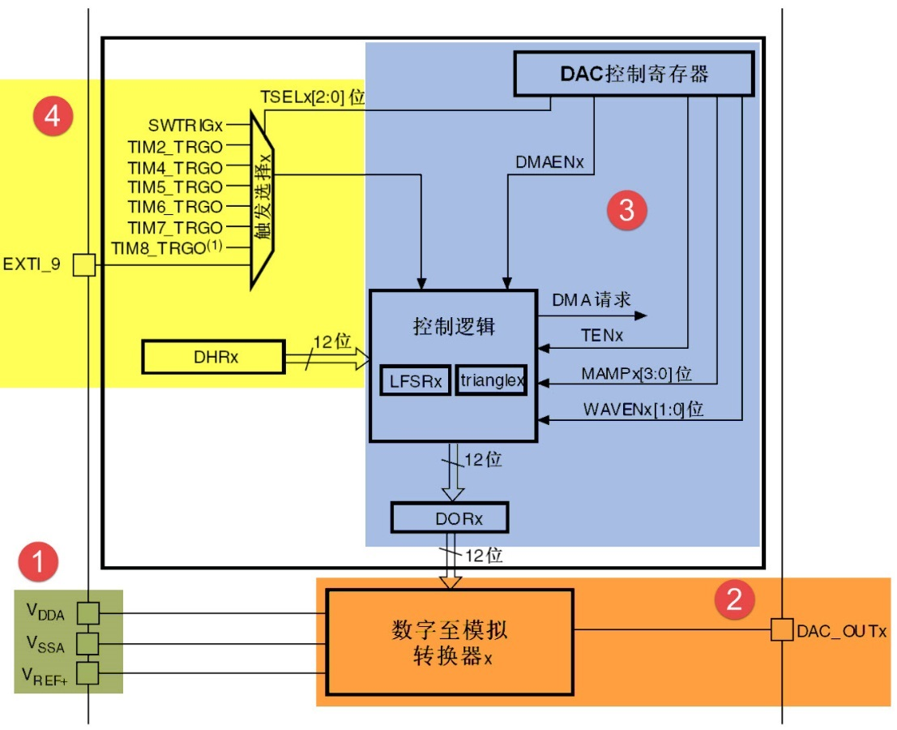
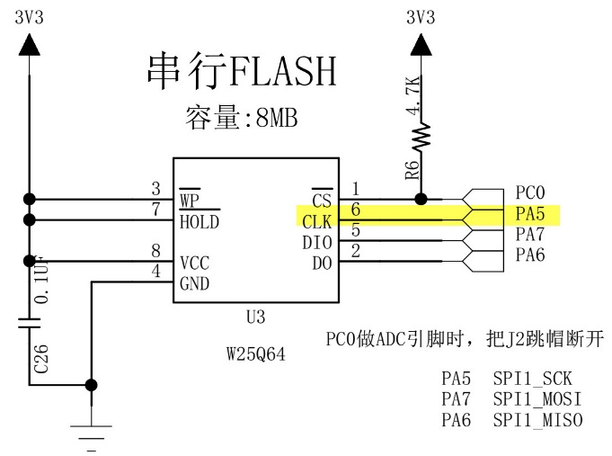
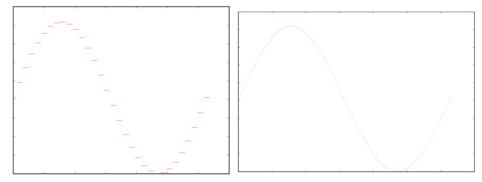
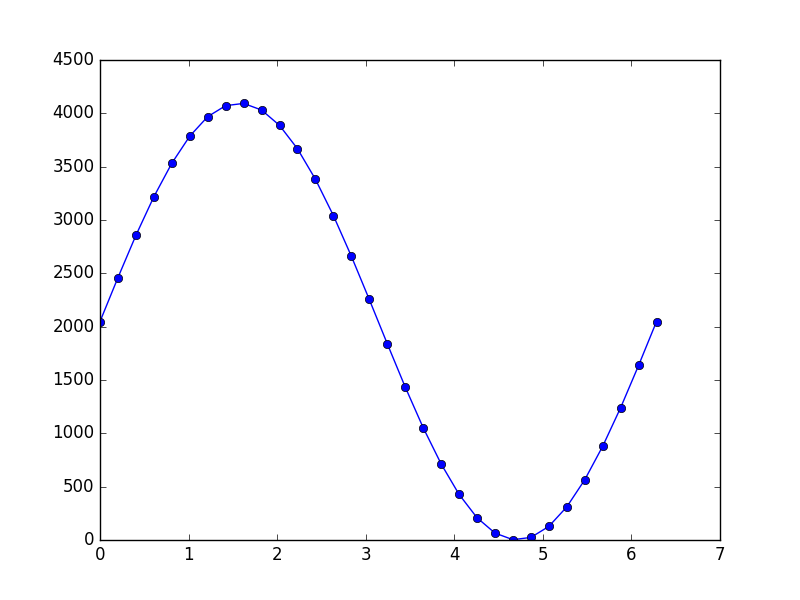
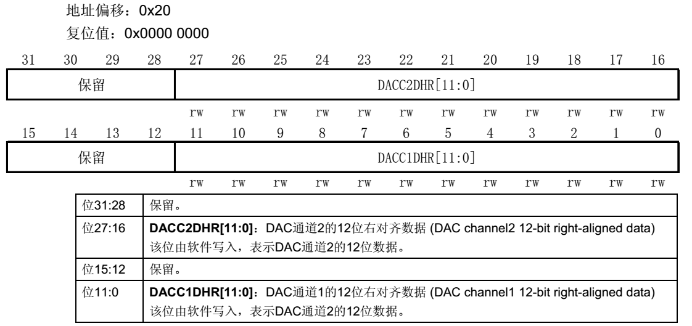
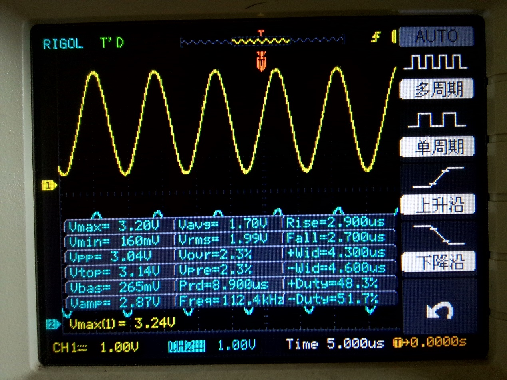

DAC—输出正弦波
--------------

本章参考资料：《STM32F10X-中文参考手册》DAC章节。

学习本章时，配合《STM32F10X-中文参考手册》DAC章节一起阅读，效果会更佳，特别是涉及到寄存器说明的部分。

DAC简介
~~~~~~~

DAC为数字/模拟转换模块，故名思议，它的作用就是把输入的数字编码，转换成对应的模拟电压输出，它的功能与ADC相反。在常见的数字信号系统中，大部分传感器信号被化成电压信号，而ADC把电压模拟信号转换成易于计算机存储、处理的数字编码，由计算机处理完成后，再由DAC输出电压模拟信号，该电压模拟信号常常用来驱动某些执行器件，使人类易于感知。如音频信号的采集及还原就是这样一个过程。

STM32具有片上DAC外设，它的分辨率可配置为8位或12位的数字输入信号，具有两个DAC输出通道，这两个通道互不影响，每个通道都可以使用DMA功能，都具有出错检测能力，可外部触发。

DAC功能框图剖析
~~~~~~~~~~~~~~~

STM32的DAC模块框图见 图37_1_。

图 37‑1 DAC功能框图

整个DAC模块围绕框图下方的“数字至模拟转换器x”展开，它的左边分别是参考电源的引
脚：\ :math:`V_{\text{DDA}}`\ 、\ :math:`V_{\text{SSA}}`\
及\ :math:`V_{ref +}`\ ，其中STM32的DAC规定了它的参考电压\ :math:`V_{ref +}`\ 输入范围
为2.4——3.3V。“数字至模拟转换器x”的输入为DAC的数据寄存器“DORx”的数字编码，经过它转换得的模拟信号由图中右侧的“DAC_OUTx”输出。而数据寄存器“DORx”又受“控制逻辑”支配，它可以控制数据寄存器加入一些伪噪声信号或配置产生三角波信号。图中的左上角为DAC的触发源，DAC根据触发源的信号来进行DAC转换，其作用就相当于DAC转换器的开关，它可以配置的触发源为外部中断源触发、定时器触发或软件控制触发。如本章实验中需要控制正弦波的频率，就需要定时器定时触发DAC进行数据转换。

参考电压
''''''''

与ADC外设类似，DAC也使用V\ :sub:`REF+`\ 引脚作为参考电压，在设计原理图的时候
一般把V\ :sub:`SSA`\ 接地，把V\ :sub:`REF+`\ 和V\ :sub:`DDA`
接3.3V，可得到DAC的输出电压范围为：0~3.3V。

如果想让输出的电压范围变宽，可以在外部加一个电压调理电路，把0~3.3V的DAC输出抬升到特定的范围即可。

数模转换及输出通道
''''''''''''''''''

框图中的“数字至模拟转换器x”是核心部件，整个DAC外设都围绕它而展开。它以左边
的V\ :sub:`REF+`\ 作为参考电源，以DAC的数据寄存器“DORx”的数字编码作为输入，经过它转换
得的模拟信号由右侧的“DAC_OUTx”通道输出。其中各个部件中的“x”是指设备的标号，在STM32中具有
2个这样的DAC部件，每个DAC有1个对应的输出通道连接到特定的引脚，即：PA4-通道1，PA5-通道2，为避免干扰，使用DAC功能时，DAC通道引脚需要被配置成模拟输入功能（AIN）。

触发源及DHRx寄存器
''''''''''''''''''

在使用DAC时，不能直接对上述DORx寄存器写入数据，任何输出到DAC通道x的数据都必须写入到DHRx寄存器中（其中包含DHR8Rx、DHR12Lx等，根据数据对齐方向和分辨率的情况写入到对应的寄存器中）。

数据被写入到DHRx寄存器后，DAC会根据触发配置进行处理，若使用硬件触发，则DHRx中的数据会在3个APB1时钟周期后传输至DORx，DORx随之输出相应的模拟电压到输出通道；若DAC设置为外部事件触发，可以使用定时器（TIMx_TRGO）、EXTI_9信号或软件触发（SWTRIGx）这几种方式控制数据DAC转换的时机，例如使用定时器触发，配合不同时刻的DHRx数据，可实现DAC输出正弦波的功能。

DAC初始化结构体详解
~~~~~~~~~~~~~~~~~~~

在ST的HAL库中，把控制DAC相关的各种配置封装到了结构体DAC_InitTypeDef中，它主要包含了DAC_CR控制寄存器的各寄存器位的配置，见
代码清单37_1_。

.. code-block:: c
   :caption: 代码清单 37‑1 DAC_InitTypeDef结构体
   :name: 代码清单37_1

   typedef struct {
      uint32_t DAC_Trigger;
      /*DAC触发方式 */
      uint32_t DAC_OutputBuffer;
      /*选择是否使能输出缓冲器 */
   } DAC_ChannelConfTypeDef;

各个结构体成员的介绍如下，解说中各模式后括号内的英文为该模式在HAL库中使用宏：

(1) DAC_Trigger

..

   本成员用于配置DAC的触发模式，当DAC产生相应的触发事件时，才会把DHRx寄存器的值转移到DORx寄存器中进行转换。本结构体成员可以选择的触发模式如下：定时器触发模式（AC_TRIGGER_T2/4//6/7_TRGO），使用定时器2、4、6、7控制DHRx寄存器的数据按时间转移到DORx中进行转换，利用这种方式可以输出特定的波形；EXTI_9触发方式（DAC_TRIGGER_EXT_IT9），当产生EXTI_9事件时（如GPIO中断事件），触发转换；软件触发模式（DAC_TRIGGER_SOFTWARE），在本模式下，向DAC_SWTRIGR寄存器写入配置即可触发信号进行转换。

(2) DAC_OutputBuffer

..

   本结构体成员用于控制是否使能DAC的输出缓冲（DAC_OUTPUTBUFFER_ENABLE/DISABLE），使能了DAC的输出缓冲后可以减小输出阻抗，适合直接驱动一些外部负载。

DAC输出正弦波实验
~~~~~~~~~~~~~~~~~

利用STM32的DAC配合TIM定时器，可以输出随时间变化的电压，本章的实验以输出正弦波为例，演示如何控制输出电压波形。

硬件设计
''''''''''

STM32的DAC外设有固定的输出通道，分别为PA4和PA5，不过，指南者开发板已经在板载SPI-FLASH芯片中使用了这两个引脚，
所以用作DAC通道输出电压时会受到干扰，影响实验，见 图38_3_。

图 38‑3 SPI-FLASH占用了DAC使用的输出通道

**PA5引脚连接到FLASH芯片的CLK引脚中，这可能会干扰DAC实验输出的电压信号，导致得不到正确的波形。经测试，在进行本实验时，只要不使用SPI-FLASH，DAC可以输出正常的波形，所以DAC和SPI-FLASH不在同一个实验中使用即可。**

**在设计DAC专门的实际应用时，DAC的输出通道应独占，不与其它设备共用。本开发板的设计是考虑到各种资源分配，才不得不占用DAC通道的。**

实验时直接使用示波器测量PA4和PA5引脚的输出即可。

软件设计
''''''''''

为了使工程更加有条理，我们把DAC控制相关的代码独立分开存储，方便以后移植。新建“bsp_dac.c”及“bsp_dac.h”文件，这些文件也可根据您的喜好命名，它们不属于STM32HAL库的内容，是由我们自己根据应用需要编写的。

编程要点
............

1) 计算获取正弦波数据表；

2) 根据正弦波数据表的周期内点数和周期计算定时器触发间隔；

3) 初始化DAC输出通道，初始化DAC工作模式；

4) 配置触发DAC用的定时器；

5) 配置DMA自动转运正弦波数据表。

配置完成后，即可在PA4、PA5引脚中检测到信号输出。

代码分析
............

生成正弦波数据表
==================

要输出正弦波，实质是要控制DAC以v=sin(t)的正弦函数关系输出电压，其中v为电压输出，t为时间。

而由于模拟信号连续而数字信号是离散的，所以使用DAC产生正弦波时，只能按一定时间间隔输出正弦曲线上的点，在该时间段内输出相同
的电压值，若缩短时间间隔，提高单个周期内的输出点数，可以得到逼近连续正弦波的图形，见
图37_3_，若在外部电路加上适当的电容滤波，可得到更完美的图形。

图 37‑3 DAC按点输出正弦波数据(左：32个点，右：128个点)

由于正弦曲线是周期函数，所以只需要得到单个周期内的数据后按周期重复即可，而单个周期内取样输出的点数又是有限的，所以为了得到呈v=sin(t)函数关系电压值的数据通常不会实时计算获取，而是预先计算好函数单个周期内的电压数据表，并且转化成以DAC寄存器表示的值。

如sin函数值的范围为[-1:
+1]，而STM32的DAC输出电压范围为[0~3.3]V，按12位DAC分辨率表示的方法，可写入寄存器的最大值为2\ :sup:`12`
= 4096，即范围为[0:4096]。所以，实际输出时，会进行如下处理：

1) 抬升sin函数的输出为正值：v = sin(t)+1 ，此时，v的输出范围为[0:2]；

2) 扩展输出至DAC的全电压范围: v = 3.3*(sin(t)+1)/2
   ，此时，v的输出范围为[0:3.3]，正是DAC的电压输出范围，扩展至全电压范围可以充分利用DAC的分辨率；

3) 把电压值以DAC寄存器的形式表示：Reg_val = 2\ :sup:`12`/3.3 \* v =
   2\ :sup:`11`\ \*(sin(t)+1)，此时，存储到DAC寄存器的值范围为[0:4096]；

4) 实践证明，在sin(t)的单个周期内，取32个点进行电压输出已经能较好地还原正弦波形，所以在t∈[0:2π]区间内等间距根据上述Reg_val公式运算得到32个寄存器值，即可得到正弦波表；

5) 控制DAC输出时，每隔一段相同的时间从上述正弦波表中取出一个新数据进行输出，即可输出正弦波。改变间隔时间的单位长度，可以改变正弦波曲线的周期。

为方便起见，我们使用了Python和Matlab脚本制作正弦波表，脚本的代码存储在本工程的目录下，感兴趣可以打开文件查看，以下列出Python脚本代码，见代码清单
37‑2。

.. code-block:: python
   :caption: 代码清单 37‑2 制作正弦波数据表的python脚本（工程目录下的sinWave.py文件）
   :name: 代码清单37_2

   #! python3
   #coding=utf-8

   """
   Python版本：3.x
   外部库：matplotlib1.5.3、numpy1.11.2

   运行方式：
   在命令行中输入：python sinWave.py

   运行结果：
   命令行中会打印计算得的各点数据，
   在当前目录下会生成py_dac_sinWav.c文件，包含上述数据，
   并且会弹出描绘曲线的对话框。
   """

   import matplotlib.pyplot as plt
   import numpy as np
   import math

   #修改本变量可以更改点数，如16、32、64等
   POINT_NUM = 32

   pi = math.pi

   #一个周期 POINT_NUM 个点
   n = np.linspace(0,2*pi,POINT_NUM)

   #计算POINT_NUM个点的正弦值
   a = map(math.sin,n)

   r =[]
   for i in a:
      #调整幅值至在0~1区间
      i+=1

      #按3.3V电压调整幅值
      i*= 3.3/2

      #求取dac数值，12位dac LSB = 3.3V/2**12
      ri = round(i*2**12/3.3)

      #检查参数
      if ri >= 4095:
         ri = 4095

      #得到dac数值序列
      r.append( ri )

   print(list(map(int,r)))

   #写入序列到文件
   with open("py_dac_sinWav.c",'w',encoding= 'gb2312') as f:
      print(list(map(int,r)),file= f)

   #绘图
   plt.plot(n,r,"-o")
   plt.show()

Python脚本的实现原理就是前面介绍的正弦波数据表的制作过程，运行后，该脚本把得到的正弦波表数据输出到目录下的py_dac_sinWav.c文件中，见代码清单
37‑3，并且根据取样点描绘出示意图，见图
37‑4。Matlab脚本原理相同，此处不再列出，实际上使用C语言也能制作正弦波表，只是画图不方便而已。

.. code-block:: c
   :caption: 代码清单 37‑3 生成的正弦波数据表
   :name: 代码清单37_3

   [2048, 2460, 2856, 3218, 3532, 3786, 3969, 4072, 4093, 4031, 3887, 3668,
   3382, 3042, 2661, 2255, 1841, 1435, 1054, 714, 428, 209, 65, 3, 24, 127,
   310, 564, 878, 1240, 1636, 2048]

图 37‑4 python 脚本根据正弦波表描绘的曲线图

DAC宏定义
============

制作好正弦波数据表后，开始使用MDK编写STM32的DAC工程，首先设置好相关的宏，见
代码清单37_4_。

.. code-block:: c
   :caption: 代码清单 37‑4 DAC宏定义（bsp_dac.h文件）
   :name: 代码清单37_4

   //DAC DHR12RD寄存器，12位、右对齐、双通道

   #define DAC_DHR12RD_ADDRESS (DAC_BASE+0x20)

此处定义的宏DAC_DHR12RD_ADDRESS是寄存器DHR12RD的地址，该寄存器是12位右对齐的双通道寄存器，见
图37_5_。在本实验中将会使用DMA把正弦波数据表的点数据赋值到该寄存器中，往该寄存器赋值后的数据会
在DAC被触发的时候搬运到2个DAC转换器，然后在这2个通道中输出以12位右对齐表示的这两个通道的电压。
DAC中还有其它寄存器，它们的功能类似，可以在《STM32中文参考手册》中了解到。

图 37‑5 DHR12RD寄存器说明

与DAC控制相关的引脚固定是PA4和PA5，就不使用宏定义了，在源代码中会直接使用引脚号操作。

DAC GPIO，DMA和模式配置,
============================

.. code-block:: c
   :caption: 代码清单 37‑5 DAC GPIO和模式配置
   :name: 代码清单37_5

   void HAL_DAC_MspInit(DAC_HandleTypeDef*  DAC_InitStructure)
   {
      GPIO_InitTypeDef GPIO_InitStruct;

      /* DAC外设时钟使能 */
      DACx_CLK_ENABLE();

      /* DMA控制器时钟使能 */
      __HAL_RCC_DMA2_CLK_ENABLE();

      /* DAC通道引脚端口时钟使能 */
      DACx_CHANNEL_GPIO_CLK_ENABLE();

      /* DAC通道引脚配置 */
      GPIO_InitStruct.Pin = DACx_CHANNEL_PIN;
      GPIO_InitStruct.Mode = GPIO_MODE_ANALOG;
      GPIO_InitStruct.Pull = GPIO_NOPULL;
      HAL_GPIO_Init(DACx_CHANNEL_GPIO_PORT, &GPIO_InitStruct);

      /* DMA控制器初始化 */
      DMA_InitStructure.Instance = DACx_DMAx_CHANNELn;
      DMA_InitStructure.Init.Direction = DMA_MEMORY_TO_PERIPH;
      DMA_InitStructure.Init.PeriphInc = DMA_PINC_DISABLE;
      DMA_InitStructure.Init.MemInc = DMA_MINC_ENABLE;
      DMA_InitStructure.Init.PeriphDataAlignment = DMA_PDATAALIGN_HALFWORD;
      DMA_InitStructure.Init.MemDataAlignment = DMA_MDATAALIGN_HALFWORD;
      DMA_InitStructure.Init.Mode = DMA_CIRCULAR;
      DMA_InitStructure.Init.Priority = DMA_PRIORITY_HIGH;
      HAL_DMA_Init(&DMA_InitStructure);
      __HAL_LINKDMA( DAC_InitStructure,DMA_Handle2,DMA_InitStructure);
   }

在HAL_DAC_MspInit *函数中，完成了DAC通道的GPIO的初始化和DAC模式配置* 。
其中GPIO按照要求被配置为模拟输入模式（没有模拟输出模式），在该模式下才能正常输出模拟信号。

配置DAC工作模式时，则使用了DAC_ChannelConfTypeDef
类型的初始化结构体，把DAC通道1和2都配置成了使用定时器TIM6触发、不使用波形发生器以及不使用DAC输出缓冲的模式。

初始化完GPIO和DAC模式后，还使用了__HAL_LINKDMA函数使能了通道以及DMA的请求。由于本实验中对DAC1和2的操作是同步的，所以只要把DMA与DAC通道2关联起来即可，当使用DMA设置通道2的数据值时，同时更新通道1的内容。

定时器配置及计算正弦波的频率
=============================

初始化完DAC后，需要配置触发用的定时器，设定每次触发的间隔，以达到控制正弦波周期的目的。

.. code-block:: c
   :caption: 代码清单 37‑6 配置定时器
   :name: 代码清单37_6

   void DAC_Config(void)
   {
      DAC_ChannelConfTypeDef sConfig;
      TIM_MasterConfigTypeDef sMasterConfig;

      __HAL_RCC_TIM6_CLK_ENABLE();

      /* DMA中断配置 */
      HAL_NVIC_SetPriority(DACx_DMAx_CHANNELn_IRQn, 1, 0);
      HAL_NVIC_EnableIRQ(DACx_DMAx_CHANNELn_IRQn);

      /* DAC初始化 */
      DAC_InitStructure.Instance = DACx;
      HAL_DAC_Init(& DAC_InitStructure);

      /* DAC通道输出配置 */
      sConfig.DAC_Trigger = DAC_TRIGGER_T6_TRGO;
      sConfig.DAC_OutputBuffer = DAC_OUTPUTBUFFER_DISABLE;
      HAL_DAC_ConfigChannel(& DAC_InitStructure, &sConfig, DACx_CHANNEL);

      /* 初始化定时器，用于触发DAC更新 */
      TIM_Time.Instance = TIM6;
      TIM_Time.Init.Prescaler = 71;
      TIM_Time.Init.CounterMode = TIM_COUNTERMODE_UP;
      TIM_Time.Init.Period = 20;
      HAL_TIM_Base_Init(&TIM_Time);

      sMasterConfig.MasterOutputTrigger = TIM_TRGO_UPDATE;
      sMasterConfig.MasterSlaveMode = TIM_MASTERSLAVEMODE_DISABLE;
      HAL_TIMEx_MasterConfigSynchronization(&TIM_Time, &sMasterConfig);
   }

因为前面的DAC配置了TIM6当触发源，所以这里将对TIM进行配置。TIM的定时周期被配置为20，向上计数，不分频。即TIM2每隔20*（1/72M）秒就会触发一次DAC事件，作DAC触发源使用的定时器并不需要设置中断，当定时器计数器向上计数至指定的值时，产生Update事件，同时触发DAC把DHRx寄存器的数据转移到DORx，从而开始进行转换。

根据定时器的配置，可推算出正弦波频率的计算方式：

按默认配置，STM32系统时钟周期为：

:math:`T_{\text{systick}} = 1/72000000`\ ，

定时器TIM2的单个时钟周期：

:math:`T_{\text{tim}} = (TIM\_ Prescaler + 1) \times T_{\text{systick}}`\ ，

定时器触发周期：

:math:`T_{\text{update}} = \ (TIM\_ Period + 1) \times T_{\text{tim}}`,

根据正弦波单个周期的点数N，求出正弦波单个周期时间为：

:math:`T_{\sin} = T_{\text{update}} \times N`\ ，

对应正弦波的频率为：

.. math:: f_{\sin} = \frac{1}{T_{\sin}} = \frac{1}{T_{\text{systick}} \times (TIM\_ Prescaler + 1) \times (TIM\_\text{Period} + 1) \times N}

根据上述公式，代入本工程的配置，可得本实验中的正弦波频率为112500：

.. math:: f_{\sin} = \frac{1}{T_{\sin}} = \frac{72000000}{(0 + 1) \times (19 + 1) \times 32} = 112500

在实际应用中，可以根据工程里的正弦波点数和定时器配置生成特定频率的正弦波。

主函数
==========

.. code-block:: c
   :caption: 代码清单 37‑7 主函数
   :name: 代码清单37_7

   int main(void)
   {
      /* 初始化系统时钟为72MHz */
      SystemClock_Config();
      /* 初始化LED */
      DAC_Config();

      /* 启动定时器 */
      HAL_TIM_Base_Start(&TIM_Time);
      /* 启动DACx DMA功能 */
      HAL_DAC_Start_DMA(& DAC_InitStructure,DACx_CHANNEL,(uint32_t *)
                        Sine12bit,32,DAC_ALIGN_12B_R);
      /* 无限循环 */
      while (1) {

      }
   }

本工程的主函数非常简单，调用DAC_Config()即可完成所有的配置，启动定时器，使能DMA之后，使用示波器测量PA4、PA5引脚可查看其输出的波形。。

下载验证
''''''''''

注意：参考本章的硬件设计部分说明，实验前需要拆掉SPI-FLASH芯片附近的电阻R6。

用USB线连接开发板的“USB转串口”接口跟电脑，把编译好的程序下载到开发板，使用示波器测量PA4、PA5的引脚可看到正弦波形（示波器使用x10倍档测量更加准确），见图
37‑6，注意观察图中示波器测量出的频率值和电压峰值。

图 37‑6 使用示波器测量出的电压波形

课后练习
~~~~~~~~

1、编程实现：使用DAC输出频率为1000Hz的正弦波。
