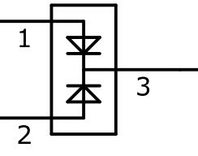

电源管理—实现低功耗
-------------------

本章参考资料：《STM32参考手册》、《STM32F103CDE增强型系列数据手册》。

电源管理相关的库函数及命令
~~~~~~~~~~~~~~~~~~~~~~~~~~

STM32HAL库对电源管理提供了完善的函数及命令，使用它们可以方便地进行控制，本小节对这些内容进行讲解。

配置PVD监控功能
^^^^^^^^^^^^^^^

PVD可监控VDD的电压，当它低于阈值时可产生PVD中断以让系统进行紧急处理，这个阈值可以直接使用库函数PWR_PVDLevelConfig配置成前面
表38_1_ 中说明的阈值等级。

WFI与WFE命令
^^^^^^^^^^^^

我们了解到进入各种低功耗模式时都需要调用WFI或WFE命令，它们实质上都是内核指令，在库文件core_cm3.h中把这些指令封装成了函数，见
代码清单38_1_。

.. code-block:: c
   :caption: 代码清单 38‑1 WFI与WFE的指令定义(core_cm3.h文件)
   :name: 代码清单38_1

    /** brief  等待中断

        等待中断 是一个暂停执行指令
        暂停至任意中断产生后被唤醒
    */
    #define __WFI                             __wfi

    /** brief  等待事件

        等待事件 是一个暂停执行指令
        暂停至任意事件产生后被唤醒
    */
    #define __WFE                             __wfe

对于这两个指令，我们应用时一般只需要知道，调用它们都能进入低功耗模式，需要使用函数的格式“__WFI();”和“__WFE();”来调用(因为__wfi及__wfe是编译器内置的函数，函数内部调用了相应的汇编指令)。其中WFI指令决定了它需要用中断唤醒，而WFE则决定了它可用事件来唤醒，关于它们更详细的区别可查阅《cortex-CM3/CM4权威指南》了解。

进入停止模式
^^^^^^^^^^^^

直接调用WFI和WFE指令可以进入睡眠模式，而进入停止模式则还需要在调用指令前设置一些寄存器位，
STM32HAL库把这部分的操作封装到HAL_PWR_EnterSTOPMode函数中了，它的定义
见 代码清单38_2_。

.. code-block:: c
   :caption: 代码清单 40‑2 进入停止模式
   :name: 代码清单38_2

    /**
    * @brief 进入停止模式
    * @note 在停止模式下所有I/O都会保持在停止前的状态
    * @note 从停止模式唤醒后，会使用HSI作为时钟源
    * @note 调压器若工作在低功耗模式，可减少功耗，但唤醒时会增加延迟
    * @param Regulator: 设置停止模式时调压器的工作模式
    *        @arg PWR_MAINREGULATOR_ON: 调压器正常运行
    *        @arg PWR_LOWPOWERREGULATOR_ON: 调压器低功耗运行
    * @param STOPEntry: 设置使用WFI还是WFE进入停止模式
    *        @arg PWR_STOPENTRY_WFI: WFI进入停止模式
    *        @arg PWR_STOPENTRY_WFE: WFE进入停止模式
    * @retval None
    */
    void HAL_PWR_EnterSTOPMode(uint32_t Regulator, uint8_t STOPEntry)
    {
        uint32_t tmpreg = 0;

        /* 检查参数是否合法 */
        assert_param(IS_PWR_REGULATOR(Regulator));
        assert_param(IS_PWR_STOP_ENTRY(STOPEntry));

        /* 设置调压器的模式 ---------------------------------*/
        tmpreg = PWR->CR1;
        /* 清除 PDDS 及 LPDS 位 */
        tmpreg &= (uint32_t)~(PWR_CR1_PDDS | PWR_CR1_LPDS);

        /* 根据PWR_Regulator 的值(调压器工作模式)配置LPDS,MRLVDS及LPLVDS位 */
        tmpreg |= Regulator;

        /* 写入参数值到寄存器 */
        PWR->CR1 = tmpreg;

        /* 设置内核寄存器的SLEEPDEEP位 */
        SCB->SCR |= SCB_SCR_SLEEPDEEP_Msk;

        /* 设置进入停止模式的方式 -----------------------------------------------*/
        if (STOPEntry == PWR_STOPENTRY_WFI) {
            /* 需要中断唤醒 */
            __WFI();
        } else {
            /* 需要事件唤醒 */
            __SEV();
            __WFE();
            __WFE();
        }
        /* 以下的程序是当重新唤醒时才执行的，清除SLEEPDEEP位的状态 */
        SCB->SCR &= (uint32_t)~((uint32_t)SCB_SCR_SLEEPDEEP_Msk);
    }

这个函数有两个输入参数，分别用于控制调压器的模式及选择使用WFI或WFE停止，代码中先是根据调压器的模式配置PWR_CR寄存器，再把内核寄存器的SLEEPDEEP位置1，这样再调用WFI或WFE命令时，STM32就不是睡眠，而是进入停止模式了。函数结尾处的语句用于复位SLEEPDEEP位的状态，由于它是在WFI及WFE指令之后的，所以这部分代码是在STM32被唤醒的时候才会执行。

要注意的是进入停止模式后，STM32的所有I/O都保持在停止前的状态，而当它被唤醒时，STM32使用HSI作为系统时钟(8MHz)运行，由于系统时钟会影响很多外设的工作状态，所以一般我们在唤醒后会重新开启HSE，把系统时钟设置回原来的状态。

进入待机模式
^^^^^^^^^^^^

类似地，STM32 HAL库也提供了控制进入待机模式的函数，其定义见。

.. code-block:: c
   :caption: 代码清单 38‑3 进入待机模式
   :name: 代码清单38_3

    /**
    * @brief 进入待机模式
    * @note 待机模式时，除了以下引脚，其余引脚都在高阻态：
    *          - 复位引脚
    *          - RTC_AF1 引脚 (PC13)(需要使能侵入检测、时间戳事件或RTC闹钟事件)
    *          - RTC_AF2 引脚 (PI8) (需要使能侵入检测或时间戳事件)
    *          - WKUP 引脚 (PA0) (需要使能WKUP唤醒功能)
    * @retval None
    */
    void HAL_PWR_EnterSTANDBYMode(void)
    {
        /* 选择待机模式 */
        PWR->CR1 |= PWR_CR1_PDDS;

        /* 设置内核寄存器的SLEEPDEEP位 */
        SCB->SCR |= SCB_SCR_SLEEPDEEP_Msk;

        /* 存储操作完毕时才能进入待机模式，使用以下语句确保存储操作执行完毕 */
    #if defined ( __CC_ARM)
        __force_stores();
    #endif
        /* 等待中断唤醒 */
        __WFI();
    }

该函数中先配置了PDDS寄存器位及SLEEPDEEP寄存器位，接着调用__force_stores函数确保存储操作完毕后再调用WFI指令，从而进入待机模式。这里值得注意的是，待机模式也可以使用WFE指令进入的，如果您有需要可以自行修改。

在进入待机模式后，除了被使能了的用于唤醒的I/O，其余I/O都进入高阻态，而从待机模式唤醒后，相当于复位STM32芯片，程序重新从头开始执行。

PWR—睡眠模式实验
~~~~~~~~~~~~~~~~

在本小节中，我们以实验的形式讲解如何控制STM32进入低功耗睡眠模式。

硬件设计
^^^^^^^^

实验中的硬件主要使用到了按键、LED彩灯以及使用串口输出调试信息，这些硬件都与前面相应实验中的一致，涉及到硬件设计的可参考原理图或前面章节中的内容。

软件设计
^^^^^^^^

本小节讲解的是“PWR—睡眠模式”实验，请打开配套的代码工程阅读理解。

程序设计要点
''''''''''''

(1) 初始化用于唤醒的中断按键；

(2) 进入睡眠状态；

(3) 使用按键中断唤醒芯片；

代码分析
''''''''

main函数
=========

睡眠模式的程序比较简单，我们直接阅读它的main函数了解执行流程，见
代码清单38_4_。

.. code-block:: c
   :caption: 代码清单 38‑4 睡眠模式的main函数(main.c文件)
   :name: 代码清单38_4

    int main(void)
    {
        /* 初始化系统时钟为72MHz */
        SystemClock_Config();
        /* 初始化LED */
        LED_GPIO_Config();
        /* 初始化调试串口，一般为串口1 */
        DEBUG_USART_Config();
        /*
        初始化按键为中断模式，按下中断后会进入中断
        服务函数  */
        EXTI_Key_Config();

        printf("\r\n 欢迎使用野火  STM32 F103 开发板。\r\n");
        printf("\r\n 野火F103 睡眠模式例程\r\n");

        printf("\r\n 实验说明：\r\n");

        printf("\r\n 1.本程序中，绿灯表示STM32正常运行，红灯表示睡眠状态，蓝灯表示刚从睡眠状态被唤醒\r\n");
        printf("\r\n 2.程序运行一段时间后自动进入睡眠状态，在睡眠状态下，可使用KEY1或KEY2唤醒\r\n");
        printf("\r\n 3.本实验执行这样一个循环：\r\n ------》亮绿灯(正常运行)->亮红灯(睡眠模式)->按KEY1或KEY2唤醒->亮蓝灯(刚被唤醒)-----》\r\n");
        printf("\r\n 4.在睡眠状态下，DAP下载器无法给STM32下载程序\r\n 可按KEY1、KEY2唤醒后下载，\r\n 或按复位键使芯片处于复位状态，然后在电脑上点击下载按钮，再释放复位按键，即可下载 \r\n");

        while (1) {
            /*********执行任务***************************/
            printf("\r\n STM32正常运行，亮绿灯\r\n");

            LED_GREEN;
            HAL_Delay(2000);
            /*****任务执行完毕，进入睡眠降低功耗***********/

            printf("\r\n 进入睡眠模式，亮红灯,按KEY1或KEY2按键可唤醒\r\n");

            //使用红灯指示，进入睡眠状态
            LED_RED;
            //暂停滴答时钟，防止通过滴答时钟中断唤醒
            HAL_SuspendTick();
            //进入睡眠模式
            HAL_PWR_EnterSLEEPMode(PWR_MAINREGULATOR_ON,PWR_SLEEPENTRY_WFI);
            //等待中断唤醒  K1或K2按键中断
            /***被唤醒，亮蓝灯指示***/
            LED_BLUE;
            //被唤醒后，恢复滴答时钟
            HAL_ResumeTick();
            HAL_Delay(2000);

            printf("\r\n 已退出睡眠模式\r\n");
            //继续执行while循环

        }
    }

这个main函数的执行流程见 图38_1_。

(1) 程序中首先初始化了LED灯及串口以便用于指示芯片的运行状态，并且把实验板上的两个按键都初始化成了中断模式，
    以便当系统进入睡眠模式的时候可以通过按键来唤醒。这些硬件的初始化过程都跟前面章节中的一模一样。

(2) 初始化完成后使用LED及串口表示运行状态，在本实验中，LED彩灯为绿色时表示正常运行，红灯时表示睡眠状态，蓝灯时表示刚从睡眠状态中被唤醒。

(3) 程序执行一段时间后，直接使用WFI指令进入睡眠模式，由于WFI睡眠模式可以使用任意中断唤醒，所以我们可以使用按键中断唤醒。
    在实际应用中，您也可以把它改成串口中断、定时器中断等。

(4) 当系统进入停止状态后，我们按下实验板上的KEY1或KEY2按键，即可使系统回到正常运行的状态，当执行完中断服务函数后，会继续执行WFI指令后的代码。

中断服务函数
==============

系统刚被唤醒时会进入中断服务函数，见 代码清单38_5_。

.. code-block:: c
   :caption: 代码清单 38‑5 按键中断的服务函数(stm32f1xx_it.c文件)
   :name: 代码清单38_5

    void KEY1_IRQHandler(void)
    {
        HAL_GPIO_EXTI_IRQHandler(KEY1_INT_GPIO_PIN);
    }

    void KEY2_IRQHandler(void)
    {
        HAL_GPIO_EXTI_IRQHandler(KEY2_INT_GPIO_PIN);
    }
    void HAL_GPIO_EXTI_Callback(uint16_t GPIO_Pin)
    {
        LED_BLUE;
        if (GPIO_Pin==KEY1_INT_GPIO_PIN)
            printf("\r\n KEY1 按键中断唤醒 \r\n");
        else if (GPIO_Pin==KEY2_INT_GPIO_PIN)
            printf("\r\n KEY2 按键中断唤醒 \r\n");
        else {
        }
    }

用于唤醒睡眠模式的中断，其中断服务函数也没有特殊要求，跟普通的应用一样。

下载验证
^^^^^^^^

下载这个实验测试时，可连接上串口，在电脑端的串口调试助手获知调试信息。当系统进入睡眠状态的时候，可以按KEY1或KEY2按键唤醒系统。

注意：

当系统处于睡眠模式低功耗状态时(包括后面讲解的停止模式及待机模式)，使用DAP下载器是无法给芯片下载程序的，所以下载程序时要先把系统唤醒。或者使用如下方法：按着板子的复位按键，使系统处于复位状态，然后点击电脑端的下载按钮下载程序，这时再释放复位按键，就能正常给板子下载程序了。

PWR—停止模式实验
~~~~~~~~~~~~~~~~

在睡眠模式实验的基础上，我们进一步讲解如何进入停止模式及唤醒后的状态恢复。

硬件设计
^^^^^^^^

本实验中的硬件与睡眠模式中的一致，主要使用到了按键、LED彩灯以及使用串口输出调试信息。

软件设计
^^^^^^^^

本小节讲解的是“PWR—停止模式”实验，请打开配套的代码工程阅读理解。

程序设计要点
''''''''''''

(1) 初始化用于唤醒的中断按键；

(2) 选择电压调节器的工作模式并进入停止状态；

(3) 使用按键中断唤醒芯片；

(4) 重启HSE时钟，使系统完全恢复停止前的状态。

代码分析
''''''''

重启HSE时钟
==============

与睡眠模式不一样，系统从停止模式被唤醒时，是使用HSI作为系统时钟的，在STM32F103中，HSI时钟一般为8MHz，
与我们常用的72MHz相关太远，它会影响各种外设的工作频率。所以在系统从停止模式唤醒后，若希望各种外设恢复正常的工作状态，
就要恢复停止模式前使用的系统时钟，本实验中定义了一个SYSCLKConfig_STOP函数，用于恢复系统时钟，它的定义
见 代码清单38_6_。

.. code-block:: c
   :caption: 代码清单 38‑6 恢复系统时钟(main.c文件)
   :name: 代码清单38_6

    static void SYSCLKConfig_STOP(void)
    {
        RCC_ClkInitTypeDef RCC_ClkInitStruct = {0};
        RCC_OscInitTypeDef RCC_OscInitStruct = {0};
        uint32_t pFLatency = 0;

        /* 启用电源控制时钟 */
        __HAL_RCC_PWR_CLK_ENABLE();

        /* 根据内部RCC寄存器获取振荡器配置 */
        HAL_RCC_GetOscConfig(&RCC_OscInitStruct);

        /* 从停止模式唤醒后重新配置系统时钟:
        启用HSE和PLL */
        RCC_OscInitStruct.OscillatorType  = RCC_OSCILLATORTYPE_HSE;
        RCC_OscInitStruct.HSEState        = RCC_HSE_ON;
        RCC_OscInitStruct.PLL.PLLState    = RCC_PLL_ON;
        if (HAL_RCC_OscConfig(&RCC_OscInitStruct) != HAL_OK) {
            while (1) {
                ;
            }
        }

        /* 根据内部RCC寄存器获取时钟配置 */
        HAL_RCC_GetClockConfig(&RCC_ClkInitStruct, &pFLatency);

        /* 选择 PLL 作为系统时钟源, 并配置 HCLK、PCLK1 和 PCLK2时钟分频系数 */
        RCC_ClkInitStruct.ClockType     = RCC_CLOCKTYPE_SYSCLK;
        RCC_ClkInitStruct.SYSCLKSource  = RCC_SYSCLKSOURCE_PLLCLK;
        if (HAL_RCC_ClockConfig(&RCC_ClkInitStruct, pFLatency) != HAL_OK) {
            while (1) {
                ;
            }
        }
    }

这个函数主要是调用了各种RCC相关的库函数，开启了HSE时钟、使能PLL并且选择PLL作为时钟源，从而恢复停止前的时钟状态。

main函数
===============

停止模式实验的main函数流程与睡眠模式的类似，主要是调用指令方式的不同及唤醒后增加了恢复时钟的操作，见
代码清单38_7_。

.. code-block:: c
   :caption: 代码清单 38‑7 停止模式的main函数(main.c文件)
   :name: 代码清单38_7

    int main(void)
    {
        uint32_t SYSCLK_Frequency=0;
        uint32_t HCLK_Frequency=0;
        uint32_t PCLK1_Frequency=0;
        uint32_t PCLK2_Frequency=0;
        uint32_t SYSCLK_Source=0;

        /* 初始化系统时钟为72MHz */
        SystemClock_Config();
        /* 初始化LED */
        LED_GPIO_Config();
        /* 初始化调试串口，一般为串口1 */
        DEBUG_USART_Config();
        /*
        初始化按键为中断模式，按下中断后会进入中断
        服务函数  */
        EXTI_Key_Config();

        printf("\r\n 欢迎使用野火  STM32 F103 开发板。\r\n");
        printf("\r\n 野火F103 停止模式例程\r\n");

        printf("\r\n 实验说明：\r\n");

        printf("\r\n 1.本程序中，绿灯表示STM32正常运行，红灯表示睡眠状态，蓝灯表示刚从停止状态被唤醒\r\n");
        printf("\r\n 2.程序运行一段时间后自动进入停止状态，在停止状态下，可使用KEY1或KEY2唤醒\r\n");
        printf("\r\n 3.本实验执行这样一个循环：\r\n ------》亮绿灯(正常运行)->亮红灯(停止模式)->按KEY1或KEY2唤醒->亮蓝灯(刚被唤醒)-----》\r\n");
        printf("\r\n 4.在停止状态下，DAP下载器无法给STM32下载程序\r\n 可按KEY1、KEY2唤醒后下载，\r\n 或按复位键使芯片处于复位状态，然后在电脑上点击下载按钮，再释放复位按键，即可下载\r\n");

        while (1) {
            /*********执行任务***************************/
            printf("\r\n STM32正常运行，亮绿灯\r\n");

            LED_GREEN;
            HAL_Delay(2000);
            /*****任务执行完毕，进入睡眠降低功耗***********/

            printf("\r\n 进入停止模式，亮红灯,按KEY1或KEY2按键可唤醒\r\n");

            //使用红灯指示，进入睡眠状态
            LED_RED;
            //暂停滴答时钟，防止通过滴答时钟中断唤醒
            HAL_SuspendTick();
            /*设置停止模式时，FLASH进入掉电状态*/
            HAL_PWREx_EnableFlashPowerDown();
            /*
            进入停止模式，设置电压调节器为低功耗模式，
            等待中断唤醒 */
            HAL_PWR_EnterSTOPMode(PWR_MAINREGULATOR_ON,PWR_STOPENTRY_WFI);
            //等待中断唤醒  K1或K2按键中断
            /***被唤醒，亮蓝灯指示***/
            LED_BLUE;
            //根据时钟寄存器的值更新SystemCoreClock变量
            SystemCoreClockUpdate();
            //获取唤醒后的时钟状态
            SYSCLK_Frequency = HAL_RCC_GetSysClockFreq();
            HCLK_Frequency   = HAL_RCC_GetHCLKFreq();
            PCLK1_Frequency  = HAL_RCC_GetPCLK1Freq();
            PCLK2_Frequency  = HAL_RCC_GetPCLK2Freq();
            SYSCLK_Source    = __HAL_RCC_GET_SYSCLK_SOURCE();
            //这里由于串口直接使用HSI时钟，不会会影响串口波特率
            printf("\r\n刚唤醒的时钟状态：\r\n");
            printf(" SYSCLK频率:%d,\r\n HCLK频率:%d,\r\n PCLK1频率:%d,\r\n PCLK2频率:%d,\r\n 时钟源:%d (0表示HSI，8表示PLLCLK)\n",SYSCLK_Frequency,HCLK_Frequency,PCLK1_Frequency,PCLK2_Frequency,SYSCLK_Source);
            /* 从停止模式唤醒后配置系统时钟:启用HSE、PLL*/
            /* 选择PLL作为系统时钟源(HSE和PLL在停止模式下禁用)*/

            SYSCLKConfig_STOP();
            //被唤醒后，恢复滴答时钟
            HAL_ResumeTick();
            //获取重新配置后的时钟状态
            SYSCLK_Frequency = HAL_RCC_GetSysClockFreq();
            HCLK_Frequency   = HAL_RCC_GetHCLKFreq();
            PCLK1_Frequency  = HAL_RCC_GetPCLK1Freq();
            PCLK2_Frequency  = HAL_RCC_GetPCLK2Freq();
            SYSCLK_Source    = __HAL_RCC_GET_SYSCLK_SOURCE();

            //重新配置时钟源后始终状态
            printf("\r\n重新配置后的时钟状态：\r\n");
            printf(" SYSCLK频率:%d,\r\n HCLK频率:%d,\r\n PCLK1频率:%d,\r\n PCLK2频率:%d,\r\n 时钟源:%d (0表示HSI，8表示PLLCLK)\n",SYSCLK_Frequency,HCLK_Frequency,PCLK1_Frequency,PCLK2_Frequency,SYSCLK_Source);
            HAL_Delay(2000);
            printf("\r\n 已退出停止模式\r\n");
            //继续执行while循环
        }
    }

这个main函数的执行流程见 图38_2_。

(1) 程序中首先初始化了LED灯及串口以便用于指示芯片的运行状态，并且把实验板上的两个按键都初始化成了中断模式，
    以便当系统进入停止模式的时候可以通过按键来唤醒。这些硬件的初始化过程都跟前面章节中的一模一样。

(2) 初始化完成后使用LED及串口表示运行状态，在本实验中，LED彩灯为绿色时表示正常运行，红灯时表示停止状态，
    蓝灯时表示刚从停止状态中被唤醒。在停止模式下，I/O口会保持停止前的状态，所以LED彩灯在停止模式时也会保持亮红灯。

(3) 程序执行一段时间后，我们先用库函数HAL_PWREx_EnableFlashPowerDown设置FLASH的在停止状态时使用掉电模式，
    接着调用库函数HAL_PWR_EnterSTOPMode把调压器设置在低功耗模式，进入停止状态。由于WFI停止模式可以使用任意EXTI的中断唤醒，所以我们可以使用按键中断唤醒。

(4) 当系统进入睡眠状态后，我们按下实验板上的KEY1或KEY2按键，即可唤醒系统，当执行完中断服务函数后，
    会继续执行HAL_PWR_EnterSTOPMode函数后的代码。

(5) 为了更清晰地展示停止模式的影响，在刚唤醒后，我们调用了库函数SystemCoreClockUpdate、HAL_RCC_GetSysClockFreq、
    HAL_RCC_GetHCLKFreq、HAL_RCC_GetPCLK1Freq、HAL_RCC_GetPCLK2Freq、__HAL_RCC_GET_SYSCLK_SOURCE函数获取刚唤醒后的系统的时钟源以及时钟频率，并通过串口打印出来。在使用SYSCLKConfig_STOP函数恢复时钟后，我们再次获取这些时频率，最后再通过串口打印出来。

(6) 通过串口调试信息我们会知道刚唤醒时系统时钟使用的是HSI时钟，频率为8MHz，恢复后的系统时钟采用HSE倍频后的PLL时钟，时钟频率为72MHz。

下载验证
^^^^^^^^

下载这个实验测试时，可连接上串口，在电脑端的串口调试助手获知调试信息。当系统进入停止状态的时候，可以按KEY1或KEY2按键唤醒系统。

注意：

当系统处于停止模式低功耗状态时(包括睡眠模式及待机模式)，使用DAP下载器是无法给芯片下载程序的，所以下载程序时要先把系统唤醒。或者使用如下方法：按着板子的复位按键，使系统处于复位状态，然后点击电脑端的下载按钮下载程序，这时再释放复位按键，就能正常给板子下载程序了。

STM32的电源管理简介
~~~~~~~~~~~~~~~~~~~

电源对电子设备的重要性不言而喻，它是保证系统稳定运行的基础，而保证系统能稳定运行后，又有低功耗的要求。在很多应用场合中都对电子设备的功耗要求非常苛刻，如某些传感器信息采集设备，仅靠小型的电池提供电源，要求工作长达数年之久，且期间不需要任何维护；由于智慧穿戴设备的小型化要求，电池体积不能太大导致容量也比较小，所以也很有必要从控制功耗入手，提高设备的续行时间。因此，STM32有专门的电源管理外设监控电源并管理设备的运行模式，确保系统正常运行，并尽量降低器件的功耗。

电源监控器
^^^^^^^^^^

STM32芯片主要通过引脚VDD从外部获取电源，在它的内部具有电源监控器用于检测VDD的电压，以实现复位功能及掉电紧急处理功能，保证系统可靠地运行。

上电复位与掉电复位(POR与PDR)
''''''''''''''''''''''''''''

当检测到VDD的电压低于阈值VPOR及VPDR时，无需外部电路辅助，STM32芯片会自动保持在复位状态，防止因电压不足强行工作而带来严重的后果。见
图38_3_，在刚开始电压低于VPOR时(约1.92V)，STM32保持在上电复位状态(POR，Power
On
Reset)，当VDD电压持续上升至大于VPOR时，芯片开始正常运行，而在芯片正常运行的时候，当检测到VDD电压下降至低于VPDR阈值(约1.88V)，会进入掉电复位状态(PDR，Power
Down Reset)。

图 38‑3 POR与PDR

可编程电压检测器PVD
'''''''''''''''''''

上述POR、PDR功能是使用其电压阈值与外部供电电压VDD比较，当低于工作阈值时，会直接进入复位状态，这可防止电压不足导致的误操作。除此之外，STM32还提供了可编程电压检测器PVD，它也是实时检测VDD的电压，当检测到电压低于编程的VPVD阈值时，会向内核产生一个PVD中断(EXTI16线中断)以使内核在复位前进行紧急处理。该电压阈值可通过电源控制寄存器PWR_CSR设置。

使用PVD可配置8个等级，见 表38_1_。其中的上升沿和下降沿分别表示类似
图38_3_ 中VDD电压上升过程及下降过程的阈值。

.. _表38_1:

表 38‑1 PVD的阈值等级

======== ====== ====== ====== ====== ====
阈值等级 条件   最小值 典型值 最大值 单位
级别0    上升沿 2.1    2.18   2.26   V
\        下降沿 2      2.08   2.16   V
级别1    上升沿 2.19   2.28   2.37   V
\        下降沿 2.09   2.18   2.27   V
级别2    上升沿 2.28   2.38   2.48   V
\        下降沿 2.18   2.28   2.38   V
级别3    上升沿 2.38   2.48   2.58   V
\        下降沿 2.28   2.38   2.48   V
级别4    上升沿 2.47   2.58   2.69   V
\        下降沿 2.37   2.48   2.59   V
级别5    上升沿 2.57   2.68   2.79   V
\        下降沿 2.47   2.58   2.69   V
级别6    上升沿 2.66   2.78   2.9    V
\        下降沿 2.56   2.68   2.8    V
级别7    上升沿 2.76   2.88   3      V
\        下降沿 2.66   2.78   2.9    V
======== ====== ====== ====== ====== ====

STM32的电源系统
^^^^^^^^^^^^^^^

为了方便进行电源管理，STM32把它的外设、内核等模块跟据功能划分了供电区域，其内部电源区域划分见
图38_4_。

图 38‑4 STM32的电源系统

从框图了解到，STM32的电源系统主要分为备份域电路、内核电路以及ADC电路三部分，介绍如下：

-  ADC电源及参考电压（V\ :sub:`DDA`\ 供电区域）

..

   为了提高转换精度，STM32的ADC配有独立的电源接口，方便进行单独的滤波。
   ADC的工作电源使用V\ :sub:`DDA`\ 引脚输入，使用V\ :sub:`SSA`\
   作为独立的地连接，V\ :sub:`REF`\ 引脚则为ADC提供测量使用的参考电压。

-  调压器供电电路（V\ :sub:`DD`/1.8V供电区域）

..

   在STM32的电源系统中调压器供电的电路是最主要的部分，调压器为备份域及待机电路以外的所有数字电路供电，其中包括内核、数字外设以及RAM，调压器的输出电压约为1.8V，因而使用调压器供电的这些电路区域被称为1.8V域。

   调压器可以运行在“运行模式”、“停止模式”以及“待机模式”。在运行模式下，1.8V域全功率运行；在停止模式下1.8V域运行在低功耗状态，1.8V区域的所有时钟都被关闭，相应的外设都停止了工作，但它会保留内核寄存器以及SRAM的内容；在待机模式下，整个1.8V域都断电，该区域的内核寄存器及SRAM内容都会丢失(备份区域的寄存器不受影响)。

-  备份域电路（后备供电区域）

..

   STM32的LSE振荡器、RTC及备份寄存器这些器件被包含进备份域电路中，这部分的电路可以通过STM32
   的V\ :sub:`BAT`\ 引脚获取供电电源，在实际应用中一般会使用3V的钮扣电池对该引脚供电。

   在图中备份域电路的左侧有一个电源开关结构，它的功能类似图
   40‑5中的双二极管，在它的“1”处连接了V\ :sub:`BAT`\ 电源，“2”处连接
   了V\ :sub:`DD`\ 主电源(一般为3.3V)，右侧“3”处引出到备份域电路中。
   当V\ :sub:`DD`\ 主电源存在时，由于V\ :sub:`DD`\ 电压较高，备份域电路
   通过V\ :sub:`DD`\ 供电，节省钮扣电池的电源，仅当V\ :sub:`DD`\ 掉电时，
   备份域电路由钮扣电池通过V\ :sub:`BAT`\ 供电，保证电路能持续运行，从而可利用它保留关键数据。

图 38‑5 双二极管结构

STM32的功耗模式
^^^^^^^^^^^^^^^

按功耗由高到低排列，STM32具有运行、睡眠、停止和待机四种工作模式。上电复位后STM32处于运行状态时，当内核不需要继续运行，就可以选择进入后面的三种低功耗模式降低功耗，这三种模式中，电源消耗不同、唤醒时间不同、唤醒源不同，用户需要根据应用需求，选择最佳的低功耗模式。三种低功耗的模式说明见表
40‑2。

   表 40‑2STM32的低功耗模式说明

==== ======================================================================= =========================================== ================================================================ ===================================== ==================== ===============================================
模式 说明                                                                    进入方式                                    唤醒方式                                                         对1.8V区域时钟的影响                  对VDD区域 时钟的影响 调压器
睡眠 内核停止，所有外设包括M3核心的外设，如NVIC、系统时钟(SysTick)等仍在运行 调用WFI命令                                 任一中断                                                         内核时钟关，对其他时钟和ADC时钟无影响 无                   开
\                                                                            调用WFE命令                                 唤醒事件                                                                                                                   
停止 所有的时钟都已停止                                                      配置PWR_CR寄存器的PDDS +LPDS 位+SLEEPDEEP位 任一外部中断( 在外部中断寄存器中设置)                            关闭所有1.8V区域的时钟                HSI和HSE的振荡器关闭 开启或处于低功耗模式( 依据电源控制寄存器的设定)
                                                                                                                                                                                                                                                    
                                                                             +WFI或WFE命令                                                                                                                                                          
待机 1.8V 电源关闭                                                           配置PWR_CR寄存器的PDDS +SLEEPDEEP位         WKUP 引脚的上升沿、RTC闹钟事件、NRST 引脚上的外部复位、IWDG 复位                                                            关
                                                                                                                                                                                                                                                    
                                                                             +WFI或WFE命令                                                                                                                                                          
==== ======================================================================= =========================================== ================================================================ ===================================== ==================== ===============================================

从表中可以看到，这三种低功耗模式层层递进，运行的时钟或芯片功能越来越少，因而功耗越来越低。

睡眠模式
''''''''

在睡眠模式中，仅关闭了内核时钟，内核停止运行，但其片上外设，CM3核心的外设全都还照常运行。有两种方式进入睡眠模式，它的进入方式决定了从睡眠唤醒的方式，分别是WFI(wait
for interrupt)和WFE(wait for
event)，即由等待“中断”唤醒和由“事件”唤醒。睡眠模式的各种特性见表 40‑3。

   表 40‑3 睡眠模式的各种特性

========== ======================================================================================================================
特性       说明
立即睡眠   在执行 WFI 或 WFE 指令时立即进入睡眠模式。
退出时睡眠 在退出优先级最低的中断服务程序后才进入睡眠模式。
进入方式   内核寄存器的SLEEPDEEP = 0 ，然后调用WFI或WFE指令即可进入睡眠模式；
          
           另外若内核寄存器的SLEEPONEXIT=0时，进入“立即睡眠”模式，SLEEPONEXIT=1时，进入“退出时睡眠”模式。
唤醒方式   如果是使用WFI指令睡眠的，则可使用任意中断唤醒；
          
           如果是使用WFE指令睡眠的，则由事件唤醒。
睡眠时     关闭内核时钟，内核停止，而外设正常运行，在软件上表现为不再执行新的代码。这个状态会保留睡眠前的内核寄存器、内存的数据。
唤醒延迟   无延迟。
唤醒后     若由中断唤醒，先进入中断，退出中断服务程序后，接着执行WFI指令后的程序；若由事件唤醒，直接接着执行WFE后的程序。
========== ======================================================================================================================

停止模式
''''''''

在停止模式中，进一步关闭了其它所有的时钟，于是所有的外设都停止了工作，但由于其1.8V区域的部分电源没有关闭，
还保留了内核的寄存器、内存的信息，所以从停止模式唤醒，并重新开启时钟后，还可以从上次停止处继续执行代码。
停止模式可以由任意一个外部中断(EXTI)唤醒，在停止模式中可以选择电压调节器为开模式或低功耗模式。停止模式的各种特性见
表40‑4。

   表 40‑4 停止模式的各种特性

================ ==================================================================================================================================================
特性             说明
调压器低功耗模式 在停止模式下调压器可工作在正常模式或低功耗模式，可进一步降低功耗
进入方式         内核寄存器的SLEEPDEEP =1，PWR_CR寄存器中的PDDS=0，然后调用WFI或WFE指令即可进入停止模式；
                
                 PWR_CR 寄存器的LPDS=0时，调压器工作在正常模式，LPDS=1时工作在低功耗模式；
唤醒方式         如果是使用WFI指令睡眠的，可使用任意EXTI线的中断唤醒；
                
                 如果是使用WFE指令睡眠的，可使用任意配置为事件模式的EXTI线事件唤醒。
停止时           内核停止，片上外设也停止。这个状态会保留停止前的内核寄存器、内存的数据。
唤醒延迟         基础延迟为HSI振荡器的启动时间，若调压器工作在低功耗模式，还需要加上调压器从低功耗切换至正常模式下的时间。
唤醒后           若由中断唤醒，先进入中断，退出中断服务程序后，接着执行WFI指令后的程序；
                 
                 若由事件唤醒，直接接着执行WFE后的程序。唤醒后，STM32会使用HSI作为系统时钟。
================ ==================================================================================================================================================

待机模式
''''''''

待机模式，它除了关闭所有的时钟，还把1.8V区域的电源也完全关闭了，也就是说，从待机模式唤醒后，由于没有之前代码的运行记录，只能对芯片复位，重新检测boot条件，从头开始执行程序。它有四种唤醒方式，分别是WKUP(PA0)引脚的上升沿，RTC闹钟事件，NRST引脚的复位和IWDG(独立看门狗)复位。

表 40‑5 待机模式的各种特性

======== =========================================================================================================================
特性     说明
进入方式 内核寄存器的SLEEPDEEP =1，PWR_CR寄存器中的PDDS=1，PWR_CR寄存器中的唤醒状态位WUF=0，然后调用WFI或WFE指令即可进入待机模式；
唤醒方式 通过WKUP引脚的上升沿，RTC闹钟、唤醒、入侵、时间戳事件或NRST引脚外部复位及IWDG复位唤醒。
待机时   内核停止，片上外设也停止；内核寄存器、内存的数据会丢失；除复位引脚、RTC_AF1引脚及WKUP引脚，其它I/O口均工作在高阻态。
唤醒延迟 芯片复位的时间
唤醒后   相当于芯片复位，在程序表现为从头开始执行代码。
======== =========================================================================================================================

在以上讲解的睡眠模式、停止模式及待机模式中，若备份域电源正常供电，备份域内的RTC都可以正常运行，备份域内的寄存器的数据会被保存，不受功耗模式影响。

PWR—待机模式实验
~~~~~~~~~~~~~~~~

最后我们来学习最低功耗的待机模式。

硬件设计
^^^^^^^^

本实验中的硬件与睡眠模式、停止模式中的一致，主要使用到了按键、LED彩灯以及使用串口输出调试信息。要强调的是，由于WKUP引脚(PA0)必须使用上升沿才能唤醒待机状态的系统，所以我们硬件设计的PA0引脚连接到按键KEY1，且按下按键的时候会在PA0引脚产生上升沿，从而可实现唤醒的功能，按键的具体电路请查看配套的原理图。

软件设计
^^^^^^^^

本小节讲解的是“PWR—待机模式”实验，请打开配套的代码工程阅读理解。

程序设计要点
''''''''''''

(1) 清除WUF标志位；

(2) 使能WKUP唤醒功能；

(3) 进入待机状态。

代码分析
''''''''

main函数
=============

待机模式实验的执行流程比较简单，见 代码清单38_8_。

.. code-block:: c
   :caption: 代码清单 38‑8 停止模式的main函数(main.c文件)
   :name: 代码清单38_8

    int main(void)
    {
        /* 初始化系统时钟为72MHz */
        SystemClock_Config();
        /* 初始化LED */
        LED_GPIO_Config();
        /* 初始化调试串口，一般为串口1 */
        DEBUG_USART_Config();
        /*初始化按键，不需要中断,
        仅初始化KEY2即可，只用于唤醒的PA0引脚不需要这样
        初始化*/
        Key_GPIO_Config();

        printf("\r\n 欢迎使用野火  STM32 F103 开发板。\r\n");
        printf("\r\n 野火F103 待机模式例程\r\n");

        printf("\r\n 实验说明：\r\n");

        printf("\r\n 1.本程序中，绿灯表示本次复位是上电或引脚复位，红灯表示即将进入待机状态，蓝灯表示本次是待机唤醒的复位\r\n");
        printf("\r\n 2.长按KEY2按键后，会进入待机模式\r\n");
        printf("\r\n 3.在待机模式下，按KEY1按键可唤醒，唤醒后系统会进行复位，程序从头开始执行\r\n");
        printf("\r\n 4.可通过检测WU标志位确定复位来源\r\n");

        printf("\r\n 5.在待机状态下，DAP下载器无法给STM32下载程序需要唤醒后才能下载");

        //检测复位来源
        if (__HAL_PWR_GET_FLAG(PWR_FLAG_SB) == SET) {
            __HAL_PWR_CLEAR_FLAG(PWR_FLAG_SB);
            LED_BLUE;
            printf("\r\n 待机唤醒复位 \r\n");
        } else {
            LED_GREEN;
            printf("\r\n 非待机唤醒复位 \r\n");
        }

        while (1) {
            // K2 按键长按进入待机模式
            if (KEY2_LongPress()) {

                printf("\r\n即将进入待机模式，进入待机模式后可按KEY1唤醒，唤醒后会进行复位，程序从头开始执行\r\n");
                LED_RED;
                HAL_Delay(1000);

                /*清除WU状态位*/
                __HAL_PWR_CLEAR_FLAG(PWR_FLAG_WU);

                /* 使能WKUP引脚的唤醒功能 ，使能PA0*/
                HAL_PWR_EnableWakeUpPin( 0x00000100U);

                //暂停滴答时钟，防止通过滴答时钟中断唤醒
                HAL_SuspendTick();
                /* 进入待机模式 */
                HAL_PWR_EnterSTANDBYMode();
            }
        }
    }

这个main函数的执行流程见图 40‑1。

   图 40‑6 待机模式实验流程图

(1) 程序中首先初始化了系统时钟、LED灯及串口以便用于指示芯片的运行状态，由于待机模式唤醒使用WKUP引脚并不需要特别的引脚初始化，所以我们调用的按键初始化函数Key_GPIO_Config它的内部只初始化了KEY2按键，而且是普通的输入模式，对唤醒用的PA0引脚可以不初始化。当然，如果不初始化PA0的话，在正常运行模式中KEY1按键是不能正常运行的，我们这里只是强调待机模式的WKUP唤醒不需要中断，也不需要像按键那样初始化。本工程中使用的Key_GPIO_Config函数定义如
代码清单38_9_ 所示。

.. code-block:: c
   :caption: 代码清单 38‑9 Key_GPIO_Config函数(bsp_key.c文件)
   :name: 代码清单38_9

    void Key_GPIO_Config(void)
    {
        GPIO_InitTypeDef GPIO_InitStructure;

        /*开启按键GPIO口的时钟*/
        KEY2_GPIO_CLK_ENABLE();
        /*选择按键的引脚*/
        GPIO_InitStructure.Pin = KEY2_PIN;

        /*设置引脚为输入模式*/
        GPIO_InitStructure.Mode = GPIO_MODE_INPUT;

        /*设置引脚不上拉也不下拉*/
        GPIO_InitStructure.Pull = GPIO_NOPULL;

        /*使用上面的结构体初始化按键*/
        HAL_GPIO_Init(KEY2_GPIO_PORT, &GPIO_InitStructure);
    }

(2) 使使用库函数__HAL_PWR_GET_FLAG检测PWR_FLAG_SB标志位，当这个标志位为SET状态的时候，表示本次系统是从待机模式唤醒的复位，否则可能是上电复位。我们利用这个区分两种复位形式，分别使用蓝色LED灯或绿色LED灯来指示。

(3) 在while循环中，使用自定义的函数KEY2_LongPress来检测KEY2按键是否被长时间按下，若长时间按下则进入待机模式，否则继续while循环。KEY2_LongPress函数不是本章分析的重点，感兴趣的读者请自行查阅工程中的代码。

(4) 检测到KEY2按键被长时间按下，要进入待机模式。在使用库函数HAL_PWR_EnableWakeUpPin发送待机命令前，要先使用库函数__HAL_PWR_CLEAR_FLAG清除PWR_FLAG_WU标志位，并且使用库函数HAL_PWR_EnableWakeUpPin使能WKUP唤醒功能，这样进入待机模式后才能使用WKUP唤醒。

(5) 在进入待机模式前我们控制了LED彩灯为红色，但在待机状态时，由于I/O口会处于高阻态，所以LED灯会熄灭。

(6) 按下KEY1按键，会使PA0引脚产生一个上升沿，从而唤醒系统。

(7) 系统唤醒后会进行复位，从头开始执行上述过程，与第一次上电时不同的是，这样的复位会使PWR_FLAG_SB标志位改为SET状态，所以这个时候LED彩灯会亮蓝色。

(1) 下载验证

下载这个实验测试时，可连接上串口，在电脑端的串口调试助手获知调试信息。长按实验板上的KEY2按键，系统会进入待机模式，按KEY1按键可唤醒系统。

注意：

当系统处于待机模式低功耗状态时(包括睡眠模式及停止模式)，使用DAP下载器是无法给芯片下载程序的，所以下载程序时要先把系统唤醒。或者使用如下方法：按着板子的复位按键，使系统处于复位状态，然后点击电脑端的下载按钮下载程序，这时再释放复位按键，就能正常给板子下载程序了。

PWR—PVD电源监控实验
~~~~~~~~~~~~~~~~~~~

这一小节我们学习如何使用PVD监控供电电源，增强系统的鲁棒性。

硬件设计
^^^^^^^^

本实验中使用PVD监控STM32芯片的VDD引脚，当监测到供电电压低于阈值时会产生PVD中断，系统进入中断服务函数进入紧急处理过程。
所以进行这个实验时需要使用一个可调的电压源给实验板供电，改变给STM32芯片的供电电压，为此我们需要先了解实验板的电源供电系统，见
图38_7_。

.. image:: media/image8.jpeg
   :align: center
   :alt: 图 38‑7 实验板的电源供电系统
   :name: 图38_7

整个电源供电系统主要分为以下五部分：

(1) 6-12V的DC电源供电系统，这部分使用DC电源接口引入6-12V的电源，
    经过RT7272进行电压转换成5V电源，再与第二部分的“5V_USB”电源线连接在一起。

(2) 第二部分使用USB接口，使用USB线从外部引入5V电源，引入的电源经过电源开关及保险丝连接到“5V”电源线。

(3) 第三部分的是电源开关及保险丝，即当我们的实验板使用DC电源或“5V_USB”线供电时，可用电源开关控制通断，保险丝也会起保护作用。

(4) “5V”电源线遍布整个板子，板子上各个位置引出的标有“5V”丝印的排针都与这个电源线直接相连。
    5V电源线给板子上的某些工作电压为5V的芯片供电。5V电源还经过LDO稳压芯片，输出3.3V电源连接到“3.3V”电源线。

(5) 同样地，“3.3V”电源线也遍布整个板子，各个引出的标有“3.3V”丝印的排针都与它直接相连，3.3V电源给工作
    电压为3.3V的各种芯片供电。STM32芯片的VDD引脚就是直接与这个3.3V电源相连的，所以通过STM32的PVD监控的就是这个“3.3V”电源线的电压。

当我们进行这个PVD实验时，为方便改变“3.3V”电源线的电压，我们可以把可调电源通过实验板上引出的“5V”及“GND”
排针给实验板供电，当可调电源电压降低时，LDO在“3.3V”电源线的供电电压会随之降低，即STM32的PVD监控的VDD引脚电压会降低，这样我们就可以模拟VDD电压下降的实验条件，对PVD进行测试了。不过，由于这样供电不经过保险丝，所以在调节电压的时候要小心，不要给它供电远高于5V，否则可能会烧坏实验板上的芯片。

软件设计
^^^^^^^^

本小节讲解的是“PWR—睡眠模式”实验，请打开配套的代码工程阅读理解。为了方便把这个工程的PVD监控功能移植到其它应用，我们把PVD电压监控相关的主要代码编都写到“bsp_pvd.c”及“bsp_pvd.h”文件中，这些文件是我们自己编写的，不属于HAL库的内容，可根据您的喜好命名文件。

程序设计要点
''''''''''''

(1) 初始化PVD中断；

(2) 设置PVD电压监控等级并使能PVD；

(3) 编写PVD中断服务函数，处理紧急任务。

代码分析
''''''''

初始化PVD
=============

使用PVD功能前需要先初始化，我们把这部分代码封装到PVD_Config函数中，
见 代码清单38_10_。

.. code-block:: c
   :caption: 代码清单 38‑10 初始化PVD(bsp_pvd.c文件)
   :name: 代码清单38_10

    void PVD_Config(void)
    {
        PWR_PVDTypeDef sConfigPVD;

        /*使能 PWR 时钟 */
        __PWR_CLK_ENABLE();
        /* 配置 PVD 中断 */
        /*中断设置，抢占优先级0，子优先级为0*/
        HAL_NVIC_SetPriority(PVD_IRQn, 0 ,0);
        HAL_NVIC_EnableIRQ(PVD_IRQn);

        /* 配置PVD级别5 (PVD检测电压的阈值为2.8V，
        VDD电压低于2.8V时产生PVD中断，具体数据
        可查询数据手册获知) 具体级别根据自己的
        实际应用要求配置*/
        sConfigPVD.PVDLevel = PWR_PVDLEVEL_5;
        sConfigPVD.Mode = PWR_PVD_MODE_IT_RISING_FALLING;
        HAL_PWR_ConfigPVD(&sConfigPVD);
        /* 使能PVD输出 */
        HAL_PWR_EnablePVD();
    }

21 }

在这段代码中，执行的流程如下：

(1) 使能电源管理时钟。

(2) 配置PVD的中断优先级。由于电压下降是非常危急的状态，所以请尽量把它配置成最高优先级。

(3) 使用库函数HAL_PWR_ConfigPVD设置PVD监控的电压阈值等级，各个阈值等级表示的电压值请查阅
    表38_1_ 或STM32的数据手册。

(4) 最后使用库函数HAL_PWR_EnablePVD使能PVD功能。

PVD中断服务函数
==================

配置完成PVD后，还需要编写中断服务函数，在其中处理紧急任务，本工程的PVD中断服务函数见
代码清单38_11_。

.. code-block:: c
   :caption: 代码清单 38‑11 PVD中断服务函数(stm32f1xx_it.c文件)
   :name: 代码清单38_11

    void PVD_IRQHandler(void)
    {
        HAL_PWR_PVD_IRQHandler();
    }
    /**
    * @brief  PWR PVD interrupt callback
    * @param  None
    * @retval None
    */
    void HAL_PWR_PVDCallback(void)
    {
        /* 亮红灯，实际应用中应进入紧急状态处理 */
        LED_RED;
    }

注意这个中断服务函数的名是PVD_IRQHandler而不是EXTI16_IRQHandler(STM32没有这样的中断函数名)，示例中我们仅点亮了LED红灯，不同的应用中要根据需求进行相应的紧急处理。

main函数
=============

本电源监控实验的main函数执行流程比较简单，仅调用了PVD_Config配置监控功能，当VDD供电电压正常时，板子亮绿灯，当电压低于阈值时，
会跳转到中断服务函数中，板子亮红灯，见
代码清单38_12_。

.. code-block:: c
   :caption: 代码清单 38‑12 停止模式的main函数(main.c文件)
   :name: 代码清单38_12

    int main(void)
    {
        /* 配置系统时钟为180 MHz */
        SystemClock_Config();
        /* 初始化LED */
        LED_GPIO_Config();
        //亮绿灯，表示正常运行
        LED_GREEN;

        //配置PVD，当电压过低时，会进入中断服务函数，亮红灯
        PVD_Config();

        while (1) {
            /*正常运行的程序*/
        }
    }

下载验证
^^^^^^^^

本工程的验证步骤如下：

(1) 通过电脑把本工程编译并下载到实验板；

(2) 把下载器、USB及DC电源等外部供电设备都拔掉；

(3) 按“硬件设计”小节中的说明，使用可调电源通过“5V”及“GND”排针给实验板供5V电源；(注意要先调好可调电源的电压再连接，防止烧坏实验板)

(4) 复位实验板，确认板子亮绿灯，表示正常状态；

(5) 持续降低可调电源的输出电压，直到实验板亮红灯，这时表示PVD检测到电压低于阈值。

本工程中，我们实测PVD阈值等级为“PWR_PVDLevel_2V6”时，当可调电源电压降至4.1V时，板子亮红灯，此时的“3.3V”电源引脚的实测电压为2.55V，您可以设置其它电压阈值来进行测试。

注意：

由于这样使用可调电源供电不经过保险丝，所以在调节电压的时候要小心，不要给它供电远高于5V，否则可能会烧坏实验板上的芯片。
