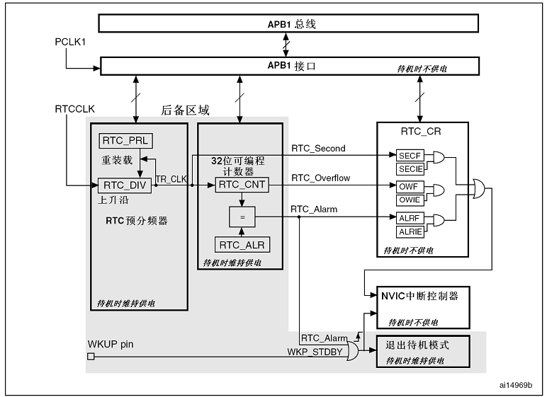
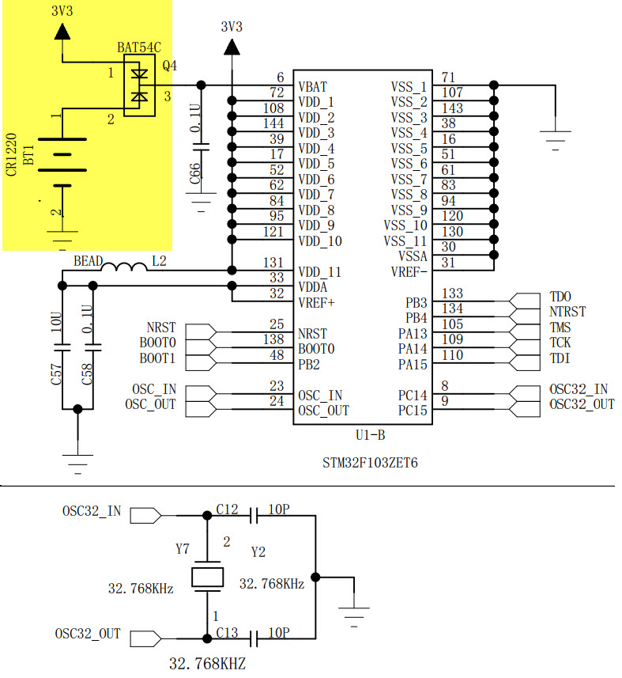

RTC—实时时钟
------------

本章参考资料：《STM32F103增强型系列数据手册》以及《STM32F10X-中文参考手册》的《电源控制PWR》及《实时时钟RTC》章节。

RTC实时时钟简介
~~~~~~~~~~~~~~~

STM32的RTC外设（Real Time
Clock），实质是一个 *掉电* 后还继续运行的定时器。从定时器的角度来说，相对于通用定时器TIM外设，它十分简单，
只有很纯粹的计时和触发中断的功能；但从 *掉电还继续运行* 的角度来说，它却是STM32中唯一一个具有如此强大功能的外设。
所以RTC外设的复杂之处并不在于它的定时功能，而在于它掉电还继续运行的特性。

以上所说的掉电，是指\ *主电源V\ DD*\ 断开的情况，为了RTC外设\ *掉电继续运行*\ ，必须接上锂电池给STM32的RTC、
备份发卡通过V\ :sub:`BAT`\ 引脚供电。当主电源V\ :sub:`DD`\ 有效时，由V\ :sub:`DD`\ 给RTC外设供电；
而当V\ :sub:`DD`\ 掉电后，由V\ :sub:`BAT`\ 给RTC外设供电。但无论由什么电源供电，RTC中的数据都保存在
属于RTC的\ *备份域*\ 中，若主电源V\ :sub:`DD`\ 和V\ :sub:`BAT`\ 都掉电，那么\ *备份域*\ 中保存的所有数据
将丢失。\ *备份域*\ 除了RTC模块的寄存器，还有42个16位的寄存器可以在V\ :sub:`DD`\ 掉电的情况下保存用户程序
的数据，系统复位或电源复位时，这些数据也不会被复位。

从RTC的定时器特性来说，它是一个\ *32位*\ 的计数器，只能向上计数。它使用的时钟源有三种，分别为高速外部时钟
的128分频（HSE/128）、低速内部时钟LSI以及低速外部时钟LSE；使HSE分频时钟或LSI的话，在主电源V\ :sub:`DD`\ 掉电
的情况下，这两个时钟来源都会受到影响，因此没法保证RTC正常工作。因此RTC一般使用\ *低速外部时钟LSE*\ ，在设计中，
频率通常为实时时钟模块中常用的32.768KHz，这是因为32768
=
2\ :sup:`15`\ ，分频容易实现，所以它被广泛应用到RTC模块。在主电源V\ :sub:`DD`\ 有效的情况下(待机)，
RTC还可以配置\ *闹钟事件*\ 使STM32退出待机模式。

RTC外设框图剖析
~~~~~~~~~~~~~~~

图 39‑1 RTC架构图

框图中浅灰色的部分都是属于\ *备份域*\ 的，在V\ :sub:`DD`\ 掉电时可
在V\ :sub:`BAT`\ 的驱动下继续运行。这部分仅包括RTC的分频器，计数器，
和闹钟控制器。若V\ :sub:`DD`\ 电源有效，RTC可以触发\ *RTC_Second(秒中断)、RTC_Overflow(溢出事件)
和RTC_Alarm(闹钟中断)*\ 。从结构图可以分析到，其中的定时器\ *溢出事件*\ 无法被配置为中断。
若STM32原本处于待机状态，可由\ *闹钟事件或WKUP事件*\ (外部唤醒事件，属于EXTI模块，不属于RTC)
使它退出待机模式。闹钟事件是在*计数器RTC_CNT*\ 的值\ *等于闹钟寄存器RTC_ALR*\ 的值时触发的。

在备份域中所有寄存器都是16位的，
RTC控制相关的寄存器也不例外。它的计数器\ *RTC_CNT*\ 的32位由\ *RTC_CNTL*\
和\ *RTC_CNTH*\ 两个寄存器组成，分别保存定时计数值的低16位和高16位。
在配置RTC模块的时钟时，通常把输入的32768Hz的\ *RTCCLK*\ 进行32768分频得到实际驱动计数器的时钟\ *TR_CLK*
= RTCCLK/32768= 1
Hz，计时周期为1秒，计时器在\ *TR_CLK*\ 的驱动下计数，即\ *每秒*\ 计数器\ *RTC_CNT*\ 的值加1。

由于\ *备份域*\ 的存在，使得RTC核具有了完全独立于APB1接口的特性，也因此对RTC寄存器的访问要遵守一定的规则。

系统复位后，默认禁止访问后备寄存器和RTC，防止对后备区域(BKP)的意外写操作。执行以下操作使能对后备寄存器和RTC的访问：

(1) 设置\ *RCC_APB1ENR*\ 寄存器的\ *PWREN*\ 和\ *BKPEN*\ 位来使能\ *电源*\ 和\ *后备接口时钟*\ 。

(2) 设置\ *PWR_CR*\ 寄存器的\ *DBP*\ 位使能\ *对后备寄存器*\ 和\ *RTC的访问*\ 。

设置后备寄存器为可访问后，在第一次通过APB1接口访问RTC时，因为时钟频率的差异，所以必须等待APB1与RTC外设同步，确保被读取出来的RTC寄存器值是正确的。若在同步之后，一直没有关闭APB1的RTC外设接口，就不需要再次同步了。

如果内核要对RTC寄存器进行任何的写操作，在内核发出写指令后，RTC模块在3个\ *RTCCLK*\ 时钟之后，
才开始正式的写RTC寄存器操作。由于\ *RTCCLK*\ 的频率比内核主频低得多，所以
每次操作后必须要检查\ *RTC关闭操作标志位RTOFF*\ ，当这个标志被置1时，写操作才正式完成。

当然，以上的操作都具有库函数，读者不必具体地查阅寄存器。

UNIX时间戳
~~~~~~~~~~

在使用RTC外设前，还需要引入UNIX时间戳的概念。

如果从现在起，把\ *计数器RTC_CNT*\ 的计数值置0，然后每秒加1，
*RTC_CNT*\ 什么时候会溢出呢？由于RTC_CNT是32位寄存器，可存储的最大值为(2\ :sup:`32`-1)，即这样计时的话，
在2:sup:`32`\ 秒后溢出，即它将在今后的136年时溢出：

N = 2\ :sup:`32`/365/24/60/60 ≈136年

假如某个时刻读取到计数器的数值为X =
60*60*24*2，即两天时间的秒数，而假设又知道计数器是在2011年1月1日的0时0分0秒置0的，那么就可以根据计数器的这个相对时间数值，
计算得这个X时刻是2011年1月3日的0时0分0秒了。而计数器则会在(2011+136)年左右溢出，也就是说到了（2011+136）年时，
如果我们还在使用这个计数器提供时间的话就会出现问题。在这个例子中，定时器被置0的这个时间被称为\ *计时元年*\ ，
相对计时元年经过的秒数称为\ *时间戳*\ ，也就是计数器中的值。

大多数操作系统都是利用\ *时间戳*\ 和\ *计时元年*\ 来计算当前时间的，而这个时间戳和计时元年大家都取了同一个标准——\ *UNIX时间戳*\
和\ *UNIX计时元年*\ 。\ *UNIX计时元年*\ 被设置为格林威治时间1970年1月1日0时0分0秒，大概是为了纪念UNIX的诞生的时代吧，
而\ *UNIX时间戳*\ 即为当前时间相对于UNIX计时元年经过的秒数。因为unix时间戳主要用来表示当前时间或者和电脑有关的
日志时间（如文件创立时间，log发生时间等），考虑到所有电脑文件不可能在1970年前创立，所以用unix时间戳很少用来表示1970前的时间。

在这个计时系统中，使用的是有符号的32位整型变量来保存UNIX时间戳的，即实际可用计数位数比我们上面例子中
的\ *少了一位*\ ，少了这一位，\ *UNIX计时元年*\ 也相对提前了，这个计时方法在2038年1月19日03时14分07秒将
会发生溢出，这个时间离我们并不远。由于UNIX时间戳被广泛应用到各种系统中，溢出可能会导致系统发生严重错误，届时，
很可能会重演一次“千年虫”的问题，所以在设计预期寿命较长的设备需要注意。

在网络上搜索“UNIX时间戳”可找到一些网站提供当前实时的UNIX时间戳，见
图39_2_。

图 39‑2 某些网站显示的实时UNIX时间戳

与RTC控制相关的库函数
~~~~~~~~~~~~~~~~~~~~~

STM32HAL库对RTC控制提供了完善的函数，使用它们可以方便地进行控制，本小节对这些内容进行讲解。

初始化结构体讲解
^^^^^^^^^^^^^^^^

HAL库函数对每个外设都建立了一个初始化结构体，比如RTC_InitTypeDef，结构体成员用于设置外设工作参数，并由外设初始化配置函数，比如RTC_Init()调用，这些配置好的参数将会设置外设相应的寄存器，达到配置外设工作环境的目的。

初始化结构体和初始化库函数配合使用是HAL库精髓所在，理解了初始化结构体每个成员意义基本上就可以对该外设运用自如。初始化结构体定义在stm32f1xx_hal_rtc.h头文件中，初始化库函数定义在stm32f1xx_hal_rtc.c文件中，编程时我们可以结合这两个文件内注释使用。

RTC初始化结构体用来设置RTC小时的格式和RTC_CLK的分频系数。

.. code-block:: c
   :caption: RTC初始化结构体

    typedef struct {
        uint32_t AsynchPrediv;    /* 配置RTC_CLK的异步分频因子（0x00~0x7F ) */

        uint32_t OutPut;          /* 指定哪一路信号作为RTC的输出 */
    } RTC_InitTypeDef;

1) AsynchPrediv：RTC_CLK异步分频因子设置，7位有效，具体由RTC
   预分频器寄存器RTC_PRER的PREDIV_A[6:0]位配置。

2) OutPut：RTCEx输出通道设置，可以是RTC_OUTPUT_DISABLE禁止输出、RTC_OUTPUT_ALARMA闹钟A输出、
   RTC_OUTPUT_ALARMB闹钟B输出、RTC_OUTPUT_WAKEUP唤醒输出。

RTC时间结构体讲解
^^^^^^^^^^^^^^^^^

RTC时间初始化结构体用来设置初始时间，配置的是RTC时间寄存器RTC_TR。

.. code-block:: c
   :caption: RTC时间结构体

    typedef struct {
        uint8_t Hours;    /* 小时设置 */
        uint8_t Minutes;  /* 分钟设置 */
        uint8_t Seconds;  /* 秒设置 */
    } RTC_TimeTypeDef;

1) Hours：小时设置，12小时制式时，取值范围为0~11，24小时制式时，取值范围为0~23。

2) Minutes：分钟设置，取值范围为0~59。

3) Seconds：秒钟设置，取值范围为0~59。

.. code-block:: c
   :caption: 代码清单 39‑1 进入和退出RTC配置模式
   :name: 代码清单39_1

    /**
    * @brief  进入 RTC 配置模式 .
    * @param  None
    * @retval None
    */
    void RTC_EnterConfigMode(void)
    {
        /* 设置 CNF 位进入配置模式 */
        RTC->CRL |= RTC_CRL_CNF;
    }

    /*
    * @brief  退出 RTC 配置模式 .
    * @param  None
    * @retval None
    */
    void RTC_ExitConfigMode(void)
    {
        /* 清空  CNF 位退出配置模式 */
        RTC->CRL &= (uint16_t)~((uint16_t)RTC_CRL_CNF);
    }

这两个库函数分别提供了进入和退出RTC寄存器的配置模式，一般情况下它们由库函数调用。

RTC日期结构体讲解
^^^^^^^^^^^^^^^^^

RTC日期初始化结构体用来设置初始日期，配置的是RTC日期寄存器RTC_DR。

.. code-block:: c
   :caption: RTC 日期结构体

    typedef struct {
        uint8_t WeekDay; /* 星期几设置 */

        uint8_t Month;   /* 月份设置 */

        uint8_t Date;    /* 日期设置 */

        uint8_t Year;    /* 年份设置 */
    } RTC_DateTypeDef;

1) WeekDay：星期几设置，取值范围为1~7，对应星期一~星期日。

2) Month：月份设置，取值范围为1~12。

3) Date：日期设置，取值范围为1~31。

4) Year：年份设置，取值范围为0~99。

RTC闹钟结构体
^^^^^^^^^^^^^

RTC闹钟结构体主要用来设置闹钟时间，设置的格式为[星期/日期]-[时]-[分]-[秒]，共四个字段，每个字段都可以设置为有效或者无效，即可MASK。如果MASK掉[星期/日期]字段，则每天闹钟都会响。

.. code-block:: c
   :caption: RTC闹钟结构体

    typedef struct {
        RTC_TimeTypeDef AlarmTime;     /* 设定RTC时间寄存器的值：时/分/秒 */
        uint32_t Alarm;                /* RTC 闹钟选择 */
    } RTC_AlarmTypeDef;

1. Alarm：RTC闹钟选择，即选择闹钟A或者闹钟B。

利用RTC提供北京时间
~~~~~~~~~~~~~~~~~~~

从上面的分析可知，RTC外设是个连续计数的计数器，利用它提供的时间戳，可通过程序转换输出实时时钟和日历的功能，
修改计数器的值则可以重新设置系统当前的时间和日期。由于它的时钟配置系统( *RCC_BDCR* 寄存器)是在备份域，
在系统复位或从待机模式唤醒后RTC的设置维持不变，而且使用备份域电源可以全RTC计时器在主电源关掉的情况下仍然运行，保证时间的正确。

硬件设计
^^^^^^^^

开发板中与RTC相关的硬件设计见 图39_3_。

原理图中的右上角是备份域的供电电路，在本开发板中提供了一个钮扣电池插槽，可以接入型号为CR1220的钮扣电池，该型号的钮扣电池电压为3.2V，图中的BAT54C双向二极管可切换输入到STM32备份域电源引脚VBAT的供电，当主电源正常供电时，由稳压器输出的3.3V供电，当主电源掉电时，由钮扣电池供电。

原理图下方的是本开发板采用的LSE晶振电路，此处使用的晶振频率为32.768KHz，RTC外设可以使用LSE作为时钟，把它进行分频得到1Hz的RTC计时时钟。

**注意：本实验默认使用LSI内部时钟，使用内部时钟时，即使安装了钮扣电池，主电源掉电后时间是不会继续走的，只会保留上次断电的时间。若要持续运行，需要修改bsp_rtc.h文件，使用RTC_CLOCK_SOURCE_LSE宏，切换成使用LSE外部时钟。**

软件设计
^^^^^^^^

本小节讲解的是“RTC—实时时钟/RTC—万年历实验”实验，请打开配套的代码工程阅读理解，本工程与RTC底层驱动相关的文件为bsp_rtc.c/h，在底层驱动之上我们添加了从开源代码中获取的bsp_calendar.c/h和bsp_date.c/h文件，用于万年历的计算。

程序设计要点
''''''''''''

(1) 初始化RTC外设；

(2) 设置时间以及添加配置标志；

(3) 获取当前时间；

代码分析
''''''''

这里只讲解核心的部分代码，有些变量的设置，头文件的包含等并没有涉及到，完整的代码请参考本章配套的工程。我们创建了两个文件：bsp_rtc.c和bsp_rtc.h文件用来存RTC驱动程序及相关宏定义，中断服务函数则放在stm32f4xx_it.h文件中。

宏定义
==========

.. code-block:: c
   :caption: 代码清单 39‑2 宏定义
   :name: 代码清单39_2

    //是否使用LCD显示
    //#define USE_LCD_DISPLAY

    // 时钟源宏定义
    //#define RTC_CLOCK_SOURCE_LSE
    #define RTC_CLOCK_SOURCE_LSI

    // 异步分频因子
    #define ASYNCHPREDIV         0X7F
    // 同步分频因子
    #define SYNCHPREDIV          0XFF

    // 时间宏定义
    #define RTC_H12_AMorPM       RTC_H12_AM
    #define HOURS                1          // 0~23
    #define MINUTES              1          // 0~59
    #define SECONDS              1          // 0~59

    // 日期宏定义
    #define WEEKDAY              1         // 1~7
    #define DATE                 1         // 1~31
    #define MONTH                1         // 1~12
    #define YEAR                 1         // 0~99

    // 时间格式宏定义
    #define RTC_Format_BINorBCD  RTC_Format_BIN

    // 备份域寄存器宏定义
    #define RTC_BKP_DRX          RTC_BKP_DR0
    // 写入到备份寄存器的数据宏定义
    #define RTC_BKP_DATA         0X32F2

为了方便程序移植，我们把移植时需要修改的代码部分都通过宏定义来实现。具体的配合注释看代码即可。

RTC时钟配置函数
===================

.. code-block:: c
   :caption: 代码清单 39‑3 RTC时钟配置函数
   :name: 代码清单39_3

    void RTC_CLK_Config(void)
    {
        RCC_OscInitTypeDef        RCC_OscInitStruct;
        RCC_PeriphCLKInitTypeDef  PeriphClkInitStruct;

        // 配置RTC外设
        Rtc_Handle.Instance = RTC;

        /*使能 PWR 时钟*/
        __HAL_RCC_PWR_CLK_ENABLE();
        /* PWR_CR:
        DBF置1，使能RTC、RTC备份寄存器和备份SRAM的访问 */
        HAL_PWR_EnableBkUpAccess();

    #if defined (RTC_CLOCK_SOURCE_LSI)
        /* 使用LSI作为RTC时钟源会有误差
        * 默认选择LSE作为RTC的时钟源
        */
        /* 初始化LSI */
        RCC_OscInitStruct.OscillatorType =  RCC_OSCILLATORTYPE_LSI |
                                            RCC_OSCILLATORTYPE_LSE;
        RCC_OscInitStruct.PLL.PLLState = RCC_PLL_NONE;
        RCC_OscInitStruct.LSIState = RCC_LSI_ON;
        RCC_OscInitStruct.LSEState = RCC_LSE_OFF;
        HAL_RCC_OscConfig(&RCC_OscInitStruct);
        /* 选择LSI做为RTC的时钟源 */
        PeriphClkInitStruct.PeriphClockSelection = RCC_PERIPHCLK_RTC;
        PeriphClkInitStruct.RTCClockSelection = RCC_RTCCLKSOURCE_LSI;
        HAL_RCCEx_PeriphCLKConfig(&PeriphClkInitStruct);

    #elif defined (RTC_CLOCK_SOURCE_LSE)
        /* 初始化LSE */
        RCC_OscInitStruct.OscillatorType =  RCC_OSCILLATORTYPE_LSI |
                                            RCC_OSCILLATORTYPE_LSE;
        RCC_OscInitStruct.PLL.PLLState = RCC_PLL_NONE;
        RCC_OscInitStruct.LSEState = RCC_LSE_ON;
        RCC_OscInitStruct.LSIState = RCC_LSI_OFF;
        HAL_RCC_OscConfig(&RCC_OscInitStruct);
        /* 选择LSE做为RTC的时钟源 */
        PeriphClkInitStruct.PeriphClockSelection = RCC_PERIPHCLK_RTC;
        PeriphClkInitStruct.RTCClockSelection = RCC_RTCCLKSOURCE_LSE;
        HAL_RCCEx_PeriphCLKConfig(&PeriphClkInitStruct);

    //  /* Configures the External Low Speed oscillator (LSE) drive capability */
    //  __HAL_RCC_LSEDRIVE_CONFIG(RCC_LSEDRIVE_HIGH);

    #endif /* RTC_CLOCK_SOURCE_LSI */

        /* 使能RTC时钟 */
        __HAL_RCC_RTC_ENABLE();

        /* 等待 RTC APB 寄存器同步 */
        HAL_RTC_WaitForSynchro(&Rtc_Handle);

        /*=========初始化同步/异步预分频器的值=========*/

        /* 驱动日历的时钟ck_spare = LSE/[(255+1)*(127+1)] = 1HZ */

        /* 设置异步预分频器的值 */
        Rtc_Handle.Init.AsynchPrediv = ASYNCHPREDIV;
        /* 设置同步预分频器的值 */
        Rtc_Handle.Init.SynchPrediv  = SYNCHPREDIV;
        Rtc_Handle.Init.HourFormat   = RTC_HOURFORMAT_24;
        /* 用RTC_InitStructure的内容初始化RTC寄存器 */
        if (HAL_RTC_Init(&Rtc_Handle) != HAL_OK) {
            printf("\n\r RTC 时钟初始化失败 \r\n");
        }
    }

RTC时钟配置函数主要实现两个功能，一是选择RTC_CLK的时钟源，根据宏定义来决定使用LSE还是LSI作为RTC_CLK的时钟源，这里为了方便我们选择LSI；二是设置RTC_CLK的预分频系数，包括异步和同步两个，这里设置异步分频因子为ASYNCHPREDIV（127），同步分频因子为ASYNCHPREDIV（255），则产生的最终驱动日历的时钟CK_SPRE=32.768/(127+1)*(255+1)=1HZ，则每秒更新一次。

RTC时间初始化函数
===================

.. code-block:: c
   :caption: RTC时间和日期设置函数

    /**
    * @brief  设置时间和日期
    * @param  无
    * @retval 无
    */
    void RTC_TimeAndDate_Set(void)
    {
        RTC_DateTypeDef  RTC_DateStructure;
        RTC_TimeTypeDef  RTC_TimeStructure;
        // 初始化时间
        RTC_TimeStructure.TimeFormat = RTC_H12_AMorPM;
        RTC_TimeStructure.Hours = HOURS;
        RTC_TimeStructure.Minutes = MINUTES;
        RTC_TimeStructure.Seconds = SECONDS;
        HAL_RTC_SetTime(&Rtc_Handle,&RTC_TimeStructure, RTC_FORMAT_BIN);
        // 初始化日期
        RTC_DateStructure.WeekDay = WEEKDAY;
        RTC_DateStructure.Date = DATE;
        RTC_DateStructure.Month = MONTH;
        RTC_DateStructure.Year = YEAR;
        HAL_RTC_SetDate(&Rtc_Handle,&RTC_DateStructure, RTC_FORMAT_BIN);

        HAL_RTCEx_BKUPWrite(&Rtc_Handle,RTC_BKP_DRX, RTC_BKP_DATA);
    }

RTC时间和日期设置函数主要是设置时间和日期这两个结构体，然后调相应的HAL_RTC_SetTime和HAL_RTC_SetDate函数把初始化好的时间写到相应的寄存器，每当写完之后都会在备份寄存器里面写入一个数，以作标记，为的是程序开始运行的时候检测RTC的时间是否已经配置过。

具体的时间、日期、备份寄存器和写入备份寄存器的值都在头文件的宏定义里面，要修改这些值只需修改头文件的宏定义即可。

RTC时间显示函数
======================

.. code-block:: c
   :caption: RTC时间显示函数

    /**
    * @brief  显示时间和日期
    * @param  无
    * @retval 无
    */
    void RTC_TimeAndDate_Show(void)
    {
        uint8_t Rtctmp=0;
        char LCDTemp[100];
        RTC_TimeTypeDef RTC_TimeStructure;
        RTC_DateTypeDef RTC_DateStructure;
        while (1) {
            // 获取日历
            HAL_RTC_GetTime(&Rtc_Handle, &RTC_TimeStructure, RTC_FORMAT_BIN);
            HAL_RTC_GetDate(&Rtc_Handle, &RTC_DateStructure, RTC_FORMAT_BIN);

            // 每秒打印一次
            if (Rtctmp != RTC_TimeStructure.Seconds) {

                // 打印日期
            printf("The Date :  Y:20%0.2d - M:%0.2d - D:%0.2d - W:%0.2d\r\n",
                        RTC_DateStructure.Year,
                        RTC_DateStructure.Month,
                        RTC_DateStructure.Date,
                        RTC_DateStructure.WeekDay);

                //液晶显示日期
                //先把要显示的数据用sprintf函数转换为字符串，然后才能用液晶显示函数显示
        sprintf(LCDTemp,"The Date :  Y:20%0.2d - M:%0.2d - D:%0.2d - W:%0.2d",
                        RTC_DateStructure.Year,
                        RTC_DateStructure.Month,
                        RTC_DateStructure.Date,
                        RTC_DateStructure.WeekDay);

                LCD_SetColors(LCD_COLOR_RED,LCD_COLOR_BLACK);
                LCD_DisplayStringLine_EN_CH(8,(uint8_t *)LCDTemp);

                // 打印时间
                printf("The Time :  %0.2d:%0.2d:%0.2d \r\n\r\n",
                        RTC_TimeStructure.Hours,
                        RTC_TimeStructure.Minutes,
                        RTC_TimeStructure.Seconds);

                //液晶显示时间
                sprintf(LCDTemp,"The Time :  %0.2d:%0.2d:%0.2d",
                        RTC_TimeStructure.Hours,
                        RTC_TimeStructure.Minutes,
                        RTC_TimeStructure.Seconds);

                LCD_DisplayStringLine_EN_CH(10,(uint8_t *)LCDTemp);

                (void)RTC->DR;
            }
            Rtctmp = RTC_TimeStructure.Seconds;
        }
    }

RTC时间和日期显示函数中，通过调用HAL_RTC_GetTime()和HAL_RTC_GetDate()这两个库函数，把时间和日期都读取保存到时间和日期结构体中，然后以1s为频率，把时间显示出来。

在使用液晶显示时间的时候，需要先调用标准的C库函数sprintf()把数据转换成字符串，然后才能调用液晶显示函数来显示，因为液晶显示时处理的都是字符串。

主函数
==============

.. code-block:: c
   :caption: 代码清单 39‑4 main函数
   :name: 代码清单39_4

    int main(void)
    {
        /* 系统时钟初始化成72 MHz */
        SystemClock_Config();
        /* LED 端口初始化 */
        LED_GPIO_Config();
        /* 串口初始化 */
        DEBUG_USART_Config();
        /* 蜂鸣器端口初始化 */
        BEEP_GPIO_Config();
        printf("\n\r这是一个RTC闹钟实验 \r\n");

    #ifdef USE_LCD_DISPLAY
        /*================液晶初始化开始=================*/
        ILI9806G_Init ();         //LCD 初始化

        //其中0、3、5、6 模式适合从左至右显示文字，
        //不推荐使用其它模式显示文字其它模式显示文字会有镜像效果
        //其中 6 模式为大部分液晶例程的默认显示方向
        ILI9806G_GramScan ( 6 );
        /*===============液晶初始化结束=================*/
    #endif
        /*
        *
        *当我们配置过RTC时间之后就往备份寄存器0写入数据做标记
        *
        *所以每次程序重新运行的时候就通过检测备份寄存器0的值来判断RTC
        *是否已经配置过，如果配置过那就继续运行，如果没有配置过
        *就初始化RTC，配置RTC的时间。
        */

        /* RTC配置：选择时钟源，设置RTC_CLK的分频系数 */
        RTC_CLK_Config();

        if (HAL_RTCEx_BKUPRead(&Rtc_Handle,RTC_BKP_DRX) != 0X32F3) {
            /* 设置时间和日期 */
            RTC_TimeAndDate_Set();
        } else {
            /* 检查是否电源复位 */
            if (__HAL_RCC_GET_FLAG(RCC_FLAG_PORRST) != RESET) {
                printf("\r\n 发生电源复位....\r\n");
            }
            /* 检查是否外部复位 */
            else if (__HAL_RCC_GET_FLAG(RCC_FLAG_PINRST) != RESET) {
                printf("\r\n 发生外部复位....\r\n");
            }
            printf("\r\n 不需要重新配置RTC....\r\n");
            /* 使能 PWR 时钟 */
            __HAL_RCC_PWR_CLK_ENABLE();
            /* PWR_CR:DBF置1，使能RTC、RTC备份寄存器和备份SRAM的访问 */
            HAL_PWR_EnableBkUpAccess();
            /* 等待 RTC APB 寄存器同步 */
            HAL_RTC_WaitForSynchro(&Rtc_Handle);
        }
        /* 显示时间和日期 */
        RTC_TimeAndDate_Show();
    }

主函数中，我们调用HAL_RTCEx_BKUPRead
()库函数来读取备份寄存器的值是否等于我们预设的那个值，因为当我们初始化完RTC的时间之后就往备份寄存器写入一个数据做标记，所以每次程序重新运行的时候就通过检测备份寄存器的值来判断，RTC
是否已经配置过，如果配置过则判断是电源复位还是外部引脚复位且继续运行显示时间，如果没有配置过，就初始化RTC，配置RTC的时间，然后显示。

如果想每次程序运行时都重新配置RTC，则用一个异于写入的值来做判断即可。

下载验证
^^^^^^^^

把程序编译好下载到开发板，通过电脑端口的串口调试助手或者液晶可以看到时间正常运行。当VDD不断电的情况下，发生外部引脚复位，时间不会丢失。当VDD断电或者发生外部引脚复位，VBT有电池供电时，时间不会丢失。当VDD断电且VBAT也不供电的情况下，时间会丢失，然后根据程序预设的初始时间重新启动。
