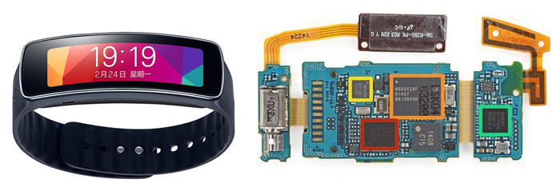
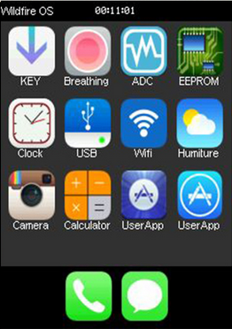
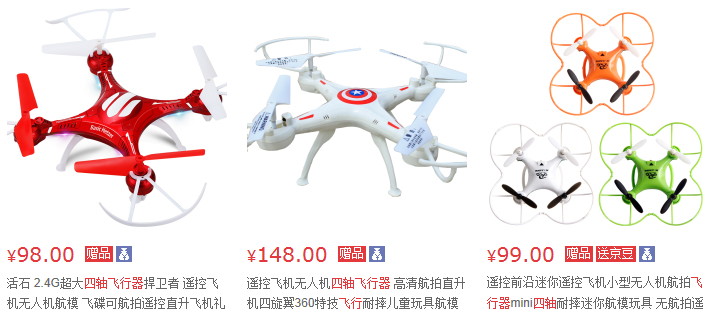
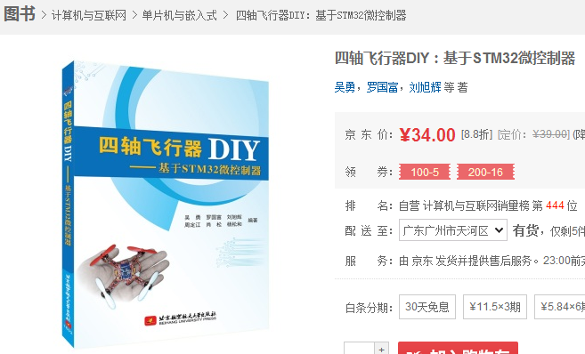
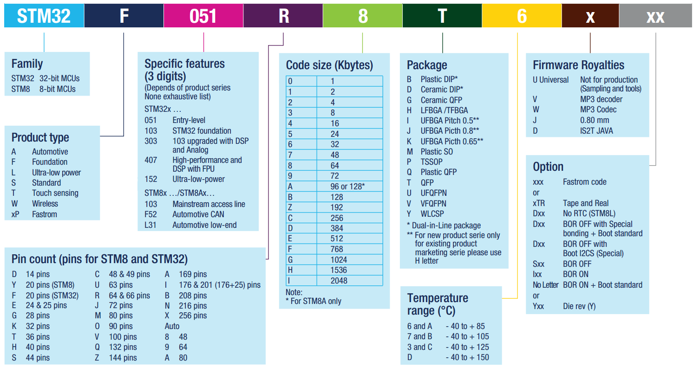
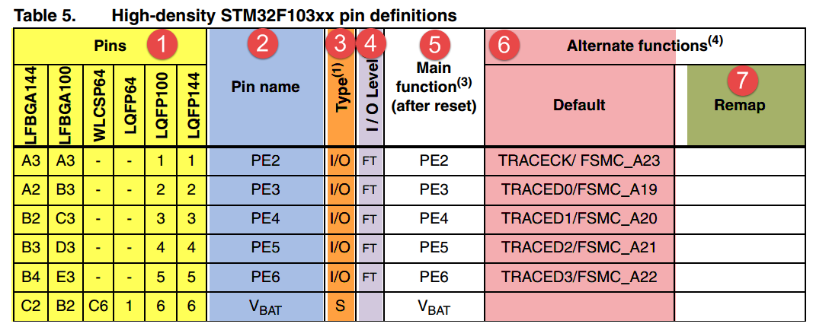

.. vim: syntax=rst

初识STM32
---------

本章参考资料：1、《STM8和STM32产品选型手册》

什么是STM32
~~~~~~~~~~~

STM32，从字面上来理解，ST是意法半导体，M是Microelectronics的缩写，32表示32位，合起来理解，STM32就是指ST公司开发的32位微控制器。在如今的32位控制器当中，STM32可以说是最璀璨的新星，它受宠若娇，大受工程师和市场的青睐，无芯能出其右。

STM32诞生的背景
^^^^^^^^^^^^^^^

51 是嵌入式学习中一款入门级的精典
MCU，因其结构简单，易于教学，且可以通过

串口编程而不需要额外的仿真器，所以在教学时被大量采用，至今很多大学在嵌入式教学
中用的还是 51。51 诞生于 70 年代，属于传统的 8
位单片机，如今，久经岁月的洗礼，既
有其辉煌又有其不足。现在的市场产品竞争越来越激烈，对成本极其敏感，相应地对
MCU 的
性能要求也更苛刻：更多功能，更低功耗，易用界面和多任务。面对这些要求，51
现有的
资源就显得得抓襟见肘。所以无论是高校教学还是市场需求，都急需一款新的 MCU
来 为这个领域注入新的活力。

基于这样的市场需求， ARM 公司推出了其全新的基于 ARMv7 架构的 32 位
Cortex-M3 微控制器内核。紧随其后，ST（意法半导体）公司就推出了基于
Cortex-M3 内核的 MCU—STM32。STM32
凭借其产品线的多样化、极高的性价比、简单易用的库开发方 式，迅速在众多
Cortex-M3 MCU 中脱颖而出，成为最闪亮的一颗新星。STM32 一上市就
迅速占领了中低端 MCU
市场，受到了市场和工程师的无比青睐，颇有星火燎原之势。

作为一名合格的嵌入式工程师，面对新出现的技术，我们不是充耳不闻，而是要尽快
吻合市场的需要，跟上技术的潮流。如今 STM32
的出现就是一种趋势，一种潮流，我们要
做的就是搭上这趟快车，让自己的技术更有竞争力。

STM32能做什么
~~~~~~~~~~~~~

STM32属于一个微控制器，自带了各种常用通信接口，比如USART、I2C、SPI等，可接非常多的传感器，可以控制很多的设备。现实生活中，我们接触到的很多电器产品都有STM32的身影，比如智能手环，微型四轴飞行器，平衡车、移动POST机，智能电饭锅，3D打印机等等。下面我们以最近最为火爆的两个产品来讲解下，一个是手环，一个是飞行器。

智能手环
^^^^^^^^

图 4‑1 三星 GearFit 智能手环

红圈：STM32F439ZIY6S处理器，2048KB FLASH ，256KB RAM ,WLCSP143封装。

橙圈：Macronix MX69V28F64 16
MB闪存，基于MCP封装的存储器，是一种包含了NOR和SRAM的闪存，这在手环手机这种移动设备中经常使用，优点是体积小，可以减小PCB的尺寸。这个闪存用的439的FSMC接口驱动。

黄圈：InvenSense MPU-6500陀螺仪/加速度计，用439的I2C接口驱动。

绿圈：博通BCM4334WKUBG芯片，支持802.11n，蓝牙4.0+HS以及FM接收芯片，用439的SDIO或者SPI接口驱动。

显示：1.84"可弯曲屏幕(Super AMOLED)，432 x
128像素。触摸部分用439的I2C接口驱动，OLED显示部分用LTDC接口驱动。

表格 4‑1 三星Gear Fit 和野火STM32f103“指南者”资源对比

======== ================================== ===============================
资源     三星Gear Fit                        指南者
CPU      STM32F439ZIY6S，WLCSP143封装        STM32F103VET6，LQPF100 封装
存储     NOR+SRAM 16MB，FSMC接口             串行FLASH 16MB ，SPI 接口
显示     1.84寸的 AMOLED，RGB接口，LTDC驱动   3.2寸电阻屏，FSMC接口
陀螺仪   MPU6050，I2C接口                    可外接MPU6050模块，I2C接口
无线通信 蓝牙:博通BCM4334，SDIO或者SPI接口     WIFI：ESP8266，UART接口
======== ================================== ===============================

除了这几个重要资源的对比，我们的指南者开发板上还板载了EEPROM，USB转串口，蜂鸣器，LED，普通按键，电容按键等外设资源，还可以扩展VS1053
MP3模块，W5500以太网模块，利用这些可以充分的学习STM32F103VET6这个芯片。在板子上面，还可以跑系统ucosiii，学习图形界面emwin。如果功夫所至，学完之后，自己都可以做一个类似Gear
Fit这样的手环。可很多人又会说，Gear Fit
涉及硬件和软件，整个系统这么复杂，并不是一个人可以完成的。说的没错，我们可以做不了，但是我们的能力可以无限接近，多学点，技多不压身嘛。

图 4‑2 ucosiii+emwin 做的系统界面（指南者的开机界面）

微型四轴飞行器
^^^^^^^^^^^^^^

现在无人机非常火热，高端的无人机用STM32做不来，但是小型的四轴飞行器用STM32还是绰绰有余的。如图
4‑3所示飞行器的基本都可以用STM32搞定。

图 4‑3 微型四轴飞行器

上面的是属于产品，如果想自己DIY，可以在入门STM32之后，买一本飞行器DIY的书，边做边学。入门级的书籍推荐《四轴飞行器DIY—基于STM32微控制器》，见图
4‑4。

图 4‑4 四轴飞行器DIY —基于STM32微控制器

淘宝众筹
^^^^^^^^

学会了STM32，想自己做产品，如何实现自己的梦想，淘宝众筹吧。做出产品原型，用别人的钱为自己的梦想买单。

淘宝众筹科技类网址：这里面有很多小玩意都可以用STM32实现，只要你的创意到了，就会有人买单，前提是我们要先学会STM32。

https://hi.taobao.com/market/hi/list.php?spm=a215p.1596646.1.8.LbVyJk#type=121288001

图 4‑5 淘宝众筹科技类

STM32怎么选型
~~~~~~~~~~~~~

STM32分类
^^^^^^^^^

STM32有很多系列，可以满足市场的各种需求，从内核上分有Cortex-M0、M3、M4和M7这几种，
每个内核又大概分为主流、高性能和低功耗。具体的见 表格4_2_。

单纯从学习的角度出发，可以选择F1和F4，F1代表了基础型，基于Cortex-M3内核，主频为72MHZ，F4代表了高性能，基于Cortex-M4内核，主频180M。

之于F1，F4（429系列以上）除了内核不同和主频的提升外，升级的明显特色就是带了LCD控制器和摄像头接口，支持SDRAM，这个区别在项目选型上会被优先考虑。但是从大学教学和用户初学来说，还是首选F1系列，目前在市场上资料最多，产品占有量最多的就是F1系列的STM32。

.. _表格4_2:

表格 4‑2 STM8和STM32分类

======= ========== ============ ====================
CPU位数 内核       系列         描述
32      Cortex-M0  STM32-F0     入门级
\           \       STM32-L0     低功耗
\       Cortex-M3    STM32-F1     基础型，主频72M
\            \      STM32-F2     高性能
\            \      STM32-L1     低功耗
\       Cortex-M4  STM32-F3     混和信号
\           \         STM32-F4     高性能，主频180M
\          \        STM32-L4     低功耗
\       Cortex-M7  STM32-F7     高性能
8       超级版6502   STM8S        标准系列
\          \        STM8AF       标准系列的汽车应用
\           \       STM8AL       低功耗的汽车应用
\          \        STM8L        低功耗
======= ========== ============ ====================

STM32 命名方法
^^^^^^^^^^^^^^

这里我们以野火F103指南者用的型号STM32F103VET6来讲解下STM32的命名方法。

表格 4‑3 STM32F103VET6命名解释

============= =================================================================================
\              STM32F103VET6
家族           STM32,表示32bit的MCU
产品类型       F表示基础型
具体特性       基础型
引脚数目       V表示100pin，其他常用的为C表示48，R表示64，Z表示144，Z表示144，B表示208，N表示216
FLASH大小      E表示512KB，其他常用的为C表示256，E表示512，I表示2048
封装           T表示QFP封装，这个是最常用的封装
温度           6表示温度等级为A：-40~85°
============= =================================================================================

有关更详细的命名方法见 图4_6_。

.. _图4_6:

图 4‑6 STM8和STM32命名方法，摘自《STM8和STM32选型手册》

选择合适的MCU
^^^^^^^^^^^^^

了解了STM32的分类和命名方法之后，就可以根据项目的具体需求先大概选择哪类内核的MCU，普通应用，不需要接大屏幕的一般选择Cortex-M3内核的F1系列，如果要追求高性能，需要大量的数据运算，且需要外接RGB大屏幕的则选择Cortex-M4内核的F429系列。

明确了大方向之后，接下来就是细分选型，先确定引脚，引脚多的功能就多，价格也贵，具体得根据实际项目中需要使用到什么功能，够用就好。确定好了引脚数目之后再选择FLASH大小，相同引脚数的MCU会有不同的FLASH大小可供选择，这个也是根据实际需要选择，程序大的就选择大点的FLASH，要是产品一量产，这些省下来的都是钱啊。有些月出货量以KK（百万数量级）为单位的产品，不仅是MCU，连电阻电容能少用就少用，更甚者连PCB的过孔的多少都有讲究。项目中的元器件的选型的水深的很，很多学问。

如何分配原理图IO
''''''''''''''''

在画原理图之前，一般的做法是先把引脚分类好，然后才开始画原理图，引脚分类具体见 表格4_4_。

.. _表格4_4:

表格 4‑4 画原理图时的引脚分类

=========================================== ====================================================================================
引脚分类                                    引脚说明说明
电源                                        (VBAT)、(VDD VSS)、(VDDA VSSA)、(VREF+ VREF-)等
晶振IO                                      主晶振IO，RTC晶振IO
下载IO                                      用于JTAG下载的IO：JTMS、JTCK、JTDI、JTDO、NJTRST
BOOT IO                                     BOOT0、BOOT1，用于设置系统的启动方式
复位IO                                      NRST，用于外部复位
  上面5部分IO组成的系统我们也叫做最小系统       \
GPIO                                        专用器件接到专用的总线，比如I2C，SPI，SDIO，FSMC，DCMI这些总线的器件需要接到专用的IO
\                                           普通的元器件接到GPIO，比如蜂鸣器，LED，按键等元器件用普通的GPIO即
\                                           如果还有剩下的IO，可根据项目需要引出或者不引出
=========================================== ====================================================================================

如何寻找IO的功能说明
''''''''''''''''''''

要想根据功能来分配IO，那就得先知道每个IO的功能说明，这个我们可以从官方的数据手册里面找到。在学习的时候，有两个官方资料我们会经常用到，一个是参考手册（英文叫Reference
manual），另外一个是数据手册（英文叫Data Sheet）。两者的具体区别见 表格4_5_。

.. _表格4_5:

表格 4‑5 参考手册和数据手册的内容区别

========  ==============================  ==================================================================================================
手册      主要内容                         说明
参考手册  片上外设的功能说明和寄存器描述     对片上每一个外设的功能和使用做了详细的说明，包含寄存器的详细描述。编程的时候需要反复查询这个手册。
数据手册  功能概览                         主要讲这个芯片有哪些功能，属于概括性的介绍。芯片选型的时候首先看这个部分。
\         引脚说明                         详细描述每一个引脚的功能，设计原理图的时候和写程序的时候需要参考这部分。
\         内存映射                         讲解该芯片的内存映射，列举每个总线的地址和包含有哪些外设。
\         封装特性                         讲解芯片的封装，包含每个引脚的长度宽度等，我们画PCB封装的时候需要参考这部分的参数。
========  ==============================  ==================================================================================================

一句话概括：数据手册主要用于芯片选型和设计原理图时参考，参考手册主要用于在编程的时候查阅。官方的这两个文档可以从官方网址里面下载：\ http://www.stmcu.org/document/list/index/category-150\ ，也可以从我们配置的光盘资料里面找到。

在数据手册中，有关引脚定义的部分在Pinouts and pin
description这个小节中，具体定义见 表格4_6_。

.. _表格4_6:

表格 4‑6 数据手册中对引脚定义

表格 4‑7 对引脚定义的解读

============  ========================================================================================================================  ======================
名称          缩写                                                                                                                      说明
1.引脚序号    阿拉伯数字表示LQFP封装，英文字母开头的表示BGA封装。引脚序号这里列出了有6种封装型号，具体使用哪一种要根据实际情况来选择。  \
2.引脚名称    指复位状态下的引脚名称                                                                                                    \
3.引脚类型    S                                                                                                                         电源引脚
\             I                                                                                                                         输入引脚
\             I/O                                                                                                                       输入/输出引脚
4.I/O结构     FT                                                                                                                        兼容5V
\             TTa                                                                                                                       只支持3V3，且直接到ADC
\             B                                                                                                                         BOOT引脚
\             RST                                                                                                                       复位引脚，内部带弱上拉
5.主功能      每个引脚复位后的功能                                                                                                      \
6.复用功能    这里指的是IO的默认的复用功能                                                                                              \
7.重映射功能  IO除了默认的复用功能之外，还可以通过重映射的方法映射到其他的IO，这样可以增加IO口功能的多样性和灵活性。                    \
============  ========================================================================================================================  ======================

开始分配原理图IO
''''''''''''''''

比如我们的F103“指南者”使用的MCU型号是STM32F103VET6，封装为LQFP100，我们在数据手册中找到这个封装的引脚定义，然后根据引脚序号，一个一个复制出来，
整理成excel表。具体整理方法按照 表格4_4_ 画原理图时的引脚分类即可。分配好之后就开始画原理图。

PCB哪里打样
^^^^^^^^^^^

设计好原理图，画好PCB之后，需要把板子做出来，进行软硬件联调。首先得PCB打样，这里我推荐一家我经常打样的厂家，深圳嘉立创（JLC），行业标杆，良心价格，网址：\ http://www.sz-jlc.com\ 。一块10CM*10CM以内的板子，三天做好，50块就可以搞定，还包邮，简直便宜到掉渣。如果你足够懒，不想自己焊接电阻电容二三极管什么的，嘉立创还可以帮你把PCB样板上的阻容贴好给你，打样贴片一条龙。

样品做好了，软硬件什么都OK，要小批量怎么办？还是找JLC。
