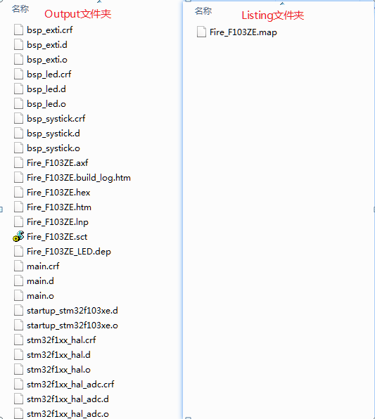
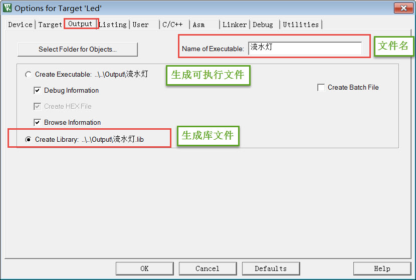
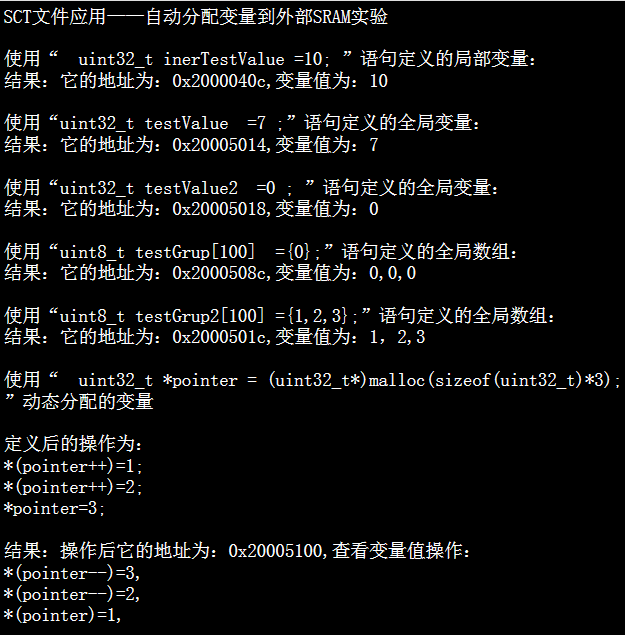

MDK的编译过程及文件类型全解
---------------------------

本章参考资料：MDK的帮助手册《ARM Development
Tools》，点击MDK界面的“help->uVision
Help”菜单可打开该文件。关于ELF文件格式，参考配套资料里的《ELF文件格式》文件。

在本章中讲解了非常多的文件类型，学习时请跟着教程的节奏，打开实际工程中的文件来了解。

相信您已经非常熟练地使用MDK创建应用程序了，平时使用MDK编写源代码，然后编译生成机器码，再把机器码下载到STM32芯片上运行，但是这个编译、下载的过程MDK究竟做了什么工作？它编译后生成的各种文件又有什么作用？本章节将对这些过程进行讲解，了解编译及下载过程有助于理解芯片的工作原理，这些知识对制作IAP(bootloader)以及读写控制器内部FLASH的应用时非常重要。

编译过程
~~~~~~~~~~~~~~

编译过程简介
''''''''''''''''''''''''''''''''''''

首先我们简单了解下MDK的编译过程，它与其它编译器的工作过程是类似的，该过程见
图40_1_。

.. image:: media/image2.jpeg
   :align: center
   :alt: 图 40‑1 MDK编译过程
   :name: 图40_1

编译过程生成的不同文件将在后面的小节详细说明，此处先抓住主要流程来理解。

(1) 编译，MDK软件使用的编译器是armcc和armasm，它们根据每个c/c++和汇编源文件编译成对应的以“.o”为后缀名的对象文件(Object
    Code，也称目标文件)，其内容主要是从源文件编译得到的机器码，包含了代码、数据以及调试使用的信息；

(2) 链接，链接器armlink把各个.o文件及库文件链接成一个映像文件“.axf”或“.elf”；

(3) 格式转换，一般来说Windows或Linux系统使用链接器直接生成可执行映像文件elf后，内核根据该文件的信息加载后，
    就可以运行程序了，但在单片机平台上，需要把该文件的内容加载到芯片上，所以还需要对链接器生成的elf映像文件利用格式转换器fromelf转换成“.bin”或“.hex”文件，交给下载器下载到芯片的FLASH或ROM中。

具体工程中的编译过程
''''''''''''''''''''''''''''''''''''

下面我们打开
“多彩流水灯”的工程，以它为例进行讲解，其它工程的编译过程也是一样的，只是文件有差异。打开工程后，点击MDK的“rebuild”按钮，它会重新构建整个工程，构建的过程会在MDK下方的“Build
Output”窗口输出提示信息，见 图40_2_。

图 40‑2 编译工程时的编译提示

构建工程的提示输出主要分6个部分，说明如下：

(1) 提示信息的第一部分说明构建过程调用的编译器。图中的编译器名字是“V5.06(build
    20)”，后面附带了该编译器所在的文件夹。在电脑上打开该路径，可看到该编译器包含
    图40_3_ 中的各个编译工具，如armar、armasm、armcc、armlink及fromelf，后面四个工具已在
    图40_1_ 中已讲解，而armar是用于把.o文件打包成lib文件的。

图 40‑3 编译工具

(2) 使用armasm编译汇编文件。图中列出了编译startup启动文件时的提示，编译后每个汇编源文件都对应有一个独立的.o文件。

(3) 使用armcc编译c/c++文件。图中列出了工程中所有的c/c++文件的提示，同样地，编译后每个c/c++源文件都对应有一个独立的.o文件。

(4) 使用armlink链接对象文件，根据程序的调用把各个.o文件的内容链接起来，最后生成程序的axf映像文件，并
    附带程序各个域大小的说明，包括Code、RO-data、RW-data及ZI-data的大小。

(5) 使用fromelf生成下载格式文件，它根据axf映像文件转化成hex文件，并列出编译过程出现的错误(Error)和警告(Warning)数量。

(6) 最后一段提示给出了整个构建过程消耗的时间。

构建完成后，可在工程的“Output”及“Listing”目录下找到由以上过程生成的各种文件，见
图40_4_。

图 40‑4 编译后Output及Listing文件夹中的内容

可以看到，每个C源文件都对应生成了.o、.d及.crf后缀的文件，还有一些额外的.dep、.hex、.axf、.htm、.lnp、.sct、.lst及.map文件。

程序的组成、存储与运行
~~~~~~~~~~~~~~~~~~~~~~~~

CODE、RO、RW、ZI Data域及堆栈空间
''''''''''''''''''''''''''''''''''''

在工程的编译提示输出信息中有一个语句“Program Size：Code=xx RO-data=xx
RW-data=xx
ZI-data=xx”，它说明了程序各个域的大小，编译后，应用程序中所有具有同一性质的数据(包括代码)被归到一个域，程序在存储或运行的时候，不同的域会呈现不同的状态，这些域的意义如下：

-  Code：即代码域，它指的是编译器生成的机器指令，这些内容被存储到ROM区。

-  RO-data：Read Only
   data，即只读数据域，它指程序中用到的只读数据，这些数据被存储在ROM区，因而程序不能修改其内容。例如C语言中const关键字定义的变量就是典型的RO-data。

-  RW-data：Read Write
   data，即可读写数据域，它指初始化为“非0值”的可读写数据，程序刚运行时，这些数据具有非0的初始值，且运行的时候它们会常驻在RAM区，因而应用程序可以修改其内容。例如C语言中使用定义的全局变量，且定义时赋予“非0值”给该变量进行初始化。

-  ZI-data：Zero Initialie
   data，即0初始化数据，它指初始化为“0值”的可读写数据域，它与RW-data的区别是程序刚运行时这些数据初始值全都为0，而后续运行过程与RW-data的性质一样，它们也常驻在RAM区，因而应用程序可以更改其内容。例如C语言中使用定义的全局变量，且定义时赋予“0值”给该变量进行初始化(若定义该变量时没有赋予初始值，编译器会把它当ZI-data来对待，初始化为0)；

-  ZI-data的栈空间(Stack)及堆空间(Heap)：在C语言中，函数内部定义的局部变量属于栈空间，进入函数的时候从向栈空间申请内存给局部变
   量，退出时释放局部变量，归还内存空间。而使用malloc动态分配的变量属于堆空间。在程序中的栈空间和堆空间都是属于ZI-data区域的，这些空间都会被初始值化为0值。编译器给出的ZI-data占用的空间值中包含了堆栈的大小(经实际测试，若程序中完全没有使用malloc动态申请堆空间，编译器会优化，不把堆空间计算在内)。

..

   综上所述，以程序的组成构件为例，它们所属的区域类别见表 40‑1。

   表 40‑1 程序组件所属的区域

======================== =============
程序组件                 所属类别
机器代码指令             Code
常量                     RO-data
初值非0的全局变量        RW-data
初值为0的全局变量        ZI-data
局部变量                 ZI-data栈空间
使用malloc动态分配的空间 ZI-data堆空间
======================== =============

程序的存储与运行
''''''''''''''''''''

RW-data和ZI-data它们仅仅是初始值不一样而已，为什么编译器非要把它们区分开？这就涉及到程序的存储状态了，应用程序具有静止状
态和运行状态。静止态的程序被存储在非易失存储器中，如STM32的内部FLASH，因而系统掉电后也能正常保存。但是当程序在运行状态的时候，
程序常常需要修改一些暂存数据，由于运行速度的要求，这些数据往往存放在内存中(RAM)，掉电后这些数据会丢失。因此，程序在静止与运行的时
候它在存储器中的表现是不一样的，见 图40_5_。

.. image:: media/image6.jpeg
   :align: center
   :alt: 图 40‑5 应用程序的加载视图与执行视图
   :name: 图40_5

图中的左侧是应用程序的存储状态，右侧是运行状态，而上方是RAM存储器区域，下方是ROM存储器区域。

程序在存储状态时，RO节(RO
section)及RW节都被保存在ROM区。当程序开始运行时，内核直接从ROM中读取代码，并且在执行主体代码前，会先执行一段加载代码，它把RW节数据从ROM复制到RAM，
并且在RAM加入ZI节，ZI节的数据都被初始化为0。加载完后RAM区准备完毕，正式开始执行主体程序。

编译生成的RW-data的数据属于图中的RW节，ZI-data的数据属于图中的ZI节。是否需要掉电保存，这就是把RW-data与ZI-data区别开来的原因，因为在RAM创建数据的时候，默认值为0，但如果有的数据要求初值非0，那就需要使用ROM记录该初始值，运行时再复制到RAM。

STM32的RO区域不需要加载到SRAM，内核直接从FLASH读取指令运行。计算机系统的应用程序运行过程很类似，不过计算机系统的程序在存储状态时位于硬盘，执行的时候甚至会把上述的RO区域(代码、只读数据)加载到内存，加快运行速度，还有虚拟内存管理单元(MMU)辅助加载数据，使得可以运行比物理内存还大的应用程序。而STM32没有MMU，所以无法支持Linux和Windows系统。

当程序存储到STM32芯片的内部FLASH时(即ROM区)，它占用的空间是Code、RO-data及RW-data的总和，所以如果这些内容比STM32芯片的FLASH空间大，程序就无法被正常保存了。当程序在执行的时候，需要占用内部SRAM空间(即RAM区)，占用的空间包括RW-data和ZI-data。应用程序在各个状态时各区域的组成见表
40‑2。

   表 40‑2 程序状态区域的组成

========================== ========================
程序状态与区域             组成
程序执行时的只读区域(RO)   Code + RO data
程序执行时的可读写区域(RW) RW data + ZI data
程序存储时占用的ROM区      Code + RO data + RW data
========================== ========================

在MDK中，我们建立的工程一般会选择芯片型号，选择后就有确定的FLASH及SRAM大小，若代码超出了芯片的存储器的极限，编译器会提示错误，这时就需要裁剪程序了，裁剪时可针对超出的区域来优化。

编译工具链
~~~~~~~~~~

在前面编译过程中，MDK调用了各种编译工具，平时我们直接配置MDK，不需要学习如何使用它们，但了解它们是非常有好处的。例如，若希望使用MDK编译生成bin文件的，需要在MDK中输入指令控制fromelf工具；在本章后面讲解AXF及O文件的时候，需要利用fromelf工具查看其文件信息，这都是无法直接通过MDK做到的。关于这些工具链的说明，在MDK的帮助手册《ARM
Development Tools》都有详细讲解，点击MDK界面的“help->uVision
Help”菜单可打开该文件。

设置环境变量
''''''''''''''''''''''

调用这些编译工具，需要用到Windows的“命令行提示符工具”，为了让命令行方便地找到这些工具，我们先把工具链的目录添加到系统的环境变量中。查看本机工具链所在的具体目录可根据上一小节讲解的工程编译提示输出信息中找到，如本机的路径为“D:\work\keil5\ARM\ARMCC\bin”。

添加路径到PATH环境变量
.......................

本文以Win7系统为例添加工具链的路径到PATH环境变量，其它系统是类似的。

(1) 右键电脑系统的“计算机图标”，在弹出的菜单中选择“属性”，见 图40_6_；

.. image:: media/image7.jpeg
   :align: center
   :alt: 图 40‑6 计算机属性页面
   :name: 图40_6

图 40‑6 计算机属性页面

(2) 在弹出的属性页面依次点击“高级系统设置”->“环境变量”，在用户变量一栏中找到名为“PATH”的变量，若没有该变量，则新建一个。编辑“PATH”变量，
    在它的变量值中输入工具链的路径，如本机的是“;D:\work\keil5\ARM\ARMCC\bin”，注意要使用“分号;”让它与其它路径分隔开，输入完毕后依次点确定，
    见 图40_7_；

.. image:: media/image8.jpeg
   :align: center
   :alt: 图 40‑7 添加工具链路径到PATH变量
   :name: 图40_7

图 40‑7 添加工具链路径到PATH变量

(3) 打开Windows的命令行，点击系统的“开始菜单”，在搜索框输入“cmd”，在搜索结果中点击“cmd.exe”即可打开命令行，见
    图40_8_；

.. image:: media/image9.jpeg
   :align: center
   :alt: 图 40‑8 打开命令行
   :name: 图40_8

图 40‑8 打开命令行

(4) 在弹出的命令行窗口中输入“fromelf”回车，若窗口打印出formelf的帮助说明，那么路径正常，就可以开始后面的工作了；
    若提示“不是内部名外部命令，也不是可运行的程序…”信息，说明路径不对，请重新配置环境变量，并确认该工作目录下有编译工具链。

这个过程本质就是让命令行通过“PATH”路径找到“fromelf.exe”程序运行，默认运行“fromelf.exe”时它会输出自己的帮助信
息，这就是工具链的调用过程，MDK本质上也是如此调用工具链的，只是它集成为GUI，相对于命令行对用户更友好，毕竟上述
配置环境变量的过程已经让新手烦躁了。

armcc、armasm及armlink
'''''''''''''''''''''''''

接下来我们看看各个工具链的具体用法，主要以armcc为例。

armcc
.........

armcc用于把c/c++文件编译成ARM指令代码，编译后会输出ELF格式的O文件(对象、目标文件)，在命令行中输入“armcc”回车可调用该工具，它会打印帮助说明，见
图40_9_

图 40‑9 armcc的帮助提示

帮助提示中分三部分，第一部分是armcc版本信息，第二部分是命令的用法，第三部分是主要命令选项。

根据命令用法： armcc [options] file1 file2 ... filen
，在[option]位置可输入下面的“--arm”、“--cpu
list”选项，若选项带文件输入，则把文件名填充在file1
file2…的位置，这些文件一般是c/c++文件。

例如根据它的帮助说明，“--cpu
list”可列出编译器支持的所有cpu，我们在命令行中输入“armcc --cpu
list”，可查看 图40_10_ 中的cpu列表。

.. image:: media/image11.jpeg
   :align: center
   :alt: 图 40‑10 cpulist
   :name: 图40_10

图 40‑10 cpulist

打开MDK的Options for Targe->c/c++菜单，可看到MDK对编译器的控制命令，见
图40_11_。

图 40‑11 MDK的ARMCC编译选项

从该图中的命令可看到，它调用了-c、-cpu –D –g
–O1等编译选项，当我们修改MDK的编译配置时，可看到该控制命令也会有相应的变化。然而我们无法在该编译选项框中输入命令，只能通过MDK提供的选项修改。

了解这些，我们就可以查询具体的MDK编译选项的具体信息了，如c/c++选项中的“Optimization：Leve
1（-O1）”是什么功能呢？首先可了解到它是“-O”命令，命令后还带个数字，查看MDK的帮助手册，在armcc编译器说明章节，可详细了解，如
图40_9_。

.. image:: media/image13.jpeg
   :align: center
   :alt: 图 40‑12 编译器选项说明
   :name: 图40_12

图 40‑12 编译器选项说明

利用MDK，我们一般不需要自己调用armcc工具，但经过这样的过程我们就会对MDK有更深入的认识，面对它的各种编译选项，就不会那么头疼了。

armasm
..........

armasm是汇编器，它把汇编文件编译成O文件。与armcc类似，MDK对armasm的调用选项可在“Option
for Target->Asm”页面进行配置，见 图40_13_。

图 40‑13 armasm与MDK的编译选项

armlink
..........

armlink是链接器，它把各个O文件链接组合在一起生成ELF格式的AXF文件，AXF文件是可执行的，下载器把该文件中的指令代码下载到芯片后，该芯片就能运行程序了；利用armlink还可以控制程序存储到指定的ROM或RAM地址。在MDK中可在“Option
for Target->Linker”页面配置armlink选项，见 图40_14_。

图 40‑14 armlink与MDK的配置选项

链接器默认是根据芯片类型的存储器分布来生成程序的，该存储器分布被记录在工程里的sct后缀的文件中，有特殊需要的话可自行编辑该文件，改变链接器的链接方式，具体后面我们会详细讲解。

armar、fromelf及用户指令
''''''''''''''''''''''''''''''

armar工具用于把工程打包成库文件，fromelf可根据axf文件生成hex、bin文件，hex和bin文件是大多数下载器支持的下载文件格式。

在MDK中，针对armar和fromelf工具的选项几乎没有，仅集成了生成HEX或Lib的选项，见
图40_15_。

.. image:: media/image16.png
   :align: center
   :alt: 图 40‑15 MDK中，控制fromelf生成hex及控制armar生成lib的配置
   :name: 图40_15

图 40‑15 MDK中，控制fromelf生成hex及控制armar生成lib的配置

例如如果我们想利用fromelf生成bin文件，可以在MDK的“Option for
Target->User”页中添加调用fromelf的指令，见 图40_16_。

.. image:: media/image17.png
   :align: center
   :alt: 图 40‑16 在MDK中添加指令
   :name: 图40_16

图 40‑16 在MDK中添加指令

在User配置页面中，提供了三种类型的用户指令输入框，在不同组的框输入指令，可控制指令的执行时间，分别是编译前(Before
Compile c/c++ file)、构建前(Before Build/Rebuild)及构建后(After
Build/Rebuild)执行。这些指令并没有限制必须是arm的编译工具链，例如如果您自己编写了python脚本，也可以在这里输入用户指令执行该脚本。

图中的生成bin文件指令调用了fromelf工具，紧跟后面的是工具的选项及输出文件名、输入文件名。由于fromelf是根据axf文件生成bin的，而axf文件又是构建(build)工程后才生成，所以我们把该指令放到“After
Build/Rebuild”一栏。

MDK工程的文件类型
~~~~~~~~~~~~~~~~~

除了上述编译过程生成的文件，MDK工程中还包含了各种各样的文件，下面我们统一介绍，MDK工程的常见文件类型见表
40‑3。

   表 40‑3 MDK常见的文件类型(不分大小写)

======================= ========================================================================================================================
后缀                    说明
Project目录下的工程文件
\*.uvguix               MDK5工程的窗口布局文件，在MDK4中*.UVGUI后缀的文件功能相同
\*.uvprojx              MDK5的工程文件，它使用了XML格式记录了工程结构，双击它可以打开整个工程，在MDK4中*.UVPROJ后缀的文件功能相同
\*.uvoptx               MDK5的工程配置选项，包含debugger、trace configuration、breakpooints以及当前打开的文件，在MDK4中*.UVOPT后缀的文件功能相同
\*.ini                  某些下载器的配置记录文件
源文件                 
\*.c                    C语言源文件
\*.cpp                  C++语言源文件
\*.h                    C/C++的头文件
\*.s                    汇编语言的源文件
\*.inc                  汇编语言的头文件(使用“$include”来包含)
Output目录下的文件     
\*.lib                  库文件
\*.dep                  整个工程的依赖文件
\*.d                    描述了对应.o的依赖的文件
\*.crf                  交叉引用文件，包含了浏览信息(定义、引用及标识符)
\*.o                    可重定位的对象文件(目标文件)
\*.bin                  二进制格式的映像文件，是纯粹的FLASH映像，不含任何额外信息
\*.hex                  Intel Hex格式的映像文件，可理解为带存储地址描述格式的bin文件
\*.elf                  由GCC编译生成的文件，功能跟axf文件一样，该文件不可重定位
\*.axf                  由ARMCC编译生成的可执行对象文件，可用于调试，该文件不可重定位
\*.sct                  链接器控制文件(分散加载)
\*.scr                  链接器产生的分散加载文件
\*.lnp                  MDK生成的链接输入文件，用于调用链接器时的命令输入
\*.htm                  链接器生成的静态调用图文件
\*.build_log.htm        构建工程的日志记录文件
Listing目录下的文件    
\*.lst                  C及汇编编译器产生的列表文件
\*.map                  链接器生成的列表文件，包含存储器映像分布
其它                   
\*.ini                  仿真、下载器的脚本文件
======================= ========================================================================================================================

这些文件主要分为MDK相关文件、源文件以及编译、链接器生成的文件。我们以“多彩流水灯”工程为例讲解各种文件的功能。

uvprojx、uvoptx及uvguix工程文件
'''''''''''''''''''''''''''''''''

在工程的“Project”目录下主要是MDK工程相关的文件，见 图40_17_。

.. image:: media/image18.png
   :align: center
   :alt: 图 40‑17 Project目录下的uvprojx、uvoptx及uvgui文件
   :name: 图40_17

图 40‑17 Project目录下的uvprojx、uvoptx及uvgui文件

uvprojx文件
..............

uvprojx文件就是我们平时双击打开的工程文件，它记录了整个工程的结构，如芯片类型、工程包含了哪些源文件等内容，见
图40_18_。

图 40‑18 工程包含的文件、芯片类型等内容

uvoptx文件
...............

uvoptx文件记录了工程的配置选项，如下载器的类型、变量跟踪配置、断点位置以及当前已打开的文件等等，见
图40_19_。

.. image:: media/image20.png
   :align: center
   :alt: 图 40‑19 工程中选择使用的下载器类型
   :name: 图40_19

图 40‑19 工程中选择使用的下载器类型

uvguix文件
..............

uvguix文件记录了MDK软件的GUI布局，如代码编辑区窗口的大小、编译输出提示窗口的位置等等。

图 40‑20 记录MDK工作环境中各个窗口的大小

uvprojx、uvoptx及uvguix都是使用XML格式记录的文件，若使用记事本打开可以看到XML代码，见
图40_21_。而当使用MDK软件打开时，它根据这些文件的XML记录加载工程的各种参数，使得我们每次重新打开工程时，都能恢复上一次的工作环境。

.. image:: media/image22.jpeg
   :align: center
   :alt: 图 40‑21 使用记事本打开uvprojx、uvoptx及uvguix文件可看到XML格式的记录
   :name: 图40_21

图 40‑21 使用记事本打开uvprojx、uvoptx及uvguix文件可看到XML格式的记录

这些工程参数都是当MDK正常退出时才会被写入保存，所以若MDK错误退出时(如使用Windows的任务管理器强制关闭)，工程配置参数的最新更改是不会被记录的，重新打开工程时要再次配置。根据这几个文件的记录类型，可以知道uvprojx文件是最重要的，删掉它我们就无法再正常打开工程了，而uvoptx及uvguix文件并不是必须的，可以删除，重新使用MDK打开uvprojx工程文件后，会以默认参数重新创建uvoptx及uvguix文件。(所以当使用Git/SVN等代码管理的时候，往往只保留uvprojx文件)

源文件
''''''''''

源文件是工程中我们最熟悉的内容了，它们就是我们编写的各种源代码，MDK支持c、cpp、h、s、inc类型的源代码文件，其中c、cpp分别是c/c++语言的源代码，h是它们的头文件，s是汇编文件，inc是汇编文件的头文件，可使用“$include”语法包含。编译器根据工程中的源文件最终生成机器码。

Output目录下生成的文件
'''''''''''''''''''''''

点击MDK中的编译按钮，它会根据工程的配置及工程中的源文件输出各种对象和列表文件，在工程的“Options
for Targe->Output->Select Folder for Objects”和“Options for
Targe->Listing->Select Folder for Listings”选项配置它们的输出路径，见
图40_22_ 和 图40_23_。

图 40‑22 设置Output输出路径

图 40‑23设置Listing输出路径

编译后Output和Listing目录下生成的文件见 图40_24_。

图 40‑24 编译后Output及Listing文件夹中的内容

接下来我们讲解Output路径下的文件。

lib库文件
..............

在某些场合下我们希望提供给第三方一个可用的代码库，但不希望对方看到源码，这个时候我们就可以把工程生成lib文件(Library
file)提供给对方，在MDK中可配置“Options for Target->Create
Library”选项把工程编译成库文件，见 图40_25_。

图 40‑25 生成库文件或可执行文件

工程中生成可执行文件或库文件只能二选一，默认编译是生成可执行文件的，可执行文件即我们下载到芯片上直接运行的机器码。

得到生成的*.lib文件后，可把它像C文件一样添加到其它工程中，并在该工程调用lib提供的函数接口，除了不能看到*.lib文件的源码，在应用方面它跟C源文件没有区别。

dep、d依赖文件
..............

\*.dep和*.d文件(Dependency
file)记录的是工程或其它文件的依赖，主要记录了引用的头文件路径，其中*.dep是整个工程的依赖，它以工程名命名，而*.d是单个源文件的依赖，
它们以对应的源文件名命名。这些记录使用文本格式存储，我们可直接使用记事本打开，见 图40_26_ 和 图40_27_。

图 40‑26 工程的dep文件内容

图 40‑27 bsp_led.d文件的内容

crf交叉引用文件
.................

\*.crf是交叉引用文件(Cross-Reference file)，它主要包含了浏览信息(browse
information)，即源代码中的宏定义、变量及函数的定义和声明的位置。

我们在代码编辑器中点击“Go To Definition Of ‘xxxx’”可实现浏览跳转，见
图40_28_，跳转的时候，MDK就是通过*.crf文件查找出跳转位置的。

图 40‑28 浏览信息

通过配置MDK中的“Option for Target->Output->Browse
Information”选项可以设置编译时是否生成浏览信息，见
图40_29_。只有勾选该选项并编译后，才能实现上面的浏览跳转功能。

图 40‑29 在Options forTarget中设置是否生成浏览信息

\*.crf文件使用了特定的格式表示，直接用文本编辑器打开会看到大部分乱码，见
图40_30_，我们不作深入研究。

图 40‑30 crf文件内容

o、axf及elf文件
.................

\*.o、*.elf、*.axf、*.bin及*.hex文件都存储了编译器根据源代码生成的机器码，根据应用场合的不同，它们又有所区别。

ELF文件说明
================

\*.o、*.elf、*.axf以及前面提到的lib文件都是属于目标文件，它们都是使用ELF格式来存储的，关于ELF格式的详细内容请参考配套资料里的《ELF文件格式》文档了解，它讲解的是Linux下的ELF格式，与MDK使用的格式有小区别，但大致相同。在本教程中，仅讲解ELF文件的核心概念。

ELF是Executable and Linking
Format的缩写，译为可执行链接格式，该格式用于记录目标文件的内容。在Linux及Windows系统下都有使用该格式的文件(或类似格式)用于记录应用程序的内容，告诉操作系统如何链接、加载及执行该应用程序。

目标文件主要有如下三种类型：

(1) 可重定位的文件(Relocatable
    File)，包含基础代码和数据，但它的代码及数据都没有指定绝对地址，因此它适合于与其他目标文件链接来创建可执行文件或者共享目标文件。 这种文件一般由编译器根据源代码生成。

..

   例如MDK的armcc和armasm生成的*.o文件就是这一类，另外还有Linux的*.o
   文件，Windows的 \*.obj文件。

(2) 可执行文件(Executable File)
    ，它包含适合于执行的程序，它内部组织的代码数据都有固定的地址(或相对于基地址的偏移)，系统可根据这些地址信息把程序加载到内存执行。这种文件一般由链接器根据可重定位文件链接而成，它主要是组织各个可重定位文件，给它们的代码及数据一一打上地址标号，固定其在程序内部的位置，链接后，程序内部各种代码及数据段不可再重定位(即不能再参与链接器的链接)。

..

   例如MDK的armlink生成的*.elf及*.axf文件，(使用gcc编译工具可生成*.elf文件，用armlink生成的是*.axf文件，*.axf文件在*.elf之外，增加了调试使用的信息，其余区别不大，后面我们仅讲解*.axf文件)，另外还有Linux的/bin/bash文件，Windows的*.exe文件。

(3) 共享目标文件(Shared Object
    File)， 它的定义比较难理解，我们直接举例，MDK生成的*.lib文件就属于共享目标文件，它可以继续参与链接，加入到可执行文件之中。另外，Linux的.so，如/lib/
    glibc-2.5.so，Windows的DLL都属于这一类。

o文件与axf文件的关系
=======================

根据上面的分类，我们了解到，*.axf文件是由多个*.o文件链接而成的，而*.o文件由相应的源文件编译而成，一个源文件对应一个*.o文件。它们的关系见
图40_31_。

.. image:: media/image31.jpeg
   :align: center
   :alt: 图 40‑31*.axf文件与*.o文件的关系
   :name: 图40_31

图 40‑31*.axf文件与*.o文件的关系

图中的中间代表的是armlink链接器，在它的右侧是输入链接器的*.o文件，左侧是它输出的*axf文件。

可以看到，由于都使用ELF文件格式，*.o与*.axf文件的结构是类似的，它们包含ELF文件头、程序头、节区(section)以及节区头部表。各个部分的功能说明如下：

-  ELF文件头用来描述整个文件的组织，例如数据的大小端格式，程序头、节区头在文件中的位置等。

-  程序头告诉系统如何加载程序，例如程序主体存储在本文件的哪个位置，程序的大小，程序要加载到内存什么地址等等。
   MDK的可重定位文件*.o不包含这部分内容，因为它还不是可执行文件，而armlink输出的*.axf文件就包含该内容了。

-  节区是*.o文件的独立数据区域，它包含提供给链接视图使用的大量信息，如指令(Code)、数据(RO、RW、ZI-data)、
   符号表(函数、变量名等)、重定位信息等，例如每个由C语言定义的函数在*.o文件中都会有一个独立的节区；

-  存储在最后的节区头则包含了本文件节区的信息，如节区名称、大小等等。

总的来说，链接器把各个*.o文件的节区归类、排列，根据目标器件的情况编排地址生成输出，汇总到*.axf文件。例如，见
图40_32_，“多彩流水灯”工程中在“bsp_led.c”文件中有一个LED_GPIO_Config函数，而它内部调用了“stm32f1xx_hal_gpio.c”的GPIO_Init函数，经过armcc编译后，LED_GPIO_Config及GPIO_Iint函数都成了指令代码，分别存储在bsp_led.o及stm32f1xx_hal_gpio.o文件中，这些指令在*.o文件都没有指定地址，仅包含了内容、大小以及调用的链接信息，而经过链接器后，链接器给它们都分配了特定的地址，并且把地址根据调用指向链接起来。

.. image:: media/image32.jpeg
   :align: center
   :alt: 图 40‑32 具体的链接过程
   :name: 图40_32

图 40‑32 具体的链接过程

ELF文件头
==============

接下来我们看看具体文件的内容，使用fromelf文件可以查看*.o、*.axf及*.lib文件的ELF信息。

使用命令行，切换到文件所在的目录，输入“fromelf –text –v
bsp_led.o”命令，可控制输出bsp_led.o的详细信息，见 图40_33_。
利用“-c、-z”等选项还可输出反汇编指令文件、代码及数据文件等信息，请亲手尝试一下。

图 40‑33 使用fromelf查看o文件信息

为了便于阅读，我已使用fromelf指令生成了“多彩流水灯.axf”、“bsp_led.o”及“多彩流水灯.lib”的ELF信息，并已把这些信息保存在独立的文件中，
在配套资料的“elf信息输出”文件夹下可查看，见表40‑4。

   表 40‑4 配套资料里使用fromelf生成的文件

=========== ==================== ====================================================
fromelf选项 可查看的信息         生成到配套资料里相应的文件
-v          详细信息             bsp_led_o_elfInfo_v.txt/多彩流水灯_axf_elfInfo_v.txt
-a          数据的地址           bsp_led_o_elfInfo_a.txt/多彩流水灯_axf_elfInfo_a.txt
-c          反汇编代码           bsp_led_o_elfInfo_c.txt/多彩流水灯_axf_elfInfo_c.txt
-d          data section的内容   bsp_led_o_elfInfo_d.txt/多彩流水灯_axf_elfInfo_d.txt
-e          异常表               bsp_led_o_elfInfo_e.txt/多彩流水灯_axf_elfInfo_e.txt
-g          调试表               bsp_led_o_elfInfo_g.txt/多彩流水灯_axf_elfInfo_g.txt
-r          重定位信息           bsp_led_o_elfInfo_r.txt/多彩流水灯_axf_elfInfo_r.txt
-s          符号表               bsp_led_o_elfInfo_s.txt/多彩流水灯_axf_elfInfo_s.txt
-t          字符串表             bsp_led_o_elfInfo_t.txt/多彩流水灯_axf_elfInfo_t.txt
-y          动态段内容           bsp_led_o_elfInfo_y.txt/多彩流水灯_axf_elfInfo_y.txt
-z          代码及数据的大小信息 bsp_led_o_elfInfo_z.txt/多彩流水灯_axf_elfInfo_z.txt
=========== ==================== ====================================================

直接打开“elf信息输出”目录下的bsp_led_o_elfInfo_v.txt文件，可看到
代码清单40_1_ 中的内容。

.. code-block:: guess
   :caption: 代码清单 40‑1 bsp_led.o文件的ELF文件头(可到“bsp_led_o_elfInfo_v.txt”文件查看)
   :name: 代码清单40_1

   ========================================================================

   ** ELF Header Information

   File Name:
   bsp_led.o       //bsp_led.o文件

   Machine class: ELFCLASS32 (32-bit)  //32位机
      Data encoding: ELFDATA2LSB (Little endian) //小端格式
      Header version: EV_CURRENT (Current version)
      Operating System ABI: none
      ABI Version: 0
      File Type: ET_REL (Relocatable object) (1) //可重定位类型
      Machine: EM_ARM (ARM)

      Entry offset (in SHF_ENTRYSECT section): 0x00000000
      Flags: None (0x05000000)

      ARM ELF revision: 5 (ABI version 2)

      Header size: 52 bytes (0x34)
      Program header entry size: 0 bytes (0x0)  //程序头大小
      Section header entry size: 40 bytes (0x28)

      Program header entries: 0
      Section header entries: 178

      Program header offset: 0 (0x00000000) //程序头在文件中的位置(没有程序头)
      Section header offset: 378972 (0x0005c85c)//节区头在文件中的位置
      
      Section header string table index: 175

   ======================================================================

在上述代码中已加入了部分注释，解释了相应项的意义，值得一提的是在这个*.o文件中，它的ELF文件头中告诉我们它的程序头(Program
header)大小为“0
bytes”，且程序头所在的文件位置偏移也为“0”，这说明它是没有程序头的。

程序头
============

接下来打开“多彩流水灯_axf_elfInfo_v.txt”文件，查看工程的\*.axf文件的详细信息，见
代码清单40_2_。

.. code-block:: guess
   :caption: 代码清单 40‑2 \*.axf文件中的elf文件头及程序头(可到“流水灯_axf_elfInfo_v.txt”文件查看)
   :name: 代码清单40_2

   ========================================================================

   ** ELF Header Information

   File Name:
   流水灯.axf           //流水灯.axf文件

   Machine class: ELFCLASS32 (32-bit)      //32位机
      Data encoding: ELFDATA2LSB (Little endian)  //小端格式
      Header version: EV_CURRENT (Current version)
      Operating System ABI: none
      ABI Version: 0
      File Type: ET_EXEC (Executable) (2)     //可执行文件类型
      Machine: EM_ARM (ARM)

      Image Entry point: 0x08000131
      Flags: EF_ARM_HASENTRY (0x05000002)

      ARM ELF revision: 5 (ABI version 2)

      Built with
   Component: ARM Compiler 5.05 update 2 (build 169) Tool: armasm [4d0f2f]
   Component: ARM Compiler 5.05 update 2 (build 169) Tool: armlink [4d0f33]

      Header size: 52 bytes (0x34)
      Program header entry size: 32 bytes (0x20)  //程序头大小
      Section header entry size: 40 bytes (0x28)

      Program header entries: 1
      Section header entries: 16

      Program header offset: 279836 (0x0004451c)  //程序头在文件中的位置
      Section header offset: 279868 (0x0004453c)  //节区头在文件中的位置

      Section header string table index: 15

      =====================================================================

      ** Program header #0

      Type          : PT_LOAD (1)     //表示这是可加载的内容
      File Offset   : 52 (0x34)       //在文件中的偏移
      Virtual Addr  : 0x08000000      //虚拟地址(此处等于物理地址)
      Physical Addr : 0x08000000      //物理地址
      Size in file  : 3176 bytes (0xc68)  //程序在文件中占据的大小
      Size in memory: 4200 bytes (0x1068) //若程序加载到内存，占据的内存空间
      Flags         : PF_X + PF_W + PF_R + PF_ARM_ENTRY (0x80000007)
      Alignment     : 8                   //地址对齐

   ===================================================================

对比之下，可发现*.axf文件的ELF文件头对程序头的大小说明为非0值，且给出了它在文件的偏移地址，在输出信息之中，包含了程序头的详细信息。可看到，程序头的“Physical
Addr”描述了本程序要加载到的内存地址“0x0800
0000”，正好是STM32内部FLASH的首地址；“size in
file”描述了本程序占据的空间大小为“3176
bytes”，它正是程序烧录到FLASH中需要占据的空间。

节区头
=========

在ELF的原文件中，紧接着程序头的一般是节区的主体信息，在节区主体信息之后是描述节区主体信息的节区头，我们先来看看节区头中的信息了解概况。
通过对比\*.o文件及\*.axf文件的节区头部信息，可以清楚地看出这两种文件的区别，见
代码清单40_3_。

.. code-block:: guess
   :caption: 代码清单 40‑3 \*.o文件的节区信息(“bsp_led_o_elfInfo_v.txt”文件)
   :name: 代码清单40_3

   ========================================================================
   ** Section #1
   
   Name        :
   i.LED_GPIO_Config     //节区名
   //此节区包含程序定义的信息，其格式和含义都由程序来解释。
   Type        : SHT_PROGBITS (0x00000001)
   //此节区在进程执行过程中占用内存。 节区包含可执行的机器指令。
   Flags       : SHF_ALLOC + SHF_EXECINSTR (0x00000006)
   Addr        : 0x00000000    //地址
   File Offset : 52 (0x34)     //在文件中的偏移
   Size        : 96 bytes (0x60)   //大小
   Link        :
   SHN_UNDEF
   Info        : 0
   Alignment   : 4         //字节对齐
   Entry Size  : 0
   ====================================

这个节区的名称为LED_GPIO_Config，它正好是我们在bsp_led.c文件中定义的函数名。注意：编译时要勾选“Options
for Target ->C/C++ -> One ELF Section per
Function”中的选项，生成的*.o文件内部的代码区域才会与C文件中定义的函数名一致，否则它会把多个函数合成一个代码段，
名字一般跟C文件中的函数名不同。见 图40_34_。

.. image:: media/image34.png
   :align: center
   :alt: 图 40‑34 勾选 One ELF Section per Function
   :name: 图40_34

图 40‑34 勾选 One ELF Section per Function

这个节区头描述的是该函数被编译后的节区信息，其中包含了节区的类型(指令类型SHT_PROGBITS)、节区应存储到的地址(0x00000000)、它主体信息在文件位置中的偏移(52)以及节区的大小(96
bytes)。

由于\*.o文件是可重定位文件，所以它的地址并没有被分配，是0x00000000（假如文件中还有其它函数，该函数生成的节区中，对应的地址描述也都是0）。
当链接器链接时，根据这个节区头信息，在文件中找到它的主体内容，并根据它的类型，把它加入到主程序中，并分配实际地址，链接后生成的\*.axf文件，
我们再来看看它的内容，见 代码清单40_4_。

.. code-block:: guess
   :caption: 代码清单 40‑4 \*.axf文件的节区信息(“流水灯_axf_elfInfo_v.txt”文件)
   :name: 代码清单40_4

   ========================================================================
   ** Section #1

   Name        : ER_IROM1      //节区名
   //此节区包含程序定义的信息，其格式和含义都由程序来解释。
   Type        : SHT_PROGBITS (0x00000001)
   //此节区在进程执行过程中占用内存。 节区包含可执行的机器指令
   Flags       :
   SHF_ALLOC + SHF_EXECINSTR (0x00000006)
   Addr        : 0x08000000    //地址
   File Offset : 52 (0x34)
   Size        : 3136 bytes (0xc40)//大小
   Link        :
   SHN_UNDEF
   Info        : 0
   Alignment   : 4
   Entry Size  : 0
   ====================================
   ** Section #2

   Name        : RW_IRAM1//节区名
   //包含将出现在程序的内存映像中的为初始
   //化数据。 根据定义， 当程序开始执行， 系统
   //将把这些数据初始化为 0。

   Type        : SHT_PROGBITS (0x00000001)
   //此节区在进程执行过程中占用内存。 节区包含进程执行过程中将可写的数据。
   Flags       :
   SHF_ALLOC + SHF_WRITE (0x00000003)
   Addr        : 0x20000000     //地址
   File Offset : 3188 (0xc74)    //大小
   Size        : 40 bytes (0x28)
   Link        :
   SHN_UNDEF
   Info        : 0
   Alignment   : 4
   Entry Size  : 0
   ====================================

在*.axf文件中，主要包含了两个节区，一个名为ER_IROM1，一个名为RW_IRAM1，这些节区头信息中除了具有*.o文件中节区头描述的节区类型、文件位置偏移、大小之外，更重要的是它们都有具体的地址描述，其中
ER_IROM1的地址为0x08000000，而RW_IRAM1的地址为0x20000000，它们正好是STM32内部FLASH及SRAM的首地址，对应节区的大小就是程序需要占用FLASH及SRAM空间的实际大小。

也就是说，经过链接器后，它生成的*.axf文件已经汇总了其它*.o文件的所有内容，生成的ER_IROM1节区内容可直接写入到STM32内部FLASH的具体位置。例如，前面*.o文件中的i.LED_GPIO_Config节区已经被加入到*.axf文件的ER_IROM1节区的某地址。

节区主体及反汇编代码
========================

使用fromelf的-c选项可以查看部分节区的主体信息，对于指令节区，可根据其内容查看相应的反汇编代码，打开“bsp_led_o_elfInfo_c.txt”文件可查看
这些信息，见 代码清单40_5_。

.. code-block:: guess
   :caption: 代码清单 40‑5 \*.o文件的LED_GPIO_Config节区及反汇编代码(bsp_led_o_elfInfo_c.txt文件)
   :name: 代码清单40_5

   ========================================================================

   ** Section #1 'i.LED_GPIO_Config' (SHT_PROGBITS) [SHF_ALLOC + SHF_EXECINSTR]
      Size   : 96 bytes (alignment 4)
      Address: 0x00000000
   
      $t
      i.LED_GPIO_Config
      LED_GPIO_Config
   //  地址        内容  [ASCII码(无意义)]  内容对应的代码   
   0x00000000:    b508        ..      PUSH     {r3,lr}
   0x00000002:    2101        .!      MOVS     r1,#1
   0x00000004:    2008        .       MOVS     r0,#8
   0x00000006:    f7fffffe    ....    BL       RCC_APB2PeriphClockCmd
   0x0000000a:    2020                MOVS     r0,#0x20
   0x0000000c:    f8ad0000    ....    STRH     r0,[sp,#0]
   0x00000010:    2010        .       MOVS     r0,#0x10
   0x00000012:    f88d0003    ....    STRB     r0,[sp,#3]
   0x00000016:    2003        .       MOVS     r0,#3
   0x00000018:    f88d0002    ....    STRB     r0,[sp,#2]
   0x0000001c:    4669        iF      MOV      r1,sp
   0x0000001e:       480f        .H        LDR    r0,[pc,#60] ; [0x5c] = 0x40010c00
   0x00000020:    f7fffffe    ....    BL       GPIO_Init
   0x00000024:    2001        .       MOVS     r0,#1
   /*以下内容省略...*/

可看到，由于这是*.o文件，它的节区地址还是没有分配的，基地址为0x00000000，接着在LED_GPIO_Config标号之后，列出了一个表，表中包含了地址偏移、相应地址中的内容以及根据内容反汇编得到的指令。细看汇编指令，还可看到它包含了跳转到RCC_APB2PeriphClockCmd及GPIO_Init标号的语句，而且这两个跳转语句原来的内容都是“f7fffffe”，这是因为还*.o文件中并没有RCC_APB2PeriphClockCmd及GPIO_Init标号的具体地址索引，在*.axf文件中，这是不一样的。

接下来我们打开“流水灯_axf_elfInfo_c.txt”文件，查看*.axf文件中，ER_IROM1节区中对应LED_GPIO_Config的内容，见
代码清单40_6_。

.. code-block:: guess
   :caption: 代码清单 40‑6*.axf文件的LED_GPIO_Config反汇编代码(流水灯_axf_elfInfo_c.txt文件)
   :name: 代码清单40_6

   LED_GPIO_Config
      0x08000b7c:    b508        ..      PUSH     {r3,lr}
      0x08000b7e:    2101        .!      MOVS     r1,#1
      0x08000b80:    2008        .       MOVS     r0,#8
      0x08000b82:    f7fffefd    ....    BL       RCC_APB2PeriphClockCmd ; 0x8000980
      0x08000b86:    2020                MOVS     r0,#0x20
      0x08000b88:    f8ad0000    ....    STRH     r0,[sp,#0]
      0x08000b8c:    2010        .       MOVS     r0,#0x10
      0x08000b8e:    f88d0003    ....    STRB     r0,[sp,#3]
      0x08000b92:    2003        .       MOVS     r0,#3
      0x08000b94:    f88d0002    ....    STRB     r0,[sp,#2]
      0x08000b98:    4669        iF      MOV      r1,sp
      0x08000b9a:      480f        .H        LDR  r0,[pc,#60] ; [0x8000bd8] = 0x40010c00
      0x08000b9c:    f7fffc34    ..4.    BL       GPIO_Init ; 0x8000408
      0x08000ba0:    2001        .       MOVS     r0,#1
      0x08000ba2:    f8ad0000    ....    STRH     r0,[sp,#0]
      0x08000ba6:    4669        iF      MOV      r1,sp
      0x08000ba8:      480b        .H      LDR    r0,[pc,#44] ; [0x8000bd8] = 0x40010c00
      /*以下内容省略...*/

可看到，除了基地址以及跳转地址不同之外，LED_GPIO_Config中的内容跟*.o文件中的一样。另外，由于*.o是独立的文件，而*.axf是整个工程汇总的文件，所以在*.axf中包含了所有调用到*.o文件节区的内容。例如，在“bsp_led_o_elfInfo_c.txt”(bsp_led.o文件的反汇编信息)中不包含RCC_APB2PeriphClockCmd及GPIO_Init的内容，而在“流水灯_axf_elfInfo_c.txt”
(流水灯.axf文件的反汇编信息)中则可找到它们的具体信息，且它们也有具体的地址空间。

在*.axf文件中，跳转到RCC_APB2PeriphClockCmd及GPIO_Init标号的这两个指令后都有注释，分别是“;
0x8000980”及“;
0x8000408”，它们是这两个标号所在的具体地址，而且这两个跳转语句的跟*.o中的也有区别，内容分别为“f7fffefd”及“f7fffc34”(*.o中的均为f7fffffe)。这就是链接器链接的含义，它把不同*.o中的内容链接起来了。

分散加载代码
==================

学习至此，还有一个疑问，前面提到程序有存储态及运行态，它们之间应有一个转化过程，把存储在FLASH中的RW-data数据拷贝至SRAM。然而我们的工程中并没有编写这样的代码，在汇编文件中也查不到该过程，芯片是如何知道FLASH的哪些数据应拷贝到SRAM的哪些区域呢？

通过查看“流水灯_axf_elfInfo_c.txt”的反汇编信息，了解到程序中具有一段名为“__scatterload”的分散加载代码，见
代码清单40_7_，它是由armlink链接器自动生成的。

.. code-block:: guess
   :caption: 代码清单 40‑7 分散加载代码(多彩流水灯_axf_elfInfo_c.txt文件)
   :name: 代码清单40_7

   .text
      __scatterload
      __scatterload_rt2
         0x08000bdc:    4c06        .L      LDR      r4,[pc,#24] ; [0x8000bf8] = 0x8000c20
         0x08000bde:    4d07        .M      LDR      r5,[pc,#28] ; [0x8000bfc] = 0x8000c40
         0x08000be0:    e006        ..      B        0x8000bf0 ; __scatterload + 20
         0x08000be2:    68e0        .h      LDR      r0,[r4,#0xc]
         0x08000be4:    f0400301    @...    ORR      r3,r0,#1
         0x08000be8:    e8940007    ....    LDM      r4,{r0-r2}
         0x08000bec:    4798        .G      BLX      r3
         0x08000bee:    3410        .4      ADDS     r4,r4,#0x10
         0x08000bf0:    42ac        .B      CMP      r4,r5
         0x08000bf2:    d3f6        ..      BCC      0x8000be2 ; __scatterload + 6
         0x08000bf4:    f7fffaa0    ....    BL       __main_after_scatterload ; 0x8000138
      $d
         0x08000bf8:    08000c20     ...    DCD    134220832
         0x08000bfc:    08000c40    @...    DCD    134220864
      $t
      i.__scatterload_copy
      __scatterload_copy
         0x08000c00:    e002        ..      B        0x8000c08 ; __scatterload_copy + 8
         0x08000c02:    c808        ..      LDM      r0!,{r3}
         0x08000c04:    1f12        ..      SUBS     r2,r2,#4
         0x08000c06:    c108        ..      STM      r1!,{r3}
         0x08000c08:    2a00        .*      CMP      r2,#0
         0x08000c0a:    d1fa        ..      BNE      0x8000c02 ; __scatterload_copy + 2
         0x08000c0c:    4770        pG      BX       lr
      i.__scatterload_null
      __scatterload_null
         0x08000c0e:    4770        pG      BX       lr
      i.__scatterload_zeroinit
      __scatterload_zeroinit
         0x08000c10:    2000        .       MOVS     r0,#0
         0x08000c12:    e001        ..      B       0x8000c18 ; __scatterload_zeroinit + 8
         0x08000c14:    c101        ..      STM      r1!,{r0}
         0x08000c16:    1f12        ..      SUBS     r2,r2,#4
         0x08000c18:    2a00        .*      CMP      r2,#0
         0x08000c1a:    d1fb        ..      BNE     0x8000c14 ; __scatterload_zeroinit + 4
         0x08000c1c:    4770        pG      BX       lr
         0x08000c1e:    0000        ..      MOVS     r0,r0

这段分散加载代码包含了拷贝过程(主要使用LDM复制指令)，而LDM指令的操作数中包含了加载的源地址，这些地址中包含了内部FLASH存储的RW-data数据，执行这些指令后数据就会从FLASH地址加载到内部SRAM的地址。而
“__scatterload ”的代码会被“__main”函数调用，见
代码清单40_8_，__main在启动文件中的“Reset_Handler”会被调用，因而，在主体程序执行前，已经完成了分散加载过程。

.. code-block:: guess
   :caption: 代码清单 40‑8 __main的反汇编代码（部分，流水灯_axf_elfInfo_c.txt文件）
   :name: 代码清单40_8

   $t
   .ARM.Collect$$$$00000000
   .ARM.Collect$$$$00000001
   __Vectors_End
   __main
   _main_stk
   0x08000130:  f8dfd00c  ....  LDR   sp,__lit__00000000 ; [0x8000140] = 0x20000428
   .ARM.Collect$$$$00000004
   _main_scatterload
   0x08000134:    f000fd52    ..R.    BL       __scatterload ; 0x8000bdc

hex文件及bin文件
....................

若编译过程无误，即可把工程生成前面对应的*.axf文件，而在MDK中使用下载器(DAP/JLINK/ULINK等)下载程序或仿真的时候，MDK调用的就是*.axf文件，它解释该文件，然后控制下载器把*.axf中的代码内容下载到STM32芯片对应的存储空间，然后复位后芯片就开始执行代码了。

然而，脱离了MDK或IAR等工具，下载器就无法直接使用*.axf文件下载代码了，它们一般仅支持hex和bin格式的代码数据文件。默认情况下MDK都不会生成hex及bin文件，需要配置工程选项或使用fromelf命令。

生成hex文件
===================

生成hex文件的配置比较简单，在“Options for Target->Output->Create Hex
File”中勾选该选项，然后编译工程即可，见 图40_35_。

.. image:: media/image35.png
   :align: center
   :alt: 图 40‑35 生成hex文件的配置
   :name: 图40_35

图 40‑35 生成hex文件的配置

生成bin文件
====================

使用MDK生成bin文件需要使用fromelf命令，在MDK的“Options For
Target->Users”中加入 图40_36_ 中的命令。

.. image:: media/image17.png
   :align: center
   :alt: 图 40‑36 使用fromelf指令生成bin文件
   :name: 图40_36

图 40‑36 使用fromelf指令生成bin文件

图中的指令内容为：

“fromelf --bin --output ..\..\Output\流水灯.bin ..\..\Output\流水灯.axf”

该指令是根据本机及工程的配置而写的，在不同的系统环境或不同的工程中，指令内容都不一样，我们需要理解它，
才能为自己的工程定制指令，首先看看fromelf的帮助，见
图40_37_。

.. image:: media/image36.jpeg
   :align: center
   :alt: 图 40‑37 fromelf的帮助
   :name: 图40_37

图 40‑37 fromelf的帮助

我们在MDK输入的指令格式是遵守fromelf帮助里的指令格式说明的，其格式为：

“fromelf [options] input_file”

其中optinos是指令选项，一个指令支持输入多个选项，每个选项之间使用空格隔开，我们的实例中使用“--bin”选项设置输出bin文件，使用“--output
file”选项设置输出文件的名字为“..\..\Output\流水灯.bin”，这个名字是一个相对路径格式，一个“..\”表示当前目录的上一层，两个“..\”表示上两层
目录（当前目录是指uvprojx工程文件所在的位置）。如果不了解如何使用“..\”表示路径，可使用MDK命令输入框后面的文件夹图标打开文件浏览器选择
文件，加入绝对路径，在命令的最后使用“..\..\Output\流水灯.axf”作为命令的输入文件。具体的格式分解见
图40_38_。

图 40‑38 fromelf命令格式分解

fromelf需要根据工程的*.axf文件输入来转换得到bin文件，所以在命令的输入文件参数中要选择本工程对应的*.axf文件，在MDK命令输入栏中，我们把fromelf指令放置在“After
Build/Rebuild”(工程构建完成后执行)一栏也是基于这个考虑，这样设置后，工程构建完成生成了最新的*.axf文件，MDK再执行fromelf指令，从而得到最新的bin文件。

设置完成生成hex的选项或添加了生成bin的用户指令后，点击工程的编译(build)按钮，重新编译工程，成功后可看到
图40_39_ 中的输出。打开相应的目录即可找到文件，若找不到bin文件，请查看提示输出栏执行指令的信息，根据信息改正fromelf指令。

图 40‑39 fromelf生成hxe及bin文件的提示

其中bin文件是纯二进制数据，无特殊格式，接下来我们了解一下hex文件格式。

hex文件格式
==============

hex是Intel公司制定的一种使用ASCII文本记录机器码或常量数据的文件格式，这种文件常常用来记录将要存储到ROM中的数据，绝大多数下载器支持该格式。

一个hex文件由多条记录组成，而每条记录由五个部分组成，格式形如“\ **:llaaaatt[dd…]**\ cc”，例如本“多彩流水灯”工程生成的hex文件前几条记录见
代码清单40_9_ 。

.. code-block:: guess
   :caption: 代码清单 40‑9 Hex文件实例(流水灯.hex文件，可直接用记事本打开)
   :name: 代码清单40_9

   :020000040800F2

   :10000000000400204501000829030008BF02000881

   :10001000250300088D0100089D0400080000000071

   :100020000000000000000000000000004D03000878

   :1000300091010008000000002B03000839040008AB

   :100040005F0100085F0100085F0100085F01000810

记录的各个部分介绍如下：

-  “\ :\ ” ：每条记录的开头都使用冒号来表示一条记录的开始；

-  ll
   ：以16进制数表示这条记录的主体数据区的长度(即后面[\ dd…]\ 的长度)；

-  aaaa:表示这条记录中的内容应存放到FLASH中的起始地址；

-  tt\ ：表示这条记录的类型，它包含中的各种类型；

..

   表 40‑5 tt值所代表的类型说明

====== ==============================================
tt的值 代表的类型
00     数据记录
01     本文件结束记录
02     扩展地址记录
04     扩展线性地址记录(表示后面的记录按个这地址递增)
05     表示一个线性地址记录的起始(只适用于ARM)
====== ==============================================

-  dd ：表示一个字节的数据，一条记录中可以有多个字节数据，ll区表示了它有多少个字节的数据；

-  cc ：表示本条记录的校验和，它是前面所有16进制数据
   (除冒号外，两个为一组)的和对256取模运算的结果的补码。

例如，代码清单40_9_ 中的第一条记录解释如下：

(1) 02：表示这条记录数据区的长度为2字节；

(2) 0000：表示这条记录要存储到的地址；

(3) 04：表示这是一条扩展线性地址记录；

(4) 0800：由于这是一条扩展线性地址记录，所以这部分表示地址的高16位，与前面的“0000”结合在一起，表示要扩展的线性地址为“0x0800
    0000”，这正好是STM32内部FLASH的首地址；

(5) F2：表示校验和，它的值为(0x02+0x00+0x00+0x04+0x08+0x00)%256的值再取补码。

..

   再来看第二条记录：

(1) 10：表示这条记录数据区的长度为2字节；

(2) 0000：表示这条记录所在的地址，与前面的扩展记录结合，表示这条记录要存储的FLASH首地址为(0x0800
    0000+0x0000)；

(3) 00：表示这是一条数据记录，数据区的是地址；

(4) 000400204501000829030008BF020008：这是要按地址存储的数据；

(5) 81:校验和

为了更清楚地对比bin、hex及axf文件的差异，我们来查看这些文件内部记录的信息来进行对比。

hex、bin及axf文件的区别与联系
==================================

bin、hex及axf文件都包含了指令代码，但它们的信息丰富程度是不一样的。

-  bin文件是最直接的代码映像，它记录的内容就是要存储到FLASH的二进制数据(机器码本质上就是二进制数据)，
   在FLASH中是什么形式它就是什么形式，没有任何辅助信息，包括大小端格式也没有，因此下载器需要有针对芯片FLASH平台的辅助文件才能正常下载(一般下载器程序会有匹配的这些信息)；

-  hex文件是一种使用十六进制符号表示的代码记录，记录了代码应该存储到FLASH的哪个地址，下载器可以根据这些信息辅助下载；

-  axf文件在前文已经解释，它不仅包含代码数据，还包含了工程的各种信息，因此它也是三个文件中最大的。

..

   同一个工程生成的bin、hex及axf文件的大小见 图40_40_。

图 40‑40 同一个工程的bin、bex及axf文件大小

实际上，这个工程要烧写到FLASH的内容总大小为1492字节，然而在Windows中查看的bin文件却比它大(
bin文件是FLASH的代码映像，大小应一致)，这是因为Windows文件显示单位的原因，使用右键查看文件的属性，可以查看它实际记录内容的大小，见
图40_41_。

图 40‑41 bin文件大小

接下来我们打开本工程的“流水灯.bin”、“流水灯.hex”及由“流水灯.axf”使用fromelf工具输出的反汇编文件“流水灯_axf_elfInfo_c.txt”
文件，清晰地对比它们的差异，见
图40_42_。如果您想要亲自阅读自己电脑上的bin文件，推荐使用sublime软件打开，
它可以把二进制数以ASCII码呈现出来，便于阅读。

图 40‑42 同一个工程的bin、hex及axf文件对代码的记录

在“流水灯_axf_elfInfo_c.txt”文件中不仅可以看到代码数据，还有具体的标号、地址以及反汇编得到的代码，虽然它不是*.axf文件的原始内容，但因为它是通过*.axf文件fromelf工具生成的，我们可认为*.axf文件本身记录了大量这些信息，它的内容非常丰富，熟悉汇编语言的人可轻松阅读。

在hex文件中包含了地址信息以及地址中的内容，而在bin文件中仅包含了内容，连存储的地址信息都没有。观察可知，bin、hex及axf文件中的数据内容都是相同的，它们存储的都是机器码。这就是它们三都之间的区别与联系。

由于文件中存储的都是机器码，见
图40_43_，该图是我根据axf文件的GPIO_Init函数的机器码，在bin及hex中找到的对应位置。
所以经验丰富的人是有可能从bin或hex文件中恢复出汇编代码的，只是成本较高，但不是不可能。

图 40‑43 GPIO_Init函数的代码数据在三个文件中的表示

如果芯片没有做任何加密措施，使用下载器可以直接从芯片读回它存储在FLASH中的数据，从而得到bin映像文件，根据芯片型号还原出部分代码即可进行修改，甚至不用修改代码，直接根据目标产品的硬件PCB，抄出一样的板子，再把bin映像下载芯片，直接山寨出目标产品，所以在实际的生产中，一定要注意做好加密措施。由于axf文件中含有大量的信息，且直接使用fromelf即可反汇编代码，所以更不要随便泄露axf文件。lib文件也能反使用fromelf文件反汇编代码，不过它不能还原出C代码，由于lib文件的主要目的是为了保护C源代码，也算是达到了它的要求。

htm静态调用图文件
......................

在Output目录下，有一个以工程文件命名的后缀为*.bulid_log.htm及*.htm文件，如“流水灯.bulid_log.htm”及“流水灯.htm”，它们都可以使用浏览器打开。其中*.build_log.htm是工程的构建过程日志，而*.htm是链接器生成的静态调用图文件。

在静态调用图文件中包含了整个工程各种函数之间互相调用的关系图，而且它还给出了静态占用最深的栈空间数量以及它对应的调用关系链。

例如 图40_44_ 是“流水灯.htm”文件顶部的说明。

.. image:: media/image43.png
   :align: center
   :alt: 图 40‑44 “流水灯.htm”中的静态占用最深的栈空间说明
   :name: 图40_44

图 40‑44 “流水灯.htm”中的静态占用最深的栈空间说明

该文件说明了本工程的静态栈空间最大占用32字节(Maximum Stack
Usage:32bytes)，这个占用最深的静态调用为“main->LED_GPIO_Config->GPIO_Init”。注意这里给出的空间只是静态的栈使用统计，链接器无法统计动态使用情况，例如链接器无法知道递归函数的递归深度。在本文件的后面还可查询到其它函数的调用情况及其它细节。

利用这些信息，我们可以大致了解工程中应该分配多少空间给栈，有空间余量的情况下，一般会设置比这个静态最深栈使用量大一倍，在STM32中可修改启动文件改变堆栈的大小；如果空间不足，可从该文件中了解到调用深度的信息，然后优化该代码。

注意：

查看了各个工程的静态调用图文件统计后，我们发现本书提供的一些比较大规模的工程例子，静态栈调用最大深度都已超出STM32启动文件默认的栈空间大小0x00000400，即1024字节，但在当时的调试过程中却没有发现错误，所以当时没有修改栈的默认大小(有一些工程调试时已发现问题，它们的栈空间就已经被我们改大了)，虽然这些工程实际运行并没有错误，但这可能只是因为它使用的栈溢出RAM空间恰好没被程序其它部分修改而已。所以，建议您在实际的大型工程应用中(特别是使用了各种外部库时，如Lwip/emWin/Fatfs等)，要查看本静态调用图文件，了解程序的栈使用情况，给程序分配合适的栈空间。

Listing目录下的文件
'''''''''''''''''''''''''

在Listing目录下包含了*.map及*.lst文件，它们都是文本格式的，可使用Windows的记事本软件打开。其中lst文件仅包含了一些汇编符号的链接信息，我们重点分析map文件。

map文件说明
...............

map文件是由链接器生成的，它主要包含交叉链接信息，查看该文件可以了解工程中各种符号之间的引用以及整个工程的Code、RO-data、RW-data以及ZI-data的详细及汇总信息。它的内容中主要包含了“节区的跨文件引用”、“删除无用节区”、“符号映像表”、“存储器映像索引”以及“映像组件大小”，各部分介绍如下：

节区的跨文件引用
======================

打开“流水灯.map”文件，可看到它的第一部分——节区的跨文件引用(Section Cross
References)，见 代码清单40_10_。

.. code-block:: guess
   :caption: 代码清单 40‑10 节区的跨文件引用(部分，流水灯.map文件)
   :name: 代码清单40_10

   ========================================================
   
   Section Cross References
   
      startup_stm32f10x_hd.o(RESET) refers to startup_stm32f10x_hd.o(STACK) for __initial_sp
      startup_stm32f10x_hd.o(RESET) refers to startup_stm32f10x_hd.o(.text) for Reset_Handler
      startup_stm32f10x_hd.o(RESET) refers to stm32f1xx_it.o(i.SysTick_Handler) for SysTick_Handler 
      /**...以下部分省略****/
      main.o(i.main) refers to bsp_led.o(i.LED_GPIO_Config) for LED_GPIO_Config
      main.o(i.main) refers to main.o(i.Delay) for Delay
      bsp_led.o(i.LED_GPIO_Config) refers to stm32f10x_rcc.o(i.RCC_APB2PeriphClockCmd) for 
      RCC_APB2PeriphClockCmd
      bsp_led.o(i.LED_GPIO_Config) refers to stm32f10x_gpio.o(i.GPIO_Init) for GPIO_Init
      bsp_led.o(i.LED_GPIO_Config) refers to stm32f10x_gpio.o(i.GPIO_SetBits) for GPIO_SetBits  
      /**...以下部分省略****/

在这部分中，详细列出了各个*.o文件之间的符号引用。由于*.o文件是由asm或c/c++源文件编译后生成的，各个文件及文件内的节区间互相独立，链接器根据它们之间的互相引用链接起来，链接的详细信息在这个“Section
Cross References”一一列出。

例如，开头部分说明的是startup_stm32f10x.o文件中的“RESET”节区分为它使用的“__initial_sp”
符号引用了同文件“STACK”节区。

也许我们对启动文件不熟悉，不清楚这究竟是什么，那我们继续浏览，可看到main.o文件的引用说明，如说明main.o文件的i.main节区为它使用的LED_GPIO_Config符号引用了bsp_led.o文件的i.LED_GPIO_Config节区。

同样地，下面还有bsp_led.o文件的引用说明，如说明了bsp_led.o文件的i.LED_GPIO_Config节区为它使用的GPIO_Init符号引用了stm32f10x_gpio.o文件的i.GPIO_Init节区。

可以了解到，这些跨文件引用的符号其实就是源文件中的函数名、变量名。有时在构建工程的时候，编译器会输出
“Undefined symbol xxx (referred from xxx.o)”
这样的提示，该提示的原因就是在链接过程中，某个文件无法在外部找到它引用的标号，因而产生链接错误。例如，见
图40_45_，我们把bsp_led.c文件中定义的函数LED_GPIO_Config改名为LED_GPIO_ConfigABCD，而不修改main.c文件中的调用，就会出现main文件无法找到LED_GPIO_Config符号的提示（Undefined
symbol xxxx from xxx.o）。

图 40‑45 找不到符号的错误提示

删除无用节区
====================

map文件的第二部分是删除无用节区的说明(Removing Unused input sections
from the image.)，见 代码清单40_11_ 。

.. code-block:: guess
   :caption: 代码清单 40‑11 删除无用节区(部分，流水灯.map文件)
   :name: 代码清单40_11

   ===============================================================
   
   Removing Unused input sections from the image.
   
      Removing startup_stm32f10x_hd.o(HEAP), (512 bytes).
      Removing core_cm3.o(.emb_text), (32 bytes).
      Removing system_stm32f10x.o(i.SystemCoreClockUpdate), (164 bytes).
      Removing system_stm32f10x.o(.data), (20 bytes).
      Removing misc.o(i.NVIC_Init), (112 bytes).
      Removing misc.o(i.NVIC_PriorityGroupConfig), (20 bytes).
      Removing misc.o(i.NVIC_SetVectorTable), (20 bytes).
      Removing misc.o(i.NVIC_SystemLPConfig), (32 bytes).
      Removing misc.o(i.SysTick_CLKSourceConfig), (40 bytes).
      Removing stm32f10x_adc.o(i.ADC_AnalogWatchdogCmd), (20 bytes).
      Removing stm32f10x_adc.o(i.ADC_AnalogWatchdogSingleChannelConfig), (16 bytes).
      Removing stm32f10x_adc.o(i.ADC_AnalogWatchdogThresholdsConfig), (6 bytes).
      Removing stm32f10x_adc.o(i.ADC_AutoInjectedConvCmd), (22 bytes).
      Removing stm32f10x_adc.o(i.ADC_ClearFlag), (6 bytes).
      Removing stm32f10x_adc.o(i.ADC_ClearITPendingBit), (10 bytes).
      Removing stm32f10x_adc.o(i.ADC_Cmd), (22 bytes).
      Removing stm32f10x_adc.o(i.ADC_DMACmd), (22 bytes).
      Removing stm32f10x_adc.o(i.ADC_DeInit), (92 bytes).
      Removing stm32f10x_adc.o(i.ADC_DiscModeChannelCountConfig), (24 bytes).
      /*…以下部分省略*/

这部分列出了在链接过程它发现工程中未被引用的节区，这些未被引用的节区将会被删除(指不加入到*.axf文件，不是指在*.o文件删除)，这样可以防止这些无用数据占用程序空间。

例如，上面的信息中说明startup_stm32f10x.o中的HEAP(在启动文件中定义的用于动态分配的“堆”区)以及
stm32f10x_adc.o的各个节区都被删除了，因为在我们这个工程中没有使用动态内存分配，也没有引用任何stm32f10x_adc.c中的内容。由此也可以知道，虽然我们把STM32HAL库的各个外设对应的c库文件都添加到了工程，但不必担心这会使工程变得臃肿，因为未被引用的节区内容不会被加入到最终的机器码文件中。

符号映像表
=================

map文件的第三部分是符号映像表(Image Symbol Table)，见 代码清单40_12_。

.. code-block:: guess
   :caption: 代码清单 40‑12 符号映像表(部分，流水灯.map文件)
   :name: 代码清单40_12

   Image Symbol Table

      Local Symbols

      Symbol Name                     Value     Ov Type        Size  Object(Section)
      /**...省略部分****/
      ../clib/microlib/init/entry.s   0x00000000   Number         0  entry7b.o ABSOLUTE
      ../clib/microlib/init/entry.s   0x00000000   Number         0  entry11b.o ABSOLUTE
      ../clib/microlib/init/entry.s   0x00000000   Number         0  entry11a.o ABSOLUTE
      ../clib/microlib/init/entry.s   0x00000000   Number         0  entry10b.o ABSOLUTE

      i.DebugMon_Handler              0x08000190   Section        0  stm32f1xx_it.o(i.DebugMon_Handler)
      i.Delay                         0x08000192   Section        0  main.o(i.Delay)
      i.GPIO_Init                     0x080001a4   Section        0  stm32f10x_gpio.o(i.GPIO_Init)
      i.GPIO_SetBits                  0x080002ba   Section        0  stm32f10x_gpio.o(i.GPIO_SetBits)
      i.HardFault_Handler             0x080002be   Section        0  stm32f1xx_it.o(i.HardFault_Handler)
      i.LED_GPIO_Config               0x080002c4   Section        0  bsp_led.o(i.LED_GPIO_Config)
      i.RCC_APB2PeriphClockCmd   0x0800032c   Section        0  stm32f10x_rcc.o(i.RCC_APB2PeriphClockCmd)
      i.main                          0x080004c0   Section        0  main.o(i.main)
      STACK                           0x20000000   Section     1024  startup_stm32f10x_hd.o(STACK)

      Global Symbols

      Symbol Name                              Value     Ov Type        Size  Object(Section)
      /**...省略部分****/
   LED_GPIO_Config                 0x080002c5   Thumb Code    90  bsp_led.o(i.LED_GPIO_Config)
      RCC_APB2PeriphClockCmd     0x0800032d   Thumb Code    26  stm32f10x_rcc.o(i.RCC_APB2PeriphClockCmd)
      SVC_Handler                     0x0800034d   Thumb Code     2  stm32f1xx_it.o(i.SVC_Handler)
      SysTick_Handler                 0x08000439   Thumb Code     2  stm32f1xx_it.o(i.SysTick_Handler)
      SystemInit                      0x0800043d   Thumb Code    78  system_stm32f10x.o(i.SystemInit)
      main                            0x080004c1   Thumb Code   252  main.o(i.main)
      Region$$Table$$Base             0x080005c4   Number         0  anon$$obj.o(Region$$Table)
      Region$$Table$$Limit            0x080005d4   Number         0  anon$$obj.o(Region$$Table)
      __initial_sp                    0x20000400   Data           0  startup_stm32f10x_hd.o(STACK)

      /**...以下部分省略****/

这个表列出了被引用的各个符号在存储器中的具体地址、占据的空间大小等信息。如我们可以查到LED_GPIO_Config符号存储在0x080002c4地址，它属于Thumb
Code类型，大小为90字节，它所在的节区为bsp_led.o文件的i.LED_GPIO_Config节区。

存储器映像索引
====================

map文件的第四部分是存储器映像索引(Memory Map of the image)，见
代码清单40_13_。

.. code-block:: guess
   :caption: 代码清单 40‑13 存储器映像索引(部分，流水灯.map文件)
   :name: 代码清单40_13

   Memory Map of the image
   
      Image Entry point : 0x08000131
   
      Load Region LR_IROM1 (Base: 0x08000000, Size: 0x000005d4, Max: 0x00080000, ABSOLUTE)
   
      Execution Region ER_IROM1 (Base: 0x08000000, Size: 0x000005d4, Max: 0x00080000, ABSOLUTE)
   
      Base Addr    Size         Type   Attr      Idx    E Section Name        Object
   
   
      0x08000190   0x00000002   Code   RO         3130    i.DebugMon_Handler  stm32f1xx_it.o
      0x08000192   0x00000012   Code   RO         3108    i.Delay             main.o
      0x080001a4   0x00000116   Code   RO         1292    i.GPIO_Init         stm32f10x_gpio.o
      0x080002ba   0x00000004   Code   RO         1300    i.GPIO_SetBits      stm32f10x_gpio.o
      0x080002be   0x00000004   Code   RO         3131    i.HardFault_Handler  stm32f1xx_it.o
      0x080002c2   0x00000002   PAD
      0x080002c4   0x00000060   Code   RO         3192    i.LED_GPIO_Config   bsp_led.o
      0x08000324   0x00000004   Code   RO         3132    i.MemManage_Handler  stm32f1xx_it.o
      0x08000328   0x00000002   Code   RO         3133    i.NMI_Handler       stm32f1xx_it.o
      0x0800032a   0x00000002   Code   RO         3134    i.PendSV_Handler    stm32f1xx_it.o
      0x0800032c   0x00000020   Code   RO         1710    i.RCC_APB2PeriphClockCmd  stm32f10x_rcc.o
   
      0x080004be   0x00000002   PAD
      0x080004c0   0x00000104   Code   RO         3109    i.main              main.o
      0x080005c4   0x00000010   Data   RO         3226    Region$$Table       anon$$obj.o
   
   
      Execution Region RW_IRAM1 (Base: 0x20000000, Size: 0x00000400, Max: 0x00010000, ABSOLUTE)
   
      Base Addr    Size         Type   Attr      Idx    E Section Name        Object
   
      0x20000000   0x00000400   Zero   RW            1    STACK               startup_stm32f10x_hd.o

本工程的存储器映像索引分为ER_IROM1及RW_IRAM1部分，它们分别对应STM32内部FLASH及SRAM的空间。相对于符号映像表，这个索引表描述的单位是节区，而且它描述的主要信息中包含了节区的类型及属性，由此可以区分Code、RO-data、RW-data及ZI-data。

例如，从上面的表中我们可以看到i.LED_GPIO_Config节区存储在内部FLASH的0x080002c4地址，大小为0x00000060，类型为Code，属性为RO。而程序的STACK节区(栈空间)存储在SRAM的0x20000000地址，大小为0x00000400，类型为Zero，属性为RW（即RW-data）。

映像组件大小
======================

map文件的最后一部分是包含映像组件大小的信息(Image component
sizes)，这也是最常查询的内容，见 代码清单40_14_。

.. code-block:: guess
   :caption: 代码清单 40‑14 映像组件大小(部分，多彩流水灯.map文件)
   :name: 代码清单40_14

   Image component sizes

         Code (inc. data)   RO Data    RW Data    ZI Data      Debug   Object Name

         96          6          0          0          0        622   bsp_led.o
            0          0          0          0          0       4504   core_cm3.o
         278          8          0          0          0       1675   main.o
         36         8        304          0       1024        932   startup_stm32f10x_hd.o
         282          0          0          0          0       2771   stm32f10x_gpio.o
         26          0          0          0          0       4726   stm32f1xx_it.o
         32          6          0          0          0        665   stm32f10x_rcc.o
         328         28          0          0          0     214041   system_stm32f10x.o
      ----------------------------------------------------------------------
         1084         56        320          0       1024     229936   Object Totals
            0          0         16          0          0          0   (incl. Generated)
            6          0          0          0          0          0   (incl. Padding)
      ----------------------------------------------------------------------
   /*...省略部分*/
   ==============================================================================
         Code (inc. data)   RO Data    RW Data    ZI Data      Debug   

         1172         72        320          0       1024     229428   Grand Totals
         1172         72        320          0       1024     229428   ELF Image Totals
         1172         72        320          0          0          0   ROM Totals
   ==============================================================================
      Total RO  Size (Code + RO Data)                 1492 (   1.46kB)
      Total RW  Size (RW Data + ZI Data)              1024 (   1.00kB)
      Total ROM Size (Code + RO Data + RW Data)       1492 (   1.46kB)
   ====================================================================

这部分包含了各个使用到的*.o文件的空间汇总信息、整个工程的空间汇总信息以及占用不同类型存储器的空间汇总信息，它们分类描述了具体占据的Code、RO-data、RW-data及ZI-data的大小，并根据这些大小统计出占据的ROM总空间。

我们仅分析最后两部分信息，如Grand
Totals一项，它表示整个代码占据的所有空间信息，其中Code类型的数据大小为1172字节，这部分包含了72字节的指令数据(inc
.data)已算在内，另外RO-data占320字节，RW-data占0字节，ZI-data占1024字节。在它的下面两行有一项ROM
Totals信息，它列出了各个段所占据的ROM空间，除了ZI-data不占ROM空间外，其余项都与Grand
Totals中相等(RW-data也占据ROM空间，只是本工程中没有RW-data类型的数据而已)。

最后一部分列出了只读数据(RO)、可读写数据(RW)及占据的ROM大小。其中只读数据大小为1492字节，它包含Code段及RO-data段;
可读写数据大小为1024字节，它包含RW-data及ZI-data段；占据的ROM大小为1492字节，它除了Code段和RO-data段，还包含了运行时需要从ROM加载到RAM的RW-data数据（本工程中RW-data数据为0字节）。

综合整个map文件的信息，可以分析出，当程序下载到STM32的内部FLASH时，需要使用的内部FLASH是从0x0800
0000地址开始的大小为1492字节的空间；当程序运行时，需要使用的内部SRAM是从0x20000000地址开始的大小为1024字节的空间。

粗略一看，发现这个小程序竟然需要1024字节的SRAM，实在说不过去，但仔细分析map文件后，可了解到这1024字节都是STACK节区的空间(即栈空间)，栈空间大小是在启动文件中定义的，这1024字节是默认值(0x00000400)。它是提供给C语言程序局部变量申请使用的空间，若我们确认自己的应用程序不需要这么大的栈，完全可以修改启动文件，把它改小一点，查看前面讲解的htm静态调用图文件可了解静态的栈调用情况，可以用它作为参考。

sct分散加载文件的格式与应用
'''''''''''''''''''''''''''''

sct分散加载文件简介
........................

当工程按默认配置构建时，MDK会根据我们选择的芯片型号，获知芯片的内部FLASH及内部SRAM存储器概况，生成一个以工程名命名的后缀为*.sct的分散加载文件(Linker
Control File，scatter
loading)，链接器根据该文件的配置分配各个节区地址，生成分散加载代码，因此我们通过修改该文件可以定制具体节区的存储位置。

例如可以设置源文件中定义的所有变量自动按地址分配到外部SRAM，这样就不需要再使用关键字“__attribute__”按具体地址来指定了；利用它还可以控制代码的加载区与执行区的位置，例如可以把程序代码存储到单位容量价格便宜的NAND-FLASH中，但在NAND-FLASH中的代码是不能像内部FLASH的代码那样直接提供给内核运行的，这时可通过修改分散加载文件，把代码加载区设定为NAND-FLASH的程序位置，而程序的执行区设定为SRAM中的位置，这样链接器就会生成一个配套的分散加载代码，该代码会把NAND-FLASH中的代码加载到SRAM中，内核再从SRAM中运行主体代码，大部分运行Linux系统的代码都是这样加载的。

分散加载文件的格式
........................

下面先来看看MDK默认使用的sct文件，在Output目录下可找到“流水灯.sct”，该文件记录的内容见
代码清单40_15_。

.. code-block:: guess
   :caption: 代码清单 40‑15 默认的分散加载文件内容(“流水灯.sct”)
   :name: 代码清单40_15

   ; *************************************************************
   ; *** Scatter-Loading Description File generated by uVision ***
   ; *************************************************************

   LR_IROM1 0x08000000 0x00100000  {   ; 注释:加载域，基地址 空间大小
   ER_IROM1 0x08000000 0x00100000  { ; 注释:加载地址 = 执行地址
      *.o (RESET, +First)
      *(InRoot$$Sections)
      .ANY (+RO)
   }
   RW_IRAM1 0x20000000 0x00030000  {  ; 注释:可读写数据
      .ANY (+RW +ZI)
   }
   }

在默认的sct文件配置中仅分配了Code、RO-data、RW-data及ZI-data这些大区域的地址，链接时各个节区(函数、变量等)直接根据属性排列到具体的地址空间。

sct文件中主要包含描述加载域及执行域的部分，一个文件中可包含有多个加载域，而一个加载域可由多个部分的执行域组成。同
等级的域之间使用花括号“{}”分隔开，最外层的是加载域，第二层“{}”内的是执行域，其整体结构见
图40_46_。

.. image:: media/image45.jpeg
   :align: center
   :alt: 图 40‑46 分散加载文件的整体结构
   :name: 图40_46

图 40‑46 分散加载文件的整体结构

加载域
=========

sct文件的加载域格式见 代码清单40_16_。

.. code-block:: guess
   :caption: 代码清单 40‑16 加载域格式
   :name: 代码清单40_16

   //方括号中的为选填内容
   加载域名 (基地址 | ("+" 地址偏移)) [属性列表] [最大容量]
   "{"
      执行区域描述+
   "}"

配合前面代码清单 42‑15中的分散加载文件内容，各部分介绍如下：

-  加载域名：名称，在map文件中的描述会使用该名称来标识空间。如本例中只有一个加载域，该域名为LR_IROM1。

-  基地址+地址偏移：这部分说明了本加载域的基地址，可以使用+号连接一个地址偏移，算进基地址中，
   整个加载域以它们的结果为基地址。如本例中的加载域基地址为0x08000000，刚好是STM32内部FLASH的基地址。

-  属性列表：属性列表说明了加载域的是否为绝对地址、N字节对齐等属性，该配置是可选的。本例中没有描述加载域的属性。

-  最大容量：最大容量说明了这个加载域可使用的最大空间，该配置也是可选的，如果加上这个配置后，
   当链接器发现工程要分配到该区域的空间比容量还大，它会在工程构建过程给出提示。本例中的加载域最大容量为0x00080000，即512KB，正是本型号STM32内部FLASH的空间大小。

执行域
=========

sct文件的执行域格式见 代码清单40_17_。

.. code-block:: guess
   :caption: 代码清单 40‑17 执行域格式
   :name: 代码清单40_17

   //方括号中的为选填内容
   执行域名 (基地址 | "+" 地址偏移) [属性列表] [最大容量 ]
   "{"
      输入节区描述
   "}"

执行域的格式与加载域是类似的，区别只是输入节区的描述有所不同，在
代码清单40_15_ 的例子中包含了ER_IROM1及RW_IRAM两个执行域，它们分别对应描述了STM32的
内部FLASH及内部SRAM的基地址及空间大小。而它们内部的“输入节区描述”说明了哪些节区要存储到这些空间，链接器会根据它来处理编排这些节区。

输入节区描述
================

配合加载域及执行域的配置，在相应的域配置“输入节区描述”即可控制该节区存储到域中，其格式见
代码清单40_18_。

.. code-block:: guess
   :caption: 代码清单 40‑18 输入节区描述的几种格式
   :name: 代码清单40_18

   //除模块选择样式部分外，其余部分都可选选填
   模块选择样式"("输入节区样式",""+"输入节区属性")"
   模块选择样式"("输入节区样式",""+"节区特性")"

   模块选择样式"("输入符号样式",""+"节区特性")"
   模块选择样式"("输入符号样式",""+"输入节区属性")"

配合前面 代码清单40_15_ 中的分散加载文件内容，各部分介绍如下：

-  模块选择样式：模块选择样式可用于选择o及lib目标文件作为输入节区，它可以直接使用目标文件名或“*”通配符，
   也可以使用“.ANY”。例如，使用语句“bsp_led.o”可以选择bsp_led.o文件，使用语句“*.o”可以选择所有o文件，使用“*.lib”可以选择所有lib文件，使用“*”或“.ANY”可以选择所有的o文件及lib文件。其中“.ANY”选择语句的优先级是最低的，所有其它选择语句选择完剩下的数据才会被“.ANY”语句选中。

-  输入节区样式：我们知道在目标文件中会包含多个节区或符号，通过输入节区样式可以选择要控制的节区。

..

   示例文件中“(RESET，+First)”语句的RESET就是输入节区样式，它选择了名为RESET的节区，并使用后面介绍的节区特性控制字“+First”表示它要存储到本区域的第一个地址。示例文件中的“*(InRoot$$Sections)”是一个链接器支持的特殊选择符号，它可以选择所有HAL库里要求存储到root区域的节区，如__main.o、__scatter*.o等内容。

-  输入符号样式：同样地，使用输入符号样式可以选择要控制的符号，符号样式需要使用“:gdef:”来修饰。
   例如可以使用“\*(:gdef:Value_Test)”来控制选择符号“Value_Test”。

-  输入节区属性：通过在模块选择样式后面加入输入节区属性，可以选择样式中不同的内容，每个节区属性描述符前要写一个“+”号，
   使用空格或“，”号分隔开，可以使用的节区属性描述符见表40‑6。

..

   表 40‑6 属性描述符及其意义

============== =======================
节区属性描述符 说明
RO-CODE及CODE  只读代码段
RO-DATA及CONST 只读数据段
RO及TEXT       包括RO-CODE及RO-DATA
RW-DATA        可读写数据段
RW-CODE        可读写代码段
RW及DATA       包括RW-DATA及RW-CODE
ZI及BSS        初始化为0的可读写数据段
XO             只可执行的区域
ENTRY          节区的入口点
============== =======================

..

   例如，示例文件中使用“.ANY(+RO)”选择剩余所有节区RO属性的内容都分配到执行域ER_IROM1中，使用“.ANY(+RW
   +ZI)”选择剩余所有节区RW及ZI属性的内容都分配到执行域RW_IRAM1中。

-  节区特性：节区特性可以使用“+FIRST”或“+LAST”选项配置它要存储到的位置，FIRST存储到区域的头部，LAST存储到尾部。
   通常重要的节区会放在头部，而CheckSum(校验和)之类的数据会放在尾部。

..

   例如示例文件中使用“(RESET,+First)”选择了RESET节区，并要求把它放置到本区域第一个位置，而RESET是工程启动代码中定义的向量表，见
   代码清单40_19_，该向量表中定义的堆栈顶和复位向量指针必须要存储在内部FLASH的前两个地址，这样STM32才能正常启动，所以必须使用FIRST控制它们存储到首地址。

.. code-block:: guess
   :caption: 代码清单 40‑19 startup_stm32f10x.s文件中定义的RESET区(部分)
   :name: 代码清单40_19

   ; Vector Table Mapped to Address 0 at Reset
                  AREA    RESET, DATA, READONLY
                  EXPORT  __Vectors
                  EXPORT  __Vectors_End
                  EXPORT  __Vectors_Size

   __Vectors     DCD     __initial_sp               ; Top of Stack
                  DCD     Reset_Handler              ; Reset Handler
                  DCD     NMI_Handler                ; NMI Handler

总的来说，我们的sct示例文件配置如下：程序的加载域为内部FLASH的0x08000000，最大空间为0x00080000；程序的执行基地址与加载基地址相同，其中RESET节区定义的向量表要存储在内部FLASH的首地址，且所有o文件及lib文件的RO属性内容都存储在内部FLASH中；程序执行时RW及ZI区域都存储在以0x20000000为基地址，大小为0x00010000的空间(64KB)，这部分正好是STM32内部主SRAM的大小。

链接器根据sct文件链接，链接后各个节区、符号的具体地址信息可以在map文件中查看。

通过MDK配置选项来修改sct文件
.................................

了解sct文件的格式后，可以手动编辑该文件控制整个工程的分散加载配置，但sct文件格式比较复杂，所以MDK提供了相应的配置选项可以方便地修改该文件，这些选项配置能满足基本的使用需求，本小节将对这些选项进行说明。

选择sct文件的产生方式
========================

首先需要选择sct文件产生的方式，选择使用MDK生成还是使用用户自定义的sct文件。在MDK的“Options
for Target->Linker->Use Memory Layout from Target
Dialog”选项即可配置该选择，见 图40_47_。

.. image:: media/image46.png
   :align: center
   :alt: 图 40‑47 选择使用MDK生成的sct文件
   :name: 图40_47

图 40‑47 选择使用MDK生成的sct文件

该选项的译文为“是否使用Target对话框中的存储器分布配置”，勾选后，它会根据“Options
for
Target”对话框中的选项生成sct文件，这种情况下，即使我们手动打开它生成的sct文件编辑也是无效的，因为每次构建工程的时候，MDK都会生成新的sct文件覆盖旧文件。该选项在MDK中是默认勾选的，若希望MDK使用我们手动编辑的sct文件构建工程，需要取消勾选，并通过Scatter
File框中指定sct文件的路径，见 图40_48_。

.. image:: media/image47.png
   :align: center
   :alt: 图 40‑48 使用指定的sct文件构建工程
   :name: 图40_48

图 40‑48 使用指定的sct文件构建工程

通过Target对话框控制存储器分配
====================================

若我们在Linker中勾选了“使用Target对话框的存储器布局”选项，那么“Options
for
Target”对话框中的存储器配置就生效了。主要配置是在Device标签页中选择芯片的类型，设定芯片基本的内部存储器信息以及在Target标签页中细化具体的
存储器配置(包括外部存储器)，见
图40_49_ 及 图40_50_。

图 40‑49 选择芯片类型

图中Device标签页中选定了芯片的型号为STM32F103VE，选中后，在Target标签页中的存储器信息会根据芯片更新。

.. image:: media/image49.jpeg
   :align: center
   :alt: 图 40‑50 Target对话框中的存储器分配
   :name: 图40_50

图 40‑50 Target对话框中的存储器分配

在Target标签页中存储器信息分成只读存储器(Read/Only Memory
Areas)和可读写存储器(Read/Write Memory
Areas)两类，即ROM和RAM，而且它们又细分成了片外存储器(off-chip)和片内存储器(on-chip)两类。

例如，由于我们已经选定了芯片的型号，MDK会自动根据芯片型号填充片内的ROM及RAM信息，其中的IROM1起始地址为0x80000000，大小为0x80000，正是该STM32型号的内部FLASH地址及大小；而IRAM1起始地址为0x20000000，大小为0x10000，正是该STM32内部主SRAM的地址及大小。图中的IROM1及IRAM1前面都打上了勾，表示这个配置信息会被采用，若取消勾选，则该存储配置信息是不会被使用的。

在某些芯片，会有多个内部SRAM空间，如STM32F429系列。它会在标签页中的IRAM2一栏默认也填写了配置信息，设置STM32F4系列特有的内部高速SRAM(被称为CCM)。

而如果希望设置外部SRAM空间，可以把外部SRAM的信息写到对话框里“off-chip”的“RAM1”配置中。

下面我们尝试修改Target标签页中的这些存储信息，例如，把STM32内部的SRAM分成两等份，按照
图40_51_ 中的1配置，把IRAM1的基地址设置为0x20000000，大小改为0x8000，把IRAM2的基地址设置为0x20008000，大小为0x8000，然后编译工程，
查看到工程的sct文件如 代码清单40_20_ 所示。虽然修改后IRAM1和IRAM2加起来还是原来的内部SRAM空间，但它演示了对Target选项的修改是如何影响sct文件的，您也可以尝试其它配置，观察sct文件，以学习sct文件的语法。

图 40-51 修改IRAM1的基地址及仅使用IRAM2的配置

.. code-block:: guess
   :caption: 代码清单 40‑20 修改了IRAM1基地址后的sct文件内容
   :name: 代码清单40_20

   ; *************************************************************
   ; *** Scatter-Loading Description File generated by uVision ***
   ; *************************************************************

   LR_IROM1 0x08000000 0x00080000  {    ; load region size_region
   ER_IROM1 0x08000000 0x00080000  {  ; load address = execution address
      *.o (RESET, +First)
      *(InRoot$$Sections)
      .ANY (+RO)
   }
   RW_IRAM1 0x20000000 0x00008000  {  ; RW data
      .ANY (+RW +ZI)
   }
   RW_IRAM2 0x20008000 0x00008000  {
      .ANY (+RW +ZI)
   }
   }

可以发现，sct文件根据Target标签页做出了相应的改变，除了这种修改外，在Target标签页上还控制同时使用IRAM1和IRAM2、加入外部RAM(如外接的SRAM)，外部FLASH等。

控制文件分配到指定的存储空间
===================================

设定好存储器的信息后，可以控制各个源文件定制到哪个部分存储器，在MDK的工程文件栏中，选中要配置的文件，右键，并在弹出的菜单中选择“Options
for File
xxxx”即可弹出一个文件配置对话框，在该对话框中进行存储器定制，见
图40_52_。

图 40‑52 使用右键打开文件配置并把它的RW区配置成使用IRAM2

在弹出的对话框中有一个“Memory
Assignment”区域(存储器分配)，在该区域中可以针对文件的各种属性内容进行分配，如Code/Const内容(RO)、Zero
Initialized Data内容(ZI-data)以及Other
Data内容(RW-data)，点击下拉菜单可以找到在前面Target页面配置的IROM1、IRAM1、IRAM2等存储器。例如图中我们把这个bsp_led.c文件的Other
Data属性的内容分配到了IRAM2存储器(在Target标签页中我们勾选了IRAM1及IRAM2)，当在bsp_led.c文件定义了一些RW-data内容时(如初值非0的全局变量)，
该变量将会被分配到IRAM2空间，配置完成后点击OK，然后编译工程，查看到的sct文件内容见 代码清单40_21_。

.. code-block:: guess
   :caption: 代码清单 40‑21 修改bsp_led.c配置后的sct文件
   :name: 代码清单40_21

   LR_IROM1 0x08000000 0x00080000{    ; load region size_region
   ER_IROM1 0x08000000 0x00080000{  ; load address = execution address
      *.o (RESET, +First)
      *(InRoot$$Sections)
      .ANY (+RO)
   }
   RW_IRAM1 0x20000000 0x00008000  {  ; RW data
      .ANY (+RW +ZI)
   }
   RW_IRAM2 0x20008000 0x00008000  {
      bsp_led.o (+RW)
      .ANY (+RW +ZI)
   }
   }

可以看到在sct文件中的RW_IRAM2执行域中增加了一个选择bsp_led.o中RW内容的语句。

类似地，我们还可以设置某些文件的代码段被存储到特定的ROM中，或者设置某些文件使用的ZI-data或RW-data存储到外部SRAM中(控制ZI-data到SDRAM时注意还需要修改启动文件设置堆栈对应的地址，原启动文件中的地址是指向内部SRAM的)。

虽然MDK的这些存储器配置选项很方便，但有很多高级的配置还是需要手动编写sct文件实现的，例如MDK选项中的内部ROM选项最多只可以填充两个选项位置，若想把内部ROM分成多片地址管理就无法实现了；另外MDK配置可控的最小粒度为文件，若想控制特定的节区也需要直接编辑sct文件。

接下来我们将讲解几个实验，通过编写sct文件定制存储空间。

实验自动分配变量到指定的SRAM空间
~~~~~~~~~~~~~~~~~~~~~~~~~~~~~~~~~~

最常见的sct文件通常应用于管理外部扩展的存储器空间，如野火F103-霸道开发板扩展的外部SRAM，野火F429-挑战者开发板扩展的外部SDRAM，使用sct文件可以轻松分配堆、栈以及各种变量自动分配到这些扩展的空间。由于本书介绍的F103-指南者开发板使用的STM32VET6型号芯片无法扩展外部SRAM，所以在本教程中使用内部SRAM进行演示，在内部SRAM划分一块区域进行管理。这些sct文件管理方法的核心与扩展外部存储空间的使用情况完全一致，只是管理的存储器地址不同，以及外部存储器需要额外的初始化而已，不会影响我们学习sct文件的原理，如果您需要完全针对于外部存储器空间管理的说明，可以查询上述开发板的教程学习。

由于内存管理对应用程序非常重要，若修改sct文件，不使用默认配置，对工程影响非常大，容易导致出错，所以我们使用两个实验配置来讲解sct文件的应用细节，希望您学习后不仅知其然而且知其所以然，清楚地了解修改后对应用程序的影响，还可以举一反三根据自己的需求进行各种存储器定制。

补充关于“__attribute__”关键字的说明
''''''''''''''''''''''''''''''''''''''''

在程序中，当需要指定某个变量的内存地址时，MDK提供了一个关键字“__attribute__”实现该功能，这种用法通常也是为了把变量指定
到外部扩展的存储器，而sct文件存储器管理取代或改进了这种地址分配方式。在此处先补充一下关键字“__attribute__”的使用说明，见
代码清单40_22_。

.. code-block:: guess
   :caption: 代码清单 40_22 直接指定变量地址
   :name: 代码清单40_22

   /*定义一个要指定的地址*/
   #define USER_ADDR     ((uint32_t)0x20005000)
   /*使用atribute指定该变量存储到USER_ADDR,这种方式必须定义成全局变量*/
   uint8_t testValue __attribute__((at(USER_ADDR)));
   testValue = 0xDD;

这种方式使用
“__attribute__((at()))”来指定变量的地址，代码中指定testValue存储到USER_ADDR地址0x20005000中，若把该地址改为外部存储器SRAM的地址，变量就会被存储到外部SRAM了，因而利用该关键字在一定程度上可以定制各种存储器的空间分配。要注意使用这种方法定义变量时，必须在函数外把它定义成全局变量，才可以存储到指定地址上。

然而，当有多个这样的变量时，为了防止变量占用的空间重叠，或减少碎片空间进行充分利用，就需要手动计算各个变量的地址了，非常麻烦。在本实验中我们将修改sct文件，让链接器自动分配全局变量到指定的存储区域并进行管理，使得利用指定存储区域时就跟普通的变量定义一样简单。

上文中提到的“指定存储空间”可以是内部SRAM，也可以是外部扩展的SRAM、SDRAM存储器，它们的管理方法都一样，只是空间地址不同而已，下文将不再强调它们的区别，当您使用不同的存储器时，只要指定不同的地址即可。

硬件设计
''''''''''''''''''''''''''''''''''''''''

本小节使用内部SRAM的0x20005000至0x2000C000地址，大小为28K字节的区域作为“指定的存储空间”，演示如何使用sct控制变量变动分配到指定的存储空间，无需使用其它硬件。

软件设计
''''''''''''''''''''''''''''''''''''''''

本小节中提供的例程名为“SCT文件应用—自动分配变量到指定的空间”，学习时请打开该工程来理解，该工程是由基础实验“点亮LED灯”改写而来的。

为方便讲解，本实验直接使用手动编写的sct文件，所以在MDK的“Options for
Target->Linker->Use Memory Layout from Target
Dialog”选项被取消勾选，取消勾选后可直接点击“Edit”按钮编辑工程的sct文件，也可到工程目录下打开编辑，见
图40_53_。

取消了这个勾选后，在MDK的Target对话框及文件配置的存储器分布选项都会失效，仅以sct文件中的为准，更改对话框及文件配置选项都不会影响sct文件的内容。

编程要点
...............

(1) 修改启动文件，在__main执行之前初始化“指定的存储空间”的硬件；

(2) 在sct文件中增加“指定的存储空间”对应的执行域；

(3) 使用节区选择语句选择要分配到“指定的存储空间”的内容；

(4) 编写测试程序，编译正常后，查看map文件的空间分配情况。

代码分析
...............

在__main之前初始化外部“指定的存储空间”的硬件
====================================================

在前面讲解ELF文件格式的小节中我们了解到，芯片启动后，会通过__main函数调用分散加载代码__scatterload，分散加载代码会把存储在FLASH中的RW-data复制到RAM中，然后在RAM区开辟一块ZI-data的空间，并将其初始化为0值。因此，为了保证在程序中定义到“指定的存储空间”中的变量能被正常初始化，我们需要在系统执行分散加载代码之前使该空间使用的存储器正常运转，使它能够正常保存数据。如果把存储器的初始化放到C语言的main函数才执行，那么由于__scatterload时存储器没有正常工作，所以拷贝过程无效，那么RW-data类型变量的初值都会不正常，这会导致程序运行不符合预期。

为了解决这个问题，可修改工程的startup_stm32f10x.s启动文件，见
代码清单40_23_。

.. code-block:: guess
   :caption: 代码清单 40‑23 修改启动文件中的Reset_handler函数(startup_stm32f10x.s文件)
   :name: 代码清单40_23

   Reset_Handler    PROC
                  EXPORT  Reset_Handler             [WEAK]
            IMPORT  SystemInit
            IMPORT  __main
         
         ;从外部文件引入声明,格式：IMPORT 要调用的初始化函数名
   ;以下语句仅作演示，使用外部存储器时请去掉注释用的“;”号，本工程使用内部SRAM，无需初始化
                  ;IMPORT FSMC_SRAM_Init
                  LDR     R0, =SystemInit
                  BLX     R0
            
      ;在__main之前调用FSMC_SRAM_Init进行初始化
   ;以下语句仅作演示，使用外部存储器时请去掉注释用的“;”号，本工程使用内部SRAM，无需初始化
               ;LDR   R0, =FSMC_SRAM_Init
               ;BLX   R0
         
                  LDR     R0, =__main
                  BX      R0
                  ENDP

在原来的启动文件中可以增加上述加粗表示的代码，增加的代码中使用到汇编语法IMPOR，引入用户在其它C语言文件中定义的名为FSMC_SRAM_Init的函数（函数名要根据具体的程序来改），接着使用LDR指令加载函数的代码地址到寄存器R0，最后使用BLX
R0指令跳转到FSMC_SRAM_Init的代码地址执行。

加入的代码实现了Reset_handler在执行__main函数前先调用了我们自定义的FSMC_SRAM_Init函数，从而为分散加载代码准备好正常的硬件工作环境。

注意：

在本工程中，由于使用内部SRAM空间，不需要初始化，所以实际上不需要修改启动文件，保持与普通工程的一致即可。

sct文件初步应用
====================================================

接下来修改sct文件，控制使得在C源文件中定义的全局变量都自动由链接器分配到“指定的存储空间”（0x20005000至0x2000C000地址的内部SRAM空间），
见 代码清单40_24_。

.. code-block:: guess
   :caption: 代码清单 40‑24 配置sct文件(SRAM.sct文件)
   :name: 代码清单40_24

   ; *************************************************************
   ; *** Scatter-Loading Description File generated by uVision ***
   ; *************************************************************

   LR_IROM1 0x08000000 0x00080000{    ; 加载域
   ER_IROM1 0x08000000 0x00080000{  ; 加载地址 = 执行地址
      *.o (RESET, +First)
      *(InRoot$$Sections)
      .ANY (+RO)
   }
   
   RW_IRAM1 0x20000000 0x00005000 {  ; 内部SRAM
   *.o(STACK)                      ;选择STACK节区，栈
   stm32f10x_rcc.o(+RW)            ;选择stm32f10x_rcc的RW内容
   .ANY (+RW +ZI)                  ;其余的RW/ZI-data都分配到这里
   }
   
   RW_ERAM1 0x20005000 0x00007000{  ; “指定的存储空间”
   
      .ANY (+RW +ZI)                   ;其余的RW/ZI-data都分配到这里
   }
   }

加粗部分是本例子中增加的代码，我们从后面开始，先分析比较简单的外部SRAM执行域部分。

-  RW_ERAM1 0x20005000 0x00007000{}

..

   RW_ERAM1是我们配置的“指定的存储空间”的执行域。该执行域的名字是可以随便取的，最重要的是它的基地址及空间大小，在本工程中，这两个值均指向内部SRAM，正是我们预设的0x20005000至0x2000C000地址区域，若使用外扩存储器，把它设置为该存储器的基地址及大小即可。在RW_ERAM1执行域内部，它使用“.ANY(+RW
   +ZI)”语句，选择了所有的RW/ZI类型的数据都分配到这个“指定的存储空间”，所以我们在工程中的C文件定义全局变量时，它都会被分配到该区域，若使用外扩存储器，这些数据就会存储到相应的存储器中。

-  RW_IRAM1执行域

..

   RW_IRAM1是STM32原内部SRAM的执行域，因为实验需要，工程中只给它分配了0x5000字节的空间。我们在它的执行域
   配置中增加了“\*.o(STACK)及stm32f10x_rcc.o(+RW)”语句。本来上面配置外部SRAM执行域后已经达到使全局变量分配的目的，为何还要修改原内部SRAM的执行域呢？

   这是由于如果在__main之前调用的FSMC_SRAM_Init外部存储器初始化函数调用了很多库函数，且这些函数内部定义了一些局部变量，而
   函数内的局部变量是需要分配到“栈”空间(STACK)，见表 40‑1，所以在FSMC_SRAM_Init函数执行之前，
   栈空间必须要被准备好，然而在FSMC_SRAM_Init函数执行之前，外部存储器却并未正常工作，这样的矛盾导致栈空间不能被分配到外部存储器区域。

   虽然内部SRAM的执行域RW_IRAM1及“指定的存储空间”执行域RW_ERAM1中都使用“.ANY(+RW
   +ZI)”语句选择了所有RW及ZI属性的内容，但对于符合两个相同选择语句的内容，链接器会优先选择使用空间较大的执行域，即这种情况下只有当“指定的存储空间”执行域的空间使用完了，RW/ZI属性的内容才会被分配到内部SRAM。

   所以在大部分情况下，内部SRAM执行域中的“.ANY(+RW +ZI)”语句是不起作用的，而栈节区(STACK)又属于ZI-data类，
   如果我们的内部SRAM执行域还是按原来的默认配置的话，栈节区会被分配到“指定的存储空间”，若此时“指定的存储空间”使用的是外部存储器，将会导致出错。为了避免这个问题，我们把栈节区使用“\*.o(STACK)”语句分配到内部SRAM的执行域。

   增加“stm32f10x_rcc.o(+RW)”语句是因为初始化外部存储器的FSMC_SRAM_Init函数可能会调用stm32f10x_rcc.c文件中的RCC_AHBPeriphClockCmd函数，
   而查看map文件后了解到stm32f10x_rcc.c定义了一些RW-data类型的变量，见
   图40_54_。不管这些数据是否在FSMC_SRAM_Init调用过程中使用到，保险起见，我们直接把这部分内容也分配到内部SRAM的执行区。

图 40_54 SRAM.map文件中查看到stm32f10x_rcc.o文件的RW-data使用统计信息

注意：

由于本工程“指定的存储空间”也是属于内部SRAM，所以“\*.o(STACK)及stm32f10x_rcc.o(+RW)”语句不添加也是没有问题的，
此处为了兼容当该空间为外部存储器时的情况。

变量分配测试及结果
====================================================

接下来查看本工程中的main文件，它定义了各种变量测试空间分配，见
代码清单40_25_。

.. code-block:: c
   :caption: 代码清单 40‑25 main文件
   :name: 代码清单40_25

   //定义变量到“指定的存储空间”
   uint32_t testValue  =7 ;
   //定义变量到“指定的存储空间”
   uint32_t testValue2  =0;

   //定义数组到“指定的存储空间”
   uint8_t testGrup[100]  = {0};
   //定义数组到“指定的存储空间”
   uint8_t testGrup2[100] = {1,2,3};

   /*本实验中的sct配置，若使用外部存储器时，堆区工作可能不正常，
   使用malloc无法得到正常的地址，不推荐在实际工程应用*/
   /*另一种我们推荐的配置请参考教程中的说明*/

   /**
   * @brief  主函数
   * @param  无
   * @retval 无
   */
   int main(void)
   {
      uint32_t inerTestValue =10;

      /* LED 端口初始化 */
      LED_GPIO_Config();

      /* 初始化串口 */
      USART_Config();

      printf("\r\nSCT文件应用——自动分配变量到“指定的存储空间”实验\r\n");

      printf("\r\n使用“ uint32_t inerTestValue =10; ”语句定义的局部变量：\r\n");
      printf("结果：它的地址为：0x%x,变量值为：%d\r\n",(uint32_t)&inerTestValue,inerTestValue);

      printf("\r\n使用“uint32_t testValue  =7 ;”语句定义的全局变量：\r\n");
      printf("结果：它的地址为：0x%x,变量值为：%d\r\n", (uint32_t)&testValue,testValue);

      printf("\r\n使用“uint32_t testValue2  =0 ; ”语句定义的全局变量：\r\n");
      printf("结果：它的地址为：0x%x,变量值为：%d\r\n", (uint32_t)&testValue2,testValue2);

      printf("\r\n使用“uint8_t testGrup[100]  ={0};”语句定义的全局数组：\r\n");
      printf("结果：它的地址为：0x%x,变量值为：%d,%d,%d\r\n",(uint32_t)&testGrup,testGrup[0],testGrup[1],testGrup[2]);

      printf("\r\n使用“uint8_t testGrup2[100] ={1,2,3};”语句定义的全局数组：\r\n");
      printf("结果：它的地址为：0x%x,变量值为：%d，%d,%d\r\n",(uint32_t)&testGrup2,testGrup2[0],testGrup2[1],testGrup2[2]);

      /*本实验中的sct配置，若使用外部存储器时，堆区工作可能不正常，
         使用malloc无法得到正常的地址，不推荐在实际工程应用*/
      /*另一种我们推荐的配置请参考教程中的说明*/

      uint32_t * pointer = (uint32_t*)malloc(sizeof(uint32_t)*3);
      if (pointer != NULL) {
         *(pointer)=1;
         *(++pointer)=2;
         *(++pointer)=3;

         printf("\r\n使用“ uint32_t *pointer = (uint32_t*)malloc(sizeof(uint32_t)*3); ”动态分配的变量\r\n");
         printf("\r\n定义后的操作为：\r\n*(pointer++)=1;\r\n*(pointer++)=2;\r\n*pointer=3;\r\n\r\n");
         printf("结果：操作后它的地址为：0x%x,查看变量值操作：\r\n",(uint32_t)pointer);
         printf("*(pointer--)=%d, \r\n",*(pointer--));
         printf("*(pointer--)=%d, \r\n",*(pointer--));
         printf("*(pointer)=%d, \r\n",*(pointer));

         free(pointer);
      } else {
         printf("\r\n使用malloc动态分配变量出错！！！\r\n");
      }
      LED_BLUE;

      while (1);
   }

代码中定义了局部变量、初值非0的全局变量及数组、初值为0的全局变量及数组以及动态分配内存，并把它们的值和地址通过串口打印到
上位机，通过这些变量，我们可以测试栈、ZI/RW-data及堆区的变量是否能正常分配。构建工程后，首先查看工程的map文件观察变量的分配情况，见
图40_55_ 及 图40_56_。

图 40‑55 在map文件中查看工程的存储分布1(SRAM.map文件)

图 40‑56 在map文件中查看工程的存储分布2(SDRAM.map文件)

上述map文件中的“.data”表示RW-data类型的节区，“.bss”表示ZI-data类型的节区。

从map文件中，可看到stm32f10x_rcc的RW-data及栈空间节区(STACK)都被分配到了RW_IRAM1区域，即STM32的内部SRAM空间中；
而main文件中定义的RW-data、ZI-data以及堆空间节区(HEAP)都被分配到了RW_ERAM1区域，即我们“指定的存储空间”中。map文件显示，
这些变量的分配与sct文件配置的目标一致。(堆空间属于ZI-data，由于没有像控制栈节区那样指定到内部SRAM，所以它被默认分配到“指定的存储空间”了；在main文件中我们定义了一个初值为0的全局变量testValue2及初值为0的数组testGrup[100]，它们本应占用的是104字节的ZI-data空间，但在map文件中却查看到它仅使用了100字节的RW-data空间，这是因为链接器把testValue2分配为RW-data类型的变量了，这是链接器本身的特性，它对像testGrup[100]这样的数组才优化作为ZI-data分配，这不是我们sct文件导致的空间分配错误。)

接下来把程序下载到实验板进行测试，串口打印的调试信息如 图40_57_。

图 40‑57 空间分配实验实测结果

从调试信息中可发现，变量都定义到了正确的位置，如内部变量定义在内部SRAM的栈区域，全局变量定义到了“指定的存储空间”。

经过我的测试，使用外部存储器即外扩SRAM或SDRAM时，曾出现过堆空间分配错误的情况，该情况下即使在sct文件中使用“\*.o(HEAP)”语句
指定堆区到内部SRAM或外部外部存储器区域，都无法正常使用malloc分配空间。另外，由于外部存储器的读写速度比内部SRAM的速度慢，
所以我们更希望默认定义的变量先使用内部SRAM，当它的空间使用完毕后再把变量分配到外部存储器。

在下一小节中我们将改进sct的文件配置，解决这两个问题。

下载验证
.............

用USB线连接开发板“USB TO
UART”接口跟电脑，在电脑端打开串口调试助手，把编译好的程序下载到开发板。在串口调试助手查看各个变量输出的变量值及地址值是否与sct文件配置的目标一致。

实验：优先使用内部SRAM并把堆区分配到指定空间
~~~~~~~~~~~~~~~~~~~~~~~~~~~~~~~~~~~~~~~~~~~~

本实验使用另一种方案配置sct文件，使得默认情况下优先使用内部SRAM空间，在需要的时候使用一个关键字指定变量存储到“指定的存储空间”，另外，我们还把系统默认的堆空间(HEAP)映射到“指定的存储空间”，从而可以使用C语言标准库的malloc函数动态从中分配变量，利用标准库对该空间内存管理，这在外部内存管理中非常有用。

硬件设计
'''''''''''''''

本小节与上一个实验一样，使用内部SRAM的0x20005000至0x2000C000地址，大小为28K字节的区域作为“指定的存储空间”，无需使用其它硬件。。

软件设计
'''''''''''''''

本小节中提供的例程名为“SCT文件应用—优先使用内部SRAM并把堆分配到指定空间”，学习时请打开该工程来理解，该工程从上一小节的实验改写而来的，同样地，本工程只使用手动编辑的sct文件配置，不使用MDK选项配置，在“Options
for Target->linker”的选项见 图40_58_。

图 40‑58 使用手动编写的sct文件

取消了这个默认的“Use Memory Layout from Target
Dialog”勾选后，在MDK的Target对话框及文件配置的存储器分布选项都会失效，仅以sct文件中的为准，更改对话框及文件配置选项都不会影响sct文件的内容。

编程要点
...........

(1) 修改启动文件，在__main执行之前初始化“指定的存储空间”的硬件；

(2) 在sct文件中增加“指定的存储空间”对应的执行域；

(3) 在“指定的存储空间”的执行域中选择一个自定义节区“EXRAM”；

(4) 使用__attribute__关键字指定变量分配到节区“EXRAM”；

(5) 使用宏封装__attribute__关键字，简化变量定义；

(6) 根据需要，把堆区分配到内部SRAM或“指定的存储空间”；

(7) 编写测试程序，编译正常后，查看map文件的空间分配情况。

代码分析
...........

在__main之前初始化外部“指定的存储空间”的硬件
==============================================

同样地，若“指定的存储空间”是外部存储器，为了使定义到该空间的变量能被正常初始化，需要修改工程startup_stm32f10x.s启动文件
中的Reset_handler函数，在__main函数之前调用该存储器的初始化函数使硬件正常运转，见
代码清单40_26_。

.. code-block:: guess
   :caption: 代码清单 40‑26 修改启动文件中的Reset_handler函数(startup_stm32f10x.s文件)
   :name: 代码清单40_26

   ; Reset handler
   Reset_Handler    PROC
                  EXPORT  Reset_Handler             [WEAK]
            IMPORT  SystemInit
            IMPORT  __main
         
         ;从外部文件引入声明,格式：IMPORT 要调用的初始化函数名
   ;以下语句仅作演示，使用外部存储器时请去掉注释用的“;”号，本工程使用内部SRAM，无需初始化
                  ;IMPORT FSMC_SRAM_Init
                  LDR     R0, =SystemInit
                  BLX     R0
            
      ;在__main之前调用FSMC_SRAM_Init进行初始化
   ;以下语句仅作演示，使用外部存储器时请去掉注释用的“;”号，本工程使用内部SRAM，无需初始化
               ;LDR   R0, =FSMC_SRAM_Init
               ;BLX   R0
         
                  LDR     R0, =__main
                  BX      R0
                  ENDP

它与上一小节中一样，当芯片上电运行Reset_handler函数时，在执行__main函数前先调用了自定义的外部存储器初始化函数FSMC_SRAM_Init，从而为分散加载代码准备好正常的硬件工作环境。本工程使用的演示空间为内部SRAM区域，不需要初始化，因此代码该部分额外的代码都注释掉了。

sct文件配置
==============================================

接下来分析本实验中的sct文件配置与上一小节有什么差异，见 代码清单40_27_。

.. code-block:: guess
   :caption: 代码清单 40‑27 本实验的sct文件内容(SRAM.sct)
   :name: 代码清单40_27

   ; *************************************************************
   ; *** Scatter-Loading Description File generated by uVision ***
   ; *************************************************************
   LR_IROM1 0x08000000 0x00080000{    ; load region size_region
   ER_IROM1 0x08000000 0x00080000{  ; load address = execution address
      *.o (RESET, +First)
      *(InRoot$$Sections)
      .ANY (+RO)
   }
   
   
   RW_IRAM1 0x20000000 0x00005000 {  ; 内部SRAM 
   .ANY (+RW +ZI)      ;其余的RW/ZI-data都分配到这里
   }
   
   RW_ERAM1 0x20005000 0x00007000{  ; 指定的存储空间
   *.o(HEAP)            ;选择堆区
      .ANY (EXRAM)       ;选择EXRAM节区
   }
   }

本实验的sct文件中的RW_IRAM1执行域是STM32原内部SRAM的执行域，因为实验需要，工程中只给它分配了0x5000字节的空间。
另外新增了一个“指定的存储空间”执行域RW_ERAM1，它的基地址和大小正是我们预设的0x20005000至0x2000C000地址区域。
代码中还使用了“\*.o(HEAP)”语句把堆区分配到了RW_ERAM1，使用“.ANY(EXRAM)”语句把名为“EXRAM”的节区分也配到RW_ERAM1。

这个“EXRAM”节区是由我们自定义的，在语法上就跟在C文件中定义全局变量类似，只要它跟工程中的其它原有节区名不一样即可。有了这个节区选择配置，当我们需要定义变量到“指定的存储空间”时，只需要指定该变量分配到该节区，它就会被分配到该空间中。

本实验中的sct配置就是这么简单，接下来直接使用就可以了。

指定变量分配到节区
==============================================

当我们需要把变量分配到“指定的存储空间”时，需要使用__attribute__关键字指定节区，它的语法见 代码清单40_28_。

.. code-block:: c
   :caption: 代码清单 40‑28 指定变量定义到某节区的语法
   :name: 代码清单40_28

   //使用 __attribute__ 关键字定义指定变量定义到某节区
   //语法: 变量定义 __attribute__ ((section ("节区名"))) = 变量值;    
   uint32_t testValue  __attribute__ ((section ("EXRAM"))) =7 ;   
      
   //使用宏封装    
   //设置变量定义到“EXRAM”节区的宏
   #define __EXRAM  __attribute__ ((section ("EXRAM")))

   //使用该宏定义变量到“指定的存储空间”
   uint32_t testValue __EXRAM =7 ;

上述代码介绍了基本的指定节区语法：“变量定义 \__attribute_\_ ((section
("节区名"))) =
变量值;”，它的主体跟普通的C语言变量定义语法无异，在赋值“=”号前(可以不赋初值)，加了个“__attribute_\_
((section
("节区名")))”描述它要分配到的节区。本例中的节区名为“EXRAM”，即我们在sct文件中选择分配到“指定的存储空间”执行域的节区，所以该变量就被分配到该存储器中了。

由于“__attribute__”关键字写起来比较繁琐，我们可以使用宏定义把它封装起来，简化代码。本例中我们把指定到“EXRAM”的描述语句“__attribute_\_
((section
("EXRAM")))”封装成了宏“__EXRAM”，应用时只需要使用宏的名字替换原来“__attribute__”关键字的位置即可，如“uint32_t
testValue \__EXRAM =7
;”。有51单片机使用经验的读者会发现，这种变量定义方法就跟使用keil
51特有的关键字“xdata”定义变量到外部RAM空间差不多。

类似地，如果工程中还使用了其它存储器也可以用这样的方法实现变量分配，例如STM32F429的高速内部SRAM(CCM)，可以在sct文件增加该高速SRAM的执行域，然后在执行域中选择一个自定义节区，在工程源文件中使用“__attribute__”关键字指定变量到该节区，就可以可把变量分配到高速内部SRAM了。

根据我们sct文件的配置，如果定义变量时没有指定节区，它会默认优先使用内部SRAM，把变量定义到内部SRAM空间，而且由于局部变量是属于栈节区(STACK)，它不能使用“__attribute__”关键字指定节区。在本例中的栈节区被分配到内部SRAM空间。

变量分配测试及结果
==============================================

接下来查看本工程中的main文件，它定义了各种变量测试空间分配，见
代码清单40_25_。

.. code-block:: c
   :caption: 代码清单 40‑29 main文件
   :name: 代码清单40_29

   //设置变量定义到“EXRAM”节区的宏
   #define __EXRAM  __attribute__ ((section ("EXRAM")))

   //定义变量到“指定的存储空间”
   uint32_t testValue __EXRAM =7 ;
   //上述语句等效于：
   //uint32_t testValue  __attribute__ ((section ("EXRAM"))) =7 ;

   //定义变量到SRAM
   uint32_t testValue2  =7 ;

   //定义数组到“指定的存储空间”
   uint8_t testGrup[3] __EXRAM = {1,2,3};
   //定义数组到SRAM
   uint8_t testGrup2[3] = {1,2,3};

   /**
   * @brief  主函数
   * @param  无
   * @retval 无
   */
   int main(void)
   {
      uint32_t inerTestValue =10;

      /* LED 端口初始化 */
      LED_GPIO_Config();

      /* 初始化串口 */
      USART_Config();
      printf("\r\nSCT文件应用——自动分配变量到“指定的存储空间”实验\r\n");

      printf("\r\n使用“ uint32_t inerTestValue =10; ”语句定义的局部变量：\r\n");
      printf("结果：它的地址为：0x%x,变量值为：%d\r\n", (uint32_t)&inerTestValue,inerTestValue);
   
      printf("\r\n使用“uint32_t testValue __EXRAM =7 ;”语句定义的全局变量：\r\n");
      printf("结果：它的地址为：0x%x,变量值为：%d\r\n", (uint32_t)&testValue,testValue);
   
      printf("\r\n使用“uint32_t testValue2  =7 ; ”语句定义的全局变量：\r\n");
      printf("结果：它的地址为：0x%x,变量值为：%d\r\n", (uint32_t)&testValue2,testValue2);
   
   
      printf("\r\n使用“uint8_t testGrup[3] __EXRAM ={1,2,3};”语句定义的全局数组：\r\n");
      printf("结果：它的地址为：0x%x,变量值为：%d,%d,%d\r\n", (uint32_t)&testGrup,testGrup[0],testGrup[1],testGrup[2]);
   
      printf("\r\n使用“uint8_t testGrup2[3] ={1,2,3};”语句定义的全局数组：\r\n");
      printf("结果：它的地址为：0x%x,变量值为：%d，%d,%d\r\n", (uint32_t)&testGrup2,testGrup2[0],testGrup2[1],testGrup2[2]);
   
      /*使用malloc从外部SRAM中分配空间*/
      uint32_t *pointer = (uint32_t*)malloc(sizeof(uint32_t)*3);
   
      if (pointer != NULL) {
            *(pointer)=1;
            *(++pointer)=2;
            *(++pointer)=3;
   
            printf("\r\n使用“ uint32_t *pointer = (uint32_t*)malloc(sizeof(uint32_t)*3); ”动态分配的变量\r\n");
            printf("\r\n定义后的操作为：\r\n*(pointer++)=1;\r\n*(pointer++)=2;\r\n *pointer=3;\r\n\r\n");
            printf("结果：操作后它的地址为：0x%x,查看变量值操作：\r\n",(uint32_t)pointer);
            printf("*(pointer--)=%d, \r\n",*(pointer--));
            printf("*(pointer--)=%d, \r\n",*(pointer--));
            printf("*(pointer)=%d, \r\n",*(pointer));
   
            free(pointer);
      } else {
            printf("\r\n使用malloc动态分配变量出错！！！\r\n");
      }
      /*蓝灯亮*/
      LED_BLUE;
      while (1);
   }

代码中定义了普通变量、指定到EXRAM节区的变量并使用动态分配内存，还把它们的值和地址通过串口打印到上位机，通过这些变量，我们可以检查变量是否能正常分配。

构建工程后，查看工程的map文件观察变量的分配情况，见 图40_59_。

图 40‑59 在map文件中查看工程的存储分布(SRAM.map文件)

从map文件中可看到普通变量及栈节区都被分配到了内部SRAM的地址区域，而指定到EXRAM节区的变量及堆空间都被分配到了“指定的存储空间”地址区域，与我们的要求一致。

再把程序下载到实验板进行测试，串口打印的调试信息如 图40_60_。

图 40‑60 空间分配实验实测结果

从调试信息中可发现，实际运行结果也完全正常，本实验中的sct文件配置达到了优先分配变量到内部SRAM的目的，而且堆区也能使用malloc函数正常分配空间。

把堆区分配到内部SRAM空间。
==============================================

若您希望堆区(HEAP)按照默认配置，使它还是分配到内部SRAM空间，只要把“\*.o(HEAP)”选择语句从“指定的存储空间”的执行域删除掉即可，
堆节区就会默认分配到内部SRAM，“指定的存储空间”仅选择EXRAM节区的内容进行分配，见
代码清单40_30_。

.. code-block:: guess
   :caption: 代码清单 40‑30 按默认配置分配堆区到内部SRAM的sct文件范例
   :name: 代码清单40_30

   LR_IROM1 0x08000000 0x00080000{    ; load region size_region
   ER_IROM1 0x08000000 0x00080000{  ; load address = execution address
      *.o (RESET, +First)
      *(InRoot$$Sections)
      .ANY (+RO)
   }  
   RW_IRAM1 0x20000000 0x00005000 {  ; 内部SRAM 
   .ANY (+RW +ZI)      ;其余的RW/ZI-data都分配到这里
   }
   
   RW_ERAM1 0x20005000 0x00007000 {  ; “指定的存储空间”
      .ANY (EXRAM)       ;选择EXRAM节区
   }
   }

屏蔽链接过程的warning
==============================================

在我们的实验配置的sct文件中使用了“\*.o(HEAP)”语句选择堆区，但有时我们的工程完全没有使用堆(如整个工程都没有使用malloc)，
这时链接器会把堆占用的空间删除，构建工程后会输出警告提示该语句仅匹配到无用节区，见
图40_61_。

.. image:: media/image59.jpeg
   :align: center
   :alt: 图 40‑61 仅匹配到无用节区的warning
   :name: 图40_61

这并无什么大碍，但强迫症患者不希望看到warning，可以在“Options for
Target->Linker->disable
Warnings”中输入warning号屏蔽它。warning号可在提示信息中找到，如上图提示信息中“warning：L6329W”表示它的warning号为6329，把它输入到
图40_62_ 中的对话框中即可。

图 40‑62 屏蔽链接过程的warning

下载验证
................

用USB线连接开发板“USB TO
UART”接口跟电脑，在电脑端打开串口调试助手，把编译好的程序下载到开发板。在串口调试助手查看各个变量输出的变量值及地址值是否与sct文件配置的目标一致。
