在SRAM中调试代码
----------------

本章参考资料：《STM32F10x
中文参考手册》、《STM32F10x规格书》、《Cortex-M3权威指南》。

学习本章时，配合《STM32F10x
中文参考手册》“存储器和总线结构”章节一起阅读，效果会更佳，特别是涉及到寄存器说明的部分。

在RAM中调试代码
~~~~~~~~~~~~~~~

一般情况下，我们在MDK中编写工程应用后，调试时都是把程序下载到芯片的内部FLASH运行测试的，代码的CODE及RW-data的内容被写入到内部FLASH中存储。但在某些应用场合下却不希望或不能修改内部FLASH的内容，这时就可以使用RAM调试功能了，它的本质是把原来存储在内部FLASH的代码(CODE及RW-data的内容)改为存储到SRAM中(内部SRAM或外部SDRAM均可)，芯片复位后从SRAM中加载代码并运行。

把代码下载到RAM中调试有如下优点：

-  下载程序非常快。RAM存储器的写入速度比在内部FLASH中要快得多，且没有擦除过程，因此在RAM上调试程序时程序几乎是秒下的，
   对于需要频繁改动代码的调试过程，能节约很多时间，省去了烦人的擦除与写入FLASH过程。另外，STM32的内部FLASH可擦除次数为1万次，虽然一般的调试过程都不会擦除这么多次导致FLASH失效，但这确实也是一个考虑使用RAM的因素。

-  不改写内部FLASH的原有程序。

-  对于内部FLASH被锁定的芯片，可以把解锁程序下载到RAM上，进行解锁。

相对地，把代码下载到RAM中调试有如下缺点：

-  存储在RAM上的程序掉电后会丢失，不能像FLASH那样保存。

-  若使用STM32的内部SRAM存储程序，程序的执行速度与在FLASH上执行速度无异，但SRAM空间较小。

-  若使用外部扩展的SRAM存储程序，程序空间非常大，但STM32读取外部SRAM的速度比读取内部FLASH慢，这会导致程序总执行时间增加，
   因此在外部SRAM中调试的程序无法完美仿真在内部FLASH运行时的环境。另外，由于STM32无法直接从外部SRAM中启动且应用程序复制到外部SRAM的过程比较复杂(下载程序前需要使STM32能正常控制外部SRAM)，所以在很少会在STM32的外部SRAM中调试程序。

STM32的启动方式
~~~~~~~~~~~~~~~

在前面讲解的STM32启动代码章节了解到CM-3内核在离开复位状态后的工作过程如下，见 图43_1_：

(1) 从地址0x00000000处取出栈指针MSP的初始值，该值就是栈顶的地址。

(2) 从地址0x00000004处取出程序指针PC的初始值，该值指向复位后应执行的第一条指令。

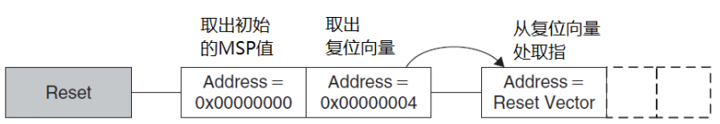

图 43‑1 复位序列

上述过程由内核自动设置运行环境并执行主体程序，因此它被称为自举过程。

虽然内核是固定访问0x00000000和0x00000004地址的，但实际上这两个地址可以被重映射到其它地址空间。以STM32F103为例，根据芯片引出的BOOT0及BOOT1引脚的电平情况，这两个地址可以被映射到内部FLASH、内部SRAM以及系统存储器中，不同的映射配置见表
43‑1。

   表 43‑1 BOOT引脚的不同设置对0地址的映射

===== ===== ============== ========== ==========
BOOT1 BOOT0 映射到的存储器 0x00000000 0x00000004
                           地址映射到 地址映射到
x     0     内部FLASH      0x08000000 0x08000004
1     1     内部SRAM       0x20000000 0x20000004
0     1     系统存储器     0x1FFFB000 0x1FFFB004
===== ===== ============== ========== ==========

内核在离开复位状态后会从映射的地址中取值给栈指针MSP及程序指针PC，然后执行指令，我们一般以存储器的类型来区分自举过程，例如内部FLASH启动方式、内部SRAM启动方式以及系统存储器启动方式。

(1) 内部FLASH启动方式

..

   当芯片上电后采样到BOOT0引脚为低电平时，
   0x00000000和0x00000004地址被映射到内部FLASH的首地址0x08000000和0x08000004。因此，内核离开复位状态后，读取内部FLASH的0x08000000地址空间存储的内容，赋值给栈指针MSP，作为栈顶地址，再读取内部FLASH的0x08000004地址空间存储的内容，赋值给程序指针PC，作为将要执行的第一条指令所在的地址。具备这两个条件后，内核就可以开始从PC指向的地址中读取指令执行了。

(2) 内部SRAM启动方式

..

   类似地，当芯片上电后采样到BOOT0和BOOT1引脚均为高电平时，0x00000000和0x00000004地址被映射到内部SRAM的首地址0x20000000和0x20000004，内核从SRAM空间获取内容进行自举。

   在实际应用中，由启动文件startup_stm32f103xe.s决定了0x00000000和0x00000004地址存储什么内容，链接时，由分散加载文件(sct)决定这些内容的绝对地址，即分配到内部FLASH还是内部SRAM。（下一小节将以实例讲解）

(3) 系统存储器启动方式

..

   当芯片上电后采样到BOOT0引脚为高电平，BOOT1为低电平时，内核将从系统存储器的0x1FFFF000及0x1FFFF004获取MSP及PC值进行自举。系统存储器是一段特殊的空间，用户不能访问，ST公司在芯片出厂前就在系统存储器中固化了一段代码。因而使用系统存储器启动方式时，内核会执行该代码，该代码运行时，会为ISP提供支持(In
   System
   Program)，如检测USART1/2、CAN2及USB通讯接口传输过来的信息，并根据这些信息更新自己内部FLASH的内容，达到升级产品应用程序的目的，因此这种启动方式也称为ISP启动方式。

内部FLASH的启动过程
~~~~~~~~~~~~~~~~~~~

下面我们以最常规的内部FLASH启动方式来分析自举过程，主要理解MSP和PC内容是怎样被存储到0x08000000和0x08000004这两个地址的。

见 图43_2_
，这是STM32F103默认的启动文件的代码，启动文件的开头定义了一个大小为0x400的栈空间，且栈顶的地址使用标号“__initial_sp”来表示；在图下方定义了一个名为“Reset_Handler”的子程序，它就是我们总是提到的在芯片启动后第一个执行的代码。在汇编语法中，程序的名字和标号都包含它所在的地址，因此，我们的目标是把“__initial_sp”和“Reset_Handler”赋值到0x08000000和0x08000004地址空间存储，这样内核自举的时候就可以获得栈顶地址以及第一条要执行的指令了。在启动代码的中间部分，使用了汇编关键字“DCD”
把“__initial_sp”和“Reset_Handler”定义到了最前面的地址空间。

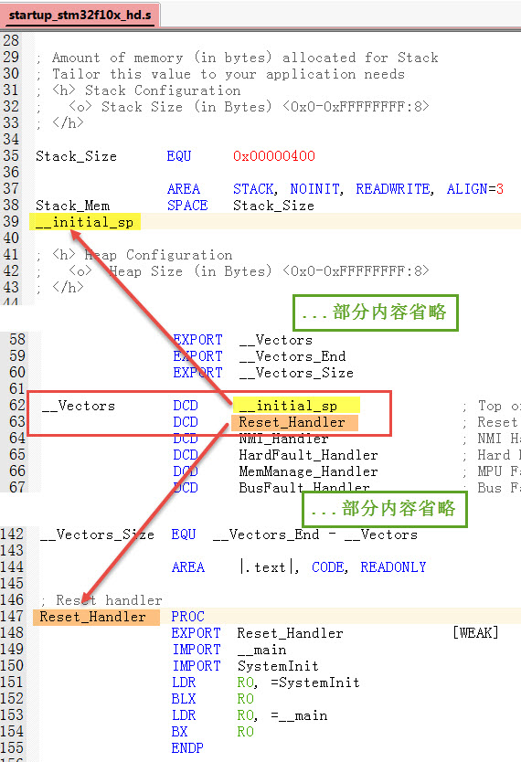

图 43‑2 启动代码中存储的MSP及PC指针内容

在启动文件中把设置栈顶及首条指令地址到了最前面的地址空间，但这并没有指定绝对地址，各种内容的绝对地址是由链接器根据分散
加载文件(\*.sct)分配的，STM32F103的默认分散加载文件配置见
代码清单43_1_。

.. code-block:: c
   :caption: 代码清单 43‑1 默认分散加载文件的空间配置
   :name: 代码清单43_1

   ; *************************************************************
   ; *** Scatter-Loading Description File generated by uVision ***
   ; *************************************************************

   LR_IROM1 0x08000000 0x00080000 {    ; load region size_region
      ER_IROM1 0x08000000 0x00080000 {  ; load address = execution address
      *.o (RESET, +First)
      *(InRoot$$Sections)
      .ANY (+RO)
      }
      RW_IRAM1 0x20000000 0x00010000  {  ; RW data
      .ANY (+RW +ZI)
      }
   }

分散加载文件把加载区和执行区的首地址都设置为0x08000000，正好是内部FLASH的首地址，因此汇编文件中定义的栈顶及首条指令地址会被存储到0x08000000和0x08000004的地址空间。

类似地，如果我们修改分散加载文件，把加载区和执行区的首地址设置为内部SRAM的首地址0x20000000，那么栈顶和首条指令地址将会被存储到0x20000000和0x20000004的地址空间了。

为了进一步消除疑虑，我们可以查看反汇编代码及map文件信息来了解各个地址空间存储的内容，见
图43_3_，这是多彩流水灯工程编译后的信息，它的启动文件及分散加载文件都按默认配置。其中反汇编代码是使用fromelf工具从axf文件生成的，具体过程可参考前面的章节了解。

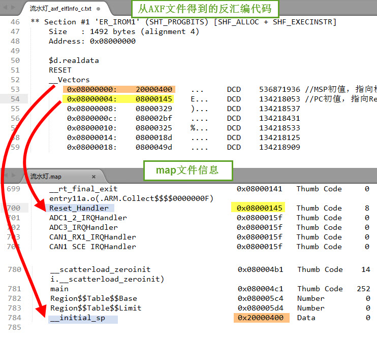

图 43‑3 从反汇编代码及map文件查看存储器的内容

从反汇编代码可了解到，这个工程的0x08000000地址存储的值为0x20000400，0x08000004地址存储的值为0x08000145，查看map文件，这两个值正好是栈顶地址__initial_sp以及首条指令Reset_Handler的地址。下载器会根据axf文件(bin、hex类似)存储相应的内容到内部FLASH中。

由此可知，BOOT0为低电平时，内核复位后，从0x08000000读取到栈顶地址为0x20000400，了解到子程序的栈空间范围，再从0x08000004读取到第一条指令的存储地址为0x08000145，于是跳转到该地址执行代码，即从ResetHandler开始运行，运行SystemInit、__main(包含分散加载代码)，最后跳转到C语言的main函数。

对比在内部FLASH中运行代码的过程，可了解到若希望在内部SRAM中调试代码，需要设置启动方式为从内部SRAM启动，修改分散加载文件控制代码空间到内部SRAM地址以及把生成程序下载到芯片的内部SRAM中。

实验：在内部SRAM中调试代码
~~~~~~~~~~~~~~~~~~~~~~~~~~

本实验将演示如何设置工程选项实现在内部SRAM中调试代码，实验的示例代码名为“RAM调试—多彩流水灯”，学习以下内容时请打开该工程来理解，它是从普通的多彩流水灯例程改造而来的。

硬件设计
^^^^^^^^

本小节中使用到的流水灯硬件不再介绍，主要讲解与SRAM调试相关的硬件配置。在SRAM上调试程序，需要修改STM32芯片的启动方式，见
图43_4_。

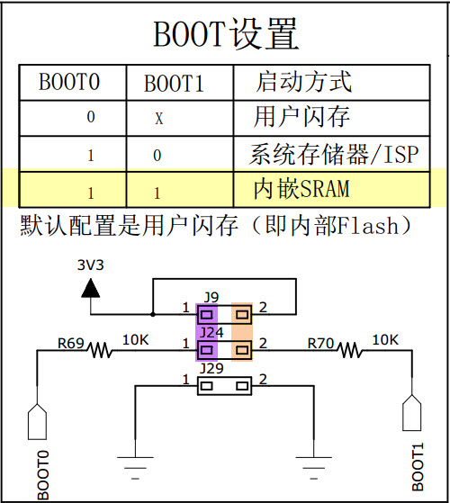

图 43‑4 实验板的boot引脚配置

在我们的实验板左侧有引出STM32芯片的BOOT0和BOOT1引脚，可使用跳线帽设置它们的电平从而控制芯片的启动方式，它支持从内部FLASH启动、系统存储器启动以及内部SRAM启动方式。

本实验在SRAM中调试代码，因此把BOOT0和BOOT1引脚都使用跳线帽连接到3.3V，使芯片从SRAM中启动。

软件设计
^^^^^^^^

本实验的工程从普通的多彩流水灯工程改写而来，主要修改了分散加载文件及一些程序的下载选项。

主要步骤
''''''''

(1) 在原工程的基础上创建一个调试版本；

(2) 修改分散加载文件，使链接器把代码分配到内部SRAM空间；

(3) 添加宏修改STM32的向量表地址；

(4) 修改仿真器和下载器的配置，使程序能通过下载器存储到内部SRAM；

(5) 根据使用情况选择是否需要使用仿真器命令脚本文件*.ini；

(6) 尝试给SRAM下载程序或仿真调试。

创建工程的调试版本
''''''''''''''''''

由于在SRAM中运行的代码一般只是用于调试，调试完毕后，在实际生产环境中仍然使用在内部FLASH中运行的代码，因此我们希望能够便捷地在调试版和发布版代码之间切换。MDK的“Manage
Project Items”可实现这样的功能，使用它可管理多个不同配置的工程，见图
43‑5，点击“Manage Project Items”按钮，在弹出对话框左侧的“Project
Target”一栏包含了原工程的名字，如图中的原工程名为“多彩流水灯”，右侧是该工程包含的文件。为了便于调试，我们在左侧的“Project
Target”一栏添加一个工程名，如图中输入“SRAM_调试”，输入后点击OK即可，这个“SRAM_调试”版本的工程会复制原“多彩流水灯”工程的配置，后面我们再进行修改。

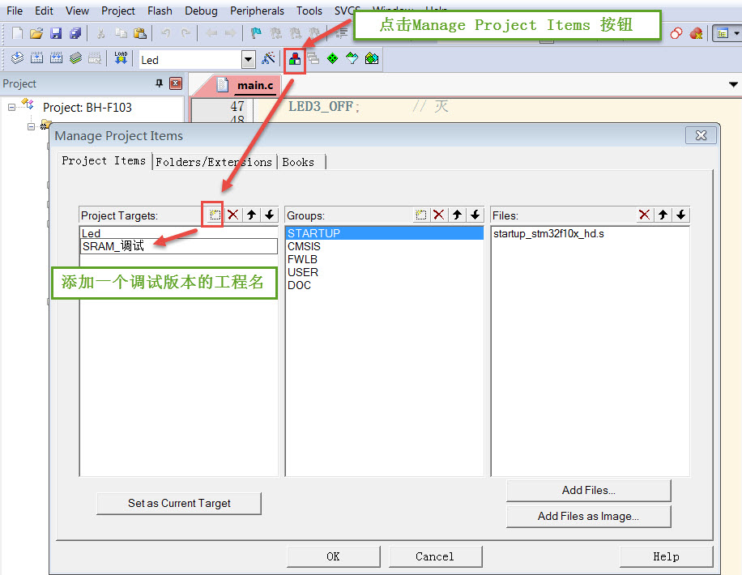

图 43‑5 使用Manage Project Items添加一个工程配置

当需要切换工程版本时，点击MDK工程名的下拉菜单可选择目标工程，在不同的工程中，所有配置都是独立的，例如芯片型号、下载配置等等，但如果两个工程共用了同一个文件，对该文件的修改会同时影响两个工程，例如这两个工程都使用同一个main文件，我们在main文件修改代码，两个工程都会被修改。

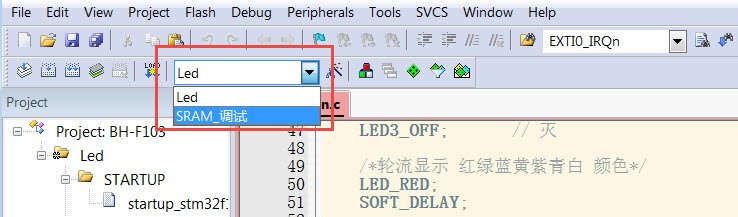

图 43‑6 切换工程

在下面的教程中我们将切换到“SRAM_调试”版本的工程，配置出一个代码会被存储到SRAM的多彩流水灯工程。

配置分散加载文件
''''''''''''''''

为方便讲解，本工程的分散加载只使用手动编辑的sct文件配置，不使用MDK的对话框选项配置，在“Options
for Target->linker”的选项见 图43_7_。

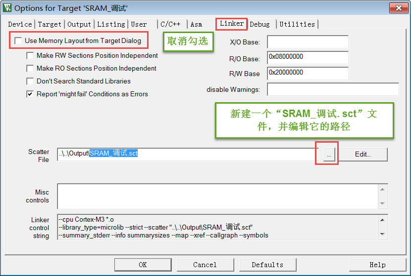

图 43‑7 使用新建的“SRAM_调试.sct”文件

为了防止“多彩流水灯”工程的分散加载文件被影响，我们在工程的Output路径下新建了一个名为“SRAM_调试.sct”的文件，并在上图中把它配置
为“SRAM_调试”工程专用的分散加载文件，该文件的内容见
代码清单43_2_，若不了解分散加载文件的使用，请参考前面的章节。

.. code-block:: c
   :caption: 代码清单 43‑2 分散加载文件配置(SRAM_调试.sct)
   :name: 代码清单43_2

   ; *************************************************************
   ; *** Scatter-Loading Description File generated by uVision ***
   ; *************************************************************

   LR_IROM1 0x20000000 0x00008000{    ; load region size_region
   ER_IROM1 0x20000000 0x00008000{  ; load address = execution address
      *.o (RESET, +First)
      *(InRoot$$Sections)
      .ANY (+RO)
   }
   RW_IRAM1 0x20008000 0x00008000{  ; RW data
      .ANY (+RW +ZI)
   }
   }

在这个分散加载文件配置中，把原本分配到内部FLASH空间的加载域和执行域改到了以地址0x20000000开始的32KB(0x00008000)空间，而RW
data空间改到了以地址0x20008000开始的32KB空间
(0x00008000)。也就是说，它把STM32的内部SRAM分成了虚拟ROM区域以及RW
data数据区域，链接器会根据它的配置给工程中的各种内容分配到SRAM地址。

在具体的应用中，虚拟ROM及RW区域的大小可根据自己的程序定制，配置完毕编译工程后可在map文件中查看具体的空间地址分配。

配置中断向量表
''''''''''''''

由于startup_stm32f13xe.s文件中的启动代码不是指定到绝对地址的，经过它由链接器决定应存储到内部FLASH还是SRAM，所以SRAM版本工程中的启动文件不需要作任何修改。

重点在于启动文件定义的中断向量表被存储到内部FLASH和内部SRAM时，这两种情况对内核的影响是不同的，内核会根据它的“向量表偏移寄存器VTOR”配置来
获取向量表，即中断服务函数的入口。VTOR寄存器是由启动文件中Reset_Handle中调用的库函数SystemInit配置的，见
代码清单43_3_。

.. code-block:: c
   :caption: 代码清单 43‑3 SystemInit函数(system_stm32f103xe.c文件)
   :name: 代码清单43_3

   void SystemInit(void)
   {
   /* ..其它代码部分省略 */

   /* 配置向量表添加的偏移地址 ----*/
   #ifdef VECT_TAB_SRAM
   SCB->VTOR = SRAM_BASE | VECT_TAB_OFFSET; /* 向量表存储在SRAM */
   #else
   SCB->VTOR = FLASH_BASE | VECT_TAB_OFFSET;/* 向量表存储在内部FLASH */

   #endif
   }

代码中根据是否存储宏定义VECT_TAB_SRAM来决定VTOR的配置，默认情况下代码中没有定义宏VECT_TAB_SRAM，所以VTOR默认情况下指示向量表是存储在内部FLASH空间的。

由于本工程的分散加载文件配置，在启动文件中定义的中断向量表会被分配到SRAM空间，所以我们要定义这个宏，使得SystemInit函数修改VTOR寄存器，
向内核指示向量表被存储到内部SRAM空间了，见 图43_8_，在“Options for Target-> c/c++
->Define”框中输入宏VECT_TAB_SRAM，注意它与其它宏之间要使用英文逗号分隔开。

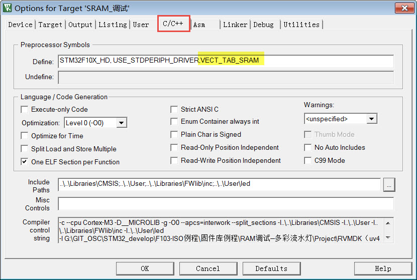

图 43‑8 在c/c++编译选项中加入宏VECT_TAB_SRAM

配置完成后重新编译工程，即可生成存储到SRAM空间地址的代码指令。

相对于直接在文件中定义宏，使用这种方式定义该宏的好处是，若切换回FLASH版本的LED工程，该工程不受影响，若把宏定义到文件中，那么由于两个版本共用文件而受到影响。

修改FLASH下载配置
'''''''''''''''''

得到SRAM版本的代码指令后，为了把它下载到芯片的SRAM中，还需要修改下载器的配置，见图
43‑9，“Options for Target->Utilities->Settings”中的选项。

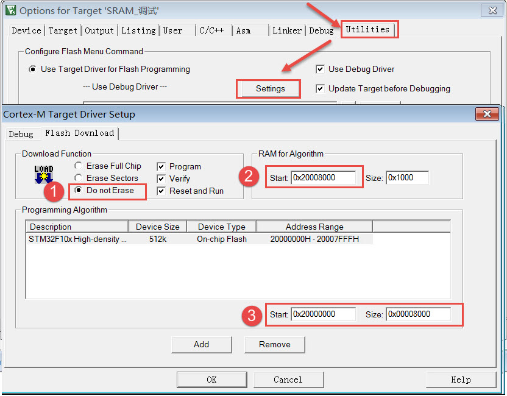

图 43‑9 下载配置

这个配置对话框原本是用于设置芯片内部FLASH信息的，当我们点击MDK的\ |image9|\ （下载、LOAD）或\ |image10|\ （调试）
按钮时，它会从此处加载配置然后下载程序到FLASH中，而在上图中我们把它的配置修改成下载到内部SRAM了，各个配置的解释如下：

-  把“Download Function”中的擦除选项配置为“Do not
   Erase”。这是因为数据写入到内部SRAM中不需要像FLASH那样先擦除后写入。在本工程中，如果我们不选择“Do
   not Erase”的话，会因为擦除过程导致下载出错。

-  “RAM for Algorithm”一栏是指“编程算法”(Programming
   Algorithm)可使用的RAM空间，下载程序到FLASH时运行的编程算法需要使用RAM空间，在默认配置中它的首地址为0x20000000，即内部SRAM的首地址，但由于我们的分散加载文件配置，0x20000000地址开始的32KB实际为虚拟ROM空间，实际的RAM空间是从地址0x20008000开始的，所以这里把算法RAM首地址更改为本工程中实际作为RAM使用的地址。若编程算法使用的RAM地址与虚拟ROM空间地址重合的话，会导致下载出错。

-  “Programming
   Algorithm”一栏中是设置内部FLASH的编程算法，编程算法主要描述了FLASH的地址、大小以及扇区等信息，MDK根据这些信息把程序下载到芯片的FLASH中，不同的控制器芯片一般会有不同的编程算法。由于MDK没有内置SRAM的编程算法，所以我们直接在原来的基础上修改它的基地址和空间大小，把它改成虚拟ROM的空间信息。

从这个例子可了解到，这里的配置是跟我们的分散加载文件的实际RAM空间和虚拟ROM空间信息是一致的，若您的分散加载文件采用不同的配置，这个下载选项也要作出相应的修改，不能照抄本例子的空间信息。

这个配置是针对程序下载的，配置完成后点击MDK的\ |image11|\ 按钮（下载、LOAD），程序会被下载到STM32的内部SRAM中。
根据前面介绍的理论知识，若给STM32的BOOT0和BOOT1引脚都接到高电平，那么STM32将被设置为SRAM启动，按下板子的复位键后，程序会从内部SRAM中加载运行。

**注意：非常遗憾的是，我们在各种平台做了大量测试，发现程序虽然被下载到SRAM了，但复位后STM32的程序PC指针和SP指针却莫名奇妙地指向非预设的ResetHandler及栈顶位置，导致程序无法正常运行（测试时，均有使用电压表直接测量STM32芯片BOOT引脚的电压确认它们都是高电平，后面小节有给出测试得的不正常情况下，PC和SP指针的值）。另外，当使用STM32F429芯片时，根据前面介绍的理论作类似的配置，程序下载到SRAM后，完全能正常运行，而在STM32F1系列各型号的芯片上，均无法实现。**

由于直接下载到芯片上复位运行的方式无法正常工作，所以下面介绍另一种折衷的解决办法，即使用仿真器强制设置PC指针及SP指针。

指定PC及SP指针值的仿真器配置
''''''''''''''''''''''''''''

前面介绍的下载配置主要指定了程序的下载位置，使得程序能够加载到SRAM，而由于实际应用在SRAM启动方式时PC和SP指针加载不正常，
因此需要使用仿真器辅助修改PC及SP指针，然后在仿真器的控制下在SRAM中调试运行，即在MDK中使用\ |image12|\ 按钮(调试、debug)时进行的
硬件在线调试、单步运行等功能，该功能与在FLASH中的硬件调试一样，但针对本实验的在SRAM运行环境，需要对配置进行修改。配置如下：

-  添加“Download options”配置。在“Options for
   Target->Debug->Settings”中进行勾选 “Verify Code Download”及“Download
   to FLASH” 配置，见 图43_10_。

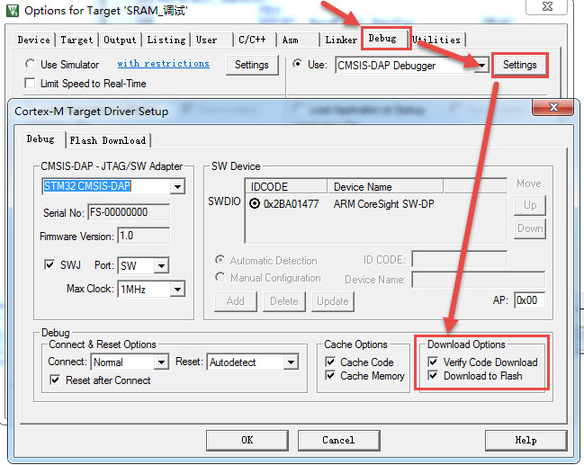

图 43‑10 设置仿真前检查代码并下载程序到FLASH中

在图中勾选“Verify Code Download”及“Download to
FLASH”选项后，当点击调试按钮后，本工程的程序会被下载到内部SRAM中，只有勾选了这两个选项才能正常仿真。

-  添加仿真器加载指令。见 图43_11_，在“Options for
   Target->Debug”对话框中取消勾选“Load Application at
   startup”选项。点击“Initialization
   File”文本框右侧的文件浏览按钮，在弹出的对话框中新建一个名为“Debug_RAM.ini”的文件；

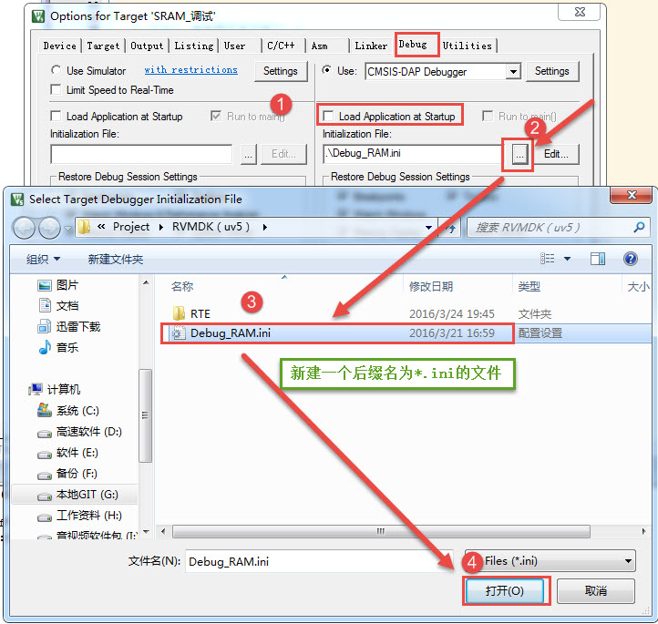

图 43‑11 新建一个ini文件

在Debug_RAM.ini文件中输入如 代码清单43_4_ 中的内容。

.. code-block:: c
   :caption: 代码清单 43‑4 Debug_RAM.ini文件内容
   :name: 代码清单43_4

   /***********************************************************/
   /* Debug_RAM.ini: Initialization File for Debugging from Internal RAM         */
   /******************************************************/
   /* This file is part of the uVision/ARM development tools.                    */
   /* Copyright (c) 2005-2014 Keil Software. All rights reserved.                */
   /* This software may only be used under the terms of a valid, current,        */
   /* end user licence from KEIL for a compatible version of KEIL software       */
   /*development tools. Nothing else gives you the right to use this software  */
   /***************************************************/

   FUNC void Setup (void) {
   SP = _RDWORD(0x20000000); // 设置栈指针SP，把0x20000000地址中的内容赋值到SP。
   PC = _RDWORD(0x20000004); // 设置程序指针PC，把0x20000004地址中的内容赋值到PC。
   _WDWORD(0xE000ED08, 0x20000000);  // Setup Vector Table Offset Register
   }

   LOAD %L INCREMENTAL                    // 下载axf文件到RAM
   Setup();                           //调用上面定义的setup函数设置运行环境

   //g, main   //跳转到main函数，本示例调试时不需要从main函数执行，注释掉了，程序从启动代码开始执行

上述配置过程是控制MDK执行仿真器的脚本文件Debug_RAM.ini，而该脚本文件在下载了程序到SRAM后，初始化了SP指针(即MSP)和PC指针分别指向了0x20000000和0x20000004，这样的操作强制芯片上电后从该地址获取SP和PC的内容，而根据程序配置，该地址分别存储了栈顶和ResetHandler的地址值。

有了这样的配置，就能解决STM32F1系列芯片SRAM启动方式SP和PC指针乱指的问题了，点击调试按钮\ |image15|\ ，即可启动仿真过程，
由于强制配置了指针，所以即使BOOT0和BOOT1引脚不设置为SRAM启动也能正常仿真，但点击下载按钮\ |image16|\ 把程序下载到SRAM
然后按复位依然是不能全速运行的(这种运行方式脱离了仿真器的控制，SP和PC指针无法被初始化指向正确的位置)。

经过这样的配置后，硬件仿真时与在FLASH仿真程序基本无异、单步运行、全速运行以及查看各种变量值等
，但由于上述仿真加载的指令只在点击调试按钮后才会运行一次，所以在调试时如果点击复位，程序的SP和PC仍然会指向错误的位置，
所以每次希望复位程序时，都需要重新点击\ |image17|\ 按钮加载调试。

上述Debug_RAM.ini文件是从STM32F1的MDK芯片包里复制过来的，若您感兴趣可到MDK安装目录搜索该文件名，该文件的语法可以从MDK的帮助手册的“µVision
User's Guide->Debug Commands”章节学习。

关于复位后PC和SP指针的调试情况
''''''''''''''''''''''''''''''

为了更好地了解RAM调试的运行情况，在仿真时，可以点击MDK仿真环境左栏底部的“Registers”按钮查看内核寄存器的情况。

当仿真器配置使用“Debug_RAM.ini”文件强制设置SP和PC寄存器的加载地址时，它们都获取到了正常的栈顶和ResetHandler的地址值，见
图43_12_。

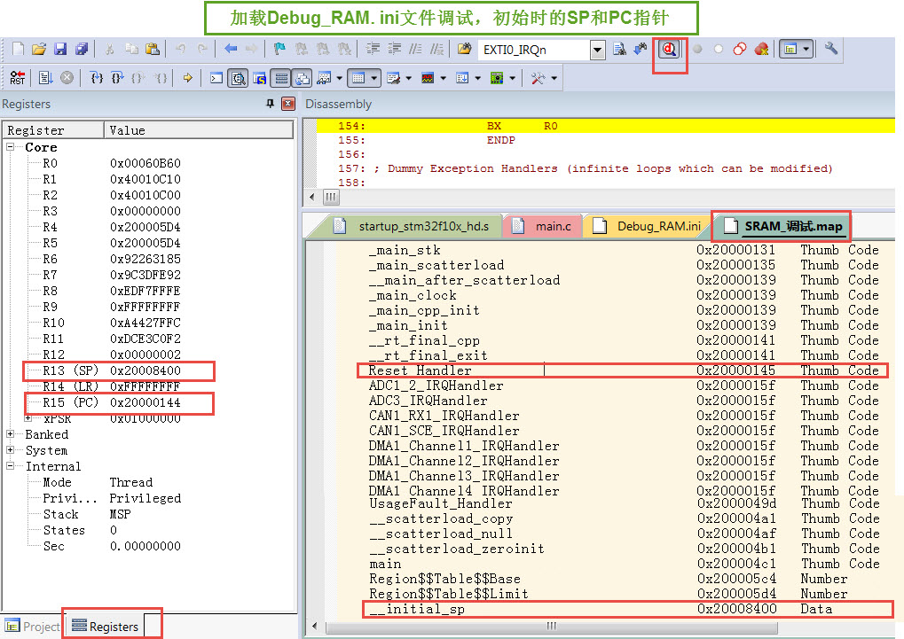

图 43‑12 加载Debug_RAM.ini文件调试，初始时的SP和PC指针正常

从图中的map文件可以了解到，Reset_Handler程序存储的地址值为0x20000145（PC指针加载时会减1，即从0x20000144可加载到正常的ResetHandler代码），栈顶指针__initial_sp的地址值为0x20008400。

查看图中左栏的PC与SP寄存器的值，正好是0x20000144和0x20008400，也正因如此，使用这种方式调试时，SRAM中的程序能正常运行。

反观后面的 图43_13_，
它呈现的是当仿真器**不使用** “Debug_RAM.ini”文件强制设置SP和PC寄存器的加载地址，或者点击复位键时的情况，这时PC寄存器的值为0x200001e0，经查询该地址存储的是GPIO_Init函数的部分指令，而SP寄存器的值为0x20005000，指向未知的存储区域。由于PC寄存器存储的地址不是ResetHandler，当程序运行时，就无法按照预定的设计运行，导致出错。

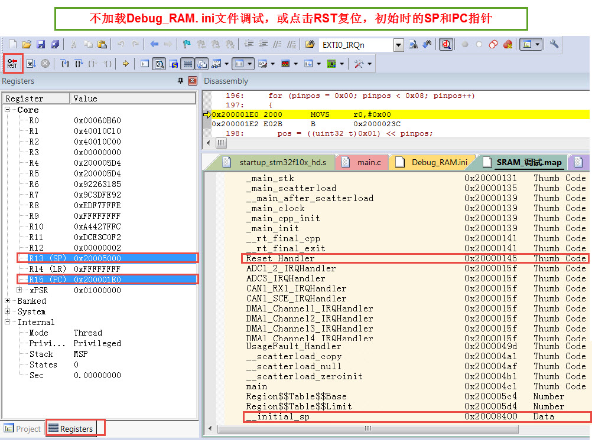

这种情况，不使用仿真器强制配置，PC和SP寄存器的值是由芯片复位后自动加载的，而图中的实验运行平台BOOT0和BOOT1已设置为高电平，即SRAM启动方式，根据STM32的说明，它本应直接从0x20000000及0x20000004地址加载到正常的栈顶和ResetHandler地址，而且经我们调试查询到在SRAM的这两个地址中确实存储了正确的栈顶和ResetHandler地址。所以无法得知STM32F1系列的芯片为何加载到错误的数据。

由于存在这个无法解决的问题，在STM32F1系列的芯片只能将就使用这种调试方式来使程序在SRAM中运行了。

下载验证
''''''''

用USB线连接开发板“USB TO
UART”接口跟电脑，把BOOT0及BOOT1引脚使用跳帽连接到低电平，在电脑端打开串口调试助手，点击下载按钮，把编译好的程序下载到芯片的内部SRAM中，复位运行，观察流水灯是否正常闪烁；给开发板断电再重新上电，观察程序是否还能正常运行。

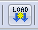

