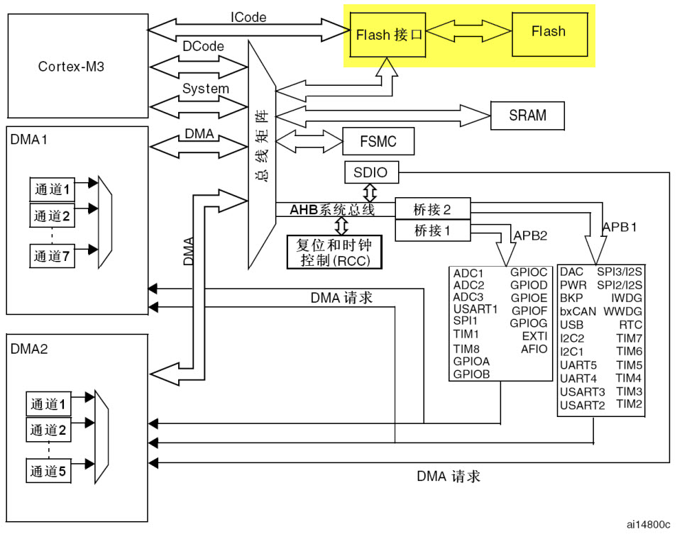
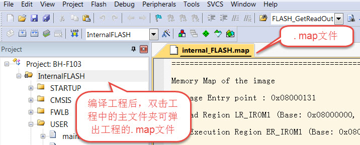

读写内部FLASH
--------------

本章参考资料：《STM32F10x闪存编程参考手册》《STM32F10x
中文参考手册》、《STM32F10x规格书》、《Cortex-M3权威指南》。

STM32的内部FLASH简介
~~~~~~~~~~~~~~~~~~~~~

在STM32芯片内部有一个FLASH存储器，它主要用于存储代码，我们在电脑上编写好应用程序后，使用下载器把编译后的代码文件烧录到该内部FLASH中，
由于FLASH存储器的内容在掉电后不会丢失，芯片重新上电复位后，内核可从内部FLASH中加载代码并运行，见
图44_1_。

图 44‑1 STM32的内部框架图

除了使用外部的工具（如下载器）读写内部FLASH外，STM32芯片在运行的时候，也能对自身的内部FLASH进行读写，因此，若内部FLASH存储了应用程序后还有剩余的空间，我们可以把它像外部SPI-FLASH那样利用起来，存储一些程序运行时产生的需要掉电保存的数据。

由于访问内部FLASH的速度要比外部的SPI-FLASH快得多，所以在紧急状态下常常会使用内部FLASH存储关键记录；为了防止应用程序被抄袭，有的应用会禁止读写内部FLASH中的内容，或者在第一次运行时计算加密信息并记录到某些区域，然后删除自身的部分加密代码，这些应用都涉及到内部FLASH的操作。

内部FLASH的构成
'''''''''''''''

STM32的内部FLASH包含主存储器、系统存储器以及选项字节区域，它们的地址分布及大小见
表44‑1（在《STM32参考手册》中没有关于其内部FLASH的说明，需要了解这些内容时，要查阅《STM32F10x闪存编程参考手册》）。

表 44‑1 STM32大容量产品内部FLASH的构成（摘自《STM32F10x闪存编程参考手册》）

========== ========================= ========================= ========
区域       名称                      块地址                    大小
主存储器   页0                       0x0800 0000 - 0x0800 07FF 2 Kbytes
\          页1                       0x0800 0800 - 0x0800 0FFF 2 Kbytes
\          页2                       0x0800 1000 - 0x0800 17FF 2 Kbytes
\          页3                       0x0800 1800 - 0x0800 FFFF 2 Kbytes
\          .                         .                         .
\          .                         .                         .
\          .                         .                         .
\          页255                     0x0807 F800 - 0x0807 FFFF 2 Kbytes
系统存储区 0x1FFF F000 - 0x1FFF F7FF 2 Kbytes
选项字节   0x1FFF F800 - 0x1FFF F80F 16 bytes
========== ========================= ========================= ========

各个存储区域的说明如下：

-  主存储器

..

   一般我们说STM32内部FLASH的时候，都是指这个主存储器区域，它是存储用户应用程序的空间，芯片型号说明中的256K
   FLASH、512K FLASH都是指这个区域的大小。

   主存储器分为256页，每页大小为2KB，共512KB。这个分页的概念，实质就是FLASH存储器的扇区，与其它FLASH一样，在写入数据前，要先按页（扇区）擦除。

   注意上表中的主存储器是本实验板使用的STM32ZET6型号芯片的参数，即STM32F1大容量产品。若使用超大容量、中容量或小容量产品，它们主存储器的页数量、页大小均有不同，使用的时候要注意区分。

   关于STM32内部FLASH的容量类型可根据它的型号名获知，见表 44‑2。

表 44‑2 STM32芯片的命名规则

============= ==================================
  型号范例      STM32   F  103  Z   E   T   6
  家族        “STM32 “表示32bit的MCU
  产品类型    “F”表示基础型
  具体特性    “103”基础型
  引脚数目    “Z”表示144个引脚，
              其他常用的为：
              C表示48引脚，
              R表示64引脚，
              V表示100引脚，
              “Z”表示144个引脚，
              B表示208引脚，
              N表示216引脚
  FLASH大小   E表示512KB，
              其他常用的为：
              4表示16KB（小容量ld），
              6表示32KB（小容量ld），
              8表示64KB（中容量md），
              B表示128KB（中容量md），
              C表示256 KB（大容量hd），
              E表示512 KB（大容量hd），
              F表示768KB（超大容量xl），
              G表示1024KB（超大容量xl），
  封装        “T”表示QFP封装，这个是最常用的封装
  温度        “6”表示温度等级为A ：-40~85°
============= ==================================

-  系统存储区

..

   系统存储区是用户不能访问的区域，它在芯片出厂时已经固化了启动代码，它负责实现串口、USB以及CAN等ISP烧录功能。

-  选项字节

..

   选项字节用于配置FLASH的读写保护、待机/停机复位、软件/硬件看门狗等功能，这部分共16字节。可以通过修改FLASH的选项控制寄存器修改。

对内部FLASH的写入过程
~~~~~~~~~~~~~~~~~~~~~

解锁
''''

由于内部FLASH空间主要存储的是应用程序，是非常关键的数据，为了防止误操作修改了这些内容，芯片复位后默认会给控制寄存器FLASH_CR上锁，这个时候不允许设置FLASH的控制寄存器，从而不能修改FLASH中的内容。

所以对FLASH写入数据前，需要先给它解锁。解锁的操作步骤如下：

(1) 往FPEC键寄存器 FLASH_KEYR中写入 KEY1 = 0x45670123

(2) 再往FPEC键寄存器 FLASH_KEYR中写入 KEY2 = 0xCDEF89AB

页擦除
''''''

在写入新的数据前，需要先擦除存储区域，STM32提供了页（扇区）擦除指令和整个FLASH擦除(批量擦除)的指令，批量擦除指令仅针对主存储区。

页擦除的过程如下：

(1) 检查 FLASH_SR 寄存器中的“忙碌寄存器位 BSY”，以确认当前未执行任何
    Flash 操作；

(2) 在 FLASH_CR 寄存器中，将“激活页擦除寄存器位PER ”置 1，

(3) 用FLASH_AR寄存器选择要擦除的页；

(4) 将 FLASH_CR 寄存器中的“开始擦除寄存器位 STRT ”置 1，开始擦除；

(5) 等待 BSY 位被清零时，表示擦除完成。

写入数据
''''''''

擦除完毕后即可写入数据，写入数据的过程并不是仅仅使用指针向地址赋值，赋值前还还需要配置一系列的寄存器，步骤如下：

(1) 检查 FLASH_SR 中的 BSY 位，以确认当前未执行任何其它的内部 Flash
    操作；

(2) 将 FLASH_CR 寄存器中的 “激活编程寄存器位PG” 置 1；

(3) 向指定的FLASH存储器地址执行数据写入操作，每次只能以16位的方式写入；

(4) 等待 BSY 位被清零时，表示写入完成。

查看工程的空间分布
~~~~~~~~~~~~~~~~~~

由于内部FLASH本身存储有程序数据，若不是有意删除某段程序代码，一般不应修改程序空间的内容，所以在使用
内部FLASH存储其它数据前需要了解哪一些空间已经写入了程序代码，存储了程序代码的扇区都不应作任何修改。
通过查询应用程序编译时产生的“\*.map”后缀文件，可以了解程序存储到了哪些区域，它在工程中的打开方式见
图44_2_，也可以到工程目录中的“Listing”文件夹中找到，关于map文件的详细说明可参考前面的《MDK的编译过程及文件详解》章节。

图 44‑2 打开工程的.map文件

打开map文件后，查看文件最后部分的区域，可以看到一段以“Memory Map of the
image”开头的记录(若找不到可用查找功能定位)，见 代码清单44_1_。

.. code-block:: guess
   :caption: 代码清单 44‑1 map文件中的存储映像分布说明
   :name: 代码清单44_1

    =========================================================
    Memory Map of the image //存储分布映像

    Image Entry point : 0x08000131
    /*程序ROM加载空间*/
    Load Region LR_IROM1 (Base: 0x08000000, Size: 0x000017a8, Max: 0x00080000, ABSOLUTE)
    /*程序ROM执行空间*/
    Execution Region ER_IROM1 (Base: 0x08000000, Size: 0x0000177c, Max: 0x00080000, ABSOLUTE)
    /*地址分布列表*/
    Base Addr    Size         Type   Attr      Idx    E Section Name        Object

    0x08000000   0x00000130   Data   RO            3    RESET               startup_stm32f10x_hd.o
    0x08000130   0x00000000   Code   RO          479  * .ARM.Collect$$$$00000000  mc_w.l(entry.o)
    0x08000130   0x00000004   Code   RO          742    .ARM.Collect$$$$00000001  mc_w.l(entry2.o)
    0x08000134   0x00000004   Code   RO          745    .ARM.Collect$$$$00000004  mc_w.l(entry5.o)
    /*...此处省略大部分内容*/
    0x080016e8   0x00000024   Code   RO          772    .text               mc_w.l(init.o)
    0x0800170c   0x00000010   Code   RO          483    i.__0printf$bare    mc_w.l(printfb.o)
    0x0800171c   0x0000000e   Code   RO          784    i.__scatterload_copy  mc_w.l(handlers.o)
    0x0800172a   0x00000002   Code   RO          785    i.__scatterload_null  mc_w.l(handlers.o)
    0x0800172c   0x0000000e   Code   RO          786    i.__scatterload_zeroinit  mc_w.l(handlers.o)
    0x0800173a   0x00000022   Code   RO          490    i._printf_core      mc_w.l(printfb.o)
    0x0800175c   0x00000020   Data   RO          782    Region$$Table       anon$$obj.o

这一段是某工程的ROM存储器分布映像，在STM32芯片中，ROM区域的内容就是指存储到内部FLASH的代码。

程序ROM的加载与执行空间
'''''''''''''''''''''''

上述说明中有两段分别以“Load Region LR_ROM1”及“Execution Region
ER_IROM1”开头的内容，它们分别描述程序的加载及执行空间。在芯片刚上电运行时，会加载程序及数据，例如它会从程序的存储区域加载到程序的执行区域，还把一些已初始化的全局变量从ROM复制到RAM空间，以便程序运行时可以修改变量的内容。加载完成后，程序开始从执行区域开始执行。

在上面map文件的描述中，我们了解到加载及执行空间的基地址(Base)都是0x08000000，它正好是STM32内部FLASH的首地址，即STM32的程序存储空间就直接是执行空间；它们的大小(Size)分别为0x000017a8及0x0000177c，执行空间的ROM比较小的原因就是因为部分RW-data类型的变量被拷贝到RAM空间了；它们的最大空间(Max)均为0x00080000，即512K字节，它指的是内部FLASH的最大空间。

计算程序占用的空间时，需要使用加载区域的大小进行计算，本例子中应用程序使用的内部FLASH是从0x08000000至(0x08000000+0x000017a8)地址的空间区域。

ROM空间分布表
'''''''''''''

在加载及执行空间总体描述之后，紧接着一个ROM详细地址分布表，它列出了工程中的各个段(如函数、常量数据)所在的地址Base
Addr及占用的空间Size，列表中的Type说明了该段的类型，CODE表示代码，DATA表示数据，而PAD表示段之间的填充区域，它是无效的内容，PAD区域往往是为了解决地址对齐的问题。

观察表中的最后一项，它的基地址是0x0800175c，大小为0x00000020，可知它占用的最高的地址空间为0x0800177c，跟执行区域的最高地址0x0000177c一样，但它们比加载区域说明中的最高地址0x80017a8要小，所以我们以加载区域的大小为准。对比表
44‑1的内部FLASH页地址分布表，可知仅使用页0至页2就可以完全存储本应用程序，所以从页3(地址0x08001800)后的存储空间都可以作其它用途，使用这些存储空间时不会篡改应用程序空间的数据。

操作内部FLASH的库函数
~~~~~~~~~~~~~~~~~~~~~

为简化编程，STM32HAL库提供了一些库函数，它们封装了对内部FLASH写入数据操作寄存器的过程。

FLASH解锁、上锁函数
'''''''''''''''''''

对内部FLASH解锁、上锁的函数见 代码清单44_2_。

.. code-block:: c
   :caption: 代码清单 44‑2 FLASH解锁、上锁
   :name: 代码清单44_2

    /** @defgroup FLASH_Keys FLASH Keys
    * @{
    */
    #define FLASH_KEY1               ((uint32_t)0x45670123U)
    #define FLASH_KEY2               ((uint32_t)0xCDEF89ABU)
    /**
    * @brief  Unlock the FLASH control register access
    * @retval HAL Status
    */
    HAL_StatusTypeDef HAL_FLASH_Unlock(void)
    {
        if ((FLASH->CR & FLASH_CR_LOCK) != RESET) {
            /* Authorize the FLASH Registers access */
            FLASH->KEYR = FLASH_KEY1;
            FLASH->KEYR = FLASH_KEY2;
        } else {
            return HAL_ERROR;
        }

        return HAL_OK;
    }

    /**
    * @brief  Locks the FLASH control register access
    * @retval HAL Status
    */
    HAL_StatusTypeDef HAL_FLASH_Lock(void)
    {
        /* Set the LOCK Bit to lock the FLASH Registers access */
        FLASH->CR |= FLASH_CR_LOCK;

        return HAL_OK;
    }

解锁的时候，它对FLASH_KEYR寄存器写入两个解锁参数，上锁的时候，对FLASH_CR寄存器的FLASH_CR_LOCK位置1。

设置操作位数及页擦除
''''''''''''''''''''

解锁后擦除扇区时可调用FLASH_EraseSector完成，见 代码清单44_3_。

.. code-block:: c
   :caption: 代码清单 44‑3 擦除扇区
   :name: 代码清单44_3

    /**
    * @brief  擦除指定的页
    * @param  Page_Address: 要擦除的页地址.
    * @retval FLASH Status:
                可能的返回值: FLASH_BUSY, FLASH_ERROR_PG,
    *           FLASH_ERROR_WRP, FLASH_COMPLETE or FLASH_TIMEOUT.
    *
    *
    * @retval HAL Status
    */
    HAL_StatusTypeDef HAL_FLASHEx_Erase(FLASH_EraseInitTypeDef *pEraseInit,
    uint32_t *SectorError)
    {
        HAL_StatusTypeDef status = HAL_ERROR;
        uint32_t index = 0;

        /* Process Locked */
        __HAL_LOCK(&pFlash);

        /* Check the parameters */
        assert_param(IS_FLASH_TYPEERASE(pEraseInit->TypeErase));

        /* Wait for last operation to be completed */
        status = FLASH_WaitForLastOperation((uint32_t)FLASH_TIMEOUT_VALUE);

        if (status == HAL_OK) {
            /*Initialization of SectorError variable*/
            *SectorError = 0xFFFFFFFFU;

            if (pEraseInit->TypeErase == FLASH_TYPEERASE_MASSERASE) {
                /*Mass erase to be done*/
    #if defined (FLASH_OPTCR_nDBANK)
    FLASH_MassErase((uint8_t) pEraseInit->VoltageRange, pEraseInit->Banks);
    #else
                FLASH_MassErase((uint8_t) pEraseInit->VoltageRange);
    #endif /* FLASH_OPTCR_nDBANK */

                /* Wait for last operation to be completed */
    status = FLASH_WaitForLastOperation((uint32_t)FLASH_TIMEOUT_VALUE);

        /* if the erase operation is completed, disable the MER Bit */
                FLASH->CR &= (~FLASH_MER_BIT);
            } else {
                /* Check the parameters */
            assert_param(IS_FLASH_NBSECTORS(pEraseInit->NbSectors +
    pEraseInit->Sector));

                /* Erase by sector by sector to be done*/
    for (index = pEraseInit->Sector; index < (pEraseInit->NbSectors +
    pEraseInit->Sector); index++) {
            FLASH_Erase_Sector(index, (uint8_t) pEraseInit->VoltageRange);

                    /* Wait for last operation to be completed */
    status = FLASH_WaitForLastOperation((uint32_t)FLASH_TIMEOUT_VALUE);

    /*If the erase operation is completed, disable the SER Bit and SNB Bits*/
                    CLEAR_BIT(FLASH->CR, (FLASH_CR_SER | FLASH_CR_SNB));

                    if (status != HAL_OK) {
    /* In case of error, stop erase procedure and return the faulty sector*/
                        *SectorError = index;
                        break;
                    }
                }
            }
        }

        /* Process Unlocked */
        __HAL_UNLOCK(&pFlash);

        return status;
    }

本函数包含两个输入参数，分别是擦除flash初始化结构体和返回擦除出错编码，FLASH_EraseInitTypeDef擦除flash初始化结构体主要包含擦除的方式，是扇区擦除还是批量擦除，选择不同电压时实质是选择不同的数据操作位数，并且确定擦除首地址即擦除的扇区个数。函数根据输入参数配置PSIZE位，然后擦除扇区，擦除扇区的时候需要等待一段时间，它使用FLASH_WaitForLastOperation等待，擦除完成的时候才会退出HAL_FLASHEx_Erase函数。

写入数据
''''''''

对内部FLASH写入数据不像对SDRAM操作那样直接指针操作就完成了，还要设置一系列的寄存器，利用FLASH_TYPEPROGRAM_DOUBLEWORD、FLASH_TYPEPROGRAM_WORD、FLASH_TYPEPROGRAM_HALFWORD和FLASH_TYPEPROGRAM_BYTE函数

可按字、半字的单位单位写入数据，见 代码清单44_4_。

.. code-block:: c
   :caption: 代码清单 44‑4 写入数据
   :name: 代码清单44_4

    HAL_StatusTypeDef HAL_FLASH_Program(uint32_t TypeProgram, uint32_t
                                        Address, uint64_t Data)
    {
        HAL_StatusTypeDef status = HAL_ERROR;
        uint8_t index = 0;
        uint8_t nbiterations = 0;

        /* Process Locked */
        __HAL_LOCK(&pFlash);

        /* Check the parameters */
        assert_param(IS_FLASH_TYPEPROGRAM(TypeProgram));
        assert_param(IS_FLASH_PROGRAM_ADDRESS(Address));

    #if defined(FLASH_BANK2_END)
        if (Address <= FLASH_BANK1_END) {
    #endif /* FLASH_BANK2_END */
            /* Wait for last operation to be completed */
            status = FLASH_WaitForLastOperation(FLASH_TIMEOUT_VALUE);
    #if defined(FLASH_BANK2_END)
        } else {
            /* Wait for last operation to be completed */
            status = FLASH_WaitForLastOperationBank2(FLASH_TIMEOUT_VALUE);
        }
    #endif /* FLASH_BANK2_END */

        if (status == HAL_OK) {
            if (TypeProgram == FLASH_TYPEPROGRAM_HALFWORD) {
                /* Program halfword (16-bit) at a specified address. */
                nbiterations = 1U;
            } else if (TypeProgram == FLASH_TYPEPROGRAM_WORD) {
                /* Program word (32-bit = 2*16-bit) at a specified address.
                                */
                nbiterations = 2U;
            } else {
                /* Program double word (64-bit = 4*16-bit) at a specified address. */
                nbiterations = 4U;
            }

            for (index = 0U; index < nbiterations; index++) {
                FLASH_Program_HalfWord((Address + (2U*index)), (uint16_t)(
                                    Data >> (16U*index)));

    #if defined(FLASH_BANK2_END)
                if (Address <= FLASH_BANK1_END) {
    #endif /* FLASH_BANK2_END */
                    /* Wait for last operation to be completed */
                    status = FLASH_WaitForLastOperation(
                            FLASH_TIMEOUT_VALUE);

                    /* If the program operation is completed, disable the PG Bit */
                    CLEAR_BIT(FLASH->CR, FLASH_CR_PG);
    #if defined(FLASH_BANK2_END)
                } else {
                    /* Wait for last operation to be completed */
                    status = FLASH_WaitForLastOperationBank2(
                            FLASH_TIMEOUT_VALUE);

                    /* If the program operation is completed, disable the PG Bit */
                    CLEAR_BIT(FLASH->CR2, FLASH_CR2_PG);
                }
    #endif /* FLASH_BANK2_END */
                /* In case of error, stop programation procedure */
                if (status != HAL_OK) {
                    break;
                }
            }
        }

        /* Process Unlocked */
        __HAL_UNLOCK(&pFlash);

        return status;
    }

看函数代码可了解到，形参依次设置了数据操作宽度，写入数据地址，写入的数据。在赋值操作后，调用了FLASH_WaitForLastOperation函数等待写操作完毕。

实验：读写内部FLASH
~~~~~~~~~~~~~~~~~~~~

在本小节中我们以实例讲解如何使用内部FLASH存储数据。

硬件设计
''''''''''''

本实验仅操作了STM32芯片内部的FLASH空间，无需额外的硬件。

软件设计
''''''''''''

本小节讲解的是“内部FLASH编程”实验，请打开配套的代码工程阅读理解。为了方便展示及移植，我们把操作内部FLASH相关的代码都编写到“bsp_internal_Flash.c”及“bsp_internal_Flash.h”文件中，这些文件是我们自己编写的，不属于HAL库的内容，可根据您的喜好命名文件。

程序设计要点
...............

(1) 对内部FLASH解锁；

(2) 找出空闲页，擦除目标页；

(3) 进行读写测试。

代码分析
..............

硬件定义
===============

读写内部FLASH不需要用到任何外部硬件，不过在编写测试时我们要先确定内部FLASH的页大小以及要往哪些地址写入数据，
在本工程中这些定义在bsp_internal_Flash.h头文件中，见
代码清单44_5_。

.. code-block:: c
   :caption: 代码清单 44‑5 各个扇区的基地址(bsp_internal_Flash.h文件)
   :name: 代码清单44_5

   //写入的起始地址与结束地址

   #define WRITE_START_ADDR ((uint32_t)0x08008000)

   #define WRITE_END_ADDR ((uint32_t)0x0800C000)

代码中首先根据芯片类型定义了宏FLASH_PAGE_SIZE，由于本工程使用的是STM32ZET6芯片，所以FLASH_PAGE_SIZE已经stm32f1xx_hal_flash_ex.c中被定义成0x800，即2048字节。

另外，WRITE_START_ADDR和WRITE_END_ADDR定义了后面本工程测试读写内部FLASH的起始地址与结束地址，这部分区域与map文件指示的程序本身占用的空间不重合，所以在后面修改这些地址的内容时，它不会把自身的程序修改掉。

读写内部FLASH
================

一切准备就绪，可以开始对内部FLASH进行擦写，这个过程不需要初始化任何外设，只要按解锁、擦除及写入的流程走就可以了，见
代码清单44_6_。

.. code-block:: c
   :caption: 代码清单 44‑6 对内部地FLASH进行读写测试(bsp_internal_Flash.c文件)
   :name: 代码清单44_6

    int InternalFlash_Test(void)
    {

        uint32_t Address = 0x00;        //记录写入的地址
        uint32_t DATA_32 = 0x3210ABCD;      //记录写入的数据
        uint32_t NbrOfPage = 0x00;      //记录写入多少页
        __IO uint32_t Data32 = 0;

        uint32_t SECTORError = 0;
        TestStatus MemoryProgramStatus = PASSED;//记录整个测试结果

        static FLASH_EraseInitTypeDef EraseInitStruct;
        /* 解锁 */
        HAL_FLASH_Unlock();

        /* 计算要擦除多少页 */
        NbrOfPage = (WRITE_END_ADDR - WRITE_START_ADDR) / FLASH_PAGE_SIZE;
        EraseInitStruct.TypeErase     = FLASH_TYPEERASE_PAGES;
        EraseInitStruct.NbPages       = NbrOfPage;
        EraseInitStruct.PageAddress   = WRITE_START_ADDR;

        if (HAL_FLASHEx_Erase(&EraseInitStruct, &SECTORError) != HAL_OK) {
            /*擦除出错，返回，实际应用中可加入处理 */
            return -1;
        }
        /* 向内部FLASH写入数据 */
        Address = WRITE_START_ADDR;
        while (Address < WRITE_END_ADDR) {
            if (HAL_FLASH_Program(FLASH_TYPEPROGRAM_WORD, Address, DATA_32)
                == HAL_OK) {
                Address = Address + 4;
            } else {
                /*写入出错，返回，实际应用中可加入处理
                */
                return -1;
            }
        }

        HAL_FLASH_Lock();

        /* 检查写入的数据是否正确 */
        Address = WRITE_START_ADDR;

        while ((Address < WRITE_END_ADDR) && (MemoryProgramStatus !=
            FAILED)) {
            if ((*(__IO uint32_t*) Address) != DATA_32) {
                MemoryProgramStatus = FAILED;
            }
            Address += 4;
        }
        return MemoryProgramStatus;
    }

该函数的执行过程如下：

(1) 调用HAL_FLASH_Unlock解锁；

(2) 根据起始地址及结束地址计算要擦除多少页；

(3) 使用循环调用FLASH\_ HAL_FLASHEx_Erase擦除页，每次擦除一页；

(4) 使用循环调用HAL_FLASH_Program函数向起始地址至结束地址的存储区域都写入变量
    “Data” 存储的数值数值；

(5) 调用HAL_FLASH_Lock上锁；

(6) 使用指针读取写入的数据内容并校验。

main函数
==============

最后我们来看看main函数的执行流程，见 代码清单44_7_。

.. code-block:: c
   :caption: 代码清单 44‑7 main函数(main.c文件)
   :name: 代码清单44_7

    int main(void)
    {
        /* 配置系统时钟为72 MHz */
        SystemClock_Config();

        /*初始化USART 配置模式为 115200 8-N-1*/
        DEBUG_USART_Config();
        /*初始化LED*/
        LED_GPIO_Config();

        LED_BLUE;
        printf("\r\n 欢迎使用野火  STM32  开发板。\r\n");
        printf("正在进行读写内部FLASH实验，请耐心等待\r\n");

        if (InternalFlash_Test()== PASSED) {
            LED_GREEN;
            printf("读写内部FLASH测试成功\r\n");
        } else {
            printf("读写内部FLASH测试失败\r\n");
            LED_RED;
        }
        while (1) {
        }
    }

main函数中初始化了用于指示调试信息的LED及串口后，直接调用了InternalFlash_Test函数，进行读写测试并根据测试结果输出调试信息。

下载验证
'''''''''''''''''''

用USB线连接开发板“USB TO
UART”接口跟电脑，在电脑端打开串口调试助手，把编译好的程序下载到开发板。在串口调试助手可看到擦写内部FLASH的调试信息。

.. |image0| image:: E:\FIRE\F103_指南者\/media/image2.jpeg
   :width: 5.12361in
   :height: 4.01458in
.. |image1| image:: E:\FIRE\F103_指南者\/media/image3.jpeg
   :width: 5.53472in
   :height: 2.23403in
