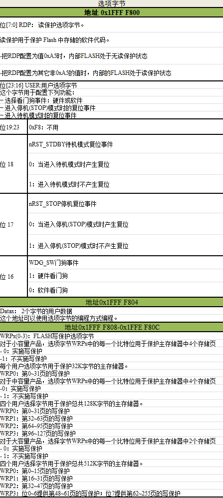

设置FLASH的读写保护及解除 
--------------------------

本章参考资料：《STM32F10x闪存编程参考手册》《STM32F10x
中文参考手册》、《STM32F10x规格书》、《Cortex-M3权威指南》。

选项字节与读写保护
~~~~~~~~~~~~~~~~~~

在实际发布的产品中，在STM32芯片的内部FLASH存储了控制程序，如果不作任何保护措施的话，可以使用下载器直接把内部FLASH的内容读取回来，得到bin或hex文件格式的代码拷贝，别有用心的厂商会利用该方法山寨产品。为此，STM32芯片提供了多种方式保护内部FLASH的程序不被非法读取，但在默认情况下该保护功能是不开启的，若要开启该功能，需要改写内部FLASH选项字节(Option
Bytes)中的配置。

选项字节的内容
^^^^^^^^^^^^^^

选项字节是一段特殊的FLASH空间，STM32芯片会根据它的内容进行读写保护配置，选项字节的构成见表
45‑1。

   表 45‑1 选项字节的构成

=========== ======= ======= ====== =====
地址        [31:24] [23:16] [15:8] [7:0]
0x1FFF F800 nUSER   USER    nRDP   RDP
0x1FFF F804 nData1  Data1   nData0 Data0
0x1FFF F808 nWRP1   WRP1    nWRP0  WRP0
0x1FFF F80C nWRP3   WRP3    nWRP2  WRP2
=========== ======= ======= ====== =====

STM32F103系列芯片的选项字节有8个配置项，即上表中的USER、RDP、DATA0/1及WRP0/1/2/3，而表中带n的同类项是该项的反码，即nUSER的值等于(~USER)、nRDP的值等于(~RDP)，STM32利用反码来确保选项字节内容的正确性。

选项字节的8个配置项具体的数据位配置说明见表 45‑2。

   表 45‑2 选项字节具体的数据位配置说明

我们主要讲解选项字节配置中的RDP位和WRP位，它们分别用于配置读保护和写保护。

RDP读保护
^^^^^^^^^

修改选项字节的RDP位的值可设置内部FLASH为以下保护级别：

-  0xA5：无保护

..

   这是STM32的默认保护级别，它没有任何读保护，读取内部FLASH的内容都没有任何限制。也就是说，第三方可以使用调试器等工具，获取该芯片FLASH中存储的程序，然后可以把获得的程序以bin和hex的格式下载到另一块STM32芯片中，加上PCB抄板技术，轻易复制出同样的产品。

-  其它值：使能读保护

..

   把RDP配置成除0xA5外的任意数值，
   都会使能读保护。在这种情况下，若使用调试功能(使用下载器、仿真器)或者从内部SRAM自举时都不能对内部FLASH作任何访问(读写、擦除都被禁止)；而如果STM32是从内部FLASH自举时，它允许对内部FLASH的任意访问。也就是说，任何尝试从外部访问内部FLASH内容的操作都被禁止。例如，无法通过下载器读取它的内容，或编写一个从内部SRAM启动的程序，若该SRAM启动的程序读取内部FLASH，会被禁止。而如果是芯片原本的内部FLASH程序自己访问内部FLASH（即从FLASH自举的程序），是完全没有问题的，例如芯片本身的程序，若包含有指针对内部FLASH某个地址进行的读取操作，它能获取正常的数据。

   另外，被设置成读保护后，FLASH前4K字节的空间会强制加上写保护，也就是说，即使是从FLASH启动的程序，也无法擦写这4K字节空间的内容；而对于前4K字节以外的空间，读保护并不影响它对其它空间的擦除/写入操作。利用这个特性，可以编写IAP代码(In
   Application
   Program)更新FLASH中的程序，它的原理是通过某个通讯接口获取将要更新的程序内容，然后利用内部FLASH擦写操作把这些内容烧录到自己的内部FLASH中，实现应用程序的更新，该原理类似串口ISP程序下载功能，只不过ISP这个接收数据并更新的代码由ST提供，且存放在系统存储区域，而IAP是由用户自行编写的，存放在用户自定义的FLASH区域，且通讯方式可根据用户自身的需求定制，如IIC、SPI等，只要能接收到数据均可。

-  解除保护

..

   当需要解除芯片的读保护时，要把选项字节的RDP位重新设置为0xA5。在解除保护前，芯片会自动触发擦除主FLASH存储器的全部内容，即解除保护后原内部FLASH的代码会丢失，从而防止降级后原内容被读取到。

芯片被配置成读保护后根据不同的使用情况，访问权限不同，总结。

表 45‑3 读保护模式下不同区域的访问限制

=======================  ========  =========================  ===============  ===  ===  ====  ===
存储区                   保护设置  从RAM自举（SRAM调试模式）  从内部FLASH自举
\                        读        写                         擦除             读   写   擦除
主FLASH前4K字节          读保护    否                         是               否   否
主FLASH前4K字节外的空间  读保护    否                         是
选项字节                 读保护    是                         是
=======================  ========  =========================  ===============  ===  ===  ====  ===

WRP写保护
^^^^^^^^^

使用选项字节的WRP0/1/2/3可以设置主FLASH的写保护，防止它存储的程序内容被修改。

-  设置写保护

..

   写保护的配置一般以4K字节为单位，除WRP3的最后一位比较特殊外，每个WRP选项字节的一位用于控制4K字节的写访问权限，
   把对应WRP的位置0即可把它匹配的空间加入写保护。被设置成写保护后，主FLASH中的内容使用任何方式都不能被擦除和写入，写保护不会影响读访问权限，读访问权限完全由前面介绍的读保护设置限制。

-  解除写保护

..

   解除写保护是逆过程，把对应WRP的位置1即可把它匹配的空间解除写保护。解除写保护后，主FLASH中的内容不会像解读保护那样丢失，它会被原样保留。

修改选项字节的过程
~~~~~~~~~~~~~~~~~~

根据前面的说明，修改选项字节的内容可修改读写保护配置，不过选项字节复位后的默认状态是始终可以读但被写保护的，因此它具有类似前面《读写内部FLASH》章节提到的FLASH_CR寄存器的访问限制，要想修改，需要先对FLASH_OPTKEYR寄存器写入解锁编码。由于修改选项字节时也需要访问FLASH_CR寄存器，所以同样也要对FLASH_KEYR写入解锁编码。

修改选项字节的整个过程总结如下：

1. 解除FLASH_CR寄存器的访问限制

-  往FPEC键寄存器 FLASH_KEYR中写入 KEY1 = 0x45670123

-  再往FPEC键寄存器 FLASH_KEYR中写入 KEY2 = 0xCDEF89AB

2. 解除对选项字节的访问限制

-  往FLASH_OPTKEYR中写入 KEY1 = 0x45670123

-  再往FLASH_OPTKEYR中写入 KEY2 = 0xCDEF89AB

3. 配置FLASH_CR的OPTPG位，准备修改选项字节

4. 直接使用指针操作修改选项字节的内容，根据需要修改RDP、WRP等内容

5. 对于读保护的解除，由于它会擦除FLASH的内容，所以需要检测状态寄存器标志位以确认FLASH擦除操作完成。

6. 若是设置读保护及其解除，需要给芯片重新 **上电复位** ，以使新配置的选项字节生效；对于设置写保护及其解除，
   需要给芯片进行 **系统复位**，以使新配置的选项字节生效。

操作选项字节的库函数
~~~~~~~~~~~~~~~~~~~~

为简化编程，STM32HAL库提供了一些库函数，它们封装了前面介绍的修改选项字节时的操作过程。

选项字节上锁、解锁
^^^^^^^^^^^^^^^^^^^^

简化编程，STM32
HAL库提供了一些库函数，它们封装了修改选项字节时操作寄存器的过程,
代码清单45_1_。

.. code-block:: c
   :caption: 代码清单 45‑1选项字节解锁、上锁
   :name: 代码清单45_1

   #define FLASH_OPT_KEY1           ((uint32_t)0x08192A3BU)
   #define FLASH_OPT_KEY2           ((uint32_t)0x4C5D6E7FU)
   /**
   * @brief  Unlock the FLASH Option Control Registers access.
   * @retval HAL Status
   */
   HAL_StatusTypeDef HAL_FLASH_OB_Unlock(void)
   {
      if ((FLASH->OPTCR & FLASH_OPTCR_OPTLOCK) != RESET) {
         /* Authorizes the Option Byte register programming */
         FLASH->OPTKEYR = FLASH_OPT_KEY1;
         FLASH->OPTKEYR = FLASH_OPT_KEY2;
      } else {
         return HAL_ERROR;
      }

      return HAL_OK;
   }

   /**
   * @brief  Lock the FLASH Option Control Registers access.
   * @retval HAL Status
   */
   HAL_StatusTypeDef HAL_FLASH_OB_Lock(void)
   {
   /* Set the OPTLOCK Bit to lock the FLASH Option Byte Registers access */
      FLASH->OPTCR |= FLASH_OPTCR_OPTLOCK;

      return HAL_OK;
   }

解锁的时候，它对FLASH_OPTCR寄存器写入两个解锁参数，上锁的时候，对FLASH_OPTCR寄存器的FLASH_OPTCR_OPTLOCK位置1。

设置选项字节函数
^^^^^^^^^^^^^^^^^^

解锁后设置选项字节寄存器可以先初始化FLASH_OBProgramInitTypeDef结构体，然后调用HAL_FLASHEx_OBProgram完成。

.. code-block:: c
   :caption: 代码清单 45‑2 设置选项字节函数
   :name: 代码清单45_2

   /**
   * @brief  Program option bytes
   * @param  pOBInit: pointer to an FLASH_OBInitStruct structure that
   *         contains the configuration information for the programming.
   *
   * @retval HAL Status
   */
   HAL_StatusTypeDef HAL_FLASHEx_OBProgram(
   FLASH_OBProgramInitTypeDef *pOBInit)
   {
      HAL_StatusTypeDef status = HAL_ERROR;

      /* Process Locked */
      __HAL_LOCK(&pFlash);

      /* Check the parameters */
      assert_param(IS_OPTIONBYTE(pOBInit->OptionType));

      /* Write protection configuration */
      if ((pOBInit->OptionType & OPTIONBYTE_WRP) == OPTIONBYTE_WRP) {
         assert_param(IS_WRPSTATE(pOBInit->WRPState));
         if (pOBInit->WRPState == OB_WRPSTATE_ENABLE) {
               /*Enable of Write protection on the selected Sector*/
               status = FLASH_OB_EnableWRP(pOBInit->WRPSector);
            } else {
               /*Disable of Write protection on the selected Sector*/
               status = FLASH_OB_DisableWRP(pOBInit->WRPSector);
            }
      }

      /* Read protection configuration */
      if ((pOBInit->OptionType & OPTIONBYTE_RDP) == OPTIONBYTE_RDP) {
            status = FLASH_OB_RDP_LevelConfig(pOBInit->RDPLevel);
      }

      /* USER  configuration */
      if ((pOBInit->OptionType & OPTIONBYTE_USER) == OPTIONBYTE_USER) {
   #if defined (FLASH_OPTCR_nDBANK)
            status = FLASH_OB_UserConfig(pOBInit->USERConfig & OB_WWDG_SW,
                           pOBInit->USERConfig & OB_IWDG_SW,
                           pOBInit->USERConfig & OB_STOP_NO_RST,
                           pOBInit->USERConfig & OB_STDBY_NO_RST,
                           pOBInit->USERConfig & OB_IWDG_STOP_ACTIVE,
                           pOBInit->USERConfig & OB_IWDG_STDBY_ACTIVE,
                           pOBInit->USERConfig & OB_NDBANK_SINGLE_BANK,
                           pOBInit->USERConfig & OB_DUAL_BOOT_DISABLE);
   #else
            status = FLASH_OB_UserConfig(pOBInit->USERConfig & OB_WWDG_SW,
                                       pOBInit->USERConfig & OB_IWDG_SW,
                                       pOBInit->USERConfig & OB_STOP_NO_RST,
                           pOBInit->USERConfig & OB_STDBY_NO_RST,
                           pOBInit->USERConfig & OB_IWDG_STOP_ACTIVE,
                           pOBInit->USERConfig & OB_IWDG_STDBY_ACTIVE);
   #endif /* FLASH_OPTCR_nDBANK */
      }

      /* BOR Level  configuration */
      if ((pOBInit->OptionType & OPTIONBYTE_BOR) == OPTIONBYTE_BOR) {
            status = FLASH_OB_BOR_LevelConfig(pOBInit->BORLevel);
      }

      /* Boot 0 Address configuration */
      if ((pOBInit->OptionType & OPTIONBYTE_BOOTADDR_0) ==
   OPTIONBYTE_BOOTADDR_0) {
            status = FLASH_OB_BootAddressConfig(OPTIONBYTE_BOOTADDR_0,
   pOBInit->BootAddr0);
      }

      /* Boot 1 Address configuration */
      if ((pOBInit->OptionType & OPTIONBYTE_BOOTADDR_1) ==
   OPTIONBYTE_BOOTADDR_1) {
            status = FLASH_OB_BootAddressConfig(OPTIONBYTE_BOOTADDR_1,
   pOBInit->BootAddr1);
      }

      /* Process Unlocked */
      __HAL_UNLOCK(&pFlash);
      return status;
   }

该函数根据输入选项字节结构体FLASH_OBProgramInitTypeDef参数设置寄存器响应的位，特别注意，其注释警告了若RDPLevel位配置成OB_RDP_LEVEL_2会无法恢复。

写入选项字节
^^^^^^^^^^^^^^^^

调用上一步骤中的函数配置寄存器后，还要调用
代码清单45_03_ 中的HAL_FLASH_OB_Launch函数把寄存器的内容写入到选项字节中。

.. code-block:: c
   :caption: 代码清单 45‑03 写入选项字节
   :name: 代码清单45_03

   /**
   * @brief  Launch the option byte loading.
   * @retval HAL Status
   */
   HAL_StatusTypeDef HAL_FLASH_OB_Launch(void)
   {
      /* Set the OPTSTRT bit in OPTCR register */
      FLASH->OPTCR |= FLASH_OPTCR_OPTSTRT;

      /* Wait for last operation to be completed */
      return (FLASH_WaitForLastOperation((uint32_t)FLASH_TIMEOUT_VALUE));
   }

该函数设置FLASH_OPTCR_OPTSTRT位后调用了FLASH_WaitForLastOperation函数等待写入完成，并返回写入状态，若操作正常，它会返回FLASH_COMPLETE。

实验：设置读写保护及解除
~~~~~~~~~~~~~~~~~~~~~~~~

在本实验中我们将以实例讲解如何修改选项字节的配置，设置读写保护及解除。

本实验要进行的操作比较特殊，由于设置成读写保护状态后，若不解除保护状态或者解除代码工作不正常，将无法给芯片的FLASH下载新的程序，
所以本程序在开发过程中使用内部SRAM调试的方式开发，便于测试程序（读写保护只影响FLASH，SRAM调试时程序下载到SRAM中，不受影响）。
工程中，提供了FLASH和SRAM调试的版本，见 图45_1_，

图 45‑1两种版本的程序

工程的FLASH版本程序包含完整的保护及解除方案，程序下载到内部FLASH后，它自身可以正常地进行保护及解除。另外，在学习过程中如果您想亲自修改该代码进行测试，也不用担心把解除操作的代码修改至工作不正常而导致芯片无法解锁报废，处于这种情况时，只要使用本工程的SRAM版本下载到芯片中，即可实现解锁。只要具备前面章节介绍的SRAM调试知识并备份了SRAM版本的工程即可大胆尝试。

硬件设计
^^^^^^^^

本实验完全针对内部FLASH的操作，对外部硬件无特殊要求。即使是在SRAM调试模式下，由于是使用Debug强制加载PC和SP指针，所以也无需设置BOOT0和BOOT1的引脚。

软件设计
^^^^^^^^

本实验的工程名称为“设置读写保护与解除”，学习时请打开该工程配合阅读。为了方便展示及移植，我们把读写保护相关的代码都编写到“bsp_readWriteProtect.c”及“bsp_readWriteProtect.h”文件中，这些文件是我们自己编写的，不属于HAL库的内容，可根据您的喜好命名文件。

代码分析
''''''''

设置写保护及解除
=================

针对读保护及其解除，本工程定义了FLASH_Test 函数，见 代码清单45_3_。

.. code-block:: c
   :caption:  代码清单 45‑3 配
   :name: 代码清单45_3

   void FLASH_Test(void)
   {
      printf("测试开始\r\n");
      /* 初始化测试状态 */
      MemoryProgramStatus = PASSED;

      /* 解锁Flash以启用闪存控制寄存器访问*/
      HAL_FLASH_Unlock();

      /* 解锁选项字节*/
      HAL_FLASH_OB_Unlock();

      /* 获取页面写保护状态*/
      HAL_FLASHEx_OBGetConfig(&OptionsBytesStruct);

   #ifdef WRITE_PROTECTION_DISABLE
      /* 检查所需页面是否已被写保护*/
      if ((OptionsBytesStruct.WRPPage & FLASH_PAGE_TO_BE_PROTECTED) !=
            FLASH_PAGE_TO_BE_PROTECTED) {
            /*恢复写保护页面 */
            OptionsBytesStruct.OptionType   = OPTIONBYTE_WRP;
            OptionsBytesStruct.WRPState     = OB_WRPSTATE_DISABLE;
            OptionsBytesStruct.WRPPage = FLASH_PAGE_TO_BE_PROTECTED;
            if (HAL_FLASHEx_OBProgram(&OptionsBytesStruct) != HAL_OK) {
               while (1) {
                  LED1_ON
                  printf("运行失败\r\n");
               }
            }

            /* 生成系统重置以加载新选项字节值*/
            HAL_FLASH_OB_Launch();
      }
   #elif defined WRITE_PROTECTION_ENABLE
      /* 检查所需页面是否尚未写保护*/
      if (((~OptionsBytesStruct.WRPPage) & FLASH_PAGE_TO_BE_PROTECTED )
            != FLASH_PAGE_TO_BE_PROTECTED) {
            /* 启用页面写保护*/
            OptionsBytesStruct.OptionType = OPTIONBYTE_WRP;
            OptionsBytesStruct.WRPState   = OB_WRPSTATE_ENABLE;
            OptionsBytesStruct.WRPPage    = FLASH_PAGE_TO_BE_PROTECTED;
            if (HAL_FLASHEx_OBProgram(&OptionsBytesStruct) != HAL_OK) {
               while (1) {
                  LED1_ON
                  printf("运行失败\r\n");
               }
            }

            /* 生成系统重置以加载新选项字节值*/
            HAL_FLASH_OB_Launch();
      }
   #endif /* WRITE_PROTECTION_DISABLE */

      /*锁定选项字节*/
      HAL_FLASH_OB_Lock();

      /* 所选页面未被写保护*/
      if ((OptionsBytesStruct.WRPPage & FLASH_PAGE_TO_BE_PROTECTED) !=
            0x00) {
            /*填写EraseInit结构*/
            EraseInitStruct.TypeErase   = FLASH_TYPEERASE_PAGES;
            EraseInitStruct.PageAddress = FLASH_USER_START_ADDR;
            EraseInitStruct.NbPages     = (FLASH_USER_END_ADDR -
                                          FLASH_USER_START_ADDR)
                                          /FLASH_PAGE_SIZE;

            if (HAL_FLASHEx_Erase(&EraseInitStruct, &PageError) != HAL_OK)
               {
               /*
               页面擦除时发生错误。
               用户可以在这里添加一些代码来处理这个错误

               PageError将包含有问题的页面，然后知道此页面
               上的代码错误，
               用户可以调用函数'HAL_FLASH_GetError（）'
               */
               while (1) {
                  LED1_ON
                  printf("运行失败\r\n");
               }
            }

            /*由FLASH_USER_START_ADDR和FLASH_USER_END_ADDR定义的地址
            处的DATA_32 FLASH字程序 */
            Address = FLASH_USER_START_ADDR;
            while (Address < FLASH_USER_END_ADDR) {
               if (HAL_FLASH_Program(FLASH_TYPEPROGRAM_WORD, Address,
                  DATA_32) == HAL_OK) {
                  Address = Address + 4;
               } else {
                  while (1) {
                        LED1_ON
                        printf("运行失败\r\n");
                  }
               }
            }

            /*检查书面数据的正确性*/
         Address = FLASH_USER_START_ADDR;

            while (Address < FLASH_USER_END_ADDR) {
               if ((*(__IO uint32_t*) Address) != DATA_32) {
                  MemoryProgramStatus = FAILED;
               }
               Address += 4;
            }
      } else {
            /*所需页面受写保护 */
            /* 检查是否允许在此页面中写入 */
            Address = FLASH_USER_START_ADDR;
            if (HAL_FLASH_Program(FLASH_TYPEPROGRAM_WORD, Address, DATA_32)
               != HAL_OK) {
               /* 编程期间返回错误。 */
               /* 检查WRPERR标志是否设置良好 */
               if (HAL_FLASH_GetError() == HAL_FLASH_ERROR_WRP) {
                  MemoryProgramStatus = FAILED;
               } else {
                  while (1) {
                        LED1_ON;
                        printf("运行失败\r\n");
                  }
               }
            } else {
               while (1) {
                  LED1_ON
                  printf("运行失败\r\n");
               }
            }
      }
      HAL_FLASH_Lock();

      /*检查程序数据是否存在问题*/
      if (MemoryProgramStatus == PASSED) {
            LED2_ON
      } else {
            while (1) {
               LED1_ON
               printf("运行失败\r\n");
            }
      }
      while (1) {
      }
   }

本函数主要演示写保护和解除功能，若芯片本身处于读保护状态，则解除保护，若芯片本身处于无读保护状态，则设置加入读保护。

main函数
=============

最后来看看本实验的main函数，见 代码清单45_4_。

.. code-block:: c
   :caption: 代码清单 45‑4 main函数
   :name: 代码清单45_4

   //【 ！！】注意事项：
   //1.当芯片处于读写保护状态时，均无法下载新的程序，需要先解除保护状态后再下载
   //2.本工程包含两个版本，可在MDK的“Load”下载按钮旁边的下拉框选择：
   //  FLASH版本：程序下载到STM32的FLASH中，与普通的程序无异
   //  RAM版本  ：程序下载到STM32的内部SRAM中，需要使用RAM调试方式，
   //               只能点Debug按钮运行（该运行方法可参考SRAM调试章节的说明）

   //3.若自己修改程序导致使芯片处于读写保护状态而无法下载，
   //  且 FALSH程序自身又不包含自解除状态的程序，
   //  可以按SRAM调试的方式运行本工程的“RAM版本”解除，解除即可重新下载。

   /*
   * 函数名：main
   * 描述  ：主函数
   * 输入  ：无
   * 输出  ：无
   */
   int main(void)
   {
      HAL_Init();
      /* 配置系统时钟为72 MHz */
      SystemClock_Config();
      /* 初始化RGB彩灯 */
      LED_GPIO_Config();
      /*初始化USART 配置模式为 115200 8-N-1，中断接收*/
      DEBUG_USART_Config();
      FLASH_Test();
   }

在main函数中，初始化了串口、LED、按键等外设后，调用FLASH_Test()，运行本函数后会给扇区FLASH_WRP_SECTORS进行写保护，再重复一次会进行解写保护。

下载测试
^^^^^^^^^^^

接上串口调试助手后，直接点击MDK的“Load”按钮把程序下载到STM32的FLASH中，复位运行。切换写保护状态时，芯片会自动复位，程序重新执行；切换读保护状态时，按键后需要重新给开发板上电复位，配置才会有效（断电时，串口与电脑的连接会断开，所以上电后注意重新打开串口调试助手），若是执行解除读保护过程，运行后芯片FLASH中自身的代码都会消失，所以要重新给开发板下载程序。
