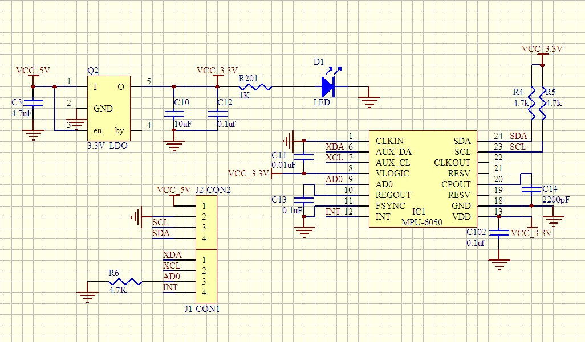

MPU6050传感器—姿态检测
----------------------

本章参考数据：《STM32F10x参考手册》、《STM32F10x数据手册》。

关于MPU6050的参考资料：《MPU-60X0寄存器》、《MPU6050数据手册》以及官方驱动《motion_driver_6.12》。

本章讲解的内容跨领域的知识较多，若您感兴趣，请自行查阅各方面的资料，对比学习。

姿态检测
~~~~~~~~~~~~~~~~~~

基本认识
'''''''''''''''''

在飞行器中，飞行姿态是非常重要的参数，见
图46_1_，以飞机自身的中心建立坐标系，当飞机绕坐标轴旋转的时候，会分别影响偏航角、横滚角及俯仰角。

.. image:: media/image2.jpeg
   :align: center
   :alt: 图 46‑1 表示飞机姿态的偏航角、横滚角及俯仰角
   :name: 图46_1

图 46‑1 表示飞机姿态的偏航角、横滚角及俯仰角

假如我们知道飞机初始时是左上角的状态，只要想办法测量出基于原始状态的三个姿态角的变化量，再进行叠加，就可以获知它的实时姿态了。

坐标系
'''''''''''''''''''

抽象来说，姿态是“载体坐标系”与“地理坐标系”之间的转换关系。

图 46‑2 地球坐标系、地理坐标系与载体坐标系

我们先来了解三种常用的坐标系：

-  地球坐标系：以地球球心为原点，Z轴沿地球自转轴方向，X、Y轴在赤道平面内的坐标系。

-  地理坐标系：它的原点在地球表面(或运载体所在的点)，Z轴沿当地地理垂线的方向(重力加速度方向)，XY轴沿当地经纬线的切线方向。
   根据各个轴方向的不同，可选为“东北天”、“东南天”、“西北天”等坐标系。这是我们日常生活中使用的坐标系，平时说的东南西北方向与这个坐标系东南西北的概念一致。

-  载体坐标系：载体坐标系以运载体的质心为原点，一般根据运载体自身结构方向构成坐标系，如Z轴上由原点指向载体顶部，Y轴指向载体头部，
   X轴沿载体两侧方向。上面说基于飞机建立的坐标系就是一种载体坐标系，可类比到汽车、舰船、人体、动物或手机等各种物体。

地理坐标系与载体坐标系都以载体为原点，所以它们可以经过简单的旋转进行转换，载体的姿态角就是根据载体坐标系与地理坐标系的夹角来确定的。配合
图46_1_，发挥您的空间想象力，假设初始状态中，飞机的Z轴、X轴及Y轴分别与地理坐标系的天轴、北轴、东轴平行。如当飞机绕自身的“Z”轴旋转，它会使自身的“Y”轴方向与地理坐标系的“南北”方向偏离一定角度，该角度就称为偏航角(Yaw)；当载体绕自身的“X”轴旋转，它会使自身的“Z”轴方向与地理坐标系的“天地”方向偏离一定角度，该角度称为俯仰角(Pitch)；当载体绕自身的“Y”轴旋转，它会使自身的“X”轴方向与地理坐标系的“东西”方向偏离一定角度，该角度称为横滚角。

   表 46‑1 姿态角的关系

================== =============== ===================
坐标系间的旋转角度 说明            载体自身旋转
偏航角(Yaw)        Y轴与北轴的夹角 绕载体Z轴旋转可改变
俯仰角(Pitch)      Z轴与天轴的夹角 绕载体X轴旋转可改变
横滚角(Roll)       X轴与东轴的夹角 绕载体Y轴旋转可改变
================== =============== ===================

这些角度也称欧拉角，是用于描述姿态的非常直观的角度。

利用陀螺仪检测角度
'''''''''''''''''''

最直观的角度检测器就是陀螺仪了，见 图46_3_，它可以检测物体绕坐标轴转动的“角速度”，
如同将速度对时间积分可以求出路程一样，将角速度对时间积分就可以计算出旋转的“角度”。

图 46‑3 陀螺仪检测示意图

陀螺仪检测的缺陷
..................

由于陀螺仪测量角度时使用积分，会存在积分误差，见 图46_4_，若积分时间Dt越小，误差就越小。这十分容易理解，
例如计算路程时，假设行车时间为1小时，我们随机选择行车过程某个时刻的速度Vt乘以1小时，求出的路程误差是极大的，因为行车的过程中并不是每个时刻都等于该时刻速度的，如果我们每5分钟检测一次车速，可得到Vt1、Vt2、Vt3-Vt12这12个时刻的车速，对各个时刻的速度乘以时间间隔(5分钟)，并对这12个结果求和，就可得出一个相对精确的行车路程了，不断提高采样频率，就可以使积分时间Dt变小，降低误差。

图 46‑4 积分误差

同样地，提高陀螺仪传感器的采样频率，即可减少积分误差，目前非常普通的陀螺仪传感器的采样频率都可以达到8KHz，已能满足大部分应用的精度要求。

更难以解决的是器件本身误差带来的问题。例如，某种陀螺仪的误差是0.1度/秒，当陀螺仪静止不动时，理想的角速度应为0，无论它静止多久，对它进行积分测量得的旋转角度都是0，这是理想的状态；而由于存在0.1度/秒的误差，当陀螺仪静止不动时，它采样得的角速度一直为0.1度/秒，若静止了1分钟，对它进行积分测量得的旋转角度为6度，若静止了1小时，陀螺仪进行积分测量得的旋转角度就是360度，即转过了一整圈，这就变得无法忍受了。只有当正方向误差和负方向误差能正好互相抵消的时候，才能消除这种累计误差。

利用加速度计检测角度
''''''''''''''''''''''

由于直接用陀螺仪测量角度在长时间测量时会产生累计误差，因而我们又引入了检测倾角的传感器。

图 46‑5 T字型水平仪

测量倾角最常见的例子是建筑中使用的水平仪，在重力的影响下，水平仪内的气泡能大致反映水柱所在直线与重力方向的夹角关系，利用
图46_5_ 中的T字型水平仪，可以检测出 图46_1_ 中说明的横滚角与俯仰角，但是偏航角是无法以这样的方式检测的。

在电子设备中，一般使用加速度传感器来检测倾角，它通过检测器件在各个方向的形变情况而采样得到受力数据，根据F=ma转换，传感器直接输出加速度数据，因而被称为加速度传感器。由于地球存在重力场，所以重力在任何时刻都会作用于传感器，当传感器静止的时候(实际上加速度为0)，传感器会在该方向检测出加速度g，不能认为重力方向测出的加速度为g，就表示传感器在该方向作加速度为g的运动。

当传感器的姿态不同时，它在自身各个坐标轴检测到的重力加速度是不一样的，利用各方向的测量结果，根据力的分解原理，
可求出各个坐标轴与重力之间的夹角，见 图46_6_。

图 46‑6 重力检测

因为重力方向是与地理坐标系的“天地”轴固连的，所以通过测量载体坐标系各轴与重力方向的夹角即可求得它与地理坐标系的角度旋转关系，从而获知载体姿态。

加速度传感器检测的缺陷
.........................

由于这种倾角检测方式是利用重力进行检测的，它无法检测到偏航角(Yaw)，原理跟T字型水平仪一样，无论如何设计水平仪，水泡都无法指示这样的角度。

另一个缺陷是加速度传感器并不会区分重力加速度与外力加速度，当物体运动的时候，它也会在运动的方向检测出加速度，特别在震动的状态下，传感器的数据会有非常大的数据变化，此时难以反应重力的实际值。

利用磁场检测角度
'''''''''''''''''''''

为了弥补加速度传感器无法检测偏航角(Yaw)的问题，我们再引入磁场检测传感器，它可以检测出各个方向上的磁场大小，通过检测地球磁场，它可实现指南针的功能，所以也被称为电子罗盘。由于地磁场与地理坐标系的“南北”轴固联，利用磁场检测传感器的指南针功能，就可以测量出偏航角(Yaw)了。

磁场检测器的缺陷
.......................

与指南针的缺陷一样，使用磁场传感器会受到外部磁场干扰，如载体本身的电磁场干扰，不同地理环境的磁铁矿干扰等等。

利用GPS检测角度
'''''''''''''''''''

使用GPS可以直接检测出载体在地球上的坐标，假如载体在某时刻测得坐标为A，另一时刻测得坐标为B，利用两个坐标即可求出它的航向，即可以确定偏航角，且不受磁场的影响，但这种检测方式只有当载体产生大范围位移的时候才有效(GPS民用精度大概为10米级)。

姿态融合与四元数
''''''''''''''''''''

可以发现，使用陀螺仪检测角度时，在静止状态下存在缺陷，且受时间影响，而加速度传感器检测角度时，在运动状态下存在缺陷，且不受时间影响，刚好互补。假如我们同时使用这两种传感器，并设计一个滤波算法，当物体处于静止状态时，增大加速度数据的权重，当物体处于运动状时，增大陀螺仪数据的权重，从而获得更准确的姿态数据。同理，检测偏航角，当载体在静止状态时，可增大磁场检测器数据的权重，当载体在运动状态时，增大陀螺仪和GPS检测数据的权重。这些采用多种传感器数据来检测姿态的处理算法被称为姿态融合。

在姿态融合解算的时候常常使用“四元数”来表示姿态，它由三个实数及一个虚数组成，因而被称之为四元数。使用四元数表示姿态并不直观，但因为使用欧拉角(即前面说的偏航角、横滚角及俯仰角)表示姿态的时候会有“万向节死锁”问题，且运算比较复杂，所以一般在数据处理的时候会使用四元数，处理完毕后再把四元数转换成欧拉角。在这里我们只要了解四元数是姿态的另一种表示方式即可，感兴趣的话可自行查阅相关资料。

传感器
~~~~~~~~~~~~~~~

传感器工作原理
''''''''''''''''

前文提到了各种传感器，在这里大致讲解一下传感器的工作原理。我们讲的传感器一般是指把物理量转化成电信号量的装置，见
图46_7_。

图 46‑7传感器工作原理

敏感元件直接感受被测物理量，并输出与该物理量有确定关系的信号，经过转换元件将该物理量信号转换为电信号，变换电路对转换元件输出的电信号进行放大调制，最后输出容易检测的电信号量。例如，温度传感器可把温度量转化成电压信号量输出，且温度值与电压值成比例关系，我们只要使用ADC测量出电压值，并根据转换关系即可求得实际温度值。而前文提到的陀螺仪、加速度及磁场传感器也是类似的，它们检测的角速度、加速度及磁场强度与电压值有确定的转换关系。

传感器参数
''''''''''''''''

传感器一般使用精度、分辨率及采样频率这些参数来进行比较，衡量它的性能，见表46‑2。

   表 46‑2 传感器参数

======== ==============================================
参数     说明
线性误差 指传感器测量值与真实物理量值之间的拟合度误差。
分辨率   指传感器可检测到的最小物理量的单位。
采样频率 指在单位时间内的采样次数。
======== ==============================================

其中误差与分辨率是比较容易混淆的概念，以使用尺子测量长度为例，误差就是指尺子准不准，使用它测量出10厘米，与计量机构标准的10厘米有多大区别，若区别在5毫米以内，我们则称这把尺子的误差为5毫米。而分辨率是指尺子的最小刻度值，假如尺子的最小刻度值为1厘米，我们称这把尺子的分辨率为1厘米，它只能用于测量厘米级的尺寸，对于毫米级的长度，这就无法用这把尺子进行测量了。如果把尺子加热拉长，尺子的误差会大于5毫米，但它的分辨率仍为1厘米，只是它测出的1厘米值与真实值之间差得更远了。

物理量的表示方法
''''''''''''''''

大部分传感器的输出都是与电压成比例关系的，电压值一般采用ADC来测量，而ADC一般有固定的位数，如8位ADC、12位ADC等，ADC的位数会影响测量的分辨率及量程。例如图
46‑8，假设用一个2位的ADC来测量长度，2位的ADC最多只能表示0、1、2、3这四个数，假如它的分辨率为20厘米，那么它最大的测量长度为60厘米，假如它的分辨率为10厘米，那么它的最大测量长度为30厘米，由此可知，对于特定位数的ADC，量程和分辨率不可兼得。

图 46‑8 ADC表示的物理量范围

在实际应用中，常常直接用ADC每位表征的物理量值来表示分辨率，如每位代表20厘米，我们称它的分辨率为1LSB/20cm，它等效于5位表示1米：5LSB/m。其中的LSB（Least
Significant Bit），意为最ADC的低有效位。

使用采样得到的ADC数值，除以分辨率，即可求取得到物理量。例如使用分辨率为5LSB/m、线性误差为0.1m的传感器进行长度测量，其ADC采样得到数据值为“20”，可计算知道该传感器的测量值为4米，而该长度的真实值介于3.9-4.1米之间。

MPU6050模块简介
~~~~~~~~~~~~~~~

MPU6050模块功能及外观
''''''''''''''''''''''''''''

接下来我们使用传感器实例来讲解如何检测物体的姿态。在我们的开发板上有引出I2C总线接口，方便用于扩展使用I2C协议通讯的传感器模块，
本节中我们将在板子上扩展MPU6050陀螺仪模块，见 图47_9_。它是一种六轴传感器模块，采用InvenSense公司的MPU6050作为主芯片，能同时检测三轴加速度、三轴陀螺仪(三轴角速度)的运动数据以及温度数据。利用MPU6050芯片内部的DMP模块（Digital
Motion Processor数字运动处理器），可对传感器数据进行滤波、融合处理，它直接通过I2C接口向主控器输出姿态解算后的姿态数据，
降低主控器的运算量。其姿态解算频率最高可达200Hz，非常适合用于对姿态控制实时要求较高的领域。常见应用于手机、智能手环、四轴飞行器及计步器等的姿态检测。

图 47‑9 MPU6050模块外观

MPU6050模块的引脚功能说明
''''''''''''''''''''''''''''

该模块引出的8个引脚功能说明见表 47‑3。

表 47‑3 MPU6050模块引脚说明

==== ======== =======================================================
序号 引脚名称 说明
1    VCC      3.3/5V 电源输入
2    GND      地线
3    SCL      I2C从时钟信号线SCL (模块上已接上拉电阻)
4    SDA      I2C从数据信号线SDA (模块上已接上拉电阻)
5    XDA      I2C主串行数据信号线，用于外接传感器(模块上已接上拉电阻)
6    XCL      I2C主串行时钟信号线，用于外接传感器(模块上已接上拉电阻)
7    AD0      从机地址设置引脚

              -  接地或悬空时, 地址为: 0x68
              -  接VCC时，地址为:0x69
8    INT      中断输出引脚
==== ======== =======================================================

其中的SDA/SCL、XDA/XCL通讯引脚分别为两组I2C信号线。当模块与外部主机通讯时，使用SDA/SCL，如与STM32芯片通讯；而XDA/XCL则用于MPU6050芯片与其它I2C传感器通讯时使用，例如使用它与磁场传感器连接，MPU6050模块可以把从主机SDA/SCL接收的数据或命令通过XDA/XCL引脚转发到磁场传感器中。但实际上这种功能比较鸡肋，控制麻烦且效率低，一般会直接把磁场传感器之类的I2C传感器直接与MPU6050挂载在同一条总线上（即都连接到SDA/SCL），使用主机直接控制。

MPU6050模块的硬件原理图
''''''''''''''''''''''''''''

MPU6050模块的硬件原理图见 图47_10_。

图 47‑10 MPU6050模块原理图

它的硬件非常简单，SDA与SCL被引出方便与外部I2C主机连接，看图中的右上角，可知该模块的I2C通讯引脚SDA及SCL已经连接了上拉电阻，因此它与外部I2C通讯主机通讯时直接使用导线连接起来即可；而MPU6050模块与其它传感器通讯使用的XDA、XCL引脚没有接上拉电阻，要使用时需要注意。模块自身的I2C设备地址可通过AD0引脚的电平控制，当AD0接地时，设备地址为0x68(七位地址)，当AD0接电源时，设备地址为0x69(七位地址)。另外，当传感器有新数据的时候会通过INT引脚通知STM32。

由于MPU6050检测时是基于自身中心坐标系的，见 图46_9_，它表示的坐标系及旋转符号标出了MPU6050传感器的XYZ轴的
加速度有角速度的正方向。所以在安装模块时，您需要考虑它与所在设备的坐标系统的关系。

图 46‑9 MPU6050传感器的坐标及方向

图46_9_ 中表示的坐标系及旋转符号标出了MPU6050传感器的XYZ轴的加速度有角速度的正方向。

MPU6050的特性参数
~~~~~~~~~~~~~~~~~~

实验板中使用的MPU6050传感器参数见表 46‑3。

   表 46‑3 MPU6050的特性参数

================== =====================================================
参数               说明
供电               3.3V-5V
通讯接口           I2C协议，支持的I2C时钟最高频率为400KHz
测量维度           加速度：3维 陀螺仪：3维
ADC分辨率          加速度：16位 陀螺仪：16位
\
加速度测量范围     ±2g、±4g、±8g、±16g 其中g为重力加速度常数，g=9.8m/s ²
加速度最高分辨率   16384 LSB/g
加速度线性误差     0.1g
加速度输出频率     最高1000Hz
\
陀螺仪测量范围     ±250 º/s 、±500 º/s 、±1000 º/s、±2000 º/s、
陀螺仪最高分辨率   131 LSB/( º/s)
陀螺仪线性误差     0.1 º/s
陀螺仪输出频率     最高 8000Hz
\
DMP姿态解算频率    最高200Hz
\
温度传感器测量范围 -40~ +85℃
温度传感器分辨率   340 LSB/℃
温度传感器线性误差 ±1℃
\
工作温度           -40~ +85℃
功耗               500uA~3.9mA (工作电压3.3V)
================== =====================================================

该表说明，加速度与陀螺仪传感器的ADC均为16位，它们的量程及分辨率可选多种模式，见
图46_11_，量程越大，分辨率越低。

图 46‑10 加速度配置跟量程的关系

图 46‑11 陀螺仪的几种量程配置

从表中还可了解到传感器的加速度及陀螺仪的采样频率分别为1000Hz及8000Hz，它们是指加速度及角速度数据的采样频率，
我们可以使用STM32控制器把这些数据读取出来然后进行姿态融合解算，以求出传感器当前的姿态(即求出偏航角、横滚角、俯仰角)。
而如果我们使用传感器内部的DMP单元进行解算，它可以直接对采样得到的加速度及角速度进行姿态解算，解算得到的结果再输出给STM32控制器，
即STM32无需自己计算，可直接获取偏航角、横滚角及俯仰角，该DMP每秒可输出200次姿态数据。

MPU6050—获取原始数据实验
~~~~~~~~~~~~~~~~~~~~~~~~

这一小节我们学习如何使用STM32控制MPU6050传感器读取加速度、角速度及温度数据。在控制传感器时，使用到了STM32的I2C驱动，就如同控制STM32一样，对MPU6050传感器的不同寄存器写入不同内容可以实现不同模式的控制，从特定的寄存器读取内容则可获取测量数据，这部分关于MPU6050具体寄存器的内容我们不再展开，请您查阅《MPU-60X0寄存器》手册获知。

硬件设计
''''''''''''''''

在实验前，我们先用杜邦线把STM32开发板与该MPU6050模块连接起来，见
图47_14_ 及表 47‑5。

.. image:: media/image15.jpeg
   :align: center
   :alt: 图 47‑14 STM32与MPU6050的硬件连接
   :name: 图47_14

图 47‑14 STM32与MPU6050的硬件连接

表 47‑5 MPU6050模块引脚说明

==== ======== =================
序号 引脚名称 与STM32开发板连接
1    VCC      接3.3V或5V
2    GND      GND
3    SCL      PB6
4    SDA      PB7
5    AD0      悬空或接地
6    INT      PA11
==== ======== =================

软件设计
''''''''''''''''

本小节讲解的是“硬件STM32-MPU6050”实验，请打开配套的代码工程阅读理解。为了方便展示及移植，我们把STM32的I2C驱动相关的代码都编写到“bsp_i2c.c”及“bsp_i2c.h”文件中，与MPU6050传感器相关的代码都写到“mpu6050.c”及“mpu6050.h”文件中，这些文件是我们自己编写的，不属于HAL库的内容，可根据您的喜好命名文件。

程序设计要点
.................

(1) 初始化STM32的I2C；

(2) 使用I2C向MPU6050写入控制参数；

(3) 定时读取加速度、角速度及温度数据。

代码分析
.................

I2C的硬件定义
===================

本实验中的I2C驱动与MPU6050驱动分开主要是考虑到扩展其它传感器时的通用性，如使用磁场传感器、气压传感器都可以使用同样一个I2C驱动，
这个驱动只要给出针对不同传感器时的不同读写接口即可。关于STM32的I2C驱动原理请参考读写EEPROM的章节，本章讲解的I2C驱动主要针对接口封装讲解，
细节不再赘述。本实验中的I2C硬件定义见 代码清单46_1_。

.. code-block:: c
   :caption: 代码清单 46‑1 I2C的硬件定义(bsp_i2c.h文件)
   :name: 代码清单46_1

   /*引脚定义*/
      #define SENSORS_I2C              		      I2C2
      #define SENSORS_I2C_RCC_CLK_ENABLE()   	 __HAL_RCC_I2C2_CLK_ENABLE()
      #define SENSORS_I2C_FORCE_RESET()    		 __HAL_RCC_I2C2_FORCE_RESET()
      #define SENSORS_I2C_RELEASE_RESET()  		 __HAL_RCC_I2C2_RELEASE_RESET()

      /*引脚定义*/ 
      #define SENSORS_I2C_SCL_GPIO_PORT         GPIOB
      #define SENSORS_I2C_SCL_GPIO_CLK_ENABLE() __HAL_RCC_GPIOB_CLK_ENABLE()
      #define SENSORS_I2C_SCL_GPIO_PIN         	GPIO_PIN_10
      
      #define SENSORS_I2C_SDA_GPIO_PORT         GPIOB
      #define SENSORS_I2C_SDA_GPIO_CLK_ENABLE()  __HAL_RCC_GPIOB_CLK_ENABLE()
      #define SENSORS_I2C_SDA_GPIO_PIN          GPIO_PIN_11

      #define SENSORS_I2C_AF                  	 GPIO_AF4_I2C2

这些宏根据传感器使用的I2C硬件封装起来了。

初始化I2C
===================

接下来利用这些宏对I2C进行初始化，初始化过程与I2C读写EEPROM中的无异，见
代码清单46_2_。

.. code-block:: c
   :caption: 代码清单 46‑2 初始化I2C（bsp_i2c.c文件）
   :name: 代码清单46_2

   void I2cMaster_Init(void)
   {
      GPIO_InitTypeDef GPIO_InitStructure;

      /* 使能I2Cx时钟 */
      SENSORS_I2C_RCC_CLK_ENABLE();

      /* 使能I2C GPIO 时钟 */
      SENSORS_I2C_SCL_GPIO_CLK_ENABLE();
      SENSORS_I2C_SDA_GPIO_CLK_ENABLE();

      /* 配置I2Cx引脚: SCL ----------------------------------------*/
      GPIO_InitStructure.Pin =  SENSORS_I2C_SCL_GPIO_PIN;
      GPIO_InitStructure.Mode = GPIO_MODE_AF_OD;
      GPIO_InitStructure.Speed = GPIO_SPEED_FREQ_HIGH;
      GPIO_InitStructure.Pull= GPIO_NOPULL;
   //  GPIO_InitStructure.Alternate=SENSORS_I2C_AF;
      HAL_GPIO_Init(SENSORS_I2C_SCL_GPIO_PORT, &GPIO_InitStructure);

      /* 配置I2Cx引脚: SDA ----------------------------------------*/
      GPIO_InitStructure.Pin = SENSORS_I2C_SDA_GPIO_PIN;
      HAL_GPIO_Init(SENSORS_I2C_SDA_GPIO_PORT, &GPIO_InitStructure);

      if (HAL_I2C_GetState(&I2C_Handle) == HAL_I2C_STATE_RESET) {
            /* 强制复位I2C外设时钟 */
            SENSORS_I2C_FORCE_RESET();

            /* 释放I2C外设时钟复位 */
            SENSORS_I2C_RELEASE_RESET();

            /* I2C 配置 */
            I2C_Handle.Instance = SENSORS_I2C;
            I2C_Handle.Init.AddressingMode  = I2C_ADDRESSINGMODE_7BIT;
            I2C_Handle.Init.ClockSpeed      = 400000;
            I2C_Handle.Init.DualAddressMode = I2C_DUALADDRESS_DISABLE;
            I2C_Handle.Init.DutyCycle       = I2C_DUTYCYCLE_2;
            I2C_Handle.Init.GeneralCallMode = I2C_GENERALCALL_DISABLE;
            I2C_Handle.Init.NoStretchMode   = I2C_NOSTRETCH_DISABLE;
            I2C_Handle.Init.OwnAddress1     = 0;
            I2C_Handle.Init.OwnAddress2     = 0;
            /* 初始化I2C */
            HAL_I2C_Init(&I2C_Handle);
   //    /* 使能模拟滤波器 */
   //    HAL_I2CEx_AnalogFilter_Config(&I2C_Handle, I2C_ANALOGFILTER_ENABLE);
      }
   }

对读写函数的封装
===================

初始化完成后就是编写I2C读写函数了，这部分跟EERPOM的一样，主要是调用STM32
HAL库函数读写数据寄存器及标志位，本实验的这部分被编写进ST_Sensors_I2C_WriteRegister及ST_Sensors_I2C_ReadRegister中了，
在它们之上，再封装成了Sensors_I2C_WriteRegister及Sensors_I2C_ReadRegister，见
代码清单46_3_。

.. code-block:: c
   :caption: 代码清单 46‑3 对读写函数的封装(i2c.c文件)
   :name: 代码清单46_3

   /**
   * @brief  写寄存器，这是提供给上层的接口
   * @param  slave_addr: 从机地址
   * @param  reg_addr:寄存器地址
   * @param len：写入的长度
   * @param data_ptr:指向要写入的数据
   * @retval 正常为0，不正常为非0
   */
   int Sensors_I2C_WriteRegister(unsigned char slave_addr,
                                 unsigned char reg_addr,
                                 unsigned short len,
                                 unsigned char *data_ptr)
   {
      HAL_StatusTypeDef status = HAL_OK;
      status = HAL_I2C_Mem_Write(&I2C_Handle, slave_addr, reg_addr,
      I2C_MEMADD_SIZE_8BIT,data_ptr, len,I2Cx_FLAG_TIMEOUT);
      if (status != HAL_OK) {/* 检查通讯状态 */
         /* 总线出错处理 */
         I2Cx_Error(slave_addr);
      }
      while (HAL_I2C_GetState(&I2C_Handle) != HAL_I2C_STATE_READY) {
   }
      /* 检查SENSOR是否就绪进行下一次读写操作 */
      while (HAL_I2C_IsDeviceReady(&I2C_Handle, slave_addr,
      I2Cx_FLAG_TIMEOUT, I2Cx_FLAG_TIMEOUT) == HAL_TIMEOUT);
      /* 等待传输结束 */
      while (HAL_I2C_GetState(&I2C_Handle) != HAL_I2C_STATE_READY) {

      }
      return status;
   }

   /**
   * @brief  读寄存器，这是提供给上层的接口
   * @param  slave_addr: 从机地址
   * @param  reg_addr:寄存器地址
   * @param len：要读取的长度
   * @param data_ptr:指向要存储数据的指针
   * @retval 正常为0，不正常为非0
   */
   int Sensors_I2C_ReadRegister(unsigned char slave_addr,
                              unsigned char reg_addr,
                              unsigned short len,
                              unsigned char *data_ptr)
   {
      HAL_StatusTypeDef status = HAL_OK;
      status =HAL_I2C_Mem_Read(&I2C_Handle,slave_addr
      ,reg_addr,I2C_MEMADD_SIZE_8BIT,data_ptr,len,I2Cx_FLAG_TIMEOUT);
      if (status != HAL_OK) {/* 检查通讯状态 */
         /* 总线出错处理 */
         I2Cx_Error(slave_addr);
      }
      while (HAL_I2C_GetState(&I2C_Handle) != HAL_I2C_STATE_READY) {
      }
      /* 检查SENSOR是否就绪进行下一次读写操作 */
      while (HAL_I2C_IsDeviceReady(&I2C_Handle, slave_addr,
      I2Cx_FLAG_TIMEOUT, I2Cx_FLAG_TIMEOUT) == HAL_TIMEOUT);
      /* 等待传输结束 */
      while (HAL_I2C_GetState(&I2C_Handle) != HAL_I2C_STATE_READY) {

      }
      return status;
   }

封装后的函数主要是增加了错误重试机制，若读写出现错误，则会进行多次尝试，多次尝试均失败后会返回错误代码。这个函数作为I2C驱动对外的接口，其它使用I2C的传感器调用这个函数进行读写寄存器。

MPU6050的寄存器定义
===================

MPU6050有各种各样的寄存器用于控制工作模式，我们把这些寄存器的地址、寄存器位使用宏定义到了mpu6050.h文件中了，见
代码清单46_4_。

.. code-block:: c
   :caption: 代码清单 46‑4 MPU6050的寄存器定义(mpu6050.h)
   :name: 代码清单46_4

   //模块的A0引脚接GND，IIC的7位地址为0x68，若接到VCC，需要改为0x69
   #define MPU6050_SLAVE_ADDRESS  (0x68<<1)      //MPU6050器件读地址
   #define MPU6050_WHO_AM_I        0x75
   #define MPU6050_SMPLRT_DIV      0  //8000Hz
   #define MPU6050_DLPF_CFG        0
   #define MPU6050_GYRO_OUT        0x43     //MPU6050陀螺仪数据寄存器地址
   #define MPU6050_ACC_OUT         0x3B     //MPU6050加速度数据寄存器地址
   #define MPU6050_RA_XG_OFFS_TC       0x00 //[7] PWR_MODE, [6:1]
   /*.........以下部分省略*/

初始化MPU6050
===================

根据MPU6050的寄存器功能定义，我们使用I2C往寄存器写入特定的控制参数，见
代码清单46_5_。

.. code-block:: c
   :caption: 代码清单 46‑5 初始化MPU6050(mpu6050.c)
   :name: 代码清单46_5

   /**
   * @brief   写数据到MPU6050寄存器
   * @param   reg_add:寄存器地址
   * @param   reg_data:要写入的数据
   * @retval
   */
   void MPU6050_WriteReg(u8 reg_add,u8 reg_dat)
   {
      Sensors_I2C_WriteRegister(MPU6050_ADDRESS,reg_add,1,&reg_dat);
   }

   /**
   * @brief   从MPU6050寄存器读取数据
   * @param   reg_add:寄存器地址
   * @param   Read：存储数据的缓冲区
   * @param   num：要读取的数据量
   * @retval
   */
   void MPU6050_ReadData(u8 reg_add,unsigned char* Read,u8 num)
   {
      Sensors_I2C_ReadRegister(MPU6050_ADDRESS,reg_add,num,Read);
   }

   /**
   * @brief   初始化MPU6050芯片
   * @param
   * @retval
   */
   void MPU6050_Init(void)
   {
      int i=0,j=0;
      //在初始化之前要延时一段时间，若没有延时，则断电后再上电数据可能会出错
      for (i=0; i<1000; i++) {
         for (j=0; j<1000; j++) {
               ;
         }
      }
      //解除休眠状态
      MPU6050_WriteReg(MPU6050_RA_PWR_MGMT_1, 0x00);
      //陀螺仪采样率
      MPU6050_WriteReg(MPU6050_RA_SMPLRT_DIV , 0x07);
      MPU6050_WriteReg(MPU6050_RA_CONFIG , 0x06);
      //配置加速度传感器工作在16G模式
      MPU6050_WriteReg(MPU6050_RA_ACCEL_CONFIG , 0x01);
      //陀螺仪自检及测量范围，典型值：0x18(不自检，2000deg/s)
      MPU6050_WriteReg(MPU6050_RA_GYRO_CONFIG, 0x18);
   }

这段代码首先使用MPU6050_ReadData及MPU6050_WriteRed函数封装了I2C的底层读写驱动，接下来用它们在MPU6050_Init函数中向MPU6050寄存器写入控制参数，设置了MPU6050的采样率、量程(分辨率)。

读传感器ID
===================

初始化后，可通过读取它的“WHO AM I”寄存器内容来检测硬件是否正常，该寄存器存储了ID号0x68，见
代码清单46_6_。

.. code-block:: c
   :caption: 代码清单 46‑6 读取传感器ID(mpu6050.c)
   :name: 代码清单46_6

   /**
      * @brief   读取MPU6050的ID
      * @param
      * @retval  正常返回1，异常返回0
      */
   uint8_t MPU6050ReadID(void)
   {
      unsigned char Re = 0;
      MPU6050_ReadData(MPU6050_RA_WHO_AM_I,&Re,1);    //读器件地址
      if (Re != 0x68) {
         MPU_ERROR("检测不到MPU6050模块，请检查模块与开发板的接线");
         return 0;
      } else {
         MPU_INFO("MPU6050 ID = %d\r\n",Re);
         return 1;
      }
   }

读取原始数据
===================

若传感器检测正常，就可以读取它数据寄存器获取采样数据了，见 代码清单46_7_。

.. code-block:: c
   :caption: 代码清单 46‑7 读取传感器数据(mpu6050.c)
   :name: 代码清单46_7

   /**
   * @brief   读取MPU6050的加速度数据
   * @param
   * @retval
   */
   void MPU6050ReadAcc(short *accData)
   {
      u8 buf[6];
      MPU6050_ReadData(MPU6050_ACC_OUT, buf, 6);
      accData[0] = (buf[0] << 8) | buf[1];
      accData[1] = (buf[2] << 8) | buf[3];
      accData[2] = (buf[4] << 8) | buf[5];
   }

   /**
   * @brief   读取MPU6050的角加速度数据
   * @param
   * @retval
   */
   void MPU6050ReadGyro(short *gyroData)
   {
      u8 buf[6];
      MPU6050_ReadData(MPU6050_GYRO_OUT,buf,6);
      gyroData[0] = (buf[0] << 8) | buf[1];
      gyroData[1] = (buf[2] << 8) | buf[3];
      gyroData[2] = (buf[4] << 8) | buf[5];
   }

   /**
   * @brief   读取MPU6050的原始温度数据
   * @param
   * @retval
   */
   void MPU6050ReadTemp(short *tempData)
   {
      u8 buf[2];
      MPU6050_ReadData(MPU6050_RA_TEMP_OUT_H,buf,2);     //读取温度值
      *tempData = (buf[0] << 8) | buf[1];
   }

   /**
   * @brief   读取MPU6050的温度数据，转化成摄氏度
   * @param
   * @retval
   */
   void MPU6050_ReturnTemp(float*Temperature)
   {
      short temp3;
      u8 buf[2];

      MPU6050_ReadData(MPU6050_RA_TEMP_OUT_H,buf,2);     //读取温度值
      temp3= (buf[0] << 8) | buf[1];
      *Temperature=((double) (temp3 /340.0))+36.53;
   }

其中前以上三个函数分别用于读取三轴加速度、角速度及温度值，这些都是原始的ADC数值(16位长)，对于加速度和角速度，把读取得的ADC值除以分辨率，即可求得实际物理量数值。最后一个函数MPU6050_ReturnTemp展示了温度ADC值与实际温度值间的转换，它是根据MPU6050的说明给出的转换公式进行换算的，注意陀螺仪检测的温度会受自身芯片发热的影响，严格来说它测量的是自身芯片的温度，所以用它来测量气温是不太准确的。对于加速度和角速度值我们没有进行转换，在下一小节中我们直接利用这些数据交给DMP单元，求解出姿态角。

main函数
===================

最后我们来看看本实验的main函数，见 代码清单46_8_。

.. code-block:: c
   :caption: 代码清单 46‑8 main 函数
   :name: 代码清单46_8

   int main(void)
   {

      short Acel[3];
      short Gyro[3];
      float Temp;

      SystemClock_Config();

      /* LED 端口初始化 */
      LED_GPIO_Config();
      /* 串口通信初始化 */
      DEBUG_USART_Config();

      //I2C初始化
      I2cMaster_Init();
      //MPU6050初始化
      MPU6050_Init();

      //检测MPU6050
      if (MPU6050ReadID() == 1) {
            while (1) {
               if (Task_Delay[0]==TASK_ENABLE) {
                  LED2_TOGGLE;
                  Task_Delay[0]=1000;
               }

               if (Task_Delay[1]==0) {
                  MPU6050ReadAcc(Acel);
                  printf("加速度：%8d%8d%8d",Acel[0],Acel[1],Acel[2]);
                  MPU6050ReadGyro(Gyro);
                  printf("    陀螺仪%8d%8d%8d",Gyro[0],Gyro[1],Gyro[2]);
                  MPU6050_ReturnTemp(&Temp);
                  printf("    温度%8.2f\r\n",Temp);

                  Task_Delay[1]=500;//更新一次数据，可根据自己的需求，提高采样频率，如100ms采样一次
               }
            }
      } else {
            printf("\r\n没有检测到MPU6050传感器！\r\n");
            LED_RED;
            while (1);
      }
   }

本实验中控制MPU6050并没有使用中断检测，我们是利用Systick定时器进行计时，隔一段时间读取MPU6050的数据寄存器获取采样数据的，代码中使用Task_Delay变量来控制定时时间，在Systick中断里会每隔1ms对该变量值减1，所以当它的值为0时表示定时时间到。

在main函数里，调用I2cMaster_Init、MPU6050_Init及MPU6050ReadID函数后，就在whlie循环里判断定时时间，定时时间到后就读取加速度、角速度及温度值，并使用串口打印信息到电脑端。

通过宏定义USE_LCD_DISPLAY来确定是否在LCD液晶上显示传感器的数据。

下载验证
.............

使用杜邦线连接好开发板和模块，用USB线连接开发板“USB TO
UART”接口跟电脑，在电脑端打开串口调试助手，把编译好的程序下载到开发板。在串口调试助手可看到MPU6050采样得到的调试信息。

MPU6050—利用DMP进行姿态解算
~~~~~~~~~~~~~~~~~~~~~~~~~~~

上一小节我们仅利用MPU6050采集了原始的数据，如果您对姿态解算的算法深有研究，可以自行编写姿态解算的算法，并利用这些数据，使用STM32进行姿态解算，解算后输出姿态角。而由于MPU6050内部集成了DMP，不需要STM32参与解算，可直接输出姿态角，也不需要对解算算法作深入研究，非常方便，本章讲解如何使用DMP进行解算。

实验中使用的代码主体是从MPU6050官方提供的驱动《motion_driver_6.12》移植过来的，该资料包里提供了基于STM32F1控制器的源代码（本工程正是利用该代码移植到STM32F1上的）及使用python语言编写的上位机，资料中还附带了说明文档，请您充分利用官方自带的资料学习。

硬件设计
'''''''''''''

硬件设计与上一小节实验中的完全一样，且软件中使用了INT引脚产生的中断信号，本小节中的代码默认使用软件I2C。

软件设计
'''''''''''''''

本小节讲解的是“MPU6050_python上位机”实验，请打开配套的代码工程阅读理解。本工程是从官方代码移植过来的(IAR工程移植至MDK)，改动并不多，我们主要给读者讲解一下该驱动的设计思路，方便应用。由于本工程的代码十分庞大，在讲解到某些函数时，请善用MDK的搜索功能，从而在工程中查找出对应的代码。

程序设计要点
...............

(1) 提供I2C读写接口、定时服务及INT中断处理；

(2) 从陀螺仪中获取原始数据并处理；

(3) 更新数据并输出。

代码分析
...............

官方的驱动主要是了MPL软件库(Motion Processing
Library)，要移植该软件库我们需要为它提供I2C读写接口、定时服务以及MPU6050的数据更新标志。若需要输出调试信息到上位机，还需要提供串口接口。

I2C读写接口
=================

MPL库的内部对I2C读写时都使用i2c_write及i2c_read函数，在文件“inv_mpu.c”中给出了它们的接口格式，见
代码清单46_1_。

.. code-block:: c
   :caption: 代码清单 46‑9 I2C读写接口(inv_mpu.c文件)
   :name: 代码清单46_9

   /* 以下函数需要定义成如下格式:
   * i2c_write(unsigned char slave_addr, unsigned char reg_addr,
   *      unsigned char length, unsigned char const *data)
   * i2c_read(unsigned char slave_addr, unsigned char reg_addr,
   *      unsigned char length, unsigned char *data)
   */

   #define i2c_write   Sensors_I2C_WriteRegister
   #define i2c_read    Sensors_I2C_ReadRegister

这些接口的格式与我们上一小节写的I2C读写函数Sensors_I2C_ReadRegister及Sensors_I2C_WriteRegister一致，所以可直接使用宏替换。

提供定时服务
=================

MPL软件库中使用到了延时及时间戳功能，要求需要提供delay_ms函数实现毫秒级延时，提供get_ms获取毫秒级的时间戳，
它们的接口格式也在“inv_mpu.c”文件中给出，见 代码清单46_10_。

.. code-block:: c
   :caption: 代码清单 46‑10 定时服务接口（inv_mpu.c文件）
   :name: 代码清单46_10

   /*
   * delay_ms(unsigned long num_ms)
   * get_ms(unsigned long *count)
   */

   #define delay_ms    Delay_ms
   #define get_ms      get_tick_count

我们为接口提供的Delay_ms及get_tick_count函数定义在bsp_SysTick.c文件，我们使用SysTick每毫秒产生一次中断，进行计时，见
代码清单46_11_。

.. code-block:: c
   :caption: 代码清单 46‑11 使用Systick进行定时（bsp_SysTick.c）
   :name: 代码清单46_11

   static __IO u32 TimingDelay;
   static __IO uint32_t g_ul_ms_ticks=0;
   /**
      * @brief   us延时程序,1ms为一个单位
      * @param
      *   @arg nTime: Delay_ms( 1 ) 则实现的延时为 1 ms
      * @retval  无
      */
   void Delay_ms(__IO u32 nTime)
   {
      TimingDelay = nTime;

      while (TimingDelay != 0);
   }

   /**
      * @brief  获取节拍程序
      * @param  无
      * @retval 无
      * @attention  在 SysTick 中断函数 SysTick_Handler()调用
      */
   void TimingDelay_Decrement(void)
   {
      if (TimingDelay != 0x00) {
            TimingDelay--;
      }
   }

   /**
      * @brief  获取当前毫秒值
      * @param  存储最新毫秒值的变量
      * @retval 无
      */
   int get_tick_count(unsigned long *count)
   {
      count[0] = g_ul_ms_ticks;
      return 0;
   }

   /**
      * @brief  毫秒累加器，在中断里每毫秒加1
      * @param  无
      * @retval 无
      */
   void TimeStamp_Increment (void)
   {
      g_ul_ms_ticks++;
   }

上述代码中的TimingDelay_Decrement和TimeStamp_Increment函数是在Systick的中断服务函数中被调用的，见 代码清单46_12_。
systick被配置为每毫秒产生一次中断，而每次中断中会对TimingDelay变量减1，对g_ul_ms_ticks变量加1。它们分别用于Delay_ms函数利用TimingDelay的值进行阻塞延迟，而get_tick_count函数获取的时间戳即g_ul_ms_ticks的值。

.. code-block:: c
   :caption: 代码清单 46‑12 Systick的中断服务函数(stm32f1xx_it.c文件)
   :name: 代码清单46_12

   /**
   * @brief  SysTick 中断服务函数.
   * @param  None
   * @retval None
   */
   void SysTick_Handler(void)
   {
      TimingDelay_Decrement();
      TimeStamp_Increment();
   }

提供串口调试接口
=================

MPL代码库的调试信息输出函数都集中到了log_stm32.c文件中，我们可以为这些函数提供串口输出接口，以便把这些信息输出到上位机，见
代码清单46_13_。

.. code-block:: c
   :caption: 代码清单 46‑13 串口调试接口(log_stm32.c文件)
   :name: 代码清单46_13

   /*串口输出接口*/
   int fputcc(int ch)
   {
      /* 发送一个字节数据到USART1 */
      USART_SendData(DEBUG_USART, (uint8_t) ch);

      /* 等待发送完毕 */
      while (USART_GetFlagStatus(DEBUG_USART, USART_FLAG_TXE) == RESET);

      return (ch);
   }

   /*输出四元数数据*/
   void eMPL_send_quat(long *quat)
   {
      char out[PACKET_LENGTH];
      int i;
      if (!quat)
         return;
      memset(out, 0, PACKET_LENGTH);
      out[0] = '$';
      out[1] = PACKET_QUAT;
      out[3] = (char)(quat[0] >> 24);
      out[4] = (char)(quat[0] >> 16);
      out[5] = (char)(quat[0] >> 8);
      out[6] = (char)quat[0];
      out[7] = (char)(quat[1] >> 24);
      out[8] = (char)(quat[1] >> 16);
      out[9] = (char)(quat[1] >> 8);
      out[10] = (char)quat[1];
      out[11] = (char)(quat[2] >> 24);
      out[12] = (char)(quat[2] >> 16);
      out[13] = (char)(quat[2] >> 8);
      out[14] = (char)quat[2];
      out[15] = (char)(quat[3] >> 24);
      out[16] = (char)(quat[3] >> 16);
      out[17] = (char)(quat[3] >> 8);
      out[18] = (char)quat[3];
      out[21] = '\r';
      out[22] = '\n';

      for (i=0; i<PACKET_LENGTH; i++) {
         fputcc(out[i]);
      }
   }

上述代码中的fputcc函数是我们自己编写的串口输出接口，它与我们重定向printf函数定义的fputc函数功能很类似。下面的eMPL_send_quat函数是MPL库中的原函数，它用于打印“四元数信息”，在这个log_stm32.c文件中还有输出日志信息的_MLPrintLog函数，输出原始信息到专用上位机的eMPL_send_data函数，它们都调用了fputcc进行输出。

MPU6050的中断接口
==================================

与上一小节中的基础实验不同，为了高效处理采样数据，MPL代码库使用了MPU6050的INT中断信号，为此我们要给提供中断接口，见
代码清单46_14_。

.. code-block:: c
   :caption: 代码清单 46‑14中断接口(stm32f1xx_it.c文件)
   :name: 代码清单46_14

   #define MPU_IRQHandler                   EXTI9_5_IRQHandler

   void MPU_IRQHandler(void)
   {
   if (__HAL_GPIO_EXTI_GET_IT(MPU_INT_GPIO_PIN) != RESET) {
   //确保是否产生了EXTI Line中断
         /* Handle new gyro*/
         gyro_data_ready_cb();

         __HAL_GPIO_EXTI_CLEAR_IT(MPU_INT_GPIO_PIN);     //清除中断标志位
      }
   }

在工程中我们把MPU6050与STM32相连的引脚配置成了中断模式，上述代码是该引脚的中断服务函数，在中断里调用了MPL代码库的gyro_data_ready_cb函数，
它设置了标志变量hal.new_gyro，以通知MPL库有新的数据，其函数定义见 代码清单46_15_。

.. code-block:: c
   :caption: 代码清单 46‑15 设置标志变量(main.c文件)
   :name: 代码清单46_15

   /* 每当有新的数据产生时，本函数会被中断服务函数调用，
   * 在本工程中，它设置标志位用于指示及保护FIFO缓冲区
   */
   void gyro_data_ready_cb(void)
   {
      hal.new_gyro = 1;
   }

main函数执行流程
==================================

了解MPL移植需要提供的接口后，我们直接看main函数了解如何利用MPL库获取姿态数据，见
代码清单46_16_。

.. code-block:: c
   :caption: 代码清单 46‑16 使用MPL进行姿态解算的过程
   :name: 代码清单46_16

   /**
   * @brief  主函数
   * @param  无
   * @retval 无
   */
   int main(void)
   {
      inv_error_t result;
      unsigned char accel_fsr,  new_temp = 0;
      unsigned short gyro_rate, gyro_fsr;
      unsigned long timestamp;
      struct int_param_s int_param;

      SysTick_Init();

      /* LED 端口初始化 */
      LED_GPIO_Config();
      LED_BLUE;

      /* 串口通信初始化 */
      USART_Config();

      //MPU6050中断引脚
      EXTI_Pxy_Config();
      //I2C初始化
      I2cMaster_Init();

      printf("mpu 6050 test start");

      result = mpu_init(&int_param);
      if (result) {
         LED_RED;
         MPL_LOGE("Could not initialize gyro.result =  %d\n",result);
      } else {
         LED_GREEN;
      }

      /* If you're not using an MPU9150 AND you're not using DMP features,
      * this function will place all slaves on the primary bus.
      * mpu_set_bypass(1);
      */

      result = inv_init_mpl();
      if (result) {
         MPL_LOGE("Could not initialize MPL.\n");
      }

      /* 计算6轴和9轴传感器的四元数*/
      inv_enable_quaternion();
      inv_enable_9x_sensor_fusion();

      /* 无运动状态时更新陀螺仪
      * WARNING: These algorithms are mutually exclusive.
      */
      inv_enable_fast_nomot();
      /* inv_enable_motion_no_motion(); */
      /* inv_set_no_motion_time(1000); */

      /* 当温度变化时更新 陀螺仪*/
      inv_enable_gyro_tc();

      /* 允许read_from_mpl使用 MPL APIs. */
      inv_enable_eMPL_outputs();

      result = inv_start_mpl();
      if (result == INV_ERROR_NOT_AUTHORIZED) {
         while (1) {
               MPL_LOGE("Not authorized.\n");
         }
      }
      if (result) {
         MPL_LOGE("Could not start the MPL.\n");
      }

      /* 设置寄存器，开启陀螺仪 */
      /* 唤醒所有传感器 */

      mpu_set_sensors(INV_XYZ_GYRO | INV_XYZ_ACCEL);
      /* 把陀螺仪及加速度数据放进FIFO */
      mpu_configure_fifo(INV_XYZ_GYRO | INV_XYZ_ACCEL);
      mpu_set_sample_rate(DEFAULT_MPU_HZ);

      /* 重新读取配置，确认前面的设置成功  */
      mpu_get_sample_rate(&gyro_rate);
      mpu_get_gyro_fsr(&gyro_fsr);
      mpu_get_accel_fsr(&accel_fsr);

      /*使用MPL同步配置 */
      /* 设置每毫秒的采样率*/
      inv_set_gyro_sample_rate(1000000L / gyro_rate);
      inv_set_accel_sample_rate(1000000L / gyro_rate);

      /* 设置chip-to-body原点矩阵.
      * 设置硬件单位为dps/g's/degrees 因子.
      */
      inv_set_gyro_orientation_and_scale(
         inv_orientation_matrix_to_scalar(gyro_pdata.orientation),
         (long)gyro_fsr<<15);
      inv_set_accel_orientation_and_scale(
            inv_orientation_matrix_to_scalar(gyro_pdata.orientation),
            (long)accel_fsr<<15);

      /* 初始化硬件状态相关的变量. */

      hal.sensors = ACCEL_ON | GYRO_ON;

      hal.dmp_on = 0;
      hal.report = 0;
      hal.rx.cmd = 0;
      hal.next_pedo_ms = 0;
      hal.next_compass_ms = 0;
      hal.next_temp_ms = 0;

      /* 获取时间戳 */
      get_tick_count(&timestamp);

      /* 初始化DMP步骤:
         * 1. 调用 dmp_load_motion_driver_firmware().
            它会把inv_mpu_dmp_motion_driver.h文件中的 DMP固件写入到MPU的存储空间
         * 2. 把陀螺仪和加速度的原始数据矩阵送入DMP.
         * 3. 注册姿态回调函数. 除非相应的特性使能了，否则该回调函数不会被执行
         * 4. 调用 dmp_enable_feature(mask) 使能不同的特性.
         * 5. 调用 dmp_set_fifo_rate(freq) 设置DMP输出频率.
         * 6. 调用特定的特性控制相关的函数.
         *
         * 调用 mpu_set_dmp_state(1)使能DMP. 该函数可在DMP运行时被
         * 重复调用设置使能或关闭
         * 以下是 inv_mpu_dmp_motion_driver.c文件中的DMP固件提供的特性的简介：
         * DMP_FEATURE_LP_QUAT: 使用DMP以200Hz的频率产生一个只包含陀螺仪的四元
         数数据以高速的状态解算陀螺仪数据，减少错误
         * DMP_FEATURE_6X_LP_QUAT:使用DMP以200Hz的频率产生陀螺仪/加速度，四元数 .
         它不能与前面的DMP_FEATURE_LP_QUAT同时使用
         * DMP_FEATURE_TAP: 检测 X, Y, 和 Z 轴.
         * DMP_FEATURE_ANDROID_ORIENT:当屏幕翻转时，在四个方向产生一个事件
         * DMP_FEATURE_GYRO_CAL: 若8s内都没有运动，计算陀螺仪的数据
         * DMP_FEATURE_SEND_RAW_ACCEL: 添加原始 加速度 数据到FIFO.
         * DMP_FEATURE_SEND_RAW_GYRO: 添加原始 陀螺仪 数据到FIFO.
         * DMP_FEATURE_SEND_CAL_GYRO: 添加 校准后的 陀螺仪 数据到FIFO.
         它不能与 DMP_FEATURE_SEND_RAW_GYRO.同时使用
         */

      dmp_load_motion_driver_firmware();
      dmp_set_orientation(
            inv_orientation_matrix_to_scalar(gyro_pdata.orientation));
      dmp_register_tap_cb(tap_cb);

      dmp_register_android_orient_cb(android_orient_cb);
      /*
         * DMP 传感器整合只能工作在陀螺仪+-2000dps及加速度+-2G的量程上。
         */
      hal.dmp_features = DMP_FEATURE_6X_LP_QUAT | DMP_FEATURE_TAP |
         DMP_FEATURE_ANDROID_ORIENT | DMP_FEATURE_SEND_RAW_ACCEL |
               DMP_FEATURE_SEND_CAL_GYRO |DMP_FEATURE_GYRO_CAL;
      dmp_enable_feature(hal.dmp_features);
      dmp_set_fifo_rate(DEFAULT_MPU_HZ);
      mpu_set_dmp_state(1);
      hal.dmp_on = 1;

      while (1) {

            unsigned long sensor_timestamp;
            int new_data = 0;
            if (USART_GetFlagStatus (DEBUG_USARTx, USART_FLAG_RXNE)) {
               /* 已通过串口接收到数据. 使用 handle_input 来处理串口接收到的命令
               * 这部分是处理python官方上位机串口发送的指令的。
               */
               USART_ClearFlag(DEBUG_USARTx, USART_FLAG_RXNE);
   
               handle_input();
            }
            get_tick_count(&timestamp);
   
            /* 温度数据不需要与陀螺仪数据那每次都采样，这里设置隔一段时间采样
            */
            if (timestamp > hal.next_temp_ms) {
               hal.next_temp_ms = timestamp + TEMP_READ_MS;
               new_temp = 1;
            }
            if (hal.new_gyro && hal.dmp_on) {
               short gyro[3], accel_short[3], sensors;
               unsigned char more;
               long accel[3], quat[4], temperature;
               /* 当使用DMP时，本函数从FIFO读取新的数据
               FIFO中存储了陀螺仪、加速度、四元数及手势数据.
               传感器参数可告知调用者哪种有新数据
      * 例如,if sensors==(INV_XYZ_GYRO|INV_WXYZ_QUAT),FIFO中就不包含加速度数据
               * 手势数据的解算由是否产生了手势运动事件来触发
               * 若产生了事件，应用函数会使用回调函数来通知
               */
      dmp_read_fifo(gyro,accel_short,quat,&sensor_timestamp,&sensors, &more);
               if (!more)
                  hal.new_gyro = 0;
               if (sensors & INV_XYZ_GYRO) {
                  /* 把新数据送入 MPL. */
                  inv_build_gyro(gyro, sensor_timestamp);
                  new_data = 1;
                  if (new_temp) {
                        new_temp = 0;
                        /* 温度数据只用于陀螺仪的暂时计算 */
                        mpu_get_temperature(&temperature, &sensor_timestamp);
                        inv_build_temp(temperature, sensor_timestamp);
                  }
               }
               if (sensors & INV_XYZ_ACCEL) {
                  accel[0] = (long)accel_short[0];
                  accel[1] = (long)accel_short[1];
                  accel[2] = (long)accel_short[2];
                  inv_build_accel(accel, 0, sensor_timestamp);
                  new_data = 1;
               }
               if (sensors & INV_WXYZ_QUAT) {
                  inv_build_quat(quat, 0, sensor_timestamp);
                  new_data = 1;
               }
            }
            if (new_data) {
               inv_execute_on_data();
               /* 本函数读取补偿的后的传感器数据和经过MPL传感器融合后输出的数据
                  输出的格式见 in eMPL_outputs.c文件.
                  这个函数在主机需要数据的时候调用即可，对调用频率无要求。
               */
               read_from_mpl();
            }
      }

如您所见，main函数非常长，而且我们只是摘抄了部分，在原工程代码中还有很多代码，以及不同模式下的条件判断分支，例如加入磁场数据使用9轴数据进行解算的功能(这是MPU9150的功能，MPU6050不支持)以及其它工作模式相关的控制示例。上述main函数的主要执行流程概括如下：

(1)  初始化STM32的硬件，如Systick、LED、调试串口、INT中断引脚以及I2C外设的初始化；

(2)  调用MPL库函数mpu_init初始化传感器的基本工作模式(以下过程调用的大部分都是MPL库函数，不再强调)；

(3)  调用inv_init_mpl函数初始化MPL软件库，初始化后才能正常进行解算；

(4)  设置各种运算参数，如四元数运算(inv_enable_quaternion)、6轴或
     9轴数据融合(inv_enable_9x_sensor_fusion)等等；

(5)  设置传感器的工作模式(mpu_set_sensors)、采样率(mpu_set_sample_rate)、
     分辨率(inv_set_gyro_orientation_and_scale)等等；

(6)  当STM32驱动、MPL库、传感器工作模式、DMP工作模式等所有初始化工作都完成后进行while循环；

(7)  在while循环中检测串口的输入，若串口有输入，则调用handle_input根据串口输入的字符(命令)，
     切换工作方式。这部分主要是为了支持上位机通过输入命令，根据进行不同的处理，如开、关加速度信息的采集或调试信息的输出等；

(8)  在while循环中检测是否有数据更新(if (hal.new_gyro &&
     hal.dmp_on))，当有数据更新的时候产生INT中断，会使hal.new_gyro置1的，从而执行if里的条件代码；

(9)  使用dmp_read_fifo把数据读取到FIFO，这个FIFO是指MPL软件库定义的一个缓冲区，用来缓冲最新采集得的数据；

(10) 调用inv_build_gyro、inv_build_temp、inv_build_accel及inv_build_quat函数处理数据角速度、温度、
     加速度及四元数数据，并对标志变量new_data置1；

(11) 在while循环中检测new_data标志位，当有新的数据时执行if里的条件代码；

(12) 调用inv_execute_on_data函数更新所有数据及状态；

(13) 调用read_from_mpl函数向主机输出最新的数据。

数据输出接口
=================

在上面main中最后调用的read_from_mpl函数演示了如何调用MPL数据输出接口，通过这些接口我们可以获得想要的数据，其函数定义见
代码清单46_17_。

.. code-block:: c
   :caption: 代码清单 46‑17 MPL的数据输出接口(main.c)
   :name: 代码清单46_17

   /* 从MOL中获取数据 MPL.
   */
   static void read_from_mpl(void)
   {
      long msg, data[9];
      int8_t accuracy;
      unsigned long timestamp;
      float float_data[3] = {0};

      MPU_DEBUG_FUNC();
      if (inv_get_sensor_type_quat(data, &accuracy, (inv_time_t*)&timestamp)) {
            /* 发送四元数数据包到 PC. 这些数据由python上位机构建3D模型姿态，
            因此每当有新数据就发送上去
            */
            eMPL_send_quat(data);

            /* 使用命令，可以控制它发送指定的数据包 */
            if (hal.report & PRINT_QUAT)
               eMPL_send_data(PACKET_DATA_QUAT, data);
      }

      if (hal.report & PRINT_ACCEL) {
            if (inv_get_sensor_type_accel(data, &accuracy,
                                          (inv_time_t*)&timestamp))
               eMPL_send_data(PACKET_DATA_ACCEL, data);

      }
      if (hal.report & PRINT_GYRO) {
            if (inv_get_sensor_type_gyro(data, &accuracy,
                                       (inv_time_t*)&timestamp))
               eMPL_send_data(PACKET_DATA_GYRO, data);

      }

      if (hal.report & PRINT_EULER) {
            if (inv_get_sensor_type_euler(data, &accuracy,
                                          (inv_time_t*)&timestamp))
               eMPL_send_data(PACKET_DATA_EULER, data);

      }

      /********************使用液晶屏显示数据**************************/
   #ifdef USE_LCD_DISPLAY
      if (1) {
         char cStr [ 70 ];
         unsigned long timestamp,step_count,walk_time;

         /*获取欧拉角*/
         if (inv_get_sensor_type_euler(data, &accuracy,(inv_time_t*)&timestamp)) {
               //inv_get_sensor_type_euler读出的数据是Q16格式，所以左移16位.
               sprintf ( cStr, "Pitch :  %.4f  ", data[0]*1.0/(1<<16) );
               ILI9341_DispString_EN(30,90,cStr);

               //inv_get_sensor_type_euler读出的数据是Q16格式，所以左移16位.
               sprintf ( cStr, "Roll :  %.4f  ", data[1]*1.0/(1<<16) );
               ILI9341_DispString_EN(30,110,cStr);

               //inv_get_sensor_type_euler读出的数据是Q16格式，所以左移16位.
               sprintf ( cStr, "Yaw :  %.4f  ", data[2]*1.0/(1<<16) );
               ILI9341_DispString_EN(30,130,cStr);

               /*温度*/
               mpu_get_temperature(data,(inv_time_t*)&timestamp);

               //inv_get_sensor_type_euler读出的数据是Q16格式，所以左移16位.
               sprintf ( cStr, "Temperature :  %.2f  ", data[0]*1.0/(1<<16) );
               ILI9341_DispString_EN(30,150,cStr);

         }
         /*获取步数*/
         get_tick_count(&timestamp);
         if (timestamp > hal.next_pedo_ms) {

               hal.next_pedo_ms = timestamp + PEDO_READ_MS;
               dmp_get_pedometer_step_count(&step_count);
               dmp_get_pedometer_walk_time(&walk_time);

               sprintf(cStr, "Walked steps :  %ld  steps over  %ld  milliseconds..",step_count,walk_time);

               ILI9341_DispString_EN(0,180,cStr);

         }
      }
   #endif
      /*以下省略*/
   }

上述代码展示了使用inv_get_sensor_type_quat、inv_get_sensor_type_accel、inv_get_sensor_type_gyro、inv_get_sensor_type_euler及dmp_get_pedometer_step_count函数分别获取四元数、加速度、角速度、欧拉角及计步器数据。

代码中的eMPL_send_data函数是使用串口按照PYTHON上位机格式进行提交数据，上位机根据这些数据对三维模型作相应的旋转。

另外我们自己在代码中加入了液晶显示的代码(#ifdef
USE_LCD_DISPLAY宏内的代码)，它把这些数据输出到实验板上的液晶屏上。

您可根据自己的数据使用需求，参考这个read_from_mpl函数对数据输出接口的调用方式，编写自己的应用。

下载验证
............

直接下载本程序到开发板，在液晶屏上会观察到姿态角、温度、计步器数据，改变开发板的姿态，数据会更新(计步器数据要模拟走路才会更新)，若直接连接串口调试助手，会接收到一系列的乱码信息，这是正常的，这些数据需要使用官方的Python上位机解码。

本实验适用于官方提供的Python上位机，它可以把采样的数据传送到上位机，上位机会显示三维模式的姿态。

注意：以下内容仅针对有Python编程语言基础的用户，若您不会Python，而又希望观察到三维模型的姿态，请参考下一小节的实验，它的使用更为简单。

Python上位机源代码及说明
==========================

MPU6050官方提供的上位机的使用说明可在配套资料
《motion_driver6.12》源码包documentation文件夹里的《Motion Driver 6.12 –
Getting Started
Guide》找到。上位机的源码在《motion_driver6.12》源码包的eMPL-pythonclient文件夹，里边有三个python文件，见
图46_13_。

图 46‑13 源码包里的python上位机源码

安装Python环境
==========================

要利用上面的源码，需要先安装Python环境，该上位机支持python2.7环境(仅支持32位)，并且需要安装Pyserial库(仅支持Pyserial2.6，不支持3版本)、Pygame库。

可通过如下网址找到安装包。

Python: https://www.python.org/downloads/

Pyserial: https://pypi.python.org/pypi/pyserial

Pygame: http://www.pygame.org/download.shtml

Python上位机的使用步骤
==========================

-  先把本STM32工程代码编译后下载到开发板上运行，确认开发板的USB TO
   USART接口已与电脑相连，正常时开发板的液晶屏现象跟上一章例程的现象一样。

-  使用命令行切换到python上位机的目录，执行如下命令：

..

   python eMPL-client.py <COM PORT NUMBER>

   其中<COM PORT
   NUMBER>参数是STM32开发板在电脑端的串口设备号，运行命令后会弹出一个3D图形窗口，显示陀螺仪的姿态，见图
   46‑14。(图中的“python2_32”是本机的python2.7-32位
   python命令的名字，用户默认用“python”命令即可。)

图 46‑14 运行python上位机

-  这个上位机还可以接收命令来控制STM32进行数据输出，选中图中的pygame
   window窗口(弹出来的3D图形窗口)，然后按下键盘的字母“a
   ”键，命令行窗口就会输出加速度信息，按下“g”键，就会输出陀螺仪信息。命令集说明如下：

-  ‘8’ : Toggles Accel Sensor

-  ‘9’ : Toggles Gyro Sensor

-  ‘0’ : Toggles Compass Sensor

-  ‘a’ : Prints Accel Data

-  ‘g’ : Prints Gyro Data

-  ‘c’ : Prints Compass Data

-  ‘e’ : Prints Eular Data in radius

-  ‘r’ : Prints Rotational Matrix Data

-  ‘q’ : Prints Quaternions

-  ‘h’ : Prints Heading Data in degrees

-  ‘i’ : Prints Linear Acceleration data

-  ‘o’ : Prints Gravity Vector data

-  ‘w’ : Get compass accuracy and status

-  ‘d’ : Register Dump

-  ‘p’ : Turn on Low Power Accel Mode at 20Hz sampling

-  ‘l’ : Load calibration data from flash memory

-  ‘s’ : Save calibration data to flash memory

-  ‘t’ : run factory self test and calibration routine

-  ‘1’ : Change sensor output data rate to 10Hz

-  ‘2’ : Change sensor output data rate to 20Hz

-  ‘3’ : Change sensor output data rate to 40Hz

-  ‘4’ : Change sensor output data rate to 50Hz

-  ‘5’ : Change sensor output data rate to 100Hz

-  ‘,’ : set interrupts to DMP gestures only

-  ‘.’ : set interrupts to DMP data ready

-  ‘6’ : Print Pedometer data

-  ‘7’ : Reset Pedometer data

-  ‘f’ : Toggle DMP on/off

-  ‘m’ : Enter Low Power Interrupt Mode

-  ‘x’ : Reset the MSP430

-  ‘v’ : Toggle DMP Low Power Quaternion Generation

..

图 46‑15 在3D窗口输入命令后的命令行窗口输出

在前面提到的STM32代码read_from_mpl函数，根据标志位决定是否获取欧拉角、加速度、陀螺仪等数据并上传操作，就是配合这个python上位机执行的。(在main函数里有个检测串口输入的代码，若检测到串口输入，则设置相应的标志位。)

有兴趣的读者可以根据这个官方的python上位机，自己编写上位机控制程序。

MPU6050—使用第三方上位机
~~~~~~~~~~~~~~~~~~~~~~~~

上一小节中的实验必须配合使用官方提供的上位机才能看到三维模型，而且功能比较简单，所以在小节中我们演示如何把数据输出到第三方的上位机，直观地观察设备的姿态。

实验中我们使用的是“匿名飞控地面站0512”版本的上位机，关于上位机的通讯协议可查阅《飞控通信协议》文档，或到他们的官方网站了解。

硬件设计
''''''''''''''''''

硬件设计与上一小节实验中的完全一样，同样使用了中断INT引脚获取数据状态，默认使用软件I2C通讯。

软件设计
''''''''''''''''''

本小节讲解的是“MPU6050_DMP测试例程”实验，请打开配套的代码工程阅读理解。本小节的内容主体跟上一小节一样，区别主要是当获取得到数据后，本实验根据“匿名飞控”上位机的数据格式要求上传数据。

程序设计要点
................

(1) 了解上位机的通讯协议；

(2) 根据协议格式上传数据到上位机；

代码分析
................

通讯协议
===============

要按照上位机的格式上传数据，首先要了解它的通讯协议，本实验中的上位机协议说明见表
46‑4。

   表 46‑4 匿名上位机的通讯协议(部分)

====== ======== ========== ======== ======================== ========
**帧** **帧头** **功能字** **长度** **数据**                 **校验**
STATUS AAAA     01         LEN      int16 ROL*100            SUM
                                    int16 PIT*100
                                    int16 YAW*100
                                    int32 ALT_USE
                                    u8 ARMED : A0加锁 A1解锁
SENSER AAAA     02         LEN         \                       SUM
                                    int16 ACC_X
                                    int16 ACC_Y
                                    int16 ACC_Z
                                    int16 GYRO_X
                                    int16 GYRO_Y
                                    int16 GYRO_Z
                                    int16 MAG_X
                                    int16 MAG_Y
                                    int16 MAG_Z
====== ======== ========== ======== ======================== ========

表中说明了两种数据帧，分别是STATUS帧及SENSER帧，数据帧中包含帧头、功能字、长度、主体数据及校验和。“帧头”用于表示数据包的开始，均使用两个字节的0xAA表示；“功能字”用于区分数据帧的类型，0x01表示STATUS帧，0x02表示SENSER帧；“长度”表示后面主体数据内容的字节数；“校验和”用于校验，它是前面所有内容的和。

其中的STATUS帧用于向上位机传输横滚角、俯仰角及偏航角的值(100倍)，SENSER帧用于传输加速度、角速度及磁场强度的原始数据。

发送数据包
===============

根据以上数据格式的要求，我们定义了两个函数，分别用于发送STATUS帧及SENSER帧，见
代码清单46_18_。

.. code-block:: c
   :caption: 代码清单 46‑18 发送数据包（main.c文件）
   :name: 代码清单46_18

   #define BYTE0(dwTemp)       (*(char *)(&dwTemp))
   #define BYTE1(dwTemp)       (*((char *)(&dwTemp) + 1))
   #define BYTE2(dwTemp)       (*((char *)(&dwTemp) + 2))
   #define BYTE3(dwTemp)       (*((char *)(&dwTemp) + 3))

   /**
   * @brief  控制串口发送1个字符
   * @param  c:要发送的字符
   * @retval none
   */
   void usart_send_char(uint8_t c)
   {  //循环发送,直到发送完毕
      while (USART_GetFlagStatus(DEBUG_USART,USART_FLAG_TXE)==RESET);
      USART_SendData(DEBUG_USART,c);
   }
   /*函数功能：根据匿名最新上位机协议写的显示姿态的程序（上位机0512版本）
   *具体协议说明请查看上位机软件的帮助说明。
   */
   void Data_Send_Status(float Pitch,float Roll,float Yaw)
   {
      unsigned char i=0;
      unsigned char _cnt=0,sum = 0;
      unsigned int _temp;
      u8 data_to_send[50];

      data_to_send[_cnt++]=0xAA;
      data_to_send[_cnt++]=0xAA;
      data_to_send[_cnt++]=0x01;
      data_to_send[_cnt++]=0;

      _temp = (int)(Roll*100);
      data_to_send[_cnt++]=BYTE1(_temp);
      data_to_send[_cnt++]=BYTE0(_temp);
      _temp = 0-(int)(Pitch*100);
      data_to_send[_cnt++]=BYTE1(_temp);
      data_to_send[_cnt++]=BYTE0(_temp);
      _temp = (int)(Yaw*100);
      data_to_send[_cnt++]=BYTE1(_temp);
      data_to_send[_cnt++]=BYTE0(_temp);
      _temp = 0;
      data_to_send[_cnt++]=BYTE3(_temp);
      data_to_send[_cnt++]=BYTE2(_temp);
      data_to_send[_cnt++]=BYTE1(_temp);
      data_to_send[_cnt++]=BYTE0(_temp);

      data_to_send[_cnt++]=0xA0;

      data_to_send[3] = _cnt-4;
      //和校验
      for (i=0; i<_cnt; i++)
            sum+= data_to_send[i];
      data_to_send[_cnt++]=sum;

      //串口发送数据
      for (i=0; i<_cnt; i++)
            usart_send_char(data_to_send[i]);
   }

   /*函数功能：根据匿名最新上位机协议写的显示传感器数据（上位机0512版本）
   *具体协议说明请查看上位机软件的帮助说明。
   */
   void Send_Data(int16_t *Gyro,int16_t *Accel)
   {
      unsigned char i=0;
      unsigned char _cnt=0,sum = 0;
   //  unsigned int _temp;
      u8 data_to_send[50];

      data_to_send[_cnt++]=0xAA;
      data_to_send[_cnt++]=0xAA;
      data_to_send[_cnt++]=0x02;
      data_to_send[_cnt++]=0;

      data_to_send[_cnt++]=BYTE1(Accel[0]);
      data_to_send[_cnt++]=BYTE0(Accel[0]);
      data_to_send[_cnt++]=BYTE1(Accel[1]);
      data_to_send[_cnt++]=BYTE0(Accel[1]);
      data_to_send[_cnt++]=BYTE1(Accel[2]);
      data_to_send[_cnt++]=BYTE0(Accel[2]);

      data_to_send[_cnt++]=BYTE1(Gyro[0]);
      data_to_send[_cnt++]=BYTE0(Gyro[0]);
      data_to_send[_cnt++]=BYTE1(Gyro[1]);
      data_to_send[_cnt++]=BYTE0(Gyro[1]);
      data_to_send[_cnt++]=BYTE1(Gyro[2]);
      data_to_send[_cnt++]=BYTE0(Gyro[2]);
      data_to_send[_cnt++]=0;
      data_to_send[_cnt++]=0;
      data_to_send[_cnt++]=0;
      data_to_send[_cnt++]=0;
      data_to_send[_cnt++]=0;
      data_to_send[_cnt++]=0;

      data_to_send[3] = _cnt-4;
      //和校验
      for (i=0; i<_cnt; i++)
            sum+= data_to_send[i];
      data_to_send[_cnt++]=sum;

      //串口发送数据
      for (i=0; i<_cnt; i++)
            usart_send_char(data_to_send[i]);
   }

函数比较简单，就是根据输入的内容，一字节一字节地按格式封装好，然后调用串口发送到上位机。

发送数据
===============

与上一小节一样，我们使用read_from_mpl函数输出数据，由于使用了不同的上位机，所以我们修改了它的具体内容，见
代码清单46_19。

.. code-block:: c
   :caption: 代码清单 46‑19 read_from_mpl 函数(main.c文件)
   :name: 代码清单46_19

   extern struct inv_sensor_cal_t sensors;
   /*
   * 从MPL中获取数据.
   */
   static void read_from_mpl(void)
   {
      float Pitch,Roll,Yaw;
      int8_t accuracy;
      unsigned long timestamp;
      long  data[3];
      /*获取欧拉角*/
      inv_get_sensor_type_euler(data, &accuracy,(inv_time_t*)&timestamp);

      //inv_get_sensor_type_euler读出的数据是Q16格式，所以左移16位.
      Pitch =data[0]*1.0/(1<<16) ;
      Roll = data[1]*1.0/(1<<16);
      Yaw = data[2]*1.0/(1<<16);
      /*向匿名上位机发送姿态*/
      Data_Send_Status(Pitch,Roll,Yaw);
      /*向匿名上位机发送原始数据*/
      Send_Data((int16_t *)&sensors.gyro.raw,(int16_t *)&sensors.accel.raw);
   }

代码中调用inv_get_sensor_type_euler获取欧拉角，然后调用Data_Send_Status格式上传到上位机，而加速度及角速度的原始数据直接从sensors结构体变量即可获取，获取后调用Send_Data发送出去。

下载验证
...............

直接下载本程序到开发板，在液晶屏上会观察到姿态角、温度、计步器数据，改变开发板的姿态，数据会更新(计步器数据要模拟走路才会更新)，若直接连接串口调试助手，会接收到一系列的乱码信息，这是正常的，这些数据需要使用“匿名飞控地面站”上位机解码。

若通过液晶屏的信息了解到MPU6050模块已正常工作，则可进一步在电脑上使用“ANO_TC匿名飞控地面站-0512.exe”(以下简称
“匿名上位机”)软件查看可视化数据。

实验步骤如下：

(1) 确认开发板的USB TO
    USART接口已与电脑相连，确认电脑端能查看到该串口设备。

(2) 打开配套资料里的 “匿名上位机”软件，在软件界面打开
    开发板对应的串口(波特率为115200)，把“基本收码”、“高级收码”、“飞控波形”功能设置为on状态。点击上方图中的基本收发、波形显示、飞控状态图标，会弹出窗口。具体见下文软件配置图。

(3) 在软件的“基本收发”、“波形显示”、“飞控状态”页面可看到滚动数据、随着模块晃动而变化的波形以及模块姿态的3D可视化图形。

