.. vim: syntax=rst

使用寄存器点亮LED灯
-------------------

本章参考资料：《STM32F10X-中文参考手册》GPIO和RCC章节。

学习本章时，配合《STM32F10X-中文参考手册》
“通用I/O(GPIO)”章节一起阅读，效果会更佳，特别是涉及到寄存器说明的部分。关于建立工程时使用KEIL5的基本操作，请参考前面的章节。

GPIO简介
~~~~~~~~

GPIO是通用输入输出端口的简称，简单来说就是STM32可控制的引脚，STM32芯片的GPIO引脚与外部设备连接起来，从而实现与外部通讯、控制以及数据采集的功能。STM32芯片的GPIO被分成很多组，每组有16个引脚，如型号为STM32F103VET6型号的芯片有GPIOA、GPIOB、GPIOC至GPIOE共5组GPIO，芯片一共100个引脚，其中GPIO就占了一大部分，所有的GPIO引脚都有基本的输入输出功能。

最基本的输出功能是由STM32控制引脚输出高、低电平，实现开关控制，如把GPIO引脚接入到LED灯，那就可以控制LED灯的亮灭，引脚接入到继电器或三极管，那就可以通过继电器或三极管控制外部大功率电路的通断。

最基本的输入功能是检测外部输入电平，如把GPIO引脚连接到按键，通过电平高低区分按键是否被按下。

GPIO框图剖析
~~~~~~~~~~~~

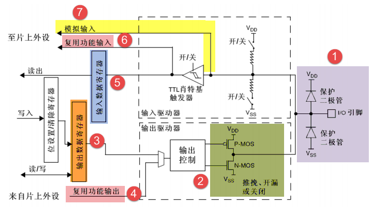

通过GPIO硬件结构框图，就可以从整体上深入了解GPIO外设及它的各种应用模式。该图从最右端看起，最右端就是代表STM32芯片引出的GPIO引脚，其余部件都位于芯片内部。

基本结构分析
^^^^^^^^^^^^

下面我们按图中的编号对GPIO端口的结构部件进行说明。

保护二极管及上、下拉电阻
''''''''''''''''''''''''

引脚的两个保护二级管可以防止引脚外部过高或过低的电压输入，当引脚电压高于V\ :sub:`DD`\ 时，
上方的二极管导通，当引脚电压低于V\ :sub:`SS`\ 时，下方的二极管导通，防止不正常电压引入芯片导致芯片烧毁。尽管有这样的保护，并不意味着STM32的引脚能直接外接大功率驱动器件，如直接驱动电机，强制驱动要么电机不转，要么导致芯片烧坏，必须要加大功率及隔离电路驱动。

P-MOS管和N-MOS管
''''''''''''''''

GPIO引脚线路经过两个保护二极管后，向上流向“输入模式”结构，向下流向“输出模式”结构。先看输出模式部分，线路经过一个由P-MOS和N-MOS管组成的单元电路。这个结构使GPIO具有了“推挽输出”和“开漏输出”两种模式。

所谓的推挽输出模式，是根据这两个MOS管的工作方式来命名的。在该结构中输入高电平时，经过反向后，上方的P-MOS导通，下方的N-MOS关闭，
对外输出高电平；而在该结构中输入低电平时，经过反向后，N-MOS管导通，P-MOS关闭，对外输出低电平。当引脚高低电平切换时，
两个管子轮流导通，P管负责灌电流，N管负责拉电流，使其负载能力和开关速度都比普通的方式有很大的提高。推挽输出的低电平为0伏，
高电平为3.3伏，具体参考 图7_2_，它是推挽输出模式时的等效电路。

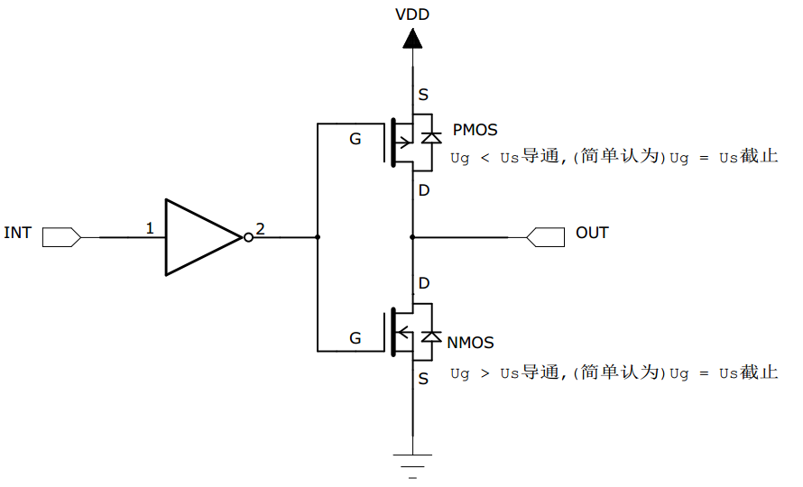

而在开漏输出模式时，上方的P-MOS管完全不工作。如果我们控制输出为0，低电平，则P-MOS管关闭，N-MOS管导通，使输出接地，若控制输出为1
(它无法直接输出高电平)时，则P-MOS管和N-MOS管都关闭，所以引脚既不输出高电平，也不输出低电平，为高阻态。为正常使用时必须外部接上拉电阻，
参考 图7_3_ 中等效电路。它具有“线与”特性，也就是说，若有很多个开漏模式引脚连接到一起时，只有当所有引脚都输出高阻态，才由上拉电阻提供高电平，此高电平的电压为外部上拉电阻所接的电源的电压。若其中一个引脚为低电平，那线路就相当于短路接地，使得整条线路都为低电平，0伏。

推挽输出模式一般应用在输出电平为0和3.3伏而且需要高速切换开关状态的场合。在STM32的应用中，除了必须用开漏模式的场合，我们都习惯使用推挽输出模式。

开漏输出一般应用在I2C、SMBUS通讯等需要“线与”功能的总线电路中。除此之外，还用在电平不匹配的场合，如需要输出5伏的高电平，
就可以在外部接一个上拉电阻，上拉电源为5伏，并且把GPIO设置为开漏模式，当输出高阻态时，由上拉电阻和电源向外输出5伏的电平，具体见 图7_4_。

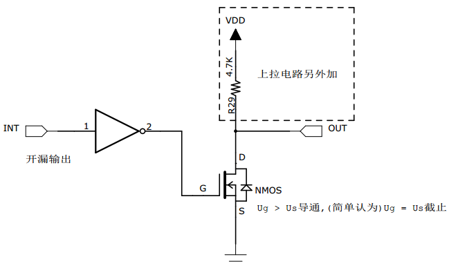

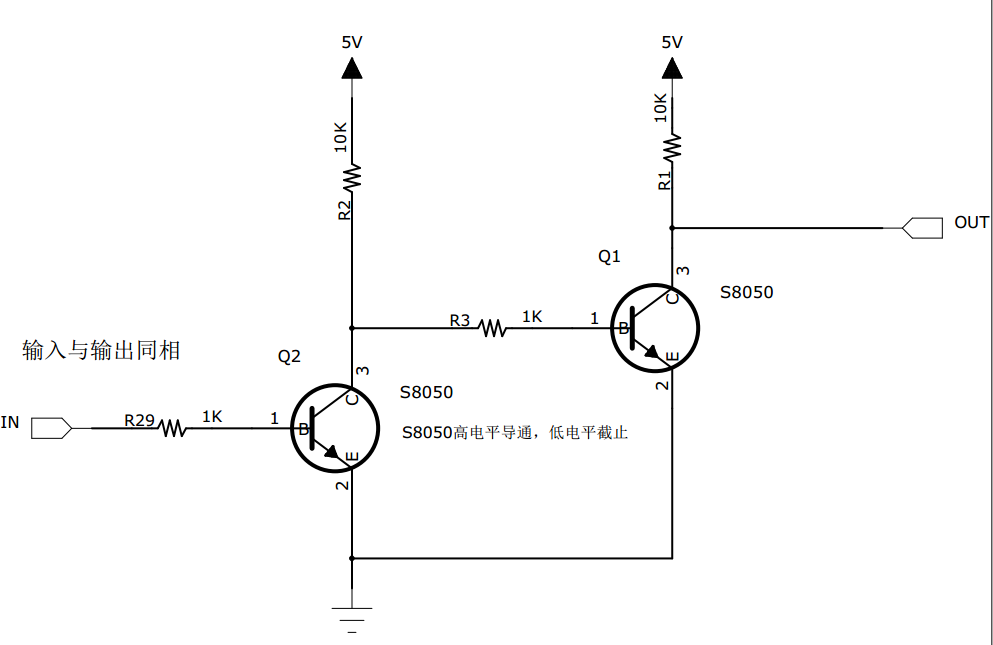

输出数据寄存器
''''''''''''''

前面提到的双MOS管结构电路的输入信号，是由GPIO“输出数据寄存器GPIOx_ODR”提供的，因此我们通过修改输出数据寄存器的值就可以修改GPIO引脚的输出电平。而“置位/复位寄存器GPIOx_BSRR”可以通过修改输出数据寄存器的值从而影响电路的输出。

复用功能输出
''''''''''''

“复用功能输出”中的“复用”是指STM32的其它片上外设对GPIO引脚进行控制，此时GPIO引脚用作该外设功能的一部分，算是第二用途。从其它外设引出来的“复用功能输出信号”与GPIO本身的数据据寄存器都连接到双MOS管结构的输入中，通过图中的梯形结构作为开关切换选择。

例如我们使用USART串口通讯时，需要用到某个GPIO引脚作为通讯发送引脚，这个时候就可以把该GPIO引脚配置成USART串口复用功能，由串口外设控制该引脚，发送数据。

.. code-block:: c
   :caption: 代码7_0_1
   :name: 代码7_0_1

    // GPIOB 16个IO全部输出 0XFF
    GPIOB->ODR = 0XFF;

输入数据寄存器
''''''''''''''

看GPIO结构框图的上半部分，GPIO引脚经过内部的上、下拉电阻，可以配置成上/下拉输入，然后再连接到 施密特触发器 ，
信号经过触发器后，模拟信号转化为0、1的数字信号，然后存储在“输入数据寄存器GPIOx_IDR”中，通过读取该寄存器就可以了解GPIO引脚的电平状态。

.. code-block:: c
   :caption: 代码7_0_2
   :name: 代码7_0_2

    // 读取GPIOB端口的16位数据值
    uint16_t temp;
    temp = GPIOB->IDR;

复用功能输入
''''''''''''

与“复用功能输出”模式类似，在“复用功能输入模式”时，GPIO引脚的信号传输到STM32其它片上外设，由该外设读取引脚状态。

同样，如我们使用USART串口通讯时，需要用到某个GPIO引脚作为通讯接收引脚，这个时候就可以把该GPIO引脚配置成USART串口复用功能，使USART可以通过该通讯引脚的接收远端数据。

模拟输入输出
''''''''''''

当GPIO引脚用于ADC采集电压的输入通道时，用作“模拟输入”功能，此时信号是不经过施密特触发器的，因为经过施密特触发器后信号只有0、1两种状态，所以ADC外设要采集到原始的模拟信号，信号源输入必须在施密特触发器之前。类似地，当GPIO引脚用于DAC作为模拟电压输出通道时，此时作为“模拟输出”功能，DAC的模拟信号输出就不经过双MOS管结构，模拟信号直接输出到引脚。

GPIO工作模式
^^^^^^^^^^^^

总结一下，由GPIO的结构决定了GPIO可以配置成以下模式：

.. code-block:: c
   :caption: 代码 7‑1 GPIO 8种工作模式
   :name: 代码7_1

    typedef enum
    {
        GPIO_Mode_AIN = 0x0,           // 模拟输入
        GPIO_Mode_IN_FLOATING = 0x04,  // 浮空输入
        GPIO_Mode_IPD = 0x28,          // 下拉输入
        GPIO_Mode_IPU = 0x48,          // 上拉输入
        GPIO_Mode_Out_OD = 0x14,       // 开漏输出
        GPIO_Mode_Out_PP = 0x10,       // 推挽输出
        GPIO_Mode_AF_OD = 0x1C,        // 复用开漏输出
        GPIO_Mode_AF_PP = 0x18         // 复用推挽输出
    } GPIOMode_TypeDef;

在固件库中，GPIO总共有8种细分的工作模式，稍加整理可以大致归类为以下三类：

输入模式(模拟/浮空/上拉/下拉)
'''''''''''''''''''''''''''''

在输入模式时，施密特触发器打开，输出被禁止，可通过输入数据寄存器GPIOx_IDR读取I/O状态。其中输入模式，可设置为上拉、下拉、浮空和模拟输入四种。上拉和下拉输入很好理解，默认的电平由上拉或者下拉决定。浮空输入的电平是不确定的，完全由外部的输入决定，一般接按键的时候用的是这个模式。模拟输入则用于ADC采集。

输出模式(推挽/开漏)
'''''''''''''''''''

在输出模式中，推挽模式时双MOS管以轮流方式工作，输出数据寄存器GPIOx_ODR可控制I/O输出高低电平。开漏模式时，只有N-MOS管工作，输出数据寄存器可控制I/O输出高阻态或低电平。输出速度可配置，有2MHz\10MHz\50MHz的选项。此处的输出速度即I/O支持的高低电平状态最高切换频率，支持的频率越高，功耗越大，如果功耗要求不严格，把速度设置成最大即可。

在输出模式时施密特触发器是打开的，即输入可用，通过输入数据寄存器GPIOx_IDR可读取I/O的实际状态。

复用功能(推挽/开漏)
'''''''''''''''''''

复用功能模式中，输出使能，输出速度可配置，可工作在开漏及推挽模式，但是输出信号源于其它外设，输出数据寄存器GPIOx_ODR无效；输入可用，通过输入数据寄存器可获取I/O实际状态，但一般直接用外设的寄存器来获取该数据信号。

通过对GPIO寄存器写入不同的参数，就可以改变GPIO的工作模式，再强调一下，要了解具体寄存器时一定要查阅《STM32F10X-中文参考手册》中对应外设的寄存器说明。在GPIO外设中，控制端口高低控制寄存器CRH和CRL可以配置每个GPIO的工作模式和工作的速度，每4个位控制一个IO，CRH控制端口的高八位，CRL控制端口的低8位，具体的看CRH和CRL的寄存器描述。

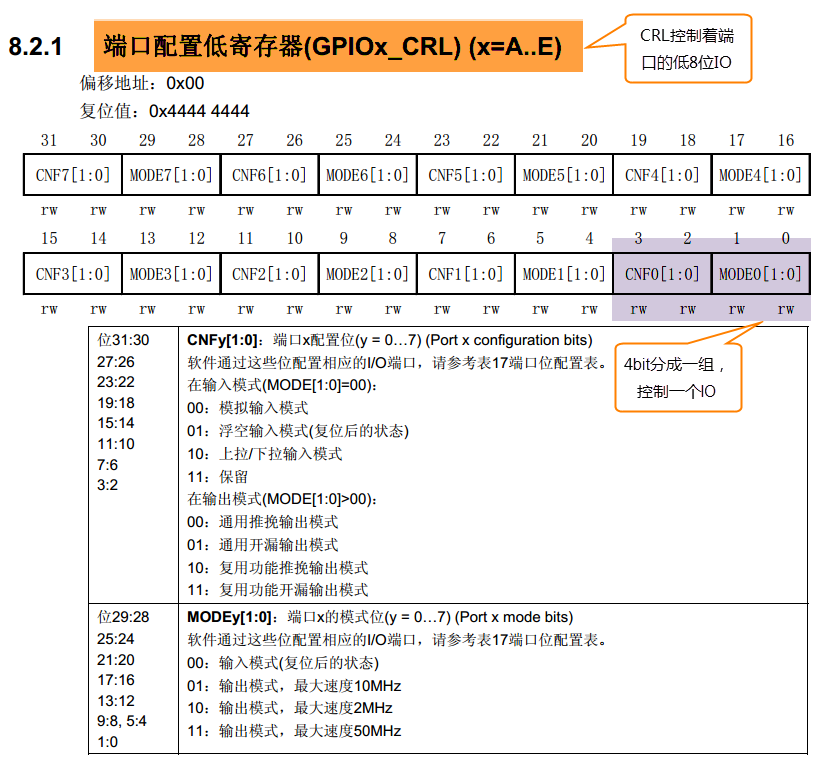

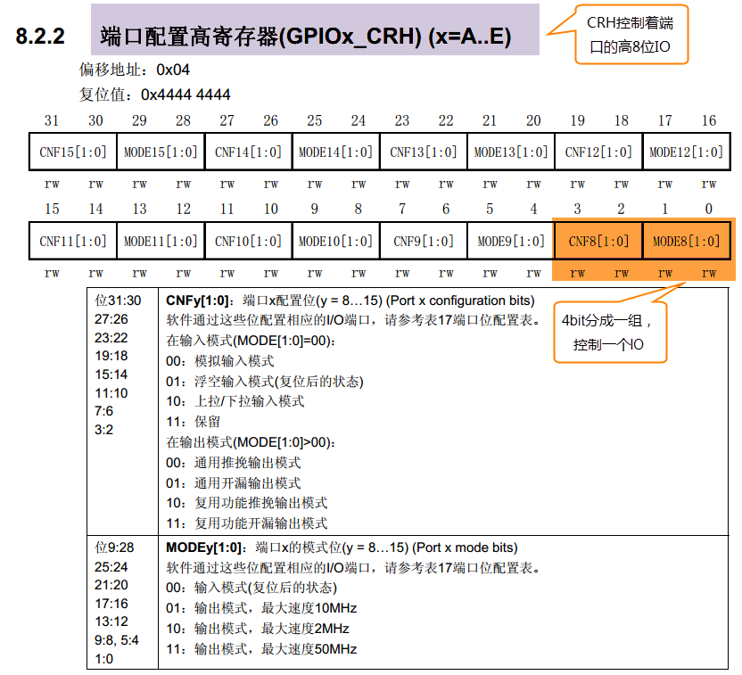

实验：使用寄存器点亮LED灯
~~~~~~~~~~~~~~~~~~~~~~~~~

本小节中，我们以实例讲解如何通过控制寄存器来点亮LED灯。此处侧重于讲解原理，请直接用KEIL5软件打开我们提供的实验例程配合阅读，先了解原理，学习完本小节后，再尝试自己建立一个同样的工程。本节配套例程名称为“GPIO输出—使用寄存器点亮LED灯”，在工程目录下找到后缀为“.uvprojx”的文件，用KEIL5打开即可。

自己尝试新建工程时，请对照查阅《新建工程—
寄存器版》章节。若没有安装KEIL5软件，请参考《如何安装KEIL5》章节。

打开该工程，见 图7_7_，可看到一共有三个文件，分别startup_stm32f10x_hd.s
、stm32f10x.h 以及main.c，下面我们对这三个文件进行讲解。

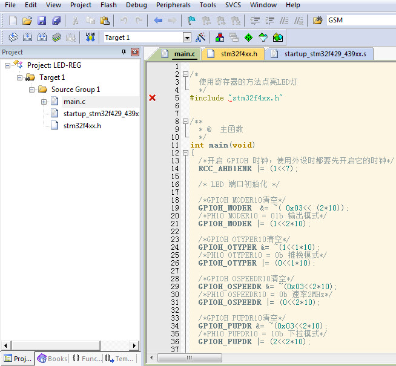

硬件连接
^^^^^^^^

在本教程中STM32芯片与LED灯的连接见
图7_8_，这是一个RGB灯，里面由红蓝绿三个小灯构成，
使用PWM控制时可以混合成256不同的颜色。

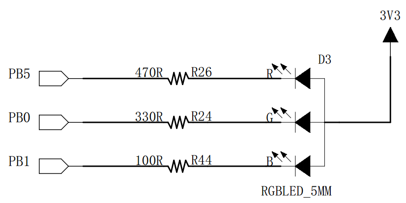

图中从3个LED灯的阳极引出连接到3.3V电源，阴极各经过1个限流电阻引入至STM32的3个GPIO引脚中，所以我们只要控制这三个引脚输出高低电平，即可控制其所连接LED灯的亮灭。如果您的实验板STM32连接到LED灯的引脚或极性不一样，只需要修改程序到对应的GPIO引脚即可，工作原理都是一样的。

我们的目标是把GPIO的引脚设置成推挽输出模式并且默认下拉，输出低电平，这样就能让LED灯亮起来了。

启动文件
^^^^^^^^

启动文件在这里只是简要的介绍下，关于这个文件的详解请参考后面的《启动文件详解》章节。

名为“startup_stm32f10x_hd.s”的文件，它里边使用汇编语言写好了基本程序，当STM32芯片上电启动的时候，首先会执行这里的汇编程序，从而建立起C语言的运行环境，所以我们把这个文件称为启动文件。该文件使用的汇编指令是Cortex-M3内核支持的指令，可参考《Cortex-M3权威指南》中指令集章节。

startup_stm32f10x_hd.s文件由官方提供，一般有需要也是在官方的基础上修改，不会自己完全重写。该文件从
ST
固件库里面找到，找到该文件后把启动文件添加到工程里面即可。不同型号的芯片以及不同编译环境下使用的汇编文件是不一样的，但功能相同。

对于启动文件这部分我们主要总结它的功能，不详解讲解里面的代码，其功能如下：

-  初始化堆栈指针SP;

-  初始化程序计数器指针PC;

-  设置堆、栈的大小;

-  初始化中断向量表;

-  配置外部SRAM作为数据存储器（这个由用户配置，一般的开发板可没有外部SRAM）;

-  调用SystemIni() 函数配置STM32的系统时钟。

-  设置C库的分支入口“__main”（最终用来调用main函数）;

先去除繁枝细节，挑重点的讲，主要理解最后两点，在启动文件中有一段复位后立即执行的程序，代码见
代码清单7_1_。在实际工程中阅读时，可使用编辑器的搜索(Ctrl+F)功能查找这段代码在文件中的位置，搜索Reset_Handler即可找到。

.. code-block:: c
   :caption: 代码清单 7‑1复位后执行的程序
   :name: 代码清单7_1

    ;Reset handler
    Reset_Handler    PROC
                    EXPORT  Reset_Handler     [WEAK]
        IMPORT  SystemInit
        IMPORT  __main

            LDR     R0, =SystemInit
            BLX     R0
            LDR     R0, =__main
            BX      R0
            ENDP

开头的是程序注释，在汇编里面注释用的是“;”，相当于 C 语言的“//”注释符

第二行是定义了一个子程序：Reset_Handler。PROC
是子程序定义伪指令。这里就相当于C语言里定义了一个函数，函数名为Reset_Handler。

第三行 EXPORT 表示 Reset_Handler
这个子程序可供其他模块调用。相当于C语言的函数声明。关键字[WEAK]
表示弱定义，如果编译器发现在别处定义了同名的函数，则在链接时用别处的地址进行链接，如果其它地方没有定义，编译器也不报错，以此处地址进行链接。

第四行和第五行 IMPORT 说明 SystemInit 和__main
这两个标号在其他文件，在链接的时候需要到其他文件去寻找。相当于C语言中，从其它文件引入函数声明。以便下面对外部函数进行调用。

SystemInit
需要由我们自己实现，即我们要编写一个具有该名称的函数，用来初始化 STM32
芯片的时钟，一般包括初始化AHB、APB等各总线的时钟，需要经过一系列的配置STM32才能达到稳定运行的状态。其实这个函数在固件库里面有提供，官方已经为我们写好。

\__main
其实不是我们定义的(不要与C语言中的main函数混淆)，这是一个C库函数，当编译器编译时，只要遇到这个标号就会定义这个函数，该函数的主要功能是：负责初始化栈、堆，配置系统环境，并在函数的最后调用用户编写的
main 函数，从此来到 C 的世界。

第六行把 SystemInit 的地址加载到寄存器 R0。

第七行程序跳转到 R0 中的地址执行程序，即执行SystemInit函数的内容。

第八行把__main 的地址加载到寄存器 R0。

第九行程序跳转到 R0
中的地址执行程序，即执行__main函数，执行完毕之后就去到我们熟知的 C
世界，进入main函数。

第十行表示子程序的结束。

总之，看完这段代码后，了解到如下内容即可：我们需要在外部定义一个SystemInit函数设置STM32的时钟；STM32上电后，会执行SystemInit函数，最后执行我们C语言中的main函数。

stm32f10x.h文件
^^^^^^^^^^^^^^^

看完启动文件，那我们立即写SystemInit和main函数吧？别着急，定义好了SystemInit函数和main我们又能写什么内容？
连接LED灯的GPIO引脚，是要通过读写寄存器来控制的，就这样空着手，如何控制寄存器。
我们知道寄存器就是给一个已经分配好地址的特殊的内存空间取的一个别名，这个特殊的内存空间可以通过指针来操作。
在编程之前我们要先实现寄存器映射，有关寄存器映射的代码都统一写在stm32f10x.h文件中，见 代码清单7_2_。

.. code-block:: c
   :caption: 代码清单 7‑2 外设地址定义
   :name: 代码清单7_2

    /*片上外设基地址  */
    #define PERIPH_BASE         ((unsigned int)0x40000000)

    /*总线基地址，GPIO都挂载到APB2上 */
    #define APB2PERIPH_BASE     (PERIPH_BASE + 0x10000)

    /*GPIOB外设基地址*/
    #define GPIOB_BASE          (APB2PERIPH_BASE + 0x0C00)

    /* GPIOB寄存器地址,强制转换成指针 */
    #define GPIOB_CRL           *(unsigned int*)(GPIOB_BASE+0x00)
    #define GPIOB_CRH           *(unsigned int*)(GPIOB_BASE+0x04)
    #define GPIOB_IDR           *(unsigned int*)(GPIOB_BASE+0x08)
    #define GPIOB_ODR           *(unsigned int*)(GPIOB_BASE+0x0C)
    #define GPIOB_BSRR          *(unsigned int*)(GPIOB_BASE+0x10)
    #define GPIOB_BRR           *(unsigned int*)(GPIOB_BASE+0x14)
    #define GPIOB_LCKR          *(unsigned int*)(GPIOB_BASE+0x18)

    /*RCC外设基地址*/
    #define RCC_BASE           (AHBPERIPH_BASE + 0x1000)
    /*RCC的AHB1时钟使能寄存器地址,强制转换成指针*/
    #define RCC_APB2ENR        *(unsigned int*)(RCC_BASE+0x18)

GPIO外设的地址跟前面章节讲解的相同，不过此处把寄存器的地址值都直接强制转换成了指针，方便使用。代码的最后两段是RCC外设寄存器的地址定义，RCC外设是用来设置时钟的，以后我们会详细分析，本实验中只要了解到使用GPIO外设必须开启它的时钟即可。

main文件
^^^^^^^^

现在就可以开始编写程序，在main文件中先编写一个 main
函数，里面什么都没有，暂时为空。

.. code-block:: c

    int main (void)
    {
    }

此时直接编译的话，会出现如下错误：

“Error: L6218E: Undefined symbol SystemInit (referred from
startup_stm32f10x.o)”

错误提示SystemInit 没有定义。从分析启动文件时我们知道，Reset_Handler
调用了该函数用来初始化SMT32系统时钟，为了简单起见，我们在 main
文件里面定义一个 SystemInit
空函数，什么也不做，为的是骗过编译器，把这个错误去掉。关于配置系统时钟我们在后面再写。当我们不配置系统时钟时，STM32会把HSI当作系统时钟，HSI=8M，由芯片内部的振荡器提供。我们在main中添加如下函数：

.. code-block:: c

    // 函数为空，目的是为了骗过编译器不报错
    void SystemInit(void)
    {
    }

这时再编译就没有错了，完美解决。还有一个方法就是在启动文件中把有关SystemInit
的代码注释掉也可以，见 代码清单7_3_。

.. code-block:: c
   :caption: 代码清单 7‑3 注释掉启动文件中调用SystemInit的代码
   :name: 代码清单7_3

    ; Reset handler
    Reset_Handler    PROC
            EXPORT  Reset_Handler             [WEAK]
            ;IMPORT  SystemInit
            IMPORT  __main

            ;LDR     R0, =SystemInit
            ;BLX     R0
            LDR     R0, =__main
            BX      R0
            ENDP

接下来在main函数中添加代码，实现我们的点灯之旅。

GPIO模式
''''''''

首先我们把连接到LED灯的GPIO引脚PB0配置成输出模式，即配置GPIO的端口配置低寄存器CRL，见 图7_9_。
CRL中包含0-7号引脚，每个引脚占用4个寄存器位。MODE位用来配置输出的速度，CNF位用来配置各种输入输出模式。
在这里我们把PB0配置为通用推挽输出，输出的速度为10M，具体见 代码清单7_4_。

.. code-block:: c
   :caption: 代码清单 7‑4 配置输出模式
   :name: 代码清单7_4

    // 清空控制PB0的端口位
    GPIOB_CRL &= ~( 0x0F<< (4*0));
    // 配置PB0为通用推挽输出，速度为10M
    GPIOB_CRL |= (1<<4*0);

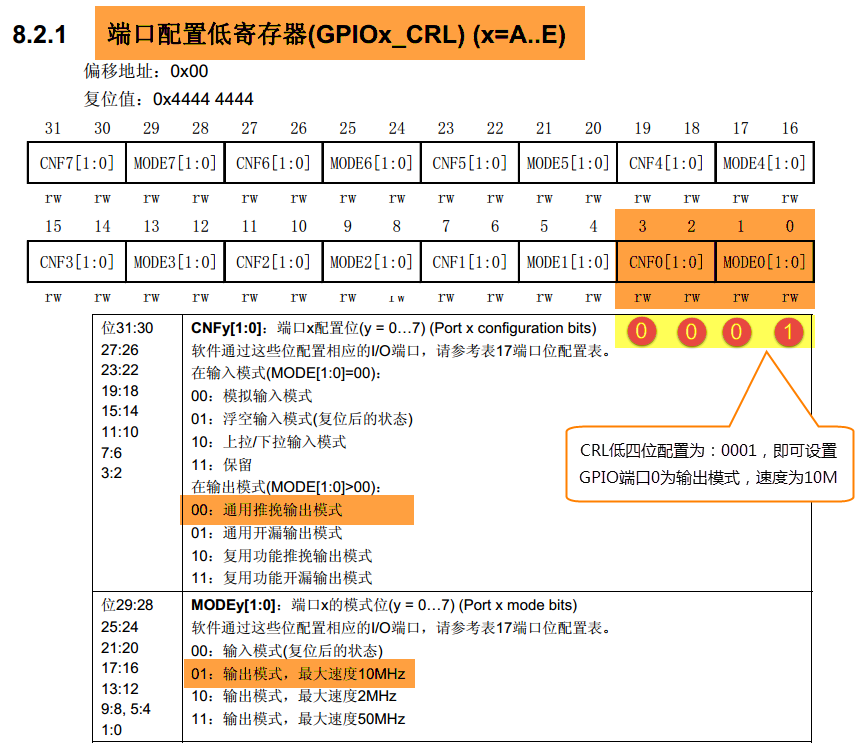

在代码中，我们先把控制PB0的端口位清0，然后再向它赋值“0001
b”，从而使GPIOB0引脚设置成输出模式，速度为10M。

代码中使用了“&=~”、“\|=”这种操作方法是为了避免影响到寄存器中的其它位，因为寄存器不能按位读写，假如我们直接给CRL寄存器赋值：

.. code-block:: c

    GPIOB_CRL = 0x0000001;

这时CRL的的低4位被设置成“0001”输出模式，但其它GPIO引脚就有意见了，因为其它引脚的MODER位都已被设置成输入模式。

控制引脚输出电平
''''''''''''''''

在输出模式时，对端口位设置/清除寄存器BSRR寄存器、端口位清除寄存器BRR和ODR寄存器写入参数即可控制引脚的电平状态，
其中操作BSRR和BRR最终影响的都是ODR寄存器，然后再通过ODR寄存器的输出来控制GPIO。为了一步到位，
我们在这里直接操作ODR寄存器来控制GPIO的电平。具体见 代码清单7_5_。

.. code-block:: c
   :caption: 代码清单 7‑5 控制引脚输出电平
   :name: 代码清单7_5

    // PB0输出低电平
    GPIOB_ODR &= ~(1<<0);

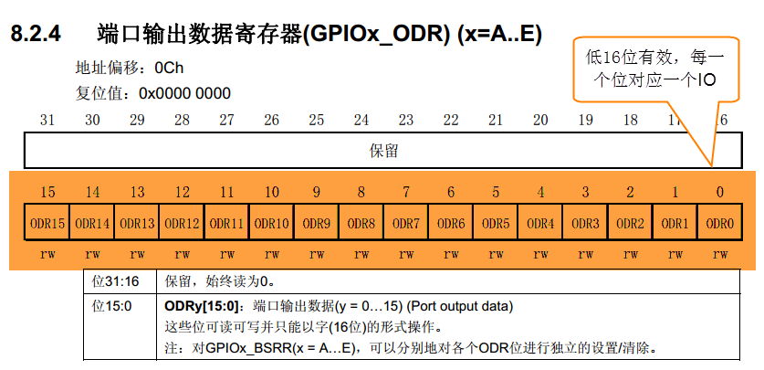

开启外设时钟
''''''''''''

设置完GPIO的引脚，控制电平输出，以为现在总算可以点亮 LED
了吧，其实还差最后一步。由于STM32的
外设很多，为了降低功耗，每个外设都对应着一个时钟，在芯片刚上电的时候这些时钟都是被关闭的，如果想要外设工作，必须把相应的时钟打开。

STM32 的所有外设的时钟由一个专门的外设来管理，叫 RCC（reset and
clockcontrol），RCC 在《 STM32F10X-
中文参考手册》的第六章。关于RCC外设中的时钟部分，我们在后面的章节《RCC—使用HSE/HIS配置》中有详细的讲解，这里我们暂时先了解下。

所有的 GPIO都挂载到 APB2
总线上，具体的时钟由APB2外设时钟使能寄存器(RCC\_
APB2ENR)来控制，具体见 代码清单7_6_。

.. code-block:: c
   :caption: 代码清单 7‑6 开启端口时钟
   :name: 代码清单7_6

    // 开启 GPIOB 端口 时钟
    RCC_APB2ENR |= (1<<3);

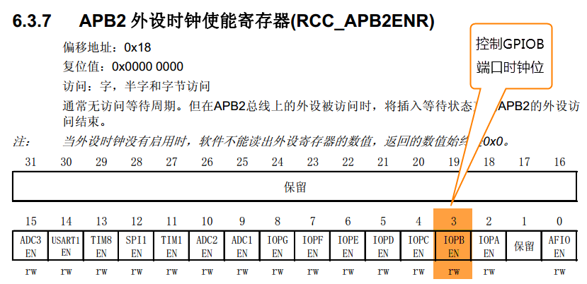

图 7‑11 APB2外设时钟使能寄存器

水到渠成
''''''''

开启时钟，配置引脚模式，控制电平，经过这三步，我们总算可以控制一个
LED了。现在我们完整组织下用 STM32 控制一个 LED 的代码，见 代码清单7_7_。

.. code-block:: c
   :caption: 代码清单 7‑7 main文件中控制LED灯的代码
   :name: 代码清单7_7

   int main(void)
   {	
      // 开启GPIOA 端口时钟
      RCC_APB2ENR |= (1<<2);

      //清空控制PA8的端口位
      GPIOA_CRH &= ~( 0x0F<< (4*0));	
      // 配置PA0为通用推挽输出，速度为10M
      GPIOA_CRH |= (1<<4*0);

      // PA8 输出 低电平
      GPIOA_ODR &=(1<<1);
      
      while(1);
   }S

在本章节中，要求完全理解stm32f10x.h文件及main文件的内容(RCC相关的可以除外)。

下载验证
^^^^^^^^

把编译好的程序下载到开发板并复位，可看到板子上的LED灯被点亮。
