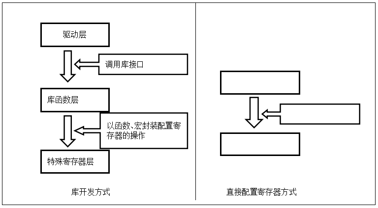
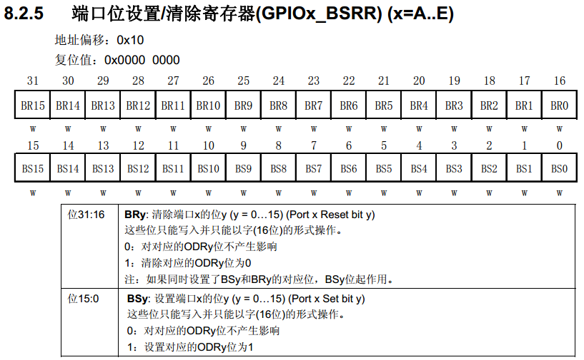
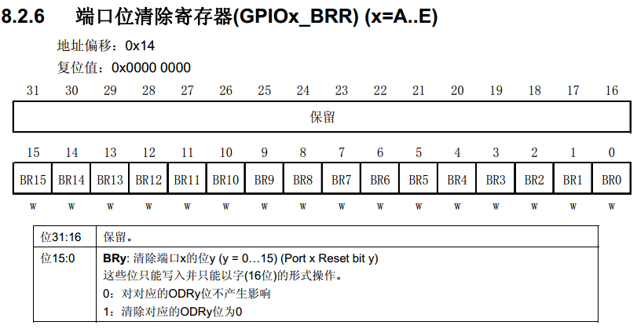
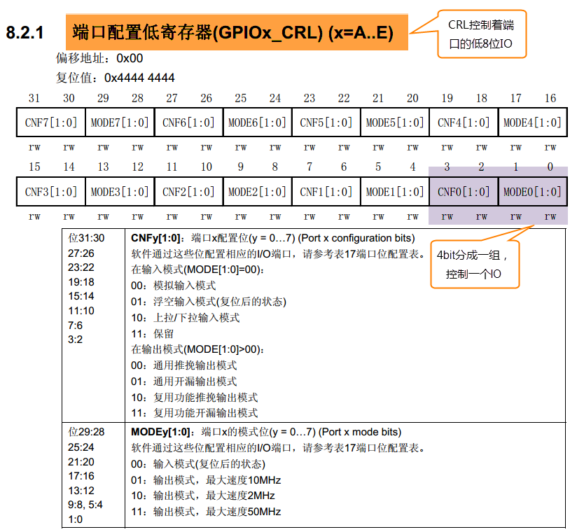
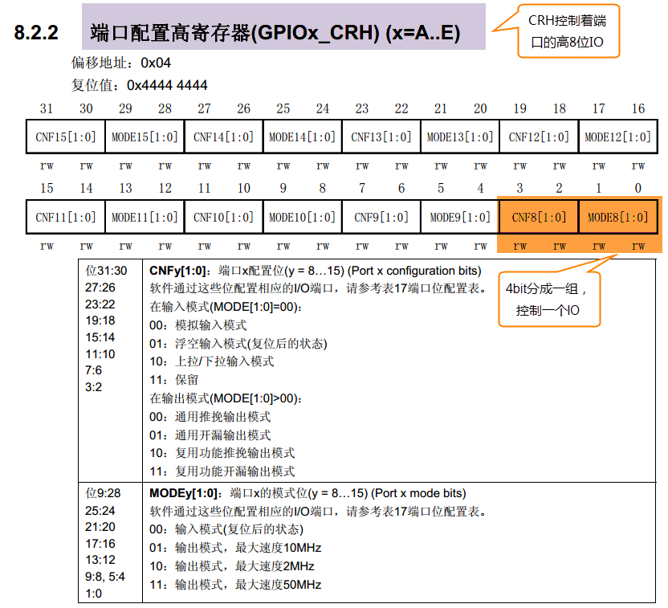
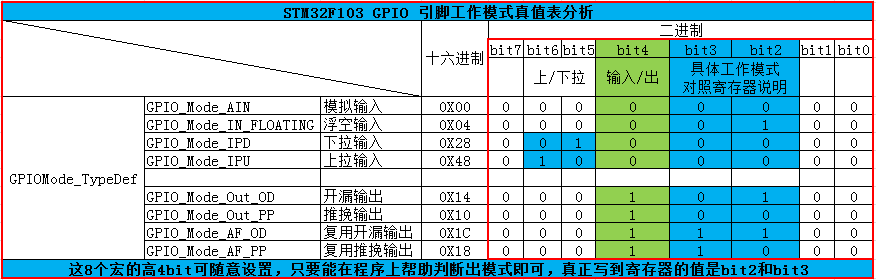
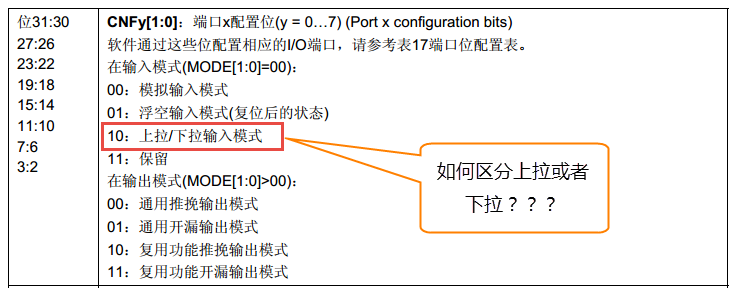

.. vim: syntax=rst

自己写库—构建库函数雏形
-----------------------

本章参考资料：《STM32F10X-中文参考手册》GPIO章节和RCC章节。

虽然我们上面用寄存器点亮了
LED，乍看一下好像代码也很简单，但是我们别侥幸以后就可以一直用寄存器开发。在用寄存器点亮
LED 的时候，我们会发现 STM32 的寄存器都是 32
位的，每次配置的时候都要对照着《STM32F10X-中文参考手册》中寄存器的说明，然后根据说明对每个控制的寄存器位写入特定参数，因此在配置的时候非常容易出错，而且代码还很不好理解，不便于维护。所以学习
STM32 最好的方法是用固件库，然后在固件库的基础上了解底层，学习寄存器。

什么是STM32函数库
~~~~~~~~~~~~~~~~~

以上所说的固件库是指“STM32标准函数库”，它是由ST公司针对STM32提供的函数接口，
即API(Application Program Interface) ，
开发者可调用这些函数接口来配置STM32的寄存器，使开发人员得以脱离最底层的寄存器操作，有开发快速，易于阅读，维护成本低等优点。

当我们调用库API的时候不需要挖空心思去了解库底层的寄存器操作，就像当年我们刚开始学习C语言的时候，用prinft()函数时只是学习它的使用格式，并没有去研究它的源码实现，但需要深入研究的时候，经过千锤百炼的库源码就是最佳学习范例。

实际上，库是架设在寄存器与用户驱动层之间的代码，
向下处理与寄存器直接相关的配置，
向上为用户提供配置寄存器的接口。
库开发方式与直接配置寄存器方式的区别见 图8_1_。

为什么采用库来开发及学习？
~~~~~~~~~~~~~~~~~~~~~~~~~~~~~~

*在以前8位机时代的*\ 程序开发中，一般直接配置芯片的寄存器，控制芯片的工作方式，如中断，定时器等。配置的时候，常常要查阅寄存器表，看用到哪些配置位，为了配置某功能，该置1还是置0。这些都是很琐碎的、机械的工作，因为8位机的软件相对来说较简单，而且资源很有限，所以可以直接配置寄存器的方式来开发。

对于STM32，因为外设资源丰富，带来的必然是寄存器的数量和复杂度的增加，这时直接配置寄存器方式的缺陷就突显出来了：

(1) **开发速度慢**

(2) **程序可读性差**

(3) **维护复杂**

这些缺陷直接影响了开发效率，程序维护成本，交流成本。库开发方式则正好弥补了这些缺陷。

而坚持采用直接配置寄存器的方式开发的程序员，会列举以下原因：

(1) **具体参数更直观**

(2) **程序运行占用资源少**

相对于库开发的方式，直接配置寄存器方式生成的代码量的确会少一点，但因为STM32有充足的资源，权衡库的优势与不足，绝大部分时候，我们愿意牺牲一点CPU资源，选择库开发。一般只有在对代码运行时间要求极苛刻的地方，才用直接配置寄存器的方式代替，如频繁调用的中断服务函数。

对于库开发与直接配置寄存器的方式，就好比编程是用汇编好还是用 C
好一样。在STM32F1系列刚推出函数库时引起程序员的激烈争论，但是，随着ST库的完善与大家对库的了解，更多的程序员选择了库开发。现在STM32F1系列和STM32F4系列各有一套自己的函数库，但是它们大部分是兼容的，F1和F4之间的程序移植，只需要小修改即可。而如果要移植用寄存器写的程序，那简直跟脱胎换骨差不多。

用库来进行开发，市场已有定论，用户群说明了一切，但对于STM32的学习仍然有人认为用寄存器好，而且汇编不是还没退出大学教材么？认为这种方法直观，能够了解到是配置了哪些寄存器，怎样配置寄存器。事实上，库函数的底层实现恰恰是直接配置寄存器方式的最佳例子，它代替我们完成了寄存器配置的工作，而想深入了解芯片是如何工作的话，只要直接查看库函数的最底层实现就能理解，相信你会为它严谨、优美的实现方式而陶醉，要想修炼C语言，就从ST的库开始吧。所以在以后的章节中，使用软件库是我们的重点，而且我们通过讲解库API去高效地学习STM32的寄存器，并不至于因为用库学习，就不会用寄存器控制STM32芯片。

实验：构建库函数雏形
~~~~~~~~~~~~~~~~~~~~

虽然库的优点多多，但很多人对库还是很忌惮，因为一开始用库的时候有很多代码，很多文件，不知道如何入手。不知道您是否认同这么一句话：一切的恐惧都来源于无知。我们对库忌惮那是因为我们不知道什么是库，不知道库是怎么实现的。

接下来，我们在寄存器点亮 LED
的代码上继续完善，把代码一层层封装，实现库的最初的雏形，相信经过这一步的学习后，您对库的运用会游刃有余。这里我们只讲如何实现GPIO函数库，其他外设的我们直接参考STM32HAL库学习即可，不必自己写。

下面请打开本章配套例程“构建库函数雏形”来阅读理解，该例程是在上一章的基础上修改得来的。

外设寄存器结构体定义
^^^^^^^^^^^^^^^^^^^^

上一章中我们在操作寄存器的时候，操作的是都寄存器的绝对地址，如果每个外设寄存器都这样操作，那将非常麻烦。我们考虑到外设寄存器的地址都是基于外设基地址的偏移地址，都是在外设基地址上逐个连续递增的，每个寄存器占
32
个字节，这种方式跟结构体里面的成员类似。所以我们可以定义一种外设结构体，结构体的地址等于外设的基地址，结构体的成员等于寄存器，成员的排列顺序跟寄存器的顺序一样。这样我们操作寄存器的时候就不用每次都找到绝对地址，只要知道外设的基地址就可以操作外设的全部寄存器，即操作结构体的成员即可。

在工程中的“stm32f103xe.h”文件中，我们使用结构体封装GPIO及RCC外设的的寄存器，见 代码清单8_1_。
结构体成员的顺序按照寄存器的偏移地址从低到高排列，成员类型跟寄存器类型一样。

.. code-block:: c
   :caption: 代码清单 8‑1 封装寄存器列表
   :name: 代码清单8_1

    //寄存器的值常常是芯片外设自动更改的，即使CPU没有执行程序，也有可能发生变化
    //编译器有可能会对没有执行程序的变量进行优化

    //volatile表示易变的变量，防止编译器优化，
    #define     __IO    volatile
    typedef unsigned int uint32_t;
    typedef unsigned short uint16_t;

    // GPIO 寄存器结构体定义
    typedef struct
    {
        __IO uint32_t CRL;       // 端口配置低寄存器，     地址偏移0X00
        __IO uint32_t CRH;       // 端口配置高寄存器，     地址偏移0X04
        __IO uint32_t IDR;       // 端口数据输入寄存器，   地址偏移0X08
        __IO uint32_t ODR;       // 端口数据输出寄存器，   地址偏移0X0C
        __IO uint32_t BSRR;      // 端口位设置/清除寄存器，地址偏移0X10
        __IO uint32_t BRR;       // 端口位清除寄存器，     地址偏移0X14
        __IO uint32_t LCKR;      // 端口配置锁定寄存器，   地址偏移0X18
    } GPIO_TypeDef;

这段代码在每个结构体成员前增加了一个“__IO”前缀，它的原型在这段代码的第一行，代表了C语言中的关键字“volatile”，在C语言中该关键字用于表示变量是易变的，要求编译器不要优化。这些结构体内的成员，都代表着寄存器，而寄存器很多时候是由外设或STM32芯片状态修改的，也就是说即使CPU不执行代码修改这些变量，变量的值也有可能被外设修改、更新，所以每次使用这些变量的时候，我们都要求CPU去该变量的地址重新访问。若没有这个关键字修饰，在某些情况下，编译器认为没有代码修改该变量，就直接从CPU的某个缓存获取该变量值，这时可以加快执行速度，但该缓存中的是陈旧数据，与我们要求的寄存器最新状态可能会有出入。

外设存储器映射
^^^^^^^^^^^^^^

外设寄存器结构体定义仅仅是一个定义，要想实现给这个结构体赋值就达到操作寄存器的效果，我们还需要找到该寄存器的地址，就把寄存器地址跟结构体的地址对应起来。所以我们要再找到外设的地址，根据我们前面的学习，我们可以把这些外设的地址定义成一个个宏，实现外设存储器的映射。

.. code-block:: c

    /*片上外设基地址  */
    #define PERIPH_BASE           0x40000000U
    /*APB2 总线基地址 */
    #define APB2PERIPH_BASE       (PERIPH_BASE + 0x00010000U)
    /*AHB 总线基地址 */
    #define AHBPERIPH_BASE        (PERIPH_BASE + 0x00020000U)
    /*GPIO外设基地址*/
    #define GPIOA_BASE            (APB2PERIPH_BASE + 0x00000800U)
    #define GPIOB_BASE            (APB2PERIPH_BASE + 0x00000C00U)
    #define GPIOC_BASE            (APB2PERIPH_BASE + 0x00001000U)
    #define GPIOD_BASE            (APB2PERIPH_BASE + 0x00001400U)
    #define GPIOE_BASE            (APB2PERIPH_BASE + 0x00001800U)
    #define GPIOF_BASE            (APB2PERIPH_BASE + 0x00001C00U)
    #define GPIOG_BASE            (APB2PERIPH_BASE + 0x00002000U)
    /*RCC外设基地址*/
    #define RCC_BASE              (AHBPERIPH_BASE + 0x00001000U)

外设声明
^^^^^^^^

定义好外设寄存器结构体，实现完外设存储器映射后，我们再把外设的基址强制类型转换成相应的外设寄存器结构体指针，
然后再把该指针声明成外设名，这样一来，外设名就跟外设的地址对应起来了，而且该外设名还是一个该外设类型的寄存器结构体指针，
通过该指针可以直接操作该外设的全部寄存器，见 代码清单8_2_。

.. code-block:: c
   :caption: 代码清单 8‑2 指向外设首地址的结构体指针
   :name: 代码清单8_2

    // GPIO 外设声明
    #define GPIOA               ((GPIO_TypeDef *) GPIOA_BASE)
    #define GPIOB               ((GPIO_TypeDef *) GPIOB_BASE)
    #define GPIOC               ((GPIO_TypeDef *) GPIOC_BASE)
    #define GPIOD               ((GPIO_TypeDef *) GPIOD_BASE)
    #define GPIOE               ((GPIO_TypeDef *) GPIOE_BASE)
    #define GPIOF               ((GPIO_TypeDef *) GPIOF_BASE)
    #define GPIOG               ((GPIO_TypeDef *) GPIOG_BASE)

    // RCC 外设声明
    #define RCC                 ((RCC_TypeDef *) RCC_BASE)

    /*RCC的AHB1时钟使能寄存器地址,强制转换成指针*/
    #define RCC_APB2ENR      *(unsigned int*)(RCC_BASE+0x18)

首先通过强制类型转换把外设的基地址转换成GPIO_TypeDef类型的结构体指针，然后通过宏定义把GPIOA、GPIOB等定义成外设的结构体指针，通过外设的结构体指针我们就可以达到访问外设的寄存器的目的。

通过操作外设结构体指针的方式，我们把main文件里对应的代码修改掉，
见 代码8_2_ else部分。

.. code-block:: c
   :caption: 代码 8‑1 C语言条件编译
   :name: 代码8_1

    /*
    * C语言知识，条件编译
    * #if 为真
    * 执行这里的程序
    * #else
    * 否则执行这里的程序
    * #endif
    */

.. code-block:: c
   :caption: 代码 8‑2 使用寄存器结构体指针操作寄存器
   :name: 代码8_2

    // 使用寄存器结构体指针点亮LED
    int main(void)
    {
    #if 0 // 直接通过操作内存来控制寄存器
        // 开启GPIOB 端口时钟
        RCC_APB2ENR |= (1<<3);

        //清空控制PB0的端口位
        GPIOB_CRL &= ~( 0x0F<< (4*0));
        // 配置PB0为通用推挽输出，速度为10M
        GPIOB_CRL |= (1<<4*0);

        // PB0 输出 低电平
        GPIOB_ODR |= (0<<0);

        while (1);

    #else // 通过寄存器结构体指针来控制寄存器

        // 开启GPIOB 端口时钟
        RCC->APB2ENR |= (1<<3);

        //清空控制PB0的端口位
        GPIOB->CRL &= ~( 0x0F<< (4*0));
        // 配置PB0为通用推挽输出，速度为10M
        GPIOB->CRL |= (1<<4*0);

        // PB0 输出 低电平
        GPIOB->ODR |= (0<<0);

        while (1);

    #endif
    }

乍一看，除了把“_”换成了“->”，其他都跟使用寄存器点亮LED那部分代码一样。这是因为我们现在只是实现了库函数的基础，还没有定义库函数。

打好了地基，下面我们就来建高楼。接下来使用函数来封装GPIO的基本操作，方便以后应用的时候不需要再查询寄存器，而是直接通过调用这里定义的函数来实现。我们把针对GPIO外设操作的函数及其宏定义分别存放在“stm32f1xx_hal_gpio.c”和“stm32f1xx_hal_gpio.h”文件中，这两个文件需要自己新建。

定义位操作函数
^^^^^^^^^^^^^^

在“stm32f1xx_hal_gpio.c”文件定义两个位操作函数，分别用于控制引脚输出高电平和低电平，
见 代码清单8_3_。

.. code-block:: c
   :caption: 代码清单 8‑3 GPIO置位函数与复位函数的定义
   :name: 代码清单8_3

    /**
    *函数功能：设置引脚为高电平
    *参数说明：GPIOx:该参数为GPIO_TypeDef类型的指针，指向GPIO端口的地址
    *        GPIO_Pin:选择要设置的GPIO端口引脚，可输入宏GPIO_Pin_0-15，
    *                 表示GPIOx端口的0-15号引脚。
    */
    void GPIO_SetBits(GPIO_TypeDef* GPIOx, uint16_t GPIO_Pin)
    {
        /*设置GPIOx端口BSRR寄存器的第GPIO_Pin位，使其输出高电平*/
        /*因为BSRR寄存器写0不影响，
        宏GPIO_Pin只是对应位为1，其它位均为0，所以可以直接赋值*/

        GPIOx->BSRR = GPIO_Pin;
    }

    /**
    *函数功能：设置引脚为低电平
    *参数说明：GPIOx:该参数为GPIO_TypeDef类型的指针，指向GPIO端口的地址
    *        GPIO_Pin:选择要设置的GPIO端口引脚，可输入宏GPIO_Pin_0-15，
    *                 表示GPIOx端口的0-15号引脚。
    */
    void GPIO_ResetBits(GPIO_TypeDef* GPIOx, uint16_t GPIO_Pin)
    {
        /*设置GPIOx端口BRR寄存器的第GPIO_Pin位,使其输出低电平*/
        /*因为BRR寄存器写0不影响，
        宏GPIO_Pin只是对应位为1，其它位均为0，所以可以直接赋值*/

        GPIOx->BRR = GPIO_Pin;
    }

这两个函数体内都是只有一个语句，对GPIOx的BSRR或BRR寄存器赋值，从而设置引脚为高电平或低电平，操作BSRR或者BRR可以实现单独的操作某一位，
有关这两个的寄存器说明见 图8_2_ 和 图8_3_。
其中GPIOx是一个指针变量，通过函数的输入参数我们可以修改它的值，如给它赋予GPIOA、GPIOB、GPIOH等结构体指针值，这个函数就可以控制相应的GPIOA、GPIOB、GPIOH等端口的输出。

利用这两个位操作函数，可以方便地操作各种GPIO的引脚电平，控制各种端口引脚的范例见 代码清单8_4_。

.. code-block:: c
   :caption: 代码清单 8‑4 位操作函数使用范例
   :name: 代码清单8_4

    /*控制GPIOB的引脚10输出高电平*/
    GPIO_SetBits(GPIOB,(uint16_t)(1<<10));
    /*控制GPIOB的引脚10输出低电平*/
    GPIO_ResetBits(GPIOB,(uint16_t)(1<<10));

    /*控制GPIOB的引脚10、引脚11输出高电平，使用“|”同时控制多个引脚*/
    GPIO_SetBits(GPIOB,(uint16_t)(1<<10)|(uint16_t)(1<<11));
    /*控制GPIOB的引脚10、引脚11输出低电平*/
    GPIO_ResetBits(GPIOB,(uint16_t)(1<<10)|(uint16_t)(1<<10));

    /*控制GPIOA的引脚8输出高电平*/
    GPIO_SetBits(GPIOA,(uint16_t)(1<<8));
    /*控制GPIOB的引脚9输出低电平*/
    GPIO_ResetBits(GPIOB,(uint16_t)(1<<9));

使用以上函数输入参数，设置引脚号时，还是稍感不便，为此我们把表示16个引脚的操作数都定义成宏，见
代码清单8_5_。

.. code-block:: c
   :caption: 代码清单 8‑5 选择引脚参数的宏
   :name: 代码清单8_5

    /*GPIO引脚号定义*/
    #define GPIO_Pin_0              (uint16_t)0x0001)  /*!< 选择Pin0 (1<<0) */
    #define GPIO_Pin_1              ((uint16_t)0x0002)  /*!< 选择Pin1 (1<<1)*/
    #define GPIO_Pin_2              ((uint16_t)0x0004)  /*!< 选择Pin2 (1<<2)*/
    #define GPIO_Pin_3              ((uint16_t)0x0008)  /*!< 选择Pin3 (1<<3)*/
    #define GPIO_Pin_4              ((uint16_t)0x0010)  /*!< 选择Pin4 */
    #define GPIO_Pin_5              ((uint16_t)0x0020)  /*!< 选择Pin5 */
    #define GPIO_Pin_6              ((uint16_t)0x0040)  /*!< 选择Pin6 */
    #define GPIO_Pin_7              ((uint16_t)0x0080)  /*!< 选择Pin7 */
    #define GPIO_Pin_8              ((uint16_t)0x0100)  /*!< 选择Pin8 */
    #define GPIO_Pin_9              ((uint16_t)0x0200)  /*!< 选择Pin9 */
    #define GPIO_Pin_10             ((uint16_t)0x0400)  /*!< 选择Pin10 */
    #define GPIO_Pin_11             ((uint16_t)0x0800)  /*!< 选择Pin11 */
    #define GPIO_Pin_12             ((uint16_t)0x1000)  /*!< 选择Pin12 */
    #define GPIO_Pin_13             ((uint16_t)0x2000)  /*!< 选择Pin13 */
    #define GPIO_Pin_14             ((uint16_t)0x4000)  /*!< 选择Pin14 */
    #define GPIO_Pin_15             ((uint16_t)0x8000)  /*!< 选择Pin15 */
    #define GPIO_Pin_All            ((uint16_t)0xFFFF)  /*!< 选择全部引脚 */

这些宏代表的参数是某位置“1”其它位置“0”的数值，其中最后一个“GPIO_Pin_ALL”是所有数据位都为“1”，所以用它可以一次控制设置整个端口的0-15所有引脚。
利用这些宏，GPIO的控制代码可改为 代码清单8_6_。

.. code-block:: c
   :caption: 代码清单 8‑6 使用位操作函数及宏控制GPIO
   :name: 代码清单8_6

    /*控制GPIOB的引脚10输出高电平*/
    GPIO_SetBits(GPIOB,GPIO_Pin_10);
    /*控制GPIOB的引脚10输出低电平*/
    GPIO_ResetBits(GPIOB,GPIO_Pin_10);

    /*控制GPIOB的引脚10、引脚11输出高电平，使用“|”，同时控制多个引脚*/
    GPIO_SetBits(GPIOB,GPIO_Pin_10|GPIO_Pin_11);
    /*控制GPIOB的引脚10、引脚11输出低电平*/
    GPIO_ResetBits(GPIOB,GPIO_Pin_10|GPIO_Pin_11);
    /*控制GPIOB的所有输出低电平*/
    GPIO_ResetBits(GPIOB,GPIO_Pin_ALL);

    /*控制GPIOA的引脚8输出高电平*/
    GPIO_SetBits(GPIOA,GPIO_Pin_8);
    /*控制GPIOB的引脚9输出低电平*/
    GPIO_ResetBits(GPIOB,GPIO_Pin_9);

使用以上代码控制GPIO，我们就不需要再看寄存器了，直接从函数名和输入参数就可以直观看出这个语句要实现什么操作。(英文中“Set”表示“置位”，即高电平，“Reset”表示“复位”，即低电平)

定义初始化结构体GPIO_InitTypeDef
^^^^^^^^^^^^^^^^^^^^^^^^^^^^^^^^

定义位操作函数后，控制GPIO输出电平的代码得到了简化，但在控制GPIO输出电平前还需要初始化GPIO引脚的各种模式，
这部分代码涉及的寄存器有很多，我们希望初始化GPIO也能以如此简单的方法去实现。
为此，我们先根据GPIO初始化时涉及到的初始化参数以结构体的形式封装起来，声明一个名为GPIO_InitTypeDef的结构体类型，见 代码8_3_

.. code-block:: c
   :caption: 代码 8‑3 定义GPIO初始化结构体
   :name: 代码8_3

    typedef struct
    {
        uint16_t GPIO_Pin;      /*!< 选择要配置的GPIO引脚 */

        uint16_t GPIO_Speed;    /*!< 选择GPIO引脚的速率 */

        uint16_t GPIO_Mode;     /*!< 选择GPIO引脚的工作模式 */
    } GPIO_InitTypeDef;

这个结构体中包含了初始化GPIO所需要的信息，包括引脚号、工作模式、输出速率。设计这个结构体的思路是：初始化GPIO前，先定义一个这样的结构体变量，根据需要配置GPIO的模式，对这个结构体的各个成员进行赋值，然后把这个变量作为“GPIO初始化函数”的输入参数，该函数能根据这个变量值中的内容去配置寄存器，从而实现GPIO的初始化。

定义引脚模式的枚举类型
^^^^^^^^^^^^^^^^^^^^^^

上面定义的结构体很直接，美中不足的是在对结构体中各个成员赋值实现某个功能时还需要查询手册的寄存器说明，我们不希望每次用到的时候都要去查询手册，
我们可以使用C语言中的枚举定义功能，根据手册把每个成员的所有取值都定义好，具体见 代码8_4_。
GPIO_Speed和GPIO_Mode这两个成员对应的寄存器是CRL和CRH这两个端口配置寄存器，具体见 图8_4_ 和 图8_5_。

.. code-block:: c
   :caption: 代码 8‑4 GPIO枚举类型定义
   :name: 代码8_4

    /**
    * GPIO输出速率枚举定义
    */
    typedef enum
    {
        GPIO_Speed_10MHz = 1,         // 10MHZ        (01)b
        GPIO_Speed_2MHz,              // 2MHZ         (10)b
        GPIO_Speed_50MHz              // 50MHZ        (11)b
    } GPIOSpeed_TypeDef;

    /**
    * GPIO工作模式枚举定义
    */
    typedef enum
    {
        GPIO_Mode_AIN = 0x0,           // 模拟输入     (0000 0000)b
        GPIO_Mode_IN_FLOATING = 0x04,  // 浮空输入     (0000 0100)b
        GPIO_Mode_IPD = 0x28,          // 下拉输入     (0010 1000)b
        GPIO_Mode_IPU = 0x48,          // 上拉输入     (0100 1000)b

        GPIO_Mode_Out_OD = 0x14,       // 开漏输出     (0001 0100)b
        GPIO_Mode_Out_PP = 0x10,       // 推挽输出     (0001 0000)b
        GPIO_Mode_AF_OD = 0x1C,        // 复用开漏输出  (0001 1100)b
        GPIO_Mode_AF_PP = 0x18         // 复用推挽输出  (0001 1000)b
    } GPIOMode_TypeDef;

关于这两个枚举类型的值如何跟端口控制寄存器里面的说明对应起来，我们简单分析下。有关速度的枚举类型有(01)b
10MHZ、(10)b 2MHZ和(11)b
50MHZ，这三个值跟寄存器说明对得上，很容易理解。至于模式的枚举类型的值理解起来就比较绕，这让很多人费了脑筋，下面我们通过一个表格来梳理下，
好帮助我们理解，具体见 图8_6_。

如果但从这些枚举值的十六进制来看，很难发现规律，转化成二进制之后，就比较容易发现规律。
bit4用来区分端口是输入还是输出，0表示输入，1表示输出，bit2和bit3对应寄存器的CNF\ :sub:`Y`\ [1:0]位，
是我们真正要写入到CRL和CRH这两个端口控制寄存器中的值。bit0和bit1对应寄存器的MODE:sub:`Y`\ [1:0]位，
这里我们暂不初始化，在GPIO_Init()初始化函数中用来跟GPIOSpeed的值相加即可实现速率的配置。
有关具体的代码分析见GPIO_Init()库函数。其中在下拉输入和上拉输入中我们设置bit5和bit6的值为01和10来以示区别。

有了这些枚举定义，我们的GPIO_InitTypeDef结构体就可以使用枚举类型来限定输入参数，
见 代码8_5_ 使用枚举定义的GPIO初始化结构体。

.. code-block:: c
   :caption: 代码 8‑5 使用枚举定义的GPIO初始化结构体
   :name: 代码8_5

    /**
    * GPIO初始化结构体类型定义
    */
    typedef struct
    {
        uint16_t GPIO_Pin;             /*!< 选择要配置的GPIO引脚
                                        可输入 GPIO_Pin_定义的宏 */

        GPIOSpeed_TypeDef GPIO_Speed;  /*!< 选择GPIO引脚的速率
                                        可输入 GPIOSpeed_TypeDef 定义的枚举值 */

        GPIOMode_TypeDef GPIO_Mode;    /*!< 选择GPIO引脚的工作模式
                                        可输入 GPIOMode_TypeDef 定义的枚举值 */

    } GPIO_InitTypeDef;

如果不使用枚举类型，仍使用“uint16_t”类型来定义结构体成员，那么成员值的范围就是0-255，而实际上这些成员都只能输入几个数值。所以使用枚举类型可以对结构体成员起到限定输入的作用，只能输入相应已定义的枚举值。

利用这些枚举定义，给GPIO_InitTypeDef结构体类型赋值配置就变得非常直观，
范例见 代码清单8_7_。

.. code-block:: c
   :caption: 代码清单 8‑7 给GPIO_InitTypeDef初始化结构体赋值范例
   :name: 代码清单8_7

    GPIO_InitTypeDef GPIO_InitStructure;

    /* GPIO 端口初始化 */
    /*选择要控制的GPIO引脚*/
    GPIO_InitStructure.GPIO_Pin = GPIO_Pin_0;
    /*设置引脚模式为输出模式*/
    GPIO_InitStructure.GPIO_Mode = GPIO_Mode_Out_PP;
    /*设置引脚的输出类型为推挽输出*/
    GPIO_InitStructure.GPIO_Speed = GPIO_Speed_50MHz;

定义GPIO初始化函数
^^^^^^^^^^^^^^^^^^

接着前面的思路，对初始化结构体赋值后，把它输入到GPIO初始化函数，由它来实现寄存器配置。我们的GPIO初始化函数实现见
代码8_6_。

.. code-block:: c
   :caption: 代码 8‑6 GPIO初始化函数
   :name: 代码8_6

    /**
    *函数功能：初始化引脚模式
    *参数说明：GPIOx，该参数为GPIO_TypeDef类型的指针，指向GPIO端口的地址
    *         GPIO_InitTypeDef:GPIO_InitTypeDef结构体指针，指向初始化变量
    */
    void GPIO_Init(GPIO_TypeDef* GPIOx, GPIO_InitTypeDef* GPIO_InitStruct)
    {
        uint32_t currentmode =0x00,currentpin = 0x00,pinpos = 0x00,pos = 0x00;
        uint32_t tmpreg = 0x00, pinmask = 0x00;

        /*---------------- GPIO 模式配置 -------------------*/
        // 把输入参数GPIO_Mode的低四位暂存在currentmode
        currentmode = ((uint32_t)GPIO_InitStruct->GPIO_Mode) &
                    ((uint32_t)0x0F);

        // bit4是1表示输出，bit4是0则是输入
        // 判断bit4是1还是0，即首选判断是输入还是输出模式
        if ((((uint32_t)GPIO_InitStruct->GPIO_Mode) &
                ((uint32_t)0x10)) != 0x00)
        {
            // 输出模式则要设置输出速度
            currentmode |= (uint32_t)GPIO_InitStruct->GPIO_Speed;
        }
        /*-----GPIO CRL 寄存器配置 CRL寄存器控制着低8位IO- ----*/
        // 配置端口低8位，即Pin0~Pin7
        if (((uint32_t)GPIO_InitStruct->GPIO_Pin &
                ((uint32_t)0x00FF)) != 0x00)
        {
            // 先备份CRL寄存器的值
            tmpreg = GPIOx->CRL;

            // 循环，从Pin0开始配对，找出具体的Pin
            for (pinpos = 0x00; pinpos < 0x08; pinpos++)
            {
                // pos的值为1左移pinpos位
                pos = ((uint32_t)0x01) << pinpos;

                // 令pos与输入参数GPIO_PIN作位与运算
                currentpin = (GPIO_InitStruct->GPIO_Pin) & pos;

                //若currentpin=pos,则找到使用的引脚
                if (currentpin == pos)
                {
                    //pinpos的值左移两位(乘以4),因为寄存器中4个位配置一个引脚
                    pos = pinpos << 2;
                    //把控制这个引脚的4个寄存器位清零，其它寄存器位不变
                    pinmask = ((uint32_t)0x0F) << pos;
                    tmpreg &= ~pinmask;

                    // 向寄存器写入将要配置的引脚的模式
                    tmpreg |= (currentmode << pos);

                    // 判断是否为下拉输入模式
                    if (GPIO_InitStruct->GPIO_Mode == GPIO_Mode_IPD)
                    {
                        // 下拉输入模式,引脚默认置0,对BRR寄存器写1对引脚置0
                        GPIOx->BRR = (((uint32_t)0x01) << pinpos);
                    }
                    else
                    {
                        // 判断是否为上拉输入模式
                        if (GPIO_InitStruct->GPIO_Mode == GPIO_Mode_IPU)
                        {
                            // 上拉输入模式,引脚默认值为1,对BSRR寄存器写1对引脚置1
                            GPIOx->BSRR = (((uint32_t)0x01) << pinpos);
                        }
                    }
                }
            }
            // 把前面处理后的暂存值写入到CRL寄存器之中
            GPIOx->CRL = tmpreg;
        }
        /*--------GPIO CRH 寄存器配置 CRH寄存器控制着高8位IO- -----*/
        // 配置端口高8位，即Pin8~Pin15
        if (GPIO_InitStruct->GPIO_Pin > 0x00FF)
        {
            // // 先备份CRH寄存器的值
            tmpreg = GPIOx->CRH;

            // 循环，从Pin8开始配对，找出具体的Pin
            for (pinpos = 0x00; pinpos < 0x08; pinpos++)
            {
                pos = (((uint32_t)0x01) << (pinpos + 0x08));

                // pos与输入参数GPIO_PIN作位与运算
                currentpin = ((GPIO_InitStruct->GPIO_Pin) & pos);

                //若currentpin=pos,则找到使用的引脚
                if (currentpin == pos)
                {
                    //pinpos的值左移两位(乘以4),因为寄存器中4个位配置一个引脚
                    pos = pinpos << 2;

                    //把控制这个引脚的4个寄存器位清零，其它寄存器位不变
                    pinmask = ((uint32_t)0x0F) << pos;
                    tmpreg &= ~pinmask;

                    // 向寄存器写入将要配置的引脚的模式
                    tmpreg |= (currentmode << pos);

                    // 判断是否为下拉输入模式
                    if (GPIO_InitStruct->GPIO_Mode == GPIO_Mode_IPD)
                    {
                        // 下拉输入模式,引脚默认置0,对BRR寄存器写1可对引脚置0
                        GPIOx->BRR = (((uint32_t)0x01) << (pinpos + 0x08));
                    }
                    // 判断是否为上拉输入模式
                    if (GPIO_InitStruct->GPIO_Mode == GPIO_Mode_IPU)
                    {
                        // 上拉输入模式,引脚默认值为1,对BSRR寄存器写1可对引脚置1
                        GPIOx->BSRR = (((uint32_t)0x01) << (pinpos + 0x08));
                    }
                }
            }
            // 把前面处理后的暂存值写入到CRH寄存器之中
            GPIOx->CRH = tmpreg;
        }
    }

这个函数有GPIOx和GPIO_InitStruct两个输入参数，分别是GPIO外设指针和GPIO初始化结构体指针。分别用来指定要初始化的GPIO端口及引脚的工作模式。

要充分理解这个GPIO初始化函数，得配合我们刚刚分析的GPIO
引脚工作模式真值表来看。

1. 先取得GPIO_Mode的值，判断bit4是1还是0来判断是输出还是输入。
如果是输出则设置输出速率，即加上GPIO_Speed的值，输入没有速率之说，不用设置。

2. 配置CRL寄存器。通过GPIO_Pin的值计算出具体需要初始化哪个引脚，算出后，
然后把需要配置的值写入到CRL寄存器中，具体分析见代码注释。这里有一个比较有趣的是上/下拉输入并不是直接通过配置某一个寄存器来实现的，
而是通过写BSRR或者BRR寄存器来实现。这让很多只看手册没看固件库底层源码的人摸不着头脑，因
为手册的寄存器说明中没有明确的指出如何配置上拉/下拉，具体见 图8_8_。

3. 配置CRH寄存器过程同CRL。

全新面貌，使用函数点亮LED灯
^^^^^^^^^^^^^^^^^^^^^^^^^^^

完成以上的准备后，我们就可以用自己定义的函数来点亮LED灯，见
代码8_7_ 使用函数点亮LED

.. code-block:: c
   :caption: 代码8_7 使用函数点亮LED
   :name: 代码8_7

    // 使用固件库点亮LED
    int main(void)
    {
        // 定义一个GPIO_InitTypeDef类型的结构体
        GPIO_InitTypeDef GPIO_InitStructure;

        // 开启GPIO端口时钟
        RCC_APB2ENR |= (1<<3);

        // 选择要控制的GPIO引脚
        GPIO_InitStructure.GPIO_Pin = GPIO_Pin_0;

        // 设置引脚模式为通用推挽输出
        GPIO_InitStructure.GPIO_Mode = GPIO_Mode_Out_PP;

        // 设置引脚速率为50MHz
        GPIO_InitStructure.GPIO_Speed = GPIO_Speed_50MHz;

        // 调用库函数，初始化GPIO引脚
        GPIO_Init(GPIOB, &GPIO_InitStructure);

        // 使引脚输出低电平,点亮LED1
        GPIO_ResetBits(GPIOB,GPIO_Pin_0);

        while (1)
        {
            // 使引脚输出低电平,点亮LED
            GPIO_ResetBits(GPIOB,GPIO_Pin_0);

            /*延时一段时间*/
            Delay(0xFFFF);

            /*使引脚输出高电平，关闭LED1*/
            GPIO_SetBits(GPIOB,GPIO_Pin_0);

            /*延时一段时间*/
            Delay(0xFFFF);
        }
    }

现在看起来，使用函数来控制LED灯与之前直接控制寄存器已经有了很大的区别：main函数中先定义了一个GPIO初始化结构体变量GPIO_InitStructure，然后对该变量的各个成员按点亮LED灯所需要的GPIO配置模式进行赋值，赋值后，调用GPIO_Init函数，让它根据结构体成员值对GPIO寄存器写入控制参数，完成GPIO引脚初始化。控制电平时，直接使用GPIO_SetBits和GPIO_Resetbits函数控制输出。如若对其它引脚进行不同模式的初始化，只要修改GPIO初始化结构体GPIO_InitStructure的成员值，把新的参数值输入到GPIO_Init函数再调用即可。

代码中新增的Delay函数，主要功能是延时，让我们可以看清楚实验现象(不延时的话指令执行太快，肉眼看不出来)，它的实现原理是让CPU执行无意义的指令，消耗时间，在此不要纠结它的延时时间，写一个大概输入参数值，下载到实验板实测，觉得太久了就把参数值改小，短了就改大即可。需要精确延时的时候我们会用STM32的定时器外设进行精确延时的。

下载验证
^^^^^^^^

把编译好的程序下载到开发板并复位，可看到板子上的灯已经被点亮。

总结
^^^^

什么是ST标准固件库？不懂的时候总觉得莫测高深，懂了之后一切都是纸老虎。

我们从寄存器映射开始，把内存跟寄存器建立起一一对应的关系，然后操作寄存器点亮
LED，再把寄存器操作封装成一个个函数。一步一步走来，我们实现了库最简单的雏形，如果我们不断地增加操作外设的函数，并且把所有的外设都写完，一个完整的库就实现了。

本章中的GPIO相关库函数及结构体定义，实际上都是从STM32HAL库搬过来的。这样分析它纯粹是为了满足自己的求知欲，学习其编程的方式、思想，这对提高我们的编程水平是很有好处的，顺便感受一下ST库设计的严谨性，我认为这样的代码不仅严谨且华丽优美，不知您是否也有这样的感受。

与直接配置寄存器相比，从执行效率上看会有额外的消耗：初始化变量赋值的过程、库函数在被调用的时候要耗费调用时间；在函数内部，对输入参数转换所需要的额外运算也消耗一些时间(如GPIO中运算求出引脚号时)。而其它的宏、枚举等解释操作是作编译过程完成的，这部分并不消耗内核的时间。那么函数库的优点呢？是我们可以快速上手STM32控制器；配置外设状态时，不需要再纠结要向寄存器写入什么数值；交流方便，查错简单。这就是我们选择库的原因。

现在的处理器的主频是越来越高，我们不需要担心CPU耗费那么多时间来干活会不会被累倒，库主要应用是在初始化过程，而初始化过程一般是芯片刚上电或在核心运算之前的执行的，这段时间的等待是0.02us还是0.01us在很多时候并没有什么区别。相对来说，我们还是担心一下如果都用寄存器操作，每行代码都要查数据手册的寄存器说明，自己会不会被累倒吧。

在以后开发的工程中，一般不会去分析ST的库函数的实现。因为外设的库函数是很类似的，库外设都包含初始化结构体，以及特定的宏或枚举标识符，这些封装被库函数这些转化成相应的值，写入到寄存器之中，函数内部的具体实现是十分枯燥和机械的工作。如果您有兴趣，在您掌握了如何使用外设的库函数之后，可以查看一下它的源码实现。

通常我们只需要通过了解每种外设的“初始化结构体”就能够通过它去了解STM32的外设功能及控制。

.. |image0| image:: E:\FIRE\F103_指南者\/media/image1.png
   :width: 4.40833in
   :height: 2.725in
.. |image1| image:: E:\FIRE\F103_指南者\/media/image2.png
   :width: 4.46944in
   :height: 2.30903in
.. |image2| image:: E:\FIRE\F103_指南者\/media/image3.png
   :width: 4.82569in
   :height: 4.45069in
.. |image3| image:: E:\FIRE\F103_指南者\/media/image4.png
   :width: 4.94722in
   :height: 4.50139in
.. |image4| image:: E:\FIRE\F103_指南者\/media/image5.png
   :width: 5.76806in
   :height: 1.84375in
.. |image5| image:: E:\FIRE\F103_指南者\/media/image5.png
   :width: 5.76806in
   :height: 1.84375in
.. |image6| image:: E:\FIRE\F103_指南者\/media/image6.png
   :width: 5.76806in
   :height: 2.25972in
