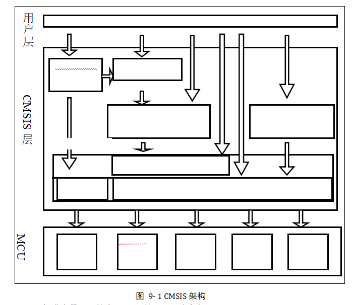
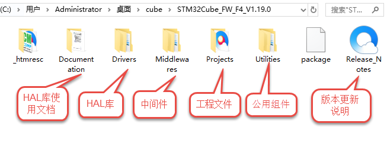
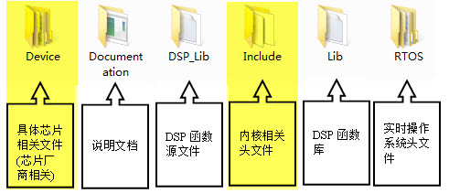
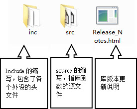
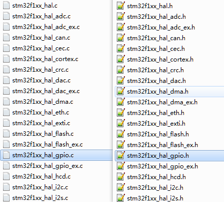
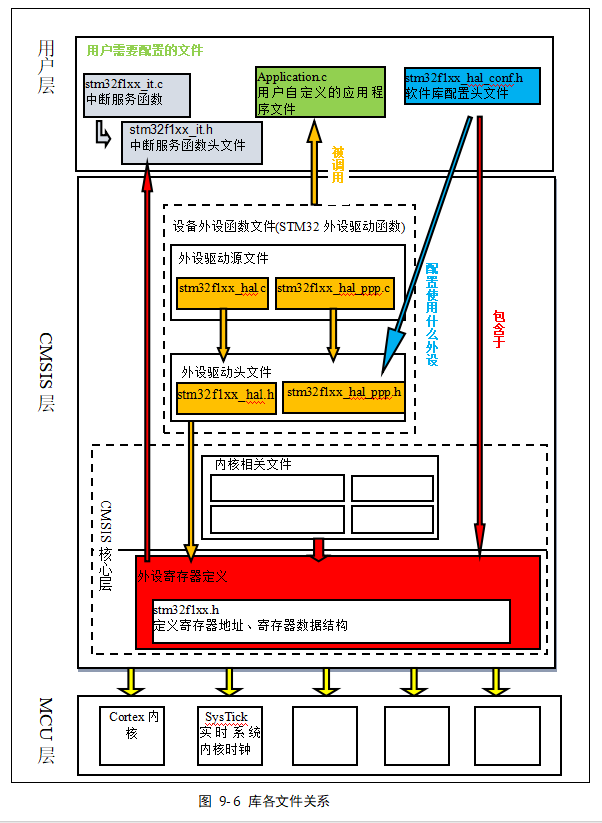

.. vim: syntax=rst

初识HAL固件库
-------------

在上一章中，我们构建了几个控制GPIO外设的函数，算是实现了函数库的雏形，但GPIO还有很多功能函数我们没有实现，而且STM32芯片不仅仅只有GPIO这一个外设。如果我们想要亲自完成这个函数库，工作量是非常巨大的。ST公司提供的HAL软件库，包含了STM32芯片所有寄存器的控制操作，我们直接学习如何使用ST的HAL库，会极大地方便控制STM32芯片。。

CMSIS标准及库层次关系
~~~~~~~~~~~~~~~~~~~~~

因为基于Cortex系列芯片采用的内核都是相同的，区别主要为核外的片上外设的差异，这些差异却导致软件在同内核，不同外设的芯片上移植困难。为了解决不同的芯片厂商生产的Cortex微控制器软件
的兼容性问题，ARM与芯片厂商建立了CMSIS标准(Cortex MicroController
Software Interface Standard)。

所谓CMSIS标准，实际是新建了一个软件抽象层。见 图9_1_。

CMSIS标准中最主要的为CMSIS核心层，它包括了：

-  内核函数层：其中包含用于访问内核寄存器的名称、地址定义，主要由ARM公司提供。

-  设备外设访问层：提供了片上的核外外设的地址和中断定义，主要由芯片生产商提供。

可见CMSIS层位于硬件层与操作系统或用户层之间，提供了与芯片生产商无关的硬件抽象层，可以为接口外设、实时操作系统提供简单的处理器软件接口，屏蔽了硬件差异，这对软件的移植是有极大的好处的。STM32的库，就是按照CMSIS标准建立的。

库目录、文件简介
^^^^^^^^^^^^^^^^

STM32 HAL库可以从官网获得，也可以直接从本书的配套资料得到。本书讲解的例程全部采用1.5.1库文件。以下内容请大家打开STM32HAL库文件配合阅读。

解压库文件后进入其目录：

“STM32Cube_FW_F1_V1.8.0”

软件库各文件夹的内容说明见 图9_2_。

目录：STM32Cube_FW_F1_V1.8.0\\

-  Documentation：文件夹下是HAL库帮助文档，主要讲述如何使用驱动库来编写自己的应用程序。说得形象一点就是告诉我们：
   ST公司已经为你写好了每个外设的驱动了，想知道如何运用这些例子就来向我求救吧。不幸的是，这个帮助文档是英文的，
   这对很多英文不好的朋友来说是一个很大的障碍。但这里要告诉大家，英文仅仅是一种工具，绝对不能让它成为我们学习的障碍。
   其实这些英文还是很简单的，我们需要的是拿下它的勇气。

-  Drivers：文件夹下是官方的CMSISI库，HAL库，板载外设驱动。

-  Middlewares：中间件，包含ST官方的STemWin、
   STM32_Audio、STM32_USB_Device_Library、STM32_USB_Host_Library；也有第三方的fatfs文件系统等等。

-  *Project
   ：*\ 文件夹下是用驱动库写的针对官方发行demo板的例子和工程模板。

-  Utilities：实用的公用组件比如LCD_LOG实用液晶打印调试信息。

-  Release_Note.html:：库的版本更新说明。

在使用库开发时，我们需要把\ *Drivers*\ 目录下的CMSIS、STM32F1xx_HAL_Driver内核与外设的库文件添加到工程中，
并查阅\ *库帮助文档*\ 来了解ST提供的库函数，这个文档说明了每一个库函数的使用方法。

先看看CMSIS文件夹。

STM32Cube_FW_F1_V1.8.0\Drivers\CMSIS\文件夹下内容。

目录：Drivers *\\CMSIS\\*

其中Device与Include中的文件是我们使用得最多的，先讲解这两个文件夹中的内容。

Include文件夹
'''''''''''''

在\ *Include文件夹*\ 中包含了
的是位于CMSIS标准的\ *核内设备函数层*\ 的Cortex-M核通用的头文件，
它们的作用是为那些采用Cortex-M核设计SOC的芯片商设计的芯片外设提供一个进入内核的接口，
定义了一些内核相关的寄存器(类似我们前面写的stm32F103xx.h文件，但定义的是内核部分的寄存器)。
这些文件在其它公司的Cortex-M系列芯片也是相同的。至于这些功能是怎样用源码实现的，可以不用管它，
只需把这些文件加进我们的工程文件即可，有兴趣的朋友可以深究，关于内核的寄存器说明，
需要查阅《cortex_M3_Technical Reference Manual》及《Cortex®-M3内核编程手册》文档，
《STM32F103xxx参考手册》只包含片上外设说明，不包含内核寄存器。

我们写STM32F1的工程，必须用到其中的四个文件：core_cm3.h、core_cmFunc.h、corecmInstr.h、core_cmSimd.h，其它的文件是属于其它内核的，还有几个文件是DSP函数库使用的头文件。

core_cM3.c文件有一些与编译器相关条件编译语句，用于屏蔽不同编译器的差异。里面包含了一些跟编译器相关的信息，如：“__CC_ARM
”(本书采用的RVMDK、KEIL)，“__GNUC_\_ ”(GNU编译器)、“ICC Compiler”
(IAR编译器)。这些不同的编译器对于C嵌入汇编或内联函数关键字的语法不一样，这段代码统一使用“__ASM、__INLINE”宏来定义，而在不同的编译器下，宏自动更改到相应的值，实现了差异屏蔽，见代码清单9‑1。

.. code-block:: c
   :caption: 代码清单9‑1：core_cm3.c文件中对编译器差异的屏蔽
   :name: 代码清单9_1

      #if   defined ( __CC_ARM )
      #define __ASM            __asm     /*!< asm keyword for ARM Compiler */
      #define __INLINE         __inline  /*!< inline keyword for ARM Compiler*/
      #define __STATIC_INLINE  static __inline

      #elif defined ( __GNUC__ )
      #define __ASM            __asm  /*!< asm keyword for GNU Compiler */
      #define __INLINE         inline /*!< inline keyword for GNU Compiler */
      #define __STATIC_INLINE  static inline

      #elif defined ( __ICCARM__ )
      #define __ASM            __asm  /*!< asm keyword for IAR Compiler */
      /*!< inline keyword for IAR Compiler. */
      #define __STATIC_INLINE  static inline
      #define __INLINE         inline

      #elif defined ( __TMS470__ )
      #define __ASM            __asm  /*!< asm keyword for TI CCS Compiler */
      #define __STATIC_INLINE  static inline

      #elif defined ( __TASKING__ )
      #define __ASM            __asm /*!< asm keyword for TASKING Compiler */
      #define __INLINE         inline /*!< inline keyword for TASKING Compiler */

      #define __STATIC_INLINE  static inline

      #elif defined ( __CSMC__ )
      #define __packed
      #define __ASM            _asm /*!< asm keyword for COSMIC Compiler */
      /*use -pc99 on compile line !< inline keyword for COSMIC Compiler   */
      #define __INLINE         inline
      #define __STATIC_INLINE  static inline

      #endif

较重要的是在core_cm3.c文件中包含了“stdint.h” 这个头文件，这是一个ANSI C
文件，是独立于处理器之外的，就像我们熟知的C语言头文件 “stdio.h”
文件一样。位于RVMDK这个软件的安装目录下，主要作用是提供一些类型定义。见 代码清单9_2_。

.. code-block:: c
   :caption: 代码清单9‑2：\ *stdint.c*\ 文件中的类型定义
   :name: 代码清单9_2

      /* exact-width signed integer types */
      typedef   signed          char int8_t;
      typedef   signed short     int int16_t;
      typedef   signed           int int32_t;
      typedef   signed       __int64 int64_t;

      /* exact-width unsigned integer types */
      typedef unsigned          char uint8_t;
      typedef unsigned short     int uint16_t;
      typedef unsigned           int uint32_t;
      typedef unsigned       __int64 uint64_t;

这些新类型定义屏蔽了在不同芯片平台时，出现的诸如int的大小是16位，还是32位的差异。所以在我们以后的程序中，都将使用新类型如\ *uint8_t
、uint16_t等。*

在稍旧版的程序中还经常会出现如\ *u8、u16、u32*\ 这样的类型，分别表示的无符号的8位、16位、32位整型。
初学者碰到这样的旧类型感觉一头雾水，它们定义的位置在\ *Stm32F103xx.h*\ 文件中。
建议在以后的新程序中尽量使用\ *uint8_t、uint16_t*\ 类型的定义。

*core_cm3.c*\ 跟启动文件一样都是底层文件，都是由ARM公司提供的，遵守CMSIS标准，即所有CM3芯片的库都带有这个文件，
这样软件在不同的CM3芯片的移植工作就得以简化。

Device文件夹
''''''''''''

在\ *Device*\ 文件夹下的是具体芯片直接相关的文件，包含启动文件、芯片\ *外设寄存器定义、
系统时钟初始化功能的*\ 一些文件，这是由ST公司提供的。

-  system_stm32f1xx.c文件

文件目录：\\ Drivers \\CMSIS\Device\ST\stm32f1xx\Source\Templates

*这个文件包含了STM32芯片上电后初始化系统时钟、扩展外部存储器用的函数，例如我们前两章提到供启动文件调用的“SystemInit”函数，用于上电后初始化时钟，该函数的定义就存储在system_stm32f1xx.c文件。STM32F103系列的芯片，调用库的这个SystemInit函数后，系统时钟被初始化为72MHz，如有需要可以修改这个文件的内容，设置成自己所需的时钟频率。*

-  *启动文件*

*文件目录：*\ Drivers *\\CMSIS\Device\ST\stm32f1xx\Source\Templates*

*在这个目录下，还有很多文件夹，如“ARM”、“gcc”、“iar”等，这些文件夹下包含了对应编译平台的汇编启动文件，在实际使用时要根据编译平台来选择。我们使用的MDK启动文件在“ARM”文件夹中。其中的“strartup_STM32F103xx.s”即为STM32F103芯片的启动文件，前面两章工程中使用的启动文件就是从这里复制过去的。如果使用其它型号的芯片，要在此处选择对应的启动文件，如STM32F103型号使用“startup_stm32f103x.s”文件。*

-  *stm32F103xx.h文件*

*文件目录：*\ Drivers *\\CMSIS\Device\ST\stm32f1xx\Include*

*stm32F103xx.h*
这个文件非常重要，是一个STM32芯片底层相关的文件。它是我们前两章自己定义的“stm32F103xx.h”文件的完整版，包含了STM32中所有的外设寄存器地址和结构体类型定义，在使用到STM32
HAL库的地方都要包含这个头文件。

CMSIS文件夹中的主要内容就是这样，接下来我们看看STM32F1xx_HAL_Driver文件夹。

STM32F1xx\_ HAL \_Driver文件夹
''''''''''''''''''''''''''''''

文件目录：Drivers\STM32F1xx_HAL_Driver

进入Drivers目录下的STM32F1xx_HAL_Driver文件夹，见 图9_4_。

STM32F1xx_HAL_Driver文件夹下有\ *inc*\ （include的缩写）跟\ *src*\ （source的简写）这两个文件夹，
这里的文件属于CMSIS之外的的、芯片片上\ *外设*\ 部分。\ *src*\ 里面是每个设备外设的驱动源程序，
inc则是相对应的外设头文件。src及inc文件夹是ST的HAL库的主要内容，甚至不少人直接认为ST的HAL库就是指这些文件，可见其重要性。

在\ *src* 和\ *inc*\ 文件夹里的就是ST公司针对每个STM32外设而编写的库函数文件，每个外设对应一个*.c* 和 *.h*
后缀的文件。我们把这类外设文件统称为：\ *stm32f1xx_hal_ppp.c*
或\ *stm32f1xx_hal_ppp.h*\ 文件，PPP表示外设名称。
如在上一章中我们自建的stm32f1xx_hal_gpio.c及stm32f1xx_hal_gpio.h文件，就属于这一类。

如针对模数转换(ADC)外设，在\ *src*\ 文件夹下有一个\ *stm32f1xx_hal_adc.c*\ 源文件，
在\ *inc*\ 文件夹下有一个\ *stm32f1xx_hal_adc.h*\ 头文件，若我们开发的工程中用到了STM32内部的ADC，
则至少要把这两个文件包含到工程里。见 图9_5_。

stm32f1xx_it.c、 stm32f1xx_hal_conf.h文件
'''''''''''''''''''''''''''''''''''''''''

文件目录：STM32Cube_FW_F4_V1.19.0\Projects\STM32F103ZI-Nucleo\Templates

在这个文件目录下，存放了官方的一个库工程模板，我们在用库建立一个完整的工程时，
还需要添加这个目录下src文件夹中\ *stm32f1xx_it.c*\ 和inc文件夹中
和\ *stm32f1xx_it.h、stm32f1xx_hal_conf.h*\ 这三个文件。

*stm32f1xx_it.c：这个文件*\ 是专门用来编写中断服务函数的，在我们修改前，
这个文件已经定义了一些\ *系统异常(特殊中断)*\ 的接口，其它普通中断服务函数由我们自己添加。
但是我们怎么知道这些中断服务函数的接口如何写？是不是可以自定义呢？答案当然不是的，
这些都有可以在汇编启动文件中找到，在学习中断和启动文件的时候我们会详细介绍

*stm32f1xx_hal_conf.h*\ ：这个文件被包含进\ *stm32f103xx.h*
文件。STM32HAL库支持所有STM32F1型号的芯片，但有的型号芯片外设功能比较多，所以使用这个配置文件根据芯片型号增减ST库的外设文件,
另外时钟源配置也是在这里进行设置。见 代码清单9_3_。

.. code-block:: c
   :caption: 代码清单9‑3 stm32f1xx_hal_conf.h文件配置软件库
   :name: 代码清单9_3

      /* Includes ---------------------------------*/
      /**
      * @brief Include module's header file
      */

      #ifdef HAL_RCC_MODULE_ENABLED
      #include "stm32f1xx_hal_rcc.h"
      #endif /* HAL_RCC_MODULE_ENABLED */

      #ifdef HAL_GPIO_MODULE_ENABLED
      #include "stm32f1xx_hal_gpio.h"
      #endif /* HAL_GPIO_MODULE_ENABLED */

      #ifdef HAL_DMA_MODULE_ENABLED
      #include "stm32f1xx_hal_dma.h"
      #endif /* HAL_DMA_MODULE_ENABLED */

      #ifdef HAL_CORTEX_MODULE_ENABLED
      #include "stm32f1xx_hal_cortex.h"
      #endif /* HAL_CORTEX_MODULE_ENABLED */

      #ifdef HAL_ADC_MODULE_ENABLED
      #include "stm32f1xx_hal_adc.h"
      #endif /* HAL_ADC_MODULE_ENABLED */

      #ifdef HAL_CAN_MODULE_ENABLED
      #include "stm32f1xx_hal_can.h"
      #endif /* HAL_CAN_MODULE_ENABLED */

stm32f1xx_hal_conf.h 这个文件还可配置是否使用“断言” 编译选项，见 代码清单9_4_。

.. code-block:: c
   :caption: 代码清单 9‑4 断言配置
   :name: 代码清单9_4

      #ifdef  USE_FULL_ASSERT

      /**
      * @brief  The assert_param macro is used for  parameters check.
      * @param  expr: If expr is false, it calls assert_failed function
      *   which reports the name of the source file and the source
      *   line number of the call that failed.
      *   If expr is true, it returns no value.
      * @retval None
      */
      #define assert_param(expr) ((expr) ? (void)0 : assert_failed((uint8_t
      *)__FILE__, __LINE__))
      /* Exported functions ---------------------------------- */
      void assert_failed(uint8_t* file, uint32_t line);
      #else
      #define assert_param(expr) ((void)0)
      #endif /* USE_FULL_ASSERT */

在ST的HAL库函数中，一般会包含输入参数检查，即上述代码中的“assert_param”宏，当参数不符合要求时，会调用“assert_failed”函数，这个函数默认是空的。

实际开发中使用断言时，先通过定义USE_FULL_ASSERT 宏来使能断言，然后定义“assert_failed”函数，
通常我们会让它调用printf函数输出错误说明。使能断言后，程序运行时会检查函数的输入参数，
当软件经过测试，可发布时，会取消USE_FULL_ASSERT宏来去掉断言功能，使程序全速运行。

库各文件间的关系
^^^^^^^^^^^^^^^^

前面向大家简单介绍了各个库文件的作用，库文件是直接包含进工程即可，丝毫不用修改，
而有的文件就要我们在使用的时候根据具体的需要进行配置。接下来从整体上把握一下各个文件在库工程中的层次或关系，
这些文件对应到CMSIS标准架构上。见 图9_6_。

图9_6_ 描述了STM32库各文件之间的调用关系，这个图省略了DSP核和实时系统层部分的文件关系。
在实际的使用库开发工程的过程中，我们把位于CMSIS层的文件包含进工程，除了特殊系统时钟需要修改system_stm32f1xx.c，其它文件丝毫不用修改，也不建议修改。

对于位于用户层的几个文件，就是我们在使用库的时候，针对不同的应用对库文件进行增删（用条件编译的方法增删）和改动的文件。

使帮助文档
~~~~~~~~~~

我坚信，授之以鱼不如授之以渔。官方资料是所有关于STM32知识的源头，所以在本小节介绍如何使用官方资料。官方的帮助手册，是最好的教程，几乎包含了所有在开发过程中遇到的问题。这些资料已整理到了本书附录资料中。

常用官方资料
^^^^^^^^^^^^

-  《STM32F10X-中文参考手册》

这个文件全方位介绍了STM32芯片的各种片上外设，它把STM32的时钟、存储器架构、及各种外设、寄存器都描述得清清楚楚。当我们对STM32的外设感到困惑时，可查阅这个文档。以直接配置寄存器方式开发的话，查阅这个文档寄存器部分的频率会相当高，但这样效率太低了。

-  《STM32规格书》

本文档相当于STM32的datasheet，包含了STM32芯片所有的引脚功能说明及存储器架构、芯片外设架构说明。后面我们使用STM32其它外设时，常常需要查找这个手册，了解外设对应到STM32的哪个GPIO引脚。

-  《Cortex™-M3内核编程手册》

本文档由ST公司提供，主要讲解STM32内核寄存器相关的说明，例如系统定时器、NVIC等核外设的寄存器。这部分的内容是《STM32F10X-中文参考手册》没涉及到的内核部分的补充。相对来说，本文档虽然介绍了内核寄存器，但不如以下两个文档详细，要了解内核时，可作为以下两个手册的配合资料使用。

-  《Cortex-M3权威指南》。

这个手册是由ARM公司提供的，它详细讲解了Cortex内核的架构和特性，要深入了解Cortex-M内核，这是首选，经典中的经典。这个手册也被翻译成中文，出版成书，我们配套的资料里面有提供中文版的电子版。

-  《STM32F103xG_User_Manual.chm》

这个就是本章提到的库的帮助文档，在使用库函数时，我们最好通过查阅此文件来了解HAL库提供了哪些外设、函数原型或库函数的调用的方法。
也可以直接阅读源码里面的函数的函数说明。
